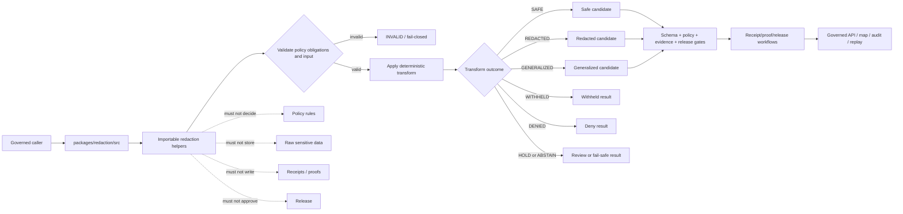

<!-- [KFM_META_BLOCK_V2]
doc_id: kfm://doc/NEEDS-VERIFICATION/packages-redaction-src-readme
title: Redaction Package Source README
type: readme
version: v1
status: draft
owners: OWNER_TBD
created: NEEDS VERIFICATION — target file existed before this repair but contained only placeholder text
updated: 2026-06-15
policy_label: public
related: [packages/redaction/README.md, packages/policy-runtime/README.md, packages/geo/README.md, packages/hashing/README.md, packages/identity/README.md, packages/envelopes/README.md, packages/README.md, docs/doctrine/directory-rules.md, docs/doctrine/sensitivity.md, docs/architecture/sensitivity.md, docs/architecture/sensitive-domain-fail-closed.md, docs/standards/REDACTION_DETERMINISM.md, docs/standards/SENSITIVITY_RUBRIC.md, docs/security/DATA_CLASSIFICATION.md, policy/, contracts/, schemas/contracts/v1/, data/receipts/, data/proofs/, release/]
tags: [kfm, packages, redaction, src, privacy, sensitivity, geoprivacy, dna, living-person, location-generalization, redaction-receipt]
notes: ["Source-directory guide for deterministic redaction and generalization helper code.", "This directory may contain source code for policy-supplied redaction obligations, field masking, geometry generalization, living-person suppression, DNA/genomic masking, receipt-ready metadata, replay metadata, validation, and synthetic fixtures only.", "It must not own policy rules, schemas, contracts, lifecycle data, source records, receipts, proofs, release decisions, API routes, UI surfaces, credentials, model runtimes, or AI truth claims."]
[/KFM_META_BLOCK_V2] -->

<a id="top"></a>

# Redaction Package Source

Source-code envelope for KFM deterministic redaction, masking, withholding, aggregation, and generalization helpers.

<p>
  
  
  
  
  
  
</p>

> [!IMPORTANT]
> **Status:** PROPOSED source-directory README  
> **Path:** `packages/redaction/src/README.md`  
> **Owning responsibility root:** `packages/`  
> **Package lane:** `packages/redaction/`  
> **Import/package layout:** NEEDS VERIFICATION  
> **Policy authority:** `policy/`, not this source tree  
> **Schema authority:** `schemas/contracts/v1/`, not this source tree  
> **Contract authority:** `contracts/`, not this source tree  
> **Receipt/proof authority:** `data/receipts/` and `data/proofs/`, not this source tree  
> **Release authority:** `release/`, not this source tree  
> **Repo implementation depth:** UNKNOWN for package metadata, import style, tests, CI workflows, emitted receipts, proof packs, release manifests, branch protections, and runtime behavior.

## Scope

`packages/redaction/src/` is the proposed source-code root for the Redaction package.

This directory is for importable helper code used by policy-runtime, pipelines, tile builders, map assemblers, governed APIs, Evidence Drawer payload assemblers, receipts, proof builders, release gates, replay tools, and tests when they need deterministic redaction and public-safe output shaping.

This source tree may support helpers for:

- applying policy-supplied redaction obligations to text, attributes, geometry, tabular fields, graph edges, and map feature properties;
- masking, suppressing, bucketing, omitting, or withholding restricted fields;
- suppressing or masking living-person identifiers, household/private-property context, contact details, and similar restricted personal fields;
- masking, suppressing, withholding, or refusing DNA/genomic and genealogy-sensitive fields according to explicit policy decisions;
- generalizing, aggregating, jittering, binning, delaying, withholding, or denying precise locations for rare species, archaeology, infrastructure, sacred/cultural places, living-person records, and other sensitive exact-location contexts;
- producing public-safe candidate records, features, layer properties, summaries, and evidence-drawer fragments after policy and evidence gates supply obligations;
- preparing receipt-ready transform metadata, including transform id, method id, parameter profile, policy decision ref, input hash, output hash, sensitivity reason, review flag, release ref, rollback ref, and correction ref;
- supporting deterministic replay of redaction decisions without exposing raw sensitive inputs;
- building synthetic no-network fixtures for safe, redacted, generalized, withheld, denied, held, abstained, invalid, and replay-drift paths.

This source tree must not decide policy, classify sensitivity as authority, fetch sources, store raw sensitive data, write receipts, write proofs, approve releases, publish artifacts, expose public routes, render UI, write map styles, or generate truth claims.

```text
RAW -> WORK / QUARANTINE -> PROCESSED -> CATALOG / TRIPLET -> PUBLISHED
```

Redaction source code may transform candidates before downstream release or rendering. It does not own lifecycle state, source authority, sensitivity policy, evidence authority, receipt state, proof state, review state, release state, or public truth.

[⬆ Back to top](#top)

---

## Repo fit

```text
packages/redaction/src/
```

`packages/` is the responsibility root for shared reusable code. `redaction/` is the package segment. `src/` is the source-code envelope.

| Relationship | Expected home | Boundary rule |
| --- | --- | --- |
| Redaction source code | `packages/redaction/src/` | Deterministic transform helpers and receipt-ready metadata only. |
| Importable module | `packages/redaction/src/redaction/` or repo-confirmed namespace | Package namespace, subject to repo package convention verification. |
| Package entry README | `packages/redaction/README.md` | Explains the package as a whole. |
| Policy decisions and obligations | `policy/` plus `packages/policy-runtime/` | Policy decides whether to redact, restrict, hold, abstain, or deny. |
| Geometry primitives | `packages/geo/` | CRS, geometry validity, scale, and uncertainty helpers. |
| Hash helpers | `packages/hashing/` | Computes input/output/spec/artifact hashes for replay. |
| Identity helpers | `packages/identity/` | Handles deterministic ids and refs. |
| Runtime envelopes | `packages/envelopes/` | Maps redaction-related outcomes into finite runtime/public envelopes. |
| Semantic contracts | `contracts/` | Defines transform meaning and obligations. |
| Machine schemas | `schemas/contracts/v1/` | Defines redaction receipt, policy decision, transform, and feature shapes. |
| Lifecycle data | `data/<phase>/` | Owns raw/intermediate/processed/published records and artifacts. |
| Receipts and proofs | `data/receipts/`, `data/proofs/` | Stores RedactionReceipt and proof artifacts. |
| Release decisions | `release/` | Owns promotion, publication, correction, rollback, and supersession. |
| Public API and UI | `apps/`, `ui/`, `web/`, or repo-confirmed equivalents | Consume transformed outputs through governed interfaces; source internals are not public authority. |
| Tests and fixtures | `tests/packages/redaction/`, `fixtures/packages/redaction/`, or repo-confirmed equivalents | Proves deterministic behavior with synthetic public-safe fixtures. |

> [!WARNING]
> A source-code directory is not a policy source root, schema root, contract root, lifecycle data store, receipt store, proof store, release home, public API, UI surface, or source-record home.

[⬆ Back to top](#top)

---

## Accepted inputs

Functions in this source tree should accept explicit, inspectable values from governed callers. They should not fetch missing facts from source systems, raw stores, hidden globals, UI state, operator memory, or generated language.

| Input family | Accepted examples | Required handling |
| --- | --- | --- |
| Policy context | PolicyDecision ref, obligations, audience, sensitivity posture, reason codes | Apply supplied obligations; do not decide policy. |
| Transform context | transform id, method id, parameter profile, deterministic seed, version | Preserve replayability and method identity. |
| Field context | property path, field class, personal/sensitive flag, allowed output class | Redact, mask, omit, bucket, or preserve according to explicit obligations. |
| Geometry context | geometry ref, CRS, scale, uncertainty, precision, generalization rule, tile/profile context | Transform before render/public output; never rely on style filters. |
| Evidence context | EvidenceRef, EvidenceBundle ref, citation-validation ref | Preserve refs; do not fabricate evidence. |
| Identity/hash context | object id, input hash, output hash, spec hash, transform hash | Consume from identity/hashing helpers or explicit caller input. |
| Lifecycle context | input phase, output phase, release state, rollback ref, correction ref | Prevent invalid public exposure. |
| Fixture context | synthetic people/DNA/location/archaeology/rare-species/infrastructure examples | Keep fixtures fake, minimized, and public-safe. |

[⬆ Back to top](#top)

---

## Exclusions

| Do not put here | Correct home or owner | Reason |
| --- | --- | --- |
| Policy rules and sensitivity classification authority | `policy/` | Policy owns decisions and obligations. |
| JSON Schemas | `schemas/contracts/v1/` | Schemas own machine shape. |
| Semantic contracts | `contracts/` | Contracts own meaning. |
| RAW, WORK, QUARANTINE, PROCESSED, CATALOG, TRIPLET, or PUBLISHED data | `data/<phase>/` | Lifecycle state must remain phase-visible. |
| Source descriptors and source registries | `data/registry/` or repo-confirmed registry homes | Source authority, rights, cadence, and limitations are governance data. |
| Receipts, proof packs, validation reports | `data/receipts/`, `data/proofs/` | Trust artifacts must remain separately auditable. |
| Release manifests, rollback cards, correction notices | `release/` | Publication is a governed state transition. |
| Public API routes or serializers | `apps/` or repo-confirmed API app | Public clients must use governed APIs. |
| UI components, dashboards, map style filters | `apps/`, `ui/`, `web/`, or observability roots | Presentation is downstream from transformed outputs. |
| AI-generated sensitivity guesses or claims | governed AI runtime plus policy/evidence validation | AI output is interpretive and evidence-subordinate. |
| Secrets, source credentials, real DNA/genomic data, real living-person identifiers, protected-location examples | Nowhere in package fixtures | Fixtures must be synthetic and public-safe. |

[⬆ Back to top](#top)

---

## Expected source layout

> [!NOTE]
> The tree below is PROPOSED. Confirm package metadata, language conventions, import namespace, test layout, and CI before committing code beyond README files.

```text
packages/redaction/src/
├── README.md                # This file: source-code boundary and trust rules
└── redaction/
    ├── README.md            # PROPOSED: importable namespace guide
    ├── __init__.py          # PROPOSED export boundary
    ├── obligations.py       # PROPOSED policy obligation carriers
    ├── fields.py            # PROPOSED text/attribute redaction helpers
    ├── geometry.py          # PROPOSED location generalization helpers
    ├── dna.py               # PROPOSED DNA/genomic masking helpers
    ├── living_person.py     # PROPOSED living-person suppression helpers
    ├── receipts.py          # PROPOSED RedactionReceipt metadata carriers only
    ├── replay.py            # PROPOSED replay metadata helpers
    ├── validation.py        # PROPOSED transform validation helpers
    ├── fixtures.py          # PROPOSED synthetic fixtures
    └── py.typed             # PROPOSED if typed package convention is confirmed
```

Preferred import posture, subject to package verification:

```python
from redaction.fields import redact_properties
from redaction.geometry import generalize_location
from redaction.validation import validate_redaction_result
```

[⬆ Back to top](#top)

---

## Redaction helper outcomes

| Helper outcome | Use when | Runtime posture |
| --- | --- | --- |
| `SAFE` | Candidate is already safe under supplied policy obligations. | Candidate only; downstream release gates may still block. |
| `REDACTED` | Restricted attributes were masked, removed, bucketed, or suppressed. | Preserve transform metadata. |
| `GENERALIZED` | Location, geometry, time, or detail was generalized, aggregated, jittered, or binned. | Preserve method/profile and uncertainty metadata. |
| `WITHHELD` | Output is suppressed from public/semi-public surfaces but may continue internally. | Preserve reason code and review path. |
| `DENIED` | Policy or sensitivity posture blocks output. | Deny with stable reason code. |
| `HOLD` | Steward review, rights review, cultural review, or maturity gate is required. | Internal governance state; not public allow. |
| `ABSTAIN` | Required policy, evidence, rights, or transform support is missing. | Fail safe; do not produce authoritative output. |
| `INVALID` | Input, obligation, method, or output validation fails. | Fail closed with receipt-ready error metadata. |

`SAFE` is not proof of truth, evidence closure, publication, or release. It only means the redaction helper found no additional transform required under the supplied policy context.

[⬆ Back to top](#top)

---

## Trust-boundary flow



[⬆ Back to top](#top)

---

## Source anti-collapse rules

| Boundary | Preserve as | Never collapse into |
| --- | --- | --- |
| Policy obligation | Explicit input from policy runtime | Locally invented sensitivity decision |
| Redaction transform | Deterministic output shaping | Evidence truth, policy approval, or release approval |
| Location generalization | Upstream geometry transform | Client-side style hiding |
| DNA/living-person suppression | Policy-supplied restricted field handling | Genealogy or person-matching authority |
| Receipt metadata | Receipt-ready carrier | Receipt store or proof authority |
| Safe candidate | Candidate for next gate | Published artifact or public truth |
| Fixture record | Synthetic public-safe example | Real sensitive source, person, DNA, or protected-location data |

[⬆ Back to top](#top)

---

## Development rules

1. Prefer pure functions with explicit input objects.
2. Preserve policy ref, evidence refs, object ids, input hash, output hash, transform method id, parameter profile, sensitivity reason, obligations, release refs, rollback refs, and correction refs supplied by callers.
3. Do not make network calls from `src` helpers.
4. Do not read directly from RAW, WORK, QUARANTINE, unpublished candidates, source systems, source credentials, canonical stores, or model runtimes.
5. Do not write lifecycle data, policy rules, receipts, proofs, release manifests, source registries, catalog records, API responses, UI components, or map styles.
6. Do not approve release, publish artifacts, resolve evidence as truth, decide sensitivity as authority, or generate public claims.
7. Do not create schemas, contracts, policy source rules, source registries, pipeline DAGs, API routes, public answers, release decisions, or connector behavior from this source tree.
8. Do not store raw provider payloads, secrets, private source records, real living-person identifiers, DNA/genomic data, protected-location examples, or unrestricted sensitive context.
9. Return typed finite outcomes instead of implicit allow, warning-only redaction failure, hidden client-side suppression, or unsafe partial output.
10. Add deterministic tests for every behavior-changing helper and every negative path.
11. Keep fixtures synthetic, sanitized, minimized, and public-safe.
12. Preserve rollback and correction metadata supplied by callers when transformed output can affect downstream publication candidates.

[⬆ Back to top](#top)

---

## Validation checklist

- [ ] Confirm `packages/redaction/src/` exists in the mounted repo with this README as its source-directory guide.
- [ ] Confirm package manager and import convention (`pyproject.toml`, package.json, workspace config, or equivalent).
- [ ] Confirm whether this source tree is Python-only, TypeScript-only, or mixed-language.
- [ ] Confirm import namespace and whether it is `redaction`, `kfm_redaction`, or repo-specific.
- [ ] Confirm owners and CODEOWNERS path coverage.
- [ ] Confirm policy homes for redaction, sensitivity, geoprivacy, living-person, DNA/genomic, archaeology, rare species, infrastructure, cultural/tribal, rights, and release obligations.
- [ ] Confirm schema homes for redaction transforms, obligations, transform outcomes, RedactionReceipt, PolicyDecision, and public-safe feature outputs.
- [ ] Confirm relationship with `packages/policy-runtime/`, `packages/geo/`, `packages/hashing/`, `packages/identity/`, and receipt/proof homes.
- [ ] Confirm validators and tests that exercise this source tree.
- [ ] Confirm tests for `SAFE`, `REDACTED`, `GENERALIZED`, `WITHHELD`, `DENIED`, `HOLD`, `ABSTAIN`, and `INVALID` paths.
- [ ] Confirm tests for missing policy, invalid obligation, sensitive exact location, living-person suppression, DNA/genomic masking, protected-site withholding, replay drift, rollback mismatch, and no client-side-only hiding.
- [ ] Confirm helpers do not access lifecycle stores, source systems, credentials, model runtimes, or unpublished candidate stores.
- [ ] Confirm helpers do not write policy rules, receipts, proofs, release manifests, catalog records, API responses, credentials, permissions, UI state, or map styles.

Suggested inspection commands:

```bash
find packages/redaction/src -maxdepth 5 -type f | sort
git grep -n "RedactionReceipt\|redaction\|generalization\|geoprivacy\|living-person\|DNA\|genomic\|sensitive exact location\|WITHHELD\|GENERALIZED" -- packages docs contracts schemas policy tests fixtures pipelines connectors tools apps 2>/dev/null || true
git grep -n "from redaction\|import redaction\|packages/redaction/src" -- . 2>/dev/null || true
```

[⬆ Back to top](#top)

---

## Rollback

Rollback is required if this source tree:

- creates a parallel authority home for policy, schemas, contracts, registries, lifecycle data, receipts, proofs, releases, API routes, UI surfaces, credentials, model runtimes, or source data;
- treats missing policy, invalid obligation, sensitive exact location, living-person risk, DNA/genomic context, archaeology/cultural sensitivity, rare-species location, infrastructure risk, or rights gaps as implicit allow;
- writes lifecycle data, policy rules, receipts, proofs, release manifests, catalog records, API responses, or public UI state;
- fetches source data or directly reads RAW/WORK/QUARANTINE/unpublished candidates/source systems;
- hides sensitive disclosure only in client-side UI/style instead of transforming or withholding upstream;
- treats redacted output as proof of truth, evidence closure, admissibility, public safety, or release;
- stores secrets, source credentials, private source records, real living-person identifiers, DNA/genomic context, or protected-location examples in fixtures.

Rollback target: revert the redaction-source PR, keep any generated audit notes as review evidence, and file the affected behavior in `docs/registers/DRIFT_REGISTER.md` or `docs/registers/VERIFICATION_BACKLOG.md` if the mounted repo uses those registers.

[⬆ Back to top](#top)

---

## Evidence boundary

| Source | Status | Supports | Limits |
| --- | --- | --- | --- |
| Current target file | CONFIRMED | `packages/redaction/src/README.md` existed and required replacement from placeholder content. | Did not prove source implementation maturity. |
| Parent package README | CONFIRMED repo doc | `packages/redaction/` is a shared helper-code package for deterministic redaction, masking, withholding, aggregation, and generalization transforms. | Does not prove source files, package metadata, tests, or CI. |
| `packages/README.md` | CONFIRMED repo doc | `packages/` is for shared libraries used by apps, workers, pipelines, and tools. | Does not define this source namespace. |
| `docs/architecture/sensitive-domain-fail-closed.md` | CONFIRMED repo search result | Sensitive-domain fail-closed architecture exists as a repo doc. | Content was not re-read in full for this source README pass. |
| `docs/standards/REDACTION_DETERMINISM.md` | CONFIRMED repo search result | Redaction determinism standard exists as a repo doc. | Content was not re-read in full for this source README pass. |
| Current file-generation pass | CONFIRMED request | User-requested target path and README repair/replacement. | Does not inspect package metadata, tests, CI logs, dashboards, deployment posture, runtime behavior, or branch protection. |

[⬆ Back to top](#top)
