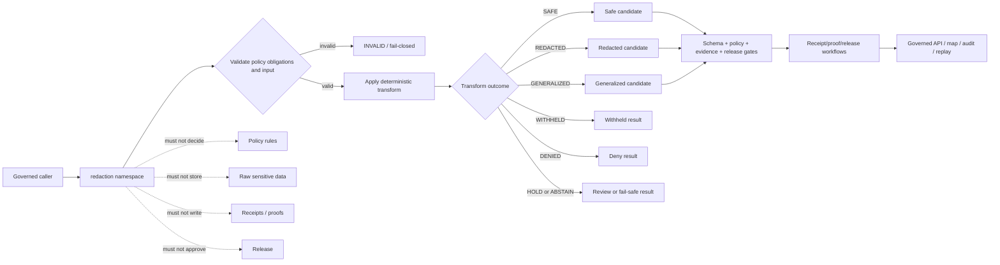

<!-- [KFM_META_BLOCK_V2]
doc_id: kfm://doc/NEEDS-VERIFICATION/packages-redaction-src-redaction-readme
title: Redaction Import Namespace README
type: readme
version: v1
status: draft
owners: OWNER_TBD
created: NEEDS VERIFICATION — target file existed before this repair but contained only placeholder text
updated: 2026-06-15
policy_label: public
related: [packages/redaction/README.md, packages/redaction/src/README.md, packages/policy-runtime/README.md, packages/geo/README.md, packages/hashing/README.md, packages/identity/README.md, packages/envelopes/README.md, packages/README.md, docs/doctrine/directory-rules.md, docs/doctrine/sensitivity.md, docs/architecture/sensitivity.md, docs/architecture/sensitive-domain-fail-closed.md, docs/standards/REDACTION_DETERMINISM.md, docs/standards/SENSITIVITY_RUBRIC.md, docs/security/DATA_CLASSIFICATION.md, policy/, contracts/, schemas/contracts/v1/, data/receipts/, data/proofs/, release/]
tags: [kfm, packages, redaction, import-namespace, privacy, sensitivity, geoprivacy, dna, living-person, location-generalization, redaction-receipt]
notes: ["Namespace guide for importable deterministic redaction and generalization helper code.", "This namespace may expose obligation, field, geometry, DNA/genomic, living-person, receipt-metadata, replay, validation, and synthetic fixture helpers only.", "It must not own policy rules, schemas, contracts, lifecycle data, source records, receipts, proofs, release decisions, API routes, UI surfaces, credentials, model runtimes, or AI truth claims."]
[/KFM_META_BLOCK_V2] -->

<a id="top"></a>

# `redaction` Import Namespace

Importable helper namespace for KFM deterministic redaction, masking, withholding, aggregation, and generalization transforms.

<p>
  
  
  
  
  
  
</p>

> [!IMPORTANT]
> **Status:** PROPOSED import-namespace README  
> **Path:** `packages/redaction/src/redaction/README.md`  
> **Owning responsibility root:** `packages/`  
> **Package lane:** `packages/redaction/`  
> **Source envelope:** `packages/redaction/src/`  
> **Import namespace:** `redaction` — NEEDS VERIFICATION against package metadata  
> **Policy authority:** `policy/`, not this namespace  
> **Schema authority:** `schemas/contracts/v1/`, not this namespace  
> **Contract authority:** `contracts/`, not this namespace  
> **Receipt/proof authority:** `data/receipts/` and `data/proofs/`, not this namespace  
> **Release authority:** `release/`, not this namespace  
> **Repo implementation depth:** UNKNOWN for module files, exports, tests, package manager, CI workflows, emitted receipts, proof packs, release manifests, branch protections, and runtime behavior.

## Scope

`packages/redaction/src/redaction/` is the proposed importable namespace for reusable redaction and public-safe transform helper code.

It may contain pure, deterministic helpers for:

- applying policy-supplied redaction obligations to explicit caller-provided records, feature properties, geometry candidates, summaries, graph edges, and evidence-drawer fragments;
- masking, suppressing, bucketing, omitting, or withholding restricted fields;
- suppressing or masking living-person identifiers, household/private-property context, contact details, and similar restricted personal fields;
- masking, suppressing, withholding, or refusing DNA/genomic and genealogy-sensitive fields according to explicit policy decisions;
- generalizing, aggregating, jittering, binning, delaying, withholding, or denying precise locations for rare species, archaeology, infrastructure, sacred/cultural places, living-person records, and other sensitive exact-location contexts;
- carrying receipt-ready transform metadata, including transform id, method id, parameter profile, policy decision ref, input hash, output hash, sensitivity reason, review flag, release ref, rollback ref, and correction ref;
- supporting deterministic replay of redaction decisions without exposing raw sensitive inputs;
- synthetic no-network fixtures for safe, redacted, generalized, withheld, denied, held, abstained, invalid, and replay-drift paths.

This namespace must not decide policy, classify sensitivity as authority, fetch sources, store raw sensitive data, write receipts, write proofs, approve releases, publish artifacts, expose public routes, render UI, write map styles, or generate truth claims.

## Namespace contract

The namespace is a transform helper boundary, not a policy, evidence, source, or release authority boundary.

| Namespace concern | Expected behavior | Authority home |
| --- | --- | --- |
| Obligations | Consume explicit policy-supplied obligations. | `policy/` and `packages/policy-runtime/` decide obligations. |
| Field redaction | Mask, omit, bucket, or preserve fields according to supplied obligations. | Schemas/contracts define persisted shapes and meaning. |
| Geometry generalization | Transform exact geometry before public rendering when required. | Policy and release workflows decide display eligibility. |
| DNA/living-person suppression | Handle restricted fields from explicit policy context. | Domain, policy, rights, and review roots own authority. |
| Receipt metadata | Build RedactionReceipt-ready carriers from explicit inputs. | `data/receipts/` stores receipts; proof homes store proof artifacts. |
| Replay support | Preserve method/profile, input/output hashes, and transform version. | Receipt/proof/release workflows own replay authority. |
| Fixtures | Produce synthetic stable examples for tests only. | `tests/` and `fixtures/`, not production sensitive data. |

## Expected modules

> [!NOTE]
> The tree below is PROPOSED. Confirm actual language, module names, package manager, and tests before treating these as implementation facts.

```text
packages/redaction/src/redaction/
├── README.md              # This file: namespace guide
├── __init__.py            # PROPOSED export boundary
├── obligations.py         # PROPOSED policy obligation carriers
├── fields.py              # PROPOSED text/attribute redaction helpers
├── geometry.py            # PROPOSED location generalization helpers
├── dna.py                 # PROPOSED DNA/genomic masking helpers
├── living_person.py       # PROPOSED living-person suppression helpers
├── receipts.py            # PROPOSED RedactionReceipt metadata carriers only
├── replay.py              # PROPOSED replay metadata helpers
├── validation.py          # PROPOSED transform validation helpers
├── fixtures.py            # PROPOSED synthetic fixtures
└── py.typed               # PROPOSED if typed package convention is confirmed
```

Keep implementation smaller than this until schemas, tests, and callers prove the need.

## Allowed exports

| Export family | Examples | Rule |
| --- | --- | --- |
| Obligation helpers | `RedactionObligation`, `normalize_obligations` | Consume explicit policy output; do not decide policy. |
| Field helpers | `redact_properties`, `mask_value`, `omit_fields`, `bucket_value` | Transform caller-provided fields only. |
| Geometry helpers | `generalize_location`, `withhold_geometry`, `aggregate_geometry` | Transform before public render; do not rely on style hiding. |
| DNA helpers | `mask_genomic_context`, `withhold_dna_fields` | Never expose real DNA/genomic fixture data. |
| Living-person helpers | `suppress_living_person_fields`, `mask_contact_fields` | Preserve reason codes and review flags. |
| Receipt metadata helpers | `RedactionReceiptMetadata`, `build_redaction_metadata` | Prepare metadata only; do not write receipts. |
| Replay helpers | `RedactionReplayExpectation`, `compare_redaction_replay` | Return drift/match states; do not certify release. |
| Validation helpers | `validate_redaction_result`, `assert_no_restricted_fields` | Local helper validation only. |
| Fixture helpers | `safe_fixture`, `redacted_fixture`, `generalized_fixture` | Synthetic and public-safe only. |

## Disallowed exports

Do not export functions that turn this helper namespace into an authority surface.

| Disallowed export | Why |
| --- | --- |
| `evaluate_policy`, `classify_sensitivity`, `allow_public` | Policy and sensitivity decisions belong to policy systems. |
| `read_raw`, `fetch_source`, `poll_connector` | Source and lifecycle access belongs to connectors, pipelines, and data roots. |
| `write_receipt`, `write_proof`, `store_evidence_bundle` | Receipts/proofs/evidence storage are separate trust homes. |
| `approve_release`, `publish`, `promote`, `rollback_release` | Release authority belongs under `release/` and governed workflows. |
| `create_schema`, `create_contract`, `register_source` | Schemas, contracts, and source registries have dedicated roots. |
| `style_filter_sensitive_geometry`, `hide_in_ui_only` | Client-side hiding is not redaction. |
| `call_model`, `generate_claim`, `infer_sensitive_truth` | AI output is interpretive and belongs behind governed AI placement. |
| `trust_redaction_as_truth`, `bypass_review`, `force_safe` | A transform result is not truth, release, or public-safety authority. |

## Import posture

Preferred imports, subject to package metadata verification:

```python
from redaction.fields import redact_properties
from redaction.geometry import generalize_location
from redaction.validation import validate_redaction_result
from redaction.receipts import build_redaction_metadata
```

Callers should treat redaction output as a candidate for schema validation, policy gates, evidence checks, receipt/proof persistence, release review, governed API envelope construction, and replay comparison. A redacted or generalized result is not public truth by itself.

## Redaction helper outcomes

| Helper outcome | Use when | Runtime posture |
| --- | --- | --- |
| `SAFE` | Candidate is already safe under supplied policy obligations. | Candidate only; downstream release gates may still block. |
| `REDACTED` | Restricted attributes were masked, removed, bucketed, or suppressed. | Preserve transform metadata. |
| `GENERALIZED` | Location, geometry, time, or detail was generalized, aggregated, jittered, or binned. | Preserve method/profile and uncertainty metadata. |
| `WITHHELD` | Output is suppressed from public/semi-public surfaces but may continue internally. | Preserve reason code and review path. |
| `DENIED` | Policy or sensitivity posture blocks output. | Deny with stable reason code. |
| `HOLD` | Steward review, rights review, cultural review, or maturity gate is required. | Internal governance state; not public allow. |
| `ABSTAIN` | Required policy, evidence, rights, or transform support is missing. | Fail safe; do not produce authoritative output. |
| `INVALID` | Input, obligation, method, or output validation fails. | Fail closed with receipt-ready error metadata. |

`SAFE` is not proof of truth, evidence closure, publication, or release. It only means the redaction helper found no additional transform required under the supplied policy context.

## Trust-boundary flow



## Development rules

1. Keep the namespace no-network by default.
2. Prefer pure functions with explicit input objects.
3. Preserve policy ref, evidence refs, object ids, input hash, output hash, transform method id, parameter profile, sensitivity reason, obligations, release refs, rollback refs, and correction refs supplied by callers.
4. Do not read from RAW, WORK, QUARANTINE, unpublished candidates, source systems, source credentials, canonical stores, or model runtimes.
5. Do not write lifecycle data, policy rules, receipts, proofs, release manifests, source registries, catalog records, API responses, UI components, or map styles.
6. Do not approve release, publish artifacts, resolve evidence as truth, decide sensitivity as authority, or generate public claims.
7. Do not create schemas, contracts, policy source rules, source registries, pipeline DAGs, API routes, public answers, release decisions, or connector behavior from this namespace.
8. Do not store raw provider payloads, secrets, private source records, real living-person identifiers, DNA/genomic data, protected-location examples, or unrestricted sensitive context.
9. Return typed finite outcomes instead of implicit allow, warning-only redaction failure, hidden client-side suppression, or unsafe partial output.
10. Add deterministic tests for every export and every negative path.
11. Keep fixtures synthetic, sanitized, minimized, and public-safe.
12. Preserve rollback and correction metadata supplied by callers when transformed output can affect downstream publication candidates.

## Validation checklist

- [ ] Confirm this namespace exists in package metadata.
- [ ] Confirm the package import name is actually `redaction`.
- [ ] Confirm `__init__` exports are intentional and minimal.
- [ ] Confirm tests cover `SAFE`, `REDACTED`, `GENERALIZED`, `WITHHELD`, `DENIED`, `HOLD`, `ABSTAIN`, and `INVALID` helper states if implemented.
- [ ] Confirm tests cover missing policy, invalid obligation, sensitive exact location, living-person suppression, DNA/genomic masking, protected-site withholding, replay drift, rollback mismatch, and no client-side-only hiding.
- [ ] Confirm helpers do not import connectors, data stores, policy engines, release writers, model providers, API routers, UI components, credential systems, or receipt/proof stores.
- [ ] Confirm helpers do not access RAW/WORK/QUARANTINE, source systems, credentials, model runtimes, or unpublished candidate stores.
- [ ] Confirm public-facing API routes serialize redaction-derived status through governed envelopes and do not expose raw sensitive internals.

Suggested inspection commands:

```bash
find packages/redaction/src/redaction -maxdepth 3 -type f | sort
git grep -n "from redaction\|import redaction" -- . 2>/dev/null || true
git grep -n "RedactionReceipt\|redaction\|generalization\|geoprivacy\|living-person\|DNA\|genomic\|WITHHELD\|GENERALIZED" -- packages/redaction tests fixtures docs schemas contracts policy pipelines connectors tools 2>/dev/null || true
```

## Rollback

Rollback is required if this namespace:

- becomes a parallel policy, schema, contract, source-registry, lifecycle-data, evidence/proof, receipt, release, API, UI, model-runtime, or source-data authority;
- treats missing policy, invalid obligation, sensitive exact location, living-person risk, DNA/genomic context, archaeology/cultural sensitivity, rare-species location, infrastructure risk, or rights gaps as implicit allow;
- writes lifecycle data, policy rules, receipts, proofs, release manifests, catalog records, API responses, or public UI state;
- fetches source data or directly reads RAW/WORK/QUARANTINE/unpublished candidates/source systems;
- hides sensitive disclosure only in client-side UI/style instead of transforming or withholding upstream;
- treats redacted output as proof of truth, evidence closure, admissibility, public safety, or release;
- stores secrets, source credentials, private source records, real living-person identifiers, DNA/genomic context, or protected-location examples in fixtures.

Rollback target: revert the namespace-source PR, keep generated audit notes as review evidence, and file any authority drift in `docs/registers/DRIFT_REGISTER.md` or `docs/registers/VERIFICATION_BACKLOG.md` if the mounted repo uses those registers.

## Evidence boundary

| Source | Status | Supports | Limits |
| --- | --- | --- | --- |
| Current target file | CONFIRMED | `packages/redaction/src/redaction/README.md` existed and required replacement from placeholder content. | Did not prove namespace implementation maturity. |
| Parent source README | CONFIRMED repo doc | `packages/redaction/src/` is bounded to deterministic redaction and generalization helper source code. | Does not prove package metadata, imports, tests, or CI. |
| Parent package README | CONFIRMED repo doc | `packages/redaction/` is a shared helper-code package for deterministic redaction, masking, withholding, aggregation, and generalization transforms. | Does not prove source files or runtime bindings. |
| `packages/README.md` | CONFIRMED repo doc | `packages/` is for shared libraries used by apps, workers, pipelines, and tools. | Does not define this namespace. |
| Current file-generation pass | CONFIRMED request | User-requested target path and README repair/replacement. | Does not inspect package metadata, tests, CI logs, dashboards, deployment posture, runtime behavior, or branch protection. |
