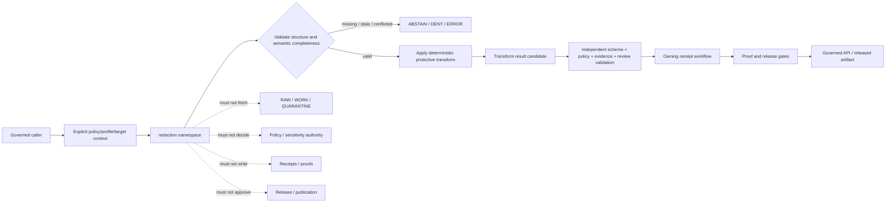

<!-- [KFM_META_BLOCK_V2]
doc_id: kfm://doc/NEEDS-VERIFICATION/packages-redaction-src-redaction-readme
title: packages/redaction/src/redaction/ — Python Namespace and Public-Safe Transform Placeholder Boundary
type: readme
version: v1.1
prior_version: v1
status: draft
owners: OWNER_TBD — Redaction steward · Sensitivity steward · Policy steward · Contracts steward · Schema steward · Security/privacy steward · Validation steward · Package steward · Runtime/API steward · Release steward · Docs steward
created: NEEDS VERIFICATION — target file existed before the evidence-grounded revisions
updated: 2026-07-19
policy_label: "public-doctrine; package-source-boundary; python-namespace; greenfield-placeholder; no-supported-api; no-network-by-default; deterministic-transform; fail-closed; sensitive-data-minimization; policy-authority-external; contract-schema-subordinate; receipt-candidate-only; evidence-subordinate; release-subordinate; no-publication-authority; correction-aware; rollback-aware"
truth_posture: >
  CONFIRMED repository-present redaction namespace, kfm-redaction distribution metadata version 0.0.0,
  empty __init__.py, comment-only core.py greenfield placeholder, packages responsibility-root doctrine,
  draft shared RedactionReceipt contract, permissive empty PROPOSED redaction-receipt schema, placeholder
  PROPOSED policy/redaction/profiles.yaml, draft redaction-profile and determinism standards, and bounded
  absence of established package exports, consumers, package-local tests, build configuration, runtime
  behavior, receipt persistence, or release use / PROPOSED a small reusable Python namespace for explicit
  deterministic protective-transform mechanics, candidate validation, replay-safe metadata, and synthetic
  test support / UNKNOWN accepted public API, build backend, Python support policy, dependency set,
  transform data models, profile activation, reason-code vocabulary, package test home, first consumer,
  CI enforcement, deployment, operational health, and release integration / NEEDS VERIFICATION owners,
  API approval, contract/schema/profile acceptance, implementation, fixtures, validators, security review,
  compatibility policy, correction process, and rollback drills
evidence_snapshot:
  repository: bartytime4life/Kansas-Frontier-Matrix
  repository_id: "1059091169"
  visibility: public
  base_ref: main
  base_commit: 69be7dafc6ab7b23961a7d419c384e62bd0c2d22
  prior_readme_blob: bb9bf99f9b9384bf30a75acab51a4c61a05238d0
  package_metadata_blob: 72ef9d9a76407e2d8fc959d0a3f1f493dfa232c7
  namespace_init_blob: e69de29bb2d1d6434b8b29ae775ad8c2e48c5391
  namespace_core_blob: 173f1a6eab02c47d829126e6b1c0bd5a5e836adb
  directory_rules_blob: 2affb080e6f0043867c64c7f06c1ca52030fbd55
  shared_receipt_contract_blob: c686cdf5c79a8b99ac66d4b01cd30d2f450f645f
  receipt_schema_blob: 6251119ecc2293cd219e4ddfa5bbde8b9d6f8f24
  profile_registry_blob: e928e91ccf278fe42ac0cd83f571ba323787573d
  profile_standard_blob: 402abcf3e231db1c2ede5ed09d0d373d574e5053
  determinism_standard_blob: 9b3f54f23fc835d4c589c0edbeada72f88766f4d
related:
  - ../../README.md
  - ../README.md
  - ../../pyproject.toml
  - __init__.py
  - core.py
  - ../../../README.md
  - ../../../../docs/doctrine/directory-rules.md
  - ../../../../docs/doctrine/trust-membrane.md
  - ../../../../docs/doctrine/lifecycle-law.md
  - ../../../../docs/architecture/sensitive-domain-fail-closed.md
  - ../../../../docs/standards/REDACTION_PROFILES.md
  - ../../../../docs/standards/REDACTION_DETERMINISM.md
  - ../../../../docs/standards/SENSITIVITY_RUBRIC.md
  - ../../../../docs/security/DATA_CLASSIFICATION.md
  - ../../../../contracts/shared/redaction_receipt.md
  - ../../../../schemas/contracts/v1/receipts/redaction_receipt.schema.json
  - ../../../../policy/redaction/profiles.yaml
  - ../../../../docs/registers/DRIFT_REGISTER.md
tags: [kfm, packages, redaction, python, namespace, scaffold, public-safe-transform, geoprivacy, sensitivity, privacy, deterministic, replay, fail-closed, receipts, correction, rollback]
notes:
  - "v1.1 expands the merged v1 boundary with audience, vocabulary, packaging, ownership, consumer, dependency, telemetry, test-matrix, implementation-sequence, definition-of-done, verification-register, compatibility, correction, and maintenance contracts."
  - "This README does not install the package, define a supported export, accept a redaction profile, implement a transform, write a receipt, authorize release, or prove operational safety."
  - "The namespace remains a greenfield placeholder at the recorded evidence snapshot."
[/KFM_META_BLOCK_V2] -->

<a id="top"></a>

# `redaction` Python Namespace and Public-Safe Transform Placeholder Boundary

`packages/redaction/src/redaction/`

> Repository-present Python namespace scaffold for a future reusable redaction and public-safe transformation library. Current evidence establishes an empty package initializer and a comment-only `core.py` placeholder—not a functional redactor, profile engine, geometry generalizer, receipt writer, policy evaluator, public API, release component, or publication authority.


**Quick links:** [Purpose](#purpose-and-audience) · [Evidence](#status-and-evidence) · [Placement](#directory-rules-and-authority) · [Vocabulary](#bounded-context-and-ubiquitous-language) · [Inventory](#confirmed-namespace-inventory) · [Packaging](#packaging-import-api-and-ownership-status) · [Responsibilities](#proposed-responsibility-envelope) · [Exclusions](#explicit-non-responsibilities) · [Contracts](#contract-schema-policy-and-standard-readiness) · [Inputs](#input-and-semantic-completeness-boundary) · [Transforms](#transform-and-profile-boundary) · [Outputs](#output-and-redactionreceipt-candidate-boundary) · [Outcomes](#finite-outcomes-and-fail-closed-behavior) · [Lifecycle](#lifecycle-and-trust-membrane) · [Effects](#side-effects-network-and-determinism) · [Replay](#identity-hashing-replay-and-freshness) · [Security](#security-privacy-and-threat-model) · [Dependencies](#dependencies-supply-chain-and-resource-bounds) · [Telemetry](#logging-telemetry-and-error-hygiene) · [Consumers](#consumer-runtime-and-public-surface-contract) · [Testing](#testing-fixtures-and-ci) · [Implementation](#smallest-sound-implementation-sequence) · [Done](#definition-of-done) · [Open](#verification-register) · [Drift](#drift-and-conflicts) · [Maintenance](#maintenance-and-change-review) · [Compatibility](#versioning-compatibility-deprecation-and-correction) · [Evidence ledger](#evidence-ledger) · [Rollback](#rollback)

> [!IMPORTANT]
> **This README is not implementation evidence for redaction.** It does not establish installation, import success, exports, accepted profiles, transform correctness, policy integration, receipt persistence, tests, CI enforcement, deployment, release use, or operational health.

> [!CAUTION]
> **Redaction is not truth or publication.** A protective transform cannot create evidence, cure unresolved rights or consent, downgrade sensitivity, satisfy review, authorize release, or make generated language authoritative.

---

## Purpose and audience

This README defines the responsibility, trust, and verification boundary for:

```text
packages/redaction/src/redaction/
```

It is written for:

- package implementers deciding what code may enter the namespace;
- policy, sensitivity, privacy, rights, and security reviewers;
- contract and schema maintainers;
- validator, fixture, and CI authors;
- pipeline, worker, API, map, export, and review-console consumers;
- release, correction, rollback, and documentation stewards.

The intended future role is narrow: provide reusable mechanics that apply an explicit, already-authorized protective transform to explicit caller-supplied input and return an inspectable candidate result.

The current role is narrower still:

- `__init__.py` is empty;
- `core.py` is a one-line placeholder;
- the package manifest is a `0.0.0` stub;
- no build backend or package discovery is declared;
- no supported export, consumer, package-local test suite, or runtime behavior was established by bounded inspection;
- the governing redaction contract, schema, profile catalog, and determinism rules remain draft, permissive, placeholder, or PROPOSED.

This README therefore records the **CONFIRMED placeholder state**, defines a **PROPOSED governed boundary**, and makes the implementation burden explicit before adoption.

[Back to top](#top)

---

## Status and evidence

| Surface | Status | Safe conclusion |
|---|---:|---|
| Target namespace | **CONFIRMED present** | The repository path exists. |
| Distribution metadata | **CONFIRMED placeholder** | Project name `kfm-redaction`, version `0.0.0`. |
| Build backend and package discovery | **NOT DECLARED** | The subpackage is not proved buildable or installable. |
| `__init__.py` | **CONFIRMED empty** | No supported exports. |
| `core.py` | **CONFIRMED comment-only** | No transform behavior. |
| Functional modules | **NOT ESTABLISHED by bounded inspection** | Prior proposed module names are not implementation facts. |
| Consumers | **NOT ESTABLISHED by bounded search** | No adoption or integration behavior is proved. |
| Package-local tests | **NOT ESTABLISHED by bounded search** | No package behavior is proved. |
| Shared `RedactionReceipt` contract | **CONFIRMED draft / PROPOSED** | Cross-domain receipt semantics exist. |
| Redaction receipt schema | **CONFIRMED permissive PROPOSED scaffold** | It has no declared properties and allows extras. |
| Redaction profile registry | **CONFIRMED placeholder / PROPOSED** | No accepted profile instance is proved. |
| Redaction profiles standard | **CONFIRMED draft / PROPOSED paths and catalog** | Intended profile burden is documented. |
| Redaction determinism standard | **CONFIRMED draft / PROPOSED concrete rules** | Intended replay burden is documented. |
| Runtime health | **UNKNOWN** | No operational package is proved. |

### Corrections and additions after v1

| Gap in v1 | v1.1 correction |
|---|---|
| No explicit audience or maintainer roles | Adds audience, ownership, and review burden. |
| No bounded vocabulary | Separates policy obligation, profile, transform, candidate, receipt, proof, and release. |
| Packaging was only briefly mentioned | Adds build, install, import, discovery, API, and side-effect gates. |
| No consumer contract | Defines first-consumer and public-surface obligations. |
| No dependency or supply-chain contract | Adds provenance, pinning, resource, and vulnerability expectations. |
| Logging and telemetry were implicit | Adds strict sensitive-data and non-authority rules. |
| Testing requirements were checklist-only | Adds a minimum positive and negative test matrix. |
| No staged implementation plan | Adds the smallest sound sequence from inert package to governed consumer. |
| No definition of done or verification register | Adds explicit completion and unresolved-item ledgers. |
| Compatibility and correction were thin | Adds API versioning, deprecation, migration, supersession, and correction rules. |
| No maintenance workflow | Adds before-change, during-change, before-review, and before-release checks. |

Open items must not be upgraded by README prose alone.

[Back to top](#top)

---

## Directory Rules and authority

Directory Rules place reusable shared libraries under `packages/` and state that a package must be reusable; one-off workflow logic belongs under `tools/` or `pipelines/`.

The namespace is correctly placed only if future code is shared, bounded, deterministic where promised, testable without production data, and subordinate to governing roots.

| Responsibility | Governing home | Namespace relationship |
|---|---|---|
| Python transform mechanics | This namespace | Candidate implementation only. |
| Distribution metadata | `packages/redaction/pyproject.toml` | Currently incomplete. |
| Policy decisions and obligations | `policy/` and policy-runtime surfaces | Consume explicit decisions; never author or select policy here. |
| Profile definitions and activation | Policy/standard/governed configuration homes | Validate supplied identity; never activate by file presence. |
| Semantic meaning | `contracts/` | Implement without redefining. |
| Machine-checkable shape | `schemas/contracts/v1/` | Validate exact accepted versions. |
| Sensitivity, rights, consent, source role | Governing registries, contracts, policy, and review | Consume explicit posture; do not discover or downgrade. |
| Geometry and CRS primitives | `packages/geo/` or accepted equivalent | Delegate; do not create parallel geometry authority. |
| Canonicalization and hashing | `packages/hashing/` or accepted equivalent | Delegate; do not create competing digest rules. |
| Runtime envelopes | `packages/envelopes/` and governed runtime contracts | Return candidate mechanics; do not define public authority. |
| Tests and fixtures | `tests/` and `fixtures/` | Prove behavior with synthetic public-safe data. |
| Receipts and proofs | `data/receipts/` and `data/proofs/` | Prepare safe metadata only; owning workflows persist. |
| Review, release, correction, rollback | Governance and `release/` | Never approve, publish, withdraw, or rewrite history. |
| Public API, UI, maps, exports | Governed application surfaces | Consume released public-safe outputs; never expose namespace internals as authority. |

This namespace may eventually execute approved transform mechanics. It must never become policy authority, sensitivity authority, evidence truth, rights or consent authority, lifecycle authority, receipt or proof storage, review approval, release approval, or public truth.

[Back to top](#top)

---

## Bounded context and ubiquitous language

| Term | Meaning here | Must not mean |
|---|---|---|
| **Protective transform** | A bounded operation that reduces disclosure or re-identification risk. | Policy approval or publication. |
| **Redaction obligation** | Caller-supplied mandatory duty produced by governing policy/review. | A hint the package may ignore. |
| **Redaction profile** | Named, versioned transform definition supplied through an accepted authority path. | Inline ad hoc parameters or newest file. |
| **Transform target** | Explicit record, field, geometry, timestamp, identifier, layer property, or derivative candidate. | Hidden database lookup. |
| **Restricted input** | Data requiring controlled handling. | Material safe to log or place in fixtures. |
| **Public-safe derivative candidate** | Output proposed for downstream validation and review. | Canonical exact truth or released artifact. |
| **Withhold** | Produce no public derivative for the target. | Silent omission without reason or audit context. |
| **Generalize** | Reduce spatial, temporal, categorical, or attribute precision. | Guarantee anonymity or formal privacy. |
| **Mask** | Replace protected detail with a safe representation. | Reversible encoding presented as redaction. |
| **Replay** | Re-run or compare a versioned transform from explicit lineage. | Re-authorize policy or release. |
| **Receipt-safe metadata** | Non-sensitive metadata suitable for a future receipt candidate. | A persisted `RedactionReceipt` or proof. |
| **`RedactionReceipt`** | Separate audit artifact recording a protective transform. | The transform implementation, policy decision, proof, or release manifest. |
| **Correction** | Transparent supersession of an erroneous transform or derivative. | Silent mutation of historical records. |
| **Release** | Governed publication state transition. | Successful function return, commit, PR, merge, or receipt. |

```text
PolicyDecision != RedactionProfile
RedactionProfile != TransformImplementation
TransformResult != RedactionReceipt
RedactionReceipt != Proof
SchemaValid != PolicyAdmissible
RedactedCandidate != ReleasedArtifact
GeneralizedRepresentation != CanonicalExactTruth
ImportSuccess != RuntimeSafety
Merge != KFM PUBLISHED
```

[Back to top](#top)

---

## Confirmed namespace inventory

```text
packages/redaction/src/redaction/
├── README.md
├── __init__.py
└── core.py
```

| Path | Status | Meaning |
|---|---:|---|
| `README.md` | **CONFIRMED** | Namespace boundary and implementation contract. |
| `__init__.py` | **CONFIRMED empty** | Marker only; no exports. |
| `core.py` | **CONFIRMED comment-only** | Greenfield placeholder. |

Not established: obligation, profile, field, geometry, temporal, categorical, masking, withholding, receipt, replay, validation, error, fixture, typing, registry, adapter, public API, test, consumer, CI, deployment, or telemetry modules.

Prior or illustrative module names remain design prompts only—not implementation, architecture approval, reserved APIs, or compatibility commitments.

[Back to top](#top)

---

## Packaging, import, API, and ownership status

Confirmed metadata:

```toml
[project]
name = "kfm-redaction"
version = "0.0.0"
```

Unconfigured or unverified surfaces include:

- build backend;
- supported Python versions;
- `src/` package discovery;
- dependencies and optional dependencies;
- entry points, scripts, or plugins;
- license metadata;
- type-marker support;
- wheel and source-distribution content;
- semantic-versioning policy;
- package publication;
- reproducible build evidence.

The distribution name `kfm-redaction` and namespace path `redaction` are present, but their mapping is not configured or tested.

Before treating the namespace as installable or importable:

1. declare an approved build backend and Python support range;
2. configure `src/` discovery explicitly;
3. declare direct, optional, and development dependencies;
4. build wheel and source artifacts in a clean environment;
5. inspect artifact contents and metadata;
6. install the built artifact—not the source tree—into a clean environment;
7. import `redaction` and verify the installed path/version;
8. prove import performs no network, policy selection, transform, secret read, logging, file write, or environment-dependent action;
9. run compatibility tests for the declared export surface;
10. document the supported API and deprecation policy.

**No public package API is established.**

### Ownership and review

`OWNER_TBD` remains unresolved. A mature package requires named responsibility for:

- package architecture and API;
- redaction and sensitivity semantics;
- policy/profile integration;
- contract and schema conformance;
- security, privacy, and supply-chain review;
- fixtures, tests, and CI;
- consumer integration;
- release, correction, deprecation, and rollback;
- documentation and evidence maintenance.

CODEOWNERS routing is review-routing evidence only. It does not prove semantic ownership, independent approval, or release authority.

[Back to top](#top)

---

## Proposed responsibility envelope

Everything in this section is **PROPOSED** until accepted and implemented.

| Candidate area | Narrow role | Excluded authority |
|---|---|---|
| Obligation input | Parse and validate explicit caller-supplied obligations. | No policy evaluation or selection. |
| Profile reference | Validate supplied id, version, digest, and status. | No discovery through mutable paths or “latest”. |
| Field transform | Remove, mask, bucket, replace, or suppress declared fields. | No hidden data fetch or schema invention. |
| Geometry transform | Generalize, aggregate, clip, simplify, centroid, or withhold explicit geometry. | No sensitivity decision or client-side-only hiding. |
| Temporal transform | Delay, bucket, coarsen, or withhold explicit time values. | No retention or release decision. |
| Categorical transform | Roll up or suppress explicit categories. | No domain truth reclassification. |
| Candidate validation | Check transform invariants and non-disclosure conditions. | No release certification. |
| Receipt-safe metadata | Prepare hashes, refs, profile identity, reason codes, and correction lineage. | No receipt persistence or signature. |
| Replay comparison | Compare explicit expected and observed transform lineage. | No policy or release re-approval. |
| Synthetic fixture builders | Produce deterministic public-safe test values. | No production or copied sensitive data. |

Keep the implementation smaller than the design space. Add a module only when a real shared consumer, accepted contract, tests, and review prove the need.

[Back to top](#top)

---

## Explicit non-responsibilities

This namespace must not:

- evaluate policy or classify sensitivity as authority;
- infer rights, consent, source role, cultural restrictions, living-person status, or disclosure eligibility;
- select a profile from a mutable directory, current date, environment fallback, UI state, or “latest” alias;
- fetch source records or access source credentials;
- query RAW, WORK, QUARANTINE, unpublished candidates, canonical stores, graph stores, search indexes, or model runtimes;
- persist canonical data, policy decisions, receipts, proofs, evidence bundles, catalogs, release manifests, corrections, or rollback records;
- create or redefine contracts, schemas, policy profiles, lifecycle states, or source registries;
- expose public routes, render UI, write map styles, publish layers, or return public answers;
- use generated language or model output as evidence, sensitivity classification, or transform authority;
- include real living-person data, DNA/genomic material, protected cultural/archaeological/ecological locations, sensitive infrastructure, private land details, or restricted source payloads in fixtures;
- log protected input, exact coordinates, transform secrets, reversible identifiers, raw policy context, or internal review notes;
- report a transform result as proof of truth, evidence closure, policy admissibility, public safety, release, or publication;
- silently ignore unknown obligations, unsupported profiles, validation failure, drift, or correction state.

[Back to top](#top)

---

## Contract, schema, policy, and standard readiness

The surrounding authority surfaces are incomplete at the evidence snapshot.

| Surface | Current posture | Namespace consequence |
|---|---|---|
| Shared `RedactionReceipt` contract | Draft / PROPOSED cross-domain semantics. | Do not treat it as accepted package API. |
| Redaction receipt schema | PROPOSED, empty `properties`, `additionalProperties: true`, no linked contract document. | Schema pass cannot prove semantic readiness. |
| Redaction profile registry | PROPOSED placeholder only. | No profile is active merely because the file exists. |
| Redaction profiles standard | Draft; intended names, fields, lifecycle, verifier, and catalog remain partly proposed. | Do not hard-code examples as stable identifiers. |
| Redaction determinism standard | Draft; concrete seed, PRNG, geometry, and receipt rules remain proposed. | No algorithm is accepted by README reference alone. |
| Sensitivity rubric | Separate standard and policy concern. | Package consumes supplied posture; it does not assign rank. |
| Domain-specific contracts/policies | May add stricter obligations. | Shared code must not erase domain-specific constraints. |

### Readiness rule

A transform is not ready for supported implementation until:

```text
semantic contract
  + machine shape or typed protocol
  + accepted policy/profile binding
  + deterministic implementation
  + valid/invalid/denied/abstained/error fixtures
  + independent validator or replay proof
  + consumer integration
  + security/privacy review
  + correction and rollback path
```

File presence, schema parse, successful import, successful function return, or successful CI job alone is insufficient.

[Back to top](#top)

---

## Input and semantic-completeness boundary

Future functions must accept explicit, inspectable values from a governed caller. They must not discover missing authority from ambient state.

| Input family | Expected caller-supplied material | Required posture |
|---|---|---|
| Policy context | Policy decision/reference, obligations, audience, reason codes, review requirements | Consume exact version; do not reinterpret or replace. |
| Profile context | Profile id/version/digest/status, method, parameters, accepted contract refs | Reject unresolved, stale, revoked, unknown, or unsupported profiles. |
| Target context | Explicit field, record fragment, geometry, timestamp, identifier, layer property, or derivative candidate | Operate only on the declared target. |
| Evidence context | EvidenceRefs/Bundles, citation-validation refs, source-role refs | Preserve; do not fabricate or resolve as truth. |
| Identity context | Stable object, transform, profile, and candidate identifiers | Keep object families distinct. |
| Hash context | Approved input/output/spec/profile hashes and canonicalization version | Delegate to accepted hashing rules. |
| Geometry context | CRS, dimensionality, scale, precision, uncertainty, validity, boundary rules | Reject unsupported or ambiguous geometry. |
| Sensitivity/rights/consent context | Explicit classifications, restrictions, revocations, review state | Fail closed when absent, stale, or conflicted. |
| Lifecycle/release context | Input phase, candidate state, release/correction/rollback refs | Preserve; do not mutate lifecycle or release. |
| Execution context | Injected clock/seed source when accepted, limits, deterministic environment | No hidden wall clock, entropy, locale, or network. |

### No-hidden-fetch invariant

Do not fill missing values from:

- source systems;
- lifecycle stores;
- registries not explicitly supplied;
- current release or current profile;
- filesystem ordering;
- process environment;
- UI/browser state;
- operator memory;
- vector search;
- AI prompts or model output.

A schema-valid input may still be semantically incomplete. The namespace must distinguish structural validation from semantic readiness and return an explicit fail-closed result.

[Back to top](#top)

---

## Transform and profile boundary

The shared contract describes protective transform classes such as removal, masking, fuzzing, generalization, aggregation, suppression, delay, clipping, simplification, and withholding. These are semantic families—not implemented functions or accepted Python module names.

| Transform family | Candidate mechanical responsibility | Required guard |
|---|---|---|
| Remove | Omit declared content from a derivative. | Preserve reason and target path without leaking value. |
| Mask | Replace declared content with a safe representation. | Prevent reversible encoding or hidden raw value. |
| Generalize | Reduce precision or granularity. | Pin method, CRS/scale, uncertainty, and profile version. |
| Aggregate | Combine multiple records into a safe unit. | Enforce minimum-group and disclosure rules externally. |
| Suppress / withhold | Produce no public derivative. | Return explicit reason and downstream block. |
| Delay | Defer eligibility until a supplied condition/time window is satisfied. | Do not own scheduler or release decision. |
| Clip / simplify | Reduce geometric exposure or complexity. | Validate topology, scale, and sensitivity obligations. |
| Fuzz / jitter | Displace values under an accepted deterministic method. | Never present as formal privacy or anonymity. |

### Profile binding

A future transform call must receive an explicit accepted profile binding. The binding should identify:

- profile id and version;
- profile digest or immutable reference;
- transform family/method;
- parameter schema and validated values;
- sensitivity ranks or policy families it is approved to satisfy;
- deterministic algorithm/canonicalization versions;
- verifier and fixture references;
- activation, deprecation, revocation, and supersession state;
- policy/review basis.

Directory presence, successful YAML parse, newest timestamp, branch name, symlink, environment variable, UI selection, or profile id string alone must not activate a profile.

[Back to top](#top)

---

## Output and `RedactionReceipt` candidate boundary

A mature helper should return a typed transform result to its governed caller. Candidate output families may include:

- public-safe derivative candidate or explicit no-output state;
- transform/profile identity and version;
- stable public-safe reason codes;
- caller-supplied policy, evidence, rights, review, release, correction, and rollback refs;
- input and output digests that do not reveal protected content;
- deterministic/replay metadata;
- validation findings and non-disclosure assertions;
- safe internal diagnostics separated from public explanations.

The output must not contain:

- the unredacted sensitive value;
- reversal-enabling secret parameters;
- raw credentials or source payloads;
- exact protected coordinates;
- living-person or DNA/genomic details;
- internal policy rules or review notes unsuitable for the audience;
- generated chain-of-thought;
- release approval or publication claims.

### Receipt separation

The namespace may prepare **receipt-safe metadata**. It must not persist, sign, approve, or release a `RedactionReceipt`.

```text
TransformResultCandidate
  -> independent validation / policy / review
  -> owning receipt workflow
  -> RedactionReceipt
  -> proof / release gates
```

A `RedactionReceipt` records that a protective transform was represented under declared context. It does not prove sufficiency or authorize publication.

[Back to top](#top)

---

## Finite outcomes and fail-closed behavior

The current package defines no runtime outcome type. Future implementation must align with accepted KFM contracts rather than inventing a private success vocabulary.

The draft determinism standard uses verifier outcomes:

| Outcome | Required posture |
|---|---|
| `ANSWER` | Bounded verification completed and checks passed. This is not release approval. |
| `ABSTAIN` | Required input or evidence is unavailable; do not guess or emit authoritative output. |
| `DENY` | Policy/profile/digest/parameter/replay validation blocks the candidate. |
| `ERROR` | Execution or verifier failure; quarantine or stop safely. |

Transform-local states such as “changed,” “unchanged,” “withheld,” or “generalized” may be useful, but their exact enum and mapping remain **PROPOSED**. They must not replace the canonical runtime/policy outcome vocabulary without an accepted contract.

A review workflow may separately use a governed hold state where policy defines one.

Never convert:

- missing context into allow;
- unsupported profile into pass-through;
- validation failure into warning-only output;
- exception into unredacted fallback;
- `ERROR` into `DENY` without preserving the process defect;
- `ANSWER` into evidence truth or release approval;
- “no transform needed” into proof that the input is public-safe.

[Back to top](#top)

---

## Lifecycle and trust membrane

```text
RAW -> WORK / QUARANTINE -> PROCESSED -> CATALOG / TRIPLET -> PUBLISHED
```

The namespace may transform an explicit candidate at a governed gate. It does not own lifecycle reads, writes, promotion, or release.



| Unsafe collapse | Required behavior |
|---|---|
| RAW ref → transform fetch | Reject hidden fetch; require explicit bounded input. |
| WORK candidate → public output | Require downstream validation, evidence, policy, review, and release. |
| QUARANTINE → normal candidate | Preserve quarantine and block exposure. |
| Schema-valid → semantically safe | Run semantic completeness and policy checks outside/around the helper. |
| Transform success → receipt persisted | Require owning receipt workflow. |
| Receipt present → proof closed | Require separate proof validation. |
| Redacted candidate → released artifact | Require release manifest and governed state transition. |
| Merge → KFM PUBLISHED | Preserve release/publication separation. |

[Back to top](#top)

---

## Side effects, network, and determinism

Core helpers should be pure or tightly bounded:

- parse explicit values;
- validate profile/obligation/target structure;
- normalize under accepted rules;
- apply deterministic transformations;
- compute or delegate safe digests;
- assemble candidate results;
- compare replay expectations;
- construct synthetic fixtures.

Core code must not:

- open network connections;
- fetch source or lifecycle data;
- select profiles from mutable paths;
- read credentials, secrets, or arbitrary environment values;
- use wall-clock time unless injected;
- use system randomness unless an accepted deterministic seed protocol explicitly requires and supplies it;
- write files, databases, receipts, proofs, releases, or logs at import time;
- sleep, retry, poll, or invoke external services internally;
- invoke AI or infer missing facts;
- emit public responses.

Given identical explicit inputs, contract/profile versions, canonicalization version, dependencies, and injected execution context, deterministic paths should produce byte-identical output or a precisely documented deterministic equivalent.

Control:

- Unicode normalization;
- field ordering;
- JSON/geometry canonicalization;
- CRS and axis order;
- numeric precision and rounding;
- floating-point behavior and tolerances;
- timestamps and time zones;
- random draws and seed material;
- dependency versions;
- error ordering;
- platform-specific paths.

[Back to top](#top)

---

## Identity, hashing, replay, and freshness

Keep separate identities for:

- source/canonical object;
- transform target;
- policy decision;
- redaction profile;
- transform implementation/version;
- transform execution event;
- derivative candidate;
- `RedactionReceipt`;
- validation report;
- proof;
- release;
- correction/withdrawal/rollback record.

Delegate repository-standard canonicalization and hashing rather than inventing a competing digest scheme.

A replay record should preserve, as applicable:

- exact accepted contract/schema/profile versions;
- immutable profile reference/digest;
- input identity and safe digest;
- output identity and safe digest;
- transform implementation/version;
- parameters and deterministic seed derivation metadata;
- CRS, precision, canonicalization, and serialization versions;
- policy/review/evidence refs;
- expected and observed result;
- dependency/environment fingerprint;
- correction/supersession state.

Replay must distinguish:

- exact match;
- semantic match under accepted tolerance;
- approved migration difference;
- unexplained drift;
- missing support;
- validation denial;
- execution error;
- comparison error.

A result may become stale because of profile revocation, policy change, rights/consent withdrawal, sensitivity reclassification, evidence correction, dependency vulnerability, algorithm defect, contract migration, or release correction. Never “refresh” stale output by rewriting timestamps. Re-run the governed process and preserve supersession lineage.

[Back to top](#top)

---

## Security, privacy, and threat model

Threats include:

- pass-through of unredacted input after error;
- client-side-only hiding;
- hidden context fetches;
- arbitrary profile paths or mutable “latest” selection;
- profile parameter injection;
- unsupported profile treated as no-op;
- dropped obligations or reason codes;
- coordinate-system confusion;
- precision/rounding leakage;
- repeated-output triangulation;
- reversible masking;
- logs or exceptions exposing restricted input;
- receipt metadata enabling re-identification;
- denial-of-service through oversized or pathological geometry;
- dependency or parser compromise;
- stale/revoked profiles continuing to run;
- public callers selecting profile, algorithm, seed, or fail-open mode;
- model output influencing sensitivity or transform authority.

Required posture:

- minimize data before entry;
- prefer references and bounded fields over whole records;
- reject oversized, deeply nested, invalid, unsupported, or ambiguous input;
- validate profile identity and parameters before transform;
- fail closed on missing/stale/conflicted policy, rights, consent, sensitivity, or review context;
- keep sensitive diagnostics internal and audience-scoped;
- prevent raw values from exceptions, traces, metrics, fixtures, and receipts;
- use constant-time or hardened primitives where secrets are eventually involved;
- make resource limits explicit;
- preserve correction and emergency-disable paths;
- require security/privacy review before a transform crosses a public boundary.

Seeded jitter and generalization are protective representations, not formal privacy guarantees. Differential privacy, k-anonymity, and cryptographic protection require separate accepted contracts and proofs.

[Back to top](#top)

---

## Dependencies, supply chain, and resource bounds

No package dependency set is currently declared.

Before adding a dependency:

- prove the function cannot be implemented safely with an already approved shared package;
- verify license and redistribution compatibility;
- pin or constrain versions according to repository policy;
- review provenance, maintainer activity, vulnerability history, transitive dependencies, native code, build hooks, and network behavior;
- prefer deterministic, side-effect-free, well-specified libraries;
- record why the dependency is needed and which transform/profile uses it;
- add vulnerability, artifact, and rollback checks;
- avoid dynamic plugin loading or arbitrary code execution.

Special scrutiny is required for:

- geometry/projection libraries;
- cryptographic and PRNG implementations;
- canonicalization and hashing libraries;
- YAML/JSON parsers;
- native extensions;
- image/geospatial codecs;
- libraries that emit telemetry or access network resources.

Future execution limits should explicitly bound:

- input bytes and field counts;
- geometry coordinate/vertex/ring/feature counts;
- recursion/nesting depth;
- transform duration;
- memory allocation;
- output expansion;
- batch size;
- retry count—normally zero inside core helpers;
- diagnostic size.

Resource-limit failure must be explicit and fail closed. It must not return partial unredacted output.

[Back to top](#top)

---

## Logging, telemetry, and error hygiene

Logs, traces, metrics, and exceptions are diagnostics—not policy decisions, receipts, evidence, proof, or release authority.

The namespace should be silent by default or use an injected diagnostics interface. It must not configure global logging or telemetry at import time.

Never emit:

- raw or partially redacted values;
- exact protected coordinates;
- private person/DNA/genomic data;
- source credentials or tokens;
- reversible identifiers;
- seed material or transform secrets;
- complete policy input bundles;
- internal review notes;
- unrestricted stack locals;
- full geometry or record payloads;
- generated chain-of-thought.

Safe diagnostics should use:

- stable operation and reason codes;
- non-sensitive object/transform refs;
- profile id/version when public-safe;
- coarse counts and bounded sizes;
- safe digests only when disclosure-reviewed;
- explicit outcome and stage;
- correlation refs controlled by the caller;
- redaction of exception messages from dependencies.

Telemetry exporters, endpoints, sampling, retention, access, and release posture belong outside this namespace. The namespace must not assume telemetry is safe merely because the payload is “metadata.”

[Back to top](#top)

---

## Consumer, runtime, and public-surface contract

No functional consumer import was established by the bounded search. Repeat consumer inspection before changing exports, paths, or behavior.

The first consumer should:

- demonstrate a shared need that justifies a package;
- use the smallest accepted symbol set;
- supply explicit immutable policy/profile/target context;
- minimize sensitive input before the call;
- enforce timeout/resource limits around effectful boundaries;
- validate the candidate result independently;
- persist receipts only through the owning workflow;
- enforce obligations and release gates downstream;
- provide integration, negative, and rollback tests;
- preserve existing public behavior until accepted migration;
- remain behind governed APIs;
- avoid exposing package internals or sensitive diagnostics.

Public clients, UI state, query parameters, map styles, export options, and AI prompts must not:

- select profiles, parameters, algorithms, seeds, or fail-open behavior;
- import package internals directly;
- bypass obligations;
- receive raw restricted input;
- infer canonical truth from a generalized representation;
- treat transform success as release approval;
- access RAW/WORK/QUARANTINE through helpers.

A mature end-to-end flow may resolve policy, supply an accepted profile, call the package, validate the candidate, persist a receipt, close proof, make a release decision, and serialize a governed response. This namespace should implement only the reusable mechanical subset.

[Back to top](#top)

---

## Testing, fixtures, and CI

Current status: no supported exports, no established package-local test suite, no accepted profile binding, and no package-specific runtime behavior.

### Minimum test matrix

| Family | Minimum proof |
|---|---|
| Build/install/import | Wheel/sdist build, clean install, import from artifact. |
| Import safety | No network, file write, profile selection, transform, secret read, logging, or telemetry setup. |
| API surface | Export list is intentional, minimal, documented, and compatibility-tested. |
| Input structure | Valid and invalid typed/schema inputs. |
| Semantic completeness | Missing policy/profile/target/evidence/rights/sensitivity/review context fails explicitly. |
| Profile binding | Id/version/digest/status/parameters/activation checked; mutable path selection denied. |
| Field transforms | Remove/mask/bucket/suppress positive and negative cases. |
| Geometry transforms | CRS, axis order, invalid geometry, precision, antimeridian, empty/multi geometry, topology, scale. |
| Temporal/categorical transforms | Boundary, timezone, bucket, roll-up, invalid and unsupported cases. |
| Determinism | Same inputs → same output across runs/platforms within accepted contract. |
| Replay | Match, semantic match, approved migration, drift, missing support, denial, error. |
| Outcomes | ANSWER/ABSTAIN/DENY/ERROR remain distinct; local states map explicitly. |
| Non-disclosure | Raw values absent from output, errors, logs, traces, metrics, receipts, and fixtures. |
| Rights/consent/sensitivity | Unknown, stale, revoked, conflicted, protected-location, living-person, DNA/genomic cases. |
| Lifecycle | RAW/WORK/QUARANTINE never become public candidates by helper action. |
| Resource safety | Oversized/nested/pathological input and timeout/memory limits. |
| Dependency failure | Parser, geometry, crypto, hash, and serialization errors fail closed. |
| Consumer integration | Governed API/pipeline integration, obligation enforcement, bypass denial. |
| Correction/rollback | Profile revocation, algorithm defect, supersession, and restoration. |

Fixtures must be:

- synthetic;
- deterministic;
- minimized;
- public-safe;
- versioned;
- paired across valid, invalid, denied, abstained, error, edge, drift, and rollback cases;
- explicit about whether they prove shape, semantics, behavior, or integration.

Do not derive fixtures from production sensitive data, even after superficial masking.

### CI expectations

A meaningful CI lane should run:

- metadata/build/install/import checks;
- lint/type/unit/property tests;
- no-network and import-side-effect tests;
- contract/schema/profile fixtures;
- deterministic and replay vectors;
- geometry edge cases;
- security, privacy, secret, and sensitive-content checks;
- dependency and artifact inspection;
- consumer integration tests;
- documentation/link validation;
- correction and rollback drills where applicable.

A green workflow proves only the checks it actually runs. TODO/echo jobs, file existence, or successful import are not transform proof.

[Back to top](#top)

---

## Smallest sound implementation sequence

### Gate 0 — ownership and authority

- [ ] Assign package, redaction, policy, sensitivity, security/privacy, validation, runtime, release, and docs owners.
- [ ] Confirm the first real shared consumer.
- [ ] Confirm Directory Rules placement and ADR triggers.
- [ ] Accept the relevant contract/schema/profile authority and vocabulary.
- [ ] Decide compatibility, correction, emergency-disable, and rollback posture.

### Gate 1 — installable inert namespace

- [ ] Complete build metadata and `src/` discovery.
- [ ] Declare Python support, dependencies, license, and type posture.
- [ ] Build/install/import in a clean environment.
- [ ] Prove import has no side effects.
- [ ] Keep exports empty or minimal.

### Gate 2 — explicit value and result types

- [ ] Add only the smallest consumer-needed typed input/result surfaces.
- [ ] Bind exact contract/schema/profile versions.
- [ ] Separate structural validation from semantic completeness.
- [ ] Preserve unknown, stale, revoked, and conflicted context.
- [ ] Add no-sensitive-repr/log tests.

### Gate 3 — deterministic no-op and withholding paths

- [ ] Implement explicit already-safe/no-transform-needed validation without treating it as policy proof.
- [ ] Implement withhold/no-output candidate behavior.
- [ ] Add exhaustive negative and non-disclosure tests.
- [ ] Prove no receipt persistence or release action.

### Gate 4 — one accepted transform

- [ ] Choose one real consumer-driven transform after profile acceptance.
- [ ] Pin algorithm, parameters, canonicalization, hashing, CRS/precision, and implementation version.
- [ ] Add deterministic vectors, replay, edge, resource, and security tests.
- [ ] Add independent validation.

### Gate 5 — receipt-safe metadata candidate

- [ ] Produce only non-sensitive metadata required by the accepted receipt contract.
- [ ] Validate against the accepted schema.
- [ ] Prove no raw value or reversal secret is exposed.
- [ ] Persist only through the owning receipt workflow.

### Gate 6 — first governed consumer

- [ ] Integrate one caller behind governed interfaces.
- [ ] Enforce policy/review/release obligations downstream.
- [ ] Add integration, bypass-denial, correction, and rollback tests.
- [ ] Preserve previous behavior during migration.

### Gate 7 — additional transform families

- [ ] Add only when another shared consumer and accepted profile prove need.
- [ ] Keep domain-specific rules outside shared mechanics.
- [ ] Maintain explicit versioning and compatibility.
- [ ] Expand test vectors and security review per family.

### Gate 8 — CI and operations

- [ ] Establish meaningful required checks.
- [ ] Verify branch/ruleset coupling.
- [ ] Add dependency/vulnerability response.
- [ ] Test emergency disable, profile revocation, correction, and software rollback.
- [ ] Record operational ownership and health boundaries.

[Back to top](#top)

---

## Definition of done

The namespace is not “done” because the directory, README, or import exists. A supported implementation slice is complete only when:

- [ ] Reusability and first-consumer need are demonstrated.
- [ ] Owners and required reviewers are assigned.
- [ ] Build backend, Python support, discovery, dependencies, license, and artifact inspection are complete.
- [ ] Import is effect-free and validated from built artifacts.
- [ ] Public exports are intentional, minimal, typed, documented, and compatibility-tested.
- [ ] Governing contract, schema, profile, policy binding, and vocabulary are accepted and version-pinned.
- [ ] Structural and semantic validation are distinct and fail closed.
- [ ] Determinism, canonicalization, hashing, geometry precision, and replay are specified and tested.
- [ ] Sensitive input is absent from output, diagnostics, telemetry, fixtures, receipts, and errors.
- [ ] Rights, consent, sensitivity, evidence, lifecycle, review, receipts, proofs, and release remain external authorities.
- [ ] Valid, invalid, denied, abstained, error, edge, drift, correction, and rollback fixtures exist.
- [ ] Unit, property, security, no-network, resource, replay, and integration tests pass.
- [ ] Independent validation exists for consequential transforms.
- [ ] Consumer obligations and governed-public-surface behavior are tested.
- [ ] Dependency provenance, vulnerability, and rollback posture are reviewed.
- [ ] Meaningful CI enforces the accepted burden.
- [ ] Package, source, namespace, contract, schema, profile, consumer, and runbook documentation agree.
- [ ] Versioning, deprecation, migration, correction, withdrawal, and rollback paths are current.
- [ ] Human review is complete.
- [ ] No commit, PR, merge, receipt, or test result is misrepresented as KFM publication.

[Back to top](#top)

---

## Verification register

| ID | Verification item | Status | Evidence required |
|---|---|---:|---|
| RED-001 | Assign namespace and package owners | **NEEDS VERIFICATION** | Maintainer/steward assignment. |
| RED-002 | Confirm semantic review roles and separation of duties | **UNKNOWN** | Governance assignment and repository settings. |
| RED-003 | Confirm build backend | **UNKNOWN** | Completed `pyproject.toml` and artifact build. |
| RED-004 | Confirm supported Python versions | **UNKNOWN** | Metadata and CI matrix. |
| RED-005 | Confirm `src/` discovery and distribution/import mapping | **UNKNOWN** | Built artifact and clean install/import. |
| RED-006 | Confirm license and dependencies | **UNKNOWN** | Approved metadata and dependency review. |
| RED-007 | Confirm type-marker and API policy | **UNKNOWN** | Source, artifact, tests, and review. |
| RED-008 | Confirm first real consumer | **UNKNOWN** | Consumer integration evidence. |
| RED-009 | Confirm package-local test home | **UNKNOWN** | Repository placement decision and tests. |
| RED-010 | Accept shared transform input/result contracts | **UNKNOWN** | Contract/schema/typed protocol review. |
| RED-011 | Resolve permissive empty receipt schema | **NEEDS VERIFICATION** | Schema, fixtures, migration, and validator. |
| RED-012 | Accept profile schema/catalog and activation contract | **UNKNOWN** | Accepted standard/schema/policy artifacts. |
| RED-013 | Confirm active profile selection mechanism | **UNKNOWN** | Governed configuration/runtime evidence. |
| RED-014 | Accept transform and outcome vocabularies | **UNKNOWN** | Versioned contract and mapping tests. |
| RED-015 | Accept determinism/canonicalization/hashing rules | **UNKNOWN** | ADR/standard and test vectors. |
| RED-016 | Confirm geometry/CRS/precision contract | **UNKNOWN** | Contract, implementation, and edge tests. |
| RED-017 | Define public/internal reason-code policy | **UNKNOWN** | Registry/contract and leakage tests. |
| RED-018 | Define obligation handling | **UNKNOWN** | Policy contract and consumer enforcement tests. |
| RED-019 | Confirm receipt-safe metadata and persistence split | **UNKNOWN** | Accepted receipt schema and workflow evidence. |
| RED-020 | Implement independent validator/replay proof | **UNKNOWN** | Validator source, fixtures, and CI. |
| RED-021 | Confirm no-network/import-side-effect enforcement | **UNKNOWN** | Tests and CI. |
| RED-022 | Complete security/privacy threat review | **UNKNOWN** | Threat model and review record. |
| RED-023 | Complete dependency/supply-chain review | **UNKNOWN** | Lock/provenance/vulnerability evidence. |
| RED-024 | Define resource limits | **UNKNOWN** | Contract, tests, and runtime configuration. |
| RED-025 | Define logging/telemetry safe-field contract | **UNKNOWN** | Telemetry schema/policy/tests. |
| RED-026 | Confirm lifecycle/public exposure gates | **UNKNOWN** | Integration tests and release evidence. |
| RED-027 | Establish meaningful package CI | **UNKNOWN** | Workflow checks and settings. |
| RED-028 | Establish versioning/deprecation/migration | **UNKNOWN** | Accepted package policy/runbook. |
| RED-029 | Establish correction/profile-revocation process | **UNKNOWN** | Runbook, fixtures, and drill. |
| RED-030 | Test software and consumer rollback | **UNKNOWN** | Rollback drill and evidence. |
| RED-031 | Confirm deployment/runtime/health | **UNKNOWN** | Config, logs, metrics, and operational evidence. |

Open items must remain visible until the named evidence exists.

[Back to top](#top)

---

## Drift and conflicts

| Topic | Observed state | Risk | Required handling |
|---|---|---|---|
| Namespace maturity | Rich documentation; placeholder code | False implementation assumptions | Keep current inventory prominent. |
| Importability | Namespace path exists; build/discovery absent | Source-tree import masks packaging gap | Require built artifact and clean import. |
| Public API | Prior docs named modules/imports; files absent | Accidental compatibility commitment | Treat prior names as superseded lineage. |
| Receipt semantics | Rich draft contract; empty permissive schema | Schema pass mistaken for readiness | Strengthen schema and fixtures before use. |
| Profile authority | Draft standards; placeholder registry | File presence mistaken for activation | Require explicit accepted binding. |
| Determinism | Detailed proposed standard; no implementation | Algorithm assumption ossifies | Accept/version/test before coding. |
| Transform states | Prior docs used custom helper states | Vocabulary divergence | Ratify mapping to canonical outcomes. |
| Consumers | Broad possible callers; no import established | Premature framework design | Start with one real consumer. |
| Fixtures/tests | None established for package | Safety posture unproved | Build synthetic negative-first coverage. |
| Client-side hiding | Common implementation temptation | Sensitive disclosure | Enforce upstream transform/withhold. |
| Receipts | Package may prepare metadata | Package becomes receipt authority | Keep persistence external. |
| Release | Redacted candidate appears “safe” | Trust-membrane bypass | Require evidence/policy/review/release closure. |

When code, contract, schema, profile, policy, fixture, validator, consumer, or runtime disagree:

1. stop adoption or release of the affected path;
2. identify exact versions, commits, profiles, consumers, and authorities;
3. preserve the conflict and affected evidence;
4. fail closed for sensitive/public output;
5. resolve through the appropriate steward/ADR/review process;
6. update code, tests, contracts, schemas, profiles, docs, and migration together;
7. issue correction, withdrawal, or rollback records when released output was affected.

Namespace behavior must not silently become canonical.

[Back to top](#top)

---

## Maintenance and change review

### Before change

- [ ] Pin repository base, target blob, package metadata, contracts, schemas, profiles, standards, and consumer evidence.
- [ ] Inspect Directory Rules, ADRs, drift, verification backlog, and generated/mirrored status.
- [ ] Search supported exports, consumers, tests, duplicate implementations, and open PRs.
- [ ] Identify policy, sensitivity, rights, consent, security, privacy, public-surface, receipt, and release impact.
- [ ] Define compatibility, migration, correction, emergency disable, and rollback.
- [ ] Confirm whether an ADR is required.

### During change

- [ ] Implement the smallest reusable mechanic.
- [ ] Keep explicit immutable inputs and external authority boundaries.
- [ ] Avoid hidden fetches, mutable selection, import side effects, network, and sensitive diagnostics.
- [ ] Add negative-first tests with every behavior.
- [ ] Preserve deterministic identity, hashing, replay, and correction lineage.
- [ ] Keep policy rules and domain-specific sensitivity outside shared mechanics.
- [ ] Synchronize package/source/namespace/contract/schema/profile/consumer docs.
- [ ] Keep generated receipts truthful and human review separate.

### Before review

- [ ] Build, inspect, install, and import artifacts where applicable.
- [ ] Run unit, property, security, no-network, resource, replay, schema, fixture, integration, docs, and secret/sensitive scans.
- [ ] Inspect logs, errors, traces, metrics, and artifacts for disclosure.
- [ ] Verify exact changed paths, file modes, hashes, and remote branch state.
- [ ] Record performed, failed, skipped, pending, and unknown checks separately.
- [ ] Confirm rollback commands and affected consumers.

### Before merge

- [ ] Confirm owners, independent reviewers, and meaningful required checks.
- [ ] Resolve or explicitly carry blockers.
- [ ] Confirm compatibility, deprecation, migration, correction, and rollback.
- [ ] Confirm generated receipt human-review state.
- [ ] Do not treat merge as release or KFM publication.

### Before release or public use

- [ ] Confirm accepted policy/profile binding.
- [ ] Confirm evidence, rights, consent, sensitivity, review, receipt, proof, and release closure.
- [ ] Confirm exact public-safe derivative and no sensitive diagnostics.
- [ ] Confirm correction, withdrawal, profile-revocation, and rollback paths.
- [ ] Record release-specific evidence separately from software CI.

[Back to top](#top)

---

## Versioning, compatibility, deprecation, and correction

### Versioning

Future public exports and transform/profile behavior require explicit version policy.

A breaking change includes, at minimum:

- changing input or output shape;
- changing default behavior;
- changing profile mapping or parameters;
- changing normalization, canonicalization, hashing, PRNG, geometry, precision, or rounding;
- changing outcome/reason/obligation semantics;
- changing disclosure or logging behavior;
- changing dependency behavior in a way that affects output;
- changing receipt-safe metadata;
- removing or renaming an export.

Do not use package version `0.0.0` as evidence that compatibility does not matter once a consumer exists.

### Compatibility

- Prefer explicit immutable profile and contract versions.
- Test supported exports from built artifacts.
- Preserve old transform implementations while existing receipts/releases depend on them, unless a security correction requires withdrawal.
- Never silently reinterpret historical receipts under new algorithms.
- Provide migration adapters only when meaning is preserved and tested.
- Do not expose internal modules as accidental public API.

### Deprecation

A deprecation should identify:

- deprecated symbol/profile/version;
- replacement;
- affected consumers and artifacts;
- warning channel that does not leak sensitive data;
- support window;
- migration and validation steps;
- removal criteria;
- rollback target.

### Correction and revocation

If a transform/profile/implementation is found unsafe or wrong:

1. stop or disable new use through the governed control path;
2. identify affected candidates, receipts, proofs, releases, and public artifacts;
3. preserve the defective version and evidence;
4. issue correction/withdrawal/revocation records as required;
5. implement and validate the replacement version;
6. re-run affected transforms through governed workflows;
7. supersede rather than overwrite historical receipts;
8. validate rollback and public correction.

A code revert alone does not correct already released derivatives.

[Back to top](#top)

---

## Evidence ledger

| Evidence | Status | Supports | Does not support |
|---|---:|---|---|
| Merged v1 README at `main@c2224a97…` | **CONFIRMED** | Prior documentation lineage. | Functional implementation. |
| Package `pyproject.toml` | **CONFIRMED placeholder** | Distribution name/version. | Build/install/import. |
| Empty `__init__.py` | **CONFIRMED** | No current exports. | Intentional stable API. |
| Comment-only `core.py` | **CONFIRMED** | Greenfield placeholder. | Any transform behavior. |
| Directory Rules §7.2 | **CONFIRMED doctrine** | Reusable package placement. | Package maturity or correctness. |
| Shared `RedactionReceipt` contract | **CONFIRMED draft / PROPOSED** | Cross-domain receipt meaning and separation. | Accepted machine shape or release approval. |
| Redaction receipt schema | **CONFIRMED permissive PROPOSED scaffold** | Schema path exists. | Field-level validation or semantic readiness. |
| Redaction profile registry | **CONFIRMED placeholder / PROPOSED** | Intended catalog path. | Active profiles or policy execution. |
| Redaction profiles standard | **CONFIRMED draft** | Intended profile lifecycle and obligations. | Accepted catalog, paths, or implementation. |
| Redaction determinism standard | **CONFIRMED draft** | Intended deterministic/replay burden. | Accepted algorithm or passing vectors. |
| Bounded consumer/test search | **CONFIRMED search performed** | No package adoption surfaced in the inspected index. | Permanent/global absence or runtime state. |
| This v1.1 revision | **PROPOSED until committed and verified** | Expanded documentation contract. | Code, policy, receipt, proof, release, or publication change. |

[Back to top](#top)

---

## Related documentation

- [Redaction package boundary](../../README.md)
- [Redaction source envelope](../README.md)
- [Redaction package metadata](../../pyproject.toml)
- [`packages/` shared-library rules](../../../README.md)
- [Directory Rules](../../../../docs/doctrine/directory-rules.md)
- [Trust membrane doctrine](../../../../docs/doctrine/trust-membrane.md)
- [Lifecycle law](../../../../docs/doctrine/lifecycle-law.md)
- [Sensitive-domain fail-closed architecture](../../../../docs/architecture/sensitive-domain-fail-closed.md)
- [Redaction profiles standard](../../../../docs/standards/REDACTION_PROFILES.md)
- [Redaction determinism standard](../../../../docs/standards/REDACTION_DETERMINISM.md)
- [Sensitivity rubric](../../../../docs/standards/SENSITIVITY_RUBRIC.md)
- [Data classification](../../../../docs/security/DATA_CLASSIFICATION.md)
- [Shared `RedactionReceipt` contract](../../../../contracts/shared/redaction_receipt.md)
- [Redaction receipt schema scaffold](../../../../schemas/contracts/v1/receipts/redaction_receipt.schema.json)
- [Redaction profile registry placeholder](../../../../policy/redaction/profiles.yaml)
- [Repository drift register](../../../../docs/registers/DRIFT_REGISTER.md)

[Back to top](#top)

---

## Rollback

### Documentation rollback

Revert the follow-up documentation commit or close its unmerged pull request. Preserve history; do not reset or force-rewrite shared history. Re-run documentation, link, receipt, and scope checks.

The merged v1 README remains recoverable through merge commit `c2224a97e6c87b42edd5a4c07ca9a15a935a8f05`.

### Future software rollback expectations

A transform implementation change must identify:

- prior package and implementation version;
- affected exports and consumers;
- profile, contract, schema, canonicalization, dependency, and validator versions;
- affected derivative candidates, receipts, proofs, releases, and public artifacts;
- safe disable and restoration order;
- data and public-correction obligations;
- post-rollback validation and replay;
- supersession and deprecation handling.

Rolling back code does not automatically roll back policy decisions, receipts, proofs, releases, or public artifacts. Preserve lineage and use transparent correction, withdrawal, and rollback processes.
