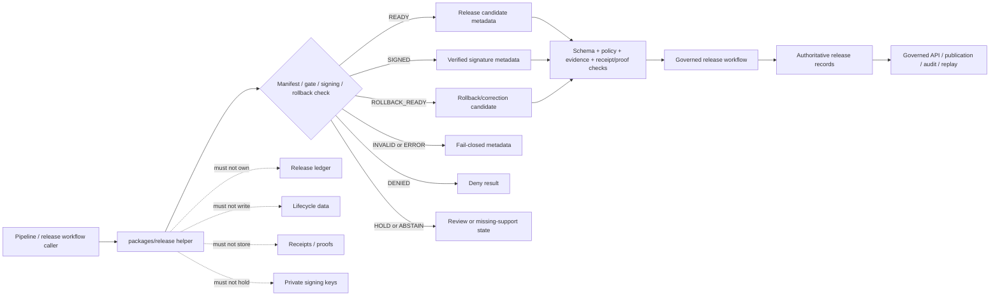

<!-- [KFM_META_BLOCK_V2]
doc_id: kfm://doc/NEEDS-VERIFICATION/packages-release-readme
title: Release Package README
type: readme
version: v1
status: draft
owners: OWNER_TBD
created: NEEDS VERIFICATION — target file existed before this revision as a short stub
updated: 2026-06-15
policy_label: public
related: [packages/README.md, packages/hashing/README.md, packages/identity/README.md, packages/pipelines-core/README.md, packages/policy-runtime/README.md, packages/envelopes/README.md, docs/doctrine/directory-rules.md, docs/architecture/release-model.md, docs/architecture/release-discipline.md, docs/architecture/publication/release-state-machine.md, docs/architecture/publication/release-objects.md, docs/architecture/publication/RELEASE_GATES.md, docs/architecture/publication/rollback-and-correction.md, docs/standards/RELEASE_MANIFEST.md, docs/standards/SIGNING.md, docs/adr/ADR-0018-promotion-gate-sequence.md, docs/adr/ADR-0015-data-published-_domain_-current-alias-is-governed-by-rollback_card.md, release/, contracts/, schemas/contracts/v1/, policy/, data/receipts/, data/proofs/]
tags: [kfm, packages, release, release-manifest, promotion, signing, rollback, correction, publication, audit, replay]
notes: ["README-like package entrypoint for release helper code.", "This package may contain deterministic helpers for release manifest assembly, release preflight, signature-envelope preparation/verification, rollback-card application helpers, correction metadata, and receipt-ready release metadata.", "It must not own release decisions, release manifests as authoritative records, lifecycle data, policy rules, schemas, contracts, receipts, proofs, key material, API routes, UI surfaces, source records, or AI truth claims."]
[/KFM_META_BLOCK_V2] -->

<a id="top"></a>

# Release Package

Shared helper-code package for KFM release-support primitives: release manifest assembly candidates, promotion preflight checks, signing-envelope helpers, rollback/correction application helpers, and receipt-ready release metadata.

<p>
  
  
  
  
  
</p>

> [!IMPORTANT]
> **Status:** PROPOSED package README  
> **Path:** `packages/release/README.md`  
> **Owning responsibility root:** `packages/` — shared reusable implementation libraries  
> **Package purpose:** release manifest candidate assembly, promotion preflight, signing-envelope helpers, rollback/correction helpers, and release metadata utilities  
> **Release authority:** `release/`, not this package  
> **Schema authority:** `schemas/contracts/v1/`, not this package  
> **Contract authority:** `contracts/`, not this package  
> **Policy authority:** `policy/`, not this package  
> **Receipt/proof authority:** `data/receipts/` and `data/proofs/`, not this package  
> **Key-management authority:** external key-management/signing infrastructure or repo-confirmed security root, not this package  
> **Repo implementation depth:** UNKNOWN for package metadata, import style, source files, tests, CI workflows, release bindings, emitted receipts, proof packs, release manifests, signing infrastructure, branch protections, and runtime behavior.

## Scope

`packages/release/` is the shared implementation package lane for release-support helper code used by pipelines, validators, release gates, signing workflows, rollback tools, governed APIs, receipts, proof builders, and tests.

This package may contain deterministic utilities for:

- assembling release manifest candidates from explicit artifact refs, manifest refs, evidence refs, policy refs, receipt refs, proof refs, hashes, version ids, and audience metadata;
- validating release candidate completeness before a governed release workflow makes a decision;
- checking promotion-gate inputs such as schema validation, policy decision, EvidenceBundle closure, hash consistency, source rights, sensitivity posture, receipt/proof presence, review state, and rollback target presence;
- preparing signing-envelope inputs, signature verification inputs, or signature-result metadata without storing private keys or becoming signing authority;
- applying rollback-card logic to compute candidate alias/current pointers from explicit rollback records;
- preparing correction, supersession, tombstone, deprecation, and withdrawal metadata from explicit caller inputs;
- mapping release helper outcomes into finite envelope-ready states such as ready, invalid, denied, held, abstained, rollback-ready, and drift;
- supporting deterministic replay of release manifests and rollback/correction metadata;
- building synthetic no-network fixtures for release, rollback, correction, signature, drift, and gate-failure paths.

This package must not approve release, publish artifacts, mutate `release/`, change `data/published`, write receipts, write proofs, store signing keys, decide policy, resolve evidence as truth, fetch source data, expose public routes, render UI, or generate truth claims.

```text
RAW -> WORK / QUARANTINE -> PROCESSED -> CATALOG / TRIPLET -> PUBLISHED
```

Publication is a governed state transition, not a file move. Release helpers may prepare and validate candidates for that transition, but they do not own the transition.

[⬆ Back to top](#top)

---

## Repo fit

```text
packages/release/
```

This path is appropriate for reusable release helper code because `packages/` is the responsibility root for shared libraries used by apps, workers, pipelines, and tools.

| Relationship | Expected home | Boundary rule |
| --- | --- | --- |
| Release helper code | `packages/release/` | Manifest-candidate assembly, preflight checks, signing metadata, rollback/correction helpers only. |
| Release authority records | `release/` | Owns release manifests, release decisions, rollback records, correction notices, and publication state. |
| Lifecycle data and artifacts | `data/<phase>/` or repo-confirmed artifact homes | Owns RAW/WORK/QUARANTINE/PROCESSED/CATALOG/TRIPLET/PUBLISHED state and artifacts. |
| Hash helpers | `packages/hashing/` | Computes and compares content/spec/artifact hashes and Merkle roots. |
| Identity helpers | `packages/identity/` | Handles release ids, object ids, refs, aliases, and deterministic identity grammar. |
| Pipeline helpers | `packages/pipelines-core/` | Supplies run-state, receipt metadata, replay, and lifecycle guardrail helpers. |
| Policy runtime helpers | `packages/policy-runtime/` | Supplies policy decision outcomes and obligations. |
| Runtime envelopes | `packages/envelopes/` | Maps helper results into finite governed response envelopes. |
| Semantic contracts | `contracts/` | Defines meaning for release, rollback, correction, and signing objects. |
| Machine schemas | `schemas/contracts/v1/` | Defines release manifest, rollback card, signature, receipt, and artifact shapes. |
| Policy rules | `policy/` | Owns publication, rights, sensitivity, and release gate decisions. |
| Receipts and proofs | `data/receipts/`, `data/proofs/` | Stores RunReceipt, PolicyDecision, RedactionReceipt, PromotionReceipt, proof packs, and validation records. |
| Signing keys | security/KMS/signing infrastructure or repo-confirmed root | Private keys and key policy never belong in `packages/`. |
| Public API and UI | `apps/`, `ui/`, `web/`, or repo-confirmed equivalents | Consume governed release status; package internals are not public authority. |
| Tests and fixtures | `tests/packages/release/`, `fixtures/packages/release/`, or repo-confirmed equivalents | Proves deterministic behavior with synthetic public-safe fixtures. |

> [!WARNING]
> Do not use this package as the authoritative release ledger. Release records, rollback cards, correction notices, and publication state belong under the release/lifecycle governance roots.

[⬆ Back to top](#top)

---

## Accepted inputs

Package helpers should accept explicit, inspectable values from governed callers. They should not fetch missing facts from source systems, raw stores, UI state, hidden globals, operator memory, or generated language.

| Input family | Accepted examples | Required handling |
| --- | --- | --- |
| Release context | release id, release type, version, audience, domain, release state, supersedes ref | Preserve explicit release identity and state. |
| Artifact context | artifact refs, artifact hashes, tile/style/layer/source manifests, Merkle root, size/media metadata | Validate presence and integrity refs; do not read or publish artifacts. |
| Evidence context | EvidenceRef, EvidenceBundle ref, resolver outcome, citation-validation ref | Carry evidence support; do not fabricate evidence. |
| Policy context | policy decision ref, obligations, sensitivity posture, rights posture, release gate result | Consume supplied posture; do not evaluate policy. |
| Receipt/proof context | run receipt ref, validation receipt ref, redaction receipt ref, promotion receipt ref, proof pack ref | Validate refs are present; do not store receipts/proofs. |
| Signing context | signing profile, public key ref, signature envelope ref, signature verification result | Prepare/verify metadata only; do not store private keys. |
| Rollback/correction context | rollback card ref, current alias, prior release ref, correction notice, tombstone/supersession reason | Compute candidate status and metadata; do not mutate release ledger. |
| Replay context | prior manifest hash, expected artifact hashes, expected policy refs, drift policy | Compare explicit values; do not infer release success from names or logs. |
| Fixture context | synthetic release, rollback, correction, signature, invalid, denied, drift examples | Keep fixtures deterministic and public-safe. |

[⬆ Back to top](#top)

---

## Exclusions

| Do not put here | Correct home or owner | Reason |
| --- | --- | --- |
| Release manifests, rollback cards, correction notices as authoritative records | `release/` | Release state is governed and auditable. |
| RAW, WORK, QUARANTINE, PROCESSED, CATALOG, TRIPLET, or PUBLISHED data | `data/<phase>/` | Lifecycle state must remain phase-visible. |
| Source descriptors and source registries | `data/registry/` or repo-confirmed registry homes | Source authority, rights, cadence, and limitations are governance data. |
| JSON Schemas | `schemas/contracts/v1/` | Schemas own machine shape. |
| Semantic contracts | `contracts/` | Contracts own meaning. |
| Policy rules | `policy/` | Policy owns publication, rights, and sensitivity decisions. |
| Receipts, proof packs, validation reports | `data/receipts/`, `data/proofs/` | Trust artifacts must remain separately auditable. |
| Signing private keys, secrets, credentials, key policies | Security/KMS/signing infrastructure | Packages must not store key material. |
| Public API routes or serializers | `apps/` or repo-confirmed API app | Public clients must use governed APIs. |
| UI components, dashboards, controls | `apps/`, `ui/`, `web/`, or observability roots | Presentation is downstream from governed status. |
| AI-generated release claims or source interpretation | governed AI runtime plus evidence validation | AI output is interpretive and evidence-subordinate. |
| Secrets, private source content, protected-location examples, real personal/DNA data | Nowhere in package fixtures | Fixtures must remain synthetic or public-safe. |

[⬆ Back to top](#top)

---

## Release helper responsibilities

| Responsibility | Expected behavior |
| --- | --- |
| Manifest candidate assembly | Build deterministic release manifest candidates from explicit refs and hashes. |
| Preflight validation | Detect missing evidence, policy, rights, receipts, proofs, hashes, review state, rollback target, or signature support. |
| Signing support | Prepare signature-envelope metadata and verify signatures using supplied public-key/signature refs; never store private keys. |
| Rollback support | Compute rollback/alias/correction candidate state from explicit rollback cards and prior release refs. |
| Correction support | Preserve correction, supersession, tombstone, and withdrawal metadata. |
| Finite outcomes | Return ready, invalid, denied, hold, abstain, rollback-ready, drift, or error states. |
| Replay support | Compare expected and observed release manifest inputs without assuming success from labels. |
| Fixture support | Generate synthetic no-network fixtures for release and rollback paths. |

[⬆ Back to top](#top)

---

## Expected package layout

> [!NOTE]
> The tree below is PROPOSED. Confirm package metadata, language conventions, import namespace, test layout, and CI before committing code beyond README files.

```text
packages/release/
├── README.md                       # This file: package boundary and trust rules
├── pyproject.toml / package.json    # NEEDS VERIFICATION
├── src/                             # NEEDS VERIFICATION
│   └── release/                     # PROPOSED namespace; confirm against repo convention
│       ├── README.md                # PROPOSED namespace guide
│       ├── __init__.py              # PROPOSED export boundary
│       ├── manifests.py             # PROPOSED release manifest candidate helpers
│       ├── gates.py                 # PROPOSED release preflight/gate helpers
│       ├── signing.py               # PROPOSED signing metadata and verification helpers
│       ├── rollback.py              # PROPOSED rollback-card application helpers
│       ├── corrections.py           # PROPOSED correction/supersession/tombstone helpers
│       ├── receipts.py              # PROPOSED release receipt-ready metadata carriers only
│       ├── replay.py                # PROPOSED replay/drift helpers
│       ├── validation.py            # PROPOSED manifest/output validation helpers
│       ├── fixtures.py              # PROPOSED synthetic fixtures
│       └── py.typed                 # PROPOSED if typed package convention is confirmed
└── CHANGELOG.md                     # OPTIONAL / NEEDS VERIFICATION
```

Potential imports, subject to package verification:

```python
from release.manifests import build_release_manifest_candidate
from release.gates import validate_release_preflight
from release.rollback import apply_rollback_card_candidate
```

[⬆ Back to top](#top)

---

## Release helper outcomes

| Helper outcome | Use when | Runtime posture |
| --- | --- | --- |
| `READY` | Manifest candidate has required refs, hashes, and preflight support. | Candidate only; release workflow must still approve. |
| `INVALID` | Manifest shape, ref set, hash, signature, or rollback metadata is malformed. | Fail closed with validation metadata. |
| `DENIED` | Supplied policy posture blocks release or audience. | Deny with stable reason code. |
| `HOLD` | Steward review, rights review, sensitivity review, proof review, or signature review is required. | Internal governance state; not public release. |
| `ABSTAIN` | Required evidence, policy, receipt, proof, artifact, signature, or rollback support is missing. | Fail safe; do not publish. |
| `SIGNED` | Signature metadata verifies for supplied manifest/hash and public-key context. | Integrity candidate only; not truth or release approval. |
| `ROLLBACK_READY` | Rollback/correction candidate is locally coherent from explicit inputs. | Candidate only; release workflow must still apply. |
| `DRIFT` | Replay or recompute differs from expected manifest, hashes, refs, or signature context. | Block promotion/release and require review. |
| `ERROR` | Runtime or evaluator failure prevents a valid local helper result. | Fail closed with receipt-ready error metadata. |

`READY` and `SIGNED` are not proof of truth, evidence closure, publication, or release. They only mean the local helper checks found the candidate coherent enough for the next governed gate.

[⬆ Back to top](#top)

---

## Trust-boundary flow



[⬆ Back to top](#top)

---

## Development rules

1. Treat this package as a deterministic release-support helper layer, not release authority.
2. Prefer pure functions with explicit input objects.
3. Preserve release refs, artifact refs, evidence refs, policy refs, receipt refs, proof refs, hashes, signature refs, rollback refs, correction refs, review refs, and actor/timestamp metadata supplied by callers.
4. Do not make network calls from this package unless a future ADR explicitly permits a constrained signing/verification call path.
5. Do not read directly from RAW, WORK, QUARANTINE, unpublished candidates, source systems, source credentials, canonical stores, private keys, or model runtimes.
6. Do not write lifecycle data, release records, receipts, proofs, policy rules, source registries, catalog records, API responses, UI components, or signing keys.
7. Do not approve release, publish artifacts, resolve evidence as truth, decide policy, or generate public claims.
8. Do not create schemas, contracts, policy source rules, source registries, pipeline DAGs, API routes, public answers, release decisions, key policies, or connector behavior from this package.
9. Do not store raw provider payloads, secrets, private keys, credentials, private source records, sensitive-location examples, living-person identifiers, DNA/genomic context, or unrestricted sensitive context.
10. Return typed finite outcomes instead of implicit release, warning-only drift, skipped signature validation, hidden rollback failure, or public exposure of unreleased outputs.
11. Add deterministic tests for every behavior-changing helper and every negative path.
12. Keep fixtures synthetic, sanitized, and public-safe.
13. Preserve rollback and correction metadata supplied by callers when release output can affect downstream publication candidates.

[⬆ Back to top](#top)

---

## Validation checklist

- [ ] Confirm `packages/release/` package metadata and language/runtime convention.
- [ ] Confirm import namespace and whether it is `release`, `kfm_release`, or repo-specific.
- [ ] Confirm owners and CODEOWNERS path coverage.
- [ ] Confirm release record homes under `release/`.
- [ ] Confirm schema homes for ReleaseManifest, MapReleaseManifest, RollbackCard, CorrectionNotice, signature envelope, release receipt, and proof refs.
- [ ] Confirm relationship with `packages/hashing/`, `packages/identity/`, `packages/pipelines-core/`, `packages/policy-runtime/`, `packages/envelopes/`, and receipt/proof homes.
- [ ] Confirm tests for `READY`, `INVALID`, `DENIED`, `HOLD`, `ABSTAIN`, `SIGNED`, `ROLLBACK_READY`, `DRIFT`, and `ERROR` paths.
- [ ] Confirm tests for missing evidence, missing policy, missing rights, missing receipts/proofs, unsigned manifest, invalid signature, hash mismatch, rollback mismatch, correction mismatch, replay drift, and no-public-RAW/WORK/QUARANTINE exposure.
- [ ] Confirm helpers do not access lifecycle stores, source systems, credentials, private keys, model runtimes, or unpublished candidate stores.
- [ ] Confirm helpers do not write release records, lifecycle data, receipts, proofs, catalog records, API responses, credentials, permissions, UI state, or signing keys.

Suggested inspection commands:

```bash
find packages/release -maxdepth 5 -type f | sort
git grep -n "ReleaseManifest\|MapReleaseManifest\|RollbackCard\|CorrectionNotice\|release_state\|rollback\|signature\|SIGNED\|DRIFT\|PromotionReceipt" -- packages docs contracts schemas policy tests fixtures pipelines connectors tools apps release 2>/dev/null || true
git grep -n "from release\|import release\|packages/release" -- . 2>/dev/null || true
```

[⬆ Back to top](#top)

---

## Rollback

Rollback is required if this package:

- becomes a parallel release-ledger, schema, contract, policy, source-registry, lifecycle-data, evidence/proof, receipt, API, UI, credential, key-management, model-runtime, or source-data authority;
- approves release, writes release records, mutates current aliases, writes lifecycle outputs, writes receipts/proofs, or stores signing keys as a package helper;
- lets public clients or normal UI surfaces access RAW, WORK, QUARANTINE, unpublished candidates, source systems, direct model outputs, or unreleased artifacts;
- treats signing success, run success, policy allow, or manifest assembly as proof of truth, evidence closure, admissibility, public safety, or release;
- hides rollback, correction, drift, missing receipt/proof, missing rights, or signature failure behind warning-only logs;
- stores secrets, private keys, credentials, private source records, real living-person identifiers, DNA/genomic context, or protected-location examples in fixtures.

Rollback target: revert the package README or release-source PR, preserve audit notes, and file any authority drift in `docs/registers/DRIFT_REGISTER.md` or the repo-confirmed drift register.

[⬆ Back to top](#top)

---

## Evidence boundary

| Source | Status | Supports | Limits |
| --- | --- | --- | --- |
| Current target file | CONFIRMED | `packages/release/README.md` existed as a short stub naming release manifest assembly, signing, and rollback application. | Stub did not prove package implementation maturity. |
| `packages/README.md` | CONFIRMED repo doc | `packages/` is for shared libraries used by apps, workers, pipelines, and tools. | Does not define release package behavior. |
| `docs/architecture/release-model.md` | CONFIRMED repo search result | Release-model architecture exists as a repo doc. | Content was not re-read in full for this README pass. |
| `docs/standards/RELEASE_MANIFEST.md` and `docs/standards/SIGNING.md` | CONFIRMED repo search results | Release manifest and signing standards exist as repo docs. | Content was not re-read in full for this README pass. |
| `docs/architecture/publication/release-state-machine.md` and `docs/architecture/publication/rollback-and-correction.md` | CONFIRMED repo search results | Release state-machine and rollback/correction architecture docs exist. | Content was not re-read in full for this README pass. |
| Current file-generation pass | CONFIRMED request | User-requested target path and README expansion. | Does not inspect package metadata, tests, CI logs, dashboards, deployment posture, runtime behavior, key-management posture, or branch protection. |

[⬆ Back to top](#top)
