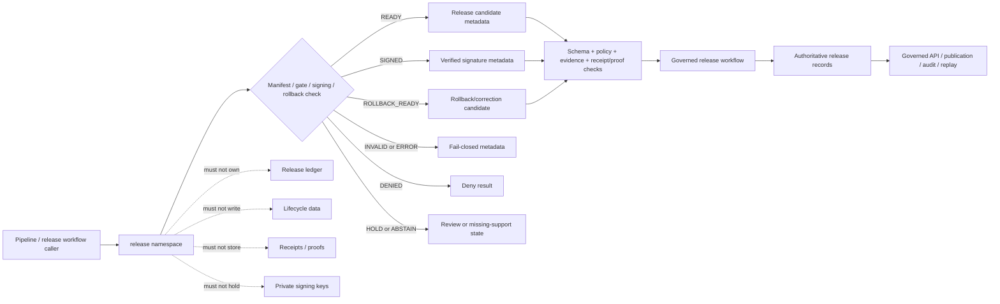

<!-- [KFM_META_BLOCK_V2]
doc_id: kfm://doc/NEEDS-VERIFICATION/packages-release-src-release-readme
title: Release Import Namespace README
type: readme
version: v1
status: draft
owners: OWNER_TBD
created: NEEDS VERIFICATION — target file existed before this repair but contained only placeholder text
updated: 2026-06-15
policy_label: public
related: [packages/release/README.md, packages/release/src/README.md, packages/hashing/README.md, packages/identity/README.md, packages/pipelines-core/README.md, packages/policy-runtime/README.md, packages/envelopes/README.md, packages/README.md, docs/doctrine/directory-rules.md, docs/architecture/release-model.md, docs/architecture/release-discipline.md, docs/architecture/publication/release-state-machine.md, docs/architecture/publication/release-objects.md, docs/architecture/publication/RELEASE_GATES.md, docs/architecture/publication/rollback-and-correction.md, docs/standards/RELEASE_MANIFEST.md, docs/standards/SIGNING.md, docs/adr/ADR-0018-promotion-gate-sequence.md, docs/adr/ADR-0015-data-published-_domain_-current-alias-is-governed-by-rollback_card.md, release/, contracts/, schemas/contracts/v1/, policy/, data/receipts/, data/proofs/]
tags: [kfm, packages, release, import-namespace, release-manifest, promotion, signing, rollback, correction, publication, audit, replay]
notes: ["Namespace guide for importable release-support helper code.", "This namespace may expose release manifest candidate, preflight/gate, signing metadata, rollback, correction, receipt-metadata, replay, validation, and synthetic fixture helpers only.", "It must not own release decisions, release records, lifecycle data, policy rules, schemas, contracts, receipts, proofs, signing keys, API routes, UI surfaces, source records, model runtimes, or AI truth claims."]
[/KFM_META_BLOCK_V2] -->

<a id="top"></a>

# `release` Import Namespace

Importable helper namespace for KFM release-support primitives: release manifest candidates, promotion preflight checks, signing-envelope metadata, signature verification helpers, rollback/correction helpers, receipt-ready metadata, validation, replay, and synthetic fixtures.

<p>
  
  
  
  
  
  
</p>

> [!IMPORTANT]
> **Status:** PROPOSED import-namespace README  
> **Path:** `packages/release/src/release/README.md`  
> **Owning responsibility root:** `packages/`  
> **Package lane:** `packages/release/`  
> **Source envelope:** `packages/release/src/`  
> **Import namespace:** `release` — NEEDS VERIFICATION against package metadata  
> **Release authority:** `release/`, not this namespace  
> **Schema authority:** `schemas/contracts/v1/`, not this namespace  
> **Contract authority:** `contracts/`, not this namespace  
> **Policy authority:** `policy/`, not this namespace  
> **Receipt/proof authority:** `data/receipts/` and `data/proofs/`, not this namespace  
> **Key-management authority:** external key-management/signing infrastructure or repo-confirmed security root, not this namespace  
> **Repo implementation depth:** UNKNOWN for module files, exports, tests, package manager, CI workflows, release bindings, receipts, proof packs, release manifests, signing infrastructure, branch protections, and runtime behavior.

## Scope

`packages/release/src/release/` is the proposed importable namespace for reusable release-support helper code.

It may contain pure, deterministic helpers for:

- assembling release manifest candidates from explicit artifact refs, manifest refs, evidence refs, policy refs, receipt refs, proof refs, hashes, version ids, audience metadata, and rollback refs;
- validating release candidate completeness before a governed release workflow makes a release decision;
- checking promotion-gate inputs such as schema validation, policy decision, EvidenceBundle closure, hash consistency, source rights, sensitivity posture, receipt/proof presence, review state, and rollback target presence;
- preparing signing-envelope inputs, signature verification inputs, and signature-result metadata without storing private keys or becoming signing authority;
- applying rollback-card logic to compute candidate alias/current pointers from explicit rollback records;
- preparing correction, supersession, tombstone, deprecation, and withdrawal metadata from explicit caller inputs;
- mapping helper outcomes into finite states such as `READY`, `INVALID`, `DENIED`, `HOLD`, `ABSTAIN`, `SIGNED`, `ROLLBACK_READY`, `DRIFT`, and `ERROR`;
- supporting deterministic replay of release manifests, signatures, rollback cards, and correction metadata;
- synthetic no-network fixtures for release, rollback, correction, signature, drift, and gate-failure paths.

This namespace must not approve release, publish artifacts, mutate `release/`, change `data/published`, write receipts, write proofs, store signing keys, decide policy, resolve evidence as truth, fetch source data, expose public routes, render UI, or generate truth claims.

## Namespace contract

The namespace is a release-support helper boundary, not the authoritative release ledger.

| Namespace concern | Expected behavior | Authority home |
| --- | --- | --- |
| Manifest candidates | Build deterministic candidates from explicit refs and hashes. | `release/`, schemas, and contracts define authoritative records. |
| Gate checks | Check supplied preflight evidence, policy, receipts, proofs, hashes, review state, and rollback refs. | Governed release workflows make release decisions. |
| Signing metadata | Prepare/verify signature context from explicit public-key/signature refs. | Key-management/signing infrastructure owns keys and trust roots. |
| Rollback helpers | Compute rollback/correction candidate state from explicit rollback cards. | `release/` owns rollback records and current aliases. |
| Correction helpers | Preserve correction, supersession, tombstone, withdrawal metadata. | Release governance owns correction publication. |
| Receipt metadata | Build release receipt-ready carriers from explicit inputs. | `data/receipts/` stores receipts; proof homes store proof artifacts. |
| Replay support | Compare expected and observed refs/hashes/signature context. | Receipt/proof/release workflows own replay authority. |
| Fixtures | Produce synthetic stable examples for tests only. | `tests/` and `fixtures/`, not production release records. |

## Expected modules

> [!NOTE]
> The tree below is PROPOSED. Confirm actual language, module names, package manager, and tests before treating these as implementation facts.

```text
packages/release/src/release/
├── README.md              # This file: namespace guide
├── __init__.py            # PROPOSED export boundary
├── manifests.py           # PROPOSED release manifest candidate helpers
├── gates.py               # PROPOSED release preflight/gate helpers
├── signing.py             # PROPOSED signing metadata and verification helpers
├── rollback.py            # PROPOSED rollback-card application helpers
├── corrections.py         # PROPOSED correction/supersession/tombstone helpers
├── receipts.py            # PROPOSED release receipt-ready metadata carriers only
├── replay.py              # PROPOSED replay/drift helpers
├── validation.py          # PROPOSED manifest/output validation helpers
├── fixtures.py            # PROPOSED synthetic fixtures
└── py.typed               # PROPOSED if typed package convention is confirmed
```

Keep implementation smaller than this until schemas, tests, and callers prove the need.

## Allowed exports

| Export family | Examples | Rule |
| --- | --- | --- |
| Manifest helpers | `build_release_manifest_candidate`, `ReleaseManifestCandidate` | Build candidates only; do not write authoritative records. |
| Gate helpers | `validate_release_preflight`, `ReleaseGateResult` | Check supplied refs and metadata; do not approve release. |
| Signing helpers | `SignatureEnvelopeCandidate`, `verify_signature_metadata` | Use supplied public-key/signature refs; never store private keys. |
| Rollback helpers | `apply_rollback_card_candidate`, `RollbackCandidate` | Compute candidate state; do not mutate current aliases. |
| Correction helpers | `CorrectionMetadata`, `build_correction_candidate` | Preserve correction context; do not replace published records. |
| Receipt metadata helpers | `ReleaseReceiptMetadata`, `build_release_receipt_metadata` | Prepare metadata only; do not write receipts. |
| Replay helpers | `ReleaseReplayExpectation`, `compare_release_replay` | Return drift/match states; do not certify release. |
| Validation helpers | `validate_release_candidate`, `check_required_release_refs` | Local helper validation only. |
| Fixture helpers | `release_fixture`, `rollback_fixture`, `signature_error_fixture` | Synthetic and public-safe only. |

## Disallowed exports

Do not export functions that turn this helper namespace into an authority surface.

| Disallowed export | Why |
| --- | --- |
| `approve_release`, `publish`, `promote`, `rollback_release`, `set_current_alias` | Release authority belongs under `release/` and governed workflows. |
| `write_release_manifest`, `write_rollback_card`, `write_correction_notice` | Authoritative release records must be stored by release governance. |
| `read_raw`, `write_published`, `move_to_published`, `fetch_source` | Lifecycle and source access belong to data, pipelines, and connectors. |
| `write_receipt`, `write_proof`, `store_evidence_bundle` | Receipts/proofs/evidence storage are separate trust homes. |
| `store_private_key`, `sign_with_embedded_key`, `issue_key_policy` | Private keys and key policy never belong in this namespace. |
| `evaluate_policy`, `resolve_truth`, `allow_public_without_review` | Policy, evidence, and truth authority are separate. |
| `call_model`, `generate_release_claim`, `summarize_truth` | AI output is interpretive and belongs behind governed AI placement. |
| `bypass_gates`, `ignore_drift`, `force_release` | Bypass violates release governance and rollback auditability. |

## Import posture

Preferred imports, subject to package metadata verification:

```python
from release.manifests import build_release_manifest_candidate
from release.gates import validate_release_preflight
from release.rollback import apply_rollback_card_candidate
from release.signing import verify_signature_metadata
```

Callers should treat release namespace output as a candidate for schema validation, policy gates, evidence checks, receipt/proof persistence, release review, governed API envelope construction, and replay comparison. A `READY` or `SIGNED` helper result is not public release by itself.

## Release helper outcomes

| Helper outcome | Use when | Runtime posture |
| --- | --- | --- |
| `READY` | Manifest candidate has required refs, hashes, and preflight support. | Candidate only; release workflow must still approve. |
| `INVALID` | Manifest shape, ref set, hash, signature, or rollback metadata is malformed. | Fail closed with validation metadata. |
| `DENIED` | Supplied policy posture blocks release or audience. | Deny with stable reason code. |
| `HOLD` | Steward review, rights review, sensitivity review, proof review, or signature review is required. | Internal governance state; not public release. |
| `ABSTAIN` | Required evidence, policy, receipt, proof, artifact, signature, or rollback support is missing. | Fail safe; do not publish. |
| `SIGNED` | Signature metadata verifies for supplied manifest/hash and public-key context. | Integrity candidate only; not truth or release approval. |
| `ROLLBACK_READY` | Rollback/correction candidate is locally coherent from explicit inputs. | Candidate only; release workflow must still apply. |
| `DRIFT` | Replay or recompute differs from expected manifest, hashes, refs, or signature context. | Block promotion/release and require review. |
| `ERROR` | Runtime or evaluator failure prevents a valid local helper result. | Fail closed with receipt-ready error metadata. |

`READY` and `SIGNED` are not proof of truth, evidence closure, publication, or release. They only mean the local helper checks found the candidate coherent enough for the next governed gate.

## Trust-boundary flow



## Development rules

1. Keep the namespace no-network by default, except for ADR-approved constrained signing/verification calls if added later.
2. Prefer pure functions with explicit input objects.
3. Preserve release refs, artifact refs, evidence refs, policy refs, receipt refs, proof refs, hashes, signature refs, rollback refs, correction refs, review refs, and actor/timestamp metadata supplied by callers.
4. Do not read from RAW, WORK, QUARANTINE, unpublished candidates, source systems, source credentials, canonical stores, private keys, or model runtimes.
5. Do not write lifecycle data, release records, receipts, proofs, policy rules, source registries, catalog records, API responses, UI components, or signing keys.
6. Do not approve release, publish artifacts, resolve evidence as truth, decide policy, or generate public claims.
7. Do not create schemas, contracts, policy source rules, source registries, pipeline DAGs, API routes, public answers, release decisions, key policies, or connector behavior from this namespace.
8. Do not store raw provider payloads, secrets, private keys, credentials, private source records, sensitive-location examples, living-person identifiers, DNA/genomic context, or unrestricted sensitive context.
9. Return typed finite outcomes instead of implicit release, warning-only drift, skipped signature validation, hidden rollback failure, or public exposure of unreleased outputs.
10. Add deterministic tests for every export and every negative path.
11. Keep fixtures synthetic, sanitized, and public-safe.
12. Preserve rollback and correction metadata supplied by callers when release output can affect downstream publication candidates.

## Validation checklist

- [ ] Confirm this namespace exists in package metadata.
- [ ] Confirm the package import name is actually `release` or decide on a less collision-prone namespace such as `kfm_release` through package metadata/ADR.
- [ ] Confirm `__init__` exports are intentional and minimal.
- [ ] Confirm tests cover `READY`, `INVALID`, `DENIED`, `HOLD`, `ABSTAIN`, `SIGNED`, `ROLLBACK_READY`, `DRIFT`, and `ERROR` helper states if implemented.
- [ ] Confirm tests cover missing evidence, missing policy, missing rights, missing receipts/proofs, unsigned manifest, invalid signature, hash mismatch, rollback mismatch, correction mismatch, replay drift, and no-public-RAW/WORK/QUARANTINE exposure.
- [ ] Confirm helpers do not import connectors, data stores, policy engines, release writers, model providers, API routers, UI components, credential systems, private-key stores, or receipt/proof stores.
- [ ] Confirm helpers do not access RAW/WORK/QUARANTINE, source systems, credentials, private keys, model runtimes, or unpublished candidate stores.
- [ ] Confirm public-facing API routes serialize release-derived status through governed envelopes and do not expose lifecycle internals.

Suggested inspection commands:

```bash
find packages/release/src/release -maxdepth 3 -type f | sort
git grep -n "from release\|import release" -- . 2>/dev/null || true
git grep -n "ReleaseManifest\|MapReleaseManifest\|RollbackCard\|CorrectionNotice\|signature\|SIGNED\|DRIFT\|PromotionReceipt" -- packages/release tests fixtures docs schemas contracts policy pipelines connectors tools release 2>/dev/null || true
```

## Rollback

Rollback is required if this namespace:

- becomes a parallel release ledger, schema, contract, policy, source-registry, lifecycle-data, evidence/proof, receipt, API, UI, credential, key-management, model-runtime, or source-data authority;
- approves release, writes release records, mutates current aliases, writes lifecycle outputs, writes receipts/proofs, or stores signing keys as a helper namespace;
- lets public clients or normal UI surfaces access RAW, WORK, QUARANTINE, unpublished candidates, source systems, direct model outputs, or unreleased artifacts;
- treats signing success, run success, policy allow, or manifest assembly as proof of truth, evidence closure, admissibility, public safety, or release;
- hides rollback, correction, drift, missing receipt/proof, missing rights, or signature failure behind warning-only logs;
- stores secrets, private keys, credentials, private source records, real living-person identifiers, DNA/genomic context, or protected-location examples in fixtures.

Rollback target: revert the namespace-source PR, keep generated audit notes as review evidence, and file any authority drift in `docs/registers/DRIFT_REGISTER.md` or `docs/registers/VERIFICATION_BACKLOG.md` if the mounted repo uses those registers.

## Evidence boundary

| Source | Status | Supports | Limits |
| --- | --- | --- | --- |
| Current target file | CONFIRMED | `packages/release/src/release/README.md` existed and required replacement from placeholder content. | Did not prove namespace implementation maturity. |
| Parent source README | CONFIRMED repo doc | `packages/release/src/` is bounded to release-support helper source code. | Does not prove package metadata, imports, tests, or CI. |
| Parent package README | CONFIRMED repo doc | `packages/release/` is a shared helper-code package for release manifest assembly, signing, rollback, and correction support. | Does not prove source files or runtime bindings. |
| `packages/README.md` | CONFIRMED repo doc | `packages/` is for shared libraries used by apps, workers, pipelines, and tools. | Does not define this namespace. |
| Current file-generation pass | CONFIRMED request | User-requested target path and README repair/replacement. | Does not inspect package metadata, tests, CI logs, dashboards, deployment posture, runtime behavior, key-management posture, or branch protection. |
