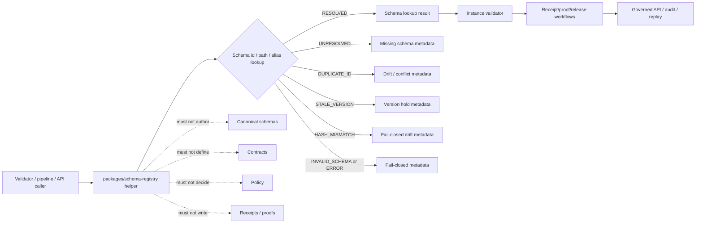

<!-- [KFM_META_BLOCK_V2]
doc_id: kfm://doc/NEEDS-VERIFICATION/packages-schema-registry-readme
title: Schema Registry Package README
type: readme
version: v1
status: draft
owners: OWNER_TBD
created: NEEDS VERIFICATION — target file existed before this revision as a short stub
updated: 2026-06-15
policy_label: public
related: [packages/README.md, packages/hashing/README.md, packages/identity/README.md, packages/envelopes/README.md, docs/doctrine/directory-rules.md, docs/adr/ADR-0001-schema-home--schemas-contracts-v1-is-canonical.md, docs/architecture/contract-schema-policy-split.md, schemas/contracts/v1/, contracts/, policy/, data/receipts/, data/proofs/, release/]
tags: [kfm, packages, schema-registry, json-schema, schema-id, canonical-schema, versioning, validation, contracts]
notes: ["README-like package entrypoint for schema loading/lookup helper code.", "This package may contain helpers that locate, load, index, validate references to, and serve canonical JSON Schemas with versioned IDs from the canonical schema home.", "It must not own schema source authority, semantic contracts, policy rules, lifecycle data, source registries, receipts, proofs, release decisions, API routes, UI surfaces, or AI truth claims."]
[/KFM_META_BLOCK_V2] -->

<a id="top"></a>

# Schema Registry Package

Shared helper-code package for loading, indexing, resolving, and serving canonical JSON Schemas with versioned IDs.

<p>
  
  
  
  
  
</p>

> [!IMPORTANT]
> **Status:** PROPOSED package README  
> **Path:** `packages/schema-registry/README.md`  
> **Owning responsibility root:** `packages/` — shared reusable implementation libraries  
> **Package purpose:** schema loading, schema id lookup, versioned schema registry helpers, schema-ref validation, cache/index helpers, and validation-adapter support  
> **Canonical schema authority:** `schemas/contracts/v1/`, not this package  
> **Semantic contract authority:** `contracts/`, not this package  
> **Policy authority:** `policy/`, not this package  
> **Receipt/proof authority:** `data/receipts/` and `data/proofs/`, not this package  
> **Release authority:** `release/`, not this package  
> **Repo implementation depth:** UNKNOWN for package metadata, import style, source files, tests, CI workflows, schema publication bindings, validation reports, branch protections, and runtime behavior.

## Scope

`packages/schema-registry/` is the shared implementation package lane for schema discovery and schema-reference helper code used by validators, governed APIs, pipelines, release gates, receipts, proof builders, test fixtures, and local developer tools.

This package may contain deterministic utilities for:

- loading JSON Schemas from the canonical schema home supplied by config or caller;
- resolving versioned schema IDs, `$id` values, aliases, and local path references;
- checking that schema refs point to admitted canonical schemas rather than ad hoc local copies;
- building an in-memory or read-only registry index from explicit schema files;
- validating that schemas have stable ids, declared draft/version, title, type, status metadata, and expected KFM extension fields when required;
- exposing schema lookup helpers to validators and release preflight code;
- computing schema content/spec hashes through `packages/hashing/` helpers when supplied by caller;
- supporting deterministic no-network fixtures for valid schemas, missing schemas, duplicate IDs, stale versions, incompatible aliases, and invalid refs.

This package must not author canonical schemas, redefine semantic contracts, decide policy, write schema files as authority, store lifecycle data, write receipts or proofs, approve release, expose public routes, render UI, fetch source data, or generate truth claims.

```text
RAW -> WORK / QUARANTINE -> PROCESSED -> CATALOG / TRIPLET -> PUBLISHED
```

Schema registry helpers may validate machine-shape references during governed workflows. They do not own lifecycle state, source authority, contract meaning, policy decisions, receipt state, proof state, release state, or public truth.

[⬆ Back to top](#top)

---

## Repo fit

```text
packages/schema-registry/
```

This path is appropriate for reusable schema lookup and registry helper code because `packages/` is the responsibility root for shared libraries used by apps, workers, pipelines, and tools.

| Relationship | Expected home | Boundary rule |
| --- | --- | --- |
| Schema registry helper code | `packages/schema-registry/` | Loader, resolver, index, validation adapter, and schema-ref helpers only. |
| Canonical JSON Schemas | `schemas/contracts/v1/` | Owns machine-readable schema authority. |
| Semantic contracts | `contracts/` | Owns meaning and normative behavior. |
| Policy rules | `policy/` | Owns policy decisions and obligations. |
| Hash helpers | `packages/hashing/` | Computes schema/spec/content hashes and replay comparisons. |
| Identity helpers | `packages/identity/` | Handles schema ids, object ids, refs, aliases, and deterministic identity grammar. |
| Runtime envelopes | `packages/envelopes/` | Maps validation outcomes into finite governed response envelopes. |
| Validators/tools | `tools/`, `pipelines/`, or repo-confirmed validator roots | May call schema-registry helpers but own execution behavior. |
| Lifecycle data | `data/<phase>/` | Owns RAW/WORK/QUARANTINE/PROCESSED/CATALOG/TRIPLET/PUBLISHED state. |
| Receipts and proofs | `data/receipts/`, `data/proofs/` | Stores validation receipts and proof artifacts. |
| Release decisions | `release/` | Owns promotion, publication, correction, rollback, and supersession. |
| Public API and UI | `apps/`, `ui/`, `web/`, or repo-confirmed equivalents | Consume governed validation status; package internals are not public authority. |
| Tests and fixtures | `tests/packages/schema-registry/`, `fixtures/packages/schema-registry/`, or repo-confirmed equivalents | Proves deterministic behavior with synthetic schema fixtures. |

> [!WARNING]
> This package is not the schema home. It may index and resolve schemas; it must not create a parallel canonical schema tree.

[⬆ Back to top](#top)

---

## Accepted inputs

Package helpers should accept explicit, inspectable values from governed callers. They should not fetch missing facts from source systems, raw stores, UI state, hidden globals, operator memory, or generated language.

| Input family | Accepted examples | Required handling |
| --- | --- | --- |
| Schema location | canonical schema root, explicit schema file paths, package resource root | Read only from supplied/repo-confirmed schema roots. |
| Schema identity | `$id`, versioned id, title, schema draft, alias, package path | Resolve deterministically and detect duplicates. |
| Contract context | contract ref, object family, domain, schema family, compatibility profile | Preserve refs; do not redefine meaning. |
| Validation context | instance type, schema id, validator profile, strictness, draft | Produce validation-ready lookup results. |
| Hash context | schema hash, spec hash, content hash, registry index hash | Consume from hashing helpers or explicit caller input. |
| Release context | release ref, promotion gate, schema version pin, rollback ref | Preserve refs; do not approve release. |
| Fixture context | synthetic valid/missing/duplicate/stale/incompatible schemas and instances | Keep fixtures deterministic and public-safe. |

[⬆ Back to top](#top)

---

## Exclusions

| Do not put here | Correct home or owner | Reason |
| --- | --- | --- |
| Canonical JSON Schema files | `schemas/contracts/v1/` | Schemas need a single canonical home. |
| Semantic contract documents | `contracts/` | Contracts define meaning; schemas define machine shape. |
| Policy rules | `policy/` | Policy owns decisions and obligations. |
| Source descriptors and source registries | `data/registry/` or repo-confirmed registry homes | Source authority is not schema registry authority. |
| RAW, WORK, QUARANTINE, PROCESSED, CATALOG, TRIPLET, or PUBLISHED data | `data/<phase>/` | Lifecycle state must remain phase-visible. |
| Receipts, proof packs, validation reports | `data/receipts/`, `data/proofs/` | Trust artifacts must remain separately auditable. |
| Release manifests, rollback cards, correction notices | `release/` | Publication is a governed state transition. |
| Public API routes or serializers | `apps/` or repo-confirmed API app | Public clients must use governed APIs. |
| UI components, dashboards, controls | `apps/`, `ui/`, `web/`, or observability roots | Presentation is downstream from governed validation status. |
| AI-generated schemas as canonical truth | governed intake/review plus schema governance | Generated schema drafts require review before becoming canonical. |
| Secrets, private source content, protected-location examples, real personal/DNA data | Nowhere in package fixtures | Fixtures must remain synthetic or public-safe. |

[⬆ Back to top](#top)

---

## Schema-registry responsibilities

| Responsibility | Expected behavior |
| --- | --- |
| Load schemas | Load schemas from explicit canonical roots or package resources in read-only mode. |
| Resolve ids | Resolve `$id`, versioned id, aliases, and paths deterministically. |
| Detect drift | Detect duplicate IDs, missing schema refs, stale versions, invalid aliases, and hash mismatches. |
| Support validators | Provide schema lookup results to validators without owning validation reports. |
| Preserve provenance | Carry schema path, id, hash, version, draft, contract ref, and registry index metadata. |
| Fail closed | Missing, duplicate, incompatible, or untrusted schemas must not be treated as valid. |
| Fixture support | Generate synthetic no-network fixtures for lookup and validation-path tests. |

[⬆ Back to top](#top)

---

## Expected package layout

> [!NOTE]
> The tree below is PROPOSED. Confirm package metadata, language conventions, import namespace, test layout, and CI before committing code beyond README files.

```text
packages/schema-registry/
├── README.md                         # This file: package boundary and trust rules
├── pyproject.toml / package.json      # NEEDS VERIFICATION
├── src/                               # NEEDS VERIFICATION
│   └── schema_registry/               # PROPOSED namespace; confirm against repo convention
│       ├── README.md                  # PROPOSED namespace guide
│       ├── __init__.py                # PROPOSED export boundary
│       ├── loader.py                  # PROPOSED read-only schema loading helpers
│       ├── registry.py                # PROPOSED registry/index helpers
│       ├── ids.py                     # PROPOSED schema id and alias helpers
│       ├── validation.py              # PROPOSED schema-ref/registry validation helpers
│       ├── hashing.py                 # PROPOSED hash adapter helpers
│       ├── fixtures.py                # PROPOSED synthetic fixtures
│       └── py.typed                   # PROPOSED if typed package convention is confirmed
└── CHANGELOG.md                       # OPTIONAL / NEEDS VERIFICATION
```

Potential imports, subject to package verification:

```python
from schema_registry.loader import load_schema_catalog
from schema_registry.registry import SchemaRegistry
from schema_registry.validation import validate_schema_ref
```

[⬆ Back to top](#top)

---

## Schema-registry helper outcomes

| Helper outcome | Use when | Runtime posture |
| --- | --- | --- |
| `RESOLVED` | Schema id/path/alias resolves to one canonical schema. | Candidate for validation; not proof of semantic correctness. |
| `UNRESOLVED` | Schema id/path/alias cannot be found. | Fail closed or abstain depending on caller. |
| `DUPLICATE_ID` | More than one schema claims the same canonical id. | Block validation/release and require review. |
| `STALE_VERSION` | Schema ref points to a superseded or disallowed version. | Block or hold according to caller policy. |
| `HASH_MISMATCH` | Schema content hash/spec hash differs from expected value. | Fail closed and require drift review. |
| `INVALID_SCHEMA` | Schema document itself fails schema-registry checks. | Fail closed with validation metadata. |
| `UNTRUSTED_ROOT` | Schema was requested outside admitted schema roots. | Deny/hold; do not load. |
| `ERROR` | Runtime failure prevents a valid local helper result. | Fail closed with error metadata. |

`RESOLVED` is not proof of truth, contract meaning, policy allow, evidence closure, publication, or release. It only means one schema was located for the supplied ref.

[⬆ Back to top](#top)

---

## Trust-boundary flow



[⬆ Back to top](#top)

---

## Development rules

1. Treat this package as a read-only schema lookup/helper layer, not schema authority.
2. Prefer pure functions with explicit schema roots and registry inputs.
3. Preserve schema id, version, draft, contract ref, file path, content hash, spec hash, registry index hash, release ref, rollback ref, and validation profile supplied by callers.
4. Do not make network calls from this package unless a future ADR explicitly permits constrained schema fetches.
5. Do not read directly from RAW, WORK, QUARANTINE, unpublished candidates, source systems, source credentials, canonical stores outside admitted schema roots, private keys, or model runtimes.
6. Do not write schema files, lifecycle data, release records, receipts, proofs, policy rules, source registries, catalog records, API responses, or UI components.
7. Do not approve release, decide policy, resolve evidence as truth, define contract meaning, or generate public claims.
8. Do not create schemas, contracts, policy source rules, source registries, pipeline DAGs, API routes, public answers, release decisions, key policies, or connector behavior from this package.
9. Do not store raw provider payloads, secrets, credentials, private source records, sensitive-location examples, living-person identifiers, DNA/genomic context, or unrestricted sensitive context.
10. Return typed finite outcomes instead of implicit schema allow, warning-only duplicate IDs, hidden hash mismatch, or validation against local ad hoc schema copies.
11. Add deterministic tests for every behavior-changing helper and every negative path.
12. Keep fixtures synthetic, sanitized, and public-safe.

[⬆ Back to top](#top)

---

## Validation checklist

- [ ] Confirm `packages/schema-registry/` package metadata and language/runtime convention.
- [ ] Confirm import namespace and whether it is `schema_registry`, `kfm_schema_registry`, or repo-specific.
- [ ] Confirm owners and CODEOWNERS path coverage.
- [ ] Confirm canonical schema home from ADR-0001 and current repo layout.
- [ ] Confirm schema `$id` conventions, versioning rules, alias rules, and hash expectations.
- [ ] Confirm relationship with validators, `packages/hashing/`, `packages/identity/`, `packages/envelopes/`, receipt/proof homes, and release gates.
- [ ] Confirm tests for `RESOLVED`, `UNRESOLVED`, `DUPLICATE_ID`, `STALE_VERSION`, `HASH_MISMATCH`, `INVALID_SCHEMA`, `UNTRUSTED_ROOT`, and `ERROR` paths.
- [ ] Confirm helpers do not write schemas, receipts, proofs, release manifests, catalog records, API responses, credentials, permissions, UI state, or lifecycle data.
- [ ] Confirm helpers do not load schemas from ad hoc roots unless an ADR or test fixture explicitly admits them.

Suggested inspection commands:

```bash
find packages/schema-registry -maxdepth 5 -type f | sort
find schemas/contracts/v1 -maxdepth 5 -type f | sort | head -200
git grep -n "schema_registry\|SchemaRegistry\|\$id\|draft/2020-12\|schemas/contracts/v1\|DUPLICATE_ID\|HASH_MISMATCH" -- packages docs contracts schemas policy tests fixtures tools apps 2>/dev/null || true
git grep -n "from schema_registry\|import schema_registry\|packages/schema-registry" -- . 2>/dev/null || true
```

[⬆ Back to top](#top)

---

## Rollback

Rollback is required if this package:

- becomes a parallel canonical schema home, contract home, policy home, source registry, lifecycle-data, evidence/proof, receipt, release, API, UI, credential, key-management, model-runtime, or source-data authority;
- writes schema files, mutates canonical schema IDs, rewrites aliases, emits receipts/proofs, approves release, or publishes artifacts as a helper package;
- lets public clients or normal UI surfaces access RAW, WORK, QUARANTINE, unpublished candidates, source systems, direct model outputs, or unreleased artifacts;
- treats schema resolution as proof of truth, evidence closure, admissibility, public safety, policy allow, or release;
- hides duplicate IDs, schema drift, stale versions, hash mismatches, or untrusted roots behind warning-only logs;
- stores secrets, credentials, private source records, real living-person identifiers, DNA/genomic context, or protected-location examples in fixtures.

Rollback target: revert the package README or schema-registry source PR, preserve audit notes, and file any authority drift in `docs/registers/DRIFT_REGISTER.md` or the repo-confirmed drift register.

[⬆ Back to top](#top)

---

## Evidence boundary

| Source | Status | Supports | Limits |
| --- | --- | --- | --- |
| Current target file | CONFIRMED | `packages/schema-registry/README.md` existed as a short stub naming canonical JSON Schema loading/serving with versioned IDs. | Stub did not prove package implementation maturity. |
| `packages/README.md` | CONFIRMED repo doc | `packages/` is for shared libraries used by apps, workers, pipelines, and tools. | Does not define schema-registry package behavior. |
| `docs/adr/ADR-0001-schema-home--schemas-contracts-v1-is-canonical.md` | CONFIRMED repo search result | ADR exists stating schema home convention. | Content was not re-read in full for this README pass. |
| Current file-generation pass | CONFIRMED request | User-requested target path and README expansion. | Does not inspect package metadata, tests, CI logs, dashboards, deployment posture, validator behavior, or branch protection. |

[⬆ Back to top](#top)
