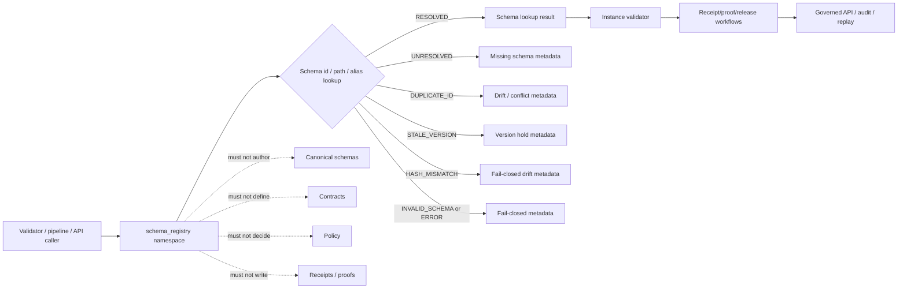

<!-- [KFM_META_BLOCK_V2]
doc_id: kfm://doc/NEEDS-VERIFICATION/packages-schema-registry-src-schema-registry-readme
title: Schema Registry Import Namespace README
type: readme
version: v1
status: draft
owners: OWNER_TBD
created: NEEDS VERIFICATION — target file existed before this repair but contained only placeholder text
updated: 2026-06-15
policy_label: public
related: [packages/schema-registry/README.md, packages/schema-registry/src/README.md, packages/hashing/README.md, packages/identity/README.md, packages/envelopes/README.md, packages/README.md, docs/doctrine/directory-rules.md, docs/adr/ADR-0001-schema-home--schemas-contracts-v1-is-canonical.md, docs/architecture/contract-schema-policy-split.md, schemas/contracts/v1/, contracts/, policy/, data/receipts/, data/proofs/, release/]
tags: [kfm, packages, schema-registry, import-namespace, json-schema, schema-id, canonical-schema, versioning, validation]
notes: ["Namespace guide for importable schema-registry helper code.", "This namespace may expose read-only schema loader, registry index, schema id, alias, schema-ref validation, hash-adapter, and synthetic fixture helpers only.", "It must not own canonical schemas, semantic contracts, policy rules, lifecycle data, source registries, receipts, proofs, release decisions, API routes, UI surfaces, source records, or AI truth claims."]
[/KFM_META_BLOCK_V2] -->

<a id="top"></a>

# `schema_registry` Import Namespace

Importable helper namespace for KFM schema-registry primitives: read-only schema loading, registry indexing, versioned `$id` resolution, alias checks, schema-ref validation, hash metadata, validation support, and synthetic fixtures.

<p>
  
  
  
  
  
  
</p>

> [!IMPORTANT]
> **Status:** PROPOSED import-namespace README  
> **Path:** `packages/schema-registry/src/schema_registry/README.md`  
> **Owning responsibility root:** `packages/`  
> **Package lane:** `packages/schema-registry/`  
> **Source envelope:** `packages/schema-registry/src/`  
> **Import namespace:** `schema_registry` — NEEDS VERIFICATION against package metadata  
> **Canonical schema authority:** `schemas/contracts/v1/`, not this namespace  
> **Semantic contract authority:** `contracts/`, not this namespace  
> **Policy authority:** `policy/`, not this namespace  
> **Receipt/proof authority:** `data/receipts/` and `data/proofs/`, not this namespace  
> **Release authority:** `release/`, not this namespace  
> **Repo implementation depth:** UNKNOWN for module files, exports, tests, package manager, CI workflows, schema publication bindings, validation reports, branch protections, and runtime behavior.

## Scope

`packages/schema-registry/src/schema_registry/` is the proposed importable namespace for reusable schema lookup and schema-reference helper code.

It may contain pure, deterministic helpers for:

- loading JSON Schemas from explicit canonical schema roots in read-only mode;
- resolving versioned schema IDs, `$id` values, aliases, package-resource paths, and local canonical paths;
- checking that schema refs point to admitted canonical schemas rather than ad hoc local copies;
- building in-memory or read-only registry indexes from explicit schema files;
- validating schema documents for stable IDs, draft/version declaration, title, type, status metadata, and expected KFM extension fields when required;
- exposing schema lookup results to validators, governed APIs, pipelines, release gates, receipt builders, proof builders, replay tools, local developer tools, and tests;
- preserving schema path, schema id, schema version, draft, contract ref, content hash, spec hash, and registry index metadata;
- detecting missing schemas, duplicate IDs, stale versions, invalid aliases, hash mismatches, and untrusted roots;
- building synthetic no-network fixtures for positive and negative schema lookup paths.

This namespace must not author canonical schemas, redefine semantic contracts, decide policy, write schema files as authority, store lifecycle data, write receipts or proofs, approve release, expose public routes, render UI, fetch source data, or generate truth claims.

## Namespace contract

The namespace is a schema lookup helper boundary, not the canonical schema home.

| Concern | Expected behavior | Authority home |
| --- | --- | --- |
| Schema loading | Read schemas from explicit canonical roots or package resources. | `schemas/contracts/v1/` owns canonical schemas. |
| Registry indexing | Build deterministic local indexes from supplied schema files. | Helper state only. |
| ID resolution | Resolve `$id`, versioned ids, aliases, and local canonical paths. | Schema governance owns ids and version rules. |
| Schema-ref validation | Detect missing, duplicate, stale, incompatible, or untrusted refs. | Validators and release workflows decide how to act. |
| Hash metadata | Carry schema/content/spec/index hashes. | `packages/hashing/` owns hash helpers. |
| Contract refs | Preserve contract refs without defining meaning. | `contracts/` owns semantic meaning. |
| Fixtures | Produce synthetic stable examples for tests only. | `tests/` and `fixtures/`, not production schema authority. |

## Expected modules

> [!NOTE]
> The tree below is PROPOSED. Confirm actual language, module names, package manager, and tests before treating these as implementation facts.

```text
packages/schema-registry/src/schema_registry/
├── README.md              # This file: namespace guide
├── __init__.py            # PROPOSED export boundary
├── loader.py              # PROPOSED read-only schema loading helpers
├── registry.py            # PROPOSED registry/index helpers
├── ids.py                 # PROPOSED schema id and alias helpers
├── validation.py          # PROPOSED schema-ref/registry validation helpers
├── hashing.py             # PROPOSED hash adapter helpers
├── fixtures.py            # PROPOSED synthetic fixtures
└── py.typed               # PROPOSED if typed package convention is confirmed
```

## Allowed exports

| Export family | Examples | Rule |
| --- | --- | --- |
| Loader helpers | `load_schema_catalog`, `load_schema_file`, `load_schema_root` | Read from explicit admitted roots only. |
| Registry helpers | `SchemaRegistry`, `build_schema_registry`, `lookup_schema` | Index and resolve; do not author schemas. |
| ID helpers | `SchemaId`, `normalize_schema_id`, `resolve_schema_alias` | Deterministic parsing and alias resolution only. |
| Validation helpers | `validate_schema_ref`, `check_schema_document`, `detect_duplicate_ids` | Local helper validation only; do not write reports. |
| Hash helpers | `schema_content_hash`, `registry_index_hash` | Delegate hash rules to hashing helpers where implemented. |
| Fixture helpers | `valid_schema_fixture`, `duplicate_id_fixture`, `missing_schema_fixture` | Synthetic and public-safe only. |

## Disallowed exports

| Disallowed export | Why |
| --- | --- |
| `write_schema`, `create_canonical_schema`, `promote_schema` | Canonical schema authority belongs in `schemas/contracts/v1/` plus governance. |
| `create_contract`, `define_contract_meaning` | Contracts own semantic meaning. |
| `evaluate_policy`, `allow_public` | Policy decisions belong to policy systems. |
| `write_receipt`, `write_proof`, `store_validation_report` | Receipts/proofs/reports are separate trust homes. |
| `approve_release`, `publish`, `promote` | Release authority belongs under `release/` and governed workflows. |
| `read_raw`, `fetch_source`, `poll_connector` | Source and lifecycle access belongs to connectors, pipelines, and data roots. |
| `ignore_duplicate_ids`, `force_schema_resolved`, `bypass_hash_check` | Drift and mismatch must fail closed or hold for review. |

## Import posture

Preferred imports, subject to package metadata verification:

```python
from schema_registry.loader import load_schema_catalog
from schema_registry.registry import SchemaRegistry
from schema_registry.validation import validate_schema_ref
```

Callers should treat schema-registry output as a candidate for validation, receipt/proof workflows, release preflight, governed API envelope construction, and replay comparison. `RESOLVED` is not proof of truth or release.

## Helper outcomes

| Outcome | Use when | Runtime posture |
| --- | --- | --- |
| `RESOLVED` | Schema id/path/alias resolves to one canonical schema. | Candidate for validation; not proof of semantic correctness. |
| `UNRESOLVED` | Schema id/path/alias cannot be found. | Fail closed or abstain depending on caller. |
| `DUPLICATE_ID` | More than one schema claims the same canonical id. | Block validation/release and require review. |
| `STALE_VERSION` | Schema ref points to a superseded or disallowed version. | Block or hold according to caller policy. |
| `HASH_MISMATCH` | Schema content hash/spec hash differs from expected value. | Fail closed and require drift review. |
| `INVALID_SCHEMA` | Schema document itself fails schema-registry checks. | Fail closed with validation metadata. |
| `UNTRUSTED_ROOT` | Schema was requested outside admitted schema roots. | Deny/hold; do not load. |
| `ERROR` | Runtime failure prevents a valid local helper result. | Fail closed with error metadata. |

`RESOLVED` is not proof of truth, contract meaning, policy allow, evidence closure, publication, or release. It only means one schema was located for the supplied ref.

## Trust-boundary flow



## Development rules

1. Keep the namespace read-only with respect to canonical schemas.
2. Prefer pure functions with explicit schema roots and registry inputs.
3. Preserve schema id, version, draft, contract ref, file path, content hash, spec hash, registry index hash, release ref, rollback ref, and validation profile supplied by callers.
4. Do not make network calls from this namespace unless a future ADR explicitly permits constrained schema fetches.
5. Do not read from RAW, WORK, QUARANTINE, unpublished candidates, source systems, source credentials, canonical stores outside admitted schema roots, private keys, or model runtimes.
6. Do not write schema files, lifecycle data, release records, receipts, proofs, policy rules, source registries, catalog records, API responses, or UI components.
7. Do not approve release, decide policy, resolve evidence as truth, define contract meaning, or generate public claims.
8. Return typed finite outcomes instead of implicit schema allow, warning-only duplicate IDs, hidden hash mismatch, or validation against local ad hoc schema copies.
9. Add deterministic tests for every export and every negative path.
10. Keep fixtures synthetic, sanitized, and public-safe.

## Validation checklist

- [ ] Confirm this namespace exists in package metadata.
- [ ] Confirm the package import name is actually `schema_registry`.
- [ ] Confirm `__init__` exports are intentional and minimal.
- [ ] Confirm canonical schema home from ADR-0001 and current repo layout.
- [ ] Confirm tests cover `RESOLVED`, `UNRESOLVED`, `DUPLICATE_ID`, `STALE_VERSION`, `HASH_MISMATCH`, `INVALID_SCHEMA`, `UNTRUSTED_ROOT`, and `ERROR` helper states if implemented.
- [ ] Confirm tests cover duplicate ids, stale versions, bad aliases, untrusted roots, invalid schema documents, hash mismatch, and no ad hoc schema root use.
- [ ] Confirm helpers do not import connectors, data stores, policy engines, release writers, model providers, API routers, UI components, credential systems, or receipt/proof stores.
- [ ] Confirm helpers do not access RAW/WORK/QUARANTINE, source systems, credentials, model runtimes, or unpublished candidate stores.

Suggested inspection commands:

```bash
find packages/schema-registry/src/schema_registry -maxdepth 3 -type f | sort
git grep -n "from schema_registry\|import schema_registry" -- . 2>/dev/null || true
git grep -n "SchemaRegistry\|\$id\|draft/2020-12\|schemas/contracts/v1\|DUPLICATE_ID\|HASH_MISMATCH" -- packages/schema-registry tests fixtures docs schemas contracts tools apps 2>/dev/null || true
```

## Rollback

Rollback is required if this namespace:

- becomes a parallel canonical schema home, contract home, policy home, source registry, lifecycle-data, evidence/proof, receipt, release, API, UI, credential, key-management, model-runtime, or source-data authority;
- writes schema files, mutates canonical schema IDs, rewrites aliases, emits receipts/proofs, approves release, or publishes artifacts as a helper namespace;
- lets public clients or normal UI surfaces access RAW, WORK, QUARANTINE, unpublished candidates, source systems, direct model outputs, or unreleased artifacts;
- treats schema resolution as proof of truth, evidence closure, admissibility, public safety, policy allow, or release;
- hides duplicate IDs, schema drift, stale versions, hash mismatches, or untrusted roots behind warning-only logs.

Rollback target: revert the namespace-source PR, keep generated audit notes as review evidence, and file any authority drift in `docs/registers/DRIFT_REGISTER.md` or `docs/registers/VERIFICATION_BACKLOG.md` if the mounted repo uses those registers.

## Evidence boundary

| Source | Status | Supports | Limits |
| --- | --- | --- | --- |
| Current target file | CONFIRMED | `packages/schema-registry/src/schema_registry/README.md` existed and required replacement from placeholder content. | Did not prove namespace implementation maturity. |
| Parent source README | CONFIRMED repo doc | `packages/schema-registry/src/` is bounded to schema-registry helper source code. | Does not prove package metadata, imports, tests, or CI. |
| Parent package README | CONFIRMED repo doc | `packages/schema-registry/` is a shared helper-code package for canonical JSON Schema loading, indexing, serving, and versioned ID resolution. | Does not prove source files or runtime bindings. |
| `packages/README.md` | CONFIRMED repo doc | `packages/` is for shared libraries used by apps, workers, pipelines, and tools. | Does not define this namespace. |
| Current file-generation pass | CONFIRMED request | User-requested target path and README repair/replacement. | Does not inspect package metadata, tests, CI logs, dashboards, deployment posture, validator behavior, or branch protection. |
