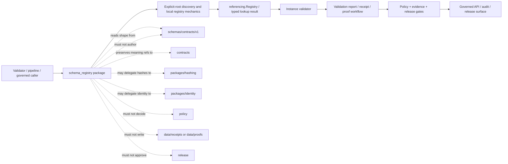

<!-- [KFM_META_BLOCK_V2]
doc_id: kfm://doc/packages-schema-registry-src-schema-registry-readme
title: packages/schema-registry/src/schema_registry/ — Python Namespace and Local Schema-Resolution Placeholder Boundary
type: readme
version: v1.1
status: draft
owners: OWNER_TBD — Schema steward · Contract steward · Schema-registry steward · Validation steward · Identity/hash steward · Security steward · Release steward · CI steward · Docs steward
created: NEEDS VERIFICATION — target existed before this evidence-grounded revision
updated: 2026-07-15
policy_label: "public-doctrine; package-source-boundary; python-namespace; greenfield-placeholder; build-unconfigured; api-unratified; consumers-unverified; tests-unestablished; read-only; explicit-roots; no-network-by-default; deterministic-index-candidate; duplicate-id-fail-closed; schema-authority-external; contract-subordinate; policy-subordinate; evidence-subordinate; release-subordinate; no-truth-authority; no-publication-authority; migration-required; rollback-aware"
current_path: packages/schema-registry/src/schema_registry/README.md
truth_posture: >
  CONFIRMED target README v1, package metadata name kfm-schema-registry and version 0.0.0,
  repository-present schema_registry namespace, empty __init__.py, comment-only core.py greenfield
  placeholder, parent package/source READMEs v1, packages responsibility-root doctrine, schemas root
  machine-shape authority, mixed-maturity schemas/contracts/v1 index, proposed ADR-0001 schema-home
  decision, working local schema registry implementation under tools/validators/_common/local_resolver.py,
  JSON Schema runner integration, five-validator run_all wiring, Makefile schemas target, schema-validation
  workflow, generic contract fixture harness, root jsonschema dependency, absent SCHEMA_REGISTRY_INDEX.md,
  and bounded absence of functional namespace modules, public exports, repository consumers,
  package-local tests, package-specific CI, accepted alias/version/status registry contract,
  emitted registry artifact, release use, deployment use, or operational health / PROPOSED a small
  reusable Python namespace for explicit-root read-only schema indexing, deterministic $id lookup,
  duplicate detection, typed local results, safe path handling, registry snapshots, compatibility
  checks, migration adapters, tests, correction, deprecation, and rollback / CONFLICTED prior README
  claims that describe implemented loaders, registries, exports, imports, aliases, version checks,
  hashes, and typed helper outcomes; working registry logic currently lives under tools/validators/_common
  rather than this package; Directory Rules/root doctrine treat schemas/contracts/v1 as canonical while
  ADR-0001 remains proposed; docs reference SCHEMA_REGISTRY_INDEX.md but the file was not found;
  mixed $id URI forms and source/sources, flat/domain, map/layers, and filename compatibility drift /
  UNKNOWN accepted package API, build backend, Python support policy, package discovery, dependency set,
  type-checking policy, semantic versioning, registry index object, schema admission/status model,
  alias grammar, version-selection policy, canonicalization/hash rules, exhaustive consumers,
  package test home, CI enforcement, release integration, deployment, and operational health /
  NEEDS VERIFICATION owners, maintainer approval, metadata completion, extraction-versus-retention ADR,
  current-resolver parity contract, registry artifact home, schema status authority, alias/version
  contract, hash/canonicalization delegation, first consumer, migration plan, security review,
  correction process, deprecation window, and rollback automation
evidence_snapshot:
  repository: bartytime4life/Kansas-Frontier-Matrix
  repository_id: "1059091169"
  visibility: public
  base_ref: main
  base_commit: faefb1f451cd0e5185b975ba8e78e69970680cb9
  prior_blob: 5a1928b2a758b3578a4422c6db009c9a5f2ed360
  package_readme_blob: 6b7a1a58286f0f44a1718a937b18ff4fd69121ed
  source_readme_blob: e984e23be218eafa77dd18896f88294a6a4b7f48
  package_metadata_blob: ea7e691f01556fd0a8b0f05eced840456ef51683
  namespace_init_blob: e69de29bb2d1d6434b8b29ae775ad8c2e48c5391
  namespace_core_blob: 7c969b655249403bb903bf91645e46f362a5b219
  root_pyproject_blob: e3bd40e8e6ce14dfcde78ff5c09608095c3eca76
  directory_rules_blob: 2affb080e6f0043867c64c7f06c1ca52030fbd55
  schema_root_readme_blob: 0021c5ee1e524e634930f7c6ec5f1df64b37c6ed
  schema_v1_index_blob: bbe931c9f7a5f0132522c0bda4fa5455c050a973
  schema_home_adr_blob: ab0010a278d766356845c23055f882f328abb418
  docs_registers_readme_blob: 6db7fd35778048412c57dad6556f9fe536d3f661
  local_resolver_blob: 171a2b8251d10fcc276107459a41056cdedc8ff5
  jsonschema_runner_blob: ce05ae25d0cb6fc29a2ea41db6c65a99ca5e13e6
  run_all_blob: 3375cce172631dc3675cf2e46bb7788d273ff425
  common_validator_readme_blob: 39eba24a5e5bfd5943c3f2f3ae69ca3102011b37
  common_schema_test_blob: b04342cc034d7f1cc554e155fdd02d6e972976e6
  schema_validation_workflow_blob: 4656da9884ec7cccef453c06ae26e8eee90992da
  makefile_blob: 4dc8cf633581893d83fba53219c6ea847992e6be
  bounded_path_checks:
    - packages/schema-registry/src/schema_registry/README.md existed at version v1 before this revision
    - packages/schema-registry/pyproject.toml declares kfm-schema-registry version 0.0.0 only
    - package pyproject contains no build-system, Python requirement, dependencies, optional dependencies, scripts, entry points, package-discovery configuration, or tool configuration
    - packages/schema-registry/src/schema_registry/__init__.py is empty
    - packages/schema-registry/src/schema_registry/core.py is a comment-only greenfield placeholder
    - bounded search found no functional schema_registry consumer import
    - bounded search surfaced only package/source/namespace READMEs and planning references for schema_registry
    - packages/schema-registry/tests/README.md was not found
    - tests/packages/schema-registry/README.md was not found
    - tests/packages/schema_registry/README.md was not found
    - docs/registers/SCHEMA_REGISTRY_INDEX.md was not found
    - tools/validators/_common/local_resolver.py recursively indexes schemas/contracts/v1/**/*.schema.json by $id
    - local_resolver skips schema documents without $id and raises on duplicate $id
    - tools/validators/_common/jsonschema_runner.py builds the local registry and passes it to Draft202012Validator
    - tools/validators/_common/run_all.py invokes five top-level schema validators with --fixtures
    - Makefile schemas runs tools/validators/_common/run_all.py
    - schema-validation workflow installs the root project and runs make schemas
    - tests/schemas/test_common_contracts.py discovers selected schema families with matching fixture directories
    - schemas/contracts/v1 is a mixed-maturity root with compatibility paths, scaffolds, detailed schemas, and unresolved namespace/path drift
related:
  - ../../README.md
  - ../README.md
  - ../../pyproject.toml
  - __init__.py
  - core.py
  - ../../../../pyproject.toml
  - ../../../../docs/doctrine/directory-rules.md
  - ../../../../docs/adr/ADR-0001-schema-home--schemas-contracts-v1-is-canonical.md
  - ../../../../docs/architecture/contract-schema-policy-split.md
  - ../../../../docs/registers/README.md
  - ../../../../schemas/README.md
  - ../../../../schemas/contracts/v1/README.md
  - ../../../../contracts/README.md
  - ../../../../policy/
  - ../../../../tools/validators/_common/README.md
  - ../../../../tools/validators/_common/local_resolver.py
  - ../../../../tools/validators/_common/jsonschema_runner.py
  - ../../../../tools/validators/_common/run_all.py
  - ../../../../tests/schemas/test_common_contracts.py
  - ../../../../.github/workflows/schema-validation.yml
  - ../../../../Makefile
tags: [kfm, packages, schema-registry, schema_registry, python, namespace, scaffold, json-schema, draft-2020-12, schema-id, local-resolver, registry, canonical-schema, compatibility, validation, determinism, migration, rollback]
notes:
  - "This revision changes only packages/schema-registry/src/schema_registry/README.md."
  - "The namespace currently contains this README, an empty __init__.py, and a comment-only core.py placeholder."
  - "The currently working local schema-registry implementation is under tools/validators/_common/local_resolver.py, not this package."
  - "This README does not install the package, define an accepted API, create exports, move validator code, establish a schema registry artifact, approve schemas, accept ADR-0001, or prove package/runtime behavior."
  - "Prior proposed module names, imports, exports, helper outcomes, alias behavior, and broad consumer claims are retained only as superseded documentation lineage; they are not implementation facts or compatibility commitments."
[/KFM_META_BLOCK_V2] -->

<a id="top"></a>

# `schema_registry` Python Namespace and Local Schema-Resolution Placeholder Boundary

`packages/schema-registry/src/schema_registry/`

> Repository-present Python namespace scaffold for a future reusable schema-registry helper library. Current evidence establishes an empty package initializer and a comment-only `core.py` placeholder—not a functional loader, registry, resolver, alias service, accepted API, canonical schema authority, validation report writer, release component, or public service. Working local `$id` registry construction currently lives under `tools/validators/_common/`.


**Quick links:** [Purpose](#purpose) · [Evidence](#status-and-evidence) · [Placement](#directory-rules-and-authority) · [Vocabulary](#bounded-context-and-ubiquitous-language) · [Inventory](#confirmed-namespace-inventory) · [Packaging](#packaging-import-and-api-status) · [Current implementation](#current-working-registry-implementation) · [Migration](#extraction-and-migration-boundary) · [Schema authority](#schema-root-contract-and-policy-boundaries) · [Registry model](#proposed-registry-responsibility-envelope) · [Identity](#schema-identity-id-version-and-alias-boundary) · [Admission](#schema-admission-status-and-file-presence) · [Inputs](#inputs-outputs-and-side-effects) · [Outcomes](#local-result-vocabulary) · [Dependencies](#dependency-direction) · [Determinism](#determinism-canonicalization-and-hashing) · [Security](#security-paths-resource-limits-and-privacy) · [Consumers](#consumer-versioning-and-compatibility-boundary) · [Testing](#testing-fixtures-and-ci) · [Implementation](#smallest-sound-implementation-sequence) · [Done](#definition-of-done) · [Open](#verification-register) · [Drift](#drift-and-conflicts) · [Rollback](#rollback-correction-and-deprecation)

> [!IMPORTANT]
> **This README is not implementation evidence for `kfm-schema-registry`.** It does not establish package installation, import success, exports, alias/version resolution, registry snapshots, hash enforcement, consumer adoption, package tests, CI enforcement, release use, deployment, or operational health.

> [!CAUTION]
> **Schema resolution is not semantic correctness, policy approval, evidence closure, release approval, or public truth.** Locating a schema or validating an instance cannot authorize publication or cure missing evidence, rights, sensitivity, review, or rollback support.

---

<a id="purpose"></a>

## Purpose

This README defines the responsibility and verification boundary for:

```text
packages/schema-registry/src/schema_registry/
```

The namespace is intended to become a **small reusable Python library** for read-only schema discovery and resolution mechanics shared by multiple validators, governed callers, pipelines, release preflight tools, local developer tools, or tests.

The current repository state is narrower:

- `__init__.py` is empty;
- `core.py` is a comment-only greenfield placeholder;
- no functional namespace module or export is established;
- no consuming import surfaced in bounded repository search;
- the package manifest is a `0.0.0` stub without build or `src/` discovery configuration;
- no package-local test lane or package-specific CI was established at the checked paths;
- no accepted schema-registry index object or generated registry artifact was found;
- `docs/registers/SCHEMA_REGISTRY_INDEX.md`, referenced as a proposed register, was not found;
- working local registry construction currently lives in validator tooling outside this package.

This README therefore:

1. records the **CONFIRMED placeholder state**;
2. documents the **CONFIRMED existing validator implementation** without claiming ownership here;
3. defines a **PROPOSED reusable package boundary**;
4. makes migration, parity, schema authority, compatibility, security, validation, correction, and rollback obligations explicit.

It must not substitute for code, schemas, semantic contracts, registry records, validator reports, fixtures, tests, receipts, proofs, release records, CI results, or runtime evidence.

[Back to top](#top)

---

<a id="status-and-evidence"></a>

## Status and evidence

### Evidence verdict

| Surface | Status | Safe conclusion |
|---|---:|---|
| Target README | **CONFIRMED v1 before revision** | Namespace documentation existed but over-described implementation. |
| Package metadata | **CONFIRMED placeholder** | Distribution name `kfm-schema-registry`, version `0.0.0`. |
| Build/discovery | **NOT DECLARED** | The subpackage is not proved buildable or importable. |
| Namespace | **CONFIRMED present** | Repository path exists. |
| `__init__.py` | **CONFIRMED empty** | No exports. |
| `core.py` | **CONFIRMED comment-only** | No package behavior. |
| Functional package modules | **NOT FOUND by bounded checks** | Prior module names are not implementation facts. |
| Package consumers | **NOT FOUND by bounded search** | No adoption is proved. |
| Package tests | **NOT FOUND at checked README paths** | No package behavior is proved. |
| Canonical schema root | **CONFIRMED doctrine/root responsibility** | `schemas/` owns machine shape. |
| `schemas/contracts/v1/` | **CONFIRMED mixed maturity** | Contains detailed schemas, scaffolds, indexes, and compatibility drift. |
| ADR-0001 | **CONFIRMED proposed** | Documents the canonical schema-home decision but is not accepted. |
| Working local registry | **CONFIRMED code** | Validator helper recursively indexes canonical-root schema files by `$id`. |
| Duplicate `$id` behavior | **CONFIRMED code** | Current helper raises `ValueError`. |
| Missing `$id` behavior | **CONFIRMED code** | Current helper skips those schema documents. |
| JSON Schema integration | **CONFIRMED code** | `Draft202012Validator` receives the local registry. |
| Schema workflow | **CONFIRMED executable path** | Workflow runs `make schemas`; exact coverage remains bounded. |
| Human schema registry index | **NOT FOUND** | Proposed docs register is not current evidence. |
| Machine registry artifact | **UNKNOWN** | No accepted instance was verified. |
| Release/runtime health | **UNKNOWN** | No package deployment or service exists in evidence. |

### Corrections from v1

| Prior implication | Current evidence | Correction |
|---|---|---|
| Importable loader/registry implementation exists here | Namespace has only empty/comment placeholders | Reclassify as greenfield scaffold. |
| Named modules and imports are usable | Modules are absent | Retain names only as non-binding design lineage. |
| `SchemaRegistry` and helper exports exist | No exports exist | Treat API as unratified. |
| Alias/version/hash behavior is implemented | Current resolver only indexes `$id` and rejects duplicates | Separate present behavior from proposed extensions. |
| Typed helper outcomes exist | Current implementation raises exceptions and returns `referencing.Registry` | Outcome contract remains proposed. |
| Package owns working registry behavior | Working code is under validator tooling | Require governed extraction or deliberate retention. |
| Schema-home ADR is accepted | ADR metadata says `proposed` | Preserve doctrine/ADR status conflict. |
| A schema registry index exists | Referenced Markdown register was not found | Do not claim registry artifact maturity. |
| Broad callers consume this package | Search surfaced docs/planning only | Require first-consumer evidence. |

[Back to top](#top)

---

<a id="directory-rules-and-authority"></a>

## Directory Rules and authority

Directory Rules place reusable libraries under `packages/` and require a package to be reusable. One-off validator execution belongs under `tools/`, tests under `tests/`, schemas under `schemas/`, and semantic contracts under `contracts/`.

The namespace is correctly placed only if future code:

- is shared by more than one governed caller or is being extracted under an accepted migration;
- remains read-only toward canonical schemas;
- keeps schema authority in `schemas/`;
- does not absorb validator CLI orchestration;
- does not create a parallel schema registry authority;
- is deterministic where promised;
- has explicit roots and no hidden network behavior;
- is tested independently and through consumers.

### Responsibility map

| Responsibility | Governing home | Namespace relationship |
|---|---|---|
| Python registry mechanics | This namespace, after implementation | Candidate reusable library only. |
| Package build/distribution | `packages/schema-registry/pyproject.toml` | Currently incomplete. |
| Canonical machine shape | `schemas/`, normally `schemas/contracts/v1/` | Read/index only; never author by default. |
| Semantic meaning | `contracts/` | Preserve refs; do not redefine. |
| Policy/admissibility | `policy/` | Consume decisions; do not decide. |
| Validator entrypoints | `tools/validators/` | May consume package later; retain orchestration. |
| Current shared validator plumbing | `tools/validators/_common/` | Current implementation owner until migrated. |
| Fixtures/examples | `fixtures/` | Package may use synthetic fixtures; not own canonical examples. |
| Executable tests | `tests/` | Proves behavior; not schema authority. |
| Human registers | `docs/registers/` | Explain/index; do not define schema shape. |
| Machine registers | `control_plane/` when accepted | Index metadata; do not replace schemas. |
| Hashing/identity | accepted hashing/identity packages or contracts | Delegate; avoid competing rules. |
| Receipts/proofs | `data/receipts/`, `data/proofs/` | Package may return candidate metadata only. |
| Release/correction/rollback | `release/` | Package cannot approve or publish. |
| Public API/UI | governed application roots | Must not expose namespace internals as authority. |

### Authority statement

This namespace may eventually implement **lookup mechanics**. It must never decide that:

- a schema is canonical merely because it is present;
- a schema family is complete;
- an ADR is accepted;
- an instance is semantically correct;
- a policy gate allows an action;
- evidence is sufficient;
- rights or sensitivity are cleared;
- a release is approved;
- a public response is safe.

Those conclusions require their governing records and workflows.

### No parallel authority

Do not create package-local canonical copies of:

- schema files;
- schema-family README authority;
- semantic contracts;
- schema admission records;
- policy;
- fixture families;
- validator reports;
- human or machine registers;
- release manifests;
- correction or rollback records.

An in-memory index or generated snapshot is derived state. It must point back to canonical schema content and carry enough lineage to be rebuilt and audited.

[Back to top](#top)

---

<a id="bounded-context-and-ubiquitous-language"></a>

## Bounded context and ubiquitous language

| Term | Meaning here | Must not mean |
|---|---|---|
| Canonical schema root | Accepted machine-shape root, currently doctrine-targeted to `schemas/contracts/v1/`. | Every file below the directory is automatically mature or released. |
| Schema document | One parsed machine-shape document. | Semantic contract or policy. |
| `$id` | Schema identifier declared inside a schema document. | Proof of canonical status. |
| Registry | In-memory mapping used for reference resolution. | Source-of-truth database or release registry. |
| Registry snapshot | Deterministic derived index with lineage. | Independent canonical schema authority. |
| Resource | Parsed schema registered with the `referencing` library. | KFM evidence resource. |
| Resolution | Mapping a requested reference to one schema resource. | Validation success, truth, or publication approval. |
| Validation | Checking an instance against machine shape. | Evidence closure or semantic correctness. |
| Admission | Governed decision that a schema/version belongs in an accepted registry profile. | Filesystem discovery alone. |
| Alias | Explicit compatibility mapping from one schema reference to another. | Implicit basename or “latest” guessing. |
| Version | Declared, governed schema/contract version. | File modification time. |
| Compatibility | Evidence that old/new references or payloads behave under an accepted policy. | Successful parse only. |
| Canonicalization | Versioned byte/value normalization used before hashing. | Arbitrary JSON reformatting. |
| Hash | Integrity value over an accepted canonical representation. | Admission or semantic proof. |

```text
SchemaPresent != SchemaCanonical
SchemaResolved != InstanceValid
InstanceValid != SemanticallyCorrect
SchemaValid != PolicyAllowed
SchemaValid != EvidenceClosed
SchemaValid != ReleaseApproved
RegistryBuilt != RegistryAuthoritative
ADRProposed != ADRAccepted
GeneratedIndex != CanonicalSchema
```

[Back to top](#top)

---

<a id="confirmed-namespace-inventory"></a>

## Confirmed namespace inventory

```text
packages/schema-registry/src/schema_registry/
├── README.md
├── __init__.py
└── core.py
```

| Path | Status | Current meaning |
|---|---:|---|
| `README.md` | **CONFIRMED** | Namespace boundary; revised here. |
| `__init__.py` | **CONFIRMED empty** | Package marker only; no exports. |
| `core.py` | **CONFIRMED comment-only** | Greenfield placeholder; no behavior. |

Not established:

- `loader.py`;
- `registry.py`;
- `ids.py`;
- `aliases.py`;
- `versions.py`;
- `validation.py`;
- `hashing.py`;
- `snapshots.py`;
- `errors.py`;
- `fixtures.py`;
- `py.typed`;
- public exports;
- entry points;
- service APIs;
- package tests;
- package fixtures;
- package-specific CI;
- registry artifact generation;
- registry artifact persistence;
- release integration.

Prior module and export names remain design prompts only—not implementation, approved architecture, reserved API, or compatibility commitments.

[Back to top](#top)

---

<a id="packaging-import-and-api-status"></a>

## Packaging, import, and API status

Confirmed package metadata:

```toml
[project]
name = "kfm-schema-registry"
version = "0.0.0"
```

The subpackage manifest does not declare:

- `[build-system]`;
- supported Python versions;
- description;
- README binding;
- license;
- authors or maintainers;
- dependencies;
- optional dependencies;
- scripts or entry points;
- `src/` package discovery;
- type support;
- version source;
- test/lint/type configuration;
- artifact publication policy.

The repository root project uses Hatchling, declares Python `>=3.11`, and depends on `jsonschema` for the current validator-local resolver. The root manifest explicitly says subpackages carry their own manifests, and the root wheel packages `src/kfm`. Therefore root configuration does not prove this subpackage can build or install.

The distribution name:

```text
kfm-schema-registry
```

and repository namespace path:

```text
schema_registry
```

are present, but their mapping is unconfigured and untested.

Before treating the namespace as importable:

1. declare an accepted build backend;
2. declare supported Python versions;
3. configure `src/` package discovery;
4. declare dependencies such as `jsonschema` and `referencing` only if required;
5. build and inspect a wheel;
6. install into a clean environment;
7. import `schema_registry`;
8. verify package metadata;
9. prove import performs no schema scan, filesystem traversal, network access, or global registry build;
10. prove the current validator path still works or has an explicit migration.

**No public package API is established.**

[Back to top](#top)

---

<a id="current-working-registry-implementation"></a>

## Current working registry implementation

The repository already contains functional local registry behavior outside this package:

```text
tools/validators/_common/local_resolver.py
tools/validators/_common/jsonschema_runner.py
tools/validators/_common/run_all.py
```

### Confirmed `local_resolver.py` behavior

The current `build_registry(repo_root)` implementation:

1. sets the root to `schemas/contracts/v1`;
2. raises `FileNotFoundError` when that root is absent;
3. recursively discovers `*.schema.json`;
4. parses each file as JSON;
5. reads `$id`;
6. skips documents without `$id`;
7. raises `ValueError` when two documents claim the same `$id`;
8. converts schemas to `referencing.Resource`;
9. returns a `referencing.Registry`.

### Confirmed integration

`jsonschema_runner.load_validator(schema_path)`:

- reads the target schema;
- resolves the repository root;
- builds the local registry;
- constructs `Draft202012Validator(schema, registry=registry)`.

`run_all.py` currently invokes five top-level validators with `--fixtures`:

```text
validate_source_descriptor.py
validate_evidence_bundle.py
validate_runtime_response_envelope.py
validate_decision_envelope.py
validate_run_receipt.py
```

The `Makefile` target:

```make
schemas:
    python tools/validators/_common/run_all.py
```

is invoked by the `schema-validation` workflow after installing the root project.

### Current limitations

The inspected resolver does **not** establish:

- package API or exports;
- alias handling;
- version selection;
- schema status/admission;
- schema path allowlists beyond the fixed root;
- symlink policy;
- registry snapshot serialization;
- content/spec hashes;
- contract-ref validation;
- schema-meta validation;
- `$id` URI grammar enforcement;
- rich typed outcomes;
- partial-index diagnostics;
- schema family ownership;
- release-state integration;
- network or remote resolution;
- operational service behavior.

### Ownership conclusion

The working behavior belongs to validator plumbing today. It must not be described as package behavior until one of these paths is accepted:

- **retain:** keep the implementation under `tools/validators/_common/` and keep this package inert;
- **extract:** move reusable mechanics into this package with parity tests and compatibility adapters;
- **delegate:** implement the package and make validator tooling a thin consumer without breaking existing entrypoints.

README prose cannot choose among those architecture paths by itself.

[Back to top](#top)

---

<a id="extraction-and-migration-boundary"></a>

## Extraction and migration boundary

Any move from validator-local code into `schema_registry` is a governed change, not a copy-and-paste cleanup.

### Required preconditions

- accepted owner for package and validator plumbing;
- explicit decision on retain/extract/delegate;
- current-behavior tests before refactor;
- package build/install/import support;
- dependency review;
- API contract;
- deterministic root/path policy;
- parity for `$id` indexing and duplicate detection;
- compatibility plan for current validator imports;
- rollback to the current implementation;
- no parallel implementation left active without a deprecation plan.

### Parity contract

At minimum, an extracted implementation must preserve:

| Current behavior | Required parity decision |
|---|---|
| Root is `schemas/contracts/v1` | Preserve default via explicit caller/config, or document a governed change. |
| Recursive `*.schema.json` discovery | Preserve or replace with an explicit manifest; test both. |
| Missing root raises | Preserve fail-closed behavior with stable result/exception mapping. |
| Missing `$id` is skipped | Decide whether to preserve, warn, fail, or report; do not change silently. |
| Duplicate `$id` raises | Preserve fail-closed duplicate detection. |
| `Resource.from_contents` | Preserve dialect/resource compatibility. |
| `referencing.Registry` output | Preserve caller compatibility or provide an adapter. |
| `Draft202012Validator` integration | Preserve validator behavior and reference resolution. |
| No network fetch | Preserve as default. |

### Compatibility adapter

A safe migration can initially keep:

```python
# tools/validators/_common/local_resolver.py
from schema_registry import build_registry
```

only after:

- the package is installable in root CI;
- the import does not scan at module import time;
- package tests prove parity;
- current validators pass;
- rollback can restore the prior implementation;
- the package API is versioned and documented.

### No dual-active drift

Do not keep two independently evolving registry builders. During migration, one implementation must be authoritative for mechanics and the other must be a thin compatibility adapter.

[Back to top](#top)

---

<a id="schema-root-contract-and-policy-boundaries"></a>

## Schema root, contract, and policy boundaries

### Schema root

`schemas/` owns machine-checkable shape. Its current root README states that schema validation is necessary but not sufficient and that validator implementation remains under `tools/validators/`.

`schemas/contracts/v1/` is a mixed-maturity index. It contains:

- detailed schema families;
- permissive or empty scaffolds;
- compatibility indexes;
- flat and domain paths;
- singular/plural path variants;
- mixed `$id` URI forms;
- unresolved file-name and family-placement drift.

The registry must preserve those facts. It must not upgrade every discovered file to “canonical, complete, or released.”

### ADR-0001 status

ADR-0001 states the proposed decision that `schemas/contracts/v1/` is canonical for machine shape. Its metadata and status table say `proposed`.

Directory Rules and root schema doctrine treat the schema-home rule as operative doctrine. This creates an evidence-visible status tension:

- **CONFIRMED doctrine target:** new machine schemas belong under `schemas/contracts/v1/...`;
- **CONFIRMED ADR state:** `proposed`;
- **NEEDS VERIFICATION:** formal acceptance/sign-off and migration completion.

Package code must not mark the ADR accepted or infer schema admission from path alone.

### Contracts

`contracts/` owns meaning. Registry results may carry contract references but cannot validate semantic sufficiency unless an accepted semantic validator exists.

### Policy

`policy/` owns admissibility. Schema resolution and shape validation cannot allow publication, downgrade sensitivity, or override rights/evidence/release gates.

### Fixtures and tests

Fixtures prove examples. Tests prove executable behavior. Neither becomes schema authority.

### Registers

`docs/registers/README.md` proposes an optional `SCHEMA_REGISTRY_INDEX.md`; the file was not found. A future human index or machine register may record owners, versions, status, and migrations, but must not duplicate schema shape or silently override actual schema files and accepted decisions.

[Back to top](#top)

---

<a id="proposed-registry-responsibility-envelope"></a>

## Proposed registry responsibility envelope

Everything in this section is **PROPOSED** until implemented and tested.

### Candidate responsibilities

| Candidate area | Narrow role | Excluded authority |
|---|---|---|
| Explicit root model | Represent one or more caller-approved local schema roots. | Does not approve roots. |
| File discovery | Enumerate accepted file patterns deterministically. | Does not admit schema status. |
| JSON parsing | Parse bounded local schema files. | Does not repair invalid schemas silently. |
| `$id` extraction | Read and normalize under an accepted grammar. | Does not invent missing IDs. |
| Duplicate detection | Detect exact/conflicting identifiers. | Does not choose a winner. |
| Registry construction | Build an in-memory `referencing.Registry`. | Does not persist authority. |
| Lookup | Resolve an exact identifier or explicit compatibility alias. | Does not guess “latest.” |
| Registry snapshot | Produce a deterministic derived index. | Does not replace source schemas. |
| Contract-ref checks | Verify declared refs resolve where required. | Does not define contract meaning. |
| Hash input preparation | Canonicalize explicit metadata under a versioned profile. | Does not invent hashing policy. |
| Compatibility comparison | Compare two explicit registry snapshots/profiles. | Does not approve migrations. |
| Diagnostics | Return stable, safe reason codes and locations. | Does not write authoritative reports. |
| Test builders | Build synthetic schema trees and conflicts. | Does not copy sensitive production content. |

### Non-responsibilities

The namespace must not become:

- a canonical schema authoring system;
- a schema promotion engine;
- a mutable “latest schema” service;
- a remote schema crawler;
- a semantic-contract registry;
- a policy engine;
- a source registry;
- an evidence resolver;
- a validation report store;
- a receipt/proof database;
- a release manager;
- a public API;
- a UI registry browser;
- an AI schema generator that writes canonical files;
- a secret or credential manager.

### Reuse threshold

A helper belongs here only when:

- at least two governed callers need the same mechanics;
- validator-local duplication is proven;
- extraction reduces drift without obscuring authority;
- the behavior has a stable contract and test matrix;
- the package remains smaller than the orchestration it serves.

“Registry” is not permission to centralize every schema-related responsibility.

[Back to top](#top)

---

<a id="schema-identity-id-version-and-alias-boundary"></a>

## Schema identity, `$id`, version, and alias boundary

### Current evidence

The current working resolver uses exact `$id` strings as registry keys.

It does not enforce:

- one URI scheme;
- one hostname;
- version segments;
- title-to-ID consistency;
- path-to-ID consistency;
- aliases;
- status;
- supersession;
- deprecation;
- release state.

The schema root index explicitly records mixed `$id` forms such as `kfm://...` and `https://schemas.kfm.local/...`.

### Identity rules for future code

Future code should distinguish:

| Identity | Example role |
|---|---|
| File path | Repository location of the schema document. |
| `$id` | Schema-declared resolution identifier. |
| Family | Logical object/schema family. |
| Contract version | Semantic contract version. |
| Schema version | Machine-shape version. |
| Registry profile | Set of admitted roots, aliases, and status rules. |
| Snapshot ID/hash | Identity of a derived registry build. |
| Release ref | Governing release that pins schema use, if applicable. |

Do not collapse these identities.

### Missing `$id`

Current behavior skips schemas without `$id`. Before changing it, decide:

- whether all registry-admitted schemas require `$id`;
- whether missing IDs are warnings, negative results, or fatal;
- whether compatibility scaffolds may remain unregistered;
- how diagnostics identify skipped paths;
- how CI enforces the decision.

### Duplicate `$id`

Duplicate IDs must fail closed. A registry must never pick a winner by:

- filesystem order;
- newest timestamp;
- shortest path;
- lexicographic path;
- current branch;
- first successful parse.

A migration may define an explicit alias or supersession relationship, but that is not the same as duplicate ownership.

### Aliases

Aliases must be explicit, versioned, and reviewable. Avoid:

- basename guesses;
- implicit hyphen/underscore normalization;
- singular/plural guessing;
- mutable `latest`;
- redirects derived only from directory names;
- cross-family fallback.

### Version selection

Version selection requires an accepted contract. Until then, callers should request an exact ID/profile rather than “best,” “current,” or “latest.”

[Back to top](#top)

---

<a id="schema-admission-status-and-file-presence"></a>

## Schema admission, status, and file presence

### File presence is not admission

A schema file may be:

- detailed;
- permissive scaffold;
- compatibility pointer;
- duplicate lineage;
- deprecated;
- proposed;
- conflicted;
- invalid;
- missing fixtures;
- unreviewed;
- unreleased.

A recursive filesystem index sees files, not governance status.

### Proposed admission profile

A future registry profile may include explicit rules for:

- accepted roots;
- included/excluded families;
- schema status;
- ADR/migration state;
- allowed `$id` schemes;
- required contract refs;
- required fixtures;
- validator support;
- release/version pins;
- deprecated or blocked IDs;
- compatibility aliases;
- checksum or snapshot pinning.

The source of those rules must be a governed register/config/contract, not hard-coded guesses.

### Status separation

Keep these states separate:

| State family | Example | Owner |
|---|---|---|
| File discovery | found, missing, unreadable | Registry mechanics. |
| JSON parse | parsed, invalid JSON | Registry mechanics. |
| Resource build | registered, unsupported dialect | Registry mechanics. |
| Schema meta-validation | valid schema, invalid schema | Schema validator. |
| Registry admission | admitted, excluded, deprecated, conflicted | Governed schema registry profile. |
| Instance validation | pass, fail, error | Validator. |
| Policy/release | allow, deny, hold, released | Policy/release workflows. |

A discovered and parseable schema is not necessarily admitted.

### Registry artifact

No accepted registry artifact home or schema was verified. Before creating one, decide:

- human versus machine representation;
- canonical owner;
- generation command;
- deterministic ordering;
- source schema and profile refs;
- status and alias fields;
- snapshot hash;
- storage and release class;
- correction and rollback behavior;
- whether it belongs under `control_plane/`, generated artifacts, or another accepted root.

Do not create a new root or parallel register without Directory Rules/ADR review.

[Back to top](#top)

---

<a id="inputs-outputs-and-side-effects"></a>

## Inputs, outputs, and side effects

### Future accepted inputs

| Input family | Examples | Required handling |
|---|---|---|
| Repository/root | explicit repository root or accepted schema roots | Resolve safely; no ambient CWD dependency. |
| Discovery profile | file pattern, exclusions, symlink policy | Version and validate. |
| Schema reference | exact `$id`, path, or approved alias | Never guess silently. |
| Registry profile | admitted families/status/alias/version policy | Caller supplies approved profile. |
| Expected integrity | content hash, snapshot hash, spec hash | Verify under accepted canonicalization. |
| Contract context | contract refs and versions | Preserve; do not redefine. |
| Compatibility context | old/new IDs, migration ref, deprecation state | Compare explicitly. |
| Resource limits | max files, bytes, nesting, timeout | Enforce before untrusted parsing. |
| Clock | injected evaluation time when required | Avoid hidden time reads. |
| Fixture context | synthetic schema trees | Public-safe and deterministic. |

### Prohibited hidden inputs

Do not depend silently on:

- current working directory;
- user home;
- current branch;
- file modification time;
- environment variables;
- mutable global registry;
- network availability;
- DNS;
- remote schema stores;
- implicit “latest” release;
- UI state;
- operator memory;
- generated language.

### Future outputs

A result may include:

- requested reference;
- normalized exact identifier;
- resolved path;
- source root/profile;
- parsed schema/resource;
- schema draft/dialect;
- duplicate/conflict paths;
- skipped paths and reasons;
- contract refs;
- version/status metadata supplied by the profile;
- canonicalization profile;
- content/snapshot hash;
- deterministic diagnostics;
- compatibility/deprecation metadata.

Outputs must not include secrets, private source data, raw personal/DNA data, precise protected locations, or unrestricted internal review detail.

### Side-effect default

The namespace should be pure/read-only and offline by default.

It must not:

- write schema files;
- rewrite `$id`;
- mutate aliases;
- download remote refs;
- persist registries automatically;
- write validation reports;
- write receipts/proofs;
- update release state;
- scan at import time;
- start a service;
- read credentials;
- invoke AI.

Effectful snapshot writing or remote retrieval, if ever approved, should be isolated outside the core namespace or behind explicit adapters and policy.

[Back to top](#top)

---

<a id="local-result-vocabulary"></a>

## Local result vocabulary

The prior README presented these as current helper outcomes:

```text
RESOLVED
UNRESOLVED
DUPLICATE_ID
STALE_VERSION
HASH_MISMATCH
INVALID_SCHEMA
UNTRUSTED_ROOT
ERROR
```

No implemented package enum or result model was found.

The current validator-local code instead:

- returns `referencing.Registry` on success;
- raises `FileNotFoundError` for a missing root;
- raises `ValueError` for duplicate `$id`;
- may propagate JSON/resource parsing errors;
- silently skips missing `$id`.

Therefore the package outcome vocabulary is **UNRATIFIED**.

### Proposed result layers

| Layer | Candidate states | Status |
|---|---|---:|
| Discovery | found, missing, unreadable, excluded | **PROPOSED** |
| Parse | parsed, invalid-json, unsupported-resource | **PROPOSED** |
| Identity | registered, missing-id, duplicate-id, invalid-id | **PROPOSED** |
| Admission | admitted, excluded, deprecated, conflicted | **PROPOSED / requires governed profile** |
| Lookup | resolved, unresolved, alias-resolved, ambiguous | **PROPOSED** |
| Integrity | match, mismatch, unavailable | **PROPOSED** |
| Compatibility | compatible, breaking, migration-required, unknown | **PROPOSED** |
| Process | error | **PROPOSED** |

### Exception/result compatibility

An accepted API must decide which expected negative states return typed results and which programmer/infrastructure faults raise exceptions.

Migration must preserve existing callers. It must not silently turn a previously fatal duplicate into a warning.

### Outcome anti-collapse

Keep distinct:

```text
UNRESOLVED != INVALID_SCHEMA
MISSING_ID != DUPLICATE_ID
AMBIGUOUS != RESOLVED
HASH_MISMATCH != VERSION_CONFLICT
EXCLUDED != MISSING
VALIDATION_FAIL != REGISTRY_BUILD_FAIL
REGISTRY_BUILD_PASS != RELEASE_APPROVED
```

[Back to top](#top)

---

<a id="dependency-direction"></a>

## Dependency direction



### Allowed dependencies

The core package may need:

- Python standard library;
- `jsonschema`;
- `referencing`;
- accepted hashing/identity interfaces after they exist.

Any dependency addition requires:

- necessity;
- version bounds;
- license/security review;
- offline behavior;
- import-time safety;
- transitive dependency review;
- CI coverage.

### Forbidden dependency direction

Avoid:

```text
schema-registry -> validator entrypoint -> schema-registry
schema-registry -> governed API -> schema-registry
schema-registry -> release workflow -> schema-registry
schema-registry -> connector/source fetch -> schema-registry
schema-registry -> data store -> schema-registry
```

Keep orchestration in callers and use small value/protocol boundaries.

### Current dependency reality

The root project currently carries `jsonschema` for validator-local code. This subpackage declares no dependencies. Extraction must decide whether the subpackage owns direct dependencies or relies on a workspace installation contract.

[Back to top](#top)

---

<a id="determinism-canonicalization-and-hashing"></a>

## Determinism, canonicalization, and hashing

### Deterministic registry build

Given identical:

- explicit roots;
- discovery profile;
- schema files;
- registry/admission profile;
- parser/library versions;
- alias/version rules;
- canonicalization profile;

the resulting index and diagnostics should be equivalent.

Control:

- path ordering;
- Unicode normalization;
- symlink resolution;
- JSON parsing;
- URI normalization;
- duplicate ordering;
- optional/missing fields;
- schema dialect;
- registry resource order;
- diagnostic ordering.

### Canonicalization

Do not hash arbitrary pretty-printed JSON. Define or delegate a versioned canonicalization rule.

ADR-0001 explicitly excludes canonicalization, hash derivation, and `$id` derivation. This package must not fill that governance gap by implementation accident.

### Hashes

Possible hashes include:

- raw file hash;
- canonical schema-content hash;
- registry snapshot hash;
- discovery profile hash;
- admission profile hash;
- alias-map hash.

Each must identify:

- algorithm;
- canonicalization;
- included fields;
- ordering;
- version;
- purpose.

A matching hash proves integrity under that rule, not admission or semantic correctness.

### Snapshot reproducibility

A future registry snapshot should be reproducible from:

- exact repository/code ref;
- schema roots;
- profile refs;
- dependency versions;
- canonicalization version;
- source schema hashes.

Unexplained snapshot drift should block promotion or route to review.

[Back to top](#top)

---

<a id="security-paths-resource-limits-and-privacy"></a>

## Security, paths, resource limits, and privacy

### Threat model

Registry code can weaken KFM if it permits:

- path traversal outside admitted roots;
- symlink escape;
- arbitrary file loading;
- remote `$ref` retrieval;
- schema bombs or excessive recursion;
- unbounded file counts or sizes;
- duplicate-ID winner selection;
- mutable “latest” aliases;
- hidden fallback to local copies;
- untrusted plugins or custom format code;
- import-time filesystem scans;
- sensitive data in diagnostics or fixtures;
- registry snapshots mistaken for release authority.

### Path safety

Future code should:

1. resolve roots explicitly;
2. normalize requested paths;
3. verify containment after symlink resolution;
4. define symlink policy;
5. reject device/special files;
6. constrain file suffixes and types;
7. avoid following arbitrary external refs;
8. return safe relative paths in diagnostics where appropriate.

### Remote references

Default posture: **no network**.

If remote resolution is ever approved, require:

- ADR/security review;
- explicit allowlist;
- TLS and certificate policy;
- size/time limits;
- digest pinning;
- cache provenance;
- offline replay;
- fail-closed behavior;
- no credential leakage;
- receipt/proof handling.

### Resource limits

Define limits for:

- number of roots;
- number of files;
- file size;
- JSON depth;
- `$ref` depth;
- resolution cycles;
- total bytes;
- build time;
- diagnostic count.

### Privacy and sensitive content

Schemas are usually public-safe machine shape, but names, descriptions, examples, defaults, and enums may reveal sensitive design details.

Do not expose:

- credentials;
- internal paths that reveal secrets;
- private-person identifiers;
- DNA/genomic examples;
- exact protected locations;
- restricted infrastructure details;
- hidden policy thresholds;
- source credentials;
- unrestricted review notes.

Fixtures must be synthetic and public-safe.

[Back to top](#top)

---

<a id="consumer-versioning-and-compatibility-boundary"></a>

## Consumer, versioning, and compatibility boundary

### Current consumers

Bounded repository search did not establish a functional import of `schema_registry`.

The current validator system consumes:

```text
tools.validators._common.local_resolver
```

not this package.

Repeat consumer and import search immediately before:

- adding exports;
- moving current resolver code;
- changing `$id` behavior;
- changing duplicate handling;
- changing root discovery;
- removing compatibility adapters.

### First-consumer rule

The first package consumer should be the current validator plumbing only if maintainers accept extraction.

A safe first migration:

- adds current-behavior tests;
- installs the subpackage;
- exposes one narrow `build_registry` API;
- makes `local_resolver.py` a thin adapter;
- runs all existing validator/schema tests;
- preserves exception/result behavior;
- provides a one-commit revert or compatibility fallback.

### Versioning

Package version `0.0.0` does not establish a versioning policy.

Before adoption, decide:

- semantic versioning;
- API stability;
- registry snapshot versioning;
- supported schema dialects;
- supported schema profile versions;
- compatibility/deprecation windows;
- migration notes;
- artifact publication policy.

### Compatibility lanes

| Lane | Required proof |
|---|---|
| Import compatibility | Old/new imports resolve under the migration plan. |
| Registry behavior | Same schema set produces equivalent resources/duplicates. |
| Exception/result behavior | Callers receive compatible negative states. |
| Reference resolution | `$ref` behavior remains equivalent. |
| Snapshot format | Old/new snapshots migrate or remain readable. |
| Schema version policy | Exact supported versions are explicit. |
| Alias behavior | Aliases are versioned and tested. |
| Validator integration | Existing top-level validators still pass fixtures. |

### Deprecation

Once exports exist, deprecation must include:

- affected symbol/version;
- replacement;
- caller inventory;
- support window;
- warnings;
- old/new tests;
- migration docs;
- rollback.

[Back to top](#top)

---

<a id="testing-fixtures-and-ci"></a>

## Testing, fixtures, and CI

### Current status

Confirmed repository behavior includes:

- a working validator-local registry builder;
- a JSON Schema runner;
- a five-validator shared runner;
- a `make schemas` target;
- a `schema-validation` workflow;
- a generic contract fixture test harness for selected families.

Not established:

- package-local unit tests;
- package import/build tests;
- direct tests dedicated to `local_resolver.py`;
- alias/version/hash/snapshot tests;
- package-specific CI;
- an accepted schema-registry artifact test.

### Minimum package test matrix

| Family | Minimum proof |
|---|---|
| Build/install/import | Clean wheel, install, metadata, and import. |
| Import safety | No filesystem scan, registry build, network, or writes at import. |
| Missing root | Fail-closed behavior matches accepted contract. |
| Empty root | Deterministic empty/negative result. |
| Recursive discovery | Exact included/excluded patterns. |
| Valid `$id` | Registered resource resolves. |
| Missing `$id` | Accepted skip/fail/report behavior. |
| Duplicate `$id` | Fatal or typed fail-closed result; no winner. |
| Invalid JSON | Stable diagnostic without partial success ambiguity. |
| Unsupported schema/dialect | Explicit negative result. |
| Local `$ref` | Resolves under registry. |
| Cyclic refs | Bounded and deterministic behavior. |
| Untrusted root/path | Traversal and symlink escape rejected. |
| No network | Remote references cannot trigger network access. |
| Limits | File count/size/depth/time boundaries enforced. |
| Determinism | Stable ordering and snapshot output. |
| Hashes | Correct canonicalization/version behavior. |
| Alias/version | Exact accepted mappings and negative cases. |
| Status/admission | File presence cannot imply admission. |
| Compatibility | Current validator-local behavior parity. |
| Consumer integration | Existing validators and fixture suites pass. |
| Rollback | Compatibility adapter can restore old path. |

### Fixture posture

Use synthetic temporary directory trees covering:

- one valid schema;
- nested family paths;
- missing root;
- empty root;
- invalid JSON;
- missing `$id`;
- duplicate `$id`;
- mixed URI forms;
- alias conflict;
- version conflict;
- symlink escape;
- oversized file;
- cyclic refs;
- unsupported dialect;
- hash mismatch;
- deprecated/excluded status profile.

Do not use production-sensitive records.

### Existing CI interpretation

The `schema-validation` workflow runs `make schemas`, which runs five top-level validators through the shared runner. It does not prove:

- every schema file is meta-valid;
- every family has fixtures;
- every `$id` is governed;
- package behavior;
- alias/version compatibility;
- registry snapshot correctness;
- release readiness.

### Meaningful future CI

A package-specific lane should run:

1. subpackage build/install/import;
2. package unit/property/security tests;
3. current-resolver parity tests;
4. all validator fixture tests;
5. common schema tests;
6. registry snapshot determinism;
7. duplicate/missing-ID inventory checks;
8. dependency/license/security checks;
9. docs validation;
10. consumer compatibility tests.

Workflow presence and green status do not prove branch-protection enforcement; settings require separate verification.

[Back to top](#top)

---

<a id="smallest-sound-implementation-sequence"></a>

## Smallest sound implementation sequence

Each gate is **PROPOSED**.

### Gate 0 — ownership and architecture decision

- [ ] Assign schema-registry, schema, validator, and security owners.
- [ ] Decide retain versus extract versus delegate.
- [ ] Inventory all current resolver consumers.
- [ ] Capture current behavior in tests.
- [ ] Confirm Directory Rules placement.
- [ ] Resolve whether an ADR is required for extraction.
- [ ] Define rollback.

**Exit evidence:** accepted decision and current-behavior baseline.

### Gate 1 — installable inert namespace

- [ ] Complete subpackage metadata.
- [ ] Configure `src/` discovery.
- [ ] Declare Python/dependencies.
- [ ] Build and inspect wheel.
- [ ] Clean install/import.
- [ ] Prove import has no effects.
- [ ] Keep exports empty or minimal.

**Exit evidence:** isolated build/install/import CI.

### Gate 2 — explicit-root registry parity

- [ ] Implement one narrow `build_registry` API.
- [ ] Accept explicit root/profile.
- [ ] Preserve recursive discovery.
- [ ] Preserve duplicate fail-closed behavior.
- [ ] Decide and test missing `$id`.
- [ ] Return compatible `referencing.Registry`.
- [ ] Add deterministic diagnostics.

**Exit evidence:** package tests match current resolver behavior.

### Gate 3 — validator migration

- [ ] Convert `local_resolver.py` to a thin adapter.
- [ ] Preserve `jsonschema_runner` behavior.
- [ ] Run `make schemas`.
- [ ] Run schema/contract tests.
- [ ] Add import compatibility tests.
- [ ] Retain transparent revert.

**Exit evidence:** no behavior regression and no dual implementation.

### Gate 4 — identity, version, and alias contract

- [ ] Ratify `$id` grammar or preserve exact opaque IDs.
- [ ] Define missing-ID policy.
- [ ] Define exact aliases.
- [ ] Define version selection.
- [ ] Define deprecation/supersession.
- [ ] Test mixed URI forms and path drift.

**Exit evidence:** accepted contract/profile plus tests.

### Gate 5 — admission and registry snapshot

- [ ] Decide human/machine registry artifact home.
- [ ] Define schema status/admission source.
- [ ] Define deterministic snapshot format.
- [ ] Bind source paths/IDs/hashes/profile refs.
- [ ] Add correction/rollback lineage.
- [ ] Prove generated artifact is derived, not sovereign.

**Exit evidence:** accepted artifact contract and reproducible snapshot.

### Gate 6 — canonicalization and integrity

- [ ] Accept canonicalization/hash contract or delegate.
- [ ] Pin algorithms/versions.
- [ ] Add content/snapshot/profile hashes.
- [ ] Add mismatch/drift tests.
- [ ] Avoid treating hash match as admission.

**Exit evidence:** reproducible hash tests and reviewed contract.

### Gate 7 — additional consumers

- [ ] Inventory validators/pipelines/apps that need registry mechanics.
- [ ] Add one consumer at a time.
- [ ] Keep public clients behind governed APIs.
- [ ] Add integration and rollback tests.
- [ ] Avoid registry service creep.

**Exit evidence:** each consumer has a justified shared need.

### Gate 8 — CI, compatibility, and operations

- [ ] Add package-specific CI.
- [ ] Verify required check settings separately.
- [ ] Establish versioning/deprecation.
- [ ] Add dependency/security process.
- [ ] Document runtime/service posture only if deployed.
- [ ] Drill correction and rollback.

**Exit evidence:** enforced checks and tested operational procedures.

[Back to top](#top)

---

<a id="definition-of-done"></a>

## Definition of done

### Placement and ownership

- [ ] Package placement remains valid.
- [ ] Owners and CODEOWNERS are assigned.
- [ ] Retain/extract/delegate decision is accepted.
- [ ] No parallel schema or registry authority exists.
- [ ] Current validator ownership is preserved or migrated explicitly.

### Packaging

- [ ] Build backend and Python support are declared.
- [ ] `src/` discovery is explicit.
- [ ] Dependencies are declared/reviewed.
- [ ] License and metadata are complete.
- [ ] Clean build/install/import succeeds.
- [ ] Artifact contents are inspected.
- [ ] Import has no side effects.

### API and behavior

- [ ] Public internal API is minimal and reviewed.
- [ ] Explicit roots/profiles are required.
- [ ] `$id`, missing-ID, duplicate-ID, path, alias, and version behavior are documented.
- [ ] Negative states are finite and stable.
- [ ] No hidden network or mutable global registry.
- [ ] Deterministic ordering and diagnostics are tested.
- [ ] Current validator behavior parity is proved.

### Governance

- [ ] Schema authority remains under `schemas/`.
- [ ] Contract meaning remains under `contracts/`.
- [ ] Policy/evidence/rights/sensitivity/release remain external.
- [ ] File presence does not imply admission.
- [ ] Registry snapshots remain derived.
- [ ] Proposed ADR status is not upgraded by code.
- [ ] Registry artifact home is accepted before creation.

### Testing and CI

- [ ] Package unit/negative/property/security tests exist.
- [ ] Synthetic fixture trees cover all material cases.
- [ ] Current validator integration tests pass.
- [ ] `make schemas` and relevant pytest suites pass.
- [ ] No-network/path containment/resource-limit tests exist.
- [ ] Package CI is meaningful and settings are verified.
- [ ] Compatibility and rollback tests exist.

### Documentation and maintenance

- [ ] Package/source/namespace READMEs agree.
- [ ] Current implementation owner is clear.
- [ ] Drift and unknowns remain visible.
- [ ] API/version/deprecation policy is documented.
- [ ] Correction and rollback paths are current.
- [ ] Evidence snapshots refresh after material changes.

[Back to top](#top)

---

<a id="verification-register"></a>

## Verification register

| ID | Verification item | Status | Evidence required |
|---|---|---:|---|
| SRN-001 | Assign namespace/package owner | **NEEDS VERIFICATION** | Maintainer assignment. |
| SRN-002 | Confirm CODEOWNERS coverage | **UNKNOWN** | CODEOWNERS/settings inspection. |
| SRN-003 | Confirm package placement approval | **NEEDS VERIFICATION** | Directory Rules/maintainer review. |
| SRN-004 | Decide retain/extract/delegate | **UNKNOWN** | ADR or accepted design decision. |
| SRN-005 | Inventory current local-resolver consumers | **NEEDS VERIFICATION** | Commit-pinned import/call search. |
| SRN-006 | Capture current resolver behavior | **NEEDS VERIFICATION** | Dedicated tests. |
| SRN-007 | Confirm build backend | **UNKNOWN** | Completed manifest. |
| SRN-008 | Confirm supported Python versions | **UNKNOWN** | Metadata and CI. |
| SRN-009 | Confirm package discovery/import mapping | **UNKNOWN** | Wheel/install/import tests. |
| SRN-010 | Confirm dependencies/license | **UNKNOWN** | Approved metadata/review. |
| SRN-011 | Confirm accepted API/exports | **UNKNOWN** | Source/docs/tests/review. |
| SRN-012 | Confirm package test home | **UNKNOWN** | Accepted test layout. |
| SRN-013 | Confirm package-specific CI | **UNKNOWN** | Workflow and settings. |
| SRN-014 | Confirm current missing-root contract | **NEEDS VERIFICATION** | Tests and API decision. |
| SRN-015 | Confirm missing-$id policy | **CONFLICTED** | Accepted profile/tests. |
| SRN-016 | Preserve duplicate-$id fail-closed behavior | **NEEDS VERIFICATION** | Package parity tests. |
| SRN-017 | Confirm JSON/dialect error contract | **UNKNOWN** | Typed results/exceptions/tests. |
| SRN-018 | Confirm explicit root/profile model | **UNKNOWN** | Accepted API. |
| SRN-019 | Confirm path/symlink policy | **UNKNOWN** | Security contract/tests. |
| SRN-020 | Confirm no-network enforcement | **UNKNOWN** | Tests and CI. |
| SRN-021 | Resolve ADR-0001 proposed/operative tension | **CONFLICTED** | Steward sign-off or documented resolution. |
| SRN-022 | Confirm canonical schema admission model | **UNKNOWN** | Governed registry/profile contract. |
| SRN-023 | Create or reject human SCHEMA_REGISTRY_INDEX | **NEEDS VERIFICATION** | Register decision/file or explicit rejection. |
| SRN-024 | Confirm machine registry artifact home | **UNKNOWN** | Directory Rules/ADR decision. |
| SRN-025 | Define registry snapshot schema | **UNKNOWN** | Contract/schema/fixtures. |
| SRN-026 | Define `$id` grammar | **CONFLICTED** | ADR/profile covering mixed URI forms. |
| SRN-027 | Define alias contract | **UNKNOWN** | Versioned alias registry/tests. |
| SRN-028 | Define version-selection policy | **UNKNOWN** | Contract/migration tests. |
| SRN-029 | Define deprecation/supersession model | **UNKNOWN** | Registry/release contract. |
| SRN-030 | Resolve source/sources and flat/domain drift | **CONFLICTED** | ADR/migration records. |
| SRN-031 | Define canonicalization | **UNKNOWN** | Accepted spec/ADR. |
| SRN-032 | Define hashing delegation | **UNKNOWN** | Accepted hashing API/contract. |
| SRN-033 | Define deterministic snapshot hash | **UNKNOWN** | Spec/tests. |
| SRN-034 | Confirm contract-ref checks | **UNKNOWN** | API/tests. |
| SRN-035 | Confirm schema meta-validation scope | **UNKNOWN** | Validator/profile tests. |
| SRN-036 | Expand fixture coverage | **NEEDS VERIFICATION** | Synthetic negative/edge cases. |
| SRN-037 | Verify schema workflow coverage | **NEEDS VERIFICATION** | Job logs and inventory report. |
| SRN-038 | Verify required status checks | **UNKNOWN** | GitHub settings. |
| SRN-039 | Confirm first package consumer | **UNKNOWN** | Integration code/tests. |
| SRN-040 | Confirm validator migration adapter | **UNKNOWN** | Source and parity tests. |
| SRN-041 | Complete dependency/supply-chain review | **UNKNOWN** | Review record. |
| SRN-042 | Define registry diagnostics/privacy | **UNKNOWN** | Contract/security tests. |
| SRN-043 | Define resource limits | **UNKNOWN** | Config/tests. |
| SRN-044 | Confirm receipt/proof integration | **UNKNOWN** | Owning workflow evidence. |
| SRN-045 | Confirm release/version pin integration | **UNKNOWN** | Release contracts/tests. |
| SRN-046 | Establish correction/deprecation process | **UNKNOWN** | Runbook/owners. |
| SRN-047 | Test rollback | **UNKNOWN** | Drill/evidence. |
| SRN-048 | Confirm deployment/service posture | **UNKNOWN** | Runtime/config/log evidence. |

Open items must not be upgraded by README edits alone.

[Back to top](#top)

---

<a id="drift-and-conflicts"></a>

## Drift and conflicts

| Topic | Observed state | Risk | Required handling |
|---|---|---|---|
| Namespace maturity | Broad v1 README; placeholder code | False API assumptions | Record exact inventory. |
| Working implementation home | Registry logic under validator tools | Duplication or unclear ownership | Retain/extract/delegate decision. |
| Package importability | Path exists; build/discovery absent | Source-tree imports may mask packaging gap | Clean wheel/install/import. |
| Schema-home authority | Doctrine treats canonical; ADR proposed | Status ambiguity | Preserve conflict and seek sign-off. |
| Registry index | Docs propose file; file absent | Imagined control plane | Create only through accepted register process. |
| `$id` namespaces | Mixed URI forms | Unstable identity/aliases | ADR/profile before normalization. |
| Missing `$id` | Current resolver skips | Silent incomplete index | Decide and test policy. |
| Duplicate `$id` | Current resolver raises | Migration could weaken fail-closed behavior | Preserve parity. |
| Schema maturity | Mixed scaffolds and detailed files | Discovery mistaken for admission | Separate registry profile/status. |
| `source/` vs `sources/` | Both paths exist | Parallel family authority | Migration/compatibility decision. |
| Flat vs domain lanes | Overlapping paths exist | Duplicate shape authority | ADR/migration and explicit aliases. |
| Map vs layers/UI/exposure | Overlapping schema concerns | Registry ambiguity | Family ownership review. |
| Typed outcomes | Prior docs name outcomes; code raises/returns registry | Caller incompatibility | Ratify API before use. |
| Hashes/canonicalization | Prior docs imply support; governance absent | False integrity guarantees | Delegate/ADR. |
| Tests | Generic schema tests exist; package tests absent | Package behavior unproved | Add parity and package tests. |
| CI | Workflow exercises five validators | Green check overread | Document exact coverage. |
| Consumers | Broad callers named; no package imports found | Premature framework | Start with current resolver migration only. |

When docs, code, schemas, contracts, ADRs, registers, tests, or runtime evidence disagree:

1. stop broad adoption;
2. identify exact paths, versions, and authority classes;
3. preserve the conflict;
4. resolve through the correct ADR/steward/migration process;
5. update code, tests, and docs together;
6. retain rollback;
7. do not let package behavior silently become schema authority.

[Back to top](#top)

---

<a id="maintenance-checklist"></a>

## Maintenance checklist

### Before change

- [ ] Pin base commit and affected blobs.
- [ ] Inspect package/source/namespace docs and code.
- [ ] Inspect current validator-local registry behavior.
- [ ] Search consumers and duplicate implementations.
- [ ] Check Directory Rules, ADR-0001, schema-root docs, drift, and register status.
- [ ] Identify affected schemas, contracts, validators, fixtures, tests, workflows, and release surfaces.
- [ ] Define compatibility and rollback.

### During change

- [ ] Keep scope to one reusable mechanic.
- [ ] Require explicit roots/profiles.
- [ ] Preserve duplicate fail-closed behavior.
- [ ] Avoid hidden network and import-time scans.
- [ ] Keep schemas/contracts/policy/release in their authority roots.
- [ ] Add tests with behavior.
- [ ] Avoid dual-active implementations.
- [ ] Preserve unknowns/conflicts.

### Before review

- [ ] Build/install/import if package metadata changed.
- [ ] Run package tests.
- [ ] Run current-resolver parity tests.
- [ ] Run `make schemas`.
- [ ] Run relevant pytest suites.
- [ ] Test path containment/no-network/resource limits.
- [ ] Inspect artifacts and diagnostics for sensitive data.
- [ ] Confirm only intended files changed.
- [ ] Read back remote blobs.

### Before merge/release

- [ ] Confirm owners and required reviews.
- [ ] Verify meaningful required checks/settings.
- [ ] Resolve or explicitly carry blockers.
- [ ] Confirm migration/deprecation/rollback.
- [ ] Do not treat merge as schema admission or KFM publication.
- [ ] Do not persist a registry artifact without an accepted home/contract.

[Back to top](#top)

---

<a id="evidence-ledger"></a>

## Evidence ledger

| Evidence | Status | Supports | Does not support |
|---|---:|---|---|
| Prior target README | **CONFIRMED** | Documentation lineage. | Functional package behavior. |
| Package `pyproject.toml` | **CONFIRMED placeholder** | Distribution name/version. | Build/install/import/dependencies. |
| Empty `__init__.py` and comment-only `core.py` | **CONFIRMED** | Placeholder namespace. | API or registry behavior. |
| Package/source READMEs v1 | **CONFIRMED docs** | Prior proposed boundaries. | Implementation. |
| Directory Rules | **CONFIRMED doctrine** | Package/schema/tool responsibility split. | Package maturity. |
| `schemas/README.md` | **CONFIRMED root boundary** | Machine-shape authority and mixed child maturity. | Every child schema’s readiness. |
| `schemas/contracts/v1/README.md` | **CONFIRMED mixed-maturity index** | Family routing and drift. | Canonical status of every file. |
| ADR-0001 | **CONFIRMED proposed** | Proposed schema-home decision. | Accepted ADR status. |
| `docs/registers/README.md` | **CONFIRMED** | Optional registry-index proposal. | Presence of the proposed file. |
| Missing `SCHEMA_REGISTRY_INDEX.md` | **CONFIRMED at checked path** | Human registry index not present. | Absence of all registry-like data elsewhere. |
| `local_resolver.py` | **CONFIRMED code** | Current local `$id` registry and duplicate behavior. | Package implementation or admission policy. |
| `jsonschema_runner.py` | **CONFIRMED code** | Integration with Draft 2020-12 validator. | Package API. |
| `run_all.py` | **CONFIRMED code** | Five wired top-level validators. | Exhaustive schema coverage. |
| `Makefile` | **CONFIRMED** | `make schemas` execution path. | Full registry/test maturity. |
| Schema-validation workflow | **CONFIRMED** | CI invokes root install and `make schemas`. | Package-specific CI or full schema admission. |
| Common schema test | **CONFIRMED code** | Selected-family fixture validation. | Every family/registry behavior. |
| Consumer search | **CONFIRMED bounded** | No functional package import surfaced. | Permanent absence. |
| Checked package test paths | **CONFIRMED absent** | No README at checked conventional paths. | Absence of every possible test file. |
| This revision | **CONFIRMED docs-only** | One README change. | Code, schema, CI, registry, or release change. |

[Back to top](#top)

---

<a id="rollback-correction-and-deprecation"></a>

## Rollback, correction, and deprecation

### Documentation rollback

For this README-only change:

1. revert the documentation or eventual merge commit;
2. restore prior blob `5a1928b2a758b3578a4422c6db009c9a5f2ed360` if necessary;
3. preserve history;
4. do not reset, force-push, or rewrite shared history;
5. record the reason;
6. re-run documentation checks.

### Software rollback expectations

A future extraction or API change must identify:

- prior validator-local implementation;
- package version/commit;
- affected imports and consumers;
- schema roots/profiles;
- `$id`, missing-ID, duplicate-ID, alias, and version behavior;
- registry snapshot compatibility;
- dependency changes;
- restoration order;
- post-rollback validator/schema tests;
- any affected receipts, reports, or releases.

Rolling back code does not automatically retract emitted validation reports, receipts, proofs, registry snapshots, or releases.

### Correction

When documentation or registry output is wrong:

1. identify the incorrect claim or entry;
2. label the corrected evidence state;
3. preserve prior history/snapshot;
4. update source schema or governing profile in its authority root;
5. rebuild derived indexes;
6. update tests and docs;
7. record drift/correction/rollback references where required.

Do not mutate an old released registry snapshot to appear correct.

### Deprecation

No package API is currently established.

After adoption, deprecation must name:

- symbol/API version;
- schema/profile/snapshot versions affected;
- replacement;
- consumer inventory;
- support window;
- warnings;
- old/new compatibility tests;
- migration record;
- rollback.

### Immediate rollback triggers

Review and likely rollback are required if namespace code:

- writes canonical schemas;
- scans or builds registries at import time;
- activates arbitrary roots;
- follows remote refs without approval;
- permits path/symlink escape;
- selects a duplicate-ID winner;
- guesses aliases or latest versions;
- treats file presence as admission;
- treats resolution/validation as truth or release approval;
- creates a parallel registry authority;
- weakens current validator fail-closed behavior;
- logs secrets or sensitive content;
- exposes internal schemas directly as a public trust path.

[Back to top](#top)

---

<a id="final-status"></a>

## Final status

**CONFIRMED:** `schema_registry` is a repository-present namespace containing this README, an empty `__init__.py`, and a comment-only `core.py` under a `0.0.0` package scaffold.

**CONFIRMED:** working local schema registry construction currently exists under `tools/validators/_common/local_resolver.py`, not in this package.

**PROPOSED:** evolve this namespace into a small explicit-root, read-only, deterministic schema-resolution library only after ownership, packaging, current-behavior parity, identity/version/alias, admission, security, test, consumer, CI, compatibility, correction, and rollback gates are satisfied.

**CONFLICTED:** package intent versus current implementation home; operative schema-home doctrine versus proposed ADR status; mixed `$id` forms and compatibility paths; missing human registry index; prior typed-outcome/API claims versus current exceptions and raw registry return.

**UNKNOWN:** installability, API, package tests, alias/version/status contract, registry artifact, first consumer, CI enforcement, release use, deployment, and operational health.

**DO NOT CLAIM:** canonical schema authority, semantic correctness, policy approval, evidence closure, release approval, public safety, or production readiness.

[Back to top](#top)
