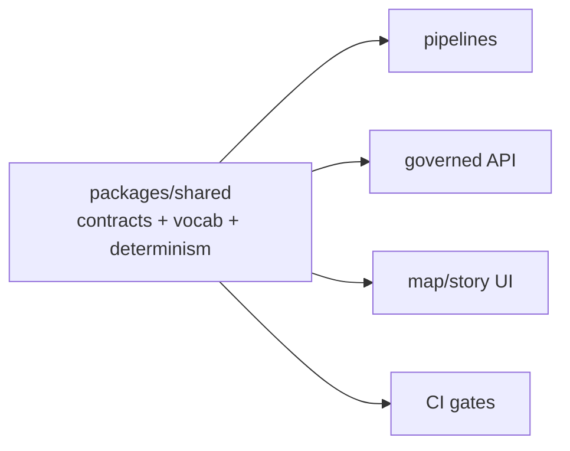

<!-- [KFM_META_BLOCK_V2]
doc_id: kfm://doc/2a795392-2c35-40c7-868f-b867e549087b
title: packages/shared — Shared Contracts & Utilities
type: standard
version: v1
status: draft
owners: TBD
created: 2026-02-22
updated: 2026-02-22
policy_label: public
related:
  - packages/shared
tags: [kfm, shared, contracts]
notes:
  - Repo/tooling specifics intentionally marked TBD until confirmed in-repo.
[/KFM_META_BLOCK_V2] -->

# `packages/shared`
Shared contracts (schemas + vocabularies + IDs) and **pure** utilities used across KFM components to keep policy/provenance semantics consistent.


> **Why this exists:** KFM’s trust membrane and governance gates only hold if every component speaks the same “contract language” for IDs, catalogs, evidence, policy decisions, and audit receipts.

---

## Navigate
- [Overview](#overview)
- [Truth status](#truth-status)
- [What belongs here](#what-belongs-here)
- [What must not belong here](#what-must-not-belong-here)
- [Key contracts](#key-contracts)
  - [Identifiers and digests](#identifiers-and-digests)
  - [EvidenceRef and EvidenceBundle](#evidenceref-and-evidencebundle)
  - [PolicyDecision](#policydecision)
  - [Controlled vocabularies](#controlled-vocabularies)
  - [Time axes](#time-axes)
- [Determinism and hash drift](#determinism-and-hash-drift)
- [Testing](#testing)
- [Contribution checklist](#contribution-checklist)
- [Appendix: recommended structure](#appendix-recommended-structure)

---

## Overview
This package is the **single source of truth** for:
- **Contract surfaces** used across pipelines, catalogs, APIs, UI, and Focus Mode (schemas + stable IDs).
- **Controlled vocabularies** (policy labels, lifecycle zones, evidence kinds).
- **Deterministic helpers** (canonicalization + hashing) so “the same spec” hashes the same everywhere.
- **Small pure utilities** that must behave identically in CI and runtime.

> ⚠️ **Fail-closed posture:** if a contract is ambiguous or a required field is missing, validation should fail (no best-effort guessing inside shared).

---

## Truth status
This README is intentionally explicit about what is known vs assumed.

| Topic | Status | Notes |
|---|---|---|
| KFM uses governed contracts: EvidenceRef → EvidenceBundle, policy decisions, audit receipts | **Confirmed** | Encoded in KFM design/blueprint documents. |
| Policy evaluation should be fixtures-driven and share semantics between CI and runtime | **Confirmed** | Shared semantics are required for meaningful CI gates. |
| Exact package name, build tool, export paths, and directory layout | **Unknown** | Must be verified from the repo (`package.json`, workspace config, etc.). |
| Proposed vocab sets (policy labels, artifact zones, evidence kinds, generalization methods) | **Proposed** | Treat as a baseline; adjust only via governance review. |

---

## What belongs here
✅ Good fits:
- **Schema definitions** (JSON Schema, OpenAPI fragments, Zod/Pydantic equivalents) for:
  - run receipts / audit records
  - dataset and dataset-version identity specs
  - DCAT/STAC/PROV profile validation shapes
  - EvidenceRef / EvidenceBundle / PolicyDecision
- **Controlled vocabularies** and their validators.
- **Deterministic hashing** helpers and canonicalization logic (plus tests).
- **Typed “contract adapters”** that are still pure (e.g., parse/format EvidenceRef URIs).

---

## What must not belong here
🚫 Keep out of `packages/shared`:
- Any **network** / **filesystem** / **database** access.
- Any code that requires **secrets** or environment-specific configuration.
- Framework glue (React hooks, FastAPI routing, CLI wiring, container runtime logic).
- Logging or telemetry backends (interfaces/types ok; implementations elsewhere).
- Anything that would tempt callers to bypass the **trust membrane** (e.g., “direct S3 fetch” helpers).

> Rule of thumb: if it can cause side effects or depends on runtime environment state, it does **not** belong in shared.

---

## Key contracts

### Identifiers and digests
**Stable identifiers** enable reproducibility, caching, and auditable governance.

Common patterns used in KFM contracts:
- **Digest-addressed IDs**: `sha256:<hex>` (include algorithm name in the identifier).
- **URI-like IDs** for governance artifacts:
  - `kfm://dataset/<id>`
  - `kfm://dataset_version/<id>`
  - `kfm://run/<id>`
  - `kfm://policy_decision/<id>`
  - `kfm://audit/entry/<id>`

#### Recommended rules
- IDs must be **purely derived** from canonical inputs (no clocks, no random, no unordered maps).
- If an ID changes, treat it as a **breaking change** and require review.

---

### EvidenceRef and EvidenceBundle
Evidence resolution is central: callers should hold **references**, not raw file paths or undocumented URLs.

#### EvidenceRef
EvidenceRef is a stable reference with an explicit scheme, for example:
- `dcat://...`
- `stac://...`
- `prov://...`
- `doc://...`
- `graph://...`

> Shared should provide: parsers/formatters + schema validation for EvidenceRef.

#### EvidenceBundle
An EvidenceBundle is what the resolver returns: a human-readable card + machine metadata + digests + audit references.

Illustrative shape (field names may differ):
```json
{
  "bundle_id": "sha256:…",
  "dataset_version_id": "…",
  "title": "…",
  "policy": {
    "decision": "allow|deny",
    "policy_label": "public|restricted|…",
    "obligations_applied": []
  },
  "license": {
    "spdx": "…",
    "attribution": "…"
  },
  "provenance": {
    "run_id": "kfm://run/…"
  },
  "artifacts": [
    {
      "href": "…",
      "digest": "sha256:…",
      "media_type": "…"
    }
  ],
  "checks": {
    "catalog_valid": true,
    "links_ok": true
  },
  "audit_ref": "kfm://audit/entry/…"
}
```

---

### PolicyDecision
Shared should define a canonical PolicyDecision shape so:
- CI can test it with fixtures.
- runtime can enforce it consistently.
- UI can display reason codes and obligations *without re-implementing policy logic*.

Illustrative shape (field names may differ):
```json
{
  "decision_id": "kfm://policy_decision/…",
  "policy_label": "restricted",
  "decision": "deny",
  "reason_codes": ["SENSITIVE_SITE", "RIGHTS_UNCLEAR"],
  "obligations": [
    { "type": "generalize_geometry", "min_cell_size_m": 5000 },
    { "type": "remove_attributes", "fields": ["exact_location", "owner_name"] }
  ],
  "evaluated_at": "2026-02-20T12:00:00Z",
  "rule_id": "deny.restricted_dataset.default"
}
```

---

### Controlled vocabularies
**Controlled vocabularies** prevent drift and make governance enforceable.

> Keep these in one place, and validate them strictly at boundaries (CI + runtime).

Baseline sets (adjust only via governance review):

| Vocabulary | Examples | Notes |
|---|---|---|
| `policy_label` | `public`, `public_generalized`, `restricted`, `restricted_sensitive_location`, `internal`, `embargoed`, `quarantine` | Primary classification input to policy. |
| `artifact.zone` | `raw`, `work`, `processed`, `catalog`, `published` | Supports truth-path promotion gates. |
| `citation.kind` | `dcat`, `stac`, `prov`, `doc`, `graph`, `oci`, `url` | Prefer resolvable schemes over raw URLs. |
| `geometry.generalization_method` | `centroid_only`, `grid_aggregation_*`, `random_offset_*`, `dissolve_to_admin_unit`, `bounding_box_only`, `none` | Must be recorded when applied. |

---

### Time axes
If we encode temporal semantics in contracts, use a consistent vocabulary:
- **Event time**: when something happened.
- **Transaction time**: when KFM acquired/published the record.
- **Valid time** (optional): when a statement is considered true.

---

## Determinism and hash drift
Determinism is a feature, not overhead.

### `spec_hash`
When a dataset version is derived from a spec document (source config + normalization + validation + artifact plan + policy intent), compute:

- `spec_hash = sha256( canonical_json(spec) )`

Where canonical JSON means **RFC 8785** JSON Canonicalization Scheme (JCS), not “pretty printed JSON”.

### Hash drift checklist
- Store the exact canonical spec used for hashing next to the computed `spec_hash`.
- Unit-test recomputation: `recompute(spec) == stored_spec_hash`.
- Treat spec_hash changes as breaking changes that require review.
- Never hash data that depends on clocks, random seeds, or nondeterministic ordering.

---

## Testing
Minimum expectations for changes in this package:
- ✅ Schema tests:
  - at least one **valid** fixture
  - at least one **invalid** fixture (prove fail-closed)
- ✅ Determinism tests (where applicable):
  - canonicalization round-trip tests
  - stable hash across platforms/runtimes
- ✅ Compatibility tests:
  - ensure older consumers don’t break (or bump major if they must)

---

## Contribution checklist
Use this when adding/changing a contract.

- [ ] Is this change **pure + deterministic** (no I/O, no environment dependence)?
- [ ] Does it preserve the **trust membrane** (no “helpful” direct storage access)?
- [ ] Did you add/update schema + validators?
- [ ] Did you add/update fixtures (valid + invalid) and ensure CI fails on invalid?
- [ ] Did you update controlled vocab (if needed) **with governance rationale**?
- [ ] If any identifier behavior changed, did you treat it as **breaking**?
- [ ] Did you update this README (or an adjacent contract README) with:
  - invariants
  - examples
  - migration notes (if applicable)

---

## Appendix: recommended structure
> This is a **recommended** (not confirmed) layout to keep boundaries clean.

```text
packages/shared/
├─ README.md
├─ src/
│  ├─ index.(ts|js|py)              # public exports only
│  ├─ contracts/
│  │  ├─ evidence/                 # EvidenceRef/EvidenceBundle schemas + helpers
│  │  ├─ policy/                   # PolicyDecision + obligations + reason codes
│  │  ├─ catalogs/                 # DCAT/STAC/PROV profile shapes
│  │  └─ receipts/                 # run_receipt / audit record shapes
│  ├─ vocab/
│  │  ├─ policy_label.*
│  │  ├─ artifact_zone.*
│  │  └─ citation_kind.*
│  ├─ determinism/
│  │  ├─ canonical_json.*          # RFC 8785 JCS utilities
│  │  └─ hashing.*                 # sha256 helpers + golden tests
│  └─ __fixtures__/
│     ├─ valid/
│     └─ invalid/
└─ test/ (or equivalent)
```

---

### Dependency direction (intended)


> **No reverse dependencies**: shared must not import from pipelines/api/ui.

---

<details>
<summary>Notes for maintainers</summary>

- If this package is consumed by multiple languages (e.g., Python + TypeScript), prefer:
  - JSON Schema / OpenAPI-first contracts
  - generated types (where practical)
  - fixtures stored as JSON to validate in multiple runtimes

- If a contract is “core to governance” (policy labels, obligations, audit receipts), changes should require:
  - reviewer/steward sign-off
  - migration note
  - explicit version bump policy

</details>

---

↑ Back to top
