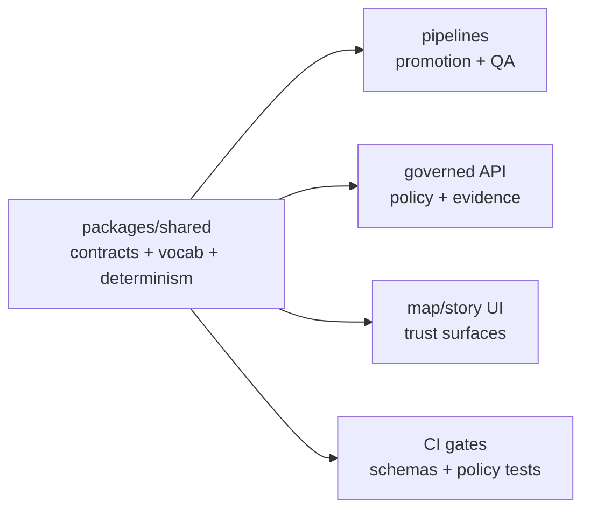

<!-- [KFM_META_BLOCK_V2]
doc_id: kfm://doc/2a795392-2c35-40c7-868f-b867e549087b
title: packages/shared — Shared Contracts & Utilities
type: standard
version: v1
status: draft
owners: TBD
created: 2026-02-22
updated: 2026-02-26
policy_label: public
related:
  - packages/shared
  - TBD: link to KFM Design & Governance Guide (vNext, 2026-02-20)
tags: [kfm, shared, contracts]
notes:
  - Repo/tooling specifics intentionally marked TBD until confirmed in-repo.
  - This README is normative for *behavior* (fail-closed, determinism) even if code layout differs.
[/KFM_META_BLOCK_V2] -->

<a id="top"></a>

# `packages/shared`
**Shared contracts + controlled vocabularies + deterministic helpers** used across KFM so policy, provenance, and evidence semantics are consistent everywhere (CI + runtime + UI).


> **Why this exists:** KFM’s governance only works if every component speaks the same contract language for **IDs**, **catalogs**, **evidence**, **policy decisions**, **promotion gates**, and **audit receipts**.

---

## Navigate
- [Scope](#scope)
- [Non-negotiable invariants](#non-negotiable-invariants)
- [Truth status](#truth-status)
- [Directory standard](#directory-standard)
  - [What belongs here](#what-belongs-here)
  - [What must not belong here](#what-must-not-belong-here)
- [Contract registry](#contract-registry)
- [Key contract families](#key-contract-families)
  - [Identifiers and digests](#identifiers-and-digests)
  - [Catalog triplet profiles](#catalog-triplet-profiles)
  - [EvidenceRef and EvidenceBundle](#evidenceref-and-evidencebundle)
  - [PolicyDecision and obligations](#policydecision-and-obligations)
  - [RunReceipt and AuditLedger](#runreceipt-and-auditledger)
  - [Promotion artifacts](#promotion-artifacts)
  - [Focus Mode contracts](#focus-mode-contracts)
  - [Controlled vocabularies](#controlled-vocabularies)
  - [Time axes](#time-axes)
- [Determinism and hash drift](#determinism-and-hash-drift)
- [Testing and CI gates](#testing-and-ci-gates)
- [Contribution checklist](#contribution-checklist)
- [Appendix: recommended structure](#appendix-recommended-structure)

---

## Scope
This package is **intended** to be the *contract spine* of the system:

- **Schemas** (JSON Schema / OpenAPI fragments / equivalent) that define the governed surfaces:
  - dataset identity + dataset versions
  - DCAT/STAC/PROV profile shapes and cross-link requirements
  - EvidenceRef/EvidenceBundle
  - PolicyDecision (decision + reasons + obligations)
  - RunReceipt/AuditLedger entries
  - Promotion manifests and gate reports
  - Focus Mode request/response envelopes (incl. citations + audit_ref)
- **Controlled vocabularies** that must not drift between components.
- **Deterministic helpers** (canonicalization + hashing) so the same spec hashes the same everywhere.
- **Pure utilities only**: shared code must behave identically in CI and runtime.

> ⚠️ **Fail-closed posture:** if a required field is missing, a vocabulary value is unknown, or a reference cannot be verified, validation **must fail** (no best-effort guessing inside shared).

---

## Non-negotiable invariants
These are KFM posture requirements. This package exists to make them **testable**.

1) **Truth path lifecycle**  
Data must flow through the defined lifecycle zones and promotion gates (RAW → WORK/QUARANTINE → PROCESSED → CATALOG/TRIPLET → projections → governed API → UI/Focus).  
**Shared responsibility:** define zone vocab + promotion artifacts + validators.

2) **Trust membrane**  
Clients never access storage/DB directly; all governed access goes through policy + evidence boundaries.  
**Shared responsibility:** contracts must not offer helpers that bypass the membrane.

3) **Evidence-first UX and cite-or-abstain Focus Mode**  
Answers and UI claims must cite EvidenceRefs that resolve to EvidenceBundles, or abstain. Citation verification is a hard gate.  
**Shared responsibility:** define citation objects + evidence resolver request/response contracts + fixtures.

4) **Deterministic identity/hashing**  
Stable dataset/version IDs and `spec_hash` must be derived from canonical inputs.  
**Shared responsibility:** canonical JSON + hashing utilities and golden tests.

5) **Policy semantics shared between CI and runtime**  
Policy outcomes must be consistent across CI and runtime (fixtures-driven).  
**Shared responsibility:** PolicyDecision shape + obligation schema + reason codes + fixtures.

---

## Truth status
This README is explicit about what is known vs assumed.

| Topic | Status | Notes |
|---|---|---|
| KFM requires truth path + trust membrane + cite-or-abstain with receipts + deterministic hashing | **Confirmed** | Confirmed in KFM design/governance guide; this README aligns to those invariants. |
| Controlled vocabularies exist and must be versioned | **Confirmed** | `policy_label`, `artifact.zone`, `citation.kind` are explicitly called out as maintained vocab. |
| Exact package name, build tool, export paths, and directory layout | **Unknown** | Must be verified from repo workspace config. |
| Exact schema dialects (JSON Schema version), codegen strategy, and language targets | **Proposed** | Choose what fits repo/toolchain; keep fixtures portable. |

---

## Directory standard

### Where this fits in the repo
`packages/shared` is imported by:
- pipelines and validators (promotion gates)
- governed API (DTOs + policy/evidence enforcement)
- UI (policy badges, evidence drawers, citation rendering)
- Focus Mode orchestrator (request/response envelope + citation schema + receipts)

> **No reverse dependencies:** shared must not import from pipelines/api/ui.

### What belongs here
✅ Good fits:
- **Schema definitions** + validators for governed artifacts.
- **Controlled vocabularies** and validators.
- **Deterministic helpers** (canonicalization + hashing) and golden tests.
- **Pure “contract adapters”** (e.g., parse/format `kfm://…` identifiers; parse EvidenceRef URIs).

### What must not belong here
🚫 Keep out of `packages/shared`:
- Network / filesystem / database access
- Secrets, env-dependent config, runtime toggles
- Framework glue (React hooks, API routing, CLIs)
- Telemetry backends (interfaces ok; implementations elsewhere)
- “Helpful” direct storage access helpers that undermine governance

> Rule of thumb: if it can cause side effects, it does **not** belong in shared.

---

## Contract registry
> This is a **normative inventory** (names/paths TBD). The important part is the *surfaces*.

| Family | Purpose | Consumers | Breaking change? |
|---|---|---|---|
| `DatasetId`, `DatasetVersionId`, `ArtifactDigest` | Identity + reproducibility | pipelines, catalogs, API, UI, Focus | Yes (major bump) |
| `artifact.zone` vocab | Truth-path promotion state | pipelines, CI, UI | Yes |
| DCAT profile | Dataset-level metadata + rights + distributions | CI validators, API, UI | Yes |
| STAC profile | Asset-level spatiotemporal metadata | CI validators, API, tiles | Yes |
| PROV profile + run receipts | Lineage, who/what/why/how | pipelines, API, UI | Yes |
| `EvidenceRef`, `EvidenceBundle` | Evidence resolution + trust UI | API, UI, Focus | Yes |
| `PolicyDecision` + obligations | Allow/deny + required redactions/UX notices | CI, API, evidence resolver, UI | Yes |
| `PromotionManifest` + `GateReport` | Fail-closed promotion gating | pipelines, CI | Yes |
| Focus Mode envelopes | Request/response + citations + audit_ref | Focus orchestrator, API, UI | Yes |

---

## Key contract families

### Identifiers and digests
Stable identifiers enable reproducibility, caching, signing, and audits.

**Recommended ID families (illustrative):**
- `sha256:<hex>` digests for content-addressed objects
- `kfm://dataset/<id>`
- `kfm://dataset_version/<id>`
- `kfm://run/<id>`
- `kfm://policy_decision/<id>`
- `kfm://audit/entry/<id>`

**Rules**
- IDs must be derived from **canonical inputs** (no clocks, no random, no unordered maps).
- If an ID derivation changes, treat as a **breaking change** + add migration notes.

---

### Catalog triplet profiles
KFM treats catalogs and provenance as contract surfaces, not optional documentation.

**Triplet responsibilities (conceptual):**
- **DCAT:** dataset identity, publisher, license/rights, distributions, coverage
- **STAC:** assets, extents, items/collections, file links
- **PROV:** lineage (activities, agents, entities) + run receipts

> Shared should provide strict validators + cross-link checks (DCAT ↔ STAC ↔ PROV) and fixtures.

---

### EvidenceRef and EvidenceBundle
Evidence resolution is central: callers should hold **references**, not raw file paths.

#### EvidenceRef
EvidenceRef is a stable, typed reference, e.g.:
- `dcat://…`
- `stac://…`
- `prov://…`
- `doc://…`
- `graph://…`
- `oci://…@sha256:…` (digest-pinned bundles)

**Shared should provide**
- parser/formatter (pure)
- schema validation
- fixtures (valid + invalid)

#### EvidenceBundle
EvidenceBundle is what an evidence resolver returns: human-readable cards + machine metadata + digests + audit references.

Illustrative shape (field names may differ):
```json
{
  "bundle_id": "sha256:…",
  "dataset_version_id": "kfm://dataset_version/…",
  "title": "…",
  "policy": {
    "decision": "allow|deny",
    "policy_label": "public|restricted|…",
    "obligations_applied": []
  },
  "license": { "spdx": "…", "attribution": "…" },
  "provenance": { "run_id": "kfm://run/…" },
  "artifacts": [
    { "href": "…", "digest": "sha256:…", "media_type": "…" }
  ],
  "checks": { "catalog_valid": true, "links_ok": true },
  "audit_ref": "kfm://audit/entry/…"
}
```

> **Fail closed:** if the resolver can’t verify policy, links, or digests, it must return a denial (or an explicit “unresolvable” error) — never “best guess.”

---

### PolicyDecision and obligations
Shared defines a canonical PolicyDecision so CI, runtime, and UI can share semantics.

Illustrative shape (field names may differ):
```json
{
  "decision_id": "kfm://policy_decision/…",
  "policy_label": "restricted",
  "decision": "deny",
  "reason_codes": ["SENSITIVE_SITE", "RIGHTS_UNCLEAR"],
  "obligations": [
    { "type": "generalize_geometry", "min_cell_size_m": 5000 },
    { "type": "remove_attributes", "fields": ["exact_location", "owner_name"] }
  ],
  "evaluated_at": "2026-02-20T12:00:00Z",
  "rule_id": "deny.restricted_dataset.default"
}
```

**Invariants**
- “Unknown policy label” must not silently degrade to allow.
- Obligations are **first-class**: the UI can *render* them, but must not *decide* them.

---

### RunReceipt and AuditLedger
Every governed operation (pipeline run, story publish, Focus Mode request) emits a receipt.

Shared should define:
- `RunReceipt` (per-run)
- `AuditLedgerEntry` (append-only index)

Minimum expectations (conceptual):
- inputs + evidence bundle digests
- tool versions + parameters (or spec hash)
- policy decisions applied
- output digests
- output hash and timestamps

---

### Promotion artifacts
Promotion is the act of moving a dataset version into governed runtime surfaces and must be fail-closed.

Shared should define:
- `PromotionManifest` (what is being promoted, from where, and why)
- `GateReport` (Gate A..F results, machine-readable + human summary)

> Promotion should be blocked unless all required artifacts exist and validate.

---

### Focus Mode contracts
A Focus Mode request is treated as a governed run with a receipt.

**Required response envelope (conceptual):**
- `answer_text`
- `citations[]` (EvidenceRefs or resolved bundle references)
- `audit_ref` (run id)

**Hard gate:** a response must not ship unless all citations are verifiable and policy-allowed. If not, abstain or narrow scope.

---

### Controlled vocabularies
Controlled vocabularies prevent drift and make governance enforceable.

Baseline sets (adjust only via governance review):

| Vocabulary | Starter values | Notes |
|---|---|---|
| `policy_label` | `public`, `public_generalized`, `restricted`, `restricted_sensitive_location`, `internal`, `embargoed`, `quarantine` | Primary classification input to policy. |
| `artifact.zone` | `raw`, `work`, `processed`, `catalog`, `published` | Truth-path lifecycle zones. |
| `citation.kind` | `dcat`, `stac`, `prov`, `doc`, `graph`, `oci`, `url` | Prefer resolvable schemes; `url` is discouraged. |

---

### Time axes
If we encode temporal semantics in contracts, use consistent vocabulary:
- **Event time**: when something happened
- **Transaction time**: when KFM acquired/published it
- **Valid time** (optional): when a statement is considered true

---

## Determinism and hash drift
Determinism is a feature, not overhead.

### `spec_hash`
When a dataset version is derived from a spec document (source config + normalization + validation + artifact plan + policy intent), compute:

- `spec_hash = sha256( canonical_json(spec) )`

Where canonical JSON is **RFC 8785 JSON Canonicalization Scheme (JCS)** (not pretty-printed JSON).

### Hash drift checklist
- Store the exact canonical spec used for hashing alongside `spec_hash`.
- Golden test: `recompute(spec) == stored_spec_hash`.
- Treat `spec_hash` changes as breaking changes requiring review.
- Never hash values that depend on clocks, random seeds, or nondeterministic ordering.

---

## Testing and CI gates
Minimum expectations for changes in this package:

### Contract fixtures
- ✅ at least one **valid** fixture
- ✅ at least one **invalid** fixture (prove fail-closed)

### Determinism tests
- ✅ canonicalization round-trip tests
- ✅ stable hash across platforms/runtimes (goldens)

### Compatibility expectations
- ✅ consumers do not break silently
- ✅ major bump when breaking is unavoidable

> TIP: Keep fixtures as JSON so multiple runtimes (TS/Python/etc.) can validate the same artifacts.

---

## Contribution checklist
Use this when adding/changing a contract.

- [ ] Is this change **pure + deterministic** (no I/O, no environment dependence)?
- [ ] Does it preserve the **trust membrane** (no “helpful” direct storage access)?
- [ ] Did you add/update schema + validators?
- [ ] Did you add/update fixtures (valid + invalid) and ensure CI fails on invalid?
- [ ] Did you update controlled vocab (if needed) **with governance rationale**?
- [ ] If any identifier behavior changed, did you treat it as **breaking**?
- [ ] Did you document:
  - invariants
  - examples
  - migration notes (if applicable)

---

## Appendix: recommended structure
> **Recommended** (not confirmed) layout to keep boundaries clean.

```text
packages/shared/
├─ README.md
├─ src/
│  ├─ index.(ts|js|py)                 # public exports only (TBD)
│  ├─ contracts/
│  │  ├─ ids/                          # DatasetId, VersionId, digests, URI helpers
│  │  ├─ catalogs/                     # DCAT/STAC/PROV profile schemas + validators
│  │  ├─ evidence/                     # EvidenceRef/EvidenceBundle schemas + helpers
│  │  ├─ policy/                       # PolicyDecision + obligations + reason codes
│  │  ├─ receipts/                     # RunReceipt / AuditLedger shapes
│  │  ├─ promotion/                    # PromotionManifest + GateReport
│  │  └─ focus/                        # Focus request/response + citation schema
│  ├─ vocab/
│  │  ├─ policy_label.*                # versioned vocab + validator
│  │  ├─ artifact_zone.*               # versioned vocab + validator
│  │  └─ citation_kind.*               # versioned vocab + validator
│  ├─ determinism/
│  │  ├─ canonical_json.*              # RFC 8785 JCS utilities
│  │  └─ hashing.*                     # sha256 helpers + golden tests
│  └─ __fixtures__/
│     ├─ valid/
│     └─ invalid/
└─ test/ (or equivalent)
```

### Dependency direction (intended)


---

<details>
<summary>Notes for maintainers</summary>

- If multiple languages consume these contracts, prefer:
  - JSON Schema / OpenAPI-first shapes
  - generated types where practical
  - fixtures as JSON to validate in multiple runtimes

- If a contract is “core to governance” (policy labels, obligations, receipts, promotion manifests),
  changes should require:
  - steward review/sign-off
  - migration note
  - explicit version bump policy

</details>

---

↑ [Back to top](#top)