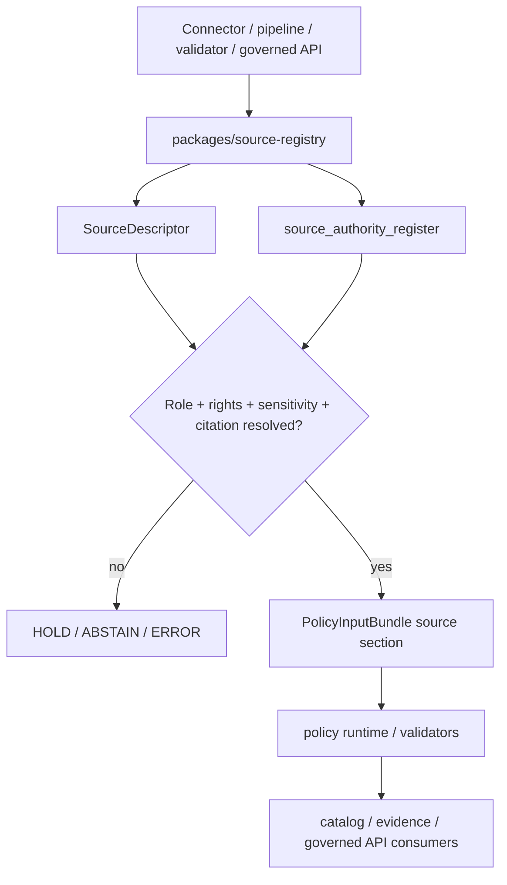

<!-- [KFM_META_BLOCK_V2]
doc_id: kfm://package/source-registry/readme
title: Source Registry Package README
type: package-readme
version: v0.1
status: draft
owners: OWNER_TBD — Package steward · Source steward · Catalog steward · Policy steward · Docs steward
created: 2026-06-15
updated: 2026-06-15
policy_label: public
related:
  - ../README.md
  - ../../docs/sources/SOURCE_DESCRIPTOR_STANDARD.md
  - ../../docs/sources/README.md
  - ../../docs/sources/source-roles.md
  - ../../docs/sources/catalog/README.md
  - ../../contracts/source/source_descriptor.md
  - ../../schemas/contracts/v1/source/source_descriptor.schema.json
  - ../../control_plane/source_authority_register.yaml
  - ../../data/registry/sources/
  - ../../policy/rights/
  - ../../policy/sensitivity/
  - ../../policy/data/README.md
  - ../../packages/policy-runtime/README.md
  - ../../tests/README.md
tags: [kfm, packages, source-registry, source-descriptor, source-authority, rights, sensitivity, admission, fail-closed]
notes:
  - "Replaces the short source-registry package stub with a governed package README."
  - "This package may load and normalize source-descriptor and source-authority-register references, but it must not become source truth, policy authority, schema authority, or catalog authority."
  - "Repository evidence confirms this README path and a proposed source_authority_register.yaml stub; implementation code, exports, tests, and consuming imports remain NEEDS VERIFICATION."
[/KFM_META_BLOCK_V2] -->

<a id="top"></a>

<div align="center">

# Source Registry Package

`packages/source-registry/`

**Shared helper package for loading, resolving, and inspecting KFM source descriptors and source-authority register entries without becoming the authority for source truth, rights, sensitivity, policy, or publication.**


[Purpose](#1-purpose) · [Repo fit](#2-repo-fit) · [Boundary](#3-authority-boundary) · [Inputs](#5-inputs) · [Exclusions](#6-exclusions) · [Interfaces](#7-proposed-interfaces) · [Definition of done](#14-definition-of-done)

</div>

---

> [!IMPORTANT]
> **Status:** draft / `NEEDS VERIFICATION`  
> **Owners:** `OWNER_TBD` — Package steward · Source steward · Catalog steward · Policy steward · Docs steward  
> **Path:** `packages/source-registry/README.md`  
> **Responsibility root:** `packages/` — shared reusable implementation packages  
> **Truth posture:** CONFIRMED file path / PROPOSED package contract / UNKNOWN implementation exports, tests, and runtime consumers

> [!CAUTION]
> This package must not upgrade, infer, or override source authority. Source role, rights, sensitivity, cadence, access posture, and citation guidance are fixed by governed source-admission records and policy gates. Missing or unresolved source support should fail closed.

---

## Quick jump

- [1. Purpose](#1-purpose)
- [2. Repo fit](#2-repo-fit)
- [3. Authority boundary](#3-authority-boundary)
- [4. Default posture](#4-default-posture)
- [5. Inputs](#5-inputs)
- [6. Exclusions](#6-exclusions)
- [7. Proposed interfaces](#7-proposed-interfaces)
- [8. Diagram](#8-diagram)
- [9. Decision vocabulary](#9-decision-vocabulary)
- [10. Package obligations](#10-package-obligations)
- [11. Consumer expectations](#11-consumer-expectations)
- [12. Inspection path](#12-inspection-path)
- [13. Validation expectations](#13-validation-expectations)
- [14. Definition of done](#14-definition-of-done)
- [15. Open verification items](#15-open-verification-items)

---

## 1. Purpose

`packages/source-registry/` is the proposed shared implementation package for source-registry lookup helpers.

It may provide code that resolves source descriptor IDs, source authority register entries, role/rights/sensitivity metadata, admission status, and citation guidance for downstream validators, pipelines, catalog builders, policy evaluators, and governed API adapters.

It should support these workflows without owning the underlying authority:

- source-admission preflight checks;
- connector and watcher source lookup;
- source role and anti-collapse checks;
- rights and sensitivity pre-policy input assembly;
- catalog provenance and citation payload assembly;
- validation fixtures and no-network test support;
- safe unresolved-source handling.

[Back to top](#top)

---

## 2. Repo fit

| Concern | Owning root | Expected relationship |
|---|---|---|
| Shared source-registry helper code | `packages/source-registry/` | This package README and future source-registry implementation, if accepted |
| Package-root contract | `packages/README.md` | Shared packages support governed flows but do not replace truth, policy, schema, contracts, release, or lifecycle data |
| Source descriptor doctrine | `docs/sources/SOURCE_DESCRIPTOR_STANDARD.md` | Defines source descriptor meaning, field surface, intake posture, and authority order |
| Source descriptor contract | `contracts/source/source_descriptor.md` | Object meaning, if present and accepted |
| Source descriptor schema | `schemas/contracts/v1/source/source_descriptor.schema.json` | Machine-readable shape, if present and accepted |
| Source authority register | `control_plane/source_authority_register.yaml` | Proposed register of source roles, rights posture, and sensitivity floor |
| Source registry records | `data/registry/sources/` | Lifecycle/source registry artifacts; exact maturity `NEEDS VERIFICATION` |
| Policy decisions | `policy/rights/`, `policy/sensitivity/`, `policy/data/` | Admissibility and exposure gates, not this package |
| Catalog closure docs | `docs/sources/catalog/` | Human-facing source-to-catalog documentation |

## 3. Authority boundary

This package may load and normalize source-registry inputs. It must not define source meaning, schema shape, policy decisions, release state, or public truth.

```text
packages/source-registry/        = reusable source-registry helper code
control_plane/source_authority_register.yaml = proposed source authority register
docs/sources/SOURCE_DESCRIPTOR_STANDARD.md   = source descriptor doctrine
contracts/source/                = source semantic meaning
schemas/contracts/v1/source/      = source machine shape
policy/                          = source admissibility, rights, sensitivity, release gates
data/registry/sources/            = source registry lifecycle artifacts, if accepted
release/                          = publication, correction, rollback control
```

## 4. Default posture

Source-registry helpers should fail closed when required support is unresolved.

A lookup or resolver should not silently return a public-safe source when any of these are unresolved:

- source descriptor identity;
- source role;
- authority register status;
- rights or license posture;
- sensitivity floor;
- source cadence or staleness posture;
- citation guidance;
- admission decision;
- policy input bundle shape;
- source version or supersession state.

## 5. Inputs

| Input family | Examples | Required posture |
|---|---|---|
| Source descriptor ref | source id, descriptor path, descriptor version, hash | Explicit and resolvable or fail closed |
| Authority register ref | register id, source family, authority role, sensitivity floor | Loaded from governed register, not inferred by package code |
| Rights context | license, terms, attribution, restricted reuse, unclear rights | Preserved for policy gates |
| Sensitivity context | public, restricted, private, sovereign, culturally sensitive, rare-location, infrastructure, living-person | Preserved and never downgraded silently |
| Temporal context | observed time, source time, retrieval time, release time, correction time | Kept distinct for stale-state and citation handling |
| Citation context | display name, authority citation, URL, access date, limitations | Required for downstream evidence/citation payloads |
| Consumer context | validator, connector, pipeline, catalog builder, governed API, test fixture | Used for scoped errors and obligations |

## 6. Exclusions

| Does not belong here | Correct home |
|---|---|
| Source descriptor doctrine | `docs/sources/SOURCE_DESCRIPTOR_STANDARD.md` |
| Source semantic contracts | `contracts/source/` |
| Source JSON Schemas | `schemas/contracts/v1/source/` |
| Policy decisions about allow/deny/restrict/abstain | `policy/` |
| Source data captures | `data/raw/`, `data/work/`, `data/quarantine/`, and lifecycle roots |
| Source registry artifacts as persisted records | `data/registry/sources/` or accepted registry home |
| Release manifests, rollback cards, correction notices | `release/` and correction homes |
| Connector fetch logic | `connectors/` |
| Public API routes or UI components | `apps/` and governed UI/API packages |
| Secrets, tokens, credentials, or private access keys | Secret manager / deployment config, not repo package docs |

## 7. Proposed interfaces

Exact exports remain `NEEDS VERIFICATION`. Candidate interfaces should be small, deterministic, and testable.

| Interface | Purpose | Status |
|---|---|---|
| `load_source_descriptor(ref)` | Load one descriptor by governed ref or path | PROPOSED |
| `load_source_authority_register(ref)` | Load the authority register | PROPOSED |
| `resolve_source(source_id)` | Return source role, rights, sensitivity, citation, and status | PROPOSED |
| `build_policy_input(source_ref, context)` | Assemble source fields for policy-runtime input | PROPOSED |
| `validate_source_resolution(result)` | Check required fields before consumers proceed | PROPOSED |
| `explain_unresolved_source(error)` | Return safe reason codes for HOLD/ABSTAIN paths | PROPOSED |

> [!WARNING]
> Interface names above are proposed documentation placeholders. Do not treat them as implemented exports until package files, tests, and consuming imports are inspected.

## 8. Diagram



## 9. Decision vocabulary

| Outcome | Meaning | Required behavior |
|---|---|---|
| `RESOLVED` | Source descriptor and authority register data are available and internally consistent | Return scoped source context without changing authority |
| `UNRESOLVED` | Required descriptor, register, rights, sensitivity, or citation support is missing | Return safe unresolved reason; do not guess |
| `CONFLICTED` | Descriptor and register disagree or source-role drift is detected | Fail closed and require steward review |
| `STALE` | Source cadence or supersession state indicates stale source context | Preserve stale-state metadata for policy/runtime |
| `ERROR` | File, parse, schema, or runtime failure occurred | Fail closed and preserve diagnostic context safely |

## 10. Package obligations

| Obligation | Example effect |
|---|---|
| `do_not_infer_role` | Source role cannot be generated or upgraded by helper code |
| `preserve_rights` | Rights and terms remain visible to policy gates |
| `preserve_sensitivity_floor` | Sensitivity floor cannot be downgraded by package helpers |
| `preserve_temporal_kind` | Observed/source/retrieval/release/correction times remain distinct |
| `safe_error_required` | Missing source support returns safe reason codes, not raw internals |
| `no_public_bypass` | Package must not expose raw registry internals directly to public clients |
| `fixture_first` | Resolver behavior should be reproducible with no-network fixtures |

## 11. Consumer expectations

Consumers should treat this package as a helper, not an authority.

A consumer should:

- pass explicit source refs and operation context;
- preserve returned rights, sensitivity, citation, and stale-state fields;
- route unresolved or conflicted results to policy gates or review;
- avoid using package output as a release decision;
- avoid exposing raw descriptor internals directly to public UI;
- log safe reason codes for denied, held, abstained, conflicted, stale, or error paths.

## 12. Inspection path

Implementation files, exports, tests, fixtures, packaging metadata, CI, and consuming imports remain `NEEDS VERIFICATION`.

```bash
find packages/source-registry -maxdepth 5 -type f | sort
find docs/sources contracts/source schemas/contracts/v1/source control_plane data/registry/sources -maxdepth 5 -type f 2>/dev/null | sort
find tests fixtures -maxdepth 6 -type f 2>/dev/null | grep -Ei 'source[-_ ]?(descriptor|registry|authority)|source_role|rights|sensitivity' | sort
```

## 13. Validation expectations

Useful validation for this package should cover:

- missing descriptor returns `UNRESOLVED` or safe error;
- missing authority register entry returns `UNRESOLVED` or `CONFLICTED`;
- descriptor/register source-role mismatch returns `CONFLICTED`;
- unresolved rights or sensitivity never returns public-safe output;
- stale source cadence preserves stale-state metadata;
- citation guidance survives resolution;
- no-network fixtures reproduce resolver behavior;
- public consumers cannot bypass governed API or policy gates through this package.

## 14. Definition of done

- [ ] Owners are confirmed and `OWNER_TBD` is replaced.
- [ ] Package metadata, source files, exports, and build tool are inventoried.
- [ ] Source descriptor schema and contract links are confirmed.
- [ ] Authority register location and shape are confirmed.
- [ ] Tests cover resolved, unresolved, conflicted, stale, and error paths.
- [ ] No-network fixtures cover representative source families.
- [ ] Policy-runtime integration is documented or tested.
- [ ] Public API and UI consumers preserve trust-membrane boundaries.
- [ ] CI or validator coverage is documented or linked.

## 15. Open verification items

| Item | Why it matters |
|---|---|
| Confirm package implementation exists beyond README | Prevents overclaiming package maturity |
| Confirm packaging/runtime language | Required for usable imports |
| Confirm source descriptor schema and contract paths | Required for machine-checkable shape and meaning |
| Confirm `control_plane/source_authority_register.yaml` maturity | Current register evidence is proposed and empty |
| Confirm source registry artifact home | Prevents duplicate source registry authorities |
| Confirm tests and fixtures | Required before enforcement claims |
| Confirm policy-runtime integration | Required for governed admission decisions |
| Confirm public-surface consumers | Prevents trust-membrane bypass |

<details>
<summary>Appendix A — no-loss preservation note</summary>

The previous README was a short stub: `Loads source descriptors and source authority register.` This replacement preserves that intent while adding governance boundaries, source-admission posture, package expectations, validation expectations, and open verification items.

It does not claim implementation exports, tests, fixtures, CI, or runtime consumers are present.

</details>

## Status summary

`packages/source-registry/` should be a reusable helper package for resolving source descriptors and source authority register entries.

It should keep source role, rights, sensitivity, citation, temporal, stale-state, and admission context visible to downstream policy and catalog workflows without becoming source truth, policy authority, schema authority, release authority, lifecycle storage, or public-serving bypass.

<p align="right"><a href="#top">Back to top</a></p>
