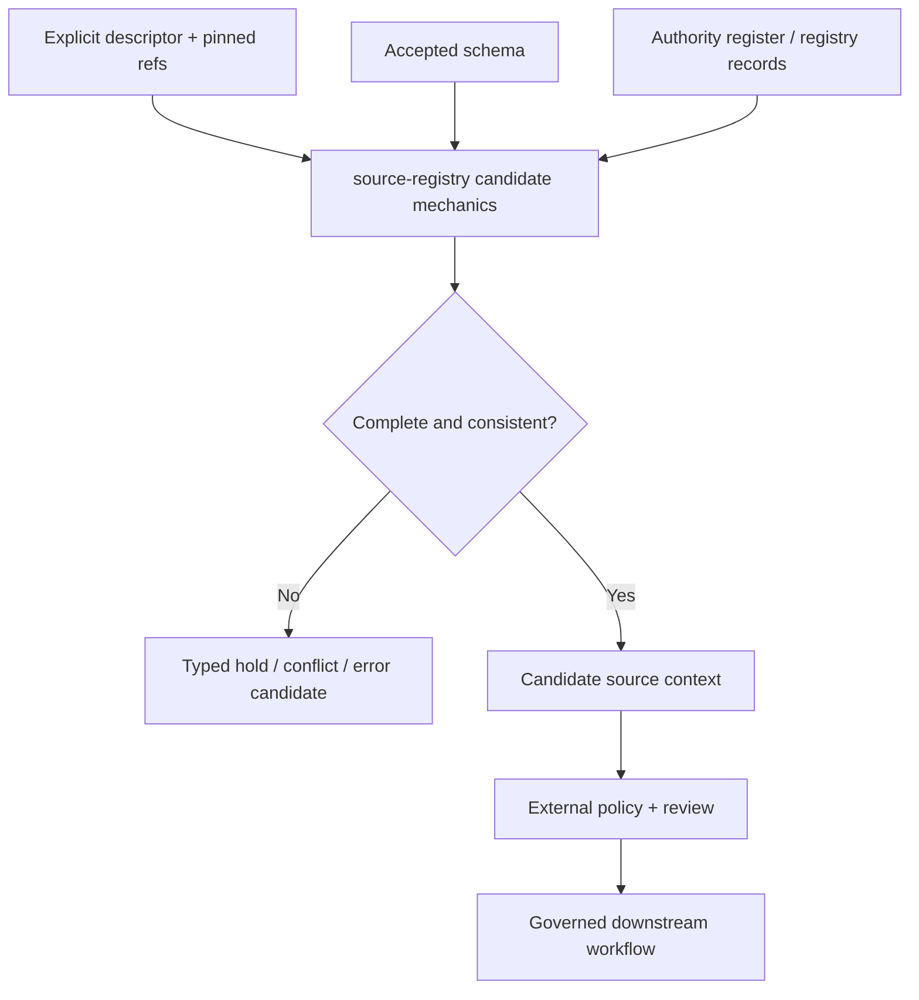

<!-- [KFM_META_BLOCK_V2]
doc_id: kfm://package/source-registry/readme
title: Source Registry Package README
type: package-readme
version: v0.2
prior_version: v0.1
status: draft; repository-grounded; greenfield-placeholder
owners: OWNER_TBD — Package steward · Source steward · Registry steward · Contracts steward · Schema steward · Policy steward · Rights steward · Sensitivity steward · Validation steward · Security steward · Docs steward
created: 2026-06-15
updated: 2026-07-20
policy_label: public; package-boundary; source-governance; no-supported-api; no-network-by-default; fail-closed
current_path: packages/source-registry/README.md
truth_posture: >
  CONFIRMED package path, placeholder kfm-source-registry 0.0.0 project metadata,
  source tree, empty package exports, one-line placeholder core module, detailed
  singular SourceDescriptor schema and its bounded validation wiring, permissive
  plural schema scaffold, empty proposed source authority register, proposed
  admission ADR, and placeholder intake/activation objects / PROPOSED a reusable,
  deterministic, read-only package for parsing explicit source-governance inputs,
  preserving source role, rights, sensitivity, cadence, citation, and authority
  context, surfacing conflicts, and assembling candidate inputs for external
  policy and review / CONFLICTED singular-versus-plural SourceDescriptor schema
  authority, schema-declared-versus-observed validator and fixture paths, duplicate
  SourceActivationDecision placeholder homes, and older parent-document interface
  promises / UNKNOWN supported import API, build backend, Python support range,
  dependencies, package-local tests, first consumer, registry adapter, policy-runtime
  handoff, deployment, and operational health / NEEDS VERIFICATION owners, accepted
  schema and admission decisions, populated authority records, registry-instance
  conformance, activation and deactivation contracts, consumer adoption, correction,
  revocation, compatibility, and rollback drills
evidence_snapshot:
  repository: bartytime4life/Kansas-Frontier-Matrix
  repository_id: "1059091169"
  visibility: public
  base_ref: main
  base_commit: 2b31ccbd9ba5b3fe6772ea1b0165eca45bdfebb0
  prior_blob: 194831d4b5a827599bcae780147af0c9ccfaf9f5
  package_metadata_blob: 3bf14d4b919fde034fa490cb7b099c4068f6b8f9
  namespace_init_blob: e69de29bb2d1d6434b8b29ae775ad8c2e48c5391
  placeholder_core_blob: cb3007403f85bc9dde15463764dfb79f679e2b53
  namespace_readme_blob: 20c7f39f6d10ed0e967b4b13a8d2014496f20d1e
  detailed_singular_schema_blob: 582e70b834278c3c6ca9a8b31efbe0989c96f0bc
  permissive_plural_schema_blob: 8d5cee60a711454a78cbf4a3c84eebbaed2503e8
  authority_register_blob: 82c23722520922f5ca0dad7f37ed794d1c2edf81
  validation_workflow_blob: 8e286cb0a12aed6acffeceb5e4b90f18394039e9
related:
  - ../README.md
  - pyproject.toml
  - src/README.md
  - src/source_registry/README.md
  - ../../docs/doctrine/directory-rules.md
  - ../../docs/registers/DRIFT_REGISTER.md
  - ../../docs/adr/ADR-0017-source-descriptor-admission-process.md
  - ../../docs/sources/SOURCE_DESCRIPTOR_STANDARD.md
  - ../../docs/sources/ADMISSION_PROCESS.md
  - ../../contracts/source/source_descriptor.md
  - ../../schemas/contracts/v1/source/source_descriptor.schema.json
  - ../../schemas/contracts/v1/sources/source_descriptor.schema.json
  - ../../control_plane/source_authority_register.yaml
  - ../../data/registry/sources/README.md
  - ../../fixtures/contracts/v1/source/source_descriptor/README.md
  - ../../tools/validators/validate_source_descriptor.py
  - ../../.github/workflows/source-descriptor-validate.yml
  - ../../data/receipts/generated/README.md
tags: [kfm, packages, source-registry, source-descriptor, source-authority, source-role, rights, sensitivity, cadence, citation, admission, activation, no-network, fail-closed, correction, rollback]
notes:
  - "v0.2 reconciles the package README with the repository-grounded namespace README and current package inventory."
  - "This package is a greenfield placeholder: no supported import API, functional resolver, registry adapter, package-local test suite, or consumer is established."
  - "The package may eventually prepare candidate source context from explicit inputs; it does not admit or activate sources, assign authority, evaluate policy, persist registry records, fetch upstream data, approve release, or publish."
  - "The singular/plural schema and declared/observed validator/fixture splits remain explicit conflicts; this README does not choose a canonical authority."
[/KFM_META_BLOCK_V2] -->

<a id="top"></a>

# Source Registry Package

`packages/source-registry/`

> Greenfield package scaffold for future reusable, deterministic, read-only source-context mechanics. Current repository evidence establishes documentation, placeholder packaging, an empty export surface, and a one-line placeholder core module—not a supported registry client, source-admission engine, policy evaluator, activation authority, persisted registry, public endpoint, or publisher.


**Quick links:** [Purpose](#1-purpose) · [Repo fit](#2-repo-fit) · [Authority](#3-authority-boundary) · [Posture](#4-default-posture) · [Inputs](#5-inputs) · [Exclusions](#6-exclusions) · [Interfaces](#7-proposed-interfaces) · [Flow](#8-diagram) · [Outcomes](#9-decision-vocabulary) · [Obligations](#10-package-obligations) · [Consumers](#11-consumer-expectations) · [Inventory](#12-inspection-path) · [Validation](#13-validation-expectations) · [Done](#14-definition-of-done) · [Open items](#15-open-verification-items) · [Review](#16-review-burden) · [Related](#17-related-folders) · [ADRs](#18-adrs) · [Review date](#19-last-reviewed)

> [!IMPORTANT]
> **This README is not implementation evidence.** It documents the package boundary and current placeholder state. It establishes no working resolver, registry reader, policy handoff, source activation, release approval, public-safe determination, or operational health.

> [!CAUTION]
> **Source metadata is not source truth or public permission.** A schema-valid descriptor, registry row, authority-register entry, package result, test, workflow, commit, or pull request cannot make a source's claims true, satisfy rights or sensitivity policy, activate a source, authorize release, or publish KFM material.

---

## 1. Purpose

The intended package role is narrow:

> Accept explicit source-governance inputs, validate or normalize them deterministically where accepted contracts permit, preserve the most restrictive known posture, surface missing or conflicting authority without guessing, and return candidate context for downstream governed decisions.

The current role is narrower:

- the `kfm-source-registry` project metadata declares version `0.0.0` only;
- no build backend, Python support range, package discovery, dependency set, scripts, entry points, or test configuration is declared;
- `src/source_registry/__init__.py` is empty;
- `src/source_registry/core.py` contains only a greenfield-placeholder comment;
- bounded inspection did not establish package-local tests, supported exports, consumer imports, a registry adapter, a policy-runtime handoff, deployment, or runtime health;
- current SourceDescriptor validation exists outside this package and does not prove package behavior.

This README therefore records **CONFIRMED** placeholder state, marks future mechanics **PROPOSED**, and leaves unresolved authority and implementation claims visible.

[Back to top](#top)

---

## 2. Repo fit

### Authority level

**Implementation-bearing package location; current implementation maturity is greenfield placeholder.**

Directory Rules assign reusable shared libraries to `packages/`. The rules separately assign source identity, rights, sensitivity, and registry records to `data/registry/` and policy roots. This package may eventually consume those authorities; it cannot replace them.

### Status

| Surface | Repository-grounded status | Safe conclusion |
|---|---|---|
| Package directory and this README | **CONFIRMED** | The responsibility lane exists. |
| Project metadata | **CONFIRMED placeholder** | Distribution name `kfm-source-registry`, version `0.0.0`; installability is not established. |
| Source tree | **CONFIRMED** | `src/` and `src/source_registry/` exist. |
| Export surface | **CONFIRMED empty** | No supported imports are declared by `__init__.py`. |
| Core implementation | **CONFIRMED placeholder** | `core.py` has no functional implementation. |
| Package-local tests and first consumer | **UNKNOWN — not established by bounded inspection** | Behavior and adoption are unproved. |
| Detailed singular SourceDescriptor schema | **CONFIRMED substantial, closed, PROPOSED** | Its current fixture wiring can validate shape; it is not accepted admission or policy authority. |
| Plural schema declared canonical by the singular schema | **CONFIRMED empty, permissive, PROPOSED** | Schema authority remains conflicted. |
| Current validator, fixtures, schema test, and workflow | **CONFIRMED bounded wiring** | Validate the detailed singular schema and a narrow fixture family only. |
| Source authority register | **CONFIRMED PROPOSED and empty** | No central authority entry can be resolved. |
| Source admission ADR | **CONFIRMED proposed** | The decision is not accepted. |
| Intake and activation objects | **CONFIRMED placeholders** | No executable intake or activation contract is established. |
| Runtime health | **UNKNOWN** | No operational package surface exists to measure. |

### Package, source, and namespace layers

| Layer | Path | Owns | Does not own |
|---|---|---|---|
| Package | `packages/source-registry/README.md` | Distribution boundary, package-wide maturity, adoption, compatibility, and governance | Source truth, registry records, policy, or release |
| Source envelope | `packages/source-registry/src/README.md` | Source-layout and file-admission expectations | Supported API or package release |
| Namespace | `packages/source-registry/src/source_registry/README.md` | Future import semantics, side-effect rules, and candidate-result discipline | Source admission, activation, policy, persistence, or publication |

The three documents are companions. This parent README controls package-level claims; the namespace README carries the more detailed candidate implementation boundary.

[Back to top](#top)

---

## 3. Authority boundary

| Responsibility | Authority home | Package relationship |
|---|---|---|
| Reusable source-context mechanics | `packages/source-registry/` after implementation | May compute candidate context only |
| SourceDescriptor meaning | `contracts/source/source_descriptor.md` | Consume; never redefine |
| Machine-checkable shape | Accepted path under `schemas/contracts/v1/` | Validate against a pinned accepted schema; do not choose authority silently |
| Source admission doctrine | Accepted ADR and `docs/sources/` guidance | Consume; never self-ratify |
| Machine-readable authority index | `control_plane/source_authority_register.yaml` | Read only after ownership, acceptance, population, and versioning are resolved |
| Persisted source registry records | `data/registry/sources/` or an accepted successor | Read through explicit governed adapters; never own or mutate in core |
| Rights, sensitivity, source, and access decisions | `policy/` | Supply candidate inputs; never decide locally |
| Intake and activation decisions | Accepted contract, schema, and receipt homes | Preserve exact refs; never mint authority |
| Connector and watcher acquisition | `connectors/` and watcher lanes | Package core does not fetch; watchers remain non-publishers |
| Lifecycle data | `data/<phase>/` | Never use the package as a direct public-store shortcut |
| Evidence and citations | EvidenceRef/EvidenceBundle and catalog surfaces | Preserve refs and citation requirements; never claim evidence closure |
| Receipts and proofs | `data/receipts/` and `data/proofs/` | Return candidate metadata only; persistence remains external |
| Release, correction, and rollback | `release/` and governed correction homes | Downstream authority; never bypass |
| Public API, UI, maps, exports, and AI | Governed application/runtime boundaries | Must not treat package output as public authority |

This package must never:

- create, infer, rank up, or silently merge source authority;
- choose a source role when evidence conflicts;
- infer rights, license terms, sensitivity, or access class from a publisher name or URL;
- treat schema validity as admission, activation, evidence sufficiency, policy approval, release readiness, or publication permission;
- mutate source registry, lifecycle, policy, review, evidence, catalog, receipt, proof, release, correction, or rollback records from core functions;
- fetch upstream data or read credentials during import or pure resolution;
- expose raw registry internals directly to public clients;
- collapse provider, source family, source instance, descriptor version, upstream version, and captured payload into one identity.

### Directory Rules basis

- `packages/` is the canonical responsibility root for reusable shared libraries.
- `data/registry/` owns source identity, rights, sensitivity, and registry records.
- `contracts/`, `schemas/`, `policy/`, `tests/`, `fixtures/`, `connectors/`, `data/`, and `release/` retain their separate responsibilities.
- Updating this existing README creates no new root, lifecycle phase, schema home, registry home, or parallel authority; no Directory Rules ADR trigger is introduced by this documentation-only change.

[Back to top](#top)

---

## 4. Default posture

The future package must be deterministic, read-only at its core, no-network by default, and fail closed when authority-significant inputs are missing, stale, unsupported, or conflicting.

It must not return a public-safe or release-ready result when any required item is unresolved:

- exact source and descriptor identity;
- accepted schema identity and digest;
- provider and source-family identity;
- source type, source role, authority rank, and authority notes;
- rights status, license or terms, attribution, redistribution, and commercial-use posture;
- sensitivity default, restrictions, and access class;
- cadence, freshness expectation, source-head identity, and staleness posture;
- citation template, guidance, and preferred source link;
- registry record and authority-register snapshot or entry;
- intake, activation, policy, review, correction, or release refs when required by the operation;
- supersession, withdrawal, revocation, or deactivation state.

When evidence conflicts, preserve every relevant value and identify the conflict. Do not repair it by selecting the most permissive value.

[Back to top](#top)

---

## 5. Inputs

### Source-registry profile

The table below describes the information a future package may preserve from explicit governed inputs. It is not a supported API or a claim that the central register is populated.

| Registry concern | Candidate input | Required treatment |
|---|---|---|
| Stable source identity | `source_id`, descriptor version, upstream version, source-head identity, registry record id | Keep each identity distinct; reject ambiguity; never synthesize an authority-bearing id silently |
| Provider and source family | publisher, owner/steward, source type, domain scope, upstream family/instance refs | Preserve provider and family boundaries; do not collapse a publisher into one source |
| Authority role | source role, secondary roles, authority rank, authority notes, register entry | Load from explicit governed records; never infer or upgrade |
| Permitted and prohibited uses | admissibility limits, audience/release restrictions, source-specific constraints | Preserve for external policy and review; package does not grant permission |
| Rights and terms | status, license/terms, URLs, attribution, redistribution, commercial use, verification time and reviewer | Fail closed on unknown, expired, denied, or conflicting support; never expose secrets |
| Sensitivity and access class | sensitivity default/notes, access posture/method, protected fields and geometry constraints | Preserve the most restrictive known posture; never downgrade silently |
| Cadence and freshness | update cadence, freshness expectation, staleness policy, source-head observation and content identity | Keep time kinds distinct; thresholds come from accepted policy, not package guesses |
| Citation requirements | required flag, template, guidance, publisher text, preferred link | Preserve verbatim governed guidance and source refs for downstream evidence surfaces |
| Intake path | explicit descriptor, schema, register, registry, intake, activation, and policy refs | No ambient repository scan or guessed defaults in core |
| Deactivation and correction | supersession, withdrawal, revocation, correction, and rollback refs | Surface impacts and stop conditions; mutation belongs to governing workflows |

### Explicit-input contract

A future core operation should receive exact bytes or already-parsed mappings plus pinned identities. Repository scanning, network discovery, current-directory assumptions, environment-variable authority, and implicit default registries should remain outside core.

At minimum, the caller should be able to identify:

- descriptor bytes or mapping, path/ref, schema id/version/digest, and descriptor digest;
- authority-register snapshot and exact entry, when applicable;
- persisted registry record and record kind, when applicable;
- evaluation time or injected clock;
- policy, review, activation, correction, and release refs required for the requested candidate context;
- resource limits and safe diagnostic policy;
- caller purpose and audience boundary.

[Back to top](#top)

---

## 6. Exclusions

| What does not belong here | Owning home |
|---|---|
| SourceDescriptor semantic authority | `contracts/source/` |
| SourceDescriptor JSON Schema authority | accepted path under `schemas/contracts/v1/` |
| Source descriptors, authority rows, vocabularies, crosswalks, or persisted registry records | `data/registry/` or an accepted registry home |
| Machine-readable authority indexing | `control_plane/` |
| Rights, sensitivity, access, admission, allow/deny/restrict/abstain, or release policy | `policy/` |
| Source-specific fetch, authentication, retry, rate-limit, or polling logic | `connectors/` |
| Watcher discovery and candidate emission | watcher lanes; watcher-as-non-publisher applies |
| Raw, work, quarantine, processed, catalog, triplet, or published data | the corresponding `data/` lifecycle phase |
| EvidenceBundles and proofs | `data/proofs/` and accepted evidence homes |
| Ingest, activation, validation, redaction, generated-work, or run receipts | `data/receipts/` |
| Release manifests, correction notices, rollback cards, or publication decisions | `release/` |
| Public API routes, UI components, map layers, exports, or AI responses | governed application/runtime roots |
| Credentials, tokens, private keys, cookies, connection strings, or restricted payloads | approved secret and restricted-data systems, never package docs or fixtures |

[Back to top](#top)

---

## 7. Proposed interfaces

### Current interface

There is no supported package interface at the evidence snapshot:

- `__init__.py` exports nothing;
- `core.py` contains no functional code;
- `pyproject.toml` does not establish a build backend or package discovery;
- no API version, compatibility promise, test suite, or consumer is established.

Do not treat function names from older documentation as implemented exports.

### Candidate capability boundary

Future interfaces may be considered only after the schema and admission authority seams are resolved. Candidate capabilities—not promised function names—include:

| Capability | Candidate responsibility | Must remain external |
|---|---|---|
| Descriptor parsing | Parse explicit JSON or already-parsed mappings under bounded resources | File discovery, network fetch, credentials |
| Schema validation | Apply an injected, pinned, accepted schema and return deterministic diagnostics | Choosing which conflicting schema is authoritative |
| Exact lookup | Read an explicitly addressed authority-register or registry record through a read-only adapter | Register population, persistence, admission, or activation |
| Conflict comparison | Compare descriptor, register, registry, and supplied decision refs without silent repair | Steward adjudication or policy decision |
| Freshness calculation | Compute explicit age/difference values from an injected clock | Inventing stale thresholds or release posture |
| Candidate context assembly | Preserve role, rights, sensitivity, access, cadence, citation, provenance, and decision refs | Policy evaluation, evidence closure, or public response construction |
| Safe diagnostics | Return bounded, non-secret, machine-readable reasons | Raw exceptions, credentials, restricted fields, or sensitive locations |

Any accepted API must define input and output types, reason-code stability, resource limits, versioning, compatibility, consumer obligations, and deprecation before export.

[Back to top](#top)

---

## 8. Diagram



The diagram is **PROPOSED architecture**, not current runtime behavior. The package does not currently implement these nodes, and a candidate context does not admit, activate, release, or publish a source.

[Back to top](#top)

---

## 9. Decision vocabulary

No package result enum or finite outcome vocabulary is implemented or accepted.

A future API must distinguish at least these conditions without presenting the labels below as current export names:

| Condition | Minimum behavior |
|---|---|
| Complete and consistent candidate context | Return the preserved context plus exact input identities; do not add authority |
| Missing required support | Return a typed unresolved condition; do not guess or substitute defaults |
| Conflicting authority-significant values | Return all material conflicts and fail closed |
| Stale or superseded support | Preserve the stale/superseded facts and require the governing policy or reviewer to decide |
| Invalid input or unsupported schema | Return bounded validation diagnostics; do not partially promote |
| Adapter or dependency failure | Return a safe error condition without secrets or restricted detail |

Keep these separate from:

- the core truth labels `CONFIRMED`, `PROPOSED`, `UNKNOWN`, and `NEEDS VERIFICATION`;
- SourceDescriptor `review_state`, `release_state`, and lifecycle fields;
- source activation states proposed by ADR-0017;
- governed runtime outcomes such as `ANSWER`, `ABSTAIN`, `DENY`, and `ERROR`;
- policy, validation, receipt, proof, and release vocabularies owned elsewhere.

[Back to top](#top)

---

## 10. Package obligations

### Identity and anti-collapse

- Keep provider, source family, source instance, descriptor, upstream revision, source-head observation, registry record, authority entry, policy decision, evidence, and release identities distinct.
- Pin accepted serialization and canonicalization before claiming deterministic hashes.
- Detect duplicate keys, ambiguous numbers, encoding differences, unsupported types, and digest mismatches.
- Never treat a modeled, aggregate, administrative, regulatory, candidate, synthetic, or observed source role as interchangeable.

### Rights, sensitivity, and access

- Preserve rights and terms exactly enough for downstream policy and citation.
- Preserve the most restrictive known sensitivity and access posture.
- Do not emit a permissive boolean that bypasses the reasoned policy decision.
- Exclude credentials and restricted details from results, errors, logs, traces, metrics, caches, fixtures, and generated receipts.

### Time, freshness, and replay

- Keep upstream time, observation time, retrieval time, source-head time, rights-verification time, descriptor review time, activation time, policy-evaluation time, release time, and correction time distinct.
- Compute freshness only from explicit inputs and an injected clock.
- Require replay to pin descriptor, schema, register, registry, decision refs, package/API version, canonicalization profile, resource limits, and evaluation time.
- Treat any authority-significant mismatch as visible drift.

### Side effects and public boundaries

- Core imports and pure functions must perform no network request, repository scan, registry write, lifecycle mutation, connector activation, secret lookup, or release action.
- Adapters must be explicit, read-only by default, bounded, separately tested, and separately governed.
- Public clients must consume governed, audience-safe, released envelopes—not this package as an authority surface.
- Connectors and watchers may emit candidates and receipts; they do not publish.

[Back to top](#top)

---

## 11. Consumer expectations

The first consumer remains **UNKNOWN**. Before adoption, it must be named and shown to be:

- internal, governed, reviewable, and reversible;
- pinned to an accepted package/API version and exact schema/register/registry identities;
- exhaustive over missing, conflicting, stale, superseded, invalid, denied, and dependency-error conditions;
- unable to treat package output as source truth, evidence closure, policy permission, activation, release approval, or public permission;
- unable to mutate registry, lifecycle, policy, evidence, catalog, receipt, proof, release, correction, or rollback state through core calls;
- covered by no-network fixtures, integration tests, replay tests, security tests, and a kill switch.

| Consumer | Required boundary |
|---|---|
| Connector or watcher | External admission and activation control; package does not fetch or enable |
| Ingest pipeline | Accepted descriptor and policy support required; package result alone cannot admit to RAW |
| Validator | Pins schema and reports shape; does not assign authority |
| Policy runtime | Receives explicit candidate input and returns an external decision |
| Catalog builder | Preserves source role, rights, citation, limitations, evidence refs, and freshness |
| Governed API or AI | Uses released, audience-safe envelopes; never exposes raw registry internals |
| Review console | Displays governed records under access control; writes through owning workflows |
| Test harness | Uses deterministic, synthetic, public-safe fixtures by default |

[Back to top](#top)

---

## 12. Inspection path

### Confirmed package inventory

```text
packages/source-registry/
├── README.md
├── pyproject.toml                         # name + 0.0.0 only
└── src/
    ├── README.md
    └── source_registry/
        ├── README.md
        ├── __init__.py                    # empty
        └── core.py                        # one-line greenfield placeholder
```

This bounded inventory does not establish that no unindexed or later file exists outside the inspected paths. Re-read the target branch before implementation work.

### Directly relevant repository surfaces

| Surface | Current evidence boundary |
|---|---|
| `contracts/source/source_descriptor.md` | Rich draft semantic contract; status PROPOSED |
| `schemas/contracts/v1/source/source_descriptor.schema.json` | Detailed closed schema; status PROPOSED; declares plural path canonical |
| `schemas/contracts/v1/sources/source_descriptor.schema.json` | Empty permissive PROPOSED scaffold |
| `tools/validators/validate_source_descriptor.py` | Observed validator for the detailed singular schema and observed fixtures |
| `fixtures/contracts/v1/source/source_descriptor/` | One documented valid and one documented invalid fixture family at the inspected snapshot |
| `.github/workflows/source-descriptor-validate.yml` | Executes bounded schema/fixture checks and explicit authority holds; no package behavior or source admission |
| `control_plane/source_authority_register.yaml` | PROPOSED metadata with `entries: []` |
| `data/registry/sources/` | Registry guidance and placeholder/domain material; package reader conformance is not established |
| `docs/adr/ADR-0017-source-descriptor-admission-process.md` | Proposed admission decision, not accepted |
| SourceIntakeRecord / SourceActivationDecision schemas | Placeholder records; activation family has two candidate homes |

### No-loss correction from v0.1

This revision preserves the original helper-only and fail-closed intent while correcting these overbroad implications:

- exact function names are not presented as future compatibility promises;
- package exports, implementation, tests, and consumers are no longer merely generic unknowns—the verified placeholder files are named;
- SourceDescriptor validation is not attributed to this package;
- the authority register is identified as empty and proposed;
- the singular/plural schema split and declared/observed validator and fixture paths remain explicit conflicts;
- source activation and intake surfaces are not presented as executable contracts;
- package output is not equated with admission, policy, evidence, release, or public safety.

[Back to top](#top)

---

## 13. Validation expectations

### Current validation

The repository's `source-descriptor-validate` workflow confirms bounded SourceDescriptor schema/fixture wiring. It does not import, build, test, or exercise this package, scan persisted registry records, populate the authority register, decide rights or sensitivity, admit or activate a source, emit a governed receipt, approve release, or publish.

No package-native validation command is documented because the placeholder `pyproject.toml` does not define a build system or test configuration.

### Minimum package test matrix before implementation claims

#### Packaging and imports

- clean build and install for declared Python versions;
- exact import and export surface;
- import performs no network, filesystem scan, secret access, or mutation;
- API version and compatibility policy;
- unknown or removed exports fail predictably.

#### Descriptor, schema, and identity

- valid rich descriptor plus every required-field failure;
- unknown properties, malformed ids, unsupported schema versions, and digest mismatch;
- singular/plural schema conflict;
- deprecated alias migration;
- provider/family/instance separation;
- deterministic canonicalization and replay.

#### Authority, rights, sensitivity, and freshness

- empty or missing authority entry;
- duplicate or conflicting rows;
- role, rights, sensitivity, access, cadence, citation, and source-head mismatch;
- unknown or expired rights;
- restricted or protected-location posture;
- stale, superseded, withdrawn, and revoked records;
- injected clock and cache invalidation.

#### Security and failure

- oversized and deeply nested input;
- duplicate keys and unsafe parser constructs;
- path traversal and symlink defense in adapters;
- time, memory, and collection-size bounds;
- no secret or restricted detail in diagnostics and telemetry;
- adapter failures fail closed;
- no writes or hidden side effects from core.

#### Consumer and governance boundaries

- no source admission or activation from package result alone;
- no connector enablement, registry write, lifecycle mutation, policy decision, evidence closure, public envelope, release, correction, or publication action;
- every negative condition handled by the first consumer;
- kill switch, correction, revocation, and rollback drills.

### Documentation checks for this README

- one H1, balanced fences, valid heading hierarchy, unique anchors, and final newline;
- KFM Meta Block remains closed and parseable;
- repository-relative links resolve at the proposed head;
- current implementation claims remain bounded to the evidence snapshot;
- no secrets, source payloads, private data, or sensitive locations;
- generated-work receipt validates and matches the final README hash;
- remote diff contains only the README and required generated receipt.

[Back to top](#top)

---

## 14. Definition of done

The package is not done until all applicable items are verified.

### Governance and authority

- [ ] Package, source, registry, contract, schema, policy, rights, sensitivity, validation, security, and consumer owners are confirmed.
- [ ] SourceDescriptor schema authority and migration path are accepted.
- [ ] Validator and fixture homes are reconciled.
- [ ] ADR-0017 is accepted or superseded.
- [ ] SourceIntakeRecord and SourceActivationDecision meaning, schema, identity, and homes are accepted.
- [ ] Authority-register ownership, population, versioning, review, supersession, and correction rules are accepted.
- [ ] Registry record kinds and instance conformance are machine-checkable.
- [ ] Separation of duties is documented for activation and policy-significant changes.

### Packaging and API

- [ ] Build backend, package discovery, Python range, dependencies, license, and test configuration are declared and verified.
- [ ] Supported imports, API version, result types, reason codes, and compatibility policy are accepted.
- [ ] Core is no-network, deterministic, resource-bounded, and side-effect free.
- [ ] File/register/registry adapters are explicit, read-only by default, and separately governed.

### Semantics and safety

- [ ] Descriptor, provider, source family, source instance, authority entry, registry record, intake, activation, policy, evidence, receipt, proof, catalog, release, and correction identities remain distinct.
- [ ] Source role cannot be inferred or upgraded.
- [ ] Rights, sensitivity, and access cannot be silently relaxed.
- [ ] Missing, conflicting, stale, unsupported, superseded, withdrawn, and revoked support fails closed.
- [ ] Secrets and restricted details are excluded from outputs and telemetry.

### Validation and operation

- [ ] Positive, comprehensive negative, security, replay, migration, and compatibility fixtures exist.
- [ ] Package-local unit tests and first-consumer integration tests pass.
- [ ] CI runs package tests without granting source, policy, release, or publication authority.
- [ ] First governed consumer, policy handoff, observability, and kill switch are verified.
- [ ] Correction, revocation, compatibility, deactivation, and rollback drills pass.
- [ ] Parent/source/namespace docs and generated receipts remain synchronized.

[Back to top](#top)

---

## 15. Open verification items

| Item | Status |
|---|---|
| Semantic stewardship owners | NEEDS VERIFICATION |
| Build backend, Python range, package discovery, and dependencies | UNKNOWN / NEEDS VERIFICATION |
| Supported imports, API version, and compatibility policy | UNKNOWN |
| Functional package implementation | UNKNOWN — not established by bounded inspection |
| Package-local tests | UNKNOWN — not established by bounded inspection |
| First consumer and consumer imports | UNKNOWN — not established by bounded inspection |
| Singular/plural SourceDescriptor schema authority | CONFLICTED / NEEDS VERIFICATION |
| Schema-declared versus observed validator path | CONFLICTED / NEEDS VERIFICATION |
| Schema-declared versus observed fixture path | CONFLICTED / NEEDS VERIFICATION |
| Detailed schema and semantic contract acceptance | PROPOSED / NEEDS VERIFICATION |
| Admission ADR acceptance | PROPOSED |
| Source authority register population and governance | PROPOSED / EMPTY |
| Registry record kinds and instance conformance | NEEDS VERIFICATION |
| SourceIntakeRecord contract | NEEDS VERIFICATION — placeholder |
| SourceActivationDecision family and home | NEEDS VERIFICATION / CONFLICTED — duplicate placeholders |
| Rights/source policy enforcement | NEEDS VERIFICATION; workflow records a greenfield hold |
| Descriptor-to-policy input contract | UNKNOWN |
| Activation-to-connector handoff | UNKNOWN |
| Receipt, evidence, catalog, correction, and release handoffs | UNKNOWN |
| Canonicalization and digest profile | NEEDS VERIFICATION |
| Freshness and stale-threshold authority | NEEDS VERIFICATION |
| No-network/no-side-effect enforcement | NEEDS VERIFICATION |
| Parser, resource, telemetry, and restricted-data controls | NEEDS VERIFICATION |
| Public API or runtime integration | UNKNOWN |
| Correction, revocation, deactivation, and rollback process | NEEDS VERIFICATION |
| Operational health | UNKNOWN |

### Recorded drift

The source-registry-specific conflicts above are documented in this README and the namespace README. The inspected `docs/registers/DRIFT_REGISTER.md` does not contain a source-registry-specific entry at the pinned base. This documentation change does not create a drift entry because it does not select or migrate a canonical schema, validator, fixture, activation object, or registry home.

A future resolution that changes canonical paths, object homes, authority precedence, activation vocabulary, or public interfaces requires the applicable ADR or migration record, fixtures, tests, compatibility analysis, correction posture, and rollback plan.

[Back to top](#top)

---

## 16. Review burden

The current `.github/CODEOWNERS` routes `packages/` changes to `@bartytime4life`. That is a confirmed GitHub review route, not proof of semantic stewardship, independent approval, or completed review.

Future functional changes require review proportionate to their effects:

- package and Python review for build, API, dependency, and compatibility changes;
- source and registry stewardship for descriptor/register/registry semantics;
- contract and schema review for accepted object meaning and shape;
- rights, sensitivity, privacy, sovereignty, and security review for protected inputs or exposure changes;
- policy and release review for any handoff affecting admissibility or public surfaces;
- validation review for fixtures, tests, workflow claims, and negative outcomes;
- consumer-owner review for adoption, kill switch, correction, and rollback.

The generator or implementer must not be treated as the sole approver for source activation, rights, sensitivity, policy, release, or public exposure decisions.

[Back to top](#top)

---

## 17. Related folders

| Path | Relationship |
|---|---|
| [`../README.md`](../README.md) | Parent `packages/` responsibility boundary |
| [`pyproject.toml`](pyproject.toml) | Current placeholder distribution metadata |
| [`src/README.md`](src/README.md) | Source-layout boundary |
| [`src/source_registry/README.md`](src/source_registry/README.md) | Detailed namespace evidence and candidate implementation contract |
| [`../../contracts/source/source_descriptor.md`](../../contracts/source/source_descriptor.md) | Draft SourceDescriptor semantic contract |
| [`../../schemas/contracts/v1/source/source_descriptor.schema.json`](../../schemas/contracts/v1/source/source_descriptor.schema.json) | Detailed singular PROPOSED schema currently used by observed validation wiring |
| [`../../schemas/contracts/v1/sources/source_descriptor.schema.json`](../../schemas/contracts/v1/sources/source_descriptor.schema.json) | Permissive plural PROPOSED schema scaffold |
| [`../../control_plane/source_authority_register.yaml`](../../control_plane/source_authority_register.yaml) | Proposed empty machine-readable authority register |
| [`../../data/registry/sources/README.md`](../../data/registry/sources/README.md) | Persisted source-registry lane guidance; instance maturity remains unresolved |
| [`../../docs/sources/ADMISSION_PROCESS.md`](../../docs/sources/ADMISSION_PROCESS.md) | Source admission guidance |
| [`../../fixtures/contracts/v1/source/source_descriptor/README.md`](../../fixtures/contracts/v1/source/source_descriptor/README.md) | Observed SourceDescriptor fixture-family guidance |
| [`../../tools/validators/validate_source_descriptor.py`](../../tools/validators/validate_source_descriptor.py) | Observed SourceDescriptor validator |
| [`../../.github/workflows/source-descriptor-validate.yml`](../../.github/workflows/source-descriptor-validate.yml) | Bounded schema/fixture validation workflow and explicit holds |
| [`../../data/receipts/generated/README.md`](../../data/receipts/generated/README.md) | Generated-work provenance lane; receipt is not proof or approval |

[Back to top](#top)

---

## 18. ADRs

- [`ADR-0017 — Source Descriptor Admission Process`](../../docs/adr/ADR-0017-source-descriptor-admission-process.md) is **proposed**, not accepted. It describes intended admission and activation governance but does not prove implementation or confer authority.
- No accepted ADR was established in the bounded inspection that makes this package a source authority, registry persistence layer, policy evaluator, activation authority, evidence authority, release authority, public interface, or publisher.
- This README revision retains an existing documented package path and does not resolve the schema-home or activation-object conflicts. No new ADR is created by this change.

[Back to top](#top)

---

## 19. Last reviewed

- Date: 2026-07-20
- Evidence snapshot: `main@2b31ccbd9ba5b3fe6772ea1b0165eca45bdfebb0`
- Document version: `v0.2`
- Package metadata: `kfm-source-registry` `0.0.0` placeholder
- Functional exports: none confirmed
- Package-local tests and consumer integration: not established
- Human review: pending

Re-review this README when package metadata, implementation files, exports, SourceDescriptor authority, register population, registry record types, intake/activation objects, policy enforcement, first-consumer adoption, CI, correction, revocation, compatibility, or rollback behavior changes.

<p align="right"><a href="#top">Back to top</a></p>
