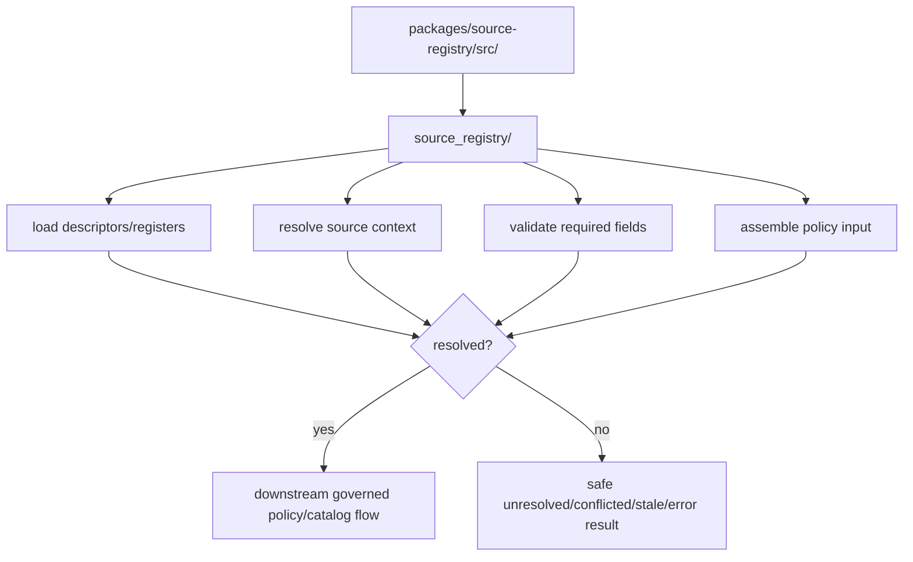

<!-- [KFM_META_BLOCK_V2]
doc_id: kfm://package/source-registry/src/readme
title: Source Registry Source Tree README
type: package-readme
version: v0.1
status: draft
owners: OWNER_TBD — Package steward · Source steward · Catalog steward · Policy steward · Docs steward
created: 2026-06-15
updated: 2026-06-15
policy_label: public
related:
  - ../README.md
  - source_registry/README.md
  - ../../../docs/sources/SOURCE_DESCRIPTOR_STANDARD.md
  - ../../../docs/sources/catalog/README.md
  - ../../../contracts/source/source_descriptor.md
  - ../../../schemas/contracts/v1/source/source_descriptor.schema.json
  - ../../../control_plane/source_authority_register.yaml
  - ../../../data/registry/sources/
  - ../../../policy/rights/
  - ../../../policy/sensitivity/
  - ../../../policy/data/README.md
  - ../../../packages/policy-runtime/README.md
  - ../../../tests/README.md
tags: [kfm, packages, source-registry, src, python-src-layout, source-descriptor, source-authority, fail-closed]
notes:
  - "Initial README for the source-registry src tree."
  - "Repository evidence confirms this README path and the source_registry module directory; implementation files beyond an empty __init__.py remain NEEDS VERIFICATION."
  - "src/ is a packaging/source-layout boundary only; it must not become source truth, policy authority, schema authority, lifecycle data, release authority, or public API surface."
[/KFM_META_BLOCK_V2] -->

<a id="top"></a>

<div align="center">

# Source Registry Source Tree

`packages/source-registry/src/`

**Source-layout boundary for the Source Registry package: Python import modules live here, while source truth, contracts, schemas, policy, lifecycle artifacts, and release decisions stay in their owning roots.**


[Purpose](#1-purpose) · [Repo fit](#2-repo-fit) · [Boundary](#3-authority-boundary) · [Inputs](#5-inputs) · [Exclusions](#6-exclusions) · [Module map](#7-module-map) · [Definition of done](#14-definition-of-done)

</div>

---

> [!IMPORTANT]
> **Status:** draft / `NEEDS VERIFICATION`  
> **Owners:** `OWNER_TBD` — Package steward · Source steward · Catalog steward · Policy steward · Docs steward  
> **Path:** `packages/source-registry/src/README.md`  
> **Responsibility root:** `packages/` — shared reusable implementation packages  
> **Truth posture:** CONFIRMED source-tree README path / CONFIRMED child `source_registry/README.md` / UNKNOWN implementation depth

> [!CAUTION]
> `src/` is not a registry authority. Code placed here may help load and validate source context, but it must not infer source role, downgrade sensitivity, resolve rights by assumption, mark a source public-safe, approve release, or expose registry internals directly to public clients.

---

## Quick jump

- [1. Purpose](#1-purpose)
- [2. Repo fit](#2-repo-fit)
- [3. Authority boundary](#3-authority-boundary)
- [4. Default posture](#4-default-posture)
- [5. Inputs](#5-inputs)
- [6. Exclusions](#6-exclusions)
- [7. Module map](#7-module-map)
- [8. Diagram](#8-diagram)
- [9. Source-tree obligations](#9-source-tree-obligations)
- [10. Import-surface expectations](#10-import-surface-expectations)
- [11. Inspection path](#11-inspection-path)
- [12. Validation expectations](#12-validation-expectations)
- [13. Safe change pattern](#13-safe-change-pattern)
- [14. Definition of done](#14-definition-of-done)
- [15. Open verification items](#15-open-verification-items)

---

## 1. Purpose

`packages/source-registry/src/` is the source-layout container for the Source Registry package.

Its job is to hold importable implementation modules, currently centered on `source_registry/`, that may eventually provide deterministic helper code for source descriptor lookup, authority-register loading, source-resolution validation, safe unresolved-source reporting, and policy-input assembly.

This tree exists to support reusable implementation work. It is not evidence that complete implementation, tests, package metadata, or runtime consumers already exist.

[Back to top](#top)

---

## 2. Repo fit

| Concern | Owning root | Expected relationship |
|---|---|---|
| Source tree | `packages/source-registry/src/` | Packaging/source-layout boundary for importable code |
| Import module | `packages/source-registry/src/source_registry/` | Python module boundary and implementation home |
| Parent package contract | `packages/source-registry/README.md` | Package-wide helper-only posture |
| Source descriptor doctrine | `docs/sources/SOURCE_DESCRIPTOR_STANDARD.md` | Source meaning, intake posture, and anti-collapse rules |
| Source contracts | `contracts/source/` | Semantic meaning, if present and accepted |
| Source schemas | `schemas/contracts/v1/source/` | Machine-readable shape, if present and accepted |
| Authority register | `control_plane/source_authority_register.yaml` | Proposed source role, rights, and sensitivity register |
| Registry artifacts | `data/registry/sources/` | Persisted registry artifacts, not this source tree |
| Policy gates | `policy/rights/`, `policy/sensitivity/`, `policy/data/` | Admissibility and exposure decisions |

## 3. Authority boundary

This source tree may contain code. It does not own the records, schemas, contracts, policy outcomes, lifecycle states, or release decisions that the code may read.

```text
packages/source-registry/src/                 = source tree for importable code
packages/source-registry/src/source_registry/ = Python module
packages/source-registry/README.md            = package boundary contract
docs/sources/SOURCE_DESCRIPTOR_STANDARD.md    = source descriptor doctrine
control_plane/source_authority_register.yaml  = proposed authority register
contracts/source/                             = source semantic meaning
schemas/contracts/v1/source/                  = source machine shape
policy/                                       = allow / deny / restrict / abstain gates
data/registry/sources/                        = persisted source registry artifacts
release/                                      = publication, correction, rollback authority
```

## 4. Default posture

Code in this tree should fail closed and return safe unresolved states when source support is missing, stale, conflicted, invalid, or outside the caller's scope.

It should never silently invent:

- source identity;
- source role;
- rights posture;
- sensitivity floor;
- citation guidance;
- admission decision;
- release state;
- public-safe status.

## 5. Inputs

| Input family | Examples | Required posture |
|---|---|---|
| Descriptor refs | source id, descriptor id, file path, version, hash | Explicit and validated before use |
| Authority-register refs | register path, source-family row, role, rights, sensitivity floor | Loaded from governed register context |
| Caller context | connector, watcher, validator, pipeline, policy runtime, governed API adapter | Explicit for safe outcomes |
| Test context | fixture id, expected result, schema version, contract version | Required before enforcement claims |
| Temporal context | source time, retrieval time, last reviewed, correction time | Kept distinct for stale-state handling |

## 6. Exclusions

| Does not belong here | Correct home |
|---|---|
| Source descriptor doctrine | `docs/sources/SOURCE_DESCRIPTOR_STANDARD.md` |
| Source contracts | `contracts/source/` |
| Source schemas | `schemas/contracts/v1/source/` |
| Policy rules or policy decisions | `policy/` and `packages/policy-runtime/` |
| Source captures and lifecycle material | `data/` lifecycle roots |
| Persisted source registry artifacts | `data/registry/sources/` or accepted registry home |
| Release manifests, rollback cards, correction notices | `release/` and correction homes |
| Connector fetch implementation | `connectors/` |
| Public API or UI routes | `apps/` and governed UI/API packages |

## 7. Module map

| Path | Responsibility | Status |
|---|---|---|
| `source_registry/` | Python import package for source-registry helpers | CONFIRMED directory via child README |
| `source_registry/__init__.py` | Initial export boundary | CONFIRMED empty file / NEEDS VERIFICATION |
| `source_registry/README.md` | Module contract | CONFIRMED |
| future modules | loaders, resolver, validation, policy input, safe errors | PROPOSED |

## 8. Diagram



## 9. Source-tree obligations

| Obligation | Example effect |
|---|---|
| `minimal_exports` | Keep `__init__.py` stable and reviewed |
| `fixture_first` | Resolver behavior should be reproducible without live network calls |
| `no_authority_inference` | Never guess role, rights, sensitivity, or admission status |
| `safe_failures` | Return safe reason codes for unresolved/conflicted/stale/error paths |
| `boundary_preserved` | Route schemas, contracts, data, policy, release, and API work to their roots |
| `public_surface_protected` | Do not expose raw descriptor/register internals as public payloads |

## 10. Import-surface expectations

The import surface should stay small until implementation is verified.

Candidate exported concepts may include resolved-source result types, safe error types, loader functions, resolver functions, validation helpers, and policy-input builders. These names remain `PROPOSED` until code, tests, and package metadata confirm them.

## 11. Inspection path

Implementation files, exports, tests, fixtures, packaging metadata, and consuming imports remain `NEEDS VERIFICATION`.

```bash
find packages/source-registry/src -maxdepth 5 -type f | sort
find packages/source-registry tests fixtures -maxdepth 6 -type f 2>/dev/null | grep -Ei 'source[_-]?registry|source[_-]?descriptor|authority|resolver|rights|sensitivity' | sort
find docs/sources contracts/source schemas/contracts/v1/source control_plane data/registry/sources -maxdepth 5 -type f 2>/dev/null | sort
```

## 12. Validation expectations

Useful validation for this source tree should cover:

- only reviewed import names are exported;
- missing descriptor support returns unresolved or invalid results;
- empty authority register does not create public-safe context;
- role/rights/sensitivity conflict returns conflicted result;
- stale-state metadata is preserved;
- no function in this tree returns release approval or policy allow by itself;
- public-surface consumers continue through governed API and policy envelopes.

## 13. Safe change pattern

For behavior changes in this source tree:

1. Add or update fixtures first.
2. Add tests for resolved, unresolved, conflicted, stale, invalid, and error paths.
3. Update module README and parent package README when public behavior changes.
4. Keep imports backwards compatible unless an ADR or migration note approves a breaking change.
5. Preserve safe reason codes and avoid exposing restricted source details.

## 14. Definition of done

- [ ] Owners are confirmed and `OWNER_TBD` is replaced.
- [ ] `src/` package layout and package metadata are confirmed.
- [ ] Import module files and export surface are inventoried.
- [ ] SourceDescriptor schema and contract links are confirmed.
- [ ] Authority-register shape and maturity are confirmed.
- [ ] Fixtures cover resolved, unresolved, conflicted, stale, invalid, and error cases.
- [ ] Unit tests cover loaders, resolver, validators, and policy-input assembly.
- [ ] Public API and UI consumers preserve trust-membrane boundaries.
- [ ] CI or validator coverage is documented or linked.

## 15. Open verification items

| Item | Why it matters |
|---|---|
| Confirm package metadata and build system | Required for reliable imports |
| Confirm implementation files beyond empty `__init__.py` | Prevents overclaiming module maturity |
| Confirm source descriptor schema/contract paths | Required for shape and meaning checks |
| Confirm source-authority register maturity | Current register evidence is proposed and empty |
| Confirm tests and fixtures | Required before enforcement claims |
| Confirm policy-runtime handoff shape | Required for governed source-admission decisions |
| Confirm consumers | Prevents trust-membrane bypass |

<details>
<summary>Appendix A — no-loss preservation note</summary>

The target file was an empty placeholder. This README adds a bounded `src/` source-tree contract without claiming implemented loaders, resolver logic, dataclasses, exports, tests, fixtures, CI, or consumers.

The observed child `source_registry/__init__.py` is empty, so implementation maturity remains `NEEDS VERIFICATION`.

</details>

## Status summary

`packages/source-registry/src/` should hold importable source-registry helper modules only after implementation, tests, fixtures, and packaging are verified.

It should preserve source role, rights, sensitivity, citation, temporal, stale-state, and admission context for downstream governed workflows without becoming source authority, source truth, policy authority, schema authority, release authority, lifecycle storage, or public-serving bypass.

<p align="right"><a href="#top">Back to top</a></p>
