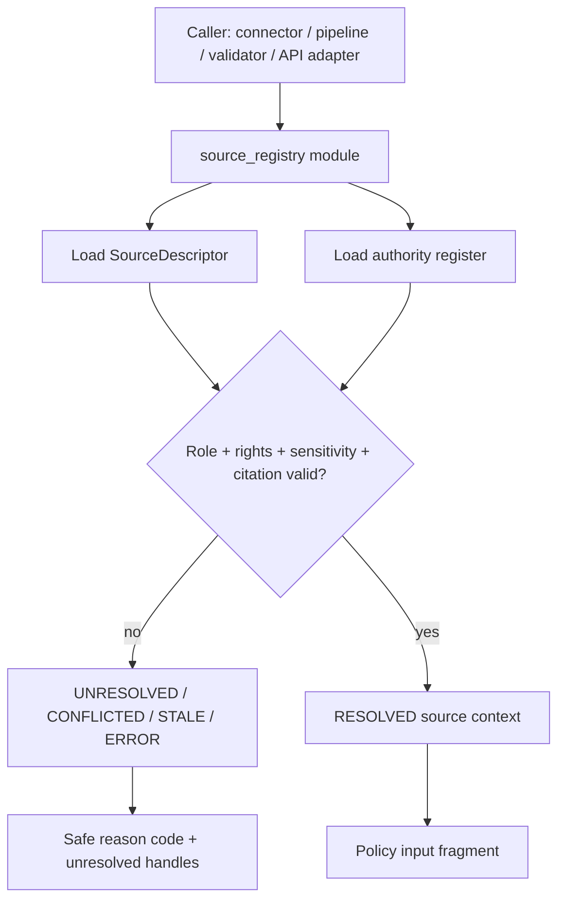

<!-- [KFM_META_BLOCK_V2]
doc_id: kfm://package/source-registry/src/source_registry/readme
title: Source Registry Python Package README
type: package-readme
version: v0.1
status: draft
owners: OWNER_TBD — Package steward · Source steward · Catalog steward · Policy steward · Docs steward
created: 2026-06-15
updated: 2026-06-15
policy_label: public
related:
  - ../../README.md
  - ../../../../docs/sources/SOURCE_DESCRIPTOR_STANDARD.md
  - ../../../../docs/sources/catalog/README.md
  - ../../../../contracts/source/source_descriptor.md
  - ../../../../schemas/contracts/v1/source/source_descriptor.schema.json
  - ../../../../control_plane/source_authority_register.yaml
  - ../../../../data/registry/sources/
  - ../../../../policy/rights/
  - ../../../../policy/sensitivity/
  - ../../../../policy/data/README.md
  - ../../../../packages/policy-runtime/README.md
  - ../../../../tests/README.md
tags: [kfm, packages, python, source_registry, source-descriptor, source-authority, resolver, fail-closed]
notes:
  - "Initial README for the source_registry Python module directory."
  - "Repository evidence confirms this README path and an empty __init__.py; module implementation, exports, tests, packaging metadata, and consuming imports remain NEEDS VERIFICATION."
  - "This module should implement helper code only; source authority, schema shape, semantic meaning, policy decisions, lifecycle data, and release state remain in their owning roots."
[/KFM_META_BLOCK_V2] -->

<a id="top"></a>

<div align="center">

# `source_registry` Python Module

`packages/source-registry/src/source_registry/`

**Python module boundary for source-registry helper code: loading, resolving, validating, and explaining source descriptor and source-authority-register references without becoming source truth or policy authority.**


[Purpose](#1-purpose) · [Repo fit](#2-repo-fit) · [Boundary](#3-authority-boundary) · [Inputs](#5-inputs) · [Exclusions](#6-exclusions) · [Candidate modules](#7-candidate-module-map) · [Definition of done](#14-definition-of-done)

</div>

---

> [!IMPORTANT]
> **Status:** draft / `NEEDS VERIFICATION`  
> **Owners:** `OWNER_TBD` — Package steward · Source steward · Catalog steward · Policy steward · Docs steward  
> **Path:** `packages/source-registry/src/source_registry/README.md`  
> **Responsibility root:** `packages/` — shared reusable implementation packages  
> **Truth posture:** CONFIRMED README path and empty `__init__.py` / PROPOSED module contract / UNKNOWN implementation exports and tests

> [!CAUTION]
> Code in this module must not infer source authority, upgrade source role, downgrade sensitivity, resolve rights by assumption, or mark anything public-safe. It may assemble and validate source context for governed policy gates; it must fail closed when source support is missing or conflicted.

---

## Quick jump

- [1. Purpose](#1-purpose)
- [2. Repo fit](#2-repo-fit)
- [3. Authority boundary](#3-authority-boundary)
- [4. Default posture](#4-default-posture)
- [5. Inputs](#5-inputs)
- [6. Exclusions](#6-exclusions)
- [7. Candidate module map](#7-candidate-module-map)
- [8. Diagram](#8-diagram)
- [9. Result vocabulary](#9-result-vocabulary)
- [10. Module obligations](#10-module-obligations)
- [11. Public API guardrails](#11-public-api-guardrails)
- [12. Inspection path](#12-inspection-path)
- [13. Validation expectations](#13-validation-expectations)
- [14. Definition of done](#14-definition-of-done)
- [15. Open verification items](#15-open-verification-items)

---

## 1. Purpose

`source_registry` is the proposed Python import package for source-registry helper behavior inside `packages/source-registry/`.

It should eventually contain deterministic, fixture-testable functions or classes that help callers:

- load source descriptor records;
- load the source-authority register;
- resolve source role, rights, sensitivity, cadence, citation, and admission state;
- detect unresolved, conflicted, stale, or superseded source context;
- build policy-runtime input fragments;
- emit safe reason codes for `HOLD`, `ABSTAIN`, `CONFLICTED`, `STALE`, and `ERROR` paths.

It must not become the authority for source identity, source truth, source role, rights, sensitivity, schemas, contracts, lifecycle state, release status, or public claims.

[Back to top](#top)

---

## 2. Repo fit

| Concern | Owning root | Expected relationship |
|---|---|---|
| Python helper module | `packages/source-registry/src/source_registry/` | This README and future implementation files, if accepted |
| Package root contract | `packages/source-registry/README.md` | Defines package boundary and helper-only posture |
| Source descriptor doctrine | `docs/sources/SOURCE_DESCRIPTOR_STANDARD.md` | Defines source descriptor meaning, intake posture, and anti-collapse rules |
| Source descriptor schema | `schemas/contracts/v1/source/source_descriptor.schema.json` | Machine-readable shape, if present and accepted |
| Source descriptor contract | `contracts/source/source_descriptor.md` | Semantic meaning, if present and accepted |
| Authority register | `control_plane/source_authority_register.yaml` | Proposed source-role, rights, and sensitivity register |
| Source registry artifacts | `data/registry/sources/` | Persisted registry artifacts, not this module |
| Policy gates | `policy/rights/`, `policy/sensitivity/`, `policy/data/` | Admissibility and exposure decisions, not this module |

## 3. Authority boundary

This module may provide reusable code. It does not own the facts it loads or the decisions that follow from them.

```text
packages/source-registry/src/source_registry/ = Python source-registry helper module
packages/source-registry/README.md            = package boundary contract
docs/sources/SOURCE_DESCRIPTOR_STANDARD.md    = source descriptor doctrine
schemas/contracts/v1/source/                  = source machine shape
contracts/source/                             = source semantic meaning
control_plane/source_authority_register.yaml  = proposed authority register
data/registry/sources/                        = persisted source registry records
policy/                                       = allow / deny / restrict / abstain gates
release/                                      = publication, correction, rollback authority
```

## 4. Default posture

The module should prefer explicit unresolved states over guessed values.

A resolver should return an unresolved, conflicted, stale, or error result when any of these are missing or inconsistent:

- source id or descriptor ref;
- descriptor version or hash;
- source role;
- authority-register entry;
- rights posture;
- sensitivity floor;
- citation guidance;
- temporal/cadence metadata;
- admission state;
- supersession or correction state;
- policy input contract fields.

## 5. Inputs

| Input family | Examples | Required posture |
|---|---|---|
| Descriptor reference | path, source id, descriptor id, version, content hash | Explicit and validated before use |
| Authority-register reference | register path, source family, role row, rights row, sensitivity floor | Loaded, not inferred |
| Context reference | caller type, operation, lifecycle stage, audience, domain | Required for safe errors and policy input assembly |
| Validation reference | schema version, contract version, fixture id, expected result | Required for tests and deterministic behavior |
| Temporal reference | observed/source time, retrieved time, last reviewed, stale threshold | Kept distinct and never collapsed |
| Error context | parse failure, missing field, conflicted role, stale descriptor | Returned as safe reason codes |

## 6. Exclusions

| Does not belong here | Correct home |
|---|---|
| Source descriptor doctrine | `docs/sources/SOURCE_DESCRIPTOR_STANDARD.md` |
| Source semantic contracts | `contracts/source/` |
| Source JSON Schemas | `schemas/contracts/v1/source/` |
| Policy rules or decisions | `policy/` and `packages/policy-runtime/` |
| Source captures or lifecycle artifacts | `data/` lifecycle roots |
| Persisted registry records | `data/registry/sources/` or accepted registry home |
| Release manifests, rollback cards, correction notices | `release/` and correction homes |
| Connector fetchers | `connectors/` |
| Public API routes or UI components | `apps/` and governed UI/API packages |
| Secrets, credentials, or API keys | Secret manager / deployment config |

## 7. Candidate module map

Exact files and exports remain `NEEDS VERIFICATION`. Candidate modules should be introduced only when backed by tests.

| Candidate file | Responsibility | Status |
|---|---|---|
| `models.py` | Typed in-memory result objects or dataclasses for resolved/unresolved source context | PROPOSED |
| `loaders.py` | Deterministic file/record loaders for descriptors and authority register | PROPOSED |
| `resolver.py` | Source resolution orchestration and conflict detection | PROPOSED |
| `validation.py` | Required-field and consistency checks before callers proceed | PROPOSED |
| `policy_input.py` | Policy-runtime input assembly helpers | PROPOSED |
| `errors.py` | Safe exception/result types and reason codes | PROPOSED |
| `__init__.py` | Minimal stable export surface | EMPTY / NEEDS VERIFICATION |

> [!WARNING]
> Candidate file names are not a repo fact until created and tested. Avoid treating this README as implementation proof.

## 8. Diagram



## 9. Result vocabulary

| Result | Meaning | Required behavior |
|---|---|---|
| `RESOLVED` | Required source descriptor and register fields are present and internally consistent | Return scoped context; do not mark public-safe |
| `UNRESOLVED` | Required source support is missing | Return safe reason code and missing field family |
| `CONFLICTED` | Descriptor and register disagree, or source role/sensitivity drift is detected | Fail closed and require steward review |
| `STALE` | Source cadence or supersession state needs refresh/review | Preserve stale-state metadata for policy gates |
| `INVALID` | Shape or required-field validation fails | Return validation reason without leaking restricted data |
| `ERROR` | File, parse, runtime, or unexpected failure | Fail closed and preserve safe diagnostic context |

## 10. Module obligations

| Obligation | Example effect |
|---|---|
| `role_not_inferred` | Source role must be loaded from descriptor/register context, not guessed |
| `rights_preserved` | Rights and terms are carried into policy input |
| `sensitivity_floor_preserved` | Sensitivity floor cannot be downgraded by helper code |
| `temporal_kinds_preserved` | Source, observed, retrieved, release, and correction times remain distinct |
| `safe_error_codes` | Unresolved source support is reported without raw secret/path leakage |
| `no_public_safe_flag` | Resolver output does not itself authorize public release |
| `fixture_reproducible` | Tests should run offline from fixtures |

## 11. Public API guardrails

Public-facing consumers must not call this module as a shortcut around governed interfaces.

A public API adapter may use this module internally to assemble policy input, but the public response must still pass through:

- policy decision envelope;
- evidence/citation closure;
- rights and sensitivity gates;
- release state check;
- redaction/generalization obligations where applicable;
- safe reason-code rendering.

## 12. Inspection path

Implementation files, exports, tests, fixtures, packaging metadata, and consuming imports remain `NEEDS VERIFICATION`.

```bash
find packages/source-registry/src/source_registry -maxdepth 4 -type f | sort
find packages/source-registry tests fixtures -maxdepth 6 -type f 2>/dev/null | grep -Ei 'source[_-]?registry|source[_-]?descriptor|authority|rights|sensitivity|resolver' | sort
find docs/sources contracts/source schemas/contracts/v1/source control_plane data/registry/sources -maxdepth 5 -type f 2>/dev/null | sort
```

## 13. Validation expectations

Useful validation for this module should cover:

- empty or missing descriptor returns `UNRESOLVED` or `INVALID`;
- empty authority register returns `UNRESOLVED`, not public-safe context;
- role mismatch returns `CONFLICTED`;
- missing rights or sensitivity returns `UNRESOLVED` or `CONFLICTED`;
- stale cadence returns `STALE` with safe metadata;
- loader and resolver behavior is deterministic from fixtures;
- `__init__.py` exports only stable reviewed names;
- no function returns release approval, public-safe authority, or policy allow by itself.

## 14. Definition of done

- [ ] Owners are confirmed and `OWNER_TBD` is replaced.
- [ ] Module files and export surface are inventoried.
- [ ] Package metadata and import path are confirmed.
- [ ] SourceDescriptor schema and contract links are confirmed.
- [ ] Authority register shape is confirmed.
- [ ] Fixtures cover resolved, unresolved, conflicted, stale, invalid, and error cases.
- [ ] Unit tests cover loaders, resolver, validators, and policy-input assembly.
- [ ] Public API and UI consumers preserve trust-membrane boundaries.
- [ ] CI or validator coverage is documented or linked.

## 15. Open verification items

| Item | Why it matters |
|---|---|
| Confirm implementation files beyond empty `__init__.py` | Prevents overclaiming module maturity |
| Confirm import package name and packaging metadata | Required for reliable consumer imports |
| Confirm source descriptor schema and contract | Required for shape and meaning checks |
| Confirm authority-register maturity | Current register evidence is proposed and empty |
| Confirm test and fixture locations | Required before enforcement claims |
| Confirm policy-runtime handoff shape | Required for governed source-admission decisions |
| Confirm public consumer paths | Prevents trust-membrane bypass |

<details>
<summary>Appendix A — no-loss preservation note</summary>

The target file was an empty placeholder. This README adds a bounded Python-module contract for `source_registry` without claiming implemented loaders, resolver logic, dataclasses, exports, tests, fixtures, CI, or consumers.

The observed `__init__.py` is empty, so implementation maturity remains `NEEDS VERIFICATION`.

</details>

## Status summary

`packages/source-registry/src/source_registry/` should contain helper code for resolving source descriptors and authority-register context only after implementation, tests, fixtures, and packaging are verified.

It should preserve source role, rights, sensitivity, citation, temporal, stale-state, and admission context for downstream policy and catalog workflows without becoming source authority, source truth, policy authority, schema authority, release authority, lifecycle storage, or public-serving bypass.

<p align="right"><a href="#top">Back to top</a></p>
