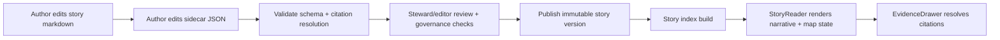

<!-- [KFM_META_BLOCK_V2]
doc_id: kfm://doc/a129dd98-9572-480e-acc0-f7783ccc3f48
title: packages/stories — Story Nodes (v3)
type: standard
version: v1
status: draft
owners: [TBD]
created: 2026-02-22
updated: 2026-02-26
policy_label: public
related:
  - ./stories/                                  # TODO: confirm actual in-repo path
  - ../../contracts/schemas/story_node_v3.schema.json  # TODO: confirm actual in-repo path
  - ../../contracts/openapi/kfm-api-v1.yaml            # TODO: confirm actual in-repo path
tags: [kfm, stories, story-node]
notes:
  - Canonical authoring + governance rules for Story Nodes stored in this package.
  - Some paths may be placeholders until verified in-repo.
[/KFM_META_BLOCK_V2] -->

# packages/stories
Story Nodes (v3) — governed narrative + reproducible map state + citations for Story Mode.

**Status:** draft · **Owners:** TBD


## Quick navigation
- [Overview](#overview)
- [Story Node v3 specification](#story-node-v3-specification)
- [Truth status of this README](#truth-status-of-this-readme)
- [Package contents](#package-contents)
- [Authoring workflow](#authoring-workflow)
- [Citations and EvidenceRefs](#citations-and-evidencerefs)
- [Validation and publish gate](#validation-and-publish-gate)
- [Governance and safety](#governance-and-safety)
- [Interfaces](#interfaces)
- [Glossary](#glossary)
- [References](#references)

---

## Overview

### Purpose
This package is the **canonical home for KFM Story Nodes (v3)**: human-readable narratives bound to:
- **saved map state** (camera/layers/time/filter context), and
- **resolvable citations** (EvidenceRefs),

so Story Mode can render the same view reproducibly and route every claim to the evidence drawer.

### Where it fits in the repo
In the recommended KFM layout, Story Nodes are governed publications alongside contracts, policy, and catalogs. This package should be treated as **production documentation/content**: changes are reviewed, validated, and reversible.

### What belongs here
- Versioned Story Node sources:
  - `*.md` narrative (with MetaBlock v2 and claim-level citations)
  - `*.story.json` sidecar (map state + citations + policy/review metadata)
- Optional **media** used by stories **only with rights metadata**
- Optional story-level helper tooling:
  - schema validation, citation lint, index build

### What must not go here
- ❌ Raw/processed dataset artifacts (those belong under governed `data/` zones)
- ❌ Unlicensed or rights-unclear media copied into the repo
- ❌ Restricted precise coordinates, identifiers, or targeting details for sensitive locations
- ❌ UI code that bypasses governed APIs (trust membrane violation)

> **Non‑negotiable posture**
> - **Fail closed:** if citations don’t resolve, rights are unclear, or sensitivity is uncertain → story stays **draft/restricted**.
> - **Trust membrane:** Story Mode consumes stories via governed APIs; no direct storage/DB reads from UI.
> - **Evidence-first UX:** every story claim must open an evidence view; this is the primary trust surface.

---

## Story Node v3 specification

### Definition (what “a Story Node version” contains)
A Story Node **version** includes:
- narrative markdown,
- citations (EvidenceRefs),
- a saved map state (camera, layers, time window, filters),
- policy label and review state.

Stories are reproducible because map state and referenced dataset versions are captured.

### File pair (required)
A Story Node is **two required files**:

| Component | Audience | Role | Minimum contract |
|---|---|---|---|
| **Markdown** (`.md`) | Humans | Narrative + claim list with inline citations | MetaBlock v2 + sections: `Summary`, `Claims`, `Narrative`, `Evidence` *(Changelog recommended)* |
| **Sidecar JSON** (`.story.json`) | Machines | Map state, citations list, policy/review metadata | `kfm_story_node_version`, `story_id`, `version_id`, `status`, `policy_label`, `review_state`, `map_state`, `citations` |

### Lifecycle overview (author → validate → publish → UI)


### Map state is a reproducible artifact
Map state stored in sidecar JSON **MUST** capture enough to replay the same view:
- camera position (bbox/zoom),
- active layers + style parameters (if applicable),
- time window,
- filters.

---

## Truth status of this README

| Topic | Status | Notes |
|---|---|---|
| Story Node v3 = markdown + sidecar JSON | **Confirmed** | Defined in vNext guide template (Appendix E) |
| MetaBlock v2 (no YAML frontmatter) | **Confirmed** | Defined in vNext guide template (Appendix B) |
| EvidenceRef schemes (dcat/stac/prov/doc/graph) | **Confirmed** | Defined in vNext guide (EvidenceRef/EvidenceBundle) |
| Publishing gate: citations resolve via evidence resolver | **Confirmed** | Story Node template explicitly requires resolver-based citation resolution |
| Story content standards + review workflow | **Proposed (vNext)** | Adopted here as baseline until superseded by repo governance policy |
| API endpoint list in this README | **Unknown** | OpenAPI contract is the source of truth; do not treat README paths as canonical |
| Exact directory tree & local scripts | **Unknown** | Replace the tree below with the actual repo state once verified |

---

## Package contents

> **NOTE:** The tree below is an *intended* layout and may not match the repo yet (**not confirmed in repo**). Update to match the actual `packages/stories/` contents once verified.

```text
packages/stories/
├─ README.md
├─ stories/                         # Story Node sources (canonical)
│  └─ <story_id_or_slug>/
│     ├─ v1.md                      # MetaBlock v2 + narrative
│     ├─ v1.story.json              # Sidecar JSON: map state + citations + policy/review
│     ├─ media/                     # Optional: images/video used in story (rights required)
│     └─ rights/                    # Optional: per-asset rights metadata (source/license/permission)
├─ schemas/                         # Optional mirror of contract surfaces
│  └─ story_node_v3.schema.json
├─ src/                             # Optional: builder + validator implementation
│  ├─ validate.ts
│  ├─ build-index.ts
│  └─ index.ts
└─ tests/                           # Optional: schema + citation resolution tests
   └─ ...
```

---

## Authoring workflow

### 1) Choose identity + versioning (immutable versions)
- **story_id**: stable canonical ID (do not change after first publish)
  - example: `kfm://story/<uuid>`
- **version_id**: immutable version label per publish
  - example: `v1`, `v2`, …

Rules:
- Publishing creates an **immutable** version; edits require a new `version_id`.
- Every story version should reference dataset versions (not floating “latest” datasets).

### 2) Write the Story Node markdown
> The skeleton below matches the v3 template; add sections as needed (e.g., Changelog), but keep the core sections.

```markdown
<!-- [KFM_META_BLOCK_V2]
doc_id: kfm://story/<uuid>@v1
title: <Story title>
type: story
version: v3
status: draft
owners: <names/teams>
created: YYYY-MM-DD
updated: YYYY-MM-DD
policy_label: public
related:
  - kfm://dataset/<slug>@<dataset_version_id>
tags: [kfm, story, story-node]
notes:
  - scope: <time window + geography>
  - uncertainty: <limitations/conflicts>
  - claims: <observation vs interpretation notes>
[/KFM_META_BLOCK_V2] -->

# <Story title>

## Summary
<Short summary including scope and time window.>

## Claims
1. <Observation claim.> [CITATION: dcat://...]
2. <Observation claim.> [CITATION: stac://...]
3. <Interpretive claim (clearly labeled as interpretation).> [CITATION: doc://...]

## Narrative
<Full narrative with inline citations. Prefer one EvidenceRef per paragraph where factual density is high.>

## Evidence
- [CITATION: dcat://...]
- [CITATION: prov://...]
- [CITATION: doc://...]

## Changelog (recommended)
- v1 (YYYY-MM-DD): Initial draft. <What changed and why.>
```

### 3) Create the sidecar JSON (map state + citations + policy/review)
```json
{
  "kfm_story_node_version": "v3",
  "story_id": "kfm://story/<uuid>",
  "version_id": "v1",

  "status": "draft",
  "policy_label": "public",
  "review_state": "needs_review",

  "map_state": {
    "bbox": [-102.0, 36.9, -94.6, 40.0],
    "zoom": 6,
    "layers": [
      {
        "layer_id": "<layer_id>",
        "dataset_version_id": "<dataset_version_id>",
        "style": { "opacity": 0.9 }
      }
    ],
    "time_window": { "start": "YYYY-MM-DD", "end": "YYYY-MM-DD" },
    "filters": []
  },

  "citations": [
    { "ref": "dcat://<dataset>@<dataset_version_id>", "kind": "dcat" },
    { "ref": "stac://<collection_or_item>#<asset_or_feature>", "kind": "stac" },
    { "ref": "prov://run/<run_id_or_bundle>", "kind": "prov" },
    { "ref": "doc://<doc_or_story_ref>#<fragment>", "kind": "doc" }
  ]
}
```

### 4) Story content standards (baseline)
A publishable Story Node should:
- declare scope (time window + geography),
- separate **observation claims** from **interpretive claims**,
- include citations for every factual claim (EvidenceRefs),
- include uncertainty notes where sources conflict or are incomplete,
- include licensing/attribution for all embedded media,
- include policy label + review state.

### 5) Media: rights required (fail closed)
If you embed images/video/audio:
- Provide **rights metadata** for each asset (source/creator/license/permission).
- If rights are unclear: do not embed; keep draft/restricted and request review.
- Publishing should be blocked when media rights are missing or unclear.

---

## Citations and EvidenceRefs

### EvidenceRef schemes (minimum)
Use resolvable EvidenceRefs using explicit schemes:
- `dcat://...` — dataset/distribution metadata
- `stac://...` — collection/item/asset metadata
- `prov://...` — provenance (run lineage)
- `doc://...` — governed docs + story citations
- `graph://...` — (if applicable) graph entities/claims/edges

### Evidence resolver expectations
- Evidence resolution must be **bounded and predictable**.
- The UI should resolve evidence in **≤ 2 calls** (e.g., click citation → resolve → view bundle).

### Citation density guidance
Recommended:
- One citation per paragraph in narrative when factual density is high.
- Every claim in `Claims` must have at least one EvidenceRef.
- Keep an `Evidence` section listing the key EvidenceRefs used.

Anti‑patterns:
- “Trust me” claims with no citations.
- Citations that resolve but do not actually support the claim (narrative drift).
- Unstable URLs in place of EvidenceRefs.

---

## Validation and publish gate

> Publishing is **blocked** unless all required checks pass (fail closed).

### Story Node publish gate checklist
- [ ] Sidecar JSON validates against `story_node_v3` schema
- [ ] MetaBlock v2 present in markdown
- [ ] All `[CITATION: ...]` refs resolve through the evidence resolver
- [ ] Map state references **promoted** dataset versions only
- [ ] `policy_label` and `review_state` are correctly set
- [ ] Story contains **no restricted precise locations** or identifiers
- [ ] Rights metadata exists for all embedded media
- [ ] Changelog updated for the version being published

### Recommended automated checks (CI + local)
- JSON Schema validation (sidecar + any structured story metadata)
- Citation lint: extract `[CITATION: ...]` refs and resolve them
- Policy lint: enforce public vs restricted rules and redaction/generalization obligations
- Media rights lint: every embedded asset has rights metadata

---

## Governance and safety

### Review triggers (governance review)
Trigger governance review when:
- Story references Indigenous communities, treaty sites, sacred sites, or restricted cultural knowledge
- Story includes archaeological site locations or sensitive ecological locations
- Story could enable harm (looting, harassment, targeting infrastructure)

Operational rule:
- If uncertain, default to **restricted draft** and request governance review.

### Safety defaults for location
- Do not publish exact coordinates for culturally restricted or vulnerable sites.
- Prefer generalized geometry and/or “public_generalized” derivatives.
- Do not include identifying details that enable targeting.

---

## Interfaces

> This package is **content**; delivery happens via governed APIs + UI trust surfaces.

### Contract sources of truth
- **OpenAPI:** `contracts/openapi/kfm-api-v1.yaml` (canonical endpoint definitions)
- **Schemas:** `contracts/schemas/*.schema.json` (canonical validation rules)
- **Evidence resolver:** citations must resolve via governed resolver (fail closed)

> **NOTE:** Do not treat endpoint names in this README as authoritative unless they are explicitly present in the OpenAPI contract.

---

## Glossary
- **Story Node (v3):** Versioned narrative bundle: markdown + sidecar JSON (map state + citations + policy/review).
- **MetaBlock v2:** Structured metadata header for docs without YAML frontmatter.
- **EvidenceRef:** Stable reference to evidence using explicit schemes (e.g., `dcat://`, `stac://`, `prov://`, `doc://`, `graph://`).
- **EvidenceBundle:** Resolved evidence view returned by the evidence resolver (human card + machine metadata + policy decision).
- **policy_label:** Classification controlling exposure (e.g., public vs restricted).
- **review_state:** Human review status (e.g., `needs_review`; refer to schema/controlled vocab).
- **map_state:** Saved map viewport, layers, time window, and filters that the UI restores when rendering a story.

---

## References
- *Kansas Frontier Matrix (KFM) — Definitive Design & Governance Guide (vNext)*:
  - Trust membrane + evidence-first UX
  - EvidenceRef / EvidenceBundle definitions
  - Appendix B: MetaBlock v2 template
  - Appendix E: Story Node v3 template (markdown + sidecar)
  - Story governance: content standards, review workflow, publish gates
- *KFM OpenAPI contract* (repo-local): `contracts/openapi/kfm-api-v1.yaml`

---

[Back to top](#packagesstories)