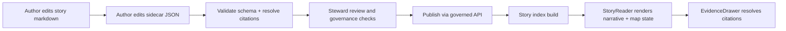

<!-- [KFM_META_BLOCK_V2]
doc_id: kfm://doc/a129dd98-9572-480e-acc0-f7783ccc3f48
title: packages/stories — Story Nodes (v3)
type: standard
version: v1
status: draft
owners: [TBD]
created: 2026-02-22
updated: 2026-02-22
policy_label: public
related:
  - ./stories/
  - ../../contracts/schemas/story_node_v3.schema.json
  - ../../contracts/openapi/kfm-api-v1.yaml
tags: [kfm, stories, story-node]
notes:
  - This README defines authoring + governance rules for Story Nodes stored in this package.
  - Paths under related may be placeholders until confirmed in-repo.
[/KFM_META_BLOCK_V2] -->

# packages/stories
Story Nodes (v3) — governed narrative + map state bundles for Story Mode.

**Status:** draft · **Owners:** TBD


## Quick navigation
- [Purpose](#purpose)
- [Story Node v3 at a glance](#story-node-v3-at-a-glance)
- [Truth status of this README](#truth-status-of-this-readme)
- [Package contents](#package-contents)
- [Author a story](#author-a-story)
- [Citations and EvidenceRefs](#citations-and-evidencerefs)
- [Validation and publish gate](#validation-and-publish-gate)
- [Governance and safety](#governance-and-safety)
- [Interfaces](#interfaces)
- [Glossary](#glossary)
- [References](#references)

---

## Purpose

This package is the **canonical home for KFM Story Nodes**: human-readable narratives bound to **machine-readable map state + citations**, intended to render in Story Mode and to interoperate with the evidence drawer / evidence resolver.

**Non-negotiable posture**
- **Fail closed:** if citations don’t resolve, rights are unclear, or sensitivity is uncertain → story stays draft/restricted.  
- **Trust membrane:** clients should consume stories via governed APIs; no “direct-to-storage/DB” fetches from UI code paths.  
- **Cite-or-abstain:** every factual claim needs an evidence trail.

---

## Story Node v3 at a glance

A Story Node is **two files**:

| Component | Audience | Role | Required fields (minimum) |
|---|---|---|---|
| **Markdown** (`.md`) | Humans | Narrative + claim list with inline citations | MetaBlock v2 + `Summary`, `Claims`, `Narrative`, `Evidence`, `Changelog` |
| **Sidecar JSON** (`.json`) | Machines | Map state, citations list, policy/review metadata | `kfm_story_node_version`, `story_id`, `version_id`, `policy_label`, `review_state`, `map_state`, `citations` |

### Lifecycle overview (author → publish → UI)



---

## Truth status of this README

| Topic | Status | Notes |
|---|---|---|
| Story Node v3 concept: markdown + sidecar JSON | **Confirmed** | Defined in KFM Story Node template |
| MetaBlock v2 header requirements | **Confirmed** | Defined in MetaBlock v2 appendix |
| Publishing gate: citations must resolve via evidence resolver | **Confirmed** | Explicit publish gate + QA checklist |
| API endpoints listed in this README | **Confirmed** (as illustrative contract surface) | API surface is described in KFM blueprint docs |
| Directory tree + script names in this package | **Unknown** | Update once repo tree/package.json is verified |
| Additional local tooling (builder, validator) | **Proposed** | Recommended for CI + dev ergonomics |

---

## Package contents

> **NOTE:** The tree below is an *intended* layout and may not match the repo yet (**not confirmed in repo**). Update it to match the actual `packages/stories/` contents once verified.

```text
packages/stories/
├─ README.md
├─ stories/                         # Story Node sources (canonical)
│  └─ <story_id_or_slug>/
│     ├─ v1.md                      # MetaBlock v2 + narrative
│     ├─ v1.story.json              # Sidecar JSON: map state + citations + policy/review
│     ├─ media/                     # Optional: images/video used in story (see rights rules)
│     └─ rights/                    # Optional: media rights metadata (source/license/permission)
├─ schemas/                         # JSON Schemas (contract surfaces)
│  └─ story_node_v3.schema.json
├─ src/                             # Optional: builder + validator implementation
│  ├─ validate.ts
│  ├─ build-index.ts
│  └─ index.ts
└─ tests/                           # Optional: schema + citation resolution tests
   └─ ...
```

---

## Author a story

### 1) Choose identity and versioning

- **story_id**: stable canonical ID: `kfm://story/<uuid>`
- **version_id**: immutable version label per publish: `v1`, `v2`, …

Rules:
- Do **not** change `story_id` after first publish.
- Publishing creates an immutable version; edits require a new version.

### 2) Write the Story Node markdown (MetaBlock v2 + narrative)

> Copy this skeleton and fill in all placeholders.

```markdown
[KFM_META_BLOCK_V2]
doc_id: kfm://story/<uuid>@v1
title: <Story title>
type: story
version: v3
status: draft
owners: <names/teams>
created: YYYY-MM-DD
updated: YYYY-MM-DD
policy_label: public
review_state: needs_review
related:
  - kfm://dataset/<slug>@<dataset_version_id>
tags: [kfm, story]
notes:
  - scope: <spatial/temporal scope>
  - uncertainty: <known limitations>
[/KFM_META_BLOCK_V2]

# <Story title>

## Summary
<Short summary of the story, including scope and time window.>

## Claims
1. <Claim text.> [CITATION: doc://...]
2. <Claim text.> [CITATION: stac://...]

## Narrative
<Full narrative with inline citations.>

## Evidence
- [CITATION: dcat://...]
- [CITATION: prov://...]

## Changelog
- v1 (YYYY-MM-DD): Initial draft. <What changed and why.>
```

### 3) Create the sidecar JSON (map state + citations + policy/review)

> Copy this skeleton and fill in all placeholders.

```json
{
  "kfm_story_node_version": "v3",
  "story_id": "kfm://story/<uuid>",
  "version_id": "v1",

  "title": "<Story title>",
  "status": "draft",
  "policy_label": "public",
  "review_state": "needs_review",

  "map_state": {
    "bbox": [-102.0, 36.9, -94.6, 40.0],
    "zoom": 6,
    "layers": [
      { "layer_id": "<layer_id>", "dataset_version_id": "<dataset_version_id>" }
    ],
    "time_window": { "start": "YYYY-MM-DD", "end": "YYYY-MM-DD" }
  },

  "citations": [
    { "ref": "dcat://<dataset>@<dataset_version_id>", "kind": "dcat" },
    { "ref": "prov://<run_id_or_bundle>", "kind": "prov" },
    { "ref": "doc://<doc_or_story_ref>#<fragment>", "kind": "doc" }
  ]
}
```

### 4) Set policy + review state (fail closed)

- If the story touches sensitive topics (Indigenous communities, treaty/sacred sites, archaeological site locations, sensitive ecological locations, or anything that could enable harm), default to:
  - `policy_label: restricted`
  - `review_state: needs_review`
  - and request governance review (do not publish)

### 5) Add media carefully (rights required)

If you embed images/video/audio:
- Provide **rights metadata** for each asset (source/creator/license/permission).
- If rights are unclear: do not embed; link out or keep as draft.
- Publishing should be blocked when media rights are missing or unclear.

---

## Citations and EvidenceRefs

### EvidenceRef schemes (minimum)

Use resolvable EvidenceRefs in the form:
- `dcat://...` for dataset/distribution metadata
- `stac://...` for collection/item/asset metadata
- `prov://...` for run lineage (activities/entities/agents)
- `doc://...` for governed docs + story citations

### Citation density and structure

Recommended:
- At least **one citation per paragraph** in Narrative (more for dense factual sections).
- Claims list: each claim gets at least one citation.
- Keep an `Evidence` section listing the key EvidenceRefs used.

Anti-patterns:
- “Trust me” claims with no citations.
- Copying content from sources without clear attribution.
- Pointing to unstable URLs instead of EvidenceRefs.

---

## Validation and publish gate

> Publishing is **blocked** unless all required checks pass.

### Story Node QA checklist (publish gate)

- [ ] All citations resolve through evidence resolver
- [ ] Story contains no restricted coordinates or identifiers
- [ ] Rights metadata exists for all embedded media
- [ ] Map state references promoted dataset versions only
- [ ] `policy_label` and `review_state` are set correctly
- [ ] Changelog entry exists describing updates since last version

### Recommended automated checks (CI + local)

**Proposed** gates (adjust to match your tooling):
- JSON Schema validation for sidecar + MetaBlock presence
- Link/citation lint (extract `[CITATION: ...]` and ensure resolver can resolve each ref)
- Policy lint (restricted/public rules + redaction obligations)
- Media rights lint (every embedded asset has rights metadata)

---

## Governance and safety

### Sensitive topics review triggers

Trigger governance review when:
- Story references Indigenous communities, treaty sites, sacred sites, or restricted cultural knowledge
- Story includes archaeological site locations or sensitive ecological locations
- Story could enable harm (looting, harassment, targeting infrastructure)

Operational rule:
- If uncertain, default to restricted draft and request review (**fail closed**).

### Safety defaults for location

- Do not publish exact coordinates for culturally restricted or vulnerable sites.
- Prefer generalized geometry and/or “public_generalized” derivatives (if applicable).
- Do not include identifying details that enable targeting.

---

## Interfaces

> This package is content; delivery happens via governed APIs + UI surfaces.

**Illustrative API surface**
- `GET /api/v1/story?bbox=&time=&tag=` — discover stories by filter
- `GET /api/v1/story/{story_id}?version_id=` — fetch a specific story version
- `POST /api/v1/story/{story_id}/publish` — publish a version (requires review_state)
- `/api/v1/evidence/resolve` — resolve EvidenceRefs for inline citations and publish gate

---

## Glossary

- **Story Node (v3):** Versioned narrative bundle: markdown + sidecar JSON (map state + citations + policy/review).
- **MetaBlock v2:** Structured metadata header for docs without YAML frontmatter.
- **EvidenceRef:** Stable reference to an evidence bundle (DCAT/STAC/PROV/DOC).
- **policy_label:** Classification controlling exposure (e.g., public vs restricted).
- **review_state:** Human review status (minimum known value: `needs_review`; refer to schema for full enum).
- **map_state:** Saved map viewport, layers, and time window that the UI restores when rendering a story.

---

## References

- *Kansas Frontier Matrix (KFM) — Definitive Design & Governance Guide (vNext)*:
  - Appendix B: MetaBlock v2
  - Appendix E: Story Node v3 template (markdown + sidecar)
  - Story governance: content standards + review workflow + QA checklist
- *KFM Blueprint*:
  - Evidence resolver and governed API surface (incl. story endpoints)
  - EvidenceRef schemes and minimum contract surfaces

---

[Back to top](#packagesstories)
