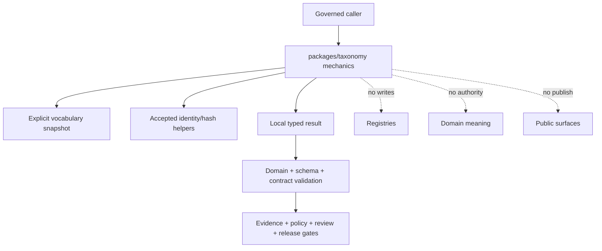

<!-- [KFM_META_BLOCK_V2]
doc_id: kfm://doc/NEEDS-VERIFICATION/packages-taxonomy-readme
title: packages/taxonomy — Shared Taxonomy Helper Boundary
type: readme
version: v1.1
status: draft
owners: GitHub review routing — @bartytime4life; taxonomy steward, domain stewards, schema steward, contract steward, policy steward, validation steward, and release steward NEEDS VERIFICATION
created: NEEDS VERIFICATION — the file predates this evidence-grounding revision
updated: 2026-07-20
policy_label: public
current_path: packages/taxonomy/README.md
truth_posture: CONFIRMED package path, README-only package inventory, shared-package placement, domain-specific Flora taxonomy documentation, taxonomy-resolver validator documentation, taxonomy crosswalk contract and registry documentation, CODEOWNERS review route, and bounded absence of package metadata, source namespace, implementation modules, package-local tests, shared taxonomy schema root, and shared canonical taxonomy registry / PROPOSED shared pure-helper responsibility, explicit input and provenance contract, candidate capability boundaries, typed local result classes, dependency direction, no-network behavior, test matrix, staged implementation, compatibility, and rollback / CONFLICTED rich shared and domain taxonomy documentation versus absent executable implementation and unconfirmed authority homes; generic taxonomy helper proposals versus domain-owned meaning; crosswalk registry documentation versus unconfirmed accepted shared taxonomy registry / UNKNOWN accepted package and import names, runtime and build backend, shared taxonomy object model, vocabulary registry, schema ids, semantic-version policy, alias and hierarchy semantics, dependency set, consumers, validator wiring, CI enforcement, distribution, deployment, and operational health / NEEDS VERIFICATION owners, accepted authority split, domain delegation rules, crosswalk ownership, schema and contract adoption, fixture and test homes, security and sensitivity review, consumer inventory, compatibility policy, release process, and rollback owner
evidence_snapshot:
  repository: bartytime4life/Kansas-Frontier-Matrix
  base_ref: main
  base_commit: 13e1b27bf8cc4fdd4d88305532e69c444c07a4b5
  target_blob_before_revision: 0baf8065e34756b37162e703d2799da4df2e93a3
  inspected_on: 2026-07-20
  bounded_findings:
    - packages/taxonomy/README.md is the only package-local file established by direct reads and bounded code search
    - packages/taxonomy/pyproject.toml was not found
    - packages/taxonomy/src/taxonomy/core.py was not found
    - no package-local source namespace, manifest, test suite, fixture suite, changelog, or executable consumer was established
    - tools/validators/taxonomy_resolver/README.md is documentation and explicitly leaves executable validators, fixtures, registry wiring, runtime behavior, and CI wiring unverified
    - packages/domains/flora/taxonomy/README.md and packages/domains/flora/taxonomy_resolver/README.md are domain-specific draft documentation, not shared implementation evidence
    - contracts/crosswalks/taxonomy/README.md and data/registry/crosswalks/README.md establish documented crosswalk lanes without proving an accepted shared taxonomy registry or executable resolver
    - data/registry/taxonomy/README.md, data/registry/taxonomies/README.md, data/registry/vocabularies/README.md, contracts/taxonomy/README.md, and schemas/contracts/v1/taxonomy/README.md were not found at checked paths
    - packages/ is the canonical shared reusable implementation root under Directory Rules
related:
  - ../README.md
  - ../identity/README.md
  - ../schema-registry/README.md
  - ../envelopes/README.md
  - ../domains/flora/taxonomy/README.md
  - ../../tools/validators/taxonomy_resolver/README.md
  - ../../contracts/crosswalks/taxonomy/README.md
  - ../../data/registry/crosswalks/README.md
  - ../../docs/doctrine/directory-rules.md
  - ../../docs/doctrine/authority-ladder.md
  - ../../docs/doctrine/ai-build-operating-contract.md
  - ../../docs/registers/DRIFT_REGISTER.md
  - ../../docs/governance/DEPRECATION_PROCESS.md
  - ../../CONTRIBUTING.md
  - ../../.github/CODEOWNERS
tags: [kfm, packages, taxonomy, vocabulary, ontology, classification, aliases, hierarchy, crosswalks, semantic-versioning, drift, fail-closed]
notes:
  - This README defines a repository-grounded package boundary; it does not implement or accept a package API.
  - A unique taxonomy lookup is local resolution evidence only. It is not evidence of domain truth, source authority, policy allow, public safety, release approval, or publication.
  - Canonical taxonomy and vocabulary authority remains NEEDS VERIFICATION and must not be inferred from this package path.
[/KFM_META_BLOCK_V2] -->

<a id="top"></a>

# `packages/taxonomy/` — Shared Taxonomy Helper Boundary

Repository-present documentation lane for a possible shared, deterministic taxonomy helper library. At the pinned evidence snapshot, this package is **README-only**: no package metadata, source namespace, implementation module, package-local test suite, accepted public API, distribution, or runtime consumer was established.


**Quick links:** [Purpose](#1-purpose) · [Evidence](#2-status-and-evidence) · [Authority](#3-directory-rules-and-authority) · [Model](#5-taxonomy-model-and-domain-boundaries) · [Inputs](#6-input-and-provenance-contract) · [Capabilities](#7-candidate-capability-boundaries) · [Outcomes](#8-local-result-classes-and-caller-outcomes) · [Versioning](#10-versioning-temporal-semantics-and-drift) · [Testing](#16-testing-and-fixtures) · [Done](#19-definition-of-done) · [Open](#21-verification-and-conflict-register) · [Rollback](#22-correction-deprecation-and-rollback)

> [!IMPORTANT]
> **This README is not an implementation, API acceptance, registry decision, schema decision, or release decision.** Examples and capability names below are design constraints for later review. They do not establish import paths, callable names, result enums, record shapes, version compatibility, installability, or operational use.

> [!WARNING]
> **A label match is not authority.** A term, alias, hierarchy path, or crosswalk can resolve locally and still be unsupported for the requested domain claim, time, source role, sensitivity class, public surface, or release. Evidence, policy, review, and publication gates remain separate.

---

## 1. Purpose

`packages/taxonomy/` is a sound responsibility lane for reusable, cross-domain taxonomy mechanics **if** KFM later accepts a shared package contract and at least two real consumers need the same behavior.

A future implementation may help callers:

- read an explicit, admitted vocabulary snapshot without network access;
- identify terms by stable identifiers rather than display labels alone;
- inspect labels, aliases, hierarchy relations, status, version, and provenance;
- detect unknown, duplicate, ambiguous, stale, deprecated, superseded, or conflicting terms;
- compare explicitly supplied vocabulary versions;
- evaluate explicitly supplied crosswalk candidates without asserting equivalence as truth;
- preserve the taxonomy context needed for validation, evidence, policy, review, release, correction, and replay.

This package must remain a **mechanics layer**, not a meaning or publication authority. Domain packages and contracts own domain semantics. Registries own admitted records. Schemas own machine shape. Policy owns exposure decisions. EvidenceBundles support claims. Release objects authorize publication.

### 1.1 Non-goals

This package is not:

- the canonical taxonomy, ontology, vocabulary, thesaurus, code-list, class-map, or checklist home;
- a source registry, source-role authority, or rights register;
- a domain model for Flora, Fauna, Geology, Soil, Agriculture, Hazards, Habitat, or another lane;
- a fuzzy classifier, AI labeling service, search engine, knowledge graph, or network resolver;
- a schema, contract, policy, lifecycle, evidence, receipt, proof, catalog, or release authority;
- a public API, MapLibre layer, search facet, legend, Evidence Drawer, Focus Mode, or AI-answer surface;
- permission to rewrite historical records when a label, synonym, class map, or hierarchy changes.

[Back to top](#top)

---

## 2. Status and evidence

### 2.1 Pinned inspection boundary

| Evidence item | Observed state | What it proves |
| --- | --- | --- |
| Repository base | `main` at `13e1b27bf8cc4fdd4d88305532e69c444c07a4b5` | Immutable review baseline for this revision. |
| This file before revision | Blob `0baf8065e34756b37162e703d2799da4df2e93a3` | Prior README content exists; it does not prove code. |
| `packages/taxonomy/pyproject.toml` | **NOT FOUND** | No Python package metadata or build backend is established at that path. |
| `packages/taxonomy/src/taxonomy/core.py` | **NOT FOUND** | The previously illustrated namespace and implementation are not established. |
| Other package-local files | **NOT ESTABLISHED** by direct reads and bounded search | No source namespace, manifest, tests, fixtures, changelog, built artifact, or package release was established. |
| Shared validator lane | [`tools/validators/taxonomy_resolver/README.md`](../../tools/validators/taxonomy_resolver/README.md) exists | Validator expectations are documented; executable validators, fixtures, registry wiring, runtime behavior, and CI wiring remain unverified. |
| Flora taxonomy lanes | [`packages/domains/flora/taxonomy/README.md`](../domains/flora/taxonomy/README.md) and a resolver README exist | Domain-specific design documentation exists; it is not shared implementation evidence or canonical authority. |
| Taxonomy crosswalk contract lane | [`contracts/crosswalks/taxonomy/README.md`](../../contracts/crosswalks/taxonomy/README.md) exists | Crosswalk meaning has a documented lane; acceptance and executable enforcement require separate evidence. |
| Crosswalk registry lane | [`data/registry/crosswalks/README.md`](../../data/registry/crosswalks/README.md) exists | Crosswalk registry placement is documented; it does not prove admitted taxonomy records. |
| Shared taxonomy registry/schema homes | Checked conventional paths **NOT FOUND** | Canonical shared taxonomy authority and shared schema topology remain unresolved. |
| Review routing | [`/.github/CODEOWNERS`](../../.github/CODEOWNERS) routes `/packages/` to `@bartytime4life` | GitHub review routing is confirmed; semantic stewardship and required-review enforcement remain separate. |

This is a bounded inventory, not proof of repository-wide absence. New evidence must be compared against the pinned snapshot before implementation.

### 2.2 Truth labels used here

**CONFIRMED**

- The package path and prior README exist.
- Directory Rules place reusable shared libraries under `packages/`.
- The inspected package is README-only at the bounded snapshot.
- Domain-specific Flora taxonomy documentation, validator documentation, and taxonomy crosswalk documentation exist.
- The checked shared registry/schema paths were not found.

**PROPOSED**

- A cross-domain, pure, no-network helper package at this path.
- Explicit vocabulary-snapshot inputs, local indexes, deterministic result objects, version comparisons, and drift diagnostics.
- The capability, test, dependency, compatibility, and implementation sequence in this document.

**UNKNOWN**

- Package and import names, runtime, build backend, dependencies, supported platforms, distribution, and consumers.
- Accepted shared taxonomy record, schema, contract, and vocabulary-registry topology.
- Whether a shared package is preferable to domain-local helpers after duplication analysis.
- Operational performance, deployment, observability, and package health.

**NEEDS VERIFICATION**

- Named semantic owners and independent reviewers.
- Cross-domain versus domain-owned responsibility boundaries.
- Stable identifier, alias, hierarchy, version, deprecation, and crosswalk semantics.
- Accepted schemas, contracts, fixtures, validator commands, CI gates, migration rules, and rollback owner.

[Back to top](#top)

---

## 3. Directory Rules and authority

[`docs/doctrine/directory-rules.md`](../../docs/doctrine/directory-rules.md) makes `packages/` the canonical root for reusable shared implementation. It does not make every directory under `packages/` an active library or grant that library authority over the records it reads.

| Concern | Owning home or decision surface | Package posture |
| --- | --- | --- |
| Shared deterministic taxonomy mechanics | `packages/taxonomy/` after acceptance | May implement pure reusable behavior. |
| Domain taxonomy meaning | Domain contracts, documentation, and domain packages | Consume explicit meaning; never universalize it silently. |
| Admitted taxonomy/vocabulary records | **NEEDS VERIFICATION** registry home | Read explicit snapshots; never self-admit or mutate. |
| Crosswalk semantics | [`contracts/crosswalks/taxonomy/`](../../contracts/crosswalks/taxonomy/README.md) and accepted domain contracts | Implement only accepted semantics. |
| Crosswalk entries and versions | [`data/registry/crosswalks/`](../../data/registry/crosswalks/README.md) or accepted successor | Read-only consumer; no hidden writes. |
| Stable identity mechanics | [`packages/identity/`](../identity/README.md) after its own acceptance | Delegate identifier grammar and identity profiles. |
| JSON Schema resolution | [`packages/schema-registry/`](../schema-registry/README.md) and `schemas/contracts/v1/` | Delegate schema lookup; do not copy schemas locally. |
| Runtime response envelopes | [`packages/envelopes/`](../envelopes/README.md) and governed app contracts | Return local diagnostics; callers map to governed envelopes. |
| Validator orchestration | `tools/validators/` and accepted CI commands | Package provides mechanics; validators own orchestration and reports. |
| Source roles, rights, and sensitivity | `data/registry/`, `policy/`, domain governance | Preserve supplied refs; never decide by taxonomy alone. |
| Evidence and claim support | Evidence contracts and `data/proofs/` | A resolved term is not evidence closure. |
| Receipts and operation memory | `data/receipts/` | Package may return data for a caller-owned receipt; it does not write authority records. |
| Release, deprecation, correction, rollback | `release/` and governance processes | Package cannot approve or publish. |
| Public API, map, UI, search, export, AI | Governed application/runtime roots | Downstream carriers; never direct consumers of ungoverned registry state. |

### 3.1 Authority rule

The package may answer a narrow local question such as:

> Given this explicit vocabulary snapshot, identifier or label, requested relation, and declared version context, what deterministic candidates and diagnostics can be computed?

It may not answer the broader governed question:

> Is this domain assertion true, admissible, safe, current, released, or publishable?

That second question crosses source, evidence, contract, schema, policy, review, sensitivity, and release authority.

[Back to top](#top)

---

## 4. Responsibilities and exclusions

### 4.1 Candidate responsibilities

Subject to accepted contracts and tests, shared mechanics may include:

- immutable in-memory indexing of an explicitly supplied snapshot;
- exact identifier lookup and normalized display-label lookup under an accepted profile;
- alias and synonym traversal that preserves the original term and relation provenance;
- broader, narrower, parent, child, ancestor, and descendant traversal over an acyclic accepted graph;
- duplicate identifier, conflicting alias, dangling relation, cycle, and unreachable-root diagnostics;
- vocabulary-version comparison and declared compatibility checks;
- deprecation, replacement, withdrawal, and supersession metadata lookup without silent repair;
- crosswalk-candidate evaluation using explicit source and target vocabularies;
- deterministic serialization of local results for caller-owned validation or receipts.

### 4.2 Explicit exclusions

Do not put these responsibilities in this package:

| Excluded responsibility | Why |
| --- | --- |
| Downloading external taxonomies or querying live providers | Network acquisition belongs to admitted connectors or controlled tooling. |
| Choosing which authority is canonical for a domain | A domain/stewardship decision cannot be inferred by shared code. |
| Inferring taxa, hazards, land classes, soil classes, ownership, identity, or sensitive status from prose | Classification is not evidence and may be consequential or sensitive. |
| Fuzzy acceptance, AI auto-labeling, embeddings, or probabilistic matching | Candidate generation needs separate model governance, evidence, review, and finite outcomes. |
| Writing registry entries, aliases, replacements, or crosswalks | Registry mutation is a governed operation with review and lineage. |
| Replacing original source labels or identifiers | Source-native facts and historical meaning must remain reconstructable. |
| Deciding public labels, exact-location exposure, access, rights, or redaction | Policy and public-safe transformations own those decisions. |
| Emitting authoritative receipts, proofs, release manifests, or publication state | Those artifacts remain in their canonical roots and require caller authority. |

[Back to top](#top)

---

## 5. Taxonomy model and domain boundaries

KFM uses several related but non-identical structures. Implementations must not collapse them into one generic tree.

| Structure | Bounded meaning | Example use | Authority caution |
| --- | --- | --- | --- |
| Controlled vocabulary | Admitted identifiers and terms for a declared field or profile. | Outcome code or object-family value. | Membership does not prove a domain claim. |
| Classification scheme | Classes used to organize records or source products. | Land-cover or hazard categories. | Class meanings can change by source version. |
| Taxonomy | Terms plus ordered or hierarchical relationships. | Biological taxon concepts. | A name is not the organism or occurrence evidence. |
| Ontology | Concepts and typed semantic relationships. | Domain concept relations. | Shared mechanics must not own domain meaning. |
| Thesaurus | Preferred terms, non-preferred terms, and semantic relations. | Search and discovery terminology. | Search expansion cannot silently rewrite canonical identity. |
| Code list | Finite enumerated identifiers. | Status or reason-code profile. | Code acceptance is schema/profile conformance only. |
| Crosswalk | Versioned mapping assertions between two schemes. | Source class to KFM candidate class. | Mapping is scoped, temporal, directional, and reviewable—not universal equivalence. |
| Display label | Human-readable presentation text. | Legend or UI facet. | Labels may be localized, abbreviated, stale, or ambiguous. |

### 5.1 Shared mechanics versus domain meaning

The shared package may implement graph and lookup mechanics. Domain lanes retain meaning such as:

- botanical synonymy, accepted-name authority, rank, and rare-species handling;
- fauna taxon concepts, occurrence sensitivity, seasonal use, and conservation status;
- geology lithology, stratigraphy, geologic age, resource-deposit, and structure vocabularies;
- soil map-unit and component meaning;
- agriculture class-map meaning and year-specific product semantics;
- hazard types, severity classes, valid time, and life-safety limits;
- habitat/ecoregion and vegetation-community concepts;
- living-person, land, archaeology, and infrastructure restrictions.

A generic graph function must never convert domain-specific equivalence, evidence, legal status, conservation status, identity, or policy into a universal shared rule.

### 5.2 Source-role anti-collapse

A source can be authoritative for a name while remaining contextual for occurrence, status, range, ownership, safety, or public exposure. Taxonomy resolution must preserve the supplied source and role context; it must not upgrade a naming source into authority for adjacent claims.

[Back to top](#top)

---

## 6. Input and provenance contract

A future package should accept complete, explicit, immutable inputs. Hidden filesystem discovery, default registries, environment-dependent authority, network fallback, UI state, and model memory are out of bounds.

| Input family | Minimum context | Fail-closed pressure |
| --- | --- | --- |
| Vocabulary snapshot | Stable vocabulary ref, declared version, status, content digest, steward/authority ref where accepted | Missing or mutable identity prevents authoritative resolution. |
| Term records | Stable term id, labels, status, vocabulary ref and version | Duplicate ids, missing ids, or undeclared labels produce diagnostics. |
| Relations | Relation type, source term, target term, provenance, valid interval where material | Dangling links, cycles where forbidden, or unknown relation types fail validation. |
| Aliases/synonyms | Original term, target term, relation type, scope, authority, version, review state | Ambiguity must remain visible; no silent canonicalization. |
| Deprecation/supersession | Status, effective time, replacement ref if any, notice/correction refs where accepted | Historical references remain resolvable; new use may be held or denied by caller policy. |
| Crosswalk candidate | Source and target vocabulary refs/versions, mapping relation, method, scope, direction, confidence/status, review state | Missing scope or version cannot become equivalence. |
| Request context | Requested operation, domain/profile, as-of time, accepted vocabulary set, resource limits | Package does not guess the caller's domain or authority. |
| Caller governance refs | Source role, evidence refs, policy context, release context when supplied | Preserve and return; do not evaluate beyond accepted local contract. |

### 6.1 Provenance preservation

Results should retain, when supplied and contractually relevant:

- vocabulary and taxonomy refs;
- source-native term and identifier;
- resolved candidate identifier and relation path;
- vocabulary version, content digest, and snapshot status;
- alias, synonym, crosswalk, hierarchy, deprecation, or replacement refs used;
- requested domain/profile and as-of time;
- diagnostic codes and ambiguity/conflict details;
- package/profile version and deterministic operation context;
- caller-provided evidence, source-role, policy, review, and release refs without upgrading them.

Removing the original label, identifier, version, or mapping path breaks replay and correction.

[Back to top](#top)

---

## 7. Candidate capability boundaries

The table describes reviewable capability families, **not accepted function names**.

| Capability family | Candidate behavior | Must not do |
| --- | --- | --- |
| Snapshot validation | Validate local structural invariants and declared profile requirements. | Treat structural validity as semantic or release approval. |
| Exact term lookup | Resolve stable ids and explicitly admitted label forms. | Fuzzy-match or invent missing terms. |
| Alias/synonym lookup | Return all applicable targets plus provenance and ambiguity. | Pick one ambiguous target silently. |
| Hierarchy traversal | Traverse accepted relation types with cycle/resource guards. | Infer unrecorded parents or universal concept meaning. |
| Status lookup | Surface active, proposed, deprecated, withdrawn, superseded, or unknown state. | Rewrite historical references in place. |
| Version comparison | Compare declared snapshots and list added, removed, changed, or remapped identifiers. | Declare compatibility without an accepted policy. |
| Crosswalk evaluation | Check candidate mappings against explicit vocabularies, versions, scope, and review state. | Assert symmetric or transitive equivalence by default. |
| Diagnostic serialization | Return deterministic local result data for caller-owned validation. | Emit authoritative receipts, policy decisions, or release records. |

### 7.1 Determinism and resource limits

Accepted implementation should define and test:

- stable ordering of terms, candidates, paths, and diagnostics;
- normalization profiles, including Unicode, whitespace, case, punctuation, and locale behavior;
- maximum terms, relations, traversal depth, candidate count, input bytes, and execution time;
- cycle detection and duplicate handling;
- digest and canonicalization delegation rather than implicit algorithms;
- no ambient network, clock, randomness, filesystem search, or environment-driven authority in the pure core.

Limits and normalization rules are compatibility surfaces. They require explicit acceptance and migration planning before consumers rely on them.

[Back to top](#top)

---

## 8. Local result classes and caller outcomes

The package needs typed local results, but this README does not accept exact enum names. At minimum, callers must be able to distinguish these semantic classes:

| Local result class | Meaning | Caller pressure |
| --- | --- | --- |
| Unique local resolution | Exactly one admitted record matches under the requested snapshot/profile. | Continue to domain, evidence, policy, and release validation; never treat as truth alone. |
| No local resolution | No admitted record matches. | Abstain, quarantine, or request stewardship; do not invent. |
| Ambiguous resolution | Multiple candidates remain. | Hold for review; preserve all candidates and why they matched. |
| Duplicate/conflicted registry | Snapshot violates identifier, alias, relation, or version invariants. | Fail closed and block affected downstream use. |
| Deprecated/superseded term | Record exists but current-use status changed. | Preserve history and replacement metadata; caller decides migration under accepted policy. |
| Stale or incompatible version | Requested version is disallowed, unsupported, or lacks a required mapping. | Hold or deny the requested comparison/use. |
| Untrusted input root/profile | Snapshot or profile was not explicitly admitted by the caller. | Deny local use; never search elsewhere automatically. |
| Invalid request/input | Declared local contract is malformed. | Return bounded diagnostics without partial authoritative output. |
| System/resource failure | Evaluation could not complete safely. | Return error metadata; do not convert failure into absence or success. |

### 8.1 Mapping to governed envelopes

The package returns local mechanics. Governed callers decide whether a result maps to `ANSWER`, `ABSTAIN`, `DENY`, `RESTRICT`, `HOLD`, `STALE`, or `ERROR` under their accepted contracts. The package must not claim that a locally resolved term authorizes an `ANSWER` or public exposure.

[Back to top](#top)

---

## 9. Invariants and failure behavior

1. **Explicit authority only.** No default vocabulary or hidden canonical root.
2. **Stable ids before labels.** Labels are presentation and lookup aids, not identity by themselves.
3. **Originals remain inspectable.** Preserve source-native ids, labels, versions, and mapping paths.
4. **Ambiguity remains visible.** Never pick a winner silently.
5. **Crosswalks are scoped assertions.** Direction, version, domain, relation, and review state matter.
6. **Temporal meaning is explicit.** Current and historical validity must not collapse.
7. **Derived stays derived.** A mapped class remains a derived relation, not source-native truth.
8. **Domain meaning stays domain-owned.** Shared graph mechanics do not own semantic equivalence.
9. **No-network core.** Missing facts cause a bounded result, not a live fetch.
10. **Fail closed.** Invalid, conflicted, stale, untrusted, or resource-exhausted inputs cannot become implicit allow.
11. **No publication authority.** Resolution never grants rights, safety, review, release, or public status.
12. **Replay and correction remain possible.** Versions, digests, provenance, and prior meanings remain addressable.

[Back to top](#top)

---

## 10. Versioning, temporal semantics, and drift

KFM source materials identify ontology/class-map versioning as necessary to prevent numerical continuity from masking semantic discontinuity. The same identifier can change meaning across source releases; a new label can preserve meaning; a split or merge can invalidate naive historical joins.

### 10.1 Time dimensions

Where material, taxonomy-bearing records and mappings should distinguish:

- source publication or effective time;
- vocabulary valid time;
- KFM retrieval/observation time;
- registry transaction time;
- review and acceptance time;
- release time;
- correction, withdrawal, supersession, or sunset time.

An `as_of` request must state which time kind it means. The package must not infer a single universal “current” time.

### 10.2 Drift classes

| Drift class | Example | Required visibility |
| --- | --- | --- |
| Additive | New term with no prior mapping | New id, source version, and admission/review state. |
| Label-only | Display wording changes | Prior and new labels; identity continuity evidence. |
| Semantic change | Same id changes definition | Block naive continuity; require explicit disposition. |
| Split | One prior term becomes several | One-to-many mapping, scope, valid time, and migration limits. |
| Merge | Several prior terms become one | Many-to-one mapping and historical aggregation warning. |
| Hierarchy change | Parent or relation changes | Old and new paths remain reconstructable. |
| Deprecation/supersession | Term is retired or replaced | Notice/status/effective time and successor when applicable. |
| Crosswalk drift | Source or target version changes | Re-review mappings; do not carry equivalence forward silently. |

### 10.3 Compatibility rule

Compatibility is not established merely because parsing succeeds. An accepted compatibility policy must say which additions, removals, definition changes, relation changes, and mapping changes are compatible for each consumer profile.

[Back to top](#top)

---

## 11. Crosswalk discipline

Crosswalks are especially prone to authority collapse. A future implementation must preserve:

- source and target vocabulary ids and versions;
- mapping direction;
- relation type, such as exact, broader, narrower, close, provisional, or no-match—using only accepted vocabulary;
- domain and object-family scope;
- mapping method and evidence/provenance refs;
- reviewer/steward state;
- confidence or status without converting confidence into truth;
- valid interval, release ref, correction/supersession lineage, and limitations;
- the original source class even after a mapped candidate is selected downstream.

Crosswalk mappings are not automatically symmetric, transitive, complete, current, or safe for aggregation. A chain `A → B → C` does not prove `A → C` unless an accepted contract explicitly permits that inference and validation covers it.

[Back to top](#top)

---

## 12. Security, privacy, sensitivity, and public surfaces

Taxonomy data can appear harmless while enabling consequential inference. Term ids and hierarchies may reveal rare species, protected resources, archaeological site classes, infrastructure functions, health or hazard categories, living-person attributes, DNA/genomic context, or restricted land relationships.

A shared helper must:

- accept already-scoped inputs and avoid network discovery;
- avoid credentials, tokens, private endpoints, and hidden provider data;
- bound parsing, indexing, recursion, path expansion, and diagnostic size;
- avoid emitting exact sensitive locations or joining taxonomy to geometry;
- redact or minimize diagnostics supplied to public surfaces under caller policy;
- preserve sensitivity and policy refs without interpreting them as taxonomy mechanics;
- keep public labels, legends, facets, exports, screenshots, and AI prompts behind governed application boundaries;
- treat generated labels, fuzzy matches, model suggestions, and UI strings as candidates only.

No taxonomy result authorizes public exposure. Sensitive domains remain deny-by-default where governing policy requires it.

[Back to top](#top)

---

## 13. Caller and dependency boundaries

### 13.1 Candidate callers

Potential callers require separate confirmation:

- domain normalizers and resolvers;
- ingestion and processing pipelines;
- schema/contract validators;
- catalog and layer-manifest builders;
- governed API projection builders;
- search/facet and Evidence Drawer assemblers;
- release validation and correction tooling;
- deterministic tests and synthetic fixture builders.

No executable caller was established by the bounded inspection. Documentation references are not runtime consumers.

### 13.2 Dependency direction



The package may depend on accepted low-level mechanics. Registries, validators, pipelines, apps, and release tooling may depend on the package. Circular dependencies, package-to-app imports, network clients, and policy/release mutation are not allowed without an accepted architecture change.

[Back to top](#top)

---

## 14. Confirmed tree and candidate additions

### 14.1 Confirmed package tree

```text
packages/taxonomy/
└── README.md
```

That is the only package-local tree established at the pinned snapshot.

### 14.2 Candidate additions—not an implementation plan by filename

Before adding code, KFM must decide and record:

- package/distribution name and import namespace;
- runtime, build backend, supported versions, source discovery, and dependency policy;
- accepted shared taxonomy record and result contracts;
- canonical registry, schema, and contract homes;
- module boundaries for records, immutable indexes, relations, aliases, versions, crosswalks, diagnostics, and serialization;
- package-local versus repository-level test and fixture homes;
- validator and CI entry points;
- consumer migration, versioning, deprecation, distribution, and rollback.

Do not create empty modules merely to make the earlier illustrative tree appear real. Each new file needs an accepted responsibility, executable tests, and at least one evidence-backed consumer or near-term validator.

[Back to top](#top)

---

## 15. Package metadata, API, dependencies, and distribution

All four surfaces are currently **UNKNOWN**.

### 15.1 Metadata acceptance

Before a manifest lands, verify:

- distribution and import names and collision risk;
- runtime and exact supported version range;
- build backend and reproducible-build posture;
- source layout and typed-package policy;
- license and repository metadata;
- runtime, test, lint, type, and documentation dependency groups;
- whether the package is repository-internal or publishable;
- artifact inspection, signing/attestation expectations, and rollback.

### 15.2 API acceptance

An accepted public API should be small, typed, deterministic, explicit about profiles and versions, side-effect free, resource bounded, and incapable of guessing authority. Internal data structures should not become compatibility promises accidentally.

Breaking changes include changes to normalization, id comparison, alias resolution, relation traversal, version compatibility, mapping semantics, result classes, ordering, limits, serialization, package/import names, or exception behavior.

### 15.3 Dependency review

Every dependency needs a stated purpose, maintainer/health review, license and vulnerability posture, version policy, transitive-dependency assessment, network/build behavior, deterministic alternative analysis, and removal/rollback plan. Prefer the standard library and already accepted KFM primitives where they satisfy the contract.

Package build success alone does not authorize distribution or adoption.

[Back to top](#top)

---

## 16. Testing and fixtures

No package-local test or fixture suite was established. A future implementation should begin with synthetic, no-network, public-safe fixtures.

| Test family | Minimum cases |
| --- | --- |
| Snapshot structure | Valid snapshot, missing ids, duplicate ids, invalid relation type, dangling relation, forbidden cycle, oversized input. |
| Identifier lookup | Exact hit, missing id, malformed id, profile mismatch, stable ordering. |
| Labels and aliases | Preferred label, alternate label, Unicode/case profile, ambiguous alias, conflicting alias, locale distinction. |
| Hierarchy | Parent/child, ancestor/descendant, multiple paths, root, orphan, cycle guard, depth and result limits. |
| Status | Active, proposed, deprecated, withdrawn, superseded, unknown, replacement absent/present. |
| Version drift | Add, remove, label-only change, semantic change, split, merge, hierarchy change, incompatible snapshot. |
| Crosswalk | Exact candidate, broader/narrower, no-match, ambiguous mapping, wrong version, stale mapping, unreviewed mapping, non-transitive chain. |
| Provenance | Complete refs, missing vocabulary version, digest mismatch, lost source-native id, deterministic serialization. |
| Authority guards | Untrusted root, hidden default registry, attempted network fallback, domain-semantics inference, registry mutation attempt. |
| Sensitive/public safety | Generated label denied as authority, rare/protected or restricted examples remain synthetic, diagnostics bounded/redacted. |
| Consumer compatibility | Golden vectors for each accepted API/profile and supported version. |

### 16.1 Test claims

A passing unit test proves only the behavior exercised by that fixture and code version. It does not prove that a vocabulary is authoritative, current, complete, safe, released, or appropriate for a domain claim.

[Back to top](#top)

---

## 17. Validation, CI, and observability

The inspected taxonomy-resolver validator lane is documentation-only. No package-specific command or workflow is accepted here.

Before CI enforcement, establish:

1. a repository-owned deterministic test command;
2. accepted fixtures and negative-path expectations;
3. schema and contract validation for package inputs/results;
4. package build, import, lint, type, and dependency checks where applicable;
5. crosswalk and ontology-drift checks;
6. public-surface boundary tests;
7. stable job/check names coordinated with branch protection;
8. resource limits and failure-envelope tests;
9. correction, migration, and rollback exercises.

Operational metrics, if the package later runs inside services, should measure bounded mechanics—request counts, result classes, latency, resource-limit failures, snapshot versions, and drift detections—without logging sensitive payloads or converting telemetry into truth.

[Back to top](#top)

---

## 18. Smallest sound implementation sequence

1. Assign package, taxonomy, domain, contract, schema, policy, validation, security/sensitivity, migration, and rollback owners.
2. Inventory duplicate taxonomy mechanics and real consumers across domain packages, pipelines, validators, and apps.
3. Decide whether shared extraction is justified; keep domain-local behavior if semantics are not genuinely shared.
4. Accept canonical registry, schema, contract, crosswalk, and deprecation/supersession homes or record unresolved decisions in ADR/drift surfaces.
5. Define the smallest shared record/profile and local result contract.
6. Add synthetic negative-first fixtures and golden vectors.
7. Implement immutable snapshot validation and exact-id lookup first.
8. Add alias and hierarchy behavior only after normalization and ambiguity rules are accepted.
9. Add version and crosswalk behavior only after temporal, mapping, review, and compatibility contracts are accepted.
10. Wire one validator and one real consumer with parity tests.
11. Add repository-owned CI and supply-chain checks.
12. Add migration, correction, deprecation, distribution, and rollback evidence before broad adoption.

Stop if authority, domain meaning, sensitive use, package naming, compatibility, fixtures, consumer ownership, or rollback responsibility is unresolved.

[Back to top](#top)

---

## 19. Definition of done

The package is not “implemented” until all applicable items are evidenced:

- [ ] Named owners and reviewers are assigned.
- [ ] Shared-versus-domain responsibility is accepted and documented.
- [ ] Canonical registry, schema, contract, crosswalk, and deprecation homes are accepted.
- [ ] Package/distribution name, import namespace, runtime, build backend, and dependency policy are accepted.
- [ ] The package has executable source with no hidden authority, network, or mutation path.
- [ ] Stable id, label, alias, hierarchy, version, temporal, status, and crosswalk semantics are contract-bound.
- [ ] Resource limits and deterministic ordering are specified and tested.
- [ ] Synthetic positive, negative, conflict, stale, deprecation, drift, crosswalk, and security fixtures pass.
- [ ] At least one validator and one real consumer use the accepted API without bypassing governance.
- [ ] Domain, evidence, source-role, policy, sensitivity, review, release, and public-surface boundaries are tested.
- [ ] CI commands and check names are verified; green stubs are not counted as enforcement.
- [ ] Built artifacts are reproducible and inspected if distribution is allowed.
- [ ] Compatibility, migration, deprecation, correction, and rollback are documented and exercised.
- [ ] Documentation matches the resulting code, contracts, schemas, tests, workflows, and consumers.

Until then, the correct status remains **README-only / PROPOSED implementation**.

[Back to top](#top)

---

## 20. Review burden

| Change | Required review burden before acceptance |
| --- | --- |
| Documentation-only boundary clarification | Package/docs review plus affected domain steward when meaning changes. |
| Package/import name, build backend, dependency, or distribution | Package, dependency/supply-chain, release, and migration review. |
| Identifier, normalization, alias, hierarchy, or version semantics | Taxonomy, identity, contract, schema, domain, and compatibility review. |
| Crosswalk relation or inference behavior | Source and target domain stewards, contract/schema, evidence, and validation review. |
| Deprecation, supersession, split, merge, or historical remapping | Taxonomy/domain, governance, release, correction, and migration review. |
| Sensitive-domain use or public diagnostics | Policy, privacy/sensitivity, security, domain, and public-surface review. |
| Registry write, network resolution, AI/fuzzy matching, or publication behavior | New authority/security architecture decision; likely ADR and dedicated implementation slice. |

[`CODEOWNERS`](../../.github/CODEOWNERS) review routing is not semantic approval, evidence closure, policy approval, or release authorization.

[Back to top](#top)

---

## 21. Verification and conflict register

| Item | State | Required closure |
| --- | --- | --- |
| Package semantic owner | NEEDS VERIFICATION | Assign named accountable role/person and reviewers. |
| Shared package need | UNKNOWN | Inventory duplicate mechanics and real consumers. |
| Canonical shared taxonomy/vocabulary registry | NOT FOUND / NEEDS VERIFICATION | Accept one home or document domain-owned-only posture. |
| Shared taxonomy schemas/contracts | NOT FOUND / NEEDS VERIFICATION | Accept minimal records and result contracts without duplicating domain semantics. |
| Crosswalk authority | PARTIALLY DOCUMENTED | Reconcile contract and registry lanes with version, review, release, and correction ownership. |
| Shared versus Flora/domain packages | CONFLICTED / NEEDS VERIFICATION | Define generic mechanics versus domain-specific identity and meaning; avoid duplicate resolvers. |
| Package metadata and namespace | NOT FOUND / UNKNOWN | Decide only after consumer and dependency analysis. |
| Accepted result vocabulary | UNKNOWN | Align local package results, validator diagnostics, and governed envelopes without conflation. |
| Normalization and locale rules | UNKNOWN | Accept profiles and golden vectors. |
| Identifier and digest semantics | UNKNOWN | Delegate to accepted identity/hashing profiles. |
| Hierarchy relation types and cycle policy | UNKNOWN | Bind to contracts and domain constraints. |
| Ontology/class-map version compatibility | UNKNOWN | Define consumer-specific compatibility and drift gates. |
| Deprecation/supersession behavior | NEEDS VERIFICATION | Align with governance and historical replay requirements. |
| Tests, fixtures, validators, and CI | NOT ESTABLISHED | Implement negative-first suite and repository-owned commands. |
| Executable consumers | NOT ESTABLISHED by bounded search | Confirm through current imports/runtime wiring. |
| Distribution/deployment/operations | UNKNOWN | Decide after implementation evidence. |
| Branch protection and required checks | UNKNOWN | Verify repository settings before treating a workflow as required. |

Material structural conflict belongs in [`DRIFT_REGISTER.md`](../../docs/registers/DRIFT_REGISTER.md) or an ADR, not in a silent README assumption.

[Back to top](#top)

---

## 22. Correction, deprecation, and rollback

### 22.1 Documentation rollback

Revert this README revision if it misstates repository evidence, creates parallel authority, erases domain ownership, or implies an unaccepted API. Preserve the correction reason and superseding commit/PR; do not hide relied-on doctrine by editing history silently.

### 22.2 Future software rollback

A behavior-changing rollback must record:

- affected package and artifact versions/digests;
- vocabulary, schema, contract, and crosswalk versions involved;
- affected consumers and releases;
- identifiers, aliases, paths, mappings, or classifications generated under the bad behavior;
- whether correction, supersession, withdrawal, or deprecation is required;
- cache/index invalidation and rebuild steps;
- restoration command or deployment action;
- post-rollback validation and public-surface checks.

Historical vocabulary and mapping versions must remain inspectable. Rolling back code does not erase derived records already created or public claims already relied upon.

### 22.3 Deprecation versus correction

Use the repository's [`DEPRECATION_PROCESS.md`](../../docs/governance/DEPRECATION_PROCESS.md) for planned retirement of accepted surfaces. Use correction, withdrawal, or supersession when something is wrong, unsafe, rights-revoked, or replaced. Do not label an integrity or sensitivity emergency as routine deprecation.

[Back to top](#top)

---

## 23. Evidence notes and revision history

### 23.1 Evidence basis

This revision used:

- the current repository target and neighboring package documentation;
- Directory Rules and the package root contract;
- the taxonomy-resolver validator README;
- Flora domain taxonomy and taxonomy-resolver READMEs;
- taxonomy crosswalk contract and registry READMEs;
- authority, AI-build, drift, deprecation, contribution, CODEOWNERS, and workflow documentation;
- supplied KFM architecture/build materials on bounded contexts, ontology/class-map versioning, crosswalks, lifecycle separation, evidence-first behavior, fail-closed outcomes, and public trust boundaries.

No runtime, package artifact, external vocabulary, live provider, branch-protection setting, or deployment was treated as verified.

### 23.2 No-loss notes

The prior README's core intent remains:

- shared helper mechanics belong under `packages/`;
- canonical taxonomy records remain outside the helper package;
- labels and resolution do not establish truth;
- ambiguity, duplicates, stale versions, deprecation, untrusted roots, and crosswalk drift fail closed;
- contracts, schemas, policy, evidence, receipts, proofs, release, API, UI, and lifecycle authority remain separate;
- tests should be deterministic, no-network, synthetic, and negative-path complete.

This revision replaces unsupported proposed imports, module filenames, exact outcome enums, and tree depth with a confirmed README-only inventory and acceptance gates.

### 23.3 Revision history

| Date | Version | Change | Evidence state |
| --- | --- | --- | --- |
| 2026-06-15 | v1 | Expanded the earlier placeholder into a proposed taxonomy helper package README. | Documentation present; implementation unverified. |
| 2026-07-20 | v1.1 | Pinned the live repository snapshot, confirmed the README-only tree, removed implied API/module compatibility, separated shared mechanics from domain meaning and authority, added ontology/version drift and crosswalk discipline, and defined implementation, validation, review, correction, and rollback gates. | CONFIRMED documentation revision / implementation remains PROPOSED. |

---

`packages/taxonomy/` may become a shared mechanics library only after KFM accepts its authority split, inputs, contracts, tests, consumers, compatibility, and rollback. Until then, it is documentation—not taxonomy authority and not executable proof.

[Back to top](#top)
