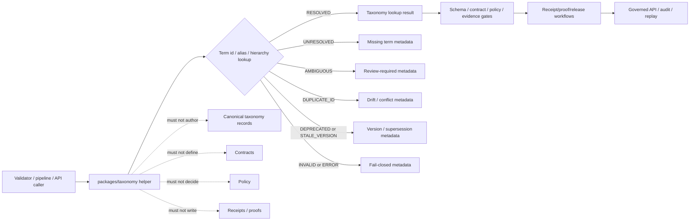

<!-- [KFM_META_BLOCK_V2]
doc_id: kfm://doc/NEEDS-VERIFICATION/packages-taxonomy-readme
title: Taxonomy Package README
type: readme
version: v1
status: draft
owners: OWNER_TBD
created: NEEDS VERIFICATION — target file existed before this repair but contained only placeholder text
updated: 2026-06-15
policy_label: public
related: [packages/README.md, packages/identity/README.md, packages/schema-registry/README.md, packages/envelopes/README.md, docs/doctrine/directory-rules.md, docs/registers/DOMAIN_LANE.md, contracts/, schemas/contracts/v1/, policy/, data/registry/, data/receipts/, data/proofs/, release/]
tags: [kfm, packages, taxonomy, controlled-vocabulary, classification, ontology, thesaurus, domain-lane, aliases]
notes: ["README-like package entrypoint for taxonomy helper code.", "This package may contain helpers for controlled vocabulary lookup, classification ids, alias resolution, hierarchy traversal, crosswalk candidates, and taxonomy validation.", "It must not own canonical taxonomy records, schemas, contracts, source registries, policy rules, lifecycle data, receipts, proofs, release decisions, API routes, UI surfaces, or AI truth claims."]
[/KFM_META_BLOCK_V2] -->

<a id="top"></a>

# Taxonomy Package

Shared helper-code package for KFM taxonomy and controlled-vocabulary primitives: class ids, labels, aliases, hierarchy traversal, crosswalk candidates, and deterministic taxonomy validation helpers.

<p>
  
  
  
  
</p>

> [!IMPORTANT]
> **Status:** PROPOSED package README  
> **Path:** `packages/taxonomy/README.md`  
> **Owning responsibility root:** `packages/` — shared reusable implementation libraries  
> **Package purpose:** taxonomy lookup, classification helper, alias/crosswalk helper, and validation-adapter support  
> **Canonical taxonomy authority:** repo-confirmed registry/taxonomy home, not this package  
> **Schema authority:** `schemas/contracts/v1/`, not this package  
> **Contract authority:** `contracts/`, not this package  
> **Policy authority:** `policy/`, not this package  
> **Receipt/proof authority:** `data/receipts/` and `data/proofs/`, not this package  
> **Release authority:** `release/`, not this package  
> **Repo implementation depth:** UNKNOWN for package metadata, import style, source files, tests, CI workflows, canonical taxonomy record homes, validation reports, and runtime behavior.

## Scope

`packages/taxonomy/` is the shared implementation package lane for taxonomy helper code used by validators, pipelines, governed APIs, catalog/triplet builders, map-layer assemblers, search/facet builders, evidence payload assemblers, release gates, and tests.

This package may contain deterministic utilities for:

- loading taxonomy snapshots from explicit repo-confirmed registry roots in read-only mode;
- resolving class ids, labels, slugs, aliases, synonyms, broader/narrower relationships, and deprecated terms;
- checking whether a supplied class id is admitted for a domain, layer, object family, source family, policy class, or UI facet;
- producing deterministic classification helper results without inventing domain truth;
- building crosswalk candidates between controlled vocabularies when both sides are supplied by governed inputs;
- preserving taxonomy version, taxonomy ref, class id, parent id, source vocabulary ref, source role, confidence/status, review state, content hash, and release ref;
- detecting missing terms, duplicate ids, stale versions, conflicting aliases, untrusted roots, and deprecated terms;
- supporting synthetic no-network fixtures for valid, missing, duplicate, stale, deprecated, ambiguous, and crosswalk-drift paths.

This package must not author canonical taxonomy records, create domain authority, decide policy, infer truth from labels, store lifecycle data, write receipts or proofs, approve release, expose public routes, render UI, fetch source data, or generate claims.

```text
RAW -> WORK / QUARANTINE -> PROCESSED -> CATALOG / TRIPLET -> PUBLISHED
```

Taxonomy helpers may normalize and validate classification references during governed workflows. They do not own lifecycle state, source authority, semantic meaning, policy decisions, receipt state, proof state, release state, or public truth.

[⬆ Back to top](#top)

---

## Repo fit

```text
packages/taxonomy/
```

This path is appropriate for reusable taxonomy helper code because `packages/` is the responsibility root for shared libraries used by apps, workers, pipelines, and tools.

| Relationship | Expected home | Boundary rule |
| --- | --- | --- |
| Taxonomy helper code | `packages/taxonomy/` | Lookup, alias, traversal, crosswalk, and validation helpers only. |
| Canonical taxonomy records | repo-confirmed taxonomy/registry home | Owns admitted term records, versions, aliases, deprecations, and release state. |
| Domain lane registers | `docs/registers/` or repo-confirmed register roots | Own domain-lane decisions and governance notes. |
| Source registries | `data/registry/` or repo-confirmed source registry homes | Own source authority, rights, cadence, and limitations. |
| JSON Schemas | `schemas/contracts/v1/` | Define machine shape for taxonomy records and refs. |
| Semantic contracts | `contracts/` | Define meaning and normative behavior. |
| Policy rules | `policy/` | Own sensitivity, publication, rights, and access decisions. |
| Identity helpers | `packages/identity/` | Handle deterministic ids and ref grammar. |
| Schema-registry helpers | `packages/schema-registry/` | Resolve schema ids and schema refs. |
| Runtime envelopes | `packages/envelopes/` | Map helper outcomes into finite governed response envelopes. |
| Lifecycle data | `data/<phase>/` | Own RAW/WORK/QUARANTINE/PROCESSED/CATALOG/TRIPLET/PUBLISHED state. |
| Receipts and proofs | `data/receipts/`, `data/proofs/` | Store validation receipts and proof artifacts. |
| Release decisions | `release/` | Own promotion, publication, correction, rollback, and supersession. |
| Public API and UI | `apps/`, `ui/`, `web/`, or repo-confirmed equivalents | Consume governed taxonomy status; package internals are not public authority. |

> [!WARNING]
> A taxonomy helper package is not a taxonomy authority root. It may load and validate taxonomy records from admitted roots, but it must not create a parallel canonical taxonomy tree.

[⬆ Back to top](#top)

---

## Accepted inputs

Package helpers should accept explicit values from governed callers. They should not fetch missing facts from source systems, raw stores, hidden globals, UI state, operator memory, or generated language.

| Input family | Accepted examples | Required handling |
| --- | --- | --- |
| Taxonomy location | admitted taxonomy root, explicit vocabulary file, package resource root | Read only from supplied/repo-confirmed roots. |
| Term identity | class id, slug, label, alias, version, status, deprecation ref | Resolve deterministically and detect conflicts. |
| Hierarchy context | parent id, broader/narrower relation, path, depth, domain lane | Traverse without inventing missing parents. |
| Crosswalk context | source vocabulary ref, target vocabulary ref, mapping method, review state | Produce candidate mappings only. |
| Validation context | object family, domain, layer, source role, policy class, schema ref | Return validation-ready helper results. |
| Hash/context refs | taxonomy hash, term hash, index hash, release ref, rollback ref | Preserve refs; delegate hashing where applicable. |
| Fixture context | synthetic valid/missing/duplicate/stale/deprecated/ambiguous examples | Keep fixtures deterministic and public-safe. |

[⬆ Back to top](#top)

---

## Exclusions

| Do not put here | Correct home or owner | Reason |
| --- | --- | --- |
| Canonical taxonomy datasets or registers | repo-confirmed taxonomy/registry home | Taxonomy authority needs review, provenance, and release state. |
| JSON Schemas | `schemas/contracts/v1/` | Schemas own machine shape. |
| Semantic contract documents | `contracts/` | Contracts define meaning. |
| Policy rules | `policy/` | Policy owns decisions and obligations. |
| Source descriptors and source registries | `data/registry/` or repo-confirmed registry homes | Source authority is not taxonomy helper authority. |
| RAW, WORK, QUARANTINE, PROCESSED, CATALOG, TRIPLET, or PUBLISHED data | `data/<phase>/` | Lifecycle state must remain phase-visible. |
| Receipts, proof packs, validation reports | `data/receipts/`, `data/proofs/` | Trust artifacts must remain separately auditable. |
| Release manifests, rollback cards, correction notices | `release/` | Publication is a governed state transition. |
| Public API routes or serializers | `apps/` or repo-confirmed API app | Public clients must use governed APIs. |
| UI components, dashboards, controls | `apps/`, `ui/`, `web/`, or observability roots | Presentation is downstream from governed validation status. |
| AI-generated classifications as canonical truth | governed AI runtime plus evidence/review validation | Generated taxonomy suggestions require review before authority use. |
| Real sensitive examples in fixtures | Nowhere in package fixtures | Fixtures must remain synthetic or public-safe. |

[⬆ Back to top](#top)

---

## Taxonomy helper responsibilities

| Responsibility | Expected behavior |
| --- | --- |
| Resolve terms | Resolve class ids, slugs, labels, aliases, and versions from explicit taxonomy inputs. |
| Traverse hierarchy | Provide broader/narrower/path helpers without inventing missing relationships. |
| Detect conflicts | Detect duplicate ids, conflicting aliases, stale versions, deprecated terms, and untrusted roots. |
| Validate refs | Check that object/layer/source/policy refs use admitted classes. |
| Preserve provenance | Carry taxonomy ref, term id, vocabulary ref, version, status, review state, hash, and release metadata. |
| Support crosswalks | Build candidate mappings from explicit inputs without asserting equivalence as truth. |
| Fail closed | Missing, ambiguous, stale, or untrusted taxonomy refs must not become implicit allow. |
| Fixture support | Generate synthetic no-network fixtures for lookup and validation-path tests. |

[⬆ Back to top](#top)

---

## Expected package layout

> [!NOTE]
> The tree below is PROPOSED. Confirm package metadata, language conventions, import namespace, test layout, and CI before committing code beyond README files.

```text
packages/taxonomy/
├── README.md                       # This file: package boundary and trust rules
├── pyproject.toml / package.json    # NEEDS VERIFICATION
├── src/                             # NEEDS VERIFICATION
│   └── taxonomy/                    # PROPOSED namespace; confirm against repo convention
│       ├── README.md                # PROPOSED namespace guide
│       ├── __init__.py              # PROPOSED export boundary
│       ├── terms.py                 # PROPOSED term identity helpers
│       ├── registry.py              # PROPOSED taxonomy snapshot/index helpers
│       ├── hierarchy.py             # PROPOSED broader/narrower/path helpers
│       ├── aliases.py               # PROPOSED synonym/alias/deprecation helpers
│       ├── crosswalks.py            # PROPOSED candidate crosswalk helpers
│       ├── validation.py            # PROPOSED taxonomy-ref validation helpers
│       ├── fixtures.py              # PROPOSED synthetic fixtures
│       └── py.typed                 # PROPOSED if typed package convention is confirmed
└── CHANGELOG.md                     # OPTIONAL / NEEDS VERIFICATION
```

Potential imports, subject to package verification:

```python
from taxonomy.registry import TaxonomyRegistry
from taxonomy.terms import normalize_term_id
from taxonomy.validation import validate_taxonomy_ref
```

[⬆ Back to top](#top)

---

## Helper outcomes

| Outcome | Use when | Runtime posture |
| --- | --- | --- |
| `RESOLVED` | Term id/path/alias resolves to one admitted taxonomy term. | Candidate for validation; not proof of truth. |
| `UNRESOLVED` | Term id/path/alias cannot be found. | Fail closed or abstain depending on caller. |
| `AMBIGUOUS` | More than one term or alias could match. | Hold for review; do not pick silently. |
| `DUPLICATE_ID` | More than one term claims the same canonical id. | Block validation/release and require review. |
| `DEPRECATED` | Term exists but is disallowed or superseded. | Return replacement metadata if supplied; do not silently rewrite. |
| `STALE_VERSION` | Taxonomy ref points to a superseded or disallowed version. | Block or hold according to caller policy. |
| `UNTRUSTED_ROOT` | Taxonomy was requested outside admitted roots. | Deny/hold; do not load. |
| `INVALID` | Taxonomy record, ref, or relation fails checks. | Fail closed with validation metadata. |
| `ERROR` | Runtime failure prevents a valid local helper result. | Fail closed with error metadata. |

`RESOLVED` is not proof of truth, contract meaning, policy allow, evidence closure, publication, or release. It only means one term was located for the supplied ref.

[⬆ Back to top](#top)

---

## Trust-boundary flow



[⬆ Back to top](#top)

---

## Development rules

1. Treat this package as a read-only taxonomy lookup/helper layer, not taxonomy authority.
2. Prefer pure functions with explicit taxonomy roots and registry inputs.
3. Preserve taxonomy ref, term id, label, alias, vocabulary ref, version, status, review state, hash, release ref, rollback ref, and validation profile supplied by callers.
4. Do not make network calls from this package unless a future ADR explicitly permits constrained vocabulary fetches.
5. Do not read directly from RAW, WORK, QUARANTINE, unpublished candidates, source systems, source credentials, canonical stores outside admitted taxonomy roots, private keys, or model runtimes.
6. Do not write taxonomy records, lifecycle data, release records, receipts, proofs, policy rules, source registries, catalog records, API responses, or UI components.
7. Do not approve release, decide policy, resolve evidence as truth, define contract meaning, or generate public claims.
8. Do not create schemas, contracts, policy source rules, source registries, pipeline DAGs, API routes, public answers, release decisions, key policies, or connector behavior from this package.
9. Do not store raw provider payloads, secrets, credentials, private source records, sensitive-location examples, living-person identifiers, DNA/genomic context, or unrestricted sensitive context.
10. Return typed finite outcomes instead of implicit taxonomy allow, warning-only duplicate IDs, hidden ambiguity, or silent alias rewrites.
11. Add deterministic tests for every behavior-changing helper and every negative path.
12. Keep fixtures synthetic, sanitized, and public-safe.

[⬆ Back to top](#top)

---

## Validation checklist

- [ ] Confirm `packages/taxonomy/` package metadata and language/runtime convention.
- [ ] Confirm import namespace and whether it is `taxonomy`, `kfm_taxonomy`, or repo-specific.
- [ ] Confirm canonical taxonomy/register home through current repo evidence or ADR.
- [ ] Confirm taxonomy id conventions, versioning rules, alias rules, hierarchy rules, and hash expectations.
- [ ] Confirm relationship with validators, `packages/identity/`, `packages/schema-registry/`, `packages/envelopes/`, receipt/proof homes, and release gates.
- [ ] Confirm tests for `RESOLVED`, `UNRESOLVED`, `AMBIGUOUS`, `DUPLICATE_ID`, `DEPRECATED`, `STALE_VERSION`, `UNTRUSTED_ROOT`, `INVALID`, and `ERROR` paths.
- [ ] Confirm helpers do not write taxonomy records, receipts, proofs, release manifests, catalog records, API responses, credentials, permissions, UI state, or lifecycle data.
- [ ] Confirm helpers do not load taxonomies from ad hoc roots unless an ADR or test fixture explicitly admits them.

Suggested inspection commands:

```bash
find packages/taxonomy -maxdepth 5 -type f | sort
git grep -n "taxonomy\|TaxonomyRegistry\|controlled vocabulary\|thesaurus\|ontology\|alias\|DUPLICATE_ID\|DEPRECATED\|AMBIGUOUS" -- packages docs contracts schemas policy tests fixtures tools apps data release 2>/dev/null || true
git grep -n "from taxonomy\|import taxonomy\|packages/taxonomy" -- . 2>/dev/null || true
```

[⬆ Back to top](#top)

---

## Rollback

Rollback is required if this package:

- becomes a parallel canonical taxonomy home, contract home, policy home, source registry, lifecycle-data, evidence/proof, receipt, release, API, UI, credential, key-management, model-runtime, or source-data authority;
- writes taxonomy records, mutates canonical term IDs, rewrites aliases, emits receipts/proofs, approves release, or publishes artifacts as a helper package;
- lets public clients or normal UI surfaces access RAW, WORK, QUARANTINE, unpublished candidates, source systems, direct model outputs, or unreleased artifacts;
- treats taxonomy resolution as proof of truth, evidence closure, admissibility, public safety, policy allow, or release;
- hides duplicate IDs, taxonomy drift, stale versions, ambiguity, or untrusted roots behind warning-only logs;
- stores secrets, credentials, private source records, real living-person identifiers, DNA/genomic context, or protected-location examples in fixtures.

Rollback target: revert the package README or taxonomy source PR, preserve audit notes, and file any authority drift in `docs/registers/DRIFT_REGISTER.md` or the repo-confirmed drift register.

[⬆ Back to top](#top)

---

## Evidence boundary

| Source | Status | Supports | Limits |
| --- | --- | --- | --- |
| Current target file | CONFIRMED | `packages/taxonomy/README.md` existed and required replacement from placeholder content. | Did not prove package implementation maturity. |
| `packages/README.md` | CONFIRMED repo doc | `packages/` is for shared libraries used by apps, workers, pipelines, and tools. | Does not define taxonomy package behavior. |
| GitHub search for taxonomy terms | CONFIRMED no direct result in this pass | No directly matching taxonomy package docs were found using the searched terms. | Search was not a full repository audit and does not prove absence of taxonomy-related files. |
| Current file-generation pass | CONFIRMED request | User-requested target path and README repair/replacement. | Does not inspect package metadata, tests, CI logs, dashboards, canonical taxonomy homes, deployment posture, or branch protection. |

[⬆ Back to top](#top)
