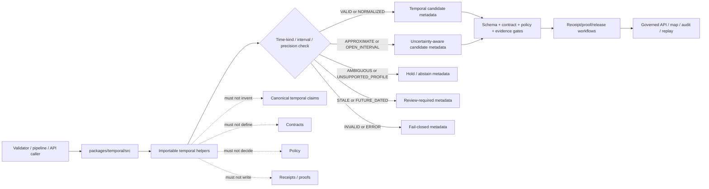

<!-- [KFM_META_BLOCK_V2]
doc_id: kfm://doc/NEEDS-VERIFICATION/packages-temporal-src-readme
title: Temporal Package Source README
type: readme
version: v1
status: draft
owners: OWNER_TBD
created: NEEDS VERIFICATION — target file existed before this repair but contained only placeholder text
updated: 2026-06-15
policy_label: public
related: [packages/temporal/README.md, packages/identity/README.md, packages/hashing/README.md, packages/envelopes/README.md, packages/pipelines-core/README.md, packages/schema-registry/README.md, packages/README.md, docs/doctrine/directory-rules.md, contracts/, schemas/contracts/v1/, policy/, data/receipts/, data/proofs/, release/]
tags: [kfm, packages, temporal, src, time, interval, chronology, six-time-kind, uncertainty, validation]
notes: ["Source-directory guide for temporal helper code.", "This directory may contain source code for KFM six-time-kind temporal primitives, interval normalization, temporal uncertainty, chronology ordering, acceptance checks, replay support, and synthetic fixtures only.", "It must not own canonical temporal claims, source records, schemas, contracts, policy rules, lifecycle data, receipts, proofs, release decisions, API routes, UI surfaces, or AI truth claims."]
[/KFM_META_BLOCK_V2] -->

<a id="top"></a>

# Temporal Package Source

Source-code envelope for KFM temporal helper primitives: six-time-kind carriers, interval normalization, temporal uncertainty, chronology checks, acceptance checks, replay metadata, validation helpers, and synthetic fixtures.

<p>
  
  
  
  
  
</p>

> [!IMPORTANT]
> **Status:** PROPOSED source-directory README  
> **Path:** `packages/temporal/src/README.md`  
> **Owning responsibility root:** `packages/`  
> **Package lane:** `packages/temporal/`  
> **Import/package layout:** NEEDS VERIFICATION  
> **Temporal truth authority:** evidence and admitted records, not this source tree  
> **Schema authority:** `schemas/contracts/v1/`, not this source tree  
> **Contract authority:** `contracts/`, not this source tree  
> **Policy authority:** `policy/`, not this source tree  
> **Receipt/proof authority:** `data/receipts/` and `data/proofs/`, not this source tree  
> **Release authority:** `release/`, not this source tree  
> **Repo implementation depth:** UNKNOWN for package metadata, import style, tests, CI workflows, temporal schemas, validation reports, runtime behavior, and branch protections.

## Scope

`packages/temporal/src/` is the proposed source-code root for the Temporal package.

This directory is for importable helper code used by pipelines, validators, catalog/triplet builders, governed APIs, map/time-slider adapters, evidence payload assemblers, release gates, replay tools, and tests when they need deterministic temporal handling.

This source tree may support helpers for:

- representing KFM time-kind carriers, including event/valid time, observation/record time, source/publication time, processing/run time, review/release time, and correction/rollback time when supplied by contracts;
- parsing and normalizing explicit dates, datetimes, periods, ranges, open intervals, approximate dates, and uncertainty windows;
- validating temporal precision, calendar/profile support, timezone/offset posture, temporal bounds, and interval order;
- checking chronology consistency across source records, evidence bundles, catalog objects, triplets, layer manifests, release candidates, and rollback/correction records;
- preserving temporal provenance such as source timestamp, observed timestamp, acquired timestamp, processed timestamp, reviewed timestamp, released timestamp, corrected timestamp, and rollback target timestamp;
- carrying uncertainty and confidence metadata without pretending approximate dates are exact;
- producing finite validation results for missing, ambiguous, invalid, stale, future-dated, out-of-range, drifted, or unsupported temporal values;
- supporting deterministic replay of temporal normalization and validation results;
- building synthetic no-network fixtures for exact, approximate, interval, open-ended, missing, invalid, stale, and rollback/correction temporal paths.

This source tree must not decide historical truth, invent missing dates, fetch source records, store lifecycle data, write receipts or proofs, approve release, expose public routes, render UI, or generate claims.

```text
RAW -> WORK / QUARANTINE -> PROCESSED -> CATALOG / TRIPLET -> PUBLISHED
```

Temporal helpers may normalize and validate time-bearing candidate records during governed workflows. They do not own lifecycle state, source authority, evidence authority, semantic meaning, policy decisions, receipt state, proof state, release state, or public truth.

[⬆ Back to top](#top)

---

## Repo fit

```text
packages/temporal/src/
```

`packages/` is the responsibility root for shared reusable code. `temporal/` is the package segment. `src/` is the source-code envelope.

| Relationship | Expected home | Boundary rule |
| --- | --- | --- |
| Temporal source code | `packages/temporal/src/` | Time-kind carriers, interval helpers, uncertainty helpers, chronology checks, and validation helpers only. |
| Importable module | `packages/temporal/src/temporal/` or repo-confirmed namespace | Package namespace, subject to repo package convention verification. |
| Package entry README | `packages/temporal/README.md` | Explains the package as a whole. |
| Canonical temporal claims | admitted records plus EvidenceBundle support | Truth comes from evidence and governed lifecycle records, not helpers. |
| JSON Schemas | `schemas/contracts/v1/` | Define machine shape for temporal fields and validation results. |
| Semantic contracts | `contracts/` | Define meaning of time kinds, precision, uncertainty, and acceptance checks. |
| Policy rules | `policy/` | Own publication, sensitivity, rights, and retention decisions. |
| Identity helpers | `packages/identity/` | Handle deterministic ids and refs. |
| Hash helpers | `packages/hashing/` | Compute hashes for replay and drift checks. |
| Runtime envelopes | `packages/envelopes/` | Map helper outcomes into finite governed response envelopes. |
| Lifecycle data | `data/<phase>/` | Own RAW/WORK/QUARANTINE/PROCESSED/CATALOG/TRIPLET/PUBLISHED state. |
| Receipts and proofs | `data/receipts/`, `data/proofs/` | Store validation receipts and proof artifacts. |
| Release decisions | `release/` | Own promotion, publication, correction, rollback, and supersession. |
| Public API and UI | `apps/`, `ui/`, `web/`, or repo-confirmed equivalents | Consume governed temporal status; source internals are not public authority. |

> [!WARNING]
> A source-code directory is not a temporal truth source. It may normalize and validate explicit time values; it must not invent dates, silently coerce uncertainty into exactness, or publish time claims.

[⬆ Back to top](#top)

---

## Accepted inputs

Functions in this source tree should accept explicit values from governed callers. They should not fetch missing facts from source systems, raw stores, hidden globals, UI state, operator memory, or generated language.

| Input family | Accepted examples | Required handling |
| --- | --- | --- |
| Time value | date, datetime, interval, open interval, period, approximate value | Normalize without overstating precision. |
| Time kind | event, valid, observed, recorded, acquired, processed, reviewed, released, corrected, rollback | Preserve supplied kind and contract meaning. |
| Precision | year, month, day, minute, second, unknown, approximate | Keep precision visible. |
| Uncertainty | earliest/latest bounds, confidence, qualifier, source note | Preserve uncertainty; do not collapse to exact date. |
| Source/evidence context | source ref, EvidenceRef, EvidenceBundle ref, citation-validation ref | Preserve refs; do not fabricate evidence. |
| Lifecycle/release context | input phase, release ref, correction ref, rollback ref | Prevent invalid public exposure or stale release use. |
| Hash/replay context | input hash, normalized hash, expected result hash | Preserve refs; delegate hashing where applicable. |
| Fixture context | synthetic exact/approximate/interval/missing/invalid examples | Keep fixtures deterministic and public-safe. |

[⬆ Back to top](#top)

---

## Exclusions

| Do not put here | Correct home or owner | Reason |
| --- | --- | --- |
| Canonical temporal records or claims | lifecycle data and evidence bundles | Temporal helpers do not create truth. |
| JSON Schemas | `schemas/contracts/v1/` | Schemas own machine shape. |
| Semantic contracts | `contracts/` | Contracts define time-kind meaning and acceptance rules. |
| Policy rules | `policy/` | Policy owns publication, rights, sensitivity, retention, and access decisions. |
| Source descriptors and source registries | `data/registry/` or repo-confirmed registry homes | Source authority is not temporal helper authority. |
| RAW, WORK, QUARANTINE, PROCESSED, CATALOG, TRIPLET, or PUBLISHED data | `data/<phase>/` | Lifecycle state must remain phase-visible. |
| Receipts, proof packs, validation reports | `data/receipts/`, `data/proofs/` | Trust artifacts must remain separately auditable. |
| Release manifests, rollback cards, correction notices | `release/` | Publication is a governed state transition. |
| Public API routes, map controls, or time sliders | `apps/`, `ui/`, `web/`, or repo-confirmed app roots | Presentation is downstream from governed temporal status. |
| AI-generated dates or inferred chronology as canonical truth | governed AI runtime plus evidence/review validation | Generated date guesses require evidence and review. |
| Real sensitive examples in fixtures | Nowhere in package fixtures | Fixtures must remain synthetic or public-safe. |

[⬆ Back to top](#top)

---

## Expected source layout

> [!NOTE]
> The tree below is PROPOSED. Confirm package metadata, language conventions, import namespace, test layout, and CI before committing code beyond README files.

```text
packages/temporal/src/
├── README.md                # This file: source-code boundary and trust rules
└── temporal/
    ├── README.md            # PROPOSED: importable namespace guide
    ├── __init__.py          # PROPOSED export boundary
    ├── kinds.py             # PROPOSED time-kind carriers
    ├── intervals.py         # PROPOSED interval and open-range helpers
    ├── precision.py         # PROPOSED temporal precision helpers
    ├── uncertainty.py       # PROPOSED uncertainty and qualifier helpers
    ├── chronology.py        # PROPOSED ordering/consistency checks
    ├── validation.py        # PROPOSED acceptance and validation helpers
    ├── replay.py            # PROPOSED replay/drift helpers
    ├── fixtures.py          # PROPOSED synthetic fixtures
    └── py.typed             # PROPOSED if typed package convention is confirmed
```

Preferred import posture, subject to package verification:

```python
from temporal.intervals import normalize_interval
from temporal.kinds import TimeKind
from temporal.validation import validate_temporal_candidate
```

[⬆ Back to top](#top)

---

## Helper outcomes

| Outcome | Use when | Runtime posture |
| --- | --- | --- |
| `VALID` | Time value and kind are accepted under supplied contract/profile. | Candidate for downstream validation; not proof of truth. |
| `NORMALIZED` | Value was converted to canonical helper representation. | Preserve original value and precision. |
| `APPROXIMATE` | Date/time has uncertainty or coarse precision. | Do not display as exact. |
| `OPEN_INTERVAL` | Range has missing start or end. | Preserve open-bound semantics. |
| `AMBIGUOUS` | Value has multiple possible interpretations. | Hold or abstain; do not choose silently. |
| `STALE` | Temporal ref is superseded, expired, or older than allowed profile. | Hold or deny according to caller policy. |
| `FUTURE_DATED` | Value is later than allowed by the supplied context. | Fail closed or hold for review. |
| `INVALID` | Value, kind, precision, timezone, or interval order fails checks. | Fail closed with validation metadata. |
| `UNSUPPORTED_PROFILE` | Calendar, precision, or format is not supported. | Abstain or hold; do not coerce silently. |
| `DRIFT` | Replay normalization differs from expected result. | Block promotion/release and require review. |
| `ERROR` | Runtime failure prevents valid local helper result. | Fail closed with error metadata. |

`VALID` and `NORMALIZED` are not proof of truth, evidence closure, policy allow, publication, or release. They only mean local temporal helper checks succeeded for supplied values.

[⬆ Back to top](#top)

---

## Trust-boundary flow



[⬆ Back to top](#top)

---

## Source anti-collapse rules

| Boundary | Preserve as | Never collapse into |
| --- | --- | --- |
| Time-kind carrier | Explicit semantic time role | Generic timestamp blob |
| Normalized time | Helper representation | Canonical truth claim |
| Approximate date | Precision and uncertainty | Exact date display |
| Open interval | Open-bound semantics | Fake start/end date |
| Chronology check | Local consistency check | Evidence proof or policy allow |
| Replay result | Deterministic comparison | Release approval |
| Fixture time | Synthetic test example | Real sensitive record |

[⬆ Back to top](#top)

---

## Development rules

1. Prefer pure functions with explicit input objects.
2. Preserve original value, normalized value, time kind, precision, timezone/offset posture, uncertainty bounds, source/evidence refs, hash refs, release refs, rollback refs, and validation profile supplied by callers.
3. Do not make network calls from `src` helpers.
4. Do not read directly from RAW, WORK, QUARANTINE, unpublished candidates, source systems, source credentials, canonical stores, private keys, or model runtimes.
5. Do not write lifecycle data, temporal claims, release records, receipts, proofs, policy rules, source registries, catalog records, API responses, UI components, or map controls.
6. Do not approve release, decide policy, resolve evidence as truth, define contract meaning, infer missing dates as fact, or generate public claims.
7. Do not create schemas, contracts, policy source rules, source registries, pipeline DAGs, API routes, public answers, release decisions, key policies, or connector behavior from this source tree.
8. Do not store raw provider payloads, secrets, credentials, private source records, sensitive-location examples, living-person identifiers, DNA/genomic context, or unrestricted sensitive context.
9. Return typed finite outcomes instead of implicit temporal allow, warning-only ambiguity, hidden precision loss, or silent exact-date coercion.
10. Add deterministic tests for every behavior-changing helper and every negative path.
11. Keep fixtures synthetic, sanitized, and public-safe.

[⬆ Back to top](#top)

---

## Validation checklist

- [ ] Confirm `packages/temporal/src/` exists in the mounted repo with this README as its source-directory guide.
- [ ] Confirm package manager and import convention (`pyproject.toml`, package.json, workspace config, or equivalent).
- [ ] Confirm whether this source tree is Python-only, TypeScript-only, or mixed-language.
- [ ] Confirm import namespace and whether it is `temporal`, `kfm_temporal`, or repo-specific.
- [ ] Confirm owners and CODEOWNERS path coverage.
- [ ] Confirm six-time-kind names and semantics from current contracts/doctrine.
- [ ] Confirm schema homes for temporal values, precision, uncertainty, validation results, release/correction time refs, and replay expectations.
- [ ] Confirm relationship with `packages/identity/`, `packages/hashing/`, `packages/envelopes/`, `packages/pipelines-core/`, receipt/proof homes, and release gates.
- [ ] Confirm tests for `VALID`, `NORMALIZED`, `APPROXIMATE`, `OPEN_INTERVAL`, `AMBIGUOUS`, `STALE`, `FUTURE_DATED`, `INVALID`, `UNSUPPORTED_PROFILE`, `DRIFT`, and `ERROR` paths.
- [ ] Confirm helpers do not invent missing dates, discard precision, or coerce uncertain dates into exact values.
- [ ] Confirm helpers do not write lifecycle data, receipts, proofs, release manifests, catalog records, API responses, credentials, permissions, UI state, or temporal claims.

Suggested inspection commands:

```bash
find packages/temporal/src -maxdepth 5 -type f | sort
git grep -n "six-time\|TimeKind\|valid_time\|event_time\|observed_time\|recorded_time\|released_time\|rollback_time\|APPROXIMATE\|OPEN_INTERVAL\|FUTURE_DATED" -- packages docs contracts schemas policy tests fixtures tools apps data release 2>/dev/null || true
git grep -n "from temporal\|import temporal\|packages/temporal/src" -- . 2>/dev/null || true
```

[⬆ Back to top](#top)

---

## Rollback

Rollback is required if this source tree:

- creates a parallel authority home for temporal claims, canonical records, contracts, schemas, policy, registries, lifecycle data, receipts, proofs, releases, API routes, UI surfaces, credentials, key-management, model runtimes, or source data;
- writes temporal claims, mutates source timestamps, silently coerces approximate dates into exact dates, emits receipts/proofs, approves release, or publishes artifacts as a source helper;
- lets public clients or normal UI surfaces access RAW, WORK, QUARANTINE, unpublished candidates, source systems, direct model outputs, or unreleased artifacts;
- treats temporal normalization as proof of truth, evidence closure, admissibility, public safety, policy allow, or release;
- hides ambiguity, stale dates, future dates, invalid intervals, unsupported calendars/profiles, or replay drift behind warning-only logs;
- stores secrets, credentials, private source records, real living-person identifiers, DNA/genomic context, or protected-location examples in fixtures.

Rollback target: revert the temporal-source PR, keep any generated audit notes as review evidence, and file the affected behavior in `docs/registers/DRIFT_REGISTER.md` or `docs/registers/VERIFICATION_BACKLOG.md` if the mounted repo uses those registers.

[⬆ Back to top](#top)

---

## Evidence boundary

| Source | Status | Supports | Limits |
| --- | --- | --- | --- |
| Current target file | CONFIRMED | `packages/temporal/src/README.md` existed and required replacement from placeholder content. | Did not prove source implementation maturity. |
| Parent package README | CONFIRMED repo doc | `packages/temporal/` is intended for a six-time-kind temporal model and acceptance checks. | Parent file is still a short stub and does not prove implementation details. |
| `packages/README.md` | CONFIRMED repo doc | `packages/` is for shared libraries used by apps, workers, pipelines, and tools. | Does not define temporal package behavior. |
| GitHub search for temporal terms | CONFIRMED no direct result in this pass | No directly matching temporal implementation docs were found using the searched terms. | Search was not a full repository audit and does not prove absence of temporal-related files. |
| Current file-generation pass | CONFIRMED request | User-requested target path and README repair/replacement. | Does not inspect package metadata, tests, CI logs, dashboards, temporal contracts, deployment posture, runtime behavior, or branch protection. |

[⬆ Back to top](#top)
