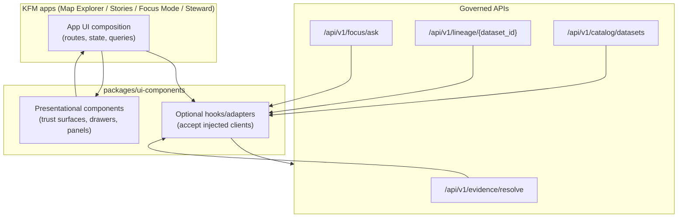

<!-- [KFM_META_BLOCK_V2]
doc_id: kfm://doc/7a24a6a9-1f6a-4c48-85ae-1d12d2d93b4a
title: KFM UI Components
type: standard
version: v1
status: draft
owners: KFM UI Maintainers
created: 2026-02-22
updated: 2026-02-22
policy_label: public
related:
  - kfm://doc/kfm-gdg-vnext
  - kfm://doc/kfm-integration-idea-pack
tags: [kfm, ui, components, governance, evidence-first, map-first, time-aware]
notes:
  - This README is a scaffold. Update “Package layout” and “Exports” to match repo reality once code lands.
[/KFM_META_BLOCK_V2] -->

# KFM UI Components
Governed, evidence-first UI building blocks shared across KFM map/story/focus experiences.


---

## Quick navigation
- [What this package is](#what-this-package-is)
- [Non-negotiable invariants](#non-negotiable-invariants)
- [Architecture boundary](#architecture-boundary)
- [Package layout](#package-layout)
- [Component catalog](#component-catalog)
- [Evidence bundle contract](#evidence-bundle-contract)
- [Security and accessibility guardrails](#security-and-accessibility-guardrails)
- [Usage patterns](#usage-patterns)
- [Contributing](#contributing)

---

## What this package is

`packages/ui-components` is the shared UI toolkit for Kansas Frontier Matrix (KFM). It provides **reusable, policy-aware components** that make governance and provenance **visible at the point of interaction** (map layers, story claims, Focus Mode answers).

This package is intended to be:

- **Map-first & time-aware**: components support a “view state” that includes camera/bbox, active layers, time window, and filters.
- **Governed by construction**: components render what governed APIs return; they do not embed privileged credentials.
- **Evidence-first**: citations resolve to evidence bundles and are inspectable through an evidence drawer/panel.
- **Fail-closed** on untrusted/invalid inputs (especially for receipts/manifests and signed artifacts).

> **Scope note:** This README describes the *design contract* for `ui-components`. Update the “Exports” and “Package layout” sections to reflect what is actually present in the repo.

[Back to top](#kfm-ui-components)

---

## Non-negotiable invariants

These are KFM UI invariants this package must uphold:

1. **The frontend is a governed client**
   - Renders what the API returns.
   - Does **not** embed privileged credentials or bypass policy.

2. **Trust surfaces are required**
   - Show **dataset version**, **freshness**, **license/attribution**, and **policy badges**.
   - Provide one-click access to **evidence** and **provenance** from map layers, story claims, and Focus Mode citations.

3. **Map state is a reproducible artifact**
   - View state (camera + layers + time window + filters) is first-class and can be stored/replayed (e.g., in Story Nodes).

4. **Publishing is blocked if citations don’t resolve**
   - “Story publish” workflows must fail if evidence resolution fails.

[Back to top](#kfm-ui-components)

---

## Architecture boundary

UI components must **not** become a second API client that “just fetches what it needs.” The trust membrane requires **all data access** to flow through governed APIs.

### Layering



### Practical implication

- Components should accept **data and callbacks** (e.g., `onResolveEvidence(ref)`) rather than “knowing how” to fetch.
- If hooks are included, they must require an injected, governed client (e.g., `evidenceClient`) and remain testable/mocked.

[Back to top](#kfm-ui-components)

---

## Package layout

> **Current layout:** *(unknown — update once code exists)*  
> **Recommended default layout:** *(scaffold; adjust to match repo conventions)*

```
packages/ui-components/
├─ README.md
├─ package.json
├─ src/
│  ├─ index.ts
│  ├─ map/
│  │  ├─ MapCanvas/
│  │  ├─ LayerPanel/
│  │  ├─ TimeControl/
│  │  └─ FeatureInspectPanel/
│  ├─ evidence/
│  │  ├─ EvidenceDrawer/
│  │  ├─ ReceiptViewer/
│  │  └─ ProvenancePanel/
│  ├─ story/
│  │  ├─ StoryNodeList/
│  │  └─ StoryNodeReader/
│  ├─ focus/
│  │  ├─ ChatPanel/
│  │  ├─ EvidenceSnippets/
│  │  ├─ PolicyNotice/
│  │  └─ ExportAnswer/
│  ├─ steward/
│  │  ├─ PromotionQueue/
│  │  ├─ QAReportViewer/
│  │  └─ StoryReviewQueue/
│  └─ primitives/
│     ├─ Badge/
│     ├─ Card/
│     ├─ Table/
│     ├─ JsonViewer/
│     └─ SafeMarkdown/
└─ tests/
   ├─ unit/
   └─ fixtures/
```

[Back to top](#kfm-ui-components)

---

## Component catalog

> **Legend**
> - **REQ** = required trust surface / baseline KFM UX contract
> - **OPT** = optional / depends on product scope
> - **TBD** = implementation status unknown; update as components land

### Shared evidence & trust surfaces (highest priority)

| Component | Priority | Purpose | Notes |
|---|---:|---|---|
| `EvidenceDrawer` | REQ | Evidence bundle viewer used everywhere (Map/Story/Focus) | Must show policy decision + obligations + license + provenance + validation |
| `ProvenancePanel` | REQ | Run receipts + lineage links | Redact sensitive fields when policy requires |
| `PolicyBadge` | REQ | Policy label display (public/restricted/etc.) | Must not rely on color alone |
| `StatusPill` | REQ | Valid/Invalid, Verified/Unverified, Healthy/Degraded | Use text labels + icons (a11y) |
| `ReceiptViewer` | REQ | Safe, read-only rendering of run receipts/manifests | Validate schema + verify signature + fail-closed |
| `JsonViewer` | OPT | Collapsible JSON view | Default collapsed; avoid huge DOM |

### Map Explorer

| Component | Priority | Purpose | Notes |
|---|---:|---|---|
| `MapCanvas` | REQ | Map viewport wrapper | Must support reproducible view state |
| `LayerPanel` | REQ | Layer toggles + opacity + legend + policy badge + dataset version | Keyboard navigable |
| `TimeControl` | REQ | Time window slider/range; optional histogram | “Time-aware” surface |
| `FeatureInspectPanel` | REQ | Feature attributes + citations/evidence refs | Links open evidence drawer |
| `SearchBar` | OPT | Places/datasets/story nodes search | Keep policy-safe |

### Story Mode

| Component | Priority | Purpose | Notes |
|---|---:|---|---|
| `StoryNodeList` | REQ | Browse story nodes | |
| `StoryNodeReader` | REQ | Render narrative + citation hooks | Safe markdown rendering (sanitized) |

### Focus Mode

| Component | Priority | Purpose | Notes |
|---|---:|---|---|
| `ChatPanel` | REQ | Q&A interaction UI | |
| `EvidenceSnippets` | REQ | Inline citation rendering | Citations open EvidenceDrawer |
| `PolicyNotice` | REQ | Why some info is withheld | Must be explicit, user-facing |
| `ExportAnswer` | OPT | Downloadable report with citations + audit_ref | Export must preserve citations |

### Admin / Steward tools (restricted)

| Component | Priority | Purpose | Notes |
|---|---:|---|---|
| `PromotionQueue` | OPT | Dataset versions pending approval | Only for steward roles |
| `QAReportViewer` | OPT | QA and validation reports | |
| `StoryReviewQueue` | OPT | Story review gate UI | Enforces citation resolution |

[Back to top](#kfm-ui-components)

---

## Evidence bundle contract

The evidence drawer is driven by an **EvidenceBundle** returned by the Evidence Resolver API.

### Minimal fields to render (REQ)

- Evidence bundle **ID + digest**
- **DatasetVersion ID** + dataset name/title
- **License** + attribution text
- **Freshness** (e.g., last run timestamp) + validation status
- **Provenance chain** (run receipt link)
- **Artifact links** *(only if policy allows)*
- **Redactions applied** (policy obligations)

### Example shape (illustrative)

```json
{
  "bundle_id": "sha256:bundle...",
  "dataset_version_id": "2026-02.abcd1234",
  "title": "Storm event record: 2026-02-19",
  "policy": {
    "decision": "allow",
    "policy_label": "public",
    "obligations_applied": []
  },
  "license": { "spdx": "CC-BY-4.0", "attribution": "Source org" },
  "provenance": { "run_id": "kfm://run/2026-02-20T12:00:00Z.abcd" },
  "artifacts": [
    {
      "href": "processed/events.parquet",
      "digest": "sha256:2222",
      "media_type": "application/x-parquet"
    }
  ],
  "checks": { "catalog_valid": true, "links_ok": true },
  "audit_ref": "kfm://audit/entry/123"
}
```

[Back to top](#kfm-ui-components)

---

## Security and accessibility guardrails

### Security (REQ)

- **Validate first**: do not render or compute derived views from unvalidated receipt/manifest data.
- **Verify signatures** (where applicable). If verification fails: **fail-closed**.
- **No `dangerouslySetInnerHTML`**. If trusted HTML is unavoidable, sanitize (e.g., DOMPurify) and restrict allowed tags/attrs.
- **External links** must use `target="_blank"` + `rel="noopener noreferrer"` and be allow-listed where feasible.

### Accessibility (REQ)

- Keyboard navigable: layer controls, drawers, tabs.
- Visible focus states.
- Text labels for policy/status indicators (no color-only meaning).
- ARIA labels for map controls.
- Safe markdown rendering for narratives.
- Export outputs include citations and audit_ref in readable form.

[Back to top](#kfm-ui-components)

---

## Usage patterns

> The examples below are intentionally **adapter-based**: apps inject clients and callbacks; components render results.

### 1) Map feature click → resolve evidence → open drawer

```ts
// Pseudo-code / pattern (adapt to your app framework)

function onFeatureSelected(feature) {
  // feature carries EvidenceRef(s) or a dataset_version_id + selector
  openEvidenceDrawer({
    evidenceRef: feature.evidenceRef,
    context: {
      viewState,          // bbox/zoom + layers + time window + filters
      featureId: feature.id,
    },
  });
}
```

### 2) EvidenceDrawer rendering contract

```ts
type EvidenceDrawerProps = {
  open: boolean;
  evidenceRef: string; // or structured EvidenceRef
  resolveEvidence: (ref: string) => Promise<EvidenceBundle>; // injected adapter
  onClose: () => void;
};
```

### 3) ReceiptViewer (proposed minimal API)

```ts
type ReceiptViewerProps = {
  schema: object;        // JSON Schema (AJV-compatible)
  data: unknown;         // raw receipt/manifest
  onAction?: (type: string, payload?: unknown) => void;
  compact?: boolean;     // for PR previews
};
```

[Back to top](#kfm-ui-components)

---

## Contributing

### Adding a new component: checklist (fail-closed)

- [ ] Component has a **single responsibility** and a clear trust-surface purpose.
- [ ] **Policy + provenance** are visible where required (badge, notice, drawer link).
- [ ] No direct network access unless via injected governed client.
- [ ] Security: no unsafe HTML rendering; validate before render; safe link handling.
- [ ] A11y: keyboard navigation, focus states, ARIA labels where relevant.
- [ ] Tests:
  - [ ] unit tests for edge cases (invalid data → fail closed)
  - [ ] fixtures for restricted vs public scenarios
- [ ] A minimal usage example is included (in this README or component README).
- [ ] If using Storybook (recommended), add a story for:
  - [ ] “Happy path”
  - [ ] “Policy restricted / redacted”
  - [ ] “Invalid / unverified (fail closed)”

[Back to top](#kfm-ui-components)
