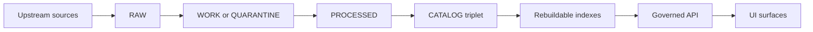
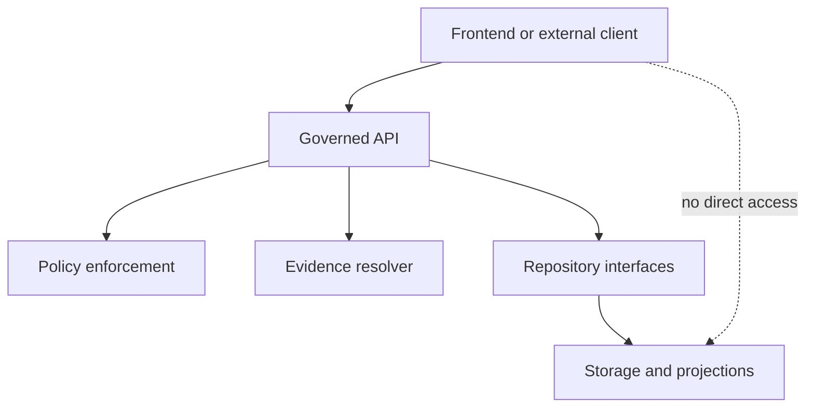
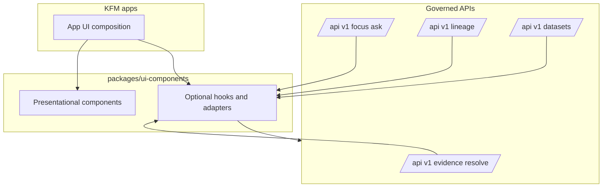

<!-- [KFM_META_BLOCK_V2]
doc_id: kfm://doc/7a24a6a9-1f6a-4c48-85ae-1d12d2d93b4a
title: KFM UI Components
type: standard
version: v1
status: draft
owners: KFM UI Maintainers
created: 2026-02-22
updated: 2026-02-26
policy_label: public
related:
  - kfm://doc/kfm-gdg-vnext
  - kfm://doc/kfm-integration-idea-pack
tags: [kfm, ui, components, governance, evidence-first, map-first, time-aware, trust-membrane, cite-or-abstain]
notes:
  - This README is the design contract for packages/ui-components.
  - Sections explicitly marked UNKNOWN must be updated to match repo reality once code lands.
[/KFM_META_BLOCK_V2] -->

# KFM UI Components
Governed, evidence-first UI building blocks shared across KFM Map/Story/Focus surfaces.


---

## Quick navigation
- [Truth discipline](#truth-discipline)
- [What this package is](#what-this-package-is)
- [Where it fits](#where-it-fits)
- [Non-negotiable invariants](#non-negotiable-invariants)
- [Contracts this package assumes](#contracts-this-package-assumes)
- [Architecture boundary](#architecture-boundary)
- [Package layout](#package-layout)
- [Exports](#exports)
- [Component catalog](#component-catalog)
- [Policy labels and obligations UX](#policy-labels-and-obligations-ux)
- [Security, privacy, and safety guardrails](#security-privacy-and-safety-guardrails)
- [Accessibility guardrails](#accessibility-guardrails)
- [Testing and CI gates](#testing-and-ci-gates)
- [Usage patterns](#usage-patterns)
- [Contributing](#contributing)

---

## Truth discipline

This README uses the same posture as KFM design docs:

- **CONFIRMED** = invariants/contracts required by KFM governance posture.
- **PROPOSED** = recommended defaults that can be changed later, but must stay testable.
- **UNKNOWN** = requires repository verification; do not treat as fact until confirmed.

> NOTE: This package is UI-only. It **surfaces** policy and evidence, but **does not decide** policy.

[Back to top](#kfm-ui-components)

---

## What this package is

`packages/ui-components` is the shared UI toolkit for Kansas Frontier Matrix (KFM). It provides **reusable, policy-aware components** that make governance and provenance **visible at the point of interaction** (map layers, story claims, Focus Mode answers).

This package is intended to be:

- **Map-first & time-aware**: components support a first-class `ViewState` (camera/bbox, active layers, time window, filters).
- **Governed by construction**: components render what governed APIs return; they do **not** embed privileged credentials or bypass policy.
- **Evidence-first**: citations resolve to evidence bundles and are inspectable through an evidence drawer/panel.
- **Fail-closed** on untrusted/invalid inputs (especially for receipts/manifests and signed artifacts).

[Back to top](#kfm-ui-components)

---

## Where it fits

KFM has a “truth path” lifecycle and a “trust membrane” boundary. UI components sit **after** governed APIs.

### Truth path (CONFIRMED)



### Trust membrane (CONFIRMED)



**Implication:** UI components never talk directly to databases, object stores, tile buckets, or raw artifacts. They only render **governed responses** and surface the trust metadata.

[Back to top](#kfm-ui-components)

---

## Non-negotiable invariants

These are KFM UI invariants this package must uphold.

### Invariants (CONFIRMED)
1. **Frontend is a governed client**
   - Renders what the API returns.
   - Does **not** embed privileged credentials or bypass policy.

2. **Trust surfaces are required**
   - Show **dataset version**, **freshness**, **license/rights**, and **policy badges**.
   - Provide one-click access to **evidence** and **provenance** from map layers, story claims, and Focus Mode citations.

3. **Map state is a reproducible artifact**
   - View state (camera + layers + time window + filters) is first-class and can be stored/replayed (e.g., in Story Nodes).

4. **Publishing is blocked if citations don’t resolve**
   - “Story publish” workflows must fail if evidence resolution fails.

### Guardrails (CONFIRMED posture; details PROPOSED)
- **Default deny posture** for restricted / sensitive-location datasets.
- **Generalized public derivatives** (e.g., `public_generalized`) are the correct public surface when precise geometry is restricted.
- **No leakage**: avoid revealing restricted metadata in UI, error surfaces, or URL patterns.

[Back to top](#kfm-ui-components)

---

## Contracts this package assumes

> Source-of-truth for contracts should be the governed API OpenAPI schemas + JSON Schemas. This README summarizes the UI-facing parts.

### EvidenceRef (CONFIRMED concept)
Evidence is referenced by scheme, not by guessing.

Examples:
- `dcat://…`
- `stac://…`
- `prov://…`
- `doc://…`
- `graph://…`

### EvidenceBundle (CONFIRMED concept; exact DTO shape PROPOSED by OpenAPI)
An **EvidenceBundle** is the resolved evidence view returned by the evidence resolver. It contains:
- Human-readable cards suitable for rendering
- Machine-readable metadata suitable for export/audit
- Policy decision result: **allow/deny** + **obligations**
- Stable IDs + bundle digest (for caching and reproducibility)

### Policy decision & obligations (CONFIRMED concept)
Obligations are UI-visible actions like:
- show notice (“Geometry generalized due to policy.”)
- hide artifacts/download links
- redact specific fields

### Error model (PROPOSED contract)
Errors should carry an `audit_ref` so failures are traceable without leaking restricted details.

[Back to top](#kfm-ui-components)

---

## Architecture boundary

UI components must **not** become a second API client that “just fetches what it needs.” The trust membrane requires **all data access** to flow through governed APIs.

### Layering



### Practical implication (CONFIRMED posture)

- Components accept **data and callbacks** (e.g., `onResolveEvidence(ref)`) rather than “knowing how” to fetch.
- If hooks exist, they must require an injected, governed client and remain fully mockable in tests.
- UI renders **policy badges/notices**, but does **not** evaluate policy.

[Back to top](#kfm-ui-components)

---

## Package layout

> **Current layout:** **UNKNOWN** — update once code exists.  
> **Recommended default layout:** **PROPOSED scaffold** (adjust to match repo conventions).

```
packages/ui-components/
├─ README.md
├─ package.json
├─ src/
│  ├─ index.ts
│  ├─ contracts/               # TS types derived from OpenAPI/JSON Schema (recommended)
│  ├─ map/
│  │  ├─ MapCanvas/
│  │  ├─ LayerPanel/
│  │  ├─ TimeControl/
│  │  └─ FeatureInspectPanel/
│  ├─ evidence/
│  │  ├─ EvidenceDrawer/
│  │  ├─ ReceiptViewer/
│  │  └─ ProvenancePanel/
│  ├─ story/
│  │  ├─ StoryNodeList/
│  │  └─ StoryNodeReader/
│  ├─ focus/
│  │  ├─ ChatPanel/
│  │  ├─ EvidenceSnippets/
│  │  ├─ PolicyNotice/
│  │  └─ ExportAnswer/
│  ├─ steward/
│  │  ├─ PromotionQueue/
│  │  ├─ QAReportViewer/
│  │  └─ StoryReviewQueue/
│  └─ primitives/
│     ├─ Badge/
│     ├─ Card/
│     ├─ Table/
│     ├─ JsonViewer/
│     └─ SafeMarkdown/
└─ tests/
   ├─ unit/
   ├─ a11y/
   └─ fixtures/
```

### Verification checklist (UNKNOWN until repo is present)
- [ ] Confirm actual entrypoint(s): `src/index.ts` vs other bundler conventions
- [ ] Confirm whether Storybook exists and where stories live
- [ ] Confirm test stack (unit + a11y + e2e harness) and update this doc accordingly
- [ ] Confirm whether “steward” components ship in this package or live in a restricted package

[Back to top](#kfm-ui-components)

---

## Exports

> **Exports:** **UNKNOWN** — update once code exists.

### Proposed export surface (PROPOSED)
- `@kfm/ui-components/evidence`
- `@kfm/ui-components/map`
- `@kfm/ui-components/story`
- `@kfm/ui-components/focus`
- `@kfm/ui-components/primitives`

Rules:
- Avoid deep imports into internal folders (stable exports only).
- Export component props types so apps can compose reliably.

[Back to top](#kfm-ui-components)

---

## Component catalog

> **Legend**
> - **REQ** = required trust surface / baseline KFM UX contract
> - **OPT** = optional / depends on product scope
> - **TBD** = implementation status UNKNOWN; update as components land

### Shared evidence & trust surfaces (highest priority)

| Component | Priority | Purpose | Notes |
|---|---:|---|---|
| `EvidenceDrawer` | REQ | Primary trust surface: evidence bundle viewer | Must show dataset version, policy decision/obligations, license/rights, provenance chain, checksums, and artifacts (only if allowed) |
| `ProvenancePanel` | REQ | Run receipts + lineage links | Must support redaction and restricted views |
| `PolicyBadge` | REQ | Policy label display (`public`, `restricted`, etc.) | Must not rely on color alone |
| `PolicyNotice` | REQ | Human-readable “why withheld/generalized” messaging | Driven by obligations from policy decision |
| `StatusPill` | REQ | Valid/Invalid, Verified/Unverified, Healthy/Degraded | Use text labels + icons (a11y) |
| `ReceiptViewer` | REQ | Safe, read-only rendering of run receipts/manifests | Validate schema; verify signatures if present; fail-closed |
| `JsonViewer` | OPT | Collapsible JSON | Default collapsed; avoid huge DOM |

### Map Explorer

| Component | Priority | Purpose | Notes |
|---|---:|---|---|
| `MapCanvas` | REQ | Map viewport wrapper | Must support reproducible `ViewState` |
| `LayerPanel` | REQ | Layer toggles + opacity + legend + trust surfaces | Show `dataset_version_id` and `PolicyBadge` per layer |
| `TimeControl` | REQ | Time window control | Must surface time window as first-class input |
| `FeatureInspectPanel` | REQ | Feature attributes + citations/evidence refs | Clicking citations opens `EvidenceDrawer` |
| `SearchBar` | OPT | Search across datasets/story nodes | Must remain policy-safe; no restricted leakage |

### Story Mode

| Component | Priority | Purpose | Notes |
|---|---:|---|---|
| `StoryNodeList` | REQ | Browse story nodes | |
| `StoryNodeReader` | REQ | Render narrative + citations | Use `SafeMarkdown`; citations open `EvidenceDrawer` |

### Focus Mode

| Component | Priority | Purpose | Notes |
|---|---:|---|---|
| `ChatPanel` | REQ | Q&A UI | |
| `EvidenceSnippets` | REQ | Inline citation rendering | Citations must resolve to evidence bundles |
| `ExportAnswer` | OPT | Export answer/report | Export must preserve citations + include audit reference |

### Admin / Steward tools (restricted)

> NOTE: These may belong in a restricted package depending on repo policy.

| Component | Priority | Purpose | Notes |
|---|---:|---|---|
| `PromotionQueue` | OPT | Dataset versions pending approval | Steward-only |
| `QAReportViewer` | OPT | QA and validation reports | |
| `StoryReviewQueue` | OPT | Story review gate UI | Enforces “citations resolve” gate |

[Back to top](#kfm-ui-components)

---

## Policy labels and obligations UX

Policy is surfaced to users as **labels** and **obligations**.

### Policy labels (starter list; PROPOSED controlled vocabulary)
- `public`
- `public_generalized`
- `restricted`
- `restricted_sensitive_location`
- `internal`
- `embargoed`
- `quarantine`

### UX rules (CONFIRMED posture)
- UI must render the policy label for any dataset/story/answer surface.
- If policy denies access: show `PolicyNotice` with non-leaky messaging.
- If obligations include notices (e.g., “generalized due to policy”): show them prominently and persist in exports.
- Never leak restricted metadata in errors or empty states.

[Back to top](#kfm-ui-components)

---

## Security, privacy, and safety guardrails

### Security (REQ)

- **Validate first**: do not render or compute derived views from unvalidated receipt/manifest data.
- **Verify signatures** where applicable. If verification fails: **fail-closed**.
- **No unsafe HTML**: never use `dangerouslySetInnerHTML`. If trusted HTML is unavoidable, sanitize and restrict allowed tags/attrs.
- **External links**: use `target="_blank"` + `rel="noopener noreferrer"`; consider allow-lists.

### Sensitive locations (REQ posture)
- Do not display precise coordinates unless explicitly allowed by policy.
- Prefer public derivatives (e.g., `public_generalized`) for public surfaces.
- Ensure UI does not reintroduce precision via tooltips, copy buttons, exports, or hidden fields.

### PII and re-identification risk (REQ posture)
- Avoid public rendering of individual-level records when aggregation thresholds are required.
- If obligations require aggregation/min-count: surface that constraint and enforce it in exports.

[Back to top](#kfm-ui-components)

---

## Accessibility guardrails

### Accessibility (REQ)

- Keyboard navigable: layer controls, drawers, tabs.
- Visible focus states.
- Text labels for policy/status indicators (no color-only meaning).
- ARIA labels for map controls.
- Safe markdown rendering for narratives.
- Export outputs include citations and audit reference in readable form.

[Back to top](#kfm-ui-components)

---

## Testing and CI gates

KFM works only if invariants are encoded as tests that **fail closed**.

### Minimum UI-focused test expectations (PROPOSED mapping)
- **Unit tests**: invalid data → fail closed (no render or explicit error state)
- **Schema/contract tests**: EvidenceBundle + policy decision DTOs validate against schemas
- **Policy fixture tests** (via API/adapter): `allow/deny/obligation` paths render correctly
- **E2E UI tests**:
  - Layer toggle → evidence drawer shows license + dataset version
  - Story node renders citations → clicking opens evidence drawer
  - Publishing gate simulation: citations must resolve

### Storybook (recommended)
Add stories for:
- “Happy path”
- “Policy restricted / redacted”
- “Invalid / unverified (fail closed)”

[Back to top](#kfm-ui-components)

---

## Usage patterns

> Adapter-based patterns: apps inject clients and callbacks; components render results.

### 1) Map feature click → resolve evidence → open drawer

```ts
// Pseudo-code / pattern (adapt to your app framework)

function onFeatureSelected(feature: { id: string; evidenceRef: string }) {
  openEvidenceDrawer({
    evidenceRef: feature.evidenceRef,
    context: {
      viewState,          // bbox/zoom + layers + time window + filters
      featureId: feature.id,
    },
  });
}
```

### 2) EvidenceDrawer rendering contract

```ts
type EvidenceDrawerProps = {
  open: boolean;
  evidenceRef: string; // or structured EvidenceRef
  resolveEvidence: (ref: string) => Promise<EvidenceBundle>; // injected adapter
  onClose: () => void;
};
```

### 3) ReceiptViewer (minimal API)

```ts
type ReceiptViewerProps = {
  schema: object;        // JSON Schema (AJV-compatible)
  data: unknown;         // raw receipt/manifest
  compact?: boolean;     // for previews
};
```

[Back to top](#kfm-ui-components)

---

## Contributing

### Adding a new component: checklist (fail-closed)

- [ ] Component has a **single responsibility** and a clear trust-surface purpose.
- [ ] **Policy + provenance** are visible where required (badge, notice, drawer link).
- [ ] No direct network access unless via injected governed client.
- [ ] Security: no unsafe HTML; validate before render; safe link handling.
- [ ] Safety: no coordinate/PII leakage in public modes; honor obligations.
- [ ] A11y: keyboard navigation, focus states, ARIA labels where relevant.
- [ ] Tests:
  - [ ] unit tests for edge cases (invalid data → fail closed)
  - [ ] fixtures for restricted vs public scenarios
  - [ ] contract tests for EvidenceBundle/PolicyDecision DTOs (if local types exist)
- [ ] A minimal usage example is included (in this README or component README).

[Back to top](#kfm-ui-components)