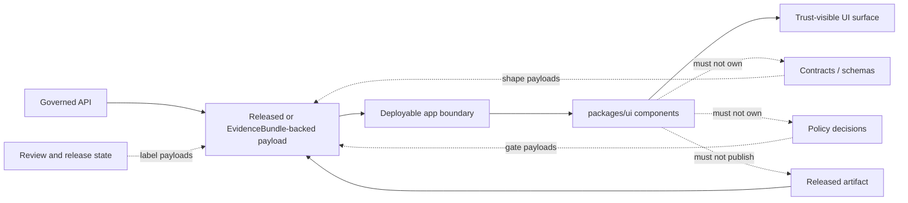

<!-- [KFM_META_BLOCK_V2]
doc_id: kfm://package/ui
title: UI package README
type: package-readme
version: v0.3
status: draft
owners: OWNER_TBD — UI steward · Design-system steward · Evidence UI steward
created: 2026-06-15
updated: 2026-06-15
policy_label: internal
related:
  - src/README.md
  - ../maplibre/README.md
  - ../temporal/README.md
  - ../../apps/explorer-web/README.md
  - ../../apps/governed-api/README.md
  - ../../docs/doctrine/trust-membrane.md
  - ../../docs/doctrine/directory-rules.md
  - ../../docs/architecture/contract-schema-policy-split.md
tags: [kfm, ui, components, trust-visible-ui, evidence-drawer, focus-mode, design-system]
notes:
  - "v0.3 formatting pass: aligned package README with the richer README-like documentation standard used by packages/ui/src/README.md."
  - "Implementation depth is UNKNOWN until package source, build config, tests, exports, and consuming apps are inspected."
  - "This package is the shared UI component home, not the deployable app shell and not a truth source."
[/KFM_META_BLOCK_V2] -->

<div align="center">

# UI Package

`packages/ui/`

**Shared KFM UI components for trust-visible, evidence-aware, policy-aware application surfaces.**


[Scope](#scope) · [Repo fit](#repo-fit) · [Inputs](#inputs) · [Exclusions](#exclusions) · [Package map](#package-map) · [Diagram](#diagram) · [Definition of done](#definition-of-done)

</div>

---

> [!IMPORTANT]
> **Status:** experimental / `NEEDS VERIFICATION`  
> **Owners:** `OWNER_TBD` — UI steward · Design-system steward · Evidence UI steward  
> **Path:** `packages/ui/README.md`  
> **Repo fit:** shared reusable UI package under `packages/`  
> **Truth posture:** CONFIRMED file path / PROPOSED package contract / UNKNOWN implementation depth

> [!NOTE]
> This README defines the intended package boundary for shared UI components. It does not prove that all components, exports, tests, fixtures, stories, design tokens, or consuming app imports already exist.

## Scope

`packages/ui/` is the shared component package for KFM user interfaces.

It should help deployable apps present evidence, policy posture, release state, validation state, uncertainty, corrections, rollback visibility, and finite outcomes without duplicating trust-display logic across app surfaces.

This package is not a deployable application, not a truth store, not a policy engine, not a source connector, and not a renderer boundary. It renders governed data passed to it by apps, fixtures, or API clients.

<p align="right"><a href="#ui-package">Back to top</a></p>

## Repo fit

KFM separates deployable applications from shared packages. `packages/ui/` should be imported by apps; it should not become an app by itself.

| Relationship | Path | Status | Notes |
|---|---|---|---|
| Source tree | [`src/README.md`](src/README.md) | CONFIRMED adjacent README | Importable component source boundary |
| Renderer neighbor | [`../maplibre/README.md`](../maplibre/README.md) | NEEDS VERIFICATION | Map source, layer, style, and camera logic belongs outside this package |
| Temporal neighbor | [`../temporal/README.md`](../temporal/README.md) | NEEDS VERIFICATION | Time labels and temporal display helpers may depend on shared temporal vocabulary |
| Public explorer app | [`../../apps/explorer-web/README.md`](../../apps/explorer-web/README.md) | NEEDS VERIFICATION | Deployable app shell should consume this package |
| Governed API app | [`../../apps/governed-api/README.md`](../../apps/governed-api/README.md) | NEEDS VERIFICATION | Public payloads should be governed before reaching UI props |
| Directory doctrine | [`../../docs/doctrine/directory-rules.md`](../../docs/doctrine/directory-rules.md) | NEEDS VERIFICATION | Placement authority; verify current repo path before relying on link |

## Inputs

Accepted inputs are component-ready, already-governed values passed through an app, fixture, story harness, or API client.

| Input family | Examples | Rendering responsibility |
|---|---|---|
| Evidence state | Evidence reference, EvidenceBundle summary, citation status | Show evidence support clearly |
| Policy state | Policy decision, sensitivity tier, redaction reason | Display denial, redaction, or staged-access posture |
| Release state | Release ID, publication status, rollback availability | Avoid implying unpublished material is released |
| Review state | Reviewer state, validation summary, open review note | Make review posture visible |
| Correction state | Correction notice, supersession label, withdrawal reason | Keep lineage visible after change |
| Finite outcome | `ANSWER`, `ABSTAIN`, `DENY`, `ERROR`, `UNKNOWN`, `NEEDS VERIFICATION` | Render state as text, not color alone |
| Design tokens | Semantic variants, spacing, typography hooks | Keep UI consistent without encoding truth in color alone |

## Exclusions

| Does not belong here | Correct home |
|---|---|
| Deployable application routing | `apps/explorer-web/`, `apps/review-console/`, or another app |
| Governed API implementation | `apps/governed-api/` or verified API package home |
| MapLibre runtime, sources, layers, camera, and style control | `packages/maplibre/` |
| Canonical data stores | `data/` |
| Raw, work, quarantine, processed, catalog, triplet, or published data | `data/` lifecycle folders |
| Release decisions | `release/` |
| Policy rules | `policy/` |
| Contract meaning | `contracts/` |
| Machine-readable schema authority | `schemas/contracts/v1/` |
| AI answer generation | governed AI runtime or service package |
| Direct source connectors | `connectors/` |

> [!CAUTION]
> UI components must not become a shortcut around governed APIs, released artifacts, EvidenceBundle resolution, policy decisions, review state, or release state.

## Package map

The exact package tree is `NEEDS VERIFICATION`. The following is a proposed orientation map, not a claim that these folders currently exist.

```text
packages/ui/
  README.md        # package-level boundary and orientation
  src/             # importable source tree
  fixtures/        # synthetic UI fixtures, if repo convention supports this
  tests/           # package tests, if repo convention supports this
  stories/         # visual examples, if story tooling is confirmed
  package.json     # package metadata, if JavaScript/TypeScript is confirmed
```

## Diagram



## Trust membrane rule

UI components must not normalize direct access to canonical or internal stores.

A public or normal UI surface must not read directly from:

```text
data/raw/
data/work/
data/quarantine/
data/processed/
unpublished candidates
canonical/internal stores
direct model runtime output
```

A UI component should receive already-governed props from an app, API client, fixture, or story harness.

## Component posture

Components in this package should be:

- evidence-aware
- policy-aware
- release-aware
- correction-aware
- accessible
- deterministic where practical
- easy to test with static fixtures
- safe by default when data is missing
- explicit when rendering `UNKNOWN`, `NEEDS VERIFICATION`, `ABSTAIN`, `DENY`, or `ERROR`

## Expected component families

Implementation may eventually include component families such as:

```text
components/
  badges/
  banners/
  cards/
  drawers/
  evidence/
  forms/
  layout/
  policy/
  release/
  review/
  status/
  tables/
  typography/
```

This tree is illustrative until actual source files are inspected.

## Trust-state display vocabulary

Use stable labels for trust-bearing state.

| State | UI intent |
|---|---|
| `CONFIRMED` | Verified from admissible evidence in the relevant context |
| `PROPOSED` | Design, recommendation, or candidate not proven as implemented |
| `UNKNOWN` | Not verified strongly enough |
| `NEEDS VERIFICATION` | Checkable before use, release, activation, or publication |
| `ABSTAIN` | System cannot answer or render authoritatively because support is insufficient |
| `DENY` | Policy blocks exposure or action |
| `ERROR` | Tool, data, validation, or runtime failure |
| `REDACTED` | Information withheld or generalized by policy |
| `SUPERSEDED` | Older material retained but no longer current |
| `WITHDRAWN` | Prior release or claim removed from active public use |

## Public UI safety rules

A component should fail safely when trust-bearing props are missing.

| Missing input | Safer behavior |
|---|---|
| Missing evidence reference | Render `ABSTAIN` or `Evidence pending`, not a confident claim |
| Missing policy decision | Render blocked or unavailable state for sensitive surfaces |
| Missing release state | Avoid showing as public or released |
| Missing citation status | Render citation warning |
| Missing correction state | Avoid `current` label |
| Missing sensitivity tier | Use conservative display |
| Missing finite outcome | Use `UNKNOWN` or explicit fallback |

## Relationship to Focus Mode

`packages/ui` may provide reusable display pieces for Focus Mode, such as prompt boundary panels, evidence summaries, answer status cards, citation validation warnings, policy denial messages, source coverage summaries, correction notices, and rollback notices.

It should not generate Focus Mode answers. It should render governed answer envelopes supplied by the appropriate runtime or API layer.

## Relationship to Evidence Drawer

`packages/ui` may provide generic Evidence Drawer components.

The drawer should make it easy to inspect evidence summary, source role, citation state, policy decision, review state, release state, correction state, rollback target, uncertainty, and limitations.

The drawer should not fetch ungoverned source material directly.

## Relationship to MapLibre

Map-specific source, layer, style, camera, and renderer behavior belongs in `packages/maplibre/`.

`packages/ui` may provide generic UI wrappers used near a map, such as panels, legend containers, toggles, badges, and drawers. It should not become the renderer boundary.

## Inspection path

The package manager, framework, and test runner remain `NEEDS VERIFICATION`. These commands are safe local inspection examples only.

```bash
# From the repository root, inspect the UI package.
find packages/ui -maxdepth 2 -type f | sort

# Inspect source tree shape.
find packages/ui/src -maxdepth 2 -type f | sort

# Inspect package metadata when present.
find packages/ui -maxdepth 2 \( -name package.json -o -name pyproject.toml -o -name tsconfig.json \) -print
```

## Testing expectations

Useful tests for this package should cover:

- rendering of all finite outcome labels
- missing evidence behavior
- missing policy behavior
- redaction notice rendering
- correction banner rendering
- release-state rendering
- keyboard navigation for drawers and modals
- accessible names for badges and status components
- no color-only status communication
- fixture rendering for public, review, denied, abstained, and unknown states

## Fixture expectations

Fixtures should be synthetic unless explicitly approved.

Preferred fixture categories:

```text
fixtures/
  evidence-summary.answer.json
  evidence-summary.abstain.json
  policy-decision.deny.json
  release-banner.published.json
  correction-notice.superseded.json
  focus-mode.error.json
```

Fixture homes are `NEEDS VERIFICATION` until repo conventions are inspected.

## Definition of done

- [ ] Owners are confirmed and the `OWNER_TBD` placeholder is replaced.
- [ ] Actual package source folders are inventoried and package map is updated.
- [ ] Package framework and export conventions are verified.
- [ ] Components render trust labels as visible text, not color alone.
- [ ] Missing evidence, policy, release, or correction state fails closed.
- [ ] Tests or synthetic examples cover denied, abstained, unknown, and needs-verification states.
- [ ] MapLibre renderer logic remains outside this package.
- [ ] Deployable app logic remains outside this package.
- [ ] Rollback path is known before public-facing component behavior changes.

## Maintenance checklist

Before changing this package, verify:

- components do not bypass governed API boundaries
- components do not read lifecycle data directly
- trust-state labels remain consistent with contracts
- sensitive states fail closed
- accessibility tests still pass
- story/demo fixtures are clearly synthetic
- public-facing examples do not imply unsupported implementation maturity
- map-specific logic stays in the renderer package
- deployable app logic stays in `apps/`

## Safe change pattern

1. Add or update component contract notes.
2. Add synthetic fixtures.
3. Add or update component tests.
4. Add visual/story examples if the repo supports them.
5. Update consuming apps after component behavior is stable.
6. Document any breaking prop changes.
7. Keep rollback simple by avoiding broad component rewrites when a smaller change works.

## Open verification items

| Item | Why it matters |
|---|---|
| Confirm actual package manager | Prevents wrong quickstart or test commands |
| Confirm actual component framework | Prevents incorrect examples and export assumptions |
| Confirm Storybook, Ladle, Playwright, Vitest, Jest, or equivalent tooling | Enables real validation commands |
| Confirm actual package exports | Keeps consuming app imports stable |
| Confirm existing component directory names | Moves package map from PROPOSED to CONFIRMED |
| Confirm consuming apps and import paths | Keeps package/app boundary accurate |
| Confirm design-token source of truth | Prevents style drift |
| Confirm compatibility roots such as `ui/`, `web/`, `styles/`, or `viewer_templates/` | Prevents duplicate authority or broken legacy surfaces |
| Confirm accessibility checks in CI | Makes accessibility expectations enforceable |

<details>
<summary>Appendix A — illustrative component examples</summary>

These examples are illustrative. They show intended component shape, not verified exports.

```tsx
<EvidenceStatusBadge
  status="NEEDS_VERIFICATION"
  label="Source rights not verified"
  detail="This layer cannot be promoted until source terms are reviewed."
/>
```

```tsx
<PolicyNotice
  decision="DENY"
  reason="sensitive_exact_location"
  message="Exact location is withheld by policy."
/>
```

```tsx
<ReleaseBanner
  releaseId="release-2026-06-example"
  state="published"
  corrected={false}
  rollbackAvailable={true}
/>
```

```tsx
<ClaimCard
  title="County boundary claim"
  status="ABSTAIN"
  reason="missing_evidence_ref"
  message="This claim cannot be displayed as confirmed until evidence is resolved."
/>
```

</details>

<details>
<summary>Appendix B — no-loss preservation note</summary>

This formatting pass preserves the prior README substance: package boundary, repo fit, accepted inputs, exclusions, trust membrane rule, component posture, component families, trust-state vocabulary, Focus Mode / Evidence Drawer / MapLibre relationships, testing expectations, fixtures, maintenance checklist, safe change pattern, reviewer concerns, open verification items, and status summary.

The main changes are presentational and reviewability-focused: normalized meta block, centered header, badges, quick links, impact block, callouts, package map, Mermaid diagram, inspection commands, definition-of-done checklist, tabular verification backlog, and collapsible examples.

</details>

## Status summary

`packages/ui` should remain the shared UI component home for KFM trust-visible interfaces.

It should make evidence, policy, release, correction, uncertainty, denial, and rollback state visible without becoming a truth store, policy engine, map renderer, deployable shell, source connector, or public bypass around governed APIs.

<p align="right"><a href="#ui-package">Back to top</a></p>
