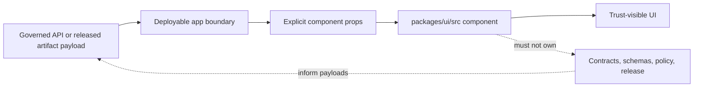

<!-- [KFM_META_BLOCK_V2]
doc_id: kfm://package/ui/src
title: UI source tree README
type: package-src-readme
version: v0.2
status: draft
owners: OWNER_TBD — UI steward · Design-system steward · Evidence UI steward
created: 2026-06-15
updated: 2026-06-15
policy_label: internal
related:
  - ../README.md
  - ../../maplibre/README.md
  - ../../../apps/explorer-web/README.md
  - ../../../apps/governed-api/README.md
  - ../../../docs/doctrine/trust-membrane.md
  - ../../../docs/doctrine/directory-rules.md
  - ../../../docs/architecture/contract-schema-policy-split.md
tags: [kfm, ui, src, components, trust-visible-ui, evidence-drawer, focus-mode, design-system]
notes:
  - "v0.2 formatting pass: added README impact block, Shields badges, quick jumps, Mermaid boundary diagram, callouts, task list, and collapsible appendix."
  - "Implementation depth is UNKNOWN until actual exports, tests, build config, and consuming apps are inspected."
  - "Source components render governed data; they do not decide truth, policy, evidence, release, or correction state."
[/KFM_META_BLOCK_V2] -->

<div align="center">

# UI Source Tree

`packages/ui/src/`

**Importable source home for shared KFM UI components, primitives, hooks, utilities, and trust-visible display patterns.**


[Scope](#scope) · [Repo fit](#repo-fit) · [Inputs](#inputs) · [Exclusions](#exclusions) · [Directory map](#directory-map) · [Diagram](#diagram) · [Definition of done](#definition-of-done)

</div>

---

> [!IMPORTANT]
> **Status:** experimental / `NEEDS VERIFICATION`  
> **Owners:** `OWNER_TBD` — UI steward · Design-system steward · Evidence UI steward  
> **Path:** `packages/ui/src/README.md`  
> **Repo fit:** importable source tree inside `packages/ui/`  
> **Truth posture:** CONFIRMED file path / PROPOSED source-tree contract / UNKNOWN implementation depth

> [!NOTE]
> This README defines the intended source-tree boundary for shared UI code. It does not prove that all folders, exports, tests, stories, or consuming app imports already exist.

## Scope

`packages/ui/src/` is the source-code tree for the shared UI package.

Code in this tree should help KFM apps render evidence, policy posture, release state, validation state, uncertainty, corrections, rollback visibility, and finite outcomes in a consistent way.

This tree is not a deployable application, not a data authority, not a MapLibre renderer, not a policy engine, and not a source connector.

<p align="right"><a href="#ui-source-tree">Back to top</a></p>

## Repo fit

| Relationship | Path | Status | Notes |
|---|---|---|---|
| Owning package | [`../README.md`](../README.md) | CONFIRMED adjacent README expected | Package-level boundary and package-facing overview |
| Renderer neighbor | [`../../maplibre/README.md`](../../maplibre/README.md) | NEEDS VERIFICATION | Map source, layer, style, and camera logic belongs there |
| Public explorer app | [`../../../apps/explorer-web/README.md`](../../../apps/explorer-web/README.md) | NEEDS VERIFICATION | Deployable app shell should consume this package, not live inside it |
| Governed API app | [`../../../apps/governed-api/README.md`](../../../apps/governed-api/README.md) | NEEDS VERIFICATION | Public payloads should be governed before reaching UI props |
| Directory doctrine | [`../../../docs/doctrine/directory-rules.md`](../../../docs/doctrine/directory-rules.md) | NEEDS VERIFICATION | Placement authority; verify current repo path before relying on link |

## Inputs

Accepted inputs are component-ready, already-governed values passed through an app, fixture, story harness, or API client.

| Input family | Examples | Rendering responsibility |
|---|---|---|
| Evidence state | Evidence reference, EvidenceBundle summary, citation status | Show evidence support clearly |
| Policy state | Policy decision, sensitivity tier, redaction reason | Display denial, redaction, or staged-access posture |
| Release state | Release ID, publication status, rollback availability | Avoid implying unpublished material is released |
| Review state | Reviewer state, validation summary, open review note | Make review posture visible |
| Correction state | Correction notice, supersession label, withdrawal reason | Keep lineage visible after change |
| Finite outcome | `ANSWER`, `ABSTAIN`, `DENY`, `ERROR`, `UNKNOWN`, `NEEDS VERIFICATION` | Render state as text, not color alone |

## Exclusions

| Does not belong here | Correct home |
|---|---|
| Deployable app routing and pages | `apps/` |
| Governed API services | `apps/governed-api/` or verified API package home |
| MapLibre source, layer, style, and camera code | `packages/maplibre/` |
| Canonical records or lifecycle data | `data/` lifecycle roots |
| Contract meaning | `contracts/` |
| Machine-readable schema authority | `schemas/contracts/v1/` |
| Policy decisions and rules | `policy/` |
| Release manifests and publication authority | `release/` |
| Source connectors | `connectors/` |
| AI answer generation | governed AI runtime or service package |

> [!CAUTION]
> UI components must not become a shortcut around governed APIs, released artifacts, EvidenceBundle resolution, policy decisions, review state, or release state.

## Directory map

The exact source tree is `NEEDS VERIFICATION`. The following is a proposed placement guide, not a claim that these folders currently exist.

```text
src/
  components/     # shared visual building blocks
  evidence/       # evidence and citation display components
  policy/         # deny, redact, sensitivity, staged-access display
  release/        # release, rollback, correction, supersession display
  review/         # review and validation display helpers
  status/         # finite outcome and trust-state labels
  hooks/          # UI-only state helpers
  utils/          # label, accessible-name, and variant helpers
  types/          # UI prop types and component-local types
  index.ts        # package export surface, if TypeScript is confirmed
```

## Diagram



## Component contract

Components in this source tree should be designed around explicit props.

A component may render:

- evidence status
- source role
- citation validation state
- policy decision
- sensitivity tier
- release state
- review state
- correction state
- rollback availability
- finite outcome label
- explanatory message prepared by a governed layer

A component should not fetch, infer, or overwrite authority-bearing state on its own unless a future reviewed adapter boundary explicitly allows that behavior.

## Safety defaults

When trust-bearing props are missing, components should fail closed.

| Missing input | Safer display |
|---|---|
| Evidence reference | `ABSTAIN` / `Evidence pending` |
| Policy decision | Blocked or unavailable state for sensitive surfaces |
| Release state | Avoid displaying as public or released |
| Citation validation | Citation warning |
| Correction state | Avoid `current` label |
| Sensitivity tier | Conservative display |
| Finite outcome | `UNKNOWN` or explicit fallback |

## Accessibility expectations

Source components should support:

- semantic HTML first
- keyboard navigation
- visible focus states
- accessible names for badges, buttons, panels, and drawers
- screen-reader-readable status changes
- labels that do not rely on color alone
- reduced-motion-safe behavior
- predictable drawer or modal focus handling

## Inspection path

The package manager, framework, and test runner remain `NEEDS VERIFICATION`. These commands are safe local inspection examples only.

```bash
# From the repository root, inspect the UI source tree.
find packages/ui/src -maxdepth 2 -type f | sort

# Inspect package metadata when present.
find packages/ui -maxdepth 2 \( -name package.json -o -name pyproject.toml -o -name tsconfig.json \) -print
```

## Testing expectations

Useful tests for this tree should cover:

- finite outcome rendering
- missing evidence behavior
- deny and abstain panels
- redaction notices
- correction banners
- release-state rendering
- keyboard navigation
- accessible names
- no color-only status communication
- synthetic fixture rendering for public, review, denied, abstained, and unknown states

## Definition of done

- [ ] Owners are confirmed and the `OWNER_TBD` placeholder is replaced.
- [ ] Actual source folders are inventoried and this README is updated from proposed layout to current layout.
- [ ] Package framework and export conventions are verified.
- [ ] Components render trust labels as visible text, not color alone.
- [ ] Missing evidence, policy, release, or correction state fails closed.
- [ ] Tests or synthetic examples cover denied, abstained, unknown, and needs-verification states.
- [ ] MapLibre renderer logic remains outside this source tree.
- [ ] Deployable app logic remains outside this source tree.
- [ ] Rollback path is known before public-facing component behavior changes.

## Open verification items

| Item | Why it matters |
|---|---|
| Confirm actual UI framework and package manager | Prevents wrong quickstart or test commands |
| Confirm TypeScript / JavaScript / JSX / TSX convention | Prevents incorrect export examples |
| Confirm actual source folders and exports | Moves directory map from PROPOSED to CONFIRMED |
| Confirm test runner and accessibility tooling | Enables real validation commands |
| Confirm design-token source of truth | Prevents style drift |
| Confirm consuming app import paths | Keeps package/app boundary accurate |
| Confirm story or demo tooling | Determines where examples should live |

<details>
<summary>Appendix A — illustrative component examples</summary>

These examples are illustrative. They show intended component shape, not verified exports.

```tsx
<EvidenceStatusBadge
  status="NEEDS_VERIFICATION"
  label="Source rights not verified"
  detail="This layer cannot be promoted until source terms are reviewed."
/>
```

```tsx
<PolicyNotice
  decision="DENY"
  reason="sensitive_exact_location"
  message="Exact location is withheld by policy."
/>
```

```tsx
<ClaimCard
  title="County boundary claim"
  status="ABSTAIN"
  reason="missing_evidence_ref"
  message="This claim cannot be displayed as confirmed until evidence is resolved."
/>
```

</details>

<details>
<summary>Appendix B — no-loss preservation note</summary>

This formatting pass preserves the prior README substance: source-tree boundary, accepted inputs, exclusions, safety defaults, accessibility expectations, testing expectations, reviewer checklist, open verification items, and status summary.

The main changes are presentational and reviewability-focused: normalized meta block, impact block, badges, quick links, Mermaid diagram, callouts, definition-of-done task list, and collapsible appendix.

</details>

## Status summary

`packages/ui/src/` should remain the importable source tree for shared trust-visible KFM UI components.

It should make evidence, policy, release, correction, uncertainty, denial, and rollback state visible while preserving governed API boundaries and avoiding direct authority over truth, policy, publication, or source data.

<p align="right"><a href="#ui-source-tree">Back to top</a></p>
