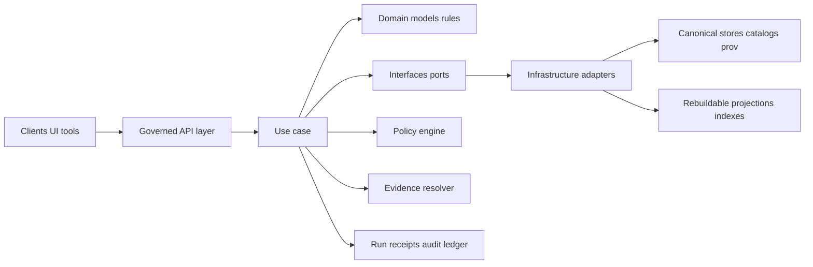

<!-- [KFM_META_BLOCK_V2]
doc_id: kfm://doc/9c266c12-213d-40f2-9f68-4b1a0affa622
title: packages/usecases README
type: standard
version: v1
status: draft
owners: KFM Engineering (TBD)
created: 2026-02-22
updated: 2026-02-22
policy_label: restricted
related:
  - (not confirmed in repo) packages/domain
  - (not confirmed in repo) packages/interfaces
  - (not confirmed in repo) packages/infrastructure
  - (not confirmed in repo) packages/api
tags: [kfm, usecases, clean-architecture, trust-membrane, governance]
notes:
  - Repo structure is not confirmed; update the "Directory layout" section to match the actual tree.
  - Use cases encode trust membrane + policy enforcement + auditable outcomes.
[/KFM_META_BLOCK_V2] -->

# Use Cases Layer
Application orchestration for KFM: **policy-aware workflows** that turn requests into **evidence-backed, auditable outcomes**.

**Status:** Draft · **Owners:** KFM Engineering (TBD)


---

## Navigation
- [What belongs here](#what-belongs-here)
- [Hard boundary rules](#hard-boundary-rules)
- [Architecture at a glance](#architecture-at-a-glance)
- [Directory layout](#directory-layout)
- [Implementing a new use case](#implementing-a-new-use-case)
- [Error model](#error-model)
- [Run receipts and audit](#run-receipts-and-audit)
- [Testing](#testing)
- [Governance and sensitivity](#governance-and-sensitivity)
- [References](#references)

---

## What belongs here

This package is the **Use cases** layer in the KFM clean architecture:

- **Use cases** are *application workflows*: they orchestrate domain logic and call outward through **interfaces/ports**.
- Use cases are where we enforce KFM’s “trust membrane” behaviors: **policy decisions**, **redactions/obligations**, **audit/run receipts**, and **fail-closed** outcomes.
- Use cases are designed to be **small, testable**, and **composable**.

**Examples of use case categories** (illustrative; adapt to your repo):
- Dataset: discover, validate, promote, query
- Evidence: resolve EvidenceRef → EvidenceBundle
- Story: draft, validate citations, publish
- Focus Mode: retrieve admissible evidence → answer with citations or abstain
- Admin/Steward: approve/reject promotions, manage policy packs

### Non-goals

Use cases are **not**:
- HTTP handlers/controllers (belongs in API/UI layer)
- Database queries or storage concerns (belongs in infrastructure adapters)
- Policy engine implementation (belongs in policy module / interfaces + infra)
- UI rendering (belongs in web client)

---

## Hard boundary rules

> If you need to break one of these rules, you must document **why**, add a **test that asserts the exception**, and create an ADR (architecture decision record). Breaking the data-flow rules undermines governance and reproducibility.

### MUST
- **Call inward, implement outward:**
  - Use cases call **Domain** directly.
  - Use cases call **Infrastructure only via Interfaces (ports)**.
- **Enforce policy** before returning data or producing artifacts:
  - allow/deny + obligations (generalize geometry, remove attributes, etc.)
- **Emit an audit record/run receipt** for governed operations (e.g., promotion, publishing, Focus Mode ask).
- **Fail closed** when rights/policy/evidence are unclear.

### MUST NOT
- Import infrastructure adapters directly (DB clients, object storage SDKs, search index clients, etc.).
- Access DB/object storage directly.
- Leak restricted existence via error differences (“ghost metadata”).
- Return un-cited claims from Focus Mode (must cite or abstain).

---

## Architecture at a glance



Key interpretation:
- **Use cases** are the “orchestration hub” that converts requests + context into governed outcomes.
- Canonical stores are the source of truth; projections are rebuildable.

---

## Directory layout

> **IMPORTANT:** This is a recommended skeleton. Update this section to match the real repo tree.

```text
packages/usecases/
├─ README.md
├─ src/
│  ├─ index.ts
│  ├─ context/
│  │  ├─ UsecaseContext.ts
│  │  └─ RequestMetadata.ts
│  ├─ errors/
│  │  ├─ ErrorCode.ts
│  │  ├─ UsecaseError.ts
│  │  └─ toPolicySafeMessage.ts
│  ├─ dataset/
│  │  ├─ queryDataset.ts
│  │  └─ promoteDatasetVersion.ts
│  ├─ evidence/
│  │  └─ resolveEvidence.ts
│  ├─ focus/
│  │  └─ askFocus.ts
│  └─ story/
│     ├─ validateStoryNode.ts
│     └─ publishStoryNode.ts
├─ test/
│  ├─ dataset/
│  └─ focus/
└─ package.json
```

**Recommended conventions**
- One file per use case (`<verb><Noun>.ts`) to keep scope small.
- Each use case exports a single `execute()` function (or class with `execute()`).
- Use cases accept:
  - `input` (DTO)
  - `ctx` (actor/purpose/request metadata + policy/audit handles)
  - `deps` (ports)

---

## Implementing a new use case

### 1) Use case shape (TypeScript example)

```ts
// src/dataset/queryDataset.ts
export type QueryDatasetInput = {
  datasetVersionId: string;
  bbox?: [number, number, number, number];
  time?: { start: string; end: string };
  filters?: Record<string, unknown>;
};

export type QueryDatasetOutput = {
  datasetVersionId: string;
  features: unknown[]; // Prefer a typed domain DTO in real code
  policy: { label: string; obligations: Array<Record<string, unknown>> };
  auditRef: string;
};

export type UsecaseDeps = {
  datasetRepo: {
    query: (args: unknown) => Promise<unknown[]>;
  };
  policy: {
    evaluate: (args: unknown) => Promise<{ decision: "allow" | "deny"; label: string; obligations: any[]; reasonCodes: string[] }>;
  };
  audit: {
    record: (args: unknown) => Promise<{ auditRef: string }>;
  };
};

export async function execute(
  input: QueryDatasetInput,
  ctx: { actor: { principal: string; role: string }; purpose?: string; requestId: string },
  deps: UsecaseDeps
): Promise<QueryDatasetOutput> {
  // 1) Evaluate policy (fail closed)
  const decision = await deps.policy.evaluate({ operation: "dataset.query", input, actor: ctx.actor });

  // 2) Record audit early (so deny paths are still traceable)
  const { auditRef } = await deps.audit.record({
    operation: "dataset.query",
    actor: ctx.actor,
    purpose: ctx.purpose,
    requestId: ctx.requestId,
    policy: decision,
    input,
  });

  if (decision.decision !== "allow") {
    // Throw / return a policy-safe error (see Error model section)
    throw Object.assign(new Error("Denied"), { errorCode: "POLICY_DENY", auditRef });
  }

  // 3) Query via port (never direct DB)
  const rows = await deps.datasetRepo.query({ ...input, obligations: decision.obligations });

  // 4) Apply obligations (redaction/generalization) before returning
  // (Implementation can live in a shared utility used by both API and usecases)
  const features = rows; // placeholder

  return {
    datasetVersionId: input.datasetVersionId,
    features,
    policy: { label: decision.label, obligations: decision.obligations },
    auditRef,
  };
}
```

### 2) Dependency direction

Use cases should depend on:
- Domain entities/value objects
- Interfaces/ports (repo interfaces, policy engine interface, audit writer interface)
- Shared contracts (DTOs, schemas)

Use cases must not depend on:
- DB drivers, ORMs
- HTTP frameworks
- Storage SDKs
- UI components

---

## Error model

Use cases must surface a **stable, policy-safe** error model:
- `error_code`: stable machine-readable identifier
- `message`: safe for the caller/UI (no sensitive existence leaks)
- `audit_ref`: always present on governed operations
- optional remediation hints (safe suggestions)

### Suggested error codes (starter)

- `VALIDATION_ERROR`
- `POLICY_DENY`
- `EVIDENCE_UNRESOLVABLE`
- `NOT_FOUND_OR_NOT_ALLOWED` (avoid differentiating 403 vs 404 when policy requires)
- `CONFLICT`
- `INTERNAL_ERROR`

### Policy-safe error guidance

- Do not emit different messages/timings that reveal restricted existence.
- Prefer “not found or not allowed” patterns when necessary.
- For Focus Mode and similar workflows: **abstention is a feature**, not a failure.

---

## Run receipts and audit

Use cases that affect governed artifacts or produce user-facing answers must emit:
- Inputs/outputs by digest (or references to canonical artifacts)
- Environment capture (build/git/container identifiers where applicable)
- Policy decision id + obligations + reason codes
- Operation type + actor + purpose
- Timestamps

**Design goal:** every governed operation is reproducible and reviewable.

> If your repo has a dedicated `prov:run_receipt` contract/schema, use it here.

---

## Testing

Minimum expectations for each use case:
- ✅ Unit tests for success + deny paths
- ✅ Contract tests for policy-safe errors (no sensitive metadata leakage)
- ✅ Golden tests for deterministic outputs (e.g., spec_hash stability when relevant)
- ✅ Tests that assert dependency direction (no infrastructure imports)

### Definition of Done checklist (copy/paste)

- [ ] Use case is small and scoped to one workflow
- [ ] Depends only on Domain + Interfaces (ports) + shared contracts
- [ ] Calls policy evaluation and applies obligations
- [ ] Emits audit/run receipt (or returns `audit_ref`) for governed operations
- [ ] Returns policy-safe errors with stable `error_code`
- [ ] Includes tests for allow + deny + validation errors
- [ ] Updates `src/index.ts` exports (if applicable)
- [ ] Updates this README if a new subfolder is introduced

---

## Governance and sensitivity

When handling potentially sensitive data:
- Default to deny when rights/policy are unclear.
- Prefer generalized geometry, redacted attributes, and careful messaging.
- Never leak “ghost metadata” that reveals restricted existence unless policy explicitly allows.
- Apply CARE-oriented protections when working with living persons or culturally restricted sites:
  - collapse precise DOB to decade/year
  - drop exact addresses
  - store generalized geo (e.g., county/bbox)
  - deny story-node mutation unless policy allows

---

## References

- **KFM — Definitive Design & Governance Guide (vNext)** (source of invariants: trust membrane, evidence-first UX, cite-or-abstain, policy-safe errors)
- **KFM — Ultimate Blueprint (Draft)** (architecture reference model: Domain → Use cases → Interfaces → Infrastructure; component responsibilities)

---

<p align="right"><a href="#use-cases-layer">Back to top ↑</a></p>
