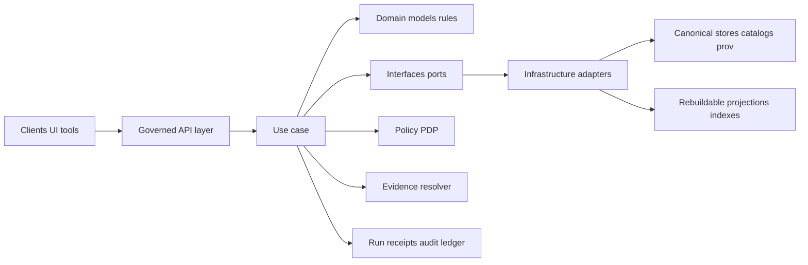

<!-- [KFM_META_BLOCK_V2]
doc_id: kfm://doc/9c266c12-213d-40f2-9f68-4b1a0affa622
title: packages/usecases README
type: standard
version: v1
status: draft
owners: KFM Engineering (TBD)
created: 2026-02-22
updated: 2026-02-26
policy_label: restricted
related:
  - (not confirmed in repo) packages/domain
  - (not confirmed in repo) packages/interfaces
  - (not confirmed in repo) packages/infrastructure
  - (not confirmed in repo) packages/api
tags: [kfm, usecases, clean-architecture, trust-membrane, governance]
notes:
  - Repo structure is not confirmed; keep the skeleton, but replace "Directory layout" with the real tree once available.
  - Use cases encode trust membrane behaviors: policy decisions, obligations/redactions, receipts/audit, cite-or-abstain.
[/KFM_META_BLOCK_V2] -->

# Use Cases Layer
Application orchestration for KFM: **policy-aware workflows** that turn requests into **evidence-backed, auditable outcomes**.

**Path:** `packages/usecases/` · **Status:** Draft · **Owners:** KFM Engineering (TBD) · **Policy:** `restricted`


> **WARNING (restricted doc):** This README describes KFM’s trust membrane and governance mechanics. Treat it as **internal** and do not copy into public repos or public issue threads.

---

## Navigation
- [Where this fits](#where-this-fits)
- [What belongs here](#what-belongs-here)
- [Hard boundary rules](#hard-boundary-rules)
- [Architecture at a glance](#architecture-at-a-glance)
- [Directory layout](#directory-layout)
- [Contracts and conventions](#contracts-and-conventions)
- [Implementing a new use case](#implementing-a-new-use-case)
- [Error model](#error-model)
- [Run receipts and audit](#run-receipts-and-audit)
- [Promotion Contract touchpoints](#promotion-contract-touchpoints)
- [Testing](#testing)
- [Governance and sensitivity](#governance-and-sensitivity)
- [References](#references)

---

## Where this fits

KFM uses a clean architecture posture:

- **Domain**: rules + invariants (pure, testable)
- **Use cases**: workflows + orchestration + governance enforcement (**this package**)
- **Interfaces**: ports (repo/policy/audit/evidence contracts)
- **Infrastructure**: adapters (DB/object store/search/graph/tiles)

**Direction of dependency:** `usecases` depends on `domain` and `interfaces`, but **never** on infrastructure adapters.

---

## What belongs here

This package is the **Use cases** layer in KFM’s architecture:

- **Use cases** are *application workflows*: they orchestrate domain logic and call outward through **interfaces/ports**.
- Use cases are where we enforce KFM’s trust membrane behaviors:
  - **policy decisions** (allow/deny)
  - **obligations/redactions** (generalize geometry, remove attributes, add notices)
  - **evidence resolution** (EvidenceRef → EvidenceBundle)
  - **run receipts / audit** (including deny paths)
  - **fail-closed outcomes** when rights/policy/evidence are unclear
- Use cases are designed to be **small, testable**, and **composable**.

**Examples of use case families** (illustrative; adapt to your repo):
- Dataset: discover, validate, promote, query
- Evidence: resolve EvidenceRef → EvidenceBundle
- Story: draft, validate citations, publish
- Focus Mode: retrieve admissible evidence → answer with citations **or abstain**
- Admin/Steward: approve/reject promotions, manage policy packs

### Non-goals

Use cases are **not**:
- HTTP handlers/controllers (belongs in API layer)
- DB queries or storage concerns (belongs in infrastructure adapters)
- Policy engine implementation (belongs in policy module / interfaces + infra)
- UI rendering (belongs in web client)

---

## Hard boundary rules

> If you need to break one of these rules, you must document **why**, add a **test that asserts the exception**, and create an ADR (architecture decision record). Breaking the data-flow rules undermines governance and reproducibility.

### MUST
- **Call inward, implement outward**
  - Use cases call **Domain** directly.
  - Use cases call **Infrastructure only via Interfaces (ports)**.
- **Enforce policy before returning data** or producing artifacts.
  - Evaluate allow/deny + obligations.
  - Apply obligations (redaction/generalization) **before** any user-facing output.
- **Emit an audit record / run receipt** for governed operations (promotion, publishing, Focus Mode ask, evidence resolution).
  - Deny paths must still produce a traceable `audit_ref`.
- **Fail closed** when rights/policy/evidence are unclear.

### MUST NOT
- Import infrastructure adapters directly (DB clients, object storage SDKs, search index clients, etc.).
- Access DB/object storage directly.
- Leak restricted existence via error differences (“ghost metadata”).
- Return un-cited claims from Focus Mode (must cite or abstain).

---

## Architecture at a glance



Key interpretation:
- **Use cases** are the orchestration hub that converts requests + context into governed outcomes.
- Canonical stores are the source of truth; projections are rebuildable and can be re-indexed.

---

## Directory layout

> **IMPORTANT:** Repo structure is **not confirmed**. The tree below is a **PROPOSED skeleton**. Replace it with the real tree (example: `tree packages/usecases -L 4`) once available.

```text
packages/usecases/
├─ README.md                  # This file (contract + boundaries + DoD)
├─ src/                       # Use case implementations (orchestration only)
│  ├─ index.ts                # Package export surface
│  ├─ context/                # Actor/purpose/request metadata + correlation IDs
│  │  ├─ UsecaseContext.ts
│  │  └─ RequestMetadata.ts
│  ├─ errors/                 # Stable, policy-safe error model
│  │  ├─ ErrorCode.ts
│  │  ├─ UsecaseError.ts
│  │  └─ toPolicySafeMessage.ts
│  ├─ dataset/                # Dataset workflows (query/promote/validate)
│  │  ├─ queryDataset.ts
│  │  └─ promoteDatasetVersion.ts
│  ├─ evidence/               # EvidenceRef → EvidenceBundle workflows
│  │  └─ resolveEvidence.ts
│  ├─ focus/                  # Focus Mode orchestration (retrieve → cite/abstain)
│  │  └─ askFocus.ts
│  └─ story/                  # Story Node workflows (validate/publish)
│     ├─ validateStoryNode.ts
│     └─ publishStoryNode.ts
├─ test/                      # Unit + contract + golden tests (mirrors src/)
│  ├─ dataset/
│  └─ focus/
└─ package.json
```

**Recommended conventions**
- One file per use case (`<verb><Noun>.ts`) to keep scope small.
- Each use case exports a single `execute()` function (or a class with `execute()`).
- Use cases accept **three inputs**:
  1. `input` (DTO)
  2. `ctx` (actor + purpose + request metadata + policy/audit handles)
  3. `deps` (ports / interfaces)

---

## Contracts and conventions

### Naming

- Each use case must declare a stable `operation_id` (string), used in:
  - policy decisions
  - audit/run receipts
  - observability dashboards
  - (optional) permission documentation

**Suggested convention:** `"<domain>.<verb>"` (example: `dataset.query`, `story.publish`, `focus.ask`).

### Operation registry (template)

> **NOTE:** Keep this table in sync with the actual exports. It doubles as a review checklist for governance coverage.

| operation_id | Use case (file) | Governed output? | Evidence required? | Receipt required? | Notes |
|---|---|---:|---:|---:|---|
| `dataset.query` | `src/dataset/queryDataset.ts` | ✅ | ✅ (preferred) | ✅ | Return policy label + obligations + `audit_ref`. |
| `dataset.promote` | `src/dataset/promoteDatasetVersion.ts` | ✅ | ✅ | ✅ | Enforce Promotion Contract gates (see below). |
| `evidence.resolve` | `src/evidence/resolveEvidence.ts` | ✅ | ✅ | ✅ | Produces EvidenceBundle digest/id. |
| `story.publish` | `src/story/publishStoryNode.ts` | ✅ | ✅ | ✅ | Must validate citations before publish. |
| `focus.ask` | `src/focus/askFocus.ts` | ✅ | ✅ | ✅ | Cite-or-abstain + citation verification hard gate. |

### Use case signature

Prefer a stable signature across the package:

```ts
export type UsecaseExecute<I, O> = (input: I, ctx: UsecaseContext, deps: UsecaseDeps) => Promise<O>;
```

Where:

- `UsecaseContext` includes `actor`, `requestId`, optional `purpose`, and any correlation/trace IDs.
- `UsecaseDeps` is a bundle of ports (repositories, policy PDP, evidence resolver, audit writer).

> **NOTE:** Ports live in `packages/interfaces` (not confirmed in repo). Use cases should only *depend on types* (interfaces) and *receive implementations* from composition roots (API runtime, jobs, CLI).

### Policy obligations are first-class

Treat obligations like **transform requirements** (not “nice to have”):

- geometry/generalization
- attribute redaction
- license/attribution injection
- UI notices/badges

Obligations must be applied **and recorded** (run receipt + PROV, where applicable).

### Evidence is a contract surface

If a use case returns information that will be used in **Map / Story / Focus**, it should return either:

- a resolvable `EvidenceRef` (preferred), or
- an `EvidenceBundle` digest / id produced by the evidence resolver

This preserves “cite-or-abstain” semantics and prevents “raw text from index” leaks.

---

## Implementing a new use case

### Minimal workflow checklist

1. Define `operation_id`
2. Validate input DTO (fail closed)
3. **Policy pre-check** (deny early)
4. Create an **audit/run receipt record early**
5. Resolve evidence (if needed) via **evidence resolver**
6. Execute domain workflow + port calls (never direct DB)
7. Apply obligations (redact/generalize/notice)
8. Return output DTO + `policy` + `audit_ref` (for governed operations)

### Use case shape (TypeScript example)

```ts
// src/dataset/queryDataset.ts
export const operation_id = "dataset.query" as const;

export type QueryDatasetInput = {
  datasetVersionId: string;
  bbox?: [number, number, number, number];
  time?: { start: string; end: string };
  filters?: Record<string, unknown>;
};

export type QueryDatasetOutput = {
  datasetVersionId: string;
  features: unknown[]; // Prefer typed DTOs in real code
  policy: { label: string; obligations: Array<Record<string, unknown>> };
  auditRef: string;
};

export type UsecaseDeps = {
  datasetRepo: { query: (args: unknown) => Promise<unknown[]> };
  policy: {
    evaluate: (args: unknown) => Promise<{
      decision: "allow" | "deny";
      label: string;
      obligations: any[];
      reasonCodes: string[];
    }>;
  };
  audit: { record: (args: unknown) => Promise<{ auditRef: string }> };
};

export async function execute(
  input: QueryDatasetInput,
  ctx: { actor: { principal: string; role: string }; purpose?: string; requestId: string },
  deps: UsecaseDeps
): Promise<QueryDatasetOutput> {
  // 1) Policy pre-check (fail closed)
  const policy = await deps.policy.evaluate({ operation: operation_id, input, actor: ctx.actor });

  // 2) Record audit early (deny paths are still traceable)
  const { auditRef } = await deps.audit.record({
    operation: operation_id,
    actor: ctx.actor,
    purpose: ctx.purpose,
    requestId: ctx.requestId,
    policy,
    input,
  });

  if (policy.decision !== "allow") {
    throw Object.assign(new Error("Not found or not allowed"), {
      errorCode: "NOT_FOUND_OR_NOT_ALLOWED",
      auditRef,
    });
  }

  // 3) Query via port (never direct DB)
  const rows = await deps.datasetRepo.query({ ...input, obligations: policy.obligations });

  // 4) Apply obligations (redaction/generalization) before returning
  const features = rows; // placeholder

  return {
    datasetVersionId: input.datasetVersionId,
    features,
    policy: { label: policy.label, obligations: policy.obligations },
    auditRef,
  };
}
```

### Dependency direction

Use cases may depend on:
- Domain entities/value objects
- Interfaces/ports (repo interfaces, policy engine interface, audit writer interface)
- Shared contracts (DTOs, schemas)

Use cases must not depend on:
- DB drivers, ORMs
- HTTP frameworks
- Storage SDKs
- UI components

---

## Error model

Use cases must surface a **stable, policy-safe** error model:

- `error_code`: stable machine-readable identifier
- `message`: safe for the caller/UI (no sensitive existence leaks)
- `audit_ref`: present for governed operations (and recommended for all)
- optional remediation hints (safe suggestions)

### Suggested error codes (starter)

- `VALIDATION_ERROR`
- `POLICY_DENY`
- `EVIDENCE_UNRESOLVABLE`
- `NOT_FOUND_OR_NOT_ALLOWED` (avoid differentiating 403 vs 404 when policy requires)
- `CONFLICT`
- `INTERNAL_ERROR`

### Policy-safe error guidance

- Do not emit different messages/timings that reveal restricted existence.
- Prefer “not found or not allowed” patterns when necessary.
- For Focus Mode and similar workflows: **abstention is a feature**, not a failure.

---

## Run receipts and audit

Use cases that affect governed artifacts or produce user-facing answers must emit a receipt/audit record that captures:

- **who** (principal, role)
- **what** (operation_id, parameters)
- **when** (time)
- **why** (purpose, if declared)
- inputs/outputs **by digest or canonical references**
- policy decision (allow/deny, obligations, reason codes)

> **NOTE:** Audit logs are themselves sensitive. Apply log redaction and retention policy.

### Run receipt (starter template)

```json
{
  "run_id": "kfm://run/2026-02-26T12:00:00Z.abcd",
  "operation_id": "dataset.query",
  "request_id": "req_...",
  "actor": {"principal": "user:123", "role": "steward"},
  "purpose": "research",
  "policy": {"decision": "allow", "policy_label": "public", "obligations": [], "reason_codes": []},
  "inputs": [{"ref": "kfm://dataset_version/...", "digest": "sha256:..."}],
  "outputs": [{"ref": "kfm://bundle/...", "digest": "sha256:..."}],
  "created_at": "2026-02-26T12:00:00Z"
}
```

---

## Promotion Contract touchpoints

Promotion is a **governed workflow**. Any “promote” or “publish” use case must (at minimum):

- validate identity/versioning
- validate licensing/rights metadata
- validate sensitivity classification + redaction plan
- validate catalog triplet cross-links (DCAT + STAC + PROV)

> If any gate cannot be verified, the use case must **fail closed** and emit an audit record.

---

## Testing

Minimum expectations for each use case:
- ✅ Unit tests for success + deny paths
- ✅ Contract tests for policy-safe errors (no sensitive metadata leakage)
- ✅ Golden tests for deterministic outputs (when hashes/spec IDs matter)
- ✅ Tests that assert dependency direction (no infrastructure imports)
- ✅ Policy fixture tests that run in CI (allow/deny + obligations)

### Definition of Done checklist (copy/paste)

- [ ] Use case is small and scoped to one workflow
- [ ] Depends only on Domain + Interfaces (ports) + shared contracts
- [ ] Defines an `operation_id`
- [ ] Calls policy evaluation and applies obligations
- [ ] Emits audit/run receipt (or returns `audit_ref`) for governed operations (incl. deny paths)
- [ ] Returns policy-safe errors with stable `error_code`
- [ ] Includes tests for allow + deny + validation errors
- [ ] Updates `src/index.ts` exports (if applicable)
- [ ] Updates this README if a new subfolder is introduced

---

## Governance and sensitivity

When handling potentially sensitive data:
- Default to deny when rights/policy are unclear.
- Prefer generalized geometry, redacted attributes, and careful messaging.
- Never leak “ghost metadata” that reveals restricted existence unless policy explicitly allows.
- Apply CARE-oriented protections when working with living persons or culturally restricted sites:
  - collapse precise DOB to decade/year
  - drop exact addresses
  - store generalized geo (e.g., county/bbox)
  - deny story-node mutation unless policy allows

---

## References

- **KFM — Definitive Design & Governance Guide (vNext)** (source of invariants: trust membrane, Promotion Contract, policy-safe errors, cite-or-abstain Focus Mode)
- **KFM — Ultimate Blueprint (Draft)** (architecture reference model: Domain → Use cases → Interfaces → Infrastructure)

---

<p align="right"><a href="#use-cases-layer">Back to top ↑</a></p>