<!-- [KFM_META_BLOCK_V2]
doc_id: kfm://doc/NEEDS-VERIFICATION
title: Pipeline Specs
type: standard
version: v1
status: draft
owners: OWNER_TBD
created: 2026-05-02
updated: 2026-05-02
policy_label: NEEDS VERIFICATION
related: [PROPOSED:../docs/control/SOURCE_LEDGER.md, PROPOSED:../schemas/contracts/v1/, PROPOSED:../policy/, PROPOSED:../pipelines/, PROPOSED:../release/]
tags: [kfm, pipeline, pipeline-specs, evidence, governance, publication]
notes: [pipeline_specs path requested by user; UNKNOWN repo implementation depth; relative links require repo inspection]
[/KFM_META_BLOCK_V2] -->

# Pipeline Specs

Human-readable KFM pipeline specifications for governed source intake, validation, promotion, publication, correction, and rollback.

> [!IMPORTANT]
> **Status:** experimental  
> **Owners:** `OWNER_TBD` — NEEDS VERIFICATION  
> **Path:** `pipeline_specs/README.md` — user-requested path; repo presence UNKNOWN  
> **Truth posture:** CONFIRMED doctrine / PROPOSED file placement / UNKNOWN implementation depth  
>
> 
> 
> 
> 
>
> **Quick jumps:** [Scope](#scope) · [Repo fit](#repo-fit) · [Accepted inputs](#accepted-inputs) · [Exclusions](#exclusions) · [Directory map](#directory-map) · [Lifecycle](#canonical-lifecycle) · [Spec families](#spec-families) · [Validation](#validation-and-review) · [Rollback](#rollback) · [Evidence basis](#evidence-basis)

> [!NOTE]
> This README states KFM pipeline doctrine where supported by the project corpus. Current implementation depth remains **UNKNOWN** because no mounted repository, tests, workflows, schemas, dashboards, logs, or emitted artifacts were inspected for this file.

## Scope

`pipeline_specs/` is the proposed home for readable pipeline specifications: the documents that explain how KFM pipeline behavior is supposed to work before it is encoded in schemas, policies, validators, pipelines, release manifests, or UI/API contracts.

This directory should help maintainers answer five questions without guessing:

1. What lifecycle stage is this pipeline step allowed to read from and write to?
2. What evidence, source-role, rights, sensitivity, and review gates must pass?
3. What receipts, manifests, validation reports, or rollback targets must be emitted?
4. What finite outcomes are valid when a claim cannot be supported?
5. What must never become the ordinary public path?

Pipeline specs are **control-plane guidance**. They are not raw data, not the canonical schema registry, not proof packs, not publication authority, and not model-generated truth.

[Back to top](#pipeline-specs)

## Repo fit

| Field | Value |
| --- | --- |
| Target path | `pipeline_specs/README.md` |
| Document role | Directory README / pipeline specification orientation |
| Current repo evidence | UNKNOWN — target repo not mounted in this session |
| Placement status | PROPOSED because the user requested this path |
| Governing posture | Evidence-first, map-first, time-aware, policy-aware, reviewable, reversible |
| Public-path rule | Public clients must use governed APIs and released artifacts, not internal lifecycle stores |

### Upstream references

These links are intentionally marked until the real repo confirms paths and authority.

| Upstream surface | Status | Why it matters |
| --- | --- | --- |
| [`../docs/control/SOURCE_LEDGER.md`](../docs/control/SOURCE_LEDGER.md) | PROPOSED / NEEDS VERIFICATION | Source authority, source role, supersession, and evidence boundary. |
| [`../docs/adr/ADR-0001-schema-home.md`](../docs/adr/ADR-0001-schema-home.md) | PROPOSED / NEEDS VERIFICATION | Resolves `schemas/` versus `contracts/` authority before machine specs multiply. |
| [`../schemas/contracts/v1/`](../schemas/contracts/v1/) | PROPOSED / NEEDS VERIFICATION | Machine-readable contracts should live here only if confirmed by ADR/repo convention. |
| [`../policy/`](../policy/) | PROPOSED / NEEDS VERIFICATION | Policy-as-code and deny/abstain gates should enforce the specs. |
| [`../tools/validators/`](../tools/validators/) | PROPOSED / NEEDS VERIFICATION | Validators should test whether pipeline behavior satisfies these specs. |

### Downstream consumers

| Downstream surface | Status | Expected relationship |
| --- | --- | --- |
| [`../pipelines/`](../pipelines/) | PROPOSED / NEEDS VERIFICATION | Pipeline implementations should conform to these specs. |
| [`../release/`](../release/) | PROPOSED / NEEDS VERIFICATION | Release candidates, manifests, rollback targets, and publication objects should cite applicable specs. |
| [`../docs/control/VALIDATOR_REGISTER.md`](../docs/control/VALIDATOR_REGISTER.md) | PROPOSED / NEEDS VERIFICATION | Validator registry should map executable checks back to spec requirements. |
| [`../docs/control/POLICY_REGISTER.md`](../docs/control/POLICY_REGISTER.md) | PROPOSED / NEEDS VERIFICATION | Policy register should map DENY / ABSTAIN behavior back to spec rules. |
| Governed API / Map UI / Evidence Drawer / Focus Mode | PROPOSED / NEEDS VERIFICATION | UI and AI surfaces should consume governed envelopes and released artifacts only. |

[Back to top](#pipeline-specs)

## Accepted inputs

The following belong in `pipeline_specs/` when source support and ownership are clear:

| Input type | Belongs here when... | Required posture |
| --- | --- | --- |
| Pipeline lifecycle specs | They define allowed stage transitions and object expectations. | Must preserve `RAW -> WORK / QUARANTINE -> PROCESSED -> CATALOG / TRIPLET -> PUBLISHED`. |
| Source-intake specs | They define source activation, source roles, rights, cadence, sensitivity, and source descriptor expectations. | Must fail closed when rights, source role, or sensitivity is unknown. |
| Validation-gate specs | They describe schema, evidence, citation, policy, hash, sensitivity, and rollback checks. | Must map to validators or a validator backlog item. |
| Promotion specs | They define release-candidate review, proof closure, manifests, rollback targets, and public-safe publication. | Must state that promotion is a governed state transition. |
| Control-loop specs | They describe governed query/save/validate/compile/review/recompile behavior. | Must prevent autonomous publication or unreviewed generated changes. |
| Example envelopes | They illustrate finite outcomes such as `ANSWER`, `ABSTAIN`, `DENY`, and `ERROR`. | Must be illustrative unless backed by current fixture/test evidence. |
| Spec templates | They standardize how new pipeline specs are written. | Must avoid creating parallel schema or policy authority. |

## Exclusions

| Does not belong here | Why | Put it here instead |
| --- | --- | --- |
| RAW source bytes, original uploads, source snapshots | This directory is not a data lifecycle store. | `../data/raw/` — PROPOSED / NEEDS VERIFICATION |
| WORK or QUARANTINE records | These may contain unresolved, unsafe, sensitive, or unpublished material. | `../data/work/` or `../data/quarantine/` — PROPOSED / NEEDS VERIFICATION |
| Canonical JSON Schemas | Avoid parallel schema authority. | `../schemas/contracts/v1/` after ADR confirmation |
| Rego or other policy-as-code files | Specs describe policy requirements; policy files enforce them. | `../policy/` — PROPOSED / NEEDS VERIFICATION |
| Validator source code | Specs define what validators must prove; code belongs with tooling. | `../tools/validators/` — PROPOSED / NEEDS VERIFICATION |
| Proof packs, receipts, release manifests | These are emitted object families, not spec prose. | `../release/`, `../data/proofs/`, `../data/receipts/` — PROPOSED / NEEDS VERIFICATION |
| Generated AI answers or summaries | Generated language is not root truth. | Governed runtime envelopes and review records only |
| Secrets, API keys, source credentials | Security-sensitive material must never be documented here. | Secret manager / deployment config — NEEDS VERIFICATION |
| Public emergency, legal, medical, title, or life-safety claims | Pipeline specs are not public advice or official alerting. | DENY / ABSTAIN unless governed evidence and policy allow |

[Back to top](#pipeline-specs)

## Directory map

> [!WARNING]
> The tree below is **PROPOSED**. It is a placement model for maintainers, not evidence that these files exist.

```text
pipeline_specs/
├── README.md
├── lifecycle.md                 # PROPOSED: canonical lifecycle and stage transition rules
├── source_intake.md             # PROPOSED: source edge, SourceDescriptor, rights, cadence, sensitivity
├── validation_gates.md          # PROPOSED: schema, source-role, rights, sensitivity, evidence, hash checks
├── promotion.md                 # PROPOSED: release candidate, ProofPack, ReleaseManifest, PromotionDecision
├── control_loop.md              # PROPOSED: governed query-save-validate-compile-review-recompile loop
├── publication_outputs.md       # PROPOSED: public-safe artifacts, governed API, tiles, catalogs, graph projections
├── correction_rollback.md       # PROPOSED: CorrectionNotice, RollbackReference, withdrawal, supersession
├── examples/
│   ├── finite_outcome_envelope.md
│   ├── no_network_dry_run.md
│   └── evidence_closure_abstain.md
└── _templates/
    └── pipeline_spec.template.md
```

### Placement rule

If the mounted repository already has equivalent homes, do not create duplicate authority. Use an ADR, migration note, compatibility map, and rollback plan.

[Back to top](#pipeline-specs)

## Canonical lifecycle

Every pipeline spec should preserve the KFM trust membrane.

```mermaid
flowchart LR
    SE["SOURCE EDGE<br/>source identity · rights · role · cadence"] --> RAW["RAW<br/>source bytes or immutable references"]
    RAW --> WORK["WORK<br/>normalization · inspection · candidate transforms"]
    RAW --> QUAR["QUARANTINE<br/>unsafe · unclear · conflicted · under-reviewed"]
    WORK --> PROC["PROCESSED<br/>validated records · assertion/evidence objects"]
    QUAR --> REVIEW["Review / correction<br/>DENY · ABSTAIN · ERROR reasons"]
    REVIEW --> WORK
    PROC --> CAT["CATALOG / TRIPLET<br/>catalog closure · graph projection"]
    CAT --> REL["ProofPack + ReleaseManifest<br/>validation · integrity · rollback target"]
    REL --> PUB["PUBLISHED<br/>released public-safe artifacts"]
    PUB --> API["Governed API<br/>EvidenceBundle resolution · policy decision"]
    API --> UI["MapLibre / Evidence Drawer / Focus Mode<br/>trust-visible delivery"]
    UI --> CORR["Correction / withdrawal / rollback<br/>lineage preserved"]
    CORR -. governed update .-> WORK
```



> [!IMPORTANT]
> `CATALOG`, `TRIPLET`, tiles, graph projections, summaries, scenes, dashboards, and generated answers are downstream surfaces. They do not replace canonical evidence, policy, review, release state, or correction lineage.

## Spec families

| Family | Purpose | Required gates | Status |
| --- | --- | --- | --- |
| Lifecycle | Defines allowed stage transitions and forbidden shortcuts. | Stage, provenance, rollback, public-path checks. | PROPOSED |
| Source intake | Defines source activation and admissibility requirements. | Source role, rights, cadence, sensitivity, steward review. | PROPOSED |
| Transformation | Defines normalization, enrichment, joins, and derived artifacts. | Input hash, transform receipt, schema, lineage, failure disposition. | PROPOSED |
| Evidence closure | Defines `EvidenceRef -> EvidenceBundle` requirements. | Evidence resolution, citation validation, source-role support. | PROPOSED |
| Policy | Defines `DENY`, `ABSTAIN`, and fail-closed behavior. | Rights, sensitivity, source authority, review state, public intent. | PROPOSED |
| Promotion | Defines release-candidate acceptance and publication rules. | ProofPack, ReleaseManifest, PromotionDecision, rollback target. | PROPOSED |
| Control loop | Defines governed incremental improvement. | QueryRunRecord, CandidateDelta, validation, review, no-autopublish. | PROPOSED |
| Publication outputs | Defines public-safe delivery artifacts and UI/API surfaces. | Release state, policy decision, citations, EvidenceBundle visibility. | PROPOSED |
| Correction / rollback | Defines correction notices, withdrawal, supersession, and rollback. | Prior state, affected artifacts, notice requirement, receipts. | PROPOSED |
| Security / exposure | Defines local-hosted and semi-public access boundaries. | Deny-by-default access, least privilege, auditability, no raw public path. | PROPOSED / NEEDS VERIFICATION |

[Back to top](#pipeline-specs)

## Pipeline spec authoring rules

A new pipeline spec should include these fields before it is treated as implementation-guiding:

| Required field | What to include |
| --- | --- |
| `status` | `draft`, `review`, or `published`; do not imply implementation. |
| `owner` | Real owner or `OWNER_TBD` with reason. |
| `scope` | Lifecycle stages, source classes, domain lanes, and public surfaces covered. |
| `non-goals` | Explicitly excluded data, claims, sources, surfaces, or shortcuts. |
| `inputs` | Accepted records, fixtures, source descriptors, manifests, or envelopes. |
| `outputs` | Receipts, validation reports, manifests, candidates, or released artifacts. |
| `evidence rule` | How claims resolve to EvidenceBundle or return `ABSTAIN`. |
| `policy rule` | Required `DENY` and fail-closed outcomes. |
| `validators` | Existing validators or `NEEDS VERIFICATION` validator backlog. |
| `rollback` | Required rollback target and correction lineage. |
| `tests` | Fixture, no-network, policy, schema, evidence closure, and rollback tests. |

### Minimal spec template

<details>
<summary>Open proposed pipeline spec template</summary>

```markdown
<!-- [KFM_META_BLOCK_V2]
doc_id: kfm://doc/NEEDS-VERIFICATION
title: <Pipeline Spec Title>
type: standard
version: v1
status: draft
owners: OWNER_TBD
created: YYYY-MM-DD
updated: YYYY-MM-DD
policy_label: NEEDS VERIFICATION
related: [PATH_TBD_AFTER_REPO_INSPECTION]
tags: [kfm, pipeline-spec]
notes: [UNKNOWN repo implementation depth]
[/KFM_META_BLOCK_V2] -->

# <Pipeline Spec Title>

One-line purpose.

> [!IMPORTANT]
> **Status:** PROPOSED / NEEDS VERIFICATION  
> **Owner:** OWNER_TBD  
> **Truth posture:** CONFIRMED doctrine / PROPOSED implementation / UNKNOWN repo depth

## Scope

## Non-goals

## Accepted inputs

## Outputs

## Lifecycle stages

## Evidence closure

## Policy outcomes

| Condition | Outcome | Reason |
| --- | --- | --- |
| EvidenceBundle missing | ABSTAIN | Consequential claim cannot be supported. |
| Unknown rights for public release | DENY | Rights do not support publication. |
| Sensitive exact location without reviewed transform | DENY | Public release fails closed. |

## Validators

## Receipts and manifests

## Tests

## Rollback

## Open verification items
```

</details>

[Back to top](#pipeline-specs)

## Validation and review

No pipeline spec should move beyond draft until the following are reviewed.

- [ ] Confirm `pipeline_specs/` is an accepted repo path or record an ADR-backed placement.
- [ ] Confirm owner and reviewer.
- [ ] Confirm the spec does not create parallel schema, contract, policy, or proof authority.
- [ ] Confirm all referenced relative links are valid from `pipeline_specs/`.
- [ ] Confirm lifecycle stages preserve `RAW -> WORK / QUARANTINE -> PROCESSED -> CATALOG / TRIPLET -> PUBLISHED`.
- [ ] Confirm public clients are routed through governed APIs and released artifacts.
- [ ] Confirm every consequential claim requires `EvidenceRef -> EvidenceBundle` resolution or `ABSTAIN`.
- [ ] Confirm `DENY` behavior for unknown rights, unknown sensitivity, direct raw/work/quarantine publication, and unreviewed loop output.
- [ ] Confirm validator and policy coverage exists or is explicitly backlogged.
- [ ] Confirm rollback target and correction lineage.
- [ ] Confirm no secrets, private chain-of-thought, raw model output, or sensitive exact locations are stored in the spec.

### Command placeholders

Repo-native commands are UNKNOWN. Replace the placeholders below after package manager, validator language, and workflow conventions are confirmed.

```text
NEEDS VERIFICATION: <repo-native markdown lint command>
NEEDS VERIFICATION: <repo-native link check command>
NEEDS VERIFICATION: <repo-native policy test command>
NEEDS VERIFICATION: <repo-native schema/contract validation command>
NEEDS VERIFICATION: <repo-native no-network fixture dry-run command>
```

[Back to top](#pipeline-specs)

## Policy defaults

| Condition | Default outcome | Reason |
| --- | --- | --- |
| EvidenceBundle not resolved | `ABSTAIN` | KFM cites or abstains. |
| Unknown rights for public release | `DENY` | Rights cannot be guessed. |
| Unknown source role for authority claim | `DENY` or `ABSTAIN` | Source role determines what a source can support. |
| Sensitive exact location without reviewed transform | `DENY` | Sensitive geography fails closed. |
| Loop output targets `PUBLISHED` without PromotionDecision | `DENY` | Promotion is governed, not automatic. |
| Generated claim lacks evidence | `ABSTAIN` | AI text is not evidence. |
| Direct public access to RAW / WORK / QUARANTINE | `DENY` | Public clients must not bypass the trust membrane. |
| Model runtime called directly by a public client | `DENY` | AI stays behind governed API and policy checks. |

## Maintainer workflow

Use this review path until executable repo commands are verified.

1. Draft or update a spec in `pipeline_specs/`.
2. Mark status, owner, scope, inputs, exclusions, and lifecycle stages.
3. Map every requirement to one of: schema, policy, validator, fixture, receipt, manifest, or review record.
4. Add `NEEDS VERIFICATION` where implementation evidence is missing.
5. Review for schema-home or policy-home conflicts before adding machine files.
6. Dry-run with fixture-only evidence.
7. Record review state and rollback target.
8. Promote only through a reviewed `PromotionDecision`.

> [!CAUTION]
> A visually polished spec that lacks evidence closure, policy outcomes, validation, and rollback is not ready for implementation.

[Back to top](#pipeline-specs)

## Evidence basis

| Source | Status | Supports | Limits |
| --- | --- | --- | --- |
| `Kansas_Frontier_Matrix_Pipeline_Living_Implementation_Manual_v0.3.pdf` | CONFIRMED doctrine / PROPOSED implementation | Lifecycle, control-loop posture, object families, policy matrix, verification backlog. | Does not prove current repo paths, validators, workflows, or runtime behavior. |
| `KFM_Components_Pass_24_Idea_Index_Category_Atlas_Verification_Dossier_Expansion_Manual.pdf` | CORPUS-CONFIRMED doctrine / UNKNOWN implementation | Inspectable-claim center, artifactization, source-ledgered backlog, implementation restraint. | Does not prove that artifact families exist in repo. |
| `KFM_MapLibre_Operating_Architecture_Governed_UI_AI_Interaction_Manual_REVISED.pdf` | CONFIRMED doctrine / PROPOSED implementation | Map UI and Evidence Drawer are downstream trust surfaces, not truth stores. | Does not prove UI component paths or route behavior. |
| `Ollama & Ubuntu Information.pdf` | CONFIRMED doctrine / PROPOSED realization | AI/model runtime stays evidence-subordinate and behind governed API. | Does not prove local runtime installation or provider availability. |
| Current workspace inspection | CONFIRMED for this session | `/mnt/data` contained PDFs and no mounted Git repository in inspected roots. | Does not prove the external or future repo state. |

## Open verification items

- [ ] Confirm whether `pipeline_specs/` exists or should be created.
- [ ] Confirm owner and CODEOWNERS pattern.
- [ ] Confirm whether README-like docs in this repo also use KFM Meta Block v2.
- [ ] Confirm schema home: `schemas/contracts/v1/` versus `contracts/` or another repo-native authority.
- [ ] Confirm policy engine and policy-test layout.
- [ ] Confirm validator language and command style.
- [ ] Confirm CI workflow names and whether this directory is included in doc QA.
- [ ] Confirm release/proof/receipt object paths.
- [ ] Confirm whether pipeline specs should be indexed in `docs/control/` registers.
- [ ] Confirm link targets after the real repo is mounted.

## Rollback

Rollback is required if this directory weakens KFM source integrity, creates parallel schema or policy authority, hides uncertainty, breaks the trust membrane, or implies implementation maturity without proof.

Rollback target: `ROLLBACK_TARGET_TBD_AFTER_REPO_INSPECTION`

Rollback actions:

1. Revert the README or move it to the repo-native documentation home.
2. Remove or quarantine any child spec that created authority conflict.
3. Restore previous indexes or registers.
4. Record a correction note if the README was linked from public or semi-public docs.
5. Re-run doc/link/policy checks once repo-native commands are known.

## FAQ

### Is `pipeline_specs/` the canonical schema home?

No. This README treats `pipeline_specs/` as a human-readable specification lane. Machine schema authority remains NEEDS VERIFICATION and should be resolved by ADR before implementation.

### Can a pipeline spec authorize publication?

No. A spec can define publication requirements. Publication requires validation, review, release artifacts, proof closure, policy decision, and rollback target.

### Can generated AI text update these specs?

Only as a proposed, reviewed `CandidateDelta`. Generated language cannot self-promote, cannot become root truth, and cannot bypass evidence or policy.

### Can public UI clients read pipeline specs directly?

They may link to public documentation if policy allows, but operational claims should still flow through governed APIs, released artifacts, and EvidenceBundle-aware surfaces.

[Back to top](#pipeline-specs)
