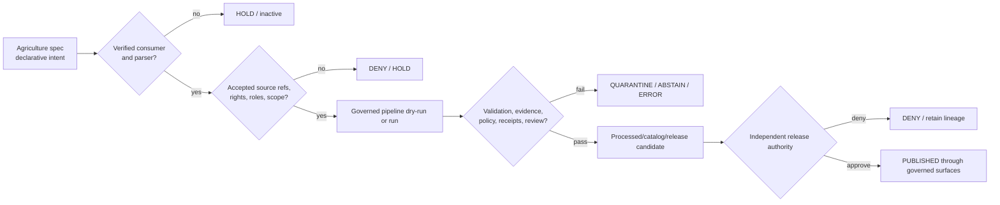

<!-- [KFM_META_BLOCK_V2]
doc_id: kfm://doc/pipeline-specs-agriculture-readme
title: pipeline_specs/agriculture/ — Governed Agriculture Pipeline Specification Boundary
type: readme
version: v0.2
status: draft; repository-grounded; placeholder-spec-only
owners: OWNER_TBD — Pipeline-spec steward · Agriculture steward · Pipeline owner · Source steward · Evidence steward · Policy/sensitivity steward · Validation steward · Release steward · Docs steward
created: 2026-06-13
updated: 2026-07-15
supersedes: v0.1
policy_label: public; pipeline-specs; agriculture; declarative-only; source-role-aware; aggregate-default; field-operator-deny-by-default; no-secrets; no-live-activation; no-public-path; release-gated
current_path: pipeline_specs/agriculture/README.md
truth_posture: CONFIRMED current target and parent pipeline-spec contracts, direct Agriculture spec lane, nested compatibility guardrail, placeholder nass_quickstats spec and source record, draft executable-pipeline README, draft contract/schema/policy indexes, README-backed QuickStats fixture lane without verified payloads, docstring-only NASS tests, placeholder domain workflow, and placeholder CODEOWNERS / PROPOSED future accepted Agriculture spec schema and consumer-bound profiles / UNKNOWN parser, spec registry, consumer discovery, executable binding, schedule engine, source activation, runtime behavior, substantive CI enforcement, receipt emission, release integration, and production use / NEEDS VERIFICATION owners, canonical spec schema and ID vocabulary, accepted source descriptors and connector path, source roles and rights, lifecycle-state enum, required gate and receipt vocabulary, aggregation thresholds, field/operator sensitivity profiles, fixture payloads, executable tests, validator ownership, correction handling, and rollback execution
evidence_snapshot:
  repository: bartytime4life/Kansas-Frontier-Matrix
  repository_id: "1059091169"
  visibility: public
  base_ref: main
  base_commit: 63a04206d7cb5c51b6fc45caf684c1c731cc177d
  prior_blob: 3ed966a37f9ddad5acda0dbcb25d229724a89b6d
  direct_lane_files:
    - pipeline_specs/agriculture/README.md
    - pipeline_specs/agriculture/nass_quickstats.yaml
  compatibility_lane: pipeline_specs/domains/agriculture/README.md
  workflow_posture: domain-agriculture is pull-request-triggered TODO scaffolding
related:
  - ../README.md
  - ../domains/agriculture/README.md
  - ./nass_quickstats.yaml
  - ../../docs/doctrine/directory-rules.md
  - ../../docs/domains/agriculture/README.md
  - ../../docs/domains/agriculture/PIPELINE.md
  - ../../docs/domains/agriculture/CANONICAL_PATHS.md
  - ../../docs/sources/catalog/usda/usda-nass-quickstats.md
  - ../../pipelines/domains/agriculture/README.md
  - ../../connectors/nass/README.md
  - ../../data/registry/sources/agriculture/nass_quickstats.yaml
  - ../../contracts/domains/agriculture/README.md
  - ../../schemas/contracts/v1/domains/agriculture/README.md
  - ../../policy/domains/agriculture/README.md
  - ../../tests/domains/agriculture/README.md
  - ../../tests/domains/agriculture/test_nass_aggregate_only.py
  - ../../tests/domains/agriculture/test_policy_denial_field_level_nass.py
  - ../../fixtures/domains/agriculture/nass_quickstats/README.md
  - ../../.github/workflows/domain-agriculture.yml
  - ../../.github/CODEOWNERS
notes:
  - "v0.2 replaces planning-only inventory with commit-pinned repository evidence and identifies nass_quickstats.yaml as a placeholder rather than an executable or complete declarative profile."
  - "The nested pipeline_specs/domains/agriculture/ lane is repository-present and explicitly declares itself a compatibility guardrail; this README does not create an alias, migrate files, or upgrade that path."
  - "This revision preserves the v0.1 pipeline_specs-versus-pipelines split, lifecycle, gate, source-role, evidence, receipt, sensitivity, release, correction, and rollback intent while removing unverified proposed-file trees from the current-state presentation."
  - "No executable pipeline spec, source record, connector, schema, contract, policy, fixture payload, test implementation, workflow, lifecycle object, receipt, proof, release object, runtime behavior, or public artifact is created or modified."
[/KFM_META_BLOCK_V2] -->

<a id="top"></a>

# Governed Agriculture Pipeline Specification Boundary

`pipeline_specs/agriculture/`

> Declarative Agriculture run-intent boundary. A file here may describe **what** a verified pipeline should run, against which admitted sources, through which lifecycle and governance gates. It does not implement the pipeline, activate a source, prove freshness, create evidence, approve release, or publish an Agriculture product.


**Quick links:** [Purpose](#purpose) · [Authority](#authority-and-anti-collapse) · [Status](#current-status) · [Placement](#repository-fit-and-path-drift) · [Inventory](#current-lane-inventory) · [QuickStats](#nass-quickstats-placeholder) · [Scope](#agriculture-specification-scope) · [File contract](#minimum-specification-contract) · [Sources](#source-role-rights-and-activation) · [Lifecycle](#lifecycle-gates-and-finite-failures) · [Sensitivity](#aggregation-field-and-operator-sensitivity) · [Validation](#validation-and-enforceability) · [Review](#review-and-change-discipline) · [Done](#definition-of-done-for-an-active-specification) · [Rollback](#rollback-correction-and-deactivation) · [Backlog](#open-verification-register) · [Evidence](#evidence-ledger)

> [!IMPORTANT]
> **Evidence snapshot:** `main@63a04206d7cb5c51b6fc45caf684c1c731cc177d`  
> **Target blob before this revision:** `3ed966a37f9ddad5acda0dbcb25d229724a89b6d`  
> **Observed direct lane:** this README plus one placeholder file, [`nass_quickstats.yaml`](./nass_quickstats.yaml)  
> **Activation:** not established; path or file presence activates nothing

> [!CAUTION]
> QuickStats aggregate statistics are not field observations, a schedule is not freshness proof, a valid YAML file is not a valid run, a successful run is not an `EvidenceBundle`, and a release-ready flag is not release approval. Field-level, operator-resolved, private-parcel-adjacent, or rights-unclear Agriculture outputs fail closed for public exact exposure.

---

## Purpose

`pipeline_specs/agriculture/` is the direct Agriculture segment under the `pipeline_specs/` responsibility root.

It may hold reviewed declarative profiles that bind:

- a stable Agriculture specification identity and version;
- a named executable consumer under `pipelines/` or another accepted implementation lane;
- admitted source-descriptor references and permitted source roles;
- lifecycle input, output, quarantine, and no-op behavior;
- cadence and source-specific freshness-profile references;
- schema, contract, policy, evidence, validation, and review prerequisites;
- required run, transform, validation, aggregation, redaction, and release-readiness receipts;
- public-safe aggregation or generalization obligations;
- release-handoff, correction, deactivation, and rollback expectations.

It must not:

- fetch NASS, NRCS, NASA, NOAA, Mesonet, or other source systems;
- contain credentials or deployment-only values;
- execute transforms or write lifecycle state;
- invent source role, rights, units, identities, thresholds, or policy;
- turn aggregate, modeled, candidate, or administrative material into observation truth;
- approve an Agriculture claim, `EvidenceBundle`, catalog record, layer, release, or publication;
- become a public API, UI, map, export, or AI truth surface.

### Audience

- pipeline-spec and Agriculture maintainers;
- connector, pipeline, source-registry, schema, contract, policy, evidence, validation, and release stewards;
- sensitivity, privacy, rights, aggregation, and cross-lane reviewers;
- reviewers resolving direct-lane versus compatibility-lane drift;
- maintainers preparing fixture-first, no-network Agriculture proof slices.

[Back to top](#top)

---

## Authority and anti-collapse

### Responsibility split

```text
pipeline_specs/agriculture/           = declarative run intent: WHAT should run
pipelines/domains/agriculture/        = executable Agriculture transforms: HOW it runs
connectors/<accepted-source>/         = source-specific fetch and RAW/QUARANTINE admission
data/registry/sources/agriculture/    = source identity, role, rights, cadence, activation
contracts/domains/agriculture/        = Agriculture object meaning
schemas/contracts/v1/domains/agriculture/ = machine-checkable shape
policy/domains/agriculture/           = Agriculture admissibility and obligations
tests/ + fixtures/                    = enforceability proof and synthetic examples
data/                                 = lifecycle records, receipts, proofs, catalog, publication
release/                              = release, correction, withdrawal, and rollback decisions
```

| Concern | Authority here |
|---|---|
| Pipeline intent and profile selection | **Supporting declarative authority**, only after a schema, owner, consumer, and validation path are accepted. |
| Executable behavior | **None.** Implementation belongs under `pipelines/` or another verified implementation root. |
| Source admission or activation | **None.** Specs reference accepted decisions; they do not make them. |
| Agriculture object meaning or shape | **None.** Contracts and schemas remain authoritative. |
| Source role, rights, cadence, or freshness | **None.** A spec may select accepted profiles; it cannot invent or waive them. |
| Evidence or claim truth | **None.** A spec can require evidence closure; it cannot create it. |
| Policy or sensitivity | **None.** A spec can require a `PolicyDecision` or obligation; it cannot approve exposure. |
| Lifecycle transition | **None by itself.** A governed executable process performs transitions. |
| Release, correction, or rollback | **None.** A spec can declare prerequisites and targets only. |
| Public API/UI/map/AI | **None.** Public clients use governed APIs and released artifacts. |

### Disallowed collapses

```text
spec file                -> executable pipeline
spec path                -> active consumer binding
source path              -> admitted SourceDescriptor
source list              -> source authority
schedule                 -> current-source proof
schema pass              -> data validation pass
spec validation          -> pipeline run success
pipeline run success     -> EvidenceBundle closure
aggregation requested    -> AggregationReceipt
catalog requested        -> catalog closure
release_ready: true      -> ReleaseManifest or approval
rollback profile         -> rollback execution
public profile           -> public publication
generated summary        -> evidence
```

A spec may **require** a gate. It does not satisfy the gate by naming it.

[Back to top](#top)

---

## Current status

### Repository snapshot

| Field | Value |
|---|---|
| Repository | `bartytime4life/Kansas-Frontier-Matrix` |
| Repository ID | `1059091169` |
| Visibility | public |
| Base ref | `main` |
| Base commit | `63a04206d7cb5c51b6fc45caf684c1c731cc177d` |
| Prior target blob | `3ed966a37f9ddad5acda0dbcb25d229724a89b6d` |
| Direct Agriculture spec lane | `pipeline_specs/agriculture/` |
| Compatibility guardrail | `pipeline_specs/domains/agriculture/README.md` |
| Current direct spec payload | `nass_quickstats.yaml` — placeholder only |
| Current domain workflow | `.github/workflows/domain-agriculture.yml` — TODO echo scaffold |

### Maturity matrix

| Surface | Repository evidence | Safe status |
|---|---|---:|
| Root contract | `pipeline_specs/README.md` defines declarative **what** versus executable **how**. | **CONFIRMED** |
| Direct Agriculture lane | This README and `nass_quickstats.yaml` are repository-present. | **CONFIRMED** |
| Nested Agriculture lane | README explicitly says compatibility/guardrail only and points here. | **CONFIRMED guardrail** |
| QuickStats spec | Eight-line file with `status`, `path`, one docs pointer, and placeholder note. | **PLACEHOLDER / NOT ACTIVE** |
| QuickStats source record | Same placeholder shape under `data/registry/sources/agriculture/`. | **PLACEHOLDER / NOT ADMITTED** |
| NASS connector | README-backed coordination across three conflicting connector paths; no live connector established by its bounded review. | **PLACEMENT CONFLICT / NOT ACTIVE** |
| Agriculture executable pipeline | Rich README contract exists; concrete execution remains unverified. | **DOCUMENTED / IMPLEMENTATION UNKNOWN** |
| Agriculture contracts | Draft semantic-contract index; object coverage incomplete. | **DRAFT / NEEDS VERIFICATION** |
| Agriculture schemas | Draft index; one `aggregation_receipt.schema.json` scaffold and child indexes are reported. | **PARTIAL SCAFFOLD** |
| Agriculture policy | Draft lane; concrete rules, bundle syntax, tests, CI, and runtime enforcement unverified. | **DRAFT / ENFORCEMENT UNKNOWN** |
| QuickStats fixtures | README-backed lane; no direct payload inventory verified in its authoring pass. | **DOCUMENTED / PAYLOADS UNVERIFIED** |
| NASS tests | Two Python files contain docstrings only. | **PLACEHOLDER / NOT EXECUTABLE** |
| Pipeline-spec-specific tests | Bounded search did not surface `tests/pipeline_specs/agriculture/`. | **NOT FOUND IN BOUNDED SEARCH** |
| Pipeline-spec-specific fixtures | Bounded search did not surface `fixtures/pipeline_specs/agriculture/`. | **NOT FOUND IN BOUNDED SEARCH** |
| Domain workflow | Pull-request-triggered jobs only echo TODO commands. | **CI SCAFFOLD, NOT ENFORCEMENT** |
| CODEOWNERS | Wildcard placeholder; no Agriculture pipeline-spec rule. | **OWNER ENFORCEMENT UNKNOWN** |
| Runtime, release, publication | No binding or production evidence established by inspected files. | **UNKNOWN / NOT AUTHORIZED** |

Repository presence is evidence of files, not of complete behavior. A differently named parser, registry, test, fixture, or consumer may exist outside the bounded searches; those possibilities remain `UNKNOWN`.

[Back to top](#top)

---

## Repository fit and path drift

Directory Rules place declarative pipeline configuration under `pipeline_specs/` and executable pipeline logic under `pipelines/`. The root README's current recommended shape names the direct domain form:

```text
pipeline_specs/agriculture/
```

The repository also contains:

```text
pipeline_specs/domains/agriculture/README.md
```

That nested README explicitly classifies itself as a **compatibility/guardrail path**, not a second spec home.

### Current path contract

| Path | Role | New authoritative specs? |
|---|---|---:|
| `pipeline_specs/agriculture/` | Current direct Agriculture declarative-spec lane. | **Yes, after acceptance gates close.** |
| `pipeline_specs/domains/agriculture/` | Compatibility, migration, and anti-drift guardrail. | **No by default.** |
| `pipelines/domains/agriculture/` | Executable Agriculture pipeline implementation. | **Code only; not declarative spec authority.** |

This README does not accept an ADR, remove the compatibility lane, migrate files, or declare the root layout permanently settled. It records current repository evidence and preserves the rule that only one Agriculture spec tree may be authoritative.

### Required drift behavior

- Do not copy a spec into both Agriculture paths.
- Do not create precedence rules between duplicate specs.
- Do not treat the nested path as an alias that a loader scans automatically.
- If an actual spec appears under the compatibility lane, hold it, record drift, and migrate through review.
- If a future ADR changes the layout, update the root README, both Agriculture READMEs, loaders, tests, references, migration records, and rollback plan together.

[Back to top](#top)

---

## Current lane inventory

Bounded repository evidence supports this direct shape:

```text
pipeline_specs/agriculture/
├── README.md
└── nass_quickstats.yaml
```

Related guardrail:

```text
pipeline_specs/domains/agriculture/
└── README.md
```

This is not a recursive Git-tree proof of ignored files, other branches, generated material, or external deployment state.

### Current files

| File | Observed content | Authority consequence |
|---|---|---|
| [`README.md`](./README.md) | Lane contract. | Documentation only; cannot activate or execute. |
| [`nass_quickstats.yaml`](./nass_quickstats.yaml) | Placeholder metadata with no accepted declarative run contract. | Must remain inactive; do not infer parser, consumer, schedule, source activation, or release readiness. |

### Proposed profile families—not current inventory

The v0.1 README listed proposed lifecycle and sublane files such as `ingest.yaml`, `normalize.yaml`, `validate.yaml`, `catalog.yaml`, `publish.yaml`, `rollback.yaml`, `cropland.yaml`, and `irrigation.yaml`. Those names remain possible design candidates, not repository facts and not a required one-file-per-stage architecture.

Future splitting should follow an accepted spec schema and actual consumer needs. Do not create files merely to match an illustrative tree.

[Back to top](#top)

---

## NASS QuickStats placeholder

Current content of `nass_quickstats.yaml` records only:

- `status: PROPOSED`;
- its repository path;
- `docs/domains/agriculture/VERIFICATION_BACKLOG.md` as a source-doc pointer;
- a note saying it was created as a placeholder.

It does **not** currently establish:

| Missing contract surface | Why it matters |
|---|---|
| Stable `spec_id` and schema version | Required for deterministic identity and parsing. |
| Owner and review state | Required before activation or maintenance claims. |
| Intended pipeline consumer | Required to bind **what** to a verified **how**. |
| Connector/source-descriptor refs | Required before source scope or activation can be reasoned about. |
| Source role and permitted claims | QuickStats aggregate semantics must not become field truth. |
| Query/product scope | Required to bound commodity, geography, time, statistic, and aggregation unit. |
| Rights/attribution profile | Required before retrieval, redistribution, or display. |
| Lifecycle input/output states | Required to prevent stage skipping. |
| Cadence/freshness profile | Required to distinguish schedule from observed freshness. |
| Schema/contract/policy refs | Required to bind meaning, shape, and admissibility. |
| Validation and finite failures | Required for fail-closed behavior. |
| Required receipts and evidence | Required for provenance and claim support. |
| Aggregation/sensitivity obligations | Required to prevent field/operator inference. |
| Dry-run/no-network fixture refs | Required before live execution. |
| Deactivation, correction, and rollback | Required for reversible change. |
| Release handoff | Required to keep spec intent separate from release authority. |

The file must be treated as **documentation-derived scaffolding**, not a source activation record, complete specification, executable profile, or release candidate.

A future substantive QuickStats spec should be fixture-first and aggregate-only. It must not include a live API key, private query, operator identity, field geometry, or unrestricted endpoint binding.

[Back to top](#top)

---

## Agriculture specification scope

A future accepted spec may describe one bounded Agriculture run profile. Candidate responsibilities include:

- aggregate crop-statistics processing;
- crop progress or condition context;
- cropland/crop-cover candidates;
- crop rotation or land-use context;
- aggregate yield observations;
- irrigation context;
- conservation-practice context;
- soil-crop suitability candidates;
- vegetation, drought, pest, or stress indicators;
- agricultural-economy aggregates;
- source-change watcher or dry-run profiles;
- catalog/triplet and release-readiness handoffs.

### Domain anti-collapse matrix

| Input or candidate | Must not become | Required specification posture |
|---|---|---|
| NASS QuickStats aggregate cell | Field, parcel, or operator observation | Declare aggregate role, geography, period, statistic, source descriptor, and field-level denial. |
| Crop-progress aggregate | Individual field condition | Preserve reporting unit, time, source role, uncertainty, and aggregate support. |
| Cropland classification | Confirmed crop or ownership truth | Preserve model/classification role, source vintage, class map, resolution, and uncertainty. |
| Field candidate | Confirmed field boundary, parcel, or operator identity | Candidate-only; restricted by default; require review and public-safe transformation. |
| Yield aggregate | Farm or field yield | Preserve aggregation unit and source support; deny operator-resolvable inference. |
| Irrigation link | Water-right, ownership, or observed water-use proof | Preserve Hydrology/People-Land ownership and cross-lane evidence. |
| Soil-crop suitability | Observation of actual crop performance | Interpretive derivative with method, scale, uncertainty, evidence, and abstention. |
| Stress indicator | Regulatory finding, emergency alert, or crop-loss proof | Derived context only; preserve source role, method, time, and limitations. |
| Watcher event | Source admission, RAW capture, or publication | Candidate notification only; non-publisher. |
| Synthetic fixture | Real source record or evidence | Label synthetic on every surface and prohibit promotion. |

A spec must name cross-lane dependencies without absorbing their truth. Soil owns soil semantics; Hydrology owns water observations and flood context; Atmosphere/Air owns weather and air observations; Hazards owns event and warning context; People/Land owns ownership, parcel, and living-person claims.

[Back to top](#top)

---

## Minimum specification contract

Exact keys remain `PROPOSED` until an accepted pipeline-spec schema and parser are verified. Every active Agriculture spec should nevertheless carry equivalent information.

| Contract area | Minimum information |
|---|---|
| Identity | Stable `spec_id`, version, status, domain, profile family, owner, reviewers, and supersession state. |
| Intended consumer | Exact executable pipeline/module path, supported spec version, parser entrypoint, and load mode. |
| Binding | Explicit selection mechanism; file presence and directory scanning must not activate a run. |
| Source scope | Accepted `SourceDescriptor` refs, connector/registry decision refs, source roles, permitted claims, products, geographic/time scope, and exclusions. |
| Rights | Rights, license, attribution, access, rate-limit, redistribution, and retention profile refs. |
| Query or product scope | Commodity/product/statistic/unit/geography/period/classification details as applicable; no unbounded source query. |
| Lifecycle | Allowed input state, intended output state, quarantine route, no-op behavior, and forbidden transitions. |
| Time/freshness | Source time, observed/effective time, retrieval time, expected cadence, stale/partial/unavailable behavior, and accepted profile ref. |
| Meaning and shape | Exact semantic-contract and machine-schema refs; no copied authority. |
| Policy and sensitivity | Accepted policy bundle/profile refs, sensitivity tier, field/operator/private-join posture, public-safe transform obligations, and review requirements. |
| Evidence | EvidenceRef/EvidenceBundle requirements for every claim-bearing output. |
| Validation | Spec-shape, source-ref, schema, domain, lifecycle, source-role, rights, aggregation, sensitivity, no-network, negative-case, and output-root checks. |
| Finite failures | Deterministic `HOLD`, `ABSTAIN`, `DENY`, `ERROR`, `QUARANTINE`, or no-op behavior; exact enum remains governed elsewhere. |
| Receipts | Required `RunReceipt`, intake/transform/validation, aggregation/redaction, source-vintage, release-readiness, or rollback-readiness refs as applicable. |
| Outputs | Allowed output families and canonical responsibility/lifecycle roots; no beside-the-spec output. |
| Dry-run | Synthetic fixture refs, expected outputs, no-network default, and side-effect prohibition. |
| Release handoff | Release-candidate inputs, required evidence/policy/review state, correction path, and rollback target; no self-approval. |
| Deactivation | How selection is disabled without deleting history or changing source state. |
| Migration | Compatible versions, old/new keys, owner, deadline, removal condition, and rollback. |
| Integrity | Canonical digest/spec hash posture once accepted tooling exists. |

### Illustrative—not active—shape

```yaml
schema_version: <ACCEPTED_PIPELINE_SPEC_SCHEMA>
spec_id: agriculture.<BOUNDED_PROFILE>
version: 0.1.0
status: draft
owner: <PIPELINE_SPEC_OWNER>

consumer:
  pipeline_ref: pipelines/domains/agriculture/<VERIFIED_LANE>
  parser_ref: <VERIFIED_PARSER>
  activation: explicit_only

sources:
  descriptor_refs:
    - <ACCEPTED_SOURCE_DESCRIPTOR_REF>
  allowed_roles:
    - aggregate

scope:
  product: <BOUNDED_PRODUCT>
  geography: <AGGREGATION_UNIT>
  time: <BOUNDED_PERIOD>

lifecycle:
  input_state: RAW
  output_state: WORK
  quarantine_on_failure: true

requirements:
  schema_refs: []
  contract_refs: []
  policy_refs: []
  fixture_refs: []
  evidence_bundle_required: true
  aggregation_receipt_required: true
  review_required: true
  release_ready: false

failure:
  unresolved_rights: DENY
  ambiguous_scope: HOLD
  stale_source: ABSTAIN
  field_or_operator_inference: DENY
```

This example is a review aid. It is not the canonical schema, a parser contract, or an activation instruction.

[Back to top](#top)

---

## Source role, rights, and activation

### Source references

A spec may reference only source records whose path, identity, role, rights, cadence, sensitivity, and activation posture have been reviewed. A filename is not an accepted `SourceDescriptor`.

The current QuickStats source record is a placeholder. The current NASS connector documentation reports three competing connector README paths and no verified live connector. Therefore:

- `nass_quickstats.yaml` must remain inactive;
- a spec must not pick a connector path by convenience;
- no API credential or endpoint binding belongs in this lane;
- source rights, attribution, product limits, cadence, and permitted claims remain `NEEDS VERIFICATION`;
- a future activation decision must be separately auditable;
- connector output remains limited to governed RAW or QUARANTINE intake;
- connectors and watchers remain non-publishers.

### Role rules

New Agriculture specs should use only an accepted source-role vocabulary. They must not invent aliases or upgrade role through parsing, schedule, model confidence, or successful execution.

At minimum, a spec must distinguish when material is:

- aggregate;
- observed;
- modeled or classified;
- administrative;
- candidate;
- synthetic;
- regulatory or official context owned by another lane.

Exact role enums and mappings remain `NEEDS VERIFICATION`.

### Rights and credentials

Never commit:

- NASS or other API keys;
- private endpoints, signed URLs, session tokens, or account identifiers;
- private farm/operator records;
- exact field or parcel joins;
- restricted source samples;
- deployment hostnames or secret-manager references that reveal protected structure;
- live query strings whose scope or terms have not been reviewed.

Use placeholders and external secret/deployment mechanisms. A spec may name the required credential *class* or local binding key only after the security and consumer contract is verified.

[Back to top](#top)

---

## Lifecycle, gates, and finite failures

The canonical lifecycle remains:

```text
Pre-RAW signal
  -> RAW
  -> WORK / QUARANTINE
  -> PROCESSED
  -> CATALOG / TRIPLET
  -> PUBLISHED
```

A spec declares permitted transitions and prerequisites. It never performs promotion by itself.



### Required gate families

Every non-trivial spec should declare or mark not applicable:

1. **Identity gate** — stable spec identity, version, owner, status, and supersession.
2. **Binding gate** — verified parser and executable consumer.
3. **Source gate** — accepted descriptor refs, roles, permitted claims, rights, and activation.
4. **Scope gate** — bounded product, geography, time, statistics/classes, and exclusions.
5. **Lifecycle gate** — legal input/output states, quarantine route, and stage-skip denial.
6. **Shape/meaning gate** — canonical schema and contract refs.
7. **Freshness gate** — accepted source-specific cadence/stale profile, not a universal default.
8. **Validation gate** — spec, source, data, geometry, temporal, aggregate, sensitivity, and negative checks.
9. **Evidence gate** — resolvable support for claim-bearing outputs.
10. **Policy/sensitivity gate** — rights, field/operator exposure, private joins, aggregation, redaction, and review.
11. **Receipt gate** — required process and transformation memory.
12. **Release-handoff gate** — independent release prerequisites, correction path, and rollback target.
13. **Failure/no-op gate** — deterministic behavior when no material change exists or support is unresolved.

### Finite failure behavior

| Condition | Required behavior |
|---|---|
| Missing or malformed spec | Error or inactive hold; no fallback execution. |
| Unsupported spec version | Hold with migration guidance. |
| Unknown consequential key | Reject or hold; never silently ignore. |
| Missing owner or consumer | Inactive hold. |
| Unresolved compatibility-path duplicate | Hold and record drift. |
| Missing/placeholder source descriptor | No live run; fixture-only documentation path. |
| Connector placement unresolved | Hold source binding; do not choose a path by precedence. |
| Missing or conflicting source role | Deny or hold. |
| Rights or terms unresolved | Deny live/public use or hold for review. |
| QuickStats used as field/operator truth | Deny. |
| Aggregate scope missing | Deny or quarantine. |
| Field/operator/private-join sensitivity unresolved | Restrict, deny, or hold. |
| Stale, partial, or unavailable source | Preserve state; abstain or hold as the accepted profile requires. |
| Schema/contract/policy ref unresolved | Hold. |
| Required fixture/test absent | Dry-run or activation blocked. |
| Validation failure | Quarantine or error; no promotion. |
| Evidence closure absent | Abstain from claim-bearing output. |
| Receipt requirement unmet | Promotion/release handoff blocked. |
| Release authority absent | Candidate only; no publication. |
| Rollback target absent | Activation or release-handoff blocked. |
| Network access during no-network validation | Error. |
| Directory presence triggers run | Error and consumer correction. |

No failure path may widen exposure, upgrade source role, invent freshness, skip lifecycle stages, suppress qualifiers, create field/operator truth, or self-authorize release.

[Back to top](#top)

---

## Aggregation, field, and operator sensitivity

Agriculture specifications are high-impact when they can resolve fields, operators, parcels, production, water use, conservation practices, yields, infrastructure, or private economic activity.

### Default posture

- Public aggregate outputs may be eligible only after rights, evidence, validation, aggregation, policy, review, release, correction, and rollback requirements close.
- Field candidates remain candidates and are restricted by default.
- Operator-resolved or private-parcel-adjacent material is denied by default for public exact exposure.
- NASS aggregate products must not support field/operator inference.
- A visual style, hidden property, zoom limit, clustering rule, or UI omission is not a sensitivity transform.
- Aggregation, redaction, generalization, suppression, or delay must be governed, deterministic, receipt-backed, and applied before public artifact creation.
- Cross-lane joins use the most restrictive applicable rule.

### Reconstruction risk

A future spec and its tests should consider:

- small-area or low-count aggregates;
- differencing across runs or releases;
- repeated queries with changing filters;
- field/parcel geometry joins;
- commodity/time combinations that identify an operator;
- water-right, irrigation, soil, infrastructure, ownership, or market joins;
- alternate identifiers and filenames;
- cached outputs, tiles, exports, screenshots, and downstream copies;
- temporal changes that reveal suppressed detail.

A spec cannot set ad hoc aggregation thresholds. It may select only a reviewed profile and must preserve the resulting obligation and receipt references.

[Back to top](#top)

---

## Validation and enforceability

### Documentation validation for this revision

This README update should prove only:

- the current target, direct placeholder spec, compatibility guardrail, and adjacent repository surfaces were inspected;
- current versus proposed paths are distinguished;
- no executable spec, source binding, credential, private record, lifecycle output, or release object was added;
- relative links and anchors resolve;
- YAML examples are clearly illustrative;
- aggregate/source-role, field/operator sensitivity, lifecycle, evidence, policy, receipt, release, correction, and rollback boundaries remain visible.

### Current enforcement boundary

The repository's `domain-agriculture` workflow currently contains TODO echo steps. The two inspected NASS Agriculture tests contain docstrings only. The QuickStats fixture README reports no verified payload inventory during its authoring pass. These files are scaffolds and documentation—not substantive enforcement.

### Required checks before an active spec

A future active Agriculture spec needs deterministic, no-network checks for:

1. YAML syntax, duplicate keys, and unknown keys;
2. accepted spec schema and version;
3. stable spec identity and owner;
4. parser and executable consumer binding;
5. no auto-discovery by directory presence;
6. source-descriptor resolution and activation state;
7. connector placement and output-root contract;
8. source role, permitted claims, rights, and attribution;
9. bounded product/query scope;
10. lifecycle state and stage-transition legality;
11. contract and schema references;
12. time, cadence, stale, partial, unavailable, corrected, and superseded states;
13. aggregate unit, geometry support, statistics/classes, and no-data handling;
14. field/operator/private-join denial and reconstruction risk;
15. cross-lane ownership and most-restrictive-rule behavior;
16. evidence, policy, review, receipt, correction, and rollback requirements;
17. allowed output roots and no beside-the-spec outputs;
18. fixture-first, no-network dry-run;
19. finite negative outcomes;
20. proof that spec presence, workflow success, or release-ready flags publish nothing.

### Essential negative cases

- placeholder source record accepted as active;
- unresolved connector path selected by first match;
- QuickStats aggregate treated as field truth;
- field or operator output exposed without reviewed aggregation;
- rights-unclear source run allowed;
- schedule treated as freshness evidence;
- stale or unavailable source treated as zero/normal;
- aggregate unit or time period omitted;
- candidate classification relabeled as observation;
- cross-lane ownership collapsed;
- unknown key ignored;
- invalid spec falls back to permissive defaults;
- network call during fixture/no-network validation;
- pipeline writes directly to PUBLISHED or release state;
- release-ready flag treated as release approval;
- rollback target omitted.

A workflow that echoes TODO text may pass as a scaffold but cannot be cited as proof that these checks run.

[Back to top](#top)

---

## Review and change discipline

### Review burden

README-only changes require:

- pipeline-spec/documentation review;
- Agriculture domain review;
- Directory Rules and compatibility-lane review.

An active or materially changed spec additionally requires the applicable:

- intended pipeline consumer owner;
- source and connector steward;
- source-rights/attribution reviewer;
- schema and contract stewards;
- Agriculture policy, sensitivity, privacy, and aggregation reviewers;
- evidence and citation reviewer;
- validation/test/fixture reviewer;
- lifecycle and data steward;
- release, correction, and rollback reviewer;
- security reviewer;
- cross-lane owners for Soil, Hydrology, Atmosphere/Air, Hazards, People/Land, Habitat, or Infrastructure dependencies.

`CODEOWNERS` is currently a placeholder and does not establish this review coverage.

### Safe change sequence

1. Pin the repository head and target blob.
2. Inspect the root pipeline-spec contract, direct lane, compatibility lane, executable pipeline, domain docs, and affected source/fixture/test surfaces.
3. Identify whether the change is documentation, placeholder, draft spec, active spec, migration, deprecation, or rollback.
4. Verify the canonical path and prevent duplicate authority.
5. Verify spec schema, parser, consumer, owner, and activation mechanism.
6. Verify source descriptors, connector path, roles, rights, scope, cadence, and sensitivity.
7. Verify lifecycle states, gates, evidence, policy, receipts, outputs, correction, and rollback.
8. Run no-network positive and negative tests.
9. Inspect the diff for credentials, private records, field/operator clues, unbounded queries, and permissive defaults.
10. Re-read the committed branch content and verify changed paths.
11. Keep the PR draft until substantive checks and required human review close.

### Change-budget limits

A spec PR should not silently:

- implement or move pipeline code;
- choose among conflicting connector paths;
- activate a source or schedule;
- add credentials or deployment bindings;
- define a new source-role vocabulary;
- change contract, schema, policy, receipt, or lifecycle authority;
- invent aggregation thresholds;
- change field/operator/private-join exposure rules;
- publish or alter release state;
- create parallel spec, registry, receipt, proof, or release homes.

Split those changes into governed, reversible PRs.

[Back to top](#top)

---

## Definition of done for an active specification

- [ ] Stable spec schema and version are accepted.
- [ ] `spec_id`, owner, reviewers, status, and supersession are explicit.
- [ ] Exact parser and executable consumer are verified.
- [ ] Activation is explicit; directory presence and recursive scanning are not activation.
- [ ] Compatibility-lane duplication is absent or governed by migration.
- [ ] SourceDescriptor refs resolve to reviewed records, not placeholders.
- [ ] Connector path and RAW/QUARANTINE output contract are resolved.
- [ ] Source roles and permitted claims are explicit.
- [ ] Rights, terms, attribution, access, retention, and rate limits are reviewed.
- [ ] Product/query scope is bounded.
- [ ] Lifecycle input/output/quarantine/no-op behavior is explicit.
- [ ] Contract, schema, policy, fixture, test, and validator refs resolve.
- [ ] Time and accepted freshness profile are explicit.
- [ ] Aggregate unit, spatial support, statistics/classes, units, and no-data semantics are explicit.
- [ ] Field/operator/private-join exposure defaults fail closed.
- [ ] Cross-lane ownership and most-restrictive sensitivity behavior are tested.
- [ ] Evidence and citation requirements are explicit.
- [ ] Required process, aggregation/redaction, validation, review, and release-readiness receipts are explicit.
- [ ] Output families and canonical roots are explicit.
- [ ] Fixture-first no-network positive and negative tests pass.
- [ ] Substantive CI or a documented local verification path exists.
- [ ] Missing, malformed, stale, partial, unavailable, denied, quarantined, and no-op cases are tested.
- [ ] Deactivation, migration, correction, withdrawal, and rollback are explicit.
- [ ] Release handoff remains independent and cannot be self-approved.
- [ ] No secret, private source material, real operator detail, or protected geometry is committed.
- [ ] Remote read-back and final changed-path inventory are verified.

The current `nass_quickstats.yaml` does not meet this definition and remains a placeholder.

[Back to top](#top)

---

## Rollback, correction, and deactivation

### README-only rollback

Before merge, close the pull request and abandon the scoped branch.

After merge, use a transparent revert commit or revert pull request restoring the prior README. Do not rewrite shared history.

### Active-spec rollback

A future active-spec rollback must be broader than Git:

1. stop selecting the affected spec through its verified binding;
2. stop or hold scheduled/new runs;
3. preserve the faulty spec, parser version, consumer version, source refs, inputs, receipts, validation reports, and outputs for review;
4. identify affected RAW, WORK, QUARANTINE, PROCESSED, CATALOG/TRIPLET, release-candidate, published, cache, tile, export, screenshot, and narrative artifacts;
5. assess source-role, rights, aggregate, field/operator, cross-lane, temporal, and evidence failures;
6. restore a prior known-good spec or safe disabled state;
7. re-run deterministic no-network and negative checks;
8. quarantine or withdraw affected derivatives;
9. create required correction, supersession, withdrawal, redaction/aggregation, release, or rollback records in their canonical homes;
10. verify that no public or downstream surface continues to serve an unauthorized derivative.

A Git revert does not retract source requests, revoke credentials, undo lifecycle writes, invalidate caches, withdraw published products, or establish correction lineage by itself.

[Back to top](#top)

---

## Open verification register

| ID | Verification item | Evidence needed |
|---|---|---|
| `PIPE-SPEC-AG-001` | Canonical pipeline-spec schema and version | Accepted schema/ADR, parser, fixtures, validator, and CI. |
| `PIPE-SPEC-AG-002` | Spec identity and registry convention | Accepted `spec_id` rules and registry/index behavior. |
| `PIPE-SPEC-AG-003` | Final direct versus nested Agriculture path posture | Directory Rules/ADR/migration evidence; current nested lane is guardrail only. |
| `PIPE-SPEC-AG-004` | Active Agriculture parser and consumer | Exact code path, supported versions, load mechanism, tests, and owner. |
| `PIPE-SPEC-AG-005` | QuickStats source descriptor admission | Substantive descriptor, role, rights, cadence, sensitivity, review, and activation decision. |
| `PIPE-SPEC-AG-006` | Canonical NASS connector path | Accepted placement decision among current repository candidates plus migration/rollback. |
| `PIPE-SPEC-AG-007` | QuickStats product/query scope | Reviewed product, statistic, geography, time, unit, no-data, and permitted-claims contract. |
| `PIPE-SPEC-AG-008` | Source rights, attribution, and credentials | Rights review, security binding, rate-limit and retention posture. |
| `PIPE-SPEC-AG-009` | Lifecycle and finite outcome enums | Accepted shared contracts and tests. |
| `PIPE-SPEC-AG-010` | Gate and receipt vocabulary | Accepted object families, schemas, validators, and release-handoff contract. |
| `PIPE-SPEC-AG-011` | Aggregation and field/operator sensitivity profiles | Policy, thresholds, receipts, negative fixtures, reconstruction tests, and reviewers. |
| `PIPE-SPEC-AG-012` | QuickStats fixture payloads | Synthetic valid/invalid/golden files and consumer tests. |
| `PIPE-SPEC-AG-013` | Executable NASS tests | Real test bodies, expected failures, runner, and pass results. |
| `PIPE-SPEC-AG-014` | Pipeline-spec-specific test/fixture homes | Verified tree or accepted use of domain-level lanes. |
| `PIPE-SPEC-AG-015` | Substantive CI | Workflow steps that run spec/schema/source/negative checks and block on failure. |
| `PIPE-SPEC-AG-016` | First active Agriculture profile | Steward decision: aggregate QuickStats, crop progress, cropland, irrigation, conservation, or another bounded slice. |
| `PIPE-SPEC-AG-017` | Release, correction, and rollback integration | Verified independent release objects, tests, and rollback drill. |
| `PIPE-SPEC-AG-018` | CODEOWNERS and separation of duties | Accepted reviewer teams/rules and branch protection evidence. |

[Back to top](#top)

---

## Evidence ledger

| Evidence | Status | Supports | Limits |
|---|---:|---|---|
| Prior target README | **CONFIRMED** | v0.1 lane intent, proposed gates, profile families, and anti-collapse rules. | Stale inventory; claimed concrete spec filenames remained proposed. |
| [`../README.md`](../README.md) | **CONFIRMED root contract** | `pipeline_specs/` owns declarative **what**; `pipelines/` owns executable **how**. | Does not prove Agriculture consumer wiring. |
| [`./nass_quickstats.yaml`](./nass_quickstats.yaml) | **CONFIRMED placeholder** | One direct Agriculture spec-shaped file exists. | Contains no substantive run contract. |
| [`../domains/agriculture/README.md`](../domains/agriculture/README.md) | **CONFIRMED guardrail** | Nested Agriculture path declares compatibility-only posture and points here. | Does not settle whether the guardrail should later be removed. |
| [`../../pipelines/domains/agriculture/README.md`](../../pipelines/domains/agriculture/README.md) | **CONFIRMED documentation / implementation unknown** | Executable-lane boundary, source families, lifecycle, aggregation and sensitivity posture. | Concrete code, runs, and outputs unverified. |
| [`../../docs/domains/agriculture/README.md`](../../docs/domains/agriculture/README.md) | **CONFIRMED domain document** | Twelve object families, aggregate/public-safe posture, field/operator deny-default boundary. | Older authoring metadata says repo not mounted; implementation claims require current evidence. |
| [`../../docs/domains/agriculture/PIPELINE.md`](../../docs/domains/agriculture/PIPELINE.md) | **CONFIRMED lifecycle reference / proposed wiring** | Lifecycle, gates, receipts, non-publisher invariants, and sensitive-domain routing. | Concrete files and CI were proposed in its authoring session. |
| [`../../docs/doctrine/directory-rules.md`](../../docs/doctrine/directory-rules.md) | **CONFIRMED doctrine** | Responsibility-root placement, lifecycle, anti-parallel-authority, and migration discipline. | Concrete child paths still require repository verification. |
| [`../../data/registry/sources/agriculture/nass_quickstats.yaml`](../../data/registry/sources/agriculture/nass_quickstats.yaml) | **CONFIRMED placeholder** | Source-record filename exists. | Not a substantive `SourceDescriptor` or activation decision. |
| [`../../connectors/nass/README.md`](../../connectors/nass/README.md) | **CONFIRMED repository-grounded documentation** | NASS connector placement conflict, placeholder source/spec/tests, inactive fail-closed posture. | Bounded inspection; live implementation remains unproven. |
| [`../../schemas/contracts/v1/domains/agriculture/README.md`](../../schemas/contracts/v1/domains/agriculture/README.md) | **CONFIRMED draft index** | One aggregation-receipt schema scaffold and child indexes are reported. | Full schema coverage and validator/CI support unverified. |
| [`../../policy/domains/agriculture/README.md`](../../policy/domains/agriculture/README.md) | **CONFIRMED draft policy index** | Deny-default field/operator posture and required obligations. | Concrete policy implementation/runtime enforcement unverified. |
| [`../../tests/domains/agriculture/README.md`](../../tests/domains/agriculture/README.md) | **CONFIRMED test index** | Expected aggregate, policy, schema, evidence, release, and rollback proof families. | Executable module inventory and pass results unverified. |
| NASS test files | **CONFIRMED placeholders** | Expected aggregate-only and field-level-denial test names. | Docstrings only; no test functions. |
| [`../../fixtures/domains/agriculture/nass_quickstats/README.md`](../../fixtures/domains/agriculture/nass_quickstats/README.md) | **CONFIRMED fixture documentation** | Aggregate source-role and negative-case fixture contract. | No direct payload inventory verified in its authoring pass. |
| [`../../.github/workflows/domain-agriculture.yml`](../../.github/workflows/domain-agriculture.yml) | **CONFIRMED CI scaffold** | PR/push trigger and intended Agriculture jobs. | Jobs only echo TODO commands. |
| [`../../.github/CODEOWNERS`](../../.github/CODEOWNERS) | **CONFIRMED placeholder** | Wildcard and selected root/domain review placeholders. | No Agriculture pipeline-spec rule or verified team existence. |

[Back to top](#top)

---

## No-loss assessment

v0.2 retains the useful v0.1 content:

- `pipeline_specs/` versus `pipelines/` separation;
- declarative profile purpose;
- source, lifecycle, evidence, validation, sensitivity, receipt, release, correction, and rollback requirements;
- anti-collapse rules;
- Agriculture profile-family possibilities;
- fixture-first and no-network expectations;
- future definition of done and open questions.

It changes the presentation where current evidence is stronger:

- the lane is no longer described as having no spec file; it has one placeholder;
- the nested Agriculture spec path is identified as a repository-present compatibility guardrail;
- proposed filenames are no longer presented as a recommended current tree;
- QuickStats, source-record, connector, test, fixture, schema, policy, and workflow maturity is stated from inspected files;
- duplicate, outdated, and generic prose is consolidated into enforceable tables and finite failure behavior.

No v0.1 implementation claim was upgraded without repository evidence.

[Back to top](#top)

---

## Safe language

Use:

- “declarative Agriculture pipeline specification”;
- “current direct lane”;
- “nested compatibility guardrail”;
- “QuickStats placeholder; inactive”;
- “aggregate source role; not field truth”;
- “intended consumer — `NEEDS VERIFICATION`”;
- “source descriptor placeholder; not admitted”;
- “fixture-first, no-network”;
- “candidate output; release not approved”;
- “field/operator exposure denied by default”;
- “spec requires a gate; it does not satisfy the gate”;
- “bounded search did not find pipeline-spec-specific tests.”

Avoid:

- “the QuickStats pipeline runs from this file”;
- “this spec activates NASS”;
- “the schedule proves the data is current”;
- “the source record is admitted”;
- “CI validates this spec” when jobs echo TODO commands;
- “QuickStats provides field-level observations”;
- “release_ready publishes the output”;
- “a successful run proves the claim”;
- “the nested path is an equivalent spec home”;
- “this directory contains the complete Agriculture pipeline configuration.”

[Back to top](#top)

---

## Last reviewed

**2026-07-15**, against `main@63a04206d7cb5c51b6fc45caf684c1c731cc177d`.

Review again before changing `nass_quickstats.yaml`, adding another spec, accepting a schema, binding a parser/consumer, choosing a connector path, activating a source or schedule, adding credentials, defining aggregation/sensitivity profiles, emitting lifecycle outputs, wiring substantive CI, or handing an output to release.

[Back to top](#top)
