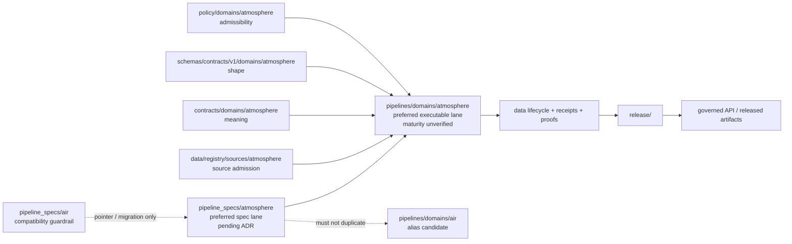
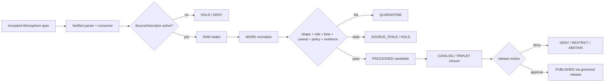

<!-- [KFM_META_BLOCK_V2]
doc_id: kfm://doc/pipeline-specs-air-readme
title: pipeline_specs/air/ — Air Pipeline Specification Compatibility Guardrail
type: readme
version: v0.2
status: draft; repository-grounded; compatibility-guardrail; no-active-specs-established
owners: OWNER_TBD — Pipeline-spec steward · Atmosphere/Air steward · Pipeline owner · Source steward · Evidence steward · Policy/sensitivity steward · Validation steward · Release steward · Docs steward
created: 2026-06-13
updated: 2026-07-15
supersedes: v0.1
policy_label: public; pipeline-specs; air; atmosphere; compatibility-only; declarative-only; no-secrets; no-live-activation; no-public-path; not-emergency-alerting; official-authority-redirection; release-gated
current_path: pipeline_specs/air/README.md
truth_posture: CONFIRMED current target, pipeline_specs root contract, sibling pipeline_specs/atmosphere README, both Air and Atmosphere executable-lane READMEs, Atmosphere source-registry lane, Atmosphere contract/schema/test documentation, 33-line policy scaffold, TODO-only domain-atmosphere workflow, placeholder CODEOWNERS, and bounded searches that surfaced no concrete Air or Atmosphere pipeline-spec file beyond lane READMEs / PROPOSED treating this Air path as a compatibility and migration guardrail while Atmosphere remains the preferred documentation-aligned spec lane / UNKNOWN canonical slug decision, accepted pipeline-spec schema, parser, registry, consumer discovery, executable binding, schedules, source activation, runtime behavior, substantive CI enforcement, receipt emission, release integration, and production use / NEEDS VERIFICATION owners, ADR or lane-register resolution, exact lane inventory beyond bounded search, accepted source descriptors, source roles and rights, temporal and stale-state vocabularies, caveat profiles, fixture payloads, executable tests, validator ownership, correction handling, and rollback execution
evidence_snapshot:
  repository: bartytime4life/Kansas-Frontier-Matrix
  repository_id: "1059091169"
  visibility: public
  base_ref: main
  base_commit: 7862e6c8b3c724839be32bbc465dc159e443e424
  prior_blob: 19ec77b8da7b608e1e2ff79a5e07c262d64b6eb5
  requested_lane: pipeline_specs/air/
  preferred_documentation_lane: pipeline_specs/atmosphere/
  implementation_alias_lane: pipelines/domains/air/
  preferred_implementation_lane: pipelines/domains/atmosphere/
  workflow_posture: domain-atmosphere is pull-request-triggered TODO scaffolding
related:
  - ../README.md
  - ../atmosphere/README.md
  - ../../docs/doctrine/directory-rules.md
  - ../../docs/domains/atmosphere/README.md
  - ../../docs/domains/atmosphere/PIPELINE.md
  - ../../docs/domains/atmosphere/CANONICAL_PATHS.md
  - ../../docs/domains/atmosphere/SOURCE_REGISTRY.md
  - ../../pipelines/domains/air/README.md
  - ../../pipelines/domains/atmosphere/README.md
  - ../../data/registry/sources/atmosphere/README.md
  - ../../contracts/domains/atmosphere/README.md
  - ../../schemas/contracts/v1/domains/atmosphere/README.md
  - ../../policy/domains/atmosphere/README.md
  - ../../tests/domains/atmosphere/policy-deny/README.md
  - ../../tests/domains/atmosphere/no-network/README.md
  - ../../.github/workflows/domain-atmosphere.yml
  - ../../.github/CODEOWNERS
notes:
  - "v0.2 replaces a full-spec-lane presentation with a repository-grounded compatibility guardrail because both air and atmosphere lanes exist while current documentation prefers atmosphere and marks air as an alias candidate."
  - "This revision does not resolve the canonical slug, delete a path, migrate a specification, create an alias implementation, or authorize automatic discovery from either lane."
  - "The v0.1 what-versus-how, lifecycle, source-role, caveat, evidence, receipt, advisory, release, correction, and rollback controls are preserved as requirements for any future accepted Atmosphere specification."
  - "No executable spec, source record, connector, schema, contract, policy, fixture, test, workflow, lifecycle object, receipt, proof, release object, runtime behavior, alerting behavior, or public artifact is created or modified."
[/KFM_META_BLOCK_V2] -->

<a id="top"></a>

# Air Pipeline Specification Compatibility Guardrail

`pipeline_specs/air/`

> Compatibility and migration guardrail for the `air` pipeline-spec slug. Current repository documentation aligns new Atmosphere/Air/Climate declarative specifications with [`pipeline_specs/atmosphere/`](../atmosphere/README.md). This path must not become a second authority tree without an accepted ADR or governed migration.


**Quick links:** [Purpose](#purpose) · [Status](#current-status) · [Authority](#authority-and-anti-collapse) · [Placement](#repository-fit-and-slug-drift) · [Inventory](#current-inspected-inventory) · [Compatibility contract](#compatibility-lane-contract) · [Atmosphere spec requirements](#requirements-for-any-future-atmosphere-specification) · [Source roles](#source-role-rights-time-and-activation) · [Knowledge boundaries](#atmosphere-knowledge-character-boundaries) · [Lifecycle](#lifecycle-gates-and-finite-failures) · [Validation](#validation-and-enforceability) · [Review](#review-migration-and-change-discipline) · [Rollback](#rollback-correction-and-deactivation) · [Backlog](#open-verification-register) · [Evidence](#evidence-ledger)

> [!IMPORTANT]
> **Evidence snapshot:** `main@7862e6c8b3c724839be32bbc465dc159e443e424`  
> **Target blob before this revision:** `19ec77b8da7b608e1e2ff79a5e07c262d64b6eb5`  
> **Bounded direct-lane result:** repository search surfaced this README and no concrete `pipeline_specs/air/` profile  
> **Preferred documentation alignment:** `pipeline_specs/atmosphere/`  
> **Activation:** path or file presence activates nothing

> [!CAUTION]
> AQI is not pollutant concentration, AOD is not PM2.5, a model field is not an observation, an advisory reference is not an official warning, a schedule is not freshness proof, and a passing README or YAML check is not release approval. KFM is not an emergency-alerting or life-safety issuing authority.

---

## Purpose

`pipeline_specs/air/` exists to prevent slug drift from becoming parallel authority.

The repository currently contains both:

```text
pipeline_specs/air/
pipeline_specs/atmosphere/
```

The parent pipeline-spec README describes `air/` as an air-quality-oriented alias/lane and `atmosphere/` as the weather, climate, and atmospheric profile lane. The Atmosphere sibling README and both executable-lane READMEs use `atmosphere` as the preferred documentation-aligned lane while marking `air` as unresolved or transitional.

Therefore, the safe current use of this directory is limited to:

- preserving an inspectable compatibility boundary;
- pointing maintainers to the preferred Atmosphere spec lane;
- recording migration, deprecation, or redirect posture if a governed decision is made;
- preventing duplicate specifications, IDs, schedules, consumers, or release semantics;
- preserving the v0.1 safety and governance requirements for any future accepted specification.

It must not:

- host a second copy of an Atmosphere specification for convenience;
- define a new canonical slug by README assertion;
- activate a source, schedule, connector, parser, consumer, pipeline, or release path;
- contain credentials, private endpoints, operational tokens, or source payloads;
- turn modeled, indexed, aggregate, advisory, or contextual products into observations;
- replace Hazards or an official issuing authority for warning or life-safety information;
- become a public API, UI, map, tile, export, or generated-answer truth source.

### Audience

- pipeline-spec and Atmosphere/Air maintainers;
- domain, source, contract, schema, policy, evidence, validation, release, and docs stewards;
- reviewers resolving the `air` versus `atmosphere` slug;
- maintainers planning compatibility, migration, deprecation, or path-lint work;
- reviewers verifying that Atmosphere specifications remain deterministic, caveat-aware, time-aware, no-network-testable, and release-gated.

[Back to top](#top)

---

## Current status

### Safe conclusion

`pipeline_specs/air/` is a repository-present documentation lane. It is not established as the canonical Atmosphere spec home, and no active or consumer-bound Air specification was established by the bounded inspection.

| Capability or artifact | Status | Evidence-bounded conclusion |
|---|---:|---|
| Requested README | `CONFIRMED` | `pipeline_specs/air/README.md` exists. |
| Concrete Air spec profile | `NOT ESTABLISHED` | Bounded repository search surfaced no Air profile beyond this README. |
| Atmosphere sibling spec lane | `CONFIRMED README` | `pipeline_specs/atmosphere/README.md` exists and describes Atmosphere as preferred pending ADR. |
| Canonical slug | `CONFLICTED / NEEDS VERIFICATION` | Both slugs exist; no accepted ADR or lane-register decision was verified. |
| Air executable lane | `README-BACKED ALIAS CANDIDATE` | `pipelines/domains/air/README.md` marks itself unresolved/transitional. |
| Atmosphere executable lane | `README-BACKED PREFERRED LANE` | `pipelines/domains/atmosphere/README.md` is documentation-aligned but executable maturity remains unproven. |
| Source registry | `DRAFT CONTROL LANE` | `data/registry/sources/atmosphere/README.md` exists; concrete descriptor inventory and runtime readers remain unverified. |
| Semantic contracts | `PARTIAL / DRAFT` | Atmosphere contract README lists object contracts and warns against a parallel `air` contract home. |
| Schema lane | `PARTIAL SCAFFOLD` | Atmosphere schema README reports one proposed decision-envelope schema and incomplete coverage. |
| Policy lane | `GREENFIELD SCAFFOLD` | `policy/domains/atmosphere/README.md` is a 33-line proposed scaffold. |
| Domain tests | `README-BACKED SCAFFOLDS` | Atmosphere negative/no-network/schema lanes are documented; executable implementations remain unverified. |
| Pipeline-spec-specific tests | `NOT ESTABLISHED` | Bounded search surfaced no `tests/pipeline_specs/air/` or `tests/pipeline_specs/atmosphere/` implementation. |
| Pipeline-spec fixtures | `NOT ESTABLISHED` | Bounded search surfaced no spec-specific Air fixture lane. |
| Domain workflow | `TODO SCAFFOLD` | All `domain-atmosphere` jobs execute `echo TODO ...`. |
| CODEOWNERS | `PLACEHOLDER` | No pipeline-spec or Atmosphere owner rule is present. |
| Runtime, release, publication | `UNKNOWN / NOT AUTHORIZED HERE` | No parser, schedule, run, receipt, release, or public behavior is proven by this README. |

### Truth labels used here

| Label | Meaning in this README |
|---|---|
| `CONFIRMED` | Directly inspected in the pinned repository snapshot or verified by the performed branch/read-back checks. |
| `PROPOSED` | A safe design or migration posture not accepted as implemented authority. |
| `NEEDS VERIFICATION` | Checkable but not sufficiently verified to act as fact. |
| `UNKNOWN` | Not resolved by the bounded inspection. |

[Back to top](#top)

---

## Authority and anti-collapse

### Root responsibility

```text
pipeline_specs/  = declarative run intent: what may run and under which gates
pipelines/       = executable behavior: how processing occurs
data/            = lifecycle state, registries, receipts, proofs, catalog/triplets, published artifacts
release/         = release, correction, supersession, withdrawal, and rollback authority
apps/            = governed serving surfaces; never direct access to internal specs or stores
```

A pipeline spec may require a gate. It cannot satisfy the gate merely by naming it.

### Disallowed collapses

```text
README or path existence       -> active specification
compatibility path             -> canonical authority
same profile under two slugs   -> harmless duplication
valid YAML                     -> valid governed run
source ref                     -> source admission
schedule                       -> freshness proof
successful run                 -> ValidationReport or EvidenceBundle
catalog profile                -> catalog truth
publish-ready flag             -> ReleaseManifest or publication
AQI                            -> pollutant concentration
AOD or smoke context           -> PM2.5 observation
model / forecast field         -> observation
low-cost sensor value          -> regulatory observation
advisory context               -> official warning or life-safety instruction
generated explanation          -> evidence
```

### Authority graph



The dashed edges are compatibility or requirement relationships, not proof of implemented consumers.

[Back to top](#top)

---

## Repository fit and slug drift

### Directory Rules basis

This path remains under `pipeline_specs/`, the responsibility root for declarative pipeline configuration. The domain appears as a segment under that root; no new root is created.

The conflict is not the responsibility root. It is the child slug:

```text
air
atmosphere
```

Current repository evidence consistently uses `atmosphere` for:

- domain documentation;
- source registry;
- contracts;
- schemas;
- policy path;
- lifecycle lanes;
- release lanes;
- the preferred executable pipeline README;
- the preferred declarative pipeline-spec README.

`air` remains present in spec and executable roots as an unresolved alias candidate.

### Interim placement rule

Until an accepted ADR, lane register, or migration record resolves the slug:

1. place new authoritative Atmosphere declarative specs under `pipeline_specs/atmosphere/`, subject to schema and consumer verification;
2. keep `pipeline_specs/air/` documentation-only;
3. do not duplicate a profile under both slugs;
4. do not configure automatic discovery of both trees without duplicate-ID and precedence controls;
5. do not move or delete either path in a README-only change;
6. record any future migration with source and destination paths, consumer updates, tests, receipts, rollback target, and deprecation date;
7. preserve object meaning, source role, temporal meaning, evidence, policy, caveat, and release semantics across any slug change.

### What would require an ADR or governed migration

- making `air` canonical instead of `atmosphere`;
- making both paths independently authoritative;
- deleting or renaming either lane;
- adding auto-discovery or precedence across both lanes;
- changing spec IDs because of the slug;
- moving schemas, contracts, policy, registry, data, tests, fixtures, or release paths to a new slug;
- introducing compatibility shims that alter runtime behavior.

[Back to top](#top)

---

## Current inspected inventory

### Direct and sibling spec lanes

```text
pipeline_specs/
├── README.md
├── air/
│   └── README.md                 # this compatibility guardrail
└── atmosphere/
    └── README.md                 # preferred documentation-aligned spec lane
```

This is a bounded evidence statement derived from repository search and direct reads. It is not a guarantee that no differently named or unindexed file exists.

### Adjacent implementation and authority surfaces

```text
pipelines/domains/
├── air/README.md                 # alias candidate / transitional documentation
└── atmosphere/
    ├── README.md                 # preferred implementation documentation
    ├── normalize/README.md       # README-backed stage lane
    ├── validate/README.md        # README-backed stage lane
    ├── catalog/README.md         # README-backed stage lane
    └── publish/README.md         # README-backed stage lane

contracts/domains/atmosphere/     # semantic-contract lane; partial/draft
schemas/contracts/v1/domains/atmosphere/
                                 # draft schema index; proposed scaffold coverage
policy/domains/atmosphere/        # greenfield policy scaffold
data/registry/sources/atmosphere/ # draft source-admission control lane
tests/domains/atmosphere/         # README-backed test lanes; implementation unverified
```

### Inventory limits

The inspection did not establish:

- a canonical pipeline-spec JSON/YAML schema;
- a parser or loader;
- a spec registry;
- a consumer that resolves a `spec_id`;
- any accepted Air or Atmosphere spec profile;
- any schedule or event trigger;
- any source activation;
- any emitted lifecycle data or receipts from a spec;
- any released Atmosphere product;
- any production deployment using either spec path.

[Back to top](#top)

---

## Compatibility lane contract

### What may remain here

`pipeline_specs/air/` should contain only compatibility-oriented material unless governance changes the posture:

- this README;
- a deprecation notice;
- a migration note;
- a redirect or pointer manifest whose schema and consumer are accepted;
- a tombstone explaining where a moved spec now lives;
- an ADR link;
- a machine-checkable alias record only after precedence, identity, validation, and rollback behavior are accepted and tested.

### What must not be added here by default

- an independent Air ingest, normalize, validate, catalog, triplet, publish, rollback, or watcher spec;
- duplicate source-family profiles already represented under `pipeline_specs/atmosphere/`;
- executable Python, JavaScript, shell, SQL, Rego, or workflow logic;
- connector or source-client configuration;
- secrets or operational endpoints;
- source descriptors or source payloads;
- schemas, contracts, policy bundles, fixtures, tests, lifecycle objects, receipts, proofs, or release records;
- public serving configuration that reads this path directly.

### Compatibility pointer requirements

A future machine-readable pointer, if accepted, should be minimal and deterministic. It must include or resolve to:

- a stable alias identity;
- the canonical target `spec_id` and immutable version or content digest;
- the target path;
- status and deprecation date;
- the parser/consumer version that understands the pointer;
- duplicate-ID and cycle detection;
- explicit precedence behavior;
- migration receipt or review record;
- rollback target;
- no inline source credentials, policy decisions, evidence payloads, or release approval.

No pointer format is accepted by this README. The shape remains `PROPOSED / NEEDS VERIFICATION`.

[Back to top](#top)

---

## Requirements for any future Atmosphere specification

Authoritative future specifications should normally be placed under `pipeline_specs/atmosphere/` while the current posture stands.

Each non-trivial specification should declare or explicitly mark not applicable:

1. **Identity** — stable `spec_id`, version, status, owner, domain, profile family, and content digest.
2. **Consumer binding** — exact parser/loader and executable target; no implicit directory scanning.
3. **Source admission** — stable SourceDescriptor references, allowed source roles, rights, sensitivity, attribution, and withdrawal state.
4. **Temporal semantics** — observation time, issue time, valid/effective time, model run time, forecast hour, retrieval time, source vintage, expiration, and stale-state profile as applicable.
5. **Lifecycle** — allowed inputs, intended outputs, quarantine conditions, no-op behavior, and promotion prerequisites.
6. **Knowledge character** — observed, regulatory, modeled, aggregate, administrative, candidate, synthetic, context, or restricted posture where accepted.
7. **Caveats** — low-cost sensor, AQI, AOD, smoke, model, forecast, climate-normal, advisory, and method limitations.
8. **Evidence** — EvidenceRef and EvidenceBundle closure requirements for claim-bearing outputs.
9. **Validation** — schemas, validators, fixtures, expected finite outcomes, and blocker reason codes.
10. **Policy** — rights, sensitivity, official-authority redirection, admissibility, review, and public-safe representation obligations.
11. **Receipts** — run, intake, transform, validation, caveat, policy, evidence, release-readiness, correction, and rollback references as applicable.
12. **Release handoff** — required release inputs, correction path, supersession behavior, and rollback target.
13. **Security** — no secrets, credentials, private endpoints, or raw sensitive payloads in the spec.
14. **Change discipline** — compatibility window, migration instructions, consumer versioning, and deterministic rollback.

### Illustrative inactive shape

The following example is explanatory only. It is not an accepted schema and must not be saved as an active spec without schema and consumer approval.

```yaml
schema_version: NEEDS_VERIFICATION
spec_id: atmosphere.<profile>
version: 0.0.0-example
status: inactive_example
owner: OWNER_TBD
consumer:
  parser: NEEDS_VERIFICATION
  target_pipeline: pipelines/domains/atmosphere/<lane>
  auto_discovery: false
sources:
  descriptor_refs: []
  allowed_roles: []
time:
  freshness_profile_ref: NEEDS_VERIFICATION
  stale_behavior: HOLD
lifecycle:
  input_states: []
  intended_output_state: null
  quarantine_on_failure: true
requirements:
  evidence_bundle_required: true
  official_authority_redirect_required: true
  review_required: true
  receipts_required: []
release:
  permitted: false
  manifest_required: true
  rollback_target_required: true
anti_collapse:
  aqi_is_concentration: false
  aod_is_pm25: false
  model_is_observation: false
  advisory_is_kfm_warning: false
```

[Back to top](#top)

---

## Source role, rights, time, and activation

### Source admission is external to the spec

A specification may reference a SourceDescriptor. It must not create source authority by naming a source.

Before execution, each source reference must resolve to a reviewed record with at least:

- stable source identity and upstream authority;
- source role or knowledge character;
- rights, license, terms, attribution, and redistribution posture;
- sensitivity and restricted-join posture;
- method, parameter, units, spatial scale, and temporal scope;
- issue, observation, valid/effective, retrieval, model-run, forecast-hour, revision, and source-vintage fields as applicable;
- cadence and stale-state handling;
- correction, supersession, withdrawal, and rollback pointers;
- connector or intake binding outside the spec;
- reviewer and activation state.

### Candidate source families

Atmosphere specifications may eventually reference accepted records for:

- regulatory air-quality archives and station observations;
- public air-quality snapshots and AQI context;
- official weather observations, forecasts, and advisory references;
- Kansas Mesonet or other station-network observations;
- satellite aerosol, smoke, fire, and cloud-adjacent products;
- HRRR-Smoke-style or other model fields;
- climate normals and anomaly products;
- low-cost sensor networks;
- research or local monitoring projects;
- steward-curated historic material.

Naming a family does not establish a descriptor, endpoint, rights posture, activation decision, or successful run.

### Activation must be explicit

A future specification is active only when a governed activation record or accepted control-plane state identifies:

- the exact `spec_id` and version or digest;
- the exact consumer version;
- the source descriptors and their active states;
- the schedule or event trigger;
- the environment and secret references;
- the dry-run and no-network test evidence;
- the policy and review state;
- the deactivation and rollback mechanism.

Folder presence, merge status, a YAML filename, or a workflow success must not imply activation.

[Back to top](#top)

---

## Atmosphere knowledge-character boundaries

Atmosphere specifications are high-risk for semantic collapse. The following distinctions must survive source admission, transformation, cataloging, graph projection, public rendering, and generated explanation.

| Distinction | Required posture |
|---|---|
| AQI vs concentration | Preserve index definition, pollutant, averaging period, breakpoint method, reporting authority, units, and valid time. Never present AQI as concentration. |
| AOD vs PM2.5 | AOD is remotely sensed aerosol optical context. It is not a direct PM2.5 measurement without a governed, validated derivation. |
| Smoke context vs exposure | Smoke plumes, masks, detections, and model products are context. They are not individual exposure or health conclusions. |
| Model/forecast vs observation | Preserve model name, version, run time, forecast hour, inputs, uncertainty, and validation status. Never label a model field as observed. |
| Regulatory vs public snapshot | Preserve authority, QA status, revision, method, averaging period, and legal/regulatory scope. |
| Low-cost sensor vs regulatory monitor | Require calibration/correction profile, method, confidence, siting, owner/terms, caveats, and release limits. |
| Climate normal vs current condition | Preserve baseline period, method, scale, and revision. Do not substitute a normal or anomaly for a current observation. |
| Advisory context vs official instruction | Carry official issuer, issue/valid/expiration time, identifier, and redirect. KFM does not become the issuer. |
| Station metadata vs observation | Station existence, location, or network membership does not prove a current valid observation. |
| Aggregate vs point/place fact | Regional summaries and gridded products must not be collapsed into household, parcel, facility, station, or individual truth. |
| Context vs evidence | Reports, summaries, and generated text can aid interpretation but do not replace an EvidenceBundle. |

### Cross-lane ownership

- Hazards owns emergency-event and protective-action posture.
- Hydrology owns water observations and flood/water context.
- Agriculture owns crop and agricultural-impact claims.
- Habitat, Flora, and Fauna own ecological occurrence and habitat claims.
- Settlements/Infrastructure owns infrastructure-impact claims.

Atmosphere may supply governed context. It must not silently adopt another lane's canonical truth.

[Back to top](#top)

---

## Lifecycle gates and finite failures

The lifecycle remains:

```text
RAW -> WORK / QUARANTINE -> PROCESSED -> CATALOG / TRIPLET -> PUBLISHED
```

A specification can describe intended transitions. It cannot perform or approve them by itself.

### Required gate sequence



### Finite failure posture

A parser, validator, policy gate, or consumer should fail closed with a finite outcome or reason code. Candidate outcomes include:

- `INVALID_SPEC`;
- `UNRESOLVED_ALIAS`;
- `DUPLICATE_SPEC_ID`;
- `ALIAS_CYCLE`;
- `UNKNOWN_CONSUMER`;
- `SOURCE_NOT_ADMITTED`;
- `RIGHTS_UNRESOLVED`;
- `SOURCE_STALE`;
- `TEMPORAL_SCOPE_INVALID`;
- `KNOWLEDGE_CHARACTER_COLLAPSE`;
- `CAVEAT_MISSING`;
- `EVIDENCE_INCOMPLETE`;
- `POLICY_DENY`;
- `REVIEW_REQUIRED`;
- `RELEASE_BLOCKED`;
- `NO_MATERIAL_CHANGE`;
- `QUARANTINED`;
- `ERROR`.

This list is `PROPOSED`; the canonical vocabulary remains `NEEDS VERIFICATION`.

### No silent fallback

Consumers must not silently:

- load both Air and Atmosphere copies and choose by filesystem order;
- execute the newest file by modification time;
- substitute a stale source for a fresh one;
- downgrade missing caveats to warnings;
- convert a denied public product into an uncaveated summary;
- treat missing evidence as low confidence and publish anyway;
- bypass official-authority redirection because an advisory text is available.

[Back to top](#top)

---

## Validation and enforceability

### Documentation checks performed for this revision

- target blob and pinned main commit confirmed;
- parent and sibling spec contracts inspected;
- Air and Atmosphere executable-lane READMEs inspected;
- Atmosphere source-registry, contract, schema, policy, test-lane, workflow, and CODEOWNERS surfaces inspected;
- bounded searches performed for direct Air specs, Atmosphere specs, pipeline-spec tests, and pipeline-spec fixtures;
- Markdown structure, links, anchors, fences, Mermaid boundary, example YAML, and secret patterns checked locally;
- remote read-back and content hashes required before PR creation.

### Required future specification tests

A real Atmosphere spec should have deterministic, no-network tests covering:

1. accepted schema shape and required identity;
2. unknown field rejection or explicit extension behavior;
3. duplicate `spec_id` detection;
4. Air/Atmosphere alias cycle and precedence failure;
5. unknown parser or consumer rejection;
6. missing or inactive SourceDescriptor rejection;
7. rights, sensitivity, attribution, and withdrawal failures;
8. stale source and invalid time-window behavior;
9. AQI-versus-concentration denial;
10. AOD-versus-PM2.5 denial;
11. model-versus-observation denial;
12. low-cost-sensor caveat requirements;
13. advisory official-authority redirection;
14. lifecycle input/output and quarantine rules;
15. required receipts and evidence closure;
16. release-blocked behavior without approved manifest and rollback target;
17. no network or secret access in default validation;
18. deterministic digest and no-op behavior;
19. correction, supersession, deactivation, and rollback behavior.

### Evidence limits

A passing README, link check, YAML parser, schema parser, placeholder domain workflow, or dry-run echo is not proof that:

- a source is admitted;
- a pipeline ran correctly;
- output is current;
- evidence closed;
- policy allowed release;
- an advisory is official or current;
- a public product is safe;
- rollback works.

[Back to top](#top)

---

## Review, migration, and change discipline

### Review burden

Changes to this lane should require, at minimum:

- pipeline-spec steward;
- Atmosphere/Air domain steward;
- docs steward.

Additional review is required when a change touches or implies:

| Concern | Required reviewer posture |
|---|---|
| Canonical slug, alias, deletion, or migration | Governance/Directory Rules steward and ADR review. |
| Parser, consumer, schedule, or activation | Pipeline owner, operations/runtime reviewer, and security reviewer. |
| Source descriptors, endpoints, rights, or attribution | Source, rights, and sensitivity stewards. |
| AQI, health, advisory, or life-safety presentation | Policy reviewer and official-authority redirection review; Hazards liaison where applicable. |
| Schemas or contracts | Schema and contract stewards. |
| Evidence, receipts, catalog, release, correction, rollback | Evidence, validation, release, and rollback stewards. |
| Public API, map, tile, export, or AI surface | Governed API/UI reviewer plus policy and release review. |

### Migration checklist

Before moving or retiring this path:

- [ ] accepted decision record identifies canonical slug and reason;
- [ ] full repository inventory covers specs, parsers, imports, configs, tests, fixtures, data, receipts, releases, docs, and external references;
- [ ] canonical and compatibility paths are explicit;
- [ ] duplicate IDs and discovery precedence are tested;
- [ ] SourceDescriptor and consumer references are updated;
- [ ] generated and hand-authored docs are updated together;
- [ ] backward-compatibility window and cutoff date are recorded;
- [ ] migration and deprecation receipts are emitted where required;
- [ ] correction and public-reference impacts are reviewed;
- [ ] rollback target is content-addressed and tested;
- [ ] old path becomes pointer, tombstone, or removal according to the accepted plan;
- [ ] no parallel authority remains after the compatibility window.

### Documentation rule

When behavior changes materially, update this README, the preferred Atmosphere README, relevant executable-lane docs, tests, runbooks, and migration records in the same governed change or explain the staged plan.

[Back to top](#top)

---

## Definition of done

### This compatibility README

This README is complete for v0.2 when it:

- records the pinned repository evidence and prior blob;
- identifies this path as a compatibility guardrail rather than a second full spec authority;
- points to `pipeline_specs/atmosphere/` as the preferred documentation-aligned lane pending ADR;
- preserves the `pipeline_specs/` versus `pipelines/` boundary;
- preserves source-role, temporal, caveat, evidence, policy, lifecycle, receipt, advisory, release, correction, and rollback requirements;
- states that no active specification, parser, schedule, source, run, release, or public product is established;
- provides migration, validation, and rollback guidance;
- remains reversible by restoring the prior README.

### A future active Atmosphere specification

A future specification is not done until:

- [ ] accepted schema and stable identity exist;
- [ ] exact parser and executable consumer are version-bound;
- [ ] source descriptors are admitted and role/rights/time reviewed;
- [ ] all caveat and anti-collapse rules are explicit;
- [ ] no-network valid and invalid fixtures exist;
- [ ] executable tests prove finite failure behavior;
- [ ] lifecycle and quarantine behavior are enforced;
- [ ] evidence and receipt requirements are resolvable;
- [ ] policy and official-authority redirection are tested;
- [ ] owner and reviewer assignments are real;
- [ ] activation and deactivation are explicit;
- [ ] release handoff, correction, supersession, and rollback are tested;
- [ ] documentation matches actual behavior;
- [ ] the Air/Atmosphere slug relationship is resolved or safely compatibility-bound.

[Back to top](#top)

---

## Rollback, correction, and deactivation

### This README change

Before merge, rollback is to close the PR and abandon its branch.

After merge, restore the prior README through a transparent revert commit or revert PR. Remove the paired generated-work receipt only through the same visible revert. Do not rewrite shared history.

This README change does not activate runtime behavior, so no runtime or public rollback should be necessary for the documentation change itself.

### Future spec deactivation

A future active specification must support:

1. disabling schedule or event activation;
2. rejecting new runs for the affected digest;
3. preserving prior run receipts, source versions, evidence, and review state;
4. quarantining or holding affected derivatives;
5. identifying catalog, graph, tile, API, export, and generated-answer dependencies;
6. withdrawing, superseding, or correcting release artifacts through release authority;
7. restoring a known-good spec or disabled state;
8. re-running negative, stale-state, caveat, evidence, and policy tests;
9. verifying official-authority redirects and caches;
10. issuing correction and rollback records where public output was affected.

Rollback is a governed state transition, not a file copy.

[Back to top](#top)

---

## Open verification register

| ID | Question | Status | Closure evidence needed |
|---|---|---|---|
| `PIPE-SPEC-AIR-001` | Is `air` or `atmosphere` the accepted canonical domain/spec slug? | `NEEDS VERIFICATION / ADR` | Accepted ADR or lane-register decision. |
| `PIPE-SPEC-AIR-002` | Should `pipeline_specs/air/` remain, become a pointer/tombstone, or be removed? | `NEEDS VERIFICATION` | Migration plan, consumer inventory, compatibility policy, rollback. |
| `PIPE-SPEC-AIR-003` | What schema validates pipeline specifications? | `UNKNOWN` | Accepted schema, registry record, fixtures, validator, tests. |
| `PIPE-SPEC-AIR-004` | Which parser/loader and registry discover specs? | `UNKNOWN` | Code, configuration, tests, runtime evidence. |
| `PIPE-SPEC-AIR-005` | Are concrete specs present under Air or Atmosphere beyond bounded search results? | `NEEDS VERIFICATION` | Full recursive repository inventory. |
| `PIPE-SPEC-AIR-006` | Which source descriptors are admitted and active? | `NEEDS VERIFICATION` | Concrete descriptor records, rights/sensitivity review, activation record. |
| `PIPE-SPEC-AIR-007` | What source-role and knowledge-character vocabulary is canonical? | `NEEDS VERIFICATION` | Accepted contract/schema/vocabulary and tests. |
| `PIPE-SPEC-AIR-008` | What temporal and stale-state fields are mandatory per profile? | `NEEDS VERIFICATION` | Accepted temporal contract, source-specific profiles, tests. |
| `PIPE-SPEC-AIR-009` | Which caveat profiles are canonical for AQI, AOD, smoke, models, sensors, climate, and advisories? | `NEEDS VERIFICATION` | Policy/contract/schema definitions and negative tests. |
| `PIPE-SPEC-AIR-010` | Which pipeline-spec fixture and test homes are accepted? | `NEEDS VERIFICATION` | Directory decision, fixture inventory, test modules, CI. |
| `PIPE-SPEC-AIR-011` | Does any CI job substantively validate Atmosphere specs? | `UNKNOWN / NOT ESTABLISHED` | Non-TODO workflow, logs, tests, artifacts. |
| `PIPE-SPEC-AIR-012` | Who owns and reviews this path? | `NEEDS VERIFICATION` | CODEOWNERS and steward assignments. |
| `PIPE-SPEC-AIR-013` | How are activation, deactivation, correction, and rollback recorded? | `UNKNOWN` | Control-plane contract, receipts, runbook, drills. |
| `PIPE-SPEC-AIR-014` | How are official advisory redirects tested and kept current? | `NEEDS VERIFICATION` | Policy, fixtures, tests, source/freshness controls. |
| `PIPE-SPEC-AIR-015` | How are public products prevented from reading specs or canonical stores directly? | `NEEDS VERIFICATION` | Governed API contract, release manifests, integration tests. |

[Back to top](#top)

---

## Evidence ledger

| Evidence | Status | Supports | Limits |
|---|---|---|---|
| Prior `pipeline_specs/air/README.md` | `CONFIRMED` | Existing v0.1 what/how split, slug conflict, caveat gates, lifecycle, release, and rollback intent. | Presented a proposed full directory tree despite no verified concrete profiles. |
| `pipeline_specs/README.md` | `CONFIRMED` | Root owns declarative configuration; lists both `air/` and `atmosphere/`; labels Air alias-oriented and warns against parallel authority. | Does not itself resolve the slug or prove consumers. |
| `pipeline_specs/atmosphere/README.md` | `CONFIRMED DOC` | Treats Atmosphere as preferred spec lane and Air as alias candidate. | Concrete spec files, schema validation, CI, and activation remain unverified. |
| `pipelines/domains/air/README.md` | `CONFIRMED DOC` | Air executable path is unresolved/transitional and must not create parallel authority. | Does not prove executable code or runtime behavior. |
| `pipelines/domains/atmosphere/README.md` | `CONFIRMED DOC` | Preferred executable documentation lane; preserves source/evidence/policy/release boundaries. | Marks concrete behavior and CI as unverified. |
| `data/registry/sources/atmosphere/README.md` | `CONFIRMED DOC` | Atmosphere source-admission path, source-role distinctions, temporal/caveat controls, and official-authority redirection. | Concrete descriptor payload inventory and readers remain unverified. |
| `contracts/domains/atmosphere/README.md` | `CONFIRMED DOC` | Atmosphere semantic contract home and no-parallel-`air` contract warning. | Contract/schema completeness and enforcement remain partial. |
| `schemas/contracts/v1/domains/atmosphere/README.md` | `CONFIRMED DOC` | Draft schema lane; one proposed decision-envelope scaffold; incomplete coverage. | Does not define a pipeline-spec schema. |
| `policy/domains/atmosphere/README.md` | `CONFIRMED SCAFFOLD` | Policy path exists. | Thirty-three-line greenfield scaffold does not prove policy behavior. |
| `tests/domains/atmosphere/policy-deny/README.md` | `CONFIRMED DOC / SCAFFOLD` | Negative-case spine for AQI, AOD, model, sensor, advisory, freshness, and no-network boundaries. | Child implementation, fixtures, validators, bundles, and CI remain unverified. |
| `.github/workflows/domain-atmosphere.yml` | `CONFIRMED TODO SCAFFOLD` | Pull-request workflow exists. | Each job only echoes a TODO message; success is not validation proof. |
| `.github/CODEOWNERS` | `CONFIRMED PLACEHOLDER` | Repository has a placeholder ownership file. | No Air/Atmosphere or pipeline-spec ownership rule. |
| Bounded repository searches | `CONFIRMED SEARCH` | Surfaced the two spec READMEs and no spec-specific Air/Atmosphere test or fixture implementation. | Search is not a full recursive tree and can miss unindexed or differently named files. |

### No-loss assessment from v0.1

| v0.1 concern | v0.2 disposition |
|---|---|
| Declarative `pipeline_specs/` versus executable `pipelines/` | Preserved and strengthened. |
| Air versus Atmosphere slug conflict | Preserved, grounded in current repo evidence, and converted into a compatibility rule. |
| Source scopes and cadence/freshness | Preserved with explicit admission, temporal, stale-state, and activation requirements. |
| Low-cost sensor, model, AOD, AQI, smoke, and advisory caveats | Preserved and expanded into knowledge-character boundaries and negative tests. |
| Lifecycle and quarantine | Preserved with finite failure posture. |
| Evidence, review, receipts, release, correction, and rollback | Preserved and expanded. |
| Proposed directory/file trees | Removed from current-state presentation; future profiles point to the preferred Atmosphere lane and remain proposed. |
| Tests and fixtures | Preserved as requirements; current implementation gaps are explicitly stated. |
| Emergency/life-safety boundary | Preserved and strengthened with official-authority redirection. |

[Back to top](#top)

---

## Maintainer note

Keep `pipeline_specs/air/` documentation-only until governance resolves the slug or accepts a machine-readable compatibility contract. Do not add a second Atmosphere spec, executable code, source client, secret, schema, contract, policy rule, fixture, test, lifecycle object, receipt, proof, release record, public route, UI behavior, or generated summary authority here.

When an actual Atmosphere specification is ready, place it in the accepted spec lane, bind it to a verified parser and consumer, test it without network access, preserve source role and temporal meaning, require evidence and policy closure, redirect official advisories, and provide deactivation, correction, and rollback before activation.
