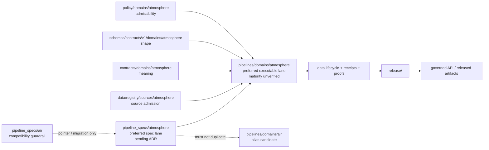
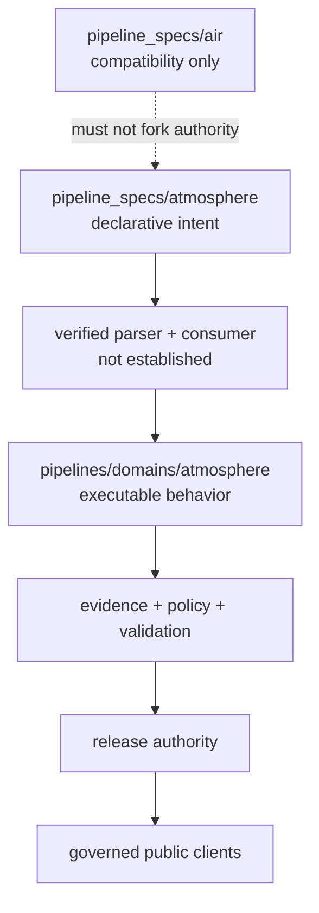
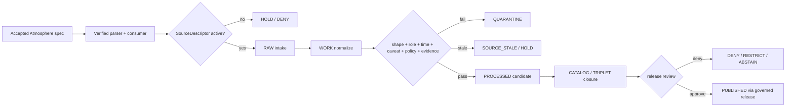

<!-- [KFM_META_BLOCK_V2]
doc_id: kfm://doc/pipeline-specs-air-readme
title: pipeline_specs/air/ — Air Pipeline Specification Compatibility Guardrail
type: readme
version: v0.3
status: draft; repository-grounded; compatibility-guardrail; no-active-specs-established
owners: OWNER_TBD — Pipeline-spec steward · Atmosphere/Air steward · Pipeline owner · Source steward · Evidence steward · Policy/sensitivity steward · Validation steward · Release steward · Docs steward
created: 2026-06-13
updated: 2026-08-12
supersedes: v0.2
policy_label: public; pipeline-specs; air; atmosphere; compatibility-only; declarative-only; no-secrets; no-live-activation; no-public-path; not-emergency-alerting; official-authority-redirection; release-gated
current_path: pipeline_specs/air/README.md
truth_posture: CONFIRMED accepted Directory Rules v2, exact Air and Atmosphere spec-lane inventories, proposed domain-lane projection, bounded executable Atmosphere CI, adjacent contracts/schemas/policy/fixtures/tests/validators, current source-record inventory, CODEOWNERS routing, and empty release-candidate lane / PROPOSED treating this Air path as a compatibility guardrail while Atmosphere remains the preferred stage-scaffold lane / UNKNOWN accepted pipeline-spec schema, parser, registry, scheduler, consumer binding, source activation, full policy evaluation, proof production, release integration, and production use / NEEDS VERIFICATION canonical slug decision, path-alias migration, independent stewards, source rights and activation, canonical failure vocabulary, spec-specific fixture and test homes, adjacent documentation drift, correction handling, and rollback execution
evidence_snapshot:
  repository: bartytime4life/Kansas-Frontier-Matrix
  repository_id: "1059091169"
  visibility: public
  base_ref: main
  base_commit: 96a550a3435b9ef02f5572a1a440eebd9f8ac26a
  base_tree: 9cfc5f3e09961b5306f13d6f6f66c38fca41176a
  prior_blob: 16a5096d5edcad9bbba51c87ef5f5d5521c2a0d6
  requested_lane: pipeline_specs/air/
  preferred_documentation_lane: pipeline_specs/atmosphere/
  implementation_alias_lane: pipelines/domains/air/
  preferred_implementation_lane: pipelines/domains/atmosphere/
  workflow_posture: selected synthetic Atmosphere checks execute; proof production and release dry-run remain on WORKFLOW_HOLD
related:
  - ../README.md
  - ../atmosphere/README.md
  - ../../docs/adr/ADR-0029-adopt-directory-governance-standard-v2.md
  - ../../docs/doctrine/directory-rules.md
  - ../../control_plane/root_registry.yaml
  - ../../control_plane/domain_lane_register.yaml
  - ../../control_plane/path_alias_register.yaml
  - ../../docs/domains/atmosphere/README.md
  - ../../docs/domains/atmosphere/PIPELINE.md
  - ../../docs/domains/atmosphere/CANONICAL_PATHS.md
  - ../../docs/domains/atmosphere/SOURCE_REGISTRY.md
  - ../../pipelines/domains/air/README.md
  - ../../pipelines/domains/atmosphere/README.md
  - ../../data/registry/sources/atmosphere/README.md
  - ../../contracts/domains/atmosphere/README.md
  - ../../schemas/contracts/v1/domains/atmosphere/README.md
  - ../../policy/domains/atmosphere/README.md
  - ../../fixtures/domains/atmosphere/README.md
  - ../../tests/domains/atmosphere/README.md
  - ../../validators/domains/atmosphere/README.md
  - ../../.github/workflows/domain-atmosphere.yml
  - ../../.github/CODEOWNERS
notes:
  - "v0.3 reconciles the compatibility guardrail with the complete current tree and the now-bounded executable Atmosphere workflow."
  - "Five Atmosphere YAML files are tracked, but each has an empty stages list and therefore remains inactive scaffolding."
  - "The proposed domain-lane projection records air as an Atmosphere alias; it does not create a filesystem alias, migration, parser rule, activation, or accepted canonical-slug decision."
  - "This revision does not resolve the slug, move or delete a path, create a spec, activate a source or schedule, or authorize release or publication."
  - "The what-versus-how, lifecycle, source-role, caveat, evidence, receipt, advisory, release, correction, and rollback controls remain requirements for any future accepted specification."
[/KFM_META_BLOCK_V2] -->

<a id="top"></a>

# Air Pipeline Specification Compatibility Guardrail

`pipeline_specs/air/`

> **One-line purpose.** This directory is the documentation-only compatibility boundary for the unresolved `air` pipeline-spec slug. New declarative Atmosphere work aligns with [`pipeline_specs/atmosphere/`](../atmosphere/README.md) unless an accepted decision establishes a different canonical path.

[](#current-status)
[](#current-status)
[](#current-inspected-inventory)
[](#authority-and-anti-collapse)
[](#lifecycle-gates-and-finite-failures)

**Quick links:** [Purpose](#purpose) · [Status](#current-status) · [Authority](#authority-and-anti-collapse) · [Placement](#repository-fit-and-slug-drift) · [Inventory](#current-inspected-inventory) · [Compatibility contract](#compatibility-lane-contract) · [Future spec](#requirements-for-any-future-atmosphere-specification) · [Source controls](#source-role-rights-time-and-activation) · [Knowledge boundaries](#atmosphere-knowledge-character-boundaries) · [Lifecycle](#lifecycle-gates-and-finite-failures) · [Validation](#validation-and-enforceability) · [Review](#review-migration-and-change-discipline) · [Rollback](#rollback-correction-and-deactivation) · [Open items](#open-verification-register) · [Evidence](#evidence-ledger)

> [!IMPORTANT]
> **Pinned evidence:** `main@96a550a3435b9ef02f5572a1a440eebd9f8ac26a` · tree `9cfc5f3e09961b5306f13d6f6f66c38fca41176a` · prior target blob `16a5096d5edcad9bbba51c87ef5f5d5521c2a0d6`  
> **Exact lane result:** `air/` contains only `.gitkeep` and this README. `atmosphere/` contains its sibling README plus five YAML scaffolds; every YAML file declares `stages: []`.  
> **Activation:** a path, YAML file, workflow pass, or documentation claim activates nothing.

> [!CAUTION]
> AQI is not pollutant concentration. AOD is not PM2.5. A model field is not an observation. An advisory reference is not an official warning. A schedule is not freshness proof. A passing YAML or CI check is not evidence closure or release approval. KFM is not an emergency-alerting or life-safety issuing authority.

---

## Purpose

`pipeline_specs/air/` prevents slug drift from becoming parallel authority.

The current repository carries two related names:

| Surface | Current role |
|---|---|
| [`pipeline_specs/air/`](./README.md) | Documentation-only compatibility guardrail; no declarative spec is tracked here. |
| [`pipeline_specs/atmosphere/`](../atmosphere/README.md) | Preferred stage-scaffold lane; its five YAML files are present but have no stages. |
| [`pipelines/domains/air/`](../../pipelines/domains/air/README.md) | Transitional executable-lane documentation; not a second implementation authority. |
| [`pipelines/domains/atmosphere/`](../../pipelines/domains/atmosphere/README.md) | Preferred executable documentation lane; current CI proves only selected synthetic profiles. |

The parent [pipeline-spec contract](../README.md) classifies Air as compatibility-oriented and Atmosphere as the preferred stage-scaffold lane. The [proposed Domain Lane Register](../../control_plane/domain_lane_register.yaml) projects `air` as an alias for `atmosphere`. The [Path Alias Register](../../control_plane/path_alias_register.yaml) does not establish a corresponding path alias. Those facts support a guardrail; they do not resolve the canonical slug.

Therefore, this directory may:

- preserve an inspectable compatibility boundary;
- direct maintainers to the preferred Atmosphere lane;
- record migration, deprecation, redirect, or tombstone posture after an accepted decision;
- prevent duplicate IDs, schedules, consumers, sources, policies, and release semantics;
- preserve the safety requirements inherited from earlier revisions.

It must not:

- host a convenient second copy of an Atmosphere specification;
- declare a canonical slug by README assertion;
- activate a source, schedule, parser, consumer, pipeline, proof, release, or public route;
- contain credentials, private endpoints, source payloads, or sensitive examples;
- collapse modeled, indexed, aggregate, advisory, or contextual products into observations;
- replace Hazards or an official authority for warning and life-safety information.

### Audience

This boundary is for pipeline-spec, Atmosphere/Air, source, contract, schema, policy, evidence, validation, release, operations, and documentation reviewers—especially maintainers resolving the `air` versus `atmosphere` identity without creating split-brain behavior.

[Back to top](#top)

---

## Current status

### Safe conclusion

> [!NOTE]
> `pipeline_specs/air/` is repository-present and documentation-only. `pipeline_specs/atmosphere/` contains five empty-stage scaffolds. Selected Atmosphere CI checks now execute, but no inspected evidence establishes an accepted spec schema, loader, active source, scheduled run, proof producer, release candidate, or public product.

| Surface | Truth label | Evidence-bounded conclusion |
|---|---:|---|
| Directory governance | `CONFIRMED` | [ADR-0029](../../docs/adr/ADR-0029-adopt-directory-governance-standard-v2.md) accepts [Directory Rules v2](../../docs/doctrine/directory-rules.md). |
| Root responsibility | `CONFIRMED` | [`root_registry.yaml`](../../control_plane/root_registry.yaml) assigns `pipeline_specs/` declarative run graphs, schedules, inputs, outputs, and resource envelopes; executable behavior belongs under `pipelines/`. |
| Air lane | `CONFIRMED` | Exact direct children are `.gitkeep` and this README. No Air spec profile is tracked here. |
| Atmosphere spec lane | `CONFIRMED SCAFFOLD` | `ingest.yaml`, `normalize.yaml`, `validate.yaml`, `catalog.yaml`, and `publish.yaml` exist; each declares `stages: []`. |
| Canonical slug | `PROPOSED / NEEDS VERIFICATION` | The proposed domain-lane projection records `air` as an alias of `atmosphere`, but no accepted ADR or path-alias migration was established. |
| Pipeline-spec runtime contract | `UNKNOWN` | No accepted root-wide spec schema, canonicalizer, parser, registry, scheduler, or consumer-binding contract was established. |
| Atmosphere source records | `CONFIRMED FILES / NOT ACTIVATED` | Two JSON records exist under `data/registry/sources/atmosphere/`; presence does not establish rights approval, activation, freshness, or runtime use. |
| Adjacent domain assets | `CONFIRMED MIXED MATURITY` | Atmosphere contracts, schemas, policy, fixtures, tests, and validators are substantial but mixed; inventory depth is not acceptance or enforcement. |
| Validation workflow | `CONFIRMED BOUNDED EXECUTION` | [`domain-atmosphere.yml`](../../.github/workflows/domain-atmosphere.yml) runs selected no-network synthetic checks. It does not fetch live sources, evaluate the full Rego surface, or prove end-to-end release. |
| Proof workflow | `WORKFLOW_HOLD` | The workflow inventories proposed placeholder proof state; no accepted proof producer is established. |
| Release dry-run | `WORKFLOW_HOLD` | The workflow verifies release-boundary preconditions and an empty candidate lane; no accepted domain release manifest or dry-run producer is established. |
| Review routing | `CONFIRMED ROUTE / OWNER_TBD` | [CODEOWNERS](../../.github/CODEOWNERS) currently routes files to `@bartytime4life`. Routing is not independent stewardship or policy acceptance. |
| Runtime and publication | `NOT AUTHORIZED HERE` | This README and the scaffold YAML files provide no activation, release, publication, alerting, or official-authority power. |

### Truth labels used here

| Label | Meaning in this README |
|---|---|
| `CONFIRMED` | Verified from the pinned commit, complete tree, inspected bytes, or accepted decision. |
| `PROPOSED` | Candidate posture or machine projection that is not accepted operational authority. |
| `NEEDS VERIFICATION` | A concrete decision or check remains open. |
| `UNKNOWN` | The inspected evidence cannot support a stronger claim. |
| `WORKFLOW_HOLD` | CI deliberately confirms that a graduation condition is not yet satisfied. |

[Back to top](#top)

---

## Authority and anti-collapse

### Root responsibility

```text
pipeline_specs/  = declarative run intent: what may run and under which gates
pipelines/       = executable behavior: how processing occurs
data/            = lifecycle state, registries, receipts, proofs, catalog/triplets, published artifacts
release/         = release, correction, supersession, withdrawal, and rollback authority
apps/            = governed serving surfaces; never direct access to internal specs or stores
```

A pipeline spec may require a gate. It cannot satisfy the gate merely by naming it.

### Disallowed collapses

```text
README or path existence       -> active specification
compatibility path             -> canonical authority
same profile under two slugs   -> harmless duplication
valid YAML                     -> valid governed run
source ref                     -> source admission
schedule                       -> freshness proof
successful run                 -> ValidationReport or EvidenceBundle
catalog profile                -> catalog truth
publish-ready flag             -> ReleaseManifest or publication
AQI                            -> pollutant concentration
AOD or smoke context           -> PM2.5 observation
model / forecast field         -> observation
low-cost sensor value          -> regulatory observation
advisory context               -> official warning or life-safety instruction
generated explanation          -> evidence
```

### Authority graph


```mermaid
flowchart LR
    AIR["pipeline_specs/air<br/>compatibility guardrail"]
    ATM["pipeline_specs/atmosphere<br/>preferred spec lane<br/>pending ADR"]
    PIPE["pipelines/domains/atmosphere<br/>preferred executable lane<br/>maturity unverified"]
    ALIAS["pipelines/domains/air<br/>alias candidate"]
    SRC["data/registry/sources/atmosphere<br/>source admission"]
    C["contracts/domains/atmosphere<br/>meaning"]
    S["schemas/contracts/v1/domains/atmosphere<br/>shape"]
    P["policy/domains/atmosphere<br/>admissibility"]
    D["data lifecycle + receipts + proofs"]
    R["release/"]
    API["governed API / released artifacts"]

    AIR -. "pointer / migration only" .-> ATM
    ATM --> PIPE
    ATM -. "must not duplicate" .-> ALIAS
    SRC --> PIPE
    C --> PIPE
    S --> PIPE
    P --> PIPE
    PIPE --> D
    D --> R
    R --> API
```

The dashed edges are compatibility or requirement relationships, not proof of implemented consumers.

[Back to top](#top)

---

## Repository fit and slug drift

### Directory Rules basis

This path remains under `pipeline_specs/`, the responsibility root for declarative pipeline configuration. The domain appears as a segment under that root; no new root is created.

The conflict is not the responsibility root. It is the child slug:

```text
air
atmosphere
```

Current repository evidence consistently uses `atmosphere` for:

- domain documentation;
- source registry;
- contracts;
- schemas;
- policy path;
- lifecycle lanes;
- release lanes;
- the preferred executable pipeline README;
- the preferred declarative pipeline-spec README.

`air` remains present in spec and executable roots as an unresolved alias candidate.

### Interim placement rule

Until an accepted ADR, lane register, or migration record resolves the slug:

1. place new authoritative Atmosphere declarative specs under `pipeline_specs/atmosphere/`, subject to schema and consumer verification;
2. keep `pipeline_specs/air/` documentation-only;
3. do not duplicate a profile under both slugs;
4. do not configure automatic discovery of both trees without duplicate-ID and precedence controls;
5. do not move or delete either path in a README-only change;
6. record any future migration with source and destination paths, consumer updates, tests, receipts, rollback target, and deprecation date;
7. preserve object meaning, source role, temporal meaning, evidence, policy, caveat, and release semantics across any slug change.

### What would require an ADR or governed migration

- making `air` canonical instead of `atmosphere`;
- making both paths independently authoritative;
- deleting or renaming either lane;
- adding auto-discovery or precedence across both lanes;
- changing spec IDs because of the slug;
- moving schemas, contracts, policy, registry, data, tests, fixtures, or release paths to a new slug;
- introducing compatibility shims that alter runtime behavior.

[Back to top](#top)

---

## Current inspected inventory

The maps below come from the complete, non-truncated recursive tree at the pinned base. Each map shows direct children only, as required by Directory Rules v2. Presence is not activation.

### Air compatibility lane

```text
pipeline_specs/air/
├── .gitkeep
└── README.md
```

### Preferred Atmosphere stage-scaffold lane

```text
pipeline_specs/atmosphere/
├── README.md
├── catalog.yaml
├── ingest.yaml
├── normalize.yaml
├── publish.yaml
└── validate.yaml
```

Every listed YAML scaffold contains `stages: []`. There is no executable stage graph to schedule.

### Adjacent evidence surfaces

| Surface | Complete-tree inventory at the pinned base | Safe reading |
|---|---:|---|
| `data/registry/sources/atmosphere/` | README + 2 JSON files | Records exist; admission, rights, activation, and readers remain unestablished. |
| `contracts/domains/atmosphere/` | 44 tracked files | Mixed contract coverage; count is not acceptance. |
| `schemas/contracts/v1/domains/atmosphere/` | 76 tracked files | Broad draft/mixed schema surface; no accepted pipeline-spec schema was established. |
| `policy/domains/atmosphere/` | 14 tracked files | Policy source exists; the domain workflow does not evaluate the complete Rego surface. |
| `fixtures/domains/atmosphere/` | 126 tracked files | Mixed fixtures and documentation; public-safe synthetic use remains profile-specific. |
| `tests/domains/atmosphere/` | 39 tracked files | Selected tests execute; this does not prove full domain or pipeline-spec coverage. |
| `validators/domains/atmosphere/` | 24 tracked files | Substantive and placeholder validators coexist. |
| `data/proofs/atmosphere/` | 1 proposed placeholder JSON | No accepted proof producer. |
| `release/candidates/atmosphere/` | README only | No release candidate record. |

### Authority flow


```mermaid
flowchart TD
    SPEC["pipeline_specs/atmosphere<br/>declarative intent"] --> LOAD["verified parser + consumer<br/>not established"]
    LOAD --> RUN["pipelines/domains/atmosphere<br/>executable behavior"]
    RUN --> EVIDENCE["evidence + policy + validation"]
    EVIDENCE --> RELEASE["release authority"]
    RELEASE --> PUBLIC["governed public clients"]
    AIR["pipeline_specs/air<br/>compatibility only"] -. "must not fork authority" .-> SPEC
```

### Inventory limits

The inspected tree does not establish:

- an accepted pipeline-spec schema, parser, canonicalizer, registry, scheduler, or consumer binding;
- an active Air or Atmosphere stage graph;
- an approved source activation or current source fetch;
- comprehensive policy evaluation or evidence closure;
- a generated proof, release candidate, approved manifest, publication, or production deployment;
- accepted steward assignments or a completed Air-to-Atmosphere migration.

[Back to top](#top)

---

## Compatibility lane contract

### What may remain here

`pipeline_specs/air/` should contain only compatibility-oriented material unless governance changes the posture:

- this README;
- a deprecation notice;
- a migration note;
- a redirect or pointer manifest whose schema and consumer are accepted;
- a tombstone explaining where a moved spec now lives;
- an ADR link;
- a machine-checkable alias record only after precedence, identity, validation, and rollback behavior are accepted and tested.

### What must not be added here by default

- an independent Air ingest, normalize, validate, catalog, triplet, publish, rollback, or watcher spec;
- duplicate source-family profiles already represented under `pipeline_specs/atmosphere/`;
- executable Python, JavaScript, shell, SQL, Rego, or workflow logic;
- connector or source-client configuration;
- secrets or operational endpoints;
- source descriptors or source payloads;
- schemas, contracts, policy bundles, fixtures, tests, lifecycle objects, receipts, proofs, or release records;
- public serving configuration that reads this path directly.

### Compatibility pointer requirements

A future machine-readable pointer, if accepted, should be minimal and deterministic. It must include or resolve to:

- a stable alias identity;
- the canonical target `spec_id` and immutable version or content digest;
- the target path;
- status and deprecation date;
- the parser/consumer version that understands the pointer;
- duplicate-ID and cycle detection;
- explicit precedence behavior;
- migration receipt or review record;
- rollback target;
- no inline source credentials, policy decisions, evidence payloads, or release approval.

No pointer format is accepted by this README. The shape remains `PROPOSED / NEEDS VERIFICATION`.

[Back to top](#top)

---

## Requirements for any future Atmosphere specification

Authoritative future specifications should normally be placed under `pipeline_specs/atmosphere/` while the current posture stands.

Each non-trivial specification should declare or explicitly mark not applicable:

1. **Identity** — stable `spec_id`, version, status, owner, domain, profile family, and content digest.
2. **Consumer binding** — exact parser/loader and executable target; no implicit directory scanning.
3. **Source admission** — stable SourceDescriptor references, allowed source roles, rights, sensitivity, attribution, and withdrawal state.
4. **Temporal semantics** — observation time, issue time, valid/effective time, model run time, forecast hour, retrieval time, source vintage, expiration, and stale-state profile as applicable.
5. **Lifecycle** — allowed inputs, intended outputs, quarantine conditions, no-op behavior, and promotion prerequisites.
6. **Knowledge character** — observed, regulatory, modeled, aggregate, administrative, candidate, synthetic, context, or restricted posture where accepted.
7. **Caveats** — low-cost sensor, AQI, AOD, smoke, model, forecast, climate-normal, advisory, and method limitations.
8. **Evidence** — EvidenceRef and EvidenceBundle closure requirements for claim-bearing outputs.
9. **Validation** — schemas, validators, fixtures, expected finite outcomes, and blocker reason codes.
10. **Policy** — rights, sensitivity, official-authority redirection, admissibility, review, and public-safe representation obligations.
11. **Receipts** — run, intake, transform, validation, caveat, policy, evidence, release-readiness, correction, and rollback references as applicable.
12. **Release handoff** — required release inputs, correction path, supersession behavior, and rollback target.
13. **Security** — no secrets, credentials, private endpoints, or raw sensitive payloads in the spec.
14. **Change discipline** — compatibility window, migration instructions, consumer versioning, and deterministic rollback.

### Illustrative inactive shape

The following example is explanatory only. It is not an accepted schema and must not be saved as an active spec without schema and consumer approval.

```yaml
schema_version: NEEDS_VERIFICATION
spec_id: atmosphere.<profile>
version: 0.0.0-example
status: inactive_example
owner: OWNER_TBD
consumer:
  parser: NEEDS_VERIFICATION
  target_pipeline: pipelines/domains/atmosphere/<lane>
  auto_discovery: false
sources:
  descriptor_refs: []
  allowed_roles: []
time:
  freshness_profile_ref: NEEDS_VERIFICATION
  stale_behavior: HOLD
lifecycle:
  input_states: []
  intended_output_state: null
  quarantine_on_failure: true
requirements:
  evidence_bundle_required: true
  official_authority_redirect_required: true
  review_required: true
  receipts_required: []
release:
  permitted: false
  manifest_required: true
  rollback_target_required: true
anti_collapse:
  aqi_is_concentration: false
  aod_is_pm25: false
  model_is_observation: false
  advisory_is_kfm_warning: false
```

[Back to top](#top)

---

## Source role, rights, time, and activation

### Source admission is external to the spec

A specification may reference a SourceDescriptor. It must not create source authority by naming a source.

Before execution, each source reference must resolve to a reviewed record with at least:

- stable source identity and upstream authority;
- source role or knowledge character;
- rights, license, terms, attribution, and redistribution posture;
- sensitivity and restricted-join posture;
- method, parameter, units, spatial scale, and temporal scope;
- issue, observation, valid/effective, retrieval, model-run, forecast-hour, revision, and source-vintage fields as applicable;
- cadence and stale-state handling;
- correction, supersession, withdrawal, and rollback pointers;
- connector or intake binding outside the spec;
- reviewer and activation state.

### Candidate source families

Atmosphere specifications may eventually reference accepted records for:

- regulatory air-quality archives and station observations;
- public air-quality snapshots and AQI context;
- official weather observations, forecasts, and advisory references;
- Kansas Mesonet or other station-network observations;
- satellite aerosol, smoke, fire, and cloud-adjacent products;
- HRRR-Smoke-style or other model fields;
- climate normals and anomaly products;
- low-cost sensor networks;
- research or local monitoring projects;
- steward-curated historic material.

Naming a family does not establish a descriptor, endpoint, rights posture, activation decision, or successful run.

### Activation must be explicit

A future specification is active only when a governed activation record or accepted control-plane state identifies:

- the exact `spec_id` and version or digest;
- the exact consumer version;
- the source descriptors and their active states;
- the schedule or event trigger;
- the environment and secret references;
- the dry-run and no-network test evidence;
- the policy and review state;
- the deactivation and rollback mechanism.

Folder presence, merge status, a YAML filename, or a workflow success must not imply activation.

[Back to top](#top)

---

## Atmosphere knowledge-character boundaries

Atmosphere specifications are high-risk for semantic collapse. The following distinctions must survive source admission, transformation, cataloging, graph projection, public rendering, and generated explanation.

| Distinction | Required posture |
|---|---|
| AQI vs concentration | Preserve index definition, pollutant, averaging period, breakpoint method, reporting authority, units, and valid time. Never present AQI as concentration. |
| AOD vs PM2.5 | AOD is remotely sensed aerosol optical context. It is not a direct PM2.5 measurement without a governed, validated derivation. |
| Smoke context vs exposure | Smoke plumes, masks, detections, and model products are context. They are not individual exposure or health conclusions. |
| Model/forecast vs observation | Preserve model name, version, run time, forecast hour, inputs, uncertainty, and validation status. Never label a model field as observed. |
| Regulatory vs public snapshot | Preserve authority, QA status, revision, method, averaging period, and legal/regulatory scope. |
| Low-cost sensor vs regulatory monitor | Require calibration/correction profile, method, confidence, siting, owner/terms, caveats, and release limits. |
| Climate normal vs current condition | Preserve baseline period, method, scale, and revision. Do not substitute a normal or anomaly for a current observation. |
| Advisory context vs official instruction | Carry official issuer, issue/valid/expiration time, identifier, and redirect. KFM does not become the issuer. |
| Station metadata vs observation | Station existence, location, or network membership does not prove a current valid observation. |
| Aggregate vs point/place fact | Regional summaries and gridded products must not be collapsed into household, parcel, facility, station, or individual truth. |
| Context vs evidence | Reports, summaries, and generated text can aid interpretation but do not replace an EvidenceBundle. |

### Cross-lane ownership

- Hazards owns emergency-event and protective-action posture.
- Hydrology owns water observations and flood/water context.
- Agriculture owns crop and agricultural-impact claims.
- Habitat, Flora, and Fauna own ecological occurrence and habitat claims.
- Settlements/Infrastructure owns infrastructure-impact claims.

Atmosphere may supply governed context. It must not silently adopt another lane's canonical truth.

[Back to top](#top)

---

## Lifecycle gates and finite failures

The lifecycle remains:

```text
RAW -> WORK / QUARANTINE -> PROCESSED -> CATALOG / TRIPLET -> PUBLISHED
```

A specification can describe intended transitions. It cannot perform or approve them by itself.

### Required gate sequence


```mermaid
flowchart LR
    SPEC["Accepted Atmosphere spec"] --> LOAD["Verified parser + consumer"]
    LOAD --> SRC{"SourceDescriptor active?"}
    SRC -->|no| HOLD["HOLD / DENY"]
    SRC -->|yes| RAW["RAW intake"]
    RAW --> WORK["WORK normalize"]
    WORK --> CHECK{"shape + role + time + caveat + policy + evidence"}
    CHECK -->|fail| Q["QUARANTINE"]
    CHECK -->|stale| STALE["SOURCE_STALE / HOLD"]
    CHECK -->|pass| PROC["PROCESSED candidate"]
    PROC --> CAT["CATALOG / TRIPLET closure"]
    CAT --> REL{"release review"}
    REL -->|deny| DENY["DENY / RESTRICT / ABSTAIN"]
    REL -->|approve| PUB["PUBLISHED via governed release"]
```

### Finite failure posture

A parser, validator, policy gate, or consumer should fail closed with a finite outcome or reason code. Candidate outcomes include:

- `INVALID_SPEC`;
- `UNRESOLVED_ALIAS`;
- `DUPLICATE_SPEC_ID`;
- `ALIAS_CYCLE`;
- `UNKNOWN_CONSUMER`;
- `SOURCE_NOT_ADMITTED`;
- `RIGHTS_UNRESOLVED`;
- `SOURCE_STALE`;
- `TEMPORAL_SCOPE_INVALID`;
- `KNOWLEDGE_CHARACTER_COLLAPSE`;
- `CAVEAT_MISSING`;
- `EVIDENCE_INCOMPLETE`;
- `POLICY_DENY`;
- `REVIEW_REQUIRED`;
- `RELEASE_BLOCKED`;
- `NO_MATERIAL_CHANGE`;
- `QUARANTINED`;
- `ERROR`.

This list is `PROPOSED`; the canonical vocabulary remains `NEEDS VERIFICATION`.

### No silent fallback

Consumers must not silently:

- load both Air and Atmosphere copies and choose by filesystem order;
- execute the newest file by modification time;
- substitute a stale source for a fresh one;
- downgrade missing caveats to warnings;
- convert a denied public product into an uncaveated summary;
- treat missing evidence as low confidence and publish anyway;
- bypass official-authority redirection because an advisory text is available.

[Back to top](#top)

---

## Validation and enforceability

### Documentation checks performed for v0.3

- repository identity, permissions, default branch, exact main commit, base tree, and prior target blob pinned;
- branch-name and open-pull-request overlap checks completed immediately before mutation;
- complete recursive tree inspected without truncation;
- accepted Directory Rules v2, ADR-0029, root registry, proposed domain-lane projection, path-alias register, parent contract, sibling lanes, workflow, and review routing inspected;
- exact Air and Atmosphere direct-child maps reconciled;
- all five Atmosphere YAML scaffolds confirmed to contain `stages: []`;
- Markdown H1, heading hierarchy, KFM metadata, anchors, links, fences, alerts, Mermaid source, final newline, and secret patterns checked;
- illustrative YAML parsed as YAML and kept explicitly inactive;
- generated-work receipt schema fields, artifact path, and SHA-256 binding checked;
- created Git blobs and branch files read back remotely; exact two-file commit scope compared before PR handoff.

### What the current workflow proves

The [Atmosphere workflow](../../.github/workflows/domain-atmosphere.yml) executes a bounded repository-local test profile. It can support claims about the selected synthetic checks named in that workflow. It does not prove:

- live-source availability, rights, freshness, or correctness;
- comprehensive contract, schema, policy, fixture, test, or validator coverage;
- full Rego bundle evaluation;
- proof production or evidence closure;
- release-candidate creation, manifest approval, publication, or rollback readiness;
- official advisory currency or public-product safety.

### Required future specification tests

A real Atmosphere spec needs deterministic, no-network tests covering:

1. accepted schema shape, stable identity, and unknown-field behavior;
2. duplicate IDs, alias cycles, discovery precedence, and canonical-path enforcement;
3. parser, consumer, schedule, and resource-envelope binding;
4. missing, inactive, unauthorized, withdrawn, or stale SourceDescriptors;
5. rights, attribution, sensitivity, consent, and retention rules;
6. AQI-versus-concentration, AOD-versus-PM2.5, model-versus-observation, and aggregate-versus-point distinctions;
7. low-cost-sensor calibration and caveat requirements;
8. advisory official-authority redirection and expiration;
9. lifecycle input/output, quarantine, finite failures, and no silent fallback;
10. evidence, receipt, policy, release, correction, deactivation, and content-addressed rollback;
11. deterministic digests, no-op behavior, and default denial of network or secret access.

[Back to top](#top)

---

## Review, migration, and change discipline

### Review burden

Current [CODEOWNERS](../../.github/CODEOWNERS) routing sends repository changes to `@bartytime4life`. That is a review route, not evidence of independent stewardship, subject-matter approval, or accepted ownership. Named pipeline-spec and Atmosphere/Air stewards remain `NEEDS VERIFICATION`.

A change should obtain review proportionate to what it alters:

| Concern | Minimum review posture |
|---|---|
| README-only compatibility wording | Current CODEOWNERS route plus documentation review. |
| Canonical slug, alias, path retirement, or migration | Governance/Directory Rules steward and an accepted ADR or equivalent decision. |
| Spec schema, parser, consumer, schedule, resource envelope, or activation | Pipeline owner, operations/runtime reviewer, and security reviewer. |
| Source record, endpoint, rights, attribution, freshness, or sensitivity | Source, rights, and sensitivity stewards. |
| AQI, health, advisory, or life-safety presentation | Policy review, official-authority redirection review, and Hazards liaison where applicable. |
| Contract, schema, evidence, proof, release, correction, or rollback | The corresponding authority-root steward and executable validation evidence. |
| Public API, map, tile, export, or AI surface | Governed client reviewer plus policy, evidence, and release review. |

### Migration checklist

Before moving or retiring this path:

- [ ] accepted decision record identifies canonical slug and reason;
- [ ] full repository inventory covers specs, parsers, imports, configs, tests, fixtures, data, receipts, releases, docs, and external references;
- [ ] canonical and compatibility paths are explicit;
- [ ] duplicate IDs and discovery precedence are tested;
- [ ] SourceDescriptor and consumer references are updated;
- [ ] generated and hand-authored docs are updated together;
- [ ] backward-compatibility window and cutoff date are recorded;
- [ ] migration and deprecation receipts are emitted where required;
- [ ] correction and public-reference impacts are reviewed;
- [ ] rollback target is content-addressed and tested;
- [ ] old path becomes pointer, tombstone, or removal according to the accepted plan;
- [ ] no parallel authority remains after the compatibility window.

### Documentation rule

When behavior changes materially, update this README, the preferred Atmosphere README, relevant executable-lane docs, tests, runbooks, and migration records in the same governed change or explain the staged plan.

[Back to top](#top)

---

## Definition of done

### This v0.3 compatibility README

This documentation change is complete when it:

- pins the exact repository commit, tree, and prior target blob;
- follows the accepted `BOUNDARY_COMPACT` contract;
- reports the complete Air and Atmosphere direct-child inventories;
- corrects the former TODO-only CI claim without overstating the selected checks;
- distinguishes empty-stage scaffolds from active specifications;
- records the proposed domain alias without inventing a filesystem migration;
- preserves the `pipeline_specs/` versus `pipelines/` authority boundary;
- preserves source-role, time, caveat, evidence, policy, lifecycle, receipt, advisory, release, correction, and rollback requirements;
- binds its generated-work receipt to the exact README bytes;
- changes only this README and the new append-only receipt;
- is remotely read back and presented as a draft pull request for human review.

### A future active Atmosphere specification

A future specification is not done until:

- [ ] an accepted schema and stable identity exist;
- [ ] exact parser, registry, executable consumer, and schedule semantics are version-bound;
- [ ] source descriptors are admitted and role, rights, sensitivity, time, and withdrawal are reviewed;
- [ ] caveat and anti-collapse rules are explicit;
- [ ] deterministic no-network valid and invalid fixtures exist;
- [ ] tests prove finite failure and no-silent-fallback behavior;
- [ ] lifecycle and quarantine behavior are enforced;
- [ ] evidence and receipt requirements close;
- [ ] policy and official-authority redirection are tested;
- [ ] named owners and reviewers are assigned;
- [ ] activation and deactivation are explicit;
- [ ] release handoff, correction, supersession, and rollback are tested;
- [ ] documentation matches observed behavior;
- [ ] the Air/Atmosphere identity is accepted or safely compatibility-bound.

[Back to top](#top)

---

## Rollback, correction, and deactivation

### This README change

Before merge, rollback is to close the draft PR and delete or abandon its branch.

After merge, use a transparent revert commit or revert PR to restore prior README blob `16a5096d5edcad9bbba51c87ef5f5d5521c2a0d6`. The new generated-work receipt is append-only provenance; correct or supersede it visibly according to the receipt contract rather than rewriting history.

This documentation-only change activates no runtime, source, schedule, release, alert, or public behavior.

### Future spec deactivation

A future active specification must support:

1. disabling schedule or event activation;
2. rejecting new runs for the affected digest;
3. preserving prior run receipts, source versions, evidence, and review state;
4. quarantining or holding affected derivatives;
5. identifying catalog, graph, tile, API, export, and generated-answer dependencies;
6. withdrawing, superseding, or correcting release artifacts through release authority;
7. restoring a known-good content-addressed spec or disabled state;
8. re-running negative, stale-state, caveat, evidence, and policy tests;
9. verifying official-authority redirects and caches;
10. issuing correction and rollback records when public output was affected.

Rollback is a governed state transition, not a file copy.

[Back to top](#top)

---

## Open verification register

| ID | Question | Status | Closure evidence needed |
|---|---|---|---|
| `PIPE-SPEC-AIR-001` | Is `air` or `atmosphere` the accepted canonical spec slug? | `NEEDS VERIFICATION / ADR` | Accepted decision that reconciles parent docs, domain-lane projection, paths, consumers, and rollback. |
| `PIPE-SPEC-AIR-002` | Should this path remain a guardrail, become a pointer/tombstone, or be removed? | `NEEDS VERIFICATION` | Complete consumer inventory, compatibility window, migration receipt, cutoff, and rollback plan. |
| `PIPE-SPEC-AIR-003` | What schema and canonicalization rules validate pipeline specifications? | `UNKNOWN` | Accepted schema, registry record, validator, fixtures, and tests. |
| `PIPE-SPEC-AIR-004` | Which loader, registry, scheduler, and executable consumer discover specs? | `UNKNOWN` | Versioned code/configuration, negative tests, and runtime receipts. |
| `PIPE-SPEC-AIR-005` | When may the five empty-stage Atmosphere scaffolds graduate? | `NEEDS VERIFICATION` | Non-empty governed graphs plus schema, consumer, source, tests, evidence, policy, and activation review. |
| `PIPE-SPEC-AIR-006` | Are the two Atmosphere source records admitted, rights-cleared, active, and consumed? | `NEEDS VERIFICATION` | Descriptor decisions, rights/sensitivity review, activation records, readers, and freshness evidence. |
| `PIPE-SPEC-AIR-007` | Which source-role, time, stale-state, caveat, and finite-failure vocabularies are canonical? | `NEEDS VERIFICATION` | Accepted contracts/schemas/vocabularies and negative tests. |
| `PIPE-SPEC-AIR-008` | Where do pipeline-spec fixtures and tests canonically live? | `NEEDS VERIFICATION` | Directory decision, runnable inventory, and CI binding. |
| `PIPE-SPEC-AIR-009` | What additional profiles must the bounded workflow execute? | `NEEDS VERIFICATION` | Coverage map, full policy plan, logs, artifacts, and explicit non-goals. |
| `PIPE-SPEC-AIR-010` | How do proof production and release dry-run leave `WORKFLOW_HOLD`? | `NEEDS VERIFICATION` | Accepted producer, proof contract, candidate manifest, release policy, and rollback drill. |
| `PIPE-SPEC-AIR-011` | Who independently owns and reviews this boundary? | `NEEDS VERIFICATION` | Named steward assignments and path-specific review policy. |
| `PIPE-SPEC-AIR-012` | How are activation, deactivation, correction, withdrawal, and rollback recorded? | `UNKNOWN` | Control-plane contract, receipts, runbook, and drill evidence. |
| `PIPE-SPEC-AIR-013` | How are official advisory redirects tested and kept current? | `NEEDS VERIFICATION` | Policy, fixtures, tests, source/freshness controls, and issuer links. |
| `PIPE-SPEC-AIR-014` | How are public products prevented from reading specs or canonical stores directly? | `NEEDS VERIFICATION` | Governed API contract, release manifests, access controls, and integration tests. |
| `PIPE-SPEC-AIR-015` | Which adjacent READMEs must be reconciled with accepted Directory Rules and the current workflow? | `NEEDS VERIFICATION` | Follow-up doc patch covering the parent spec README and stale Atmosphere/Air lane status claims. |

[Back to top](#top)

---

## Evidence ledger

| Evidence | Truth label | Supports | Limit |
|---|---|---|---|
| [ADR-0029](../../docs/adr/ADR-0029-adopt-directory-governance-standard-v2.md) + [Directory Rules v2](../../docs/doctrine/directory-rules.md) | `CONFIRMED ACCEPTED` | Authority-root separation, direct-child maps, compact boundary contract, compatibility requirements. | Does not choose the Air/Atmosphere slug. |
| [`root_registry.yaml`](../../control_plane/root_registry.yaml) | `CONFIRMED PROJECTION` | `pipeline_specs/` is declarative-only; `pipelines/` owns executable behavior. | Registry projection does not activate a pipeline. |
| [Parent spec README](../README.md) | `CONFIRMED DOC` | Air is compatibility-oriented; Atmosphere is the preferred stage-scaffold lane. | Its open register still describes Directory Rules adoption as unresolved, conflicting with accepted ADR-0029. |
| Exact recursive tree | `CONFIRMED COMPLETE` | Air has two direct children; Atmosphere has six. Adjacent counts in this README are tree-grounded. | A file count does not establish maturity or runtime use. |
| Five Atmosphere YAML files | `CONFIRMED SCAFFOLDS` | Ingest, normalize, validate, catalog, and publish filenames exist. | Every file declares `stages: []`; none defines an executable graph. |
| [Domain Lane Register](../../control_plane/domain_lane_register.yaml) | `CONFIRMED PROPOSED PROJECTION` | `atmosphere` is the lane ID and `air` is listed as an alias. | The register explicitly does not create, migrate, or activate a lane. |
| [Path Alias Register](../../control_plane/path_alias_register.yaml) | `CONFIRMED ABSENCE` | No inspected Air/Atmosphere path-alias entry resolves the directory migration. | Absence is not a decision to delete or retain this path. |
| [Atmosphere workflow](../../.github/workflows/domain-atmosphere.yml) | `CONFIRMED BOUNDED EXECUTION` | Selected synthetic validation profiles run; proof and release gates are explicit. | No live fetch, full Rego evaluation, accepted proof producer, release candidate, or publication is proven. |
| Atmosphere contracts/schemas/policy/fixtures/tests/validators | `CONFIRMED MIXED INVENTORY` | Material supporting surfaces exist and selected pieces are testable. | Mixed status and coverage require artifact-level review; directory depth is not acceptance. |
| Atmosphere source registry | `CONFIRMED FILES` | README plus two JSON records are tracked. | Rights, admission, activation, freshness, and consumer use remain unestablished. |
| Atmosphere proof and release lanes | `CONFIRMED HELD` | One proposed proof placeholder; release-candidate lane contains only a README. | No proof closure, manifest approval, release, or public artifact. |
| [CODEOWNERS](../../.github/CODEOWNERS) | `CONFIRMED ROUTING` | Current default review route is `@bartytime4life`. | Routing does not prove independent stewards or acceptance. |
| Prior `pipeline_specs/air/README.md` blob `16a5096d5edcad9bbba51c87ef5f5d5521c2a0d6` | `CONFIRMED` | v0.2 compatibility posture and retained safety controls. | Several inventory and workflow statements were stale. |

### Documentation conflicts surfaced, not resolved here

1. The parent spec README still carries an open item about adopting or rejecting Directory Rules v2, while ADR-0029 is accepted.
2. The sibling and executable-lane READMEs lag the current Atmosphere workflow and adjacent artifact inventory.
3. The proposed domain-lane alias has no accepted path migration or parser/discovery contract.

This targeted change records those conflicts without broadening scope into unrelated files.

### No-loss assessment from v0.2

| v0.2 concern | v0.3 disposition |
|---|---|
| Declarative `pipeline_specs/` versus executable `pipelines/` | Preserved and tied to accepted governance. |
| Air versus Atmosphere identity conflict | Preserved; proposed alias projection and missing path migration are now explicit. |
| Source scopes, roles, rights, cadence, and freshness | Preserved with admission and activation held outside the spec. |
| AQI, AOD, smoke, models, low-cost sensors, climate, and advisories | Preserved as anti-collapse and negative-test requirements. |
| Lifecycle, quarantine, finite failures, and no silent fallback | Preserved. |
| Evidence, review, receipts, release, correction, and rollback | Preserved and aligned with the current held workflow. |
| Current-state inventory | Upgraded from bounded search to a complete, non-truncated tree and exact lane maps. |
| Workflow posture | Corrected from TODO-only to bounded executable validation with proof/release holds. |
| Reversibility | Preserved through a two-file draft PR and content-addressed prior blob. |

[Back to top](#top)

---

## Maintainer note

Keep `pipeline_specs/air/` documentation-only until accepted governance resolves the slug or establishes a machine-readable compatibility contract. Do not add a second Atmosphere spec, executable code, source client, secret, schema, contract, policy rule, fixture, test, lifecycle object, proof, release record, public route, UI behavior, or generated-answer authority here.

When an Atmosphere specification is ready to graduate, place it in the accepted lane; bind it to a verified parser, registry, scheduler, and executable consumer; admit sources explicitly; preserve source role and temporal meaning; test without network access; close evidence and policy; redirect official advisories; and prove deactivation, correction, release, and rollback before activation.

**Current safe action:** extend the preferred Atmosphere lane, or propose an ADR-backed migration. Do not copy a scaffold into `air/`.

[Back to top](#top)
