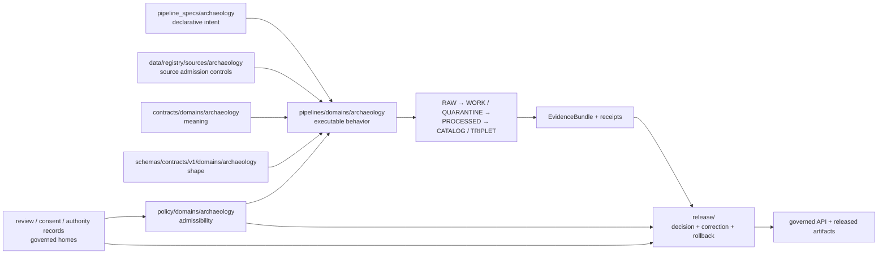
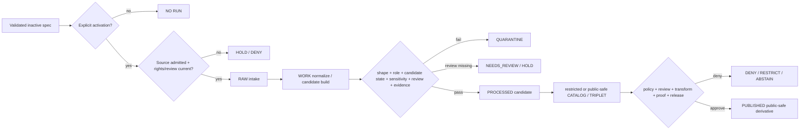

<!-- [KFM_META_BLOCK_V2]
doc_id: kfm://doc/pipeline-specs-archaeology-readme
title: pipeline_specs/archaeology/ — Governed Archaeology Pipeline Specification Boundary
type: readme
version: v0.2
status: draft; repository-grounded; placeholder-spec-set; sensitive-domain
owners: OWNER_TBD — Pipeline-spec steward · Archaeology steward · Cultural-review liaison · Rights-holder representative · Sensitivity reviewer · Source steward · Evidence steward · Validation steward · Policy steward · Release steward · Docs steward
created: 2026-06-13
updated: 2026-07-15
supersedes: v0.1
policy_label: public; pipeline-specs; archaeology; cultural-heritage; declarative-only; placeholder-specs; T4-default; exact-location-denial; cultural-review-required; sovereignty-aware; no-secrets; no-live-activation; no-public-path; release-gated
current_path: pipeline_specs/archaeology/README.md
truth_posture: CONFIRMED current target, parent pipeline-spec contract, five seven-line PROPOSED archaeology spec placeholders, placeholder archaeology source-registry records, draft executable-pipeline and stage READMEs, draft contract/schema/policy/review/test/fixture/validator surfaces, TODO-only domain-archaeology workflow, placeholder CODEOWNERS, and proposed/conflicted deny-by-default ADR / PROPOSED minimum active-spec contract, deterministic consumer binding, review and sensitivity gates, finite failure vocabulary, migration discipline, and rollback requirements / UNKNOWN accepted pipeline-spec schema, parser, registry, consumer discovery, schedules, source activation, executable behavior, substantive CI enforcement, receipt emission, release integration, and production use / NEEDS VERIFICATION owners, concrete SourceDescriptors, source-role and rights vocabulary, authority-to-control and CARE obligations, consent/revocation state, exact-location transform profiles, fixture payloads, executable tests, validator wiring, review-record schemas, correction behavior, and rollback execution
evidence_snapshot:
  repository: bartytime4life/Kansas-Frontier-Matrix
  repository_id: "1059091169"
  visibility: public
  base_ref: main
  base_commit: cbc65b4bd3f7ecd7cb55cbae97da564cad5b5546
  prior_blob: 65fbc1739f22f1a8b4463a8c06daa52f1443c51e
  direct_lane_files:
    - pipeline_specs/archaeology/README.md
    - pipeline_specs/archaeology/ingest.spec.yaml
    - pipeline_specs/archaeology/normalize.spec.yaml
    - pipeline_specs/archaeology/validate.spec.yaml
    - pipeline_specs/archaeology/catalog.spec.yaml
    - pipeline_specs/archaeology/publish.spec.yaml
  spec_posture: all five spec files are seven-line PROPOSED inventory placeholders
  workflow_posture: domain-archaeology is pull-request-triggered TODO scaffolding
related:
  - ../README.md
  - ./ingest.spec.yaml
  - ./normalize.spec.yaml
  - ./validate.spec.yaml
  - ./catalog.spec.yaml
  - ./publish.spec.yaml
  - ../../docs/doctrine/directory-rules.md
  - ../../docs/domains/archaeology/README.md
  - ../../docs/domains/archaeology/PIPELINE.md
  - ../../docs/domains/archaeology/CULTURAL_REVIEW.md
  - ../../docs/domains/archaeology/SENSITIVITY.md
  - ../../docs/domains/archaeology/PUBLICATION_AND_POLICY.md
  - ../../pipelines/domains/archaeology/README.md
  - ../../data/registry/sources/archaeology/README.md
  - ../../contracts/domains/archaeology/README.md
  - ../../schemas/contracts/v1/domains/archaeology/README.md
  - ../../policy/domains/archaeology/README.md
  - ../../policy/domains/archaeology/review/README.md
  - ../../tests/domains/archaeology/README.md
  - ../../fixtures/domains/archaeology/README.md
  - ../../tools/validators/archaeology/README.md
  - ../../docs/adr/ADR-0010-deny-by-default-for-dna-rare-species-archaeology-infrastructure.md
  - ../../.github/workflows/domain-archaeology.yml
  - ../../.github/CODEOWNERS
notes:
  - "v0.2 replaces planning-only inventory with commit-pinned repository evidence and classifies all five current spec files as placeholders rather than active or complete declarative profiles."
  - "The draft deny-by-default ADR is repository-present but proposed and number-conflicted; this README relies on the broader documented fail-closed Archaeology posture without promoting that ADR to accepted status."
  - "This revision preserves the v0.1 what-versus-how, candidate-versus-confirmed, lifecycle, sensitivity, cultural-review, evidence, receipt, release, correction, and rollback controls while grounding them in current repository surfaces."
  - "No spec placeholder, source record, connector, executable pipeline, contract, schema, policy, review record, fixture, test, validator, workflow, lifecycle object, receipt, proof, release object, runtime behavior, exact location, or public artifact is created or modified."
[/KFM_META_BLOCK_V2] -->

<a id="top"></a>

# Governed Archaeology Pipeline Specification Boundary

`pipeline_specs/archaeology/`

> Declarative Archaeology and Cultural Heritage run-intent boundary. A file here may describe **what** a verified pipeline should run, against which admitted sources, under which sensitivity, cultural-review, evidence, and release gates. It does not implement the pipeline, confirm a site, approve cultural use, expose exact locations, or authorize publication.


**Quick links:** [Purpose](#purpose) · [Authority](#authority-and-anti-collapse) · [Status](#current-status) · [Inventory](#current-lane-inventory) · [Placeholders](#placeholder-specification-set) · [Scope](#archaeology-specification-scope) · [File contract](#minimum-active-specification-contract) · [Sources](#source-role-rights-sovereignty-and-activation) · [Sensitivity](#sensitivity-cultural-review-and-public-safety) · [Lifecycle](#lifecycle-gates-and-finite-failures) · [Validation](#validation-and-enforceability) · [Review](#review-and-change-discipline) · [Done](#definition-of-done-for-an-active-specification) · [Rollback](#rollback-correction-revocation-and-deactivation) · [Backlog](#open-verification-register) · [Evidence](#evidence-ledger)

> [!IMPORTANT]
> **Evidence snapshot:** `main@cbc65b4bd3f7ecd7cb55cbae97da564cad5b5546`  
> **Target blob before this revision:** `65fbc1739f22f1a8b4463a8c06daa52f1443c51e`  
> **Observed direct lane:** this README plus five seven-line `status: PROPOSED` placeholders  
> **Activation:** not established; path, filename, merge, or placeholder status activates nothing

> [!CAUTION]
> Candidate features are not confirmed archaeological sites. Exact site geometry, site identifiers that reveal location, burial or human-remains context, sacred or culturally controlled knowledge, private-landowner detail, collection-security detail, and reverse-engineerable derivatives fail closed. A redaction flag is not cultural approval, and a passing pipeline run is not a release.

---

## Purpose

`pipeline_specs/archaeology/` is the direct Archaeology segment under the `pipeline_specs/` responsibility root.

It may hold reviewed declarative profiles that bind:

- a stable specification identity, version, owner, digest, and status;
- a verified parser and executable consumer under `pipelines/`;
- admitted SourceDescriptor references and allowed source roles;
- rights, sovereignty, CARE, consent, revocation, embargo, and authority-to-control requirements;
- temporal, spatial, geometry-precision, and stale-state expectations;
- candidate-versus-confirmed state transitions;
- exact-location denial and public-safe transform requirements;
- cultural, steward, sensitivity, rights-holder, and release-review gates;
- EvidenceRef and EvidenceBundle requirements;
- deterministic validators, fixtures, finite outcomes, and receipts;
- lifecycle inputs, outputs, quarantine routing, correction, supersession, and rollback;
- release-candidate handoff requirements without granting release authority.

This directory must not:

- implement executable transformations;
- fetch sources or contain credentials;
- store source payloads, exact coordinates, precise geometry, site IDs that reveal location, or protected cultural content;
- define contracts, schemas, policy, review authority, or release decisions;
- turn a remote-sensing anomaly, LiDAR candidate, historic-map lead, OCR extraction, or generated hypothesis into a confirmed site;
- treat cultural review as a generic checkbox detached from authority, consent, sovereignty, or revocation;
- make a public API, UI, map, graph, vector index, tile, search result, export, screenshot, or generated answer authoritative merely by referencing a spec.

### Audience

- pipeline-spec and Archaeology pipeline maintainers;
- Archaeology, cultural-review, rights-holder, sovereignty, source, evidence, validation, policy, release, security, and docs stewards;
- reviewers evaluating whether a placeholder may become an executable specification;
- maintainers designing no-network tests, sensitivity transforms, cultural-review handoffs, and rollback drills;
- public-surface reviewers verifying that no exact or triangulable protected location crosses the trust membrane.

[Back to top](#top)

---

## Authority and anti-collapse

### Responsibility split

```text
pipeline_specs/  = declarative run intent: WHAT may run and under which gates
pipelines/       = executable behavior: HOW processing occurs
connectors/      = source access and RAW/QUARANTINE admission support
contracts/       = object meaning
schemas/         = machine-checkable shape
policy/          = admissibility and obligations
tests/fixtures/  = enforceability proof and controlled examples
data/            = lifecycle state, registries, receipts, proofs, catalog/triplets, published artifacts
release/         = release, correction, supersession, withdrawal, and rollback authority
apps/            = governed serving surfaces; no direct internal-store access
```

A specification may require a gate. It cannot satisfy that gate merely by naming it.

### Disallowed collapses

```text
README or filename existence          -> active specification
status: PROPOSED                      -> source or pipeline activation
valid YAML                            -> valid governed run
spec file                             -> executable pipeline
source reference                      -> source admission or rights clearance
candidate feature                     -> confirmed archaeological site
historic map / route / deed proximity -> archaeological confirmation
remote-sensing or LiDAR anomaly       -> confirmed site
model confidence                      -> cultural or evidentiary authority
redaction profile                     -> cultural/steward approval
cultural-review field                 -> valid current review record
consent receipt reference             -> live, in-scope, unrevoked consent
schedule                              -> freshness or source-vintage proof
successful run                        -> ValidationReport or EvidenceBundle
catalog profile                       -> catalog truth
publish profile or release_ready      -> ReleaseManifest or publication
generalized public layer              -> permission to retain precise internal joins in public clients
generated explanation                 -> evidence or cultural authority
```

### Authority graph



No edge means that one artifact becomes another. Each authority and lifecycle transition remains separately auditable.

[Back to top](#top)

---

## Current status

### Safe conclusion

`pipeline_specs/archaeology/` is a repository-present declarative lane with five named stage placeholders. The filenames are useful inventory evidence. The file contents do not establish an accepted spec schema, parser, consumer, source binding, review workflow, runtime behavior, or release readiness.

| Capability or artifact | Status | Evidence-bounded conclusion |
|---|---:|---|
| Requested README | `CONFIRMED` | `pipeline_specs/archaeology/README.md` exists. |
| `ingest.spec.yaml` | `PLACEHOLDER / PROPOSED` | Seven lines; points to `MISSING_OR_PLANNED_FILES.md`; no executable/declarative contract. |
| `normalize.spec.yaml` | `PLACEHOLDER / PROPOSED` | Same bounded placeholder shape. |
| `validate.spec.yaml` | `PLACEHOLDER / PROPOSED` | Same bounded placeholder shape. |
| `catalog.spec.yaml` | `PLACEHOLDER / PROPOSED` | Same bounded placeholder shape. |
| `publish.spec.yaml` | `PLACEHOLDER / PROPOSED` | Same bounded placeholder shape. |
| Accepted pipeline-spec schema | `NOT ESTABLISHED` | Archaeology schema index reports no confirmed concrete domain schemas and does not define a pipeline-spec schema. |
| Parser / loader / spec registry | `UNKNOWN` | No consumer contract or runtime discovery was verified. |
| Executable Archaeology pipeline | `README-BACKED / UNPROVEN` | Domain and stage READMEs exist; concrete executable behavior remains `NEEDS VERIFICATION`. |
| Source registry | `FILE-RICH PLACEHOLDER LANE` | Multiple named source/control files exist, but inspected `sources.yaml`, `source_roles.yaml`, and `state_site_inventory.source.yaml` are placeholders. |
| Semantic contracts | `PARTIAL / DRAFT` | Contract README lists overlapping object-family spines and unresolved pairing. |
| Domain schemas | `INDEX ONLY / NEEDS VERIFICATION` | Schema README reports no confirmed concrete schema inventory under the domain path. |
| Domain policy | `DRAFT BOUNDARY` | Policy and review-policy READMEs exist; concrete bundles, fixtures, CI, and runtime enforcement remain unverified. |
| Cultural/review policy | `DRAFT / HOLD BY DEFAULT` | Review sublane documents authority, consent, revocation, CARE, and separation-of-duties gates; runtime enforcement unverified. |
| Fixtures | `README-BACKED / PAYLOADS UNVERIFIED` | Fixture root lists synthetic child lanes; payload inventory remains `NEEDS VERIFICATION`. |
| Tests | `README-BACKED / IMPLEMENTATION UNVERIFIED` | Parent test lane and fixture-test lanes exist; executable test modules remain unverified. |
| Archaeology validators | `PROPOSED IMPLEMENTATION LANE` | Validator README names seven families; no executable validator was confirmed. |
| Domain workflow | `TODO SCAFFOLD` | Three jobs only execute `echo TODO ...`. |
| CODEOWNERS | `PLACEHOLDER` | No Archaeology or pipeline-spec ownership rule is present. |
| Deny-by-default ADR | `DRAFT / PROPOSED / NUMBER-CONFLICTED` | Useful rationale, but not accepted authority and must not be presented as such. |
| Runtime, release, publication | `UNKNOWN / NOT AUTHORIZED HERE` | No production run, emitted receipt, release manifest, or public path is established by the lane. |

### Truth labels

| Label | Meaning here |
|---|---|
| `CONFIRMED` | Directly inspected in the pinned repository snapshot or verified by branch/read-back validation. |
| `PROPOSED` | A safe design consistent with current doctrine and evidence, not accepted implementation authority. |
| `NEEDS VERIFICATION` | Checkable but not sufficiently verified to act as fact. |
| `UNKNOWN` | Not resolved by the bounded inspection. |

[Back to top](#top)

---

## Current lane inventory

### Direct specification files

```text
pipeline_specs/archaeology/
├── README.md
├── ingest.spec.yaml
├── normalize.spec.yaml
├── validate.spec.yaml
├── catalog.spec.yaml
└── publish.spec.yaml
```

Every inspected `*.spec.yaml` file has this effective structure:

```yaml
status: PROPOSED
source_doc: docs/domains/archaeology/MISSING_OR_PLANNED_FILES.md
path: pipeline_specs/archaeology/<stage>.spec.yaml
notes:
  - Placeholder created from docs/domains markdown inventory.
```

The exact `source_doc` key spelling differs only where the placeholder generator used `source_docs` in other registry files. No stage file contains stable identity, schema version, consumer binding, source refs, lifecycle contract, review gates, sensitivity profile, validation rules, receipt requirements, activation state, or rollback target.

### Adjacent surfaces

```text
pipelines/domains/archaeology/
├── README.md
├── ingest/README.md
├── normalize/README.md
├── validate/README.md
├── catalog/README.md
├── publish/README.md
└── rollback/README.md

data/registry/sources/archaeology/
├── README.md
├── sources.yaml
├── source_roles.yaml
├── rights_profiles.yaml
├── sensitivity_policies.yaml
├── steward_authorities.yaml
└── multiple *.source.yaml files

contracts/domains/archaeology/             # semantic contracts; partial/draft
schemas/contracts/v1/domains/archaeology/ # schema index; concrete inventory unconfirmed
policy/domains/archaeology/                # domain policy boundary
policy/domains/archaeology/review/         # review gate boundary
tests/domains/archaeology/                 # test lane; implementation unverified
fixtures/domains/archaeology/              # synthetic fixture lanes; payloads unverified
tools/validators/archaeology/              # proposed validator lane
```

### Inventory limits

The inspection did not establish:

- a complete recursive inventory of differently named or unindexed files;
- accepted schema files for pipeline specs;
- a parser, loader, registry, schedule engine, or consumer;
- active source descriptors or live endpoint bindings;
- actual cultural-review, steward-review, rights-holder, consent, or revocation records;
- accepted sensitivity-transform profiles or public-geometry thresholds;
- executable tests, fixtures, or validator entrypoints;
- runtime policy parity;
- lifecycle writes, receipts, proof bundles, releases, corrections, or rollback drills.

[Back to top](#top)

---

## Placeholder specification set

### What the five files currently mean

The placeholders establish only that the repository plans stage-oriented Archaeology specifications named:

- `ingest`;
- `normalize`;
- `validate`;
- `catalog`;
- `publish`.

They do not establish that these five stages are sufficient, canonical, or safe for activation.

The old README also proposed sensitivity-transform, cultural-review, triplet, rollback, watcher, remote-sensing, LiDAR, geophysics, survey, and 3D-documentation profiles. Those remain design ideas, not current files in this direct lane.

### Placeholder handling rules

Until a governed upgrade occurs:

1. keep every placeholder inactive;
2. do not let parsers auto-discover `status: PROPOSED` files as runnable specs;
3. do not infer stage ordering from filenames alone;
4. do not attach secrets, endpoints, exact locations, source payloads, review records, or release decisions;
5. do not add missing fields piecemeal without an accepted schema and consumer contract;
6. upgrade one profile at a time through reviewable changes;
7. require no-network valid and invalid fixtures before activation;
8. require cultural, sensitivity, rights-holder, policy, evidence, release, and rollback review appropriate to the profile;
9. preserve the prior placeholder digest and migration record;
10. provide explicit deactivation and rollback.

### Upgrade state model

A future finite status vocabulary could distinguish:

| Candidate state | Meaning |
|---|---|
| `PLACEHOLDER` | Inventory marker only; never runnable. |
| `DRAFT_SPEC` | Meaningful fields exist; schema and review incomplete; never active by default. |
| `VALIDATED_SPEC` | Shape and static references pass; runtime activation still denied. |
| `REVIEWED_SPEC` | Required domain, cultural, sensitivity, rights, and policy reviews are current. |
| `ACTIVE_SPEC` | Explicit activation binds exact digest, consumer, environment, sources, schedule, and rollback. |
| `SUSPENDED_SPEC` | Temporarily disabled; prior records retained. |
| `WITHDRAWN_SPEC` | No new runs; correction/withdrawal posture recorded. |
| `DEPRECATED_SPEC` | Compatibility-only; migration target identified. |

This vocabulary is `PROPOSED`; the accepted status contract remains `NEEDS VERIFICATION`.

[Back to top](#top)

---

## Archaeology specification scope

A future accepted spec may declare intent for bounded responsibilities such as:

| Profile area | Declarative responsibility | Hard boundary |
|---|---|---|
| Source intake | Select admitted source descriptors and intake preconditions. | A source name is not admission; connectors remain separate. |
| Normalize | Select transforms for approved lifecycle inputs. | No meaning, policy, or cultural authority is defined by the spec. |
| Validate | Select schema, role, evidence, sensitivity, review, and no-leak checks. | Validation success is not proof closure or release. |
| Candidate generation | Produce candidate features from remote sensing, LiDAR, geophysics, maps, or extraction. | Candidate remains candidate; no site confirmation. |
| Sensitivity transform | Require named redaction/generalization/publication-transform profiles. | A transform is not review approval and must be receipted. |
| Cultural/review handoff | Declare required review types and handoff states. | The pipeline cannot manufacture cultural authority or reviewer consent. |
| Catalog / triplet | Prepare restricted or public-safe closure candidates. | Catalog or graph presence does not grant public visibility. |
| Publish readiness | Verify release prerequisites and package a candidate. | Only release authority may approve publication. |
| Rollback readiness | Verify known-good target, dependency inventory, and correction path. | The spec does not execute rollback by itself. |
| Watcher / refresh | Declare change-detection expectations. | Watchers do not admit, promote, or publish. |
| 3D / imagery derivatives | Declare bounded metadata and public-safe derivatives. | 3D meshes, textures, screenshots, and tiles must not leak precise protected geometry. |

### Out of scope

- source fetching and credentials;
- exact or reverse-engineerable protected locations;
- restricted cultural knowledge or consultation substance;
- review-record storage or consent-token storage;
- semantic contract definitions;
- JSON Schema definitions;
- policy code;
- fixtures and tests;
- lifecycle payloads;
- EvidenceBundles and receipts as stored artifacts;
- release decisions and public serving behavior.

[Back to top](#top)

---

## Minimum active specification contract

The accepted schema is not established. Any future active profile should nevertheless preserve the following semantic minimum.

### Identity and consumer binding

- stable `spec_id`;
- semantic version and immutable content digest;
- finite status;
- owner and reviewer roles;
- domain and profile family;
- exact parser/loader version;
- exact executable consumer path and version;
- explicit `auto_discovery: false` unless accepted discovery rules exist;
- activation record reference;
- supersedes / superseded-by / compatibility metadata.

### Source and authority binding

- SourceDescriptor references by stable ID and version/digest;
- allowed source roles;
- rights, license, attribution, redistribution, retention, and withdrawal state;
- upstream authority and source vintage;
- authority-to-control and rights-holder/steward references where applicable;
- CARE and sovereignty obligations;
- consent, revocation, embargo, waiver, and allowed-audience references;
- connector/intake binding outside the spec;
- stale-source and revoked-source behavior.

### Spatial and sensitivity binding

- input geometry class and allowed precision;
- output geometry class and maximum public precision;
- exact-location denial flag;
- site-identifier leakage checks;
- reverse-engineering risk checks across tiles, graphs, search, embeddings, screenshots, exports, and joins;
- sensitivity tier/rank and per-record override posture;
- sacred, burial, human-remains, collection-security, landowner, and looting-risk flags;
- named redaction/generalization/publication-transform profile;
- required transform receipt;
- restricted/public-safe derivative separation.

### Evidence, review, and policy binding

- EvidenceRef and EvidenceBundle closure requirements;
- candidate-versus-confirmed rules;
- required cultural, steward, sensitivity, rights-holder, sovereignty, and release reviews;
- current review-record and digest requirements;
- separation-of-duties requirements;
- policy bundle and version/digest;
- finite decision outcomes and reason codes;
- unresolved-support behavior: `HOLD`, `DENY`, `ABSTAIN`, `RESTRICT`, or `ERROR`;
- no generated-language substitution for evidence or review.

### Lifecycle and release binding

- allowed input lifecycle states;
- intended output state;
- quarantine conditions;
- deterministic no-op behavior;
- required run, intake, transform, validation, redaction, review, policy, evidence, catalog, release-readiness, correction, and rollback receipts/references;
- release-candidate output contract;
- correction and supersession behavior;
- deactivation path;
- known-good rollback target and dependency inventory.

### Illustrative inactive YAML

The following is explanatory only. It is not an accepted schema and must not be saved or activated as a real spec without schema, consumer, policy, and review approval.

```yaml
schema_version: NEEDS_VERIFICATION
spec_id: archaeology.<profile>
version: 0.0.0-example
status: inactive_example
owner: OWNER_TBD
consumer:
  parser: NEEDS_VERIFICATION
  target_pipeline: pipelines/domains/archaeology/<lane>
  auto_discovery: false
sources:
  descriptor_refs: []
  allowed_roles: []
authority:
  cultural_review_required: true
  steward_review_required: true
  rights_holder_review_required: true
  consent_state_ref: NEEDS_VERIFICATION
  revocation_state_ref: NEEDS_VERIFICATION
sensitivity:
  default_tier: T4
  exact_location_release_allowed: false
  public_transform_profile_ref: NEEDS_VERIFICATION
  transform_receipt_required: true
lifecycle:
  input_states: []
  intended_output_state: null
  quarantine_on_failure: true
requirements:
  evidence_bundle_required: true
  candidate_not_site: true
  policy_decision_required: true
  review_records_required: []
  receipts_required: []
release:
  permitted: false
  manifest_required: true
  rollback_target_required: true
anti_collapse:
  candidate_is_confirmed_site: false
  transform_is_review_approval: false
  review_field_is_valid_consent: false
  spec_is_release_approval: false
```

[Back to top](#top)

---

## Source role, rights, sovereignty, and activation

### Registry maturity

The source-registry directory contains many named files, including source profiles, source-role and sensitivity registries, rights profiles, and steward-authority records. Inspected examples remain placeholders:

- `sources.yaml`;
- `source_roles.yaml`;
- `state_site_inventory.source.yaml`.

Therefore, filename presence must not be treated as an admitted source inventory.

### Required source roles

Archaeology sources must retain a non-collapsed role such as:

| Role | Example | Boundary |
|---|---|---|
| `observed` | Field-verified survey observation within its recorded scope. | Does not imply public release or generalized confirmation beyond scope. |
| `regulatory` | Eligibility, compliance, consultation, or protection status. | Not field observation and not public permission. |
| `modeled` | LiDAR candidate, geophysics interpretation, predictive model, anomaly. | Not confirmed; requires method, uncertainty, validation, and review. |
| `aggregate` | County, region, survey-area, or generalized count/summary. | Must not enable reconstruction of precise sites or private owners. |
| `administrative` | Inventory index, accession register, repository record, project list. | Does not prove current location, condition, affiliation, or public safety. |
| `candidate` | Unreviewed lead, OCR extraction, geocode, map match, anomaly. | Blocks confirmation and publication. |
| `synthetic` | Test fixture, demo layer, generated example. | Must carry a reality boundary and never support factual claims. |
| `context` | Historic map, local history, route context, public interpretation. | Insufficient as claim proof by itself. |
| `restricted` | Exact sites, sacred/burial material, collection security, private-landowner or steward-only information. | Defaults to deny, quarantine, restrict, generalize, or withhold. |

The canonical vocabulary and schema remain `NEEDS VERIFICATION`.

### Source activation

A source is active only when a governed record binds:

- exact SourceDescriptor ID and digest;
- source role;
- rights/license/attribution/retention/withdrawal state;
- authority-to-control and steward/rights-holder contacts where appropriate;
- sensitivity, sovereignty, CARE, consent, revocation, embargo, and audience obligations;
- exact connector and environment;
- secret references outside the repository;
- cadence, source vintage, valid/effective time, retrieval time, and stale-state rules;
- fixtures and no-network tests;
- review and policy state;
- deactivation and rollback.

A filename, README, placeholder status, or merged PR is not activation.

[Back to top](#top)

---

## Sensitivity, cultural review, and public safety

### Default posture

Archaeology is documented as a fail-closed sensitive lane. Current domain and policy documentation uses a default T4 / deny posture for precise protected material.

The draft cross-domain ADR also argues for deny-by-default, but it is `proposed`, `draft`, and number-conflicted. It may inform the evidence ledger; it must not be cited as an accepted decision.

### Protected classes

The spec must hold, deny, restrict, quarantine, or require reviewed transformation for:

- exact site coordinates, footprints, polygons, survey boundaries, excavation units, and provenience;
- site identifiers whose lookup or join reveals location;
- burial sites, human remains, funerary objects, sacred places, and culturally restricted knowledge;
- oral-history or community-controlled material;
- collection storage, security, condition, donor, or repository details that increase theft or desecration risk;
- private landowner, access, permission, parcel, or property details;
- looting, vandalism, vulnerability, and site-condition exposure;
- candidate anomaly clusters or predictive surfaces that narrow protected locations;
- 3D meshes, textures, imagery, screenshots, elevation products, or metadata that reconstruct exact geometry;
- cross-domain joins that reveal protected sites through roads, settlements, parcels, hydrology, geology, habitat, or infrastructure;
- AI prompts, summaries, embeddings, search results, graph edges, or tile patterns that triangulate a protected location.

### Cultural authority boundary

KFM may record:

- who reviewed;
- which authority or rights-holder role was recognized;
- review scope and timestamp;
- consent, revocation, embargo, waiver, and retention state;
- CARE or sovereignty obligations;
- allowed audience and representation;
- review digest and supersession state;
- obligations and reason codes.

KFM must not:

- define the substance of cultural knowledge;
- substitute a generic reviewer for the controlling authority;
- infer consent from silence or prior publication;
- treat a public source as permission to recombine protected detail;
- preserve a revoked review as current;
- let an AI model interpret or disclose restricted cultural content beyond approved public-safe representation.

### Review gates

A release-facing spec should require, as applicable:

1. object class and candidate/confirmed state known;
2. sensitivity and exact-location risk classified;
3. controlling authority and rights-holder role resolved;
4. cultural, steward, sensitivity, and rights-holder reviews current;
5. consent live, in scope, and unrevoked;
6. embargo, retention, waiver, and sovereignty obligations satisfied;
7. CARE labels and obligations preserved downstream;
8. separation of duties between author, reviewer, rights-holder, policy evaluator, and release authority where material;
9. public transform named, versioned, tested, and receipted;
10. EvidenceBundle closed;
11. release manifest and rollback target present;
12. public derivative tested against reconstruction and AI-location leakage.

[Back to top](#top)

---

## Lifecycle gates and finite failures

The lifecycle remains:

```text
RAW -> WORK / QUARANTINE -> PROCESSED -> CATALOG / TRIPLET -> PUBLISHED
```

A spec describes intended transitions. It does not execute, approve, or prove them.

### Gate flow



### Candidate finite outcomes

- `PLACEHOLDER_NOT_RUNNABLE`;
- `INVALID_SPEC`;
- `UNKNOWN_SCHEMA`;
- `UNKNOWN_CONSUMER`;
- `SPEC_NOT_ACTIVE`;
- `SOURCE_NOT_ADMITTED`;
- `RIGHTS_UNRESOLVED`;
- `AUTHORITY_TO_CONTROL_UNRESOLVED`;
- `CONSENT_MISSING_OR_REVOKED`;
- `EMBARGO_OR_RETENTION_CONFLICT`;
- `SOURCE_STALE`;
- `CANDIDATE_SITE_COLLAPSE`;
- `SENSITIVE_GEOMETRY_DENIED`;
- `PUBLIC_RECONSTRUCTION_RISK`;
- `CULTURAL_REVIEW_REQUIRED`;
- `STEWARDSHIP_REVIEW_REQUIRED`;
- `RIGHTS_HOLDER_REVIEW_REQUIRED`;
- `SEPARATION_OF_DUTIES_FAILED`;
- `REDACTION_OR_GENERALIZATION_REQUIRED`;
- `TRANSFORM_RECEIPT_MISSING`;
- `EVIDENCE_BUNDLE_REQUIRED`;
- `POLICY_DENY`;
- `CATALOG_CLOSURE_MISSING`;
- `RELEASE_BLOCKED`;
- `AI_LOCATION_DENIED`;
- `NO_MATERIAL_CHANGE`;
- `QUARANTINED`;
- `ERROR`.

This vocabulary is `PROPOSED`; accepted enums remain `NEEDS VERIFICATION`.

### No silent fallback

Consumers must not silently:

- run a placeholder;
- choose a source or transform because a reference is missing;
- substitute a generalized layer for a review decision;
- downgrade exact-location leakage to a warning;
- publish when review or consent is stale;
- retain public caches after revocation or correction;
- expose restricted canonical geometry through hidden API fields, vector tiles, graph edges, embeddings, or AI explanations;
- treat an unavailable cultural reviewer as an ordinary maintainer approval;
- mark a candidate as confirmed because downstream code expects a site object.

[Back to top](#top)

---

## Validation and enforceability

### Documentation validation for v0.2

- pinned repository head and prior target blob;
- inspected all five direct spec files;
- inspected representative source-registry placeholders;
- inspected parent pipeline-spec contract and executable pipeline README;
- inspected Archaeology domain, contract, schema, policy, review-policy, source-registry, test, fixture, validator, workflow, CODEOWNERS, and ADR surfaces;
- performed bounded searches for lane inventory;
- checked Markdown structure, relative links, headings, anchors, Mermaid boundary, illustrative YAML, and secret patterns;
- required remote read-back and content hash verification before PR creation.

### Required future spec tests

A real spec should have deterministic no-network tests covering:

1. placeholder rejection;
2. schema and required identity;
3. unknown field or extension behavior;
4. immutable digest and version handling;
5. parser/consumer binding;
6. explicit activation and deactivation;
7. missing/inactive SourceDescriptor denial;
8. rights, attribution, retention, withdrawal, and source-vintage failures;
9. authority-to-control and rights-holder resolution;
10. consent, revocation, embargo, waiver, and CARE obligations;
11. candidate-versus-confirmed denial;
12. exact-location and site-ID leakage;
13. reverse-engineering through tiles, graphs, search, embeddings, screenshots, joins, and exports;
14. remote-sensing/LiDAR/model versus confirmed-site separation;
15. cultural/steward/sensitivity/rights-holder review gates;
16. separation of duties;
17. transform profile and receipt requirements;
18. EvidenceBundle and citation closure;
19. lifecycle and quarantine behavior;
20. catalog/triplet restricted-versus-public-safe separation;
21. release denial without manifest and rollback target;
22. correction, supersession, revocation, cache invalidation, and rollback;
23. AI exact-location and cultural-content denial;
24. no network, secrets, or sensitive fixture payloads in default validation.

### Existing validation surfaces

- `tests/domains/archaeology/README.md` defines expected proof responsibilities but reports implementation gaps.
- `fixtures/domains/archaeology/README.md` lists synthetic child lanes but reports payloads unverified.
- `tools/validators/archaeology/README.md` names seven proposed validator families but confirms no executable.
- `.github/workflows/domain-archaeology.yml` only echoes TODO messages.

A green placeholder workflow cannot prove spec validity, cultural review, no-leak behavior, release readiness, or rollback.

[Back to top](#top)

---

## Review and change discipline

### Minimum reviewers for this README

- pipeline-spec steward;
- Archaeology domain steward;
- cultural/sensitivity reviewer;
- docs steward.

### Additional review triggers

| Change | Required posture |
|---|---|
| Upgrade placeholder to meaningful spec | Parser/consumer owner, schema, validation, source, policy, Archaeology, and docs review. |
| Add or activate source refs | Source, rights, sensitivity, cultural-review, security, and operations review. |
| Change candidate/confirmed behavior | Contract, domain, evidence, validation, and policy review. |
| Change exact-location/public transform | Cultural authority/rights-holder, sensitivity, policy, security, map/API, and release review. |
| Add consent, revocation, embargo, CARE, or sovereignty behavior | Rights-holder representative, cultural-review liaison, consent/policy, governance, and release review. |
| Add catalog, graph, search, embedding, tile, screenshot, export, or AI surface | Reconstruction-risk, public trust-membrane, security, policy, evidence, and release review. |
| Add schedule or runtime activation | Operations, security, source, pipeline, rollback, and on-call review. |
| Change release/correction/rollback requirements | Release authority, evidence, policy, governance, and rollback reviewer. |

### Change protocol

1. inspect the current spec digest and activation state;
2. identify affected sources, consumers, object families, review obligations, lifecycle states, public derivatives, and rollback targets;
3. update schema/contract/policy/docs/tests together or document a staged governed plan;
4. add valid and invalid no-network fixtures;
5. test candidate/confirmed and no-leak behavior;
6. record human and rights-holder review;
7. issue generated-work and migration receipts;
8. keep new version inactive until explicit activation;
9. preserve prior version for correction and rollback;
10. monitor downstream materializations after activation.

[Back to top](#top)

---

## Definition of done for an active specification

A placeholder is not done merely because it has a plausible filename.

An active Archaeology spec is done only when:

- [ ] accepted schema and stable identity exist;
- [ ] exact parser and consumer versions are bound;
- [ ] content digest is deterministic;
- [ ] owner and required reviewer assignments are real;
- [ ] SourceDescriptors are concrete, admitted, and active;
- [ ] rights, attribution, retention, source vintage, and withdrawal are resolved;
- [ ] source roles remain distinct;
- [ ] candidate-versus-confirmed rules are enforced;
- [ ] authority-to-control and rights-holder roles are resolved;
- [ ] cultural, steward, sensitivity, rights-holder, and release reviews are current;
- [ ] consent, revocation, embargo, waiver, CARE, and sovereignty obligations are live and testable;
- [ ] exact-location and reconstruction risks are denied by default;
- [ ] public transform profiles are named, versioned, tested, and receipted;
- [ ] fixtures are synthetic, public-safe, deterministic, and no-network;
- [ ] positive and negative tests execute;
- [ ] validator and policy parity is proven;
- [ ] lifecycle and quarantine behavior are enforced;
- [ ] EvidenceBundle and required receipts resolve;
- [ ] catalog/triplet outputs preserve restricted/public-safe separation;
- [ ] activation and deactivation are explicit;
- [ ] release handoff cannot self-approve;
- [ ] correction, supersession, revocation, cache invalidation, and rollback are tested;
- [ ] docs match implementation;
- [ ] the placeholder source and prior digest remain auditable.

[Back to top](#top)

---

## Rollback, correction, revocation, and deactivation

### This README change

Before merge, rollback is to close the draft PR and abandon its branch.

After merge, use a transparent revert commit or revert PR restoring the prior README and removing the paired generated-work receipt. Do not rewrite shared history.

This documentation change does not activate a spec, source, run, release, or public artifact; no runtime rollback should be required for the README itself.

### Future spec deactivation

A future active spec must support:

1. disabling schedule/event activation;
2. rejecting new runs for the affected digest;
3. preserving source, run, review, policy, evidence, receipt, and release lineage;
4. quarantining in-flight or affected derivatives;
5. inventorying restricted and public materializations;
6. withdrawing or superseding catalog, graph, search, tile, export, API, UI, and AI derivatives;
7. invalidating caches, indexes, screenshots/previews where controlled, and generated-answer materializations;
8. honoring consent revocation, embargo changes, rights withdrawal, or authority decisions;
9. restoring a known-good spec or disabled state;
10. re-running no-leak, candidate-state, review, evidence, policy, and rollback tests;
11. issuing CorrectionNotice, ReleaseManifest updates, RollbackCard, or other governed records where required;
12. verifying that no exact or triangulable protected detail remains on normal public paths.

Rollback is a governed state transition, not a file copy.

[Back to top](#top)

---

## Open verification register

| ID | Question | Status | Closure evidence needed |
|---|---|---|---|
| `PIPE-SPEC-ARCH-001` | Which schema validates pipeline specs? | `UNKNOWN` | Accepted schema, registry record, fixtures, validator, tests. |
| `PIPE-SPEC-ARCH-002` | Which parser/loader and registry consume specs? | `UNKNOWN` | Code, config, tests, runtime evidence. |
| `PIPE-SPEC-ARCH-003` | Are the five stage placeholders the accepted profile set? | `NEEDS VERIFICATION` | ADR or accepted pipeline architecture and consumer contract. |
| `PIPE-SPEC-ARCH-004` | Which placeholders should be upgraded first? | `NEEDS VERIFICATION` | Thin-slice plan with sources, fixtures, tests, review, rollback. |
| `PIPE-SPEC-ARCH-005` | Which SourceDescriptor records are substantive and active? | `NEEDS VERIFICATION` | Full inventory, schema validation, rights/review, activation record. |
| `PIPE-SPEC-ARCH-006` | What source-role vocabulary is canonical? | `NEEDS VERIFICATION` | Accepted vocabulary/schema and tests. |
| `PIPE-SPEC-ARCH-007` | What review-record and consent/revocation schemas are accepted? | `NEEDS VERIFICATION` | Contracts, schemas, registry, fixtures, policy tests. |
| `PIPE-SPEC-ARCH-008` | Which authority-to-control and CARE fields are mandatory? | `NEEDS VERIFICATION` | Governance decision, rights-holder review, policy/schema tests. |
| `PIPE-SPEC-ARCH-009` | Which sensitivity and transform profiles are canonical? | `NEEDS VERIFICATION` | Accepted policy, profile registry, receipts, reconstruction tests. |
| `PIPE-SPEC-ARCH-010` | Which geometry thresholds are public-safe for each object/audience? | `NEEDS VERIFICATION` | Cultural/sensitivity review, policy decision, no-leak tests. |
| `PIPE-SPEC-ARCH-011` | Which fixture payloads and tests are executable today? | `NEEDS VERIFICATION` | Recursive inventory and test run evidence. |
| `PIPE-SPEC-ARCH-012` | Which validator entrypoints exist? | `UNKNOWN` | Executable files, imports, tests, CI logs. |
| `PIPE-SPEC-ARCH-013` | Does any CI job substantively validate these specs? | `NOT ESTABLISHED` | Non-TODO workflow, tests, artifacts, failure cases. |
| `PIPE-SPEC-ARCH-014` | Who owns and reviews this lane? | `NEEDS VERIFICATION` | CODEOWNERS and steward assignments. |
| `PIPE-SPEC-ARCH-015` | How are activation and deactivation recorded? | `UNKNOWN` | Control-plane contract, runbook, receipts, drills. |
| `PIPE-SPEC-ARCH-016` | How are revocation and cache/index invalidation enforced? | `UNKNOWN` | Policy/runtime implementation and rollback drill. |
| `PIPE-SPEC-ARCH-017` | Which deny-by-default ADR is accepted, given the number/topic conflict? | `NEEDS VERIFICATION / ADR` | ADR reconciliation and accepted status. |
| `PIPE-SPEC-ARCH-018` | How are public tiles, graphs, search, embeddings, screenshots, exports, and AI tested for reconstruction risk? | `NEEDS VERIFICATION` | Cross-surface no-leak test suite and release evidence. |

[Back to top](#top)

---

## Evidence ledger

| Evidence | Status | Supports | Limits |
|---|---|---|---|
| Prior `pipeline_specs/archaeology/README.md` | `CONFIRMED` | v0.1 what/how split, sensitivity, review, lifecycle, release, and rollback intent. | Presented proposed filenames without current placeholder inventory. |
| Five `pipeline_specs/archaeology/*.spec.yaml` files | `CONFIRMED PLACEHOLDERS` | Stage names and repository presence. | Seven-line inventory markers only; no runnable contract. |
| `pipeline_specs/README.md` | `CONFIRMED` | Root owns declarative configuration and warns specs do not satisfy their own gates. | Does not define Archaeology schema or activation. |
| `pipelines/domains/archaeology/README.md` | `CONFIRMED DOC / PROPOSED IMPLEMENTATION` | Executable responsibility, sensitive-lane boundaries, stage intent. | Does not prove executable code or runs. |
| `docs/domains/archaeology/README.md` | `CONFIRMED DOC` | Domain scope, object families, T4/exact-location denial, cultural review, responsibility-root pattern. | Older authoring session bounded implementation as proposed; not runtime evidence. |
| `data/registry/sources/archaeology/README.md` | `CONFIRMED DOC` | Source roles, sensitivity controls, rights/review expectations, no-public path. | Concrete descriptor maturity requires file-level inspection. |
| Representative source-registry YAML | `CONFIRMED PLACEHOLDERS` | Named planned registry surfaces. | `sources.yaml`, `source_roles.yaml`, and `state_site_inventory.source.yaml` are placeholders. |
| `contracts/domains/archaeology/README.md` | `CONFIRMED DOC / PARTIAL` | Semantic-contract boundary and overlapping object-family spines. | Canonical object reconciliation and schema pairing incomplete. |
| `schemas/contracts/v1/domains/archaeology/README.md` | `CONFIRMED INDEX` | Proposed schema lane and sensitivity rules. | Reports no confirmed concrete domain schema inventory. |
| `policy/domains/archaeology/README.md` | `CONFIRMED DOC / PROPOSED ENFORCEMENT` | T4 deny, review/redaction/sovereignty/consent/release policy intent. | Concrete bundles, fixtures, CI, runtime enforcement unverified. |
| `policy/domains/archaeology/review/README.md` | `CONFIRMED DOC / PROPOSED ENFORCEMENT` | Review authority, consent/revocation, CARE, separation-of-duties, finite decisions. | Review schemas, policies, tests, runtime enforcement unverified. |
| `tests/domains/archaeology/README.md` | `CONFIRMED DOC / IMPLEMENTATION UNVERIFIED` | Test responsibilities and no-network posture. | Test modules and CI behavior remain unverified. |
| `fixtures/domains/archaeology/README.md` | `CONFIRMED DOC / PAYLOADS UNVERIFIED` | Synthetic fixture lanes and exclusions. | Payload inventory and validity unverified. |
| `tools/validators/archaeology/README.md` | `CONFIRMED DOC / PROPOSED IMPLEMENTATION` | Seven validator families and finite outcomes. | No executable validator confirmed. |
| `.github/workflows/domain-archaeology.yml` | `CONFIRMED TODO SCAFFOLD` | PR workflow exists. | Each job only echoes TODO text. |
| `.github/CODEOWNERS` | `CONFIRMED PLACEHOLDER` | Repository ownership file exists. | No Archaeology/pipeline-spec ownership rule. |
| Draft deny-by-default ADR | `CONFIRMED FILE / PROPOSED CONFLICTED DECISION` | Rationale for irreversible exact-location harm and fail-closed design. | Draft, proposed, and number-conflicted; not accepted authority. |
| Bounded repository searches | `CONFIRMED SEARCH` | Surfaced direct specs, adjacent lanes, source/control files, and tests/fixtures/docs. | Not a complete recursive filesystem proof. |

### No-loss assessment from v0.1

| v0.1 concern | v0.2 disposition |
|---|---|
| Declarative specs versus executable pipelines | Preserved and strengthened. |
| Exact-location denial and sensitive cultural material | Preserved and expanded to reconstruction risk across all public surfaces. |
| Candidate versus confirmed site | Preserved and expanded with source-role/model distinctions and tests. |
| Cultural/steward review | Preserved and expanded with authority, consent, revocation, CARE, and separation of duties. |
| Lifecycle and quarantine | Preserved with explicit finite failures and no silent fallback. |
| Evidence and receipts | Preserved and expanded with closure and transform/review references. |
| Release, correction, and rollback | Preserved and expanded with deactivation, cache invalidation, revocation, and public-derivative inventory. |
| Proposed directory tree | Replaced with the actual five-file placeholder inventory. |
| Tests and fixtures | Preserved as requirements and grounded in current README-backed surfaces. |
| Source scope | Preserved while making placeholder source-record maturity explicit. |
| AI/public location denial | Strengthened to cover triangulation through text, maps, graphs, search, embeddings, screenshots, and exports. |

[Back to top](#top)

---

## Maintainer note

Keep this directory declarative and free of sensitive content. Do not place executable code, source clients, credentials, schemas, contracts, policy decisions, review records, consent records, lifecycle outputs, receipts, EvidenceBundles, release decisions, exact locations, protected cultural knowledge, or public-serving configuration here.

Do not run the five placeholders. Upgrade only through an accepted schema, explicit consumer binding, concrete admitted sources, no-network valid and invalid fixtures, executable fail-closed tests, current cultural/rights/sensitivity review, evidence and receipt closure, explicit activation/deactivation, and tested correction and rollback.
