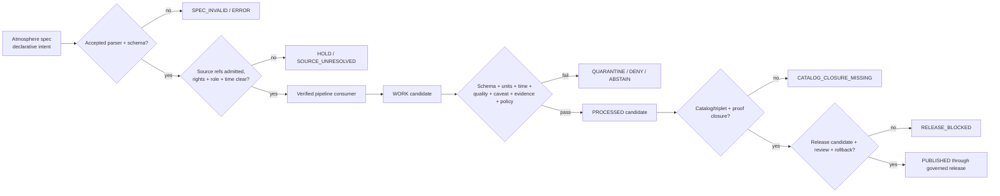

<!-- [KFM_META_BLOCK_V2]
doc_id: kfm://doc/pipeline-specs-atmosphere-readme
title: pipeline_specs/atmosphere/ — Governed Atmosphere Pipeline Specification Boundary
type: readme
version: v0.2
status: draft; repository-grounded; preferred-documentation-lane; readme-only; no-active-specs-established
owners: OWNER_TBD — Pipeline-spec steward · Atmosphere/Air steward · Air-quality steward · Meteorology/climate steward · Smoke/remote-sensing steward · Source and rights steward · Temporal/freshness steward · Pipeline owner · Evidence steward · Policy/sensitivity steward · Validation steward · Hazards liaison · Release steward · Docs steward
created: 2026-06-13
updated: 2026-07-15
supersedes: v0.1
policy_label: public; pipeline-specs; atmosphere; air; air-quality; weather; climate; smoke; aod; forecast; advisory-context; declarative-only; source-role-aware; knowledge-character-aware; time-aware; unit-aware; stale-state-aware; no-secrets; no-live-activation; no-public-path; not-emergency-alerting; official-authority-redirection; release-gated
current_path: pipeline_specs/atmosphere/README.md
truth_posture: CONFIRMED current target, parent pipeline-spec contract, repository-present Air compatibility guardrail, bounded README-only Atmosphere spec inventory, draft executable pipeline and stage documentation, placeholder Atmosphere source records, draft contract/schema/test/config/proof/receipt/release documentation, 33-line greenfield policy scaffold, TODO-only domain workflow, and placeholder CODEOWNERS / PROPOSED minimum active-spec contract, deterministic consumer binding, source-role and knowledge-character gates, temporal/freshness semantics, finite failure vocabulary, validation matrix, migration discipline, and rollback requirements / UNKNOWN accepted pipeline-spec schema, parser, registry, consumer discovery, schedules, source activation, executable behavior, substantive CI enforcement, receipt emission, release integration, and production use / NEEDS VERIFICATION owners, final air-versus-atmosphere slug decision, exhaustive recursive lane inventory, admitted SourceDescriptors, source roles and rights, station/network identity, units and methods, temporal vocabularies and stale-state budgets, caveat profiles, fixture payloads, executable tests, validator wiring, correction propagation, and rollback execution
evidence_snapshot:
  repository: bartytime4life/Kansas-Frontier-Matrix
  repository_id: "1059091169"
  visibility: public
  base_ref: main
  base_commit: 9db5069e920614511e828510352a23ed29d14706
  prior_blob: 62b2b2d673c03cbbd8ef81695808114f227d7c75
  direct_lane_files:
    - pipeline_specs/atmosphere/README.md
  compatibility_lane: pipeline_specs/air/README.md
  implementation_alias_lane: pipelines/domains/air/README.md
  preferred_implementation_lane: pipelines/domains/atmosphere/README.md
  source_record_posture: inspected aqs.source.json and knowledge_character.json are PROPOSED inventory placeholders
  workflow_posture: domain-atmosphere is pull-request-triggered TODO scaffolding
related:
  - ../README.md
  - ../air/README.md
  - ../../docs/doctrine/directory-rules.md
  - ../../docs/domains/atmosphere/README.md
  - ../../docs/domains/atmosphere/PIPELINE.md
  - ../../docs/domains/atmosphere/CANONICAL_PATHS.md
  - ../../docs/domains/atmosphere/SOURCE_REGISTRY.md
  - ../../docs/domains/atmosphere/DATA_LIFECYCLE.md
  - ../../docs/domains/atmosphere/API_CONTRACTS.md
  - ../../docs/domains/atmosphere/KNOWLEDGE_CHARACTERS.md
  - ../../pipelines/domains/atmosphere/README.md
  - ../../pipelines/domains/air/README.md
  - ../../configs/domains/atmosphere/README.md
  - ../../data/registry/sources/atmosphere/README.md
  - ../../data/registry/sources/atmosphere/aqs.source.json
  - ../../data/registry/sources/atmosphere/knowledge_character.json
  - ../../contracts/domains/atmosphere/README.md
  - ../../schemas/contracts/v1/domains/atmosphere/README.md
  - ../../policy/domains/atmosphere/README.md
  - ../../tests/domains/atmosphere/README.md
  - ../../tests/domains/atmosphere/policy-deny/README.md
  - ../../tests/domains/atmosphere/no-network/README.md
  - ../../data/receipts/pipeline/atmosphere/README.md
  - ../../data/proofs/atmosphere/README.md
  - ../../release/candidates/atmosphere/README.md
  - ../../.github/workflows/domain-atmosphere.yml
  - ../../.github/CODEOWNERS
notes:
  - "v0.2 replaces a planning-only proposed file tree with commit-pinned repository evidence and identifies the current Atmosphere spec lane as README-only."
  - "pipeline_specs/atmosphere/ is the preferred documentation-aligned lane; pipeline_specs/air/ is an explicit compatibility guardrail. This README does not make either slug canonical through assertion."
  - "The inspected Atmosphere source records are inventory placeholders. Their presence does not establish source admission, activation, freshness, rights clearance, or consumer binding."
  - "This revision preserves the v0.1 profile-family, lifecycle, source-role, caveat, evidence, receipt, advisory, release, correction, and rollback requirements while adding current maturity, measurement, temporal, spatial, failure, validation, and migration controls."
  - "No executable spec, config payload, source record, connector, pipeline, contract, schema, policy, fixture, test, validator, workflow, lifecycle object, receipt instance, proof, release object, runtime behavior, advisory behavior, or public artifact is created or modified."
[/KFM_META_BLOCK_V2] -->

<a id="top"></a>

# Governed Atmosphere Pipeline Specification Boundary

`pipeline_specs/atmosphere/`

> Declarative run-intent boundary for Atmosphere, Air Quality, Weather, Climate, Smoke, Aerosol, Model, Forecast, and Advisory-context pipelines. A file here may describe **what** a verified pipeline should run, against which admitted sources, with which time, unit, caveat, evidence, policy, and release gates. It does not execute the pipeline, admit a source, make stale material current, convert a model into an observation, issue an advisory, or authorize publication.


**Quick links:** [Purpose](#purpose) · [Authority](#authority-and-anti-collapse) · [Status](#current-status) · [Placement](#repository-fit-and-slug-drift) · [Inventory](#current-inspected-inventory) · [Scope](#atmosphere-specification-scope) · [File contract](#minimum-active-specification-contract) · [Sources](#source-role-rights-and-activation) · [Measurements](#measurement-unit-method-and-quality-boundaries) · [Time](#time-forecast-cycle-freshness-and-stale-state) · [Knowledge characters](#atmosphere-knowledge-character-boundaries) · [Lifecycle](#lifecycle-gates-and-finite-failures) · [Validation](#validation-and-enforceability) · [Review](#review-migration-and-change-discipline) · [Done](#definition-of-done-for-an-active-specification) · [Rollback](#rollback-correction-and-deactivation) · [Backlog](#open-verification-register) · [Evidence](#evidence-ledger)

> [!IMPORTANT]
> **Evidence snapshot:** `main@9db5069e920614511e828510352a23ed29d14706`  
> **Target blob before this revision:** `62b2b2d673c03cbbd8ef81695808114f227d7c75`  
> **Bounded direct-lane result:** this README; no concrete Atmosphere spec profile was surfaced by searches for lane YAML, `spec_id: atmosphere.*`, or `kfm.pipeline_spec.atmosphere`  
> **Compatibility posture:** [`pipeline_specs/air/`](../air/README.md) is the repository-present Air compatibility guardrail  
> **Activation:** path, filename, merge, schedule text, or successful syntax validation activates nothing

> [!CAUTION]
> AQI is not pollutant concentration. AOD is not surface PM2.5. Smoke or fire context is not a monitor observation. A model, forecast, reanalysis, or normal is not an observation. A station record is not a measurement. An advisory reference is not an official warning or protective instruction. A schedule is not freshness proof, and a successful pipeline run is not an `EvidenceBundle`, `PolicyDecision`, or release.

---

## Purpose

`pipeline_specs/atmosphere/` is the direct Atmosphere segment under the `pipeline_specs/` responsibility root.

Its safe role is to hold reviewed, deterministic declarative profiles that bind:

- a stable specification identity, version, owner, and finite status;
- one verified executable consumer;
- admitted `SourceDescriptor` references and explicit source roles;
- knowledge-character boundaries;
- measurement, unit, method, averaging-period, and quality requirements;
- observation, issue, valid, expiry, retrieval, processing, model-run, and release time semantics;
- source cadence, freshness budget, outage behavior, and stale-state behavior;
- spatial support, resolution, vertical level, station/network, grid, plume, county, or generalized geometry constraints;
- lifecycle input and output states;
- schema, contract, policy, evidence, review, receipt, and release gates;
- no-network fixtures and expected finite failures;
- correction, supersession, withdrawal, and rollback behavior.

A spec may **require** those controls. It cannot satisfy them merely by naming them.

### Audience

- pipeline-spec and Atmosphere/Air maintainers;
- air-quality, meteorology, climate, smoke, remote-sensing, model, and station/network stewards;
- source, rights, evidence, policy, validation, Hazards, release, and docs reviewers;
- maintainers implementing a future spec parser, registry, scheduler, or pipeline consumer;
- reviewers preventing `air` and `atmosphere` from becoming parallel authorities;
- reviewers verifying that public-facing Atmosphere outputs remain time-aware, caveat-aware, evidence-bound, non-alerting, and reversible.

[Back to top](#top)

---

## Authority and anti-collapse

### Root responsibility

```text
pipeline_specs/  = declarative run intent: WHAT may run and under which gates
pipelines/       = executable behavior: HOW processing occurs
configs/         = consumer-bound safe-to-commit settings; never truth or activation
connectors/      = source fetch/admission support; never publication
data/            = lifecycle state, registries, receipts, proofs, catalog/triplets, published artifacts
contracts/       = semantic meaning
schemas/         = machine-checkable shape
policy/          = admissibility and obligations
tests/fixtures/  = enforceability proof and controlled examples
release/         = release, correction, supersession, withdrawal, and rollback authority
apps/            = governed serving surfaces; never direct access to specs or internal stores
```

### What this README may decide

This README may define the maintenance boundary for the Atmosphere pipeline-spec lane:

- what belongs here;
- what must remain in another responsibility root;
- what a future active Atmosphere specification must contain;
- which anti-collapse rules and failure postures must be preserved;
- what repository evidence is currently verified;
- what remains `UNKNOWN` or `NEEDS VERIFICATION`;
- how a README-only change is validated and rolled back.

### What this README cannot decide

This README cannot:

- admit, activate, suspend, retire, or supersede a source;
- define source role, knowledge character, station identity, measurement meaning, units, averaging intervals, methods, or regulatory status;
- establish a canonical `air` versus `atmosphere` slug decision;
- implement or activate a parser, registry, schedule, connector, pipeline, validator, or public route;
- make a source current, authoritative, redistributable, or fit for a requested use;
- convert an AQI index into concentration;
- convert AOD, smoke masks, plume polygons, or model fields into surface PM2.5 observations;
- convert modeled, forecast, reanalysis, climatological, aggregate, contextual, synthetic, or candidate material into observed truth;
- issue watches, warnings, advisories, evacuation directions, health guidance, or life-safety instructions;
- create an `EvidenceBundle`, close a proof, issue a `PolicyDecision`, approve a release, or publish an artifact;
- authorize a normal UI, map, tile, export, search, graph, embedding, screenshot, or AI path.

### Disallowed collapses

```text
README or path existence          -> active specification
proposed profile name             -> accepted spec identifier
valid YAML                        -> valid governed specification
spec validation                   -> data validation
source reference                  -> admitted or active source
source list                       -> source authority
schedule                          -> source freshness proof
successful fetch                  -> source correctness
successful run                    -> EvidenceBundle
successful run                    -> release approval
station metadata                  -> measurement truth
AQI/report category               -> pollutant concentration
AOD/smoke/plume context           -> surface PM2.5 measurement
model/forecast/reanalysis         -> observed sensor value
climate normal/anomaly            -> current weather
aggregate/grid/county value       -> station, household, parcel, or person exposure
low-cost sensor value             -> regulatory monitor value
advisory context                  -> official warning or protective instruction
catalog record                    -> publication
receipt                           -> proof
proof                             -> release decision
publish profile                   -> PUBLISHED state
air compatibility path           -> second canonical authority
generated summary                 -> evidence or official guidance
```

[Back to top](#top)

---

## Current status

### Safe conclusion

`pipeline_specs/atmosphere/` is the repository's preferred **documentation-aligned** Atmosphere spec lane. It is not proven as an accepted canonical runtime registry, and no active, parser-bound, consumer-bound, scheduled, or release-linked Atmosphere specification was established by the bounded inspection.

### Maturity matrix

| Capability or artifact | Status | Evidence-bounded conclusion |
|---|---:|---|
| Requested README | `CONFIRMED` | `pipeline_specs/atmosphere/README.md` exists and was v0.1 before this revision. |
| Concrete Atmosphere spec profile | `NOT ESTABLISHED` | Searches for lane YAML, `spec_id: atmosphere.*`, and `kfm.pipeline_spec.atmosphere` surfaced only README examples. |
| Direct lane inventory | `README-ONLY IN BOUNDED SEARCH` | No child spec file was surfaced. This is not a full recursive filesystem proof. |
| Parent pipeline-spec contract | `DRAFT / CONFIRMED FILE` | Defines `pipeline_specs/` as declarative what and `pipelines/` as executable how. |
| Air compatibility lane | `CONFIRMED GUARDRAIL` | `pipeline_specs/air/README.md` points maintainers here and prohibits parallel authority. |
| Canonical domain slug | `CONFLICTED / NEEDS VERIFICATION` | Documentation aligns to `atmosphere`; no accepted ADR or lane-register decision was verified. |
| Atmosphere executable lane | `README-BACKED / EXECUTION UNPROVEN` | `pipelines/domains/atmosphere/README.md` is detailed draft documentation; concrete behavior remains unverified. |
| Air executable alias lane | `README-BACKED ALIAS CANDIDATE` | `pipelines/domains/air/README.md` remains transitional/unresolved. |
| Atmosphere configuration | `README-ONLY` | `configs/domains/atmosphere/README.md` reports no executable payload or direct consumer binding. |
| Source registry parent | `DRAFT CONTROL LANE` | Defines source-role, time, rights, and stale-state expectations. |
| Inspected source records | `PLACEHOLDERS` | `aqs.source.json` and `knowledge_character.json` contain only `PROPOSED` inventory metadata. |
| Semantic contracts | `PARTIAL / DRAFT` | Contract README lists expanded object contracts and preserves anti-collapse boundaries. |
| Schema lane | `PARTIAL SCAFFOLD` | One permissive decision-envelope schema is reported; broad object coverage is incomplete. |
| Policy lane | `GREENFIELD SCAFFOLD` | The 33-line README claims broad scope but provides no verified executable bundle or enforcement. |
| Domain tests | `README-BACKED SCAFFOLDS` | Parent and child lanes document expectations; executable tests remain unverified. |
| Pipeline-spec-specific tests | `NOT ESTABLISHED` | No spec-specific Atmosphere test implementation was surfaced by bounded searches. |
| Pipeline-spec fixtures | `NOT ESTABLISHED` | No spec-specific Atmosphere fixture payload was surfaced. |
| Pipeline receipts | `DRAFT LANE GUIDE` | Receipt README explicitly says emitted receipts and runtime integration are unproven. |
| Atmosphere proofs | `DRAFT LANE GUIDE / PARTIAL CHILD DOCS` | Proof README documents claim-support rules; actual proof inventory and closure remain unverified. |
| Release candidates | `DRAFT REVIEW LANE` | Candidate README defines pre-publication review; a candidate is not a release. |
| Domain workflow | `TODO SCAFFOLD` | All three jobs execute `echo TODO ...`. |
| CODEOWNERS | `PLACEHOLDER` | No Atmosphere or pipeline-spec ownership rule is present. |
| Parser, registry, scheduler, consumer | `UNKNOWN` | No production discovery or binding was verified. |
| Runtime, publication, advisory behavior | `UNKNOWN / NOT AUTHORIZED HERE` | No run, alert, release, public API/UI, map, or generated-answer behavior is established. |

### Truth labels used here

| Label | Meaning in this README |
|---|---|
| `CONFIRMED` | Directly inspected in the pinned repository snapshot or verified by branch/read-back validation. |
| `PROPOSED` | A safe design or operating contract not accepted as implemented authority. |
| `NEEDS VERIFICATION` | Checkable but not sufficiently verified to act as fact. |
| `UNKNOWN` | Not resolved by the bounded inspection. |

[Back to top](#top)

---

## Repository fit and slug drift

### Responsibility-root placement

Directory Rules treat `pipeline_specs/` and `pipelines/` as implementation roots. The domain appears as a child segment, not as a new root.

```text
pipeline_specs/
├── README.md
├── air/
│   └── README.md          # compatibility and migration guardrail
└── atmosphere/
    └── README.md          # this preferred documentation-aligned lane
```

### Safe current slug posture

Until an accepted ADR, lane register, or governed migration resolves `air` versus `atmosphere`:

1. use `pipeline_specs/atmosphere/` as the preferred documentation-aligned destination for any new proposed Atmosphere profile;
2. keep `pipeline_specs/air/` as a compatibility and migration guardrail;
3. do not duplicate one profile under both slugs;
4. do not assign the same `spec_id`, schedule, source set, consumer, release target, or rollback target to parallel files;
5. do not infer parser precedence from directory ordering or filename sorting;
6. require an explicit migration note, consumer inventory, compatibility decision, tests, and rollback plan before moving or retiring a path;
7. keep contracts, schemas, policy, registry, data, receipts, proofs, tests, and release lanes under their existing `atmosphere` segments unless separately governed;
8. do not let slug choice alter object meaning, source role, knowledge character, units, time semantics, caveats, evidence, policy, or release outcomes.

### Drift-triggering changes

An ADR or governed migration is required before:

- declaring `air` or `atmosphere` the accepted canonical slug across responsibility roots;
- changing parser discovery or precedence;
- introducing automatic redirects or mirrors;
- moving an active spec;
- keeping two writable authoritative copies;
- changing spec IDs or consumer bindings during migration;
- changing release, correction, or rollback semantics because of a path change.

[Back to top](#top)

---

## Current inspected inventory

### Direct lane

```text
pipeline_specs/atmosphere/
└── README.md
```

This is the bounded search result, not an exhaustive recursive filesystem guarantee. No concrete Atmosphere profile was surfaced by the named probes.

### Adjacent confirmed documentation

```text
pipeline_specs/air/README.md
pipelines/domains/atmosphere/README.md
pipelines/domains/air/README.md
configs/domains/atmosphere/README.md
data/registry/sources/atmosphere/README.md
data/registry/sources/atmosphere/aqs.source.json
data/registry/sources/atmosphere/knowledge_character.json
contracts/domains/atmosphere/README.md
schemas/contracts/v1/domains/atmosphere/README.md
policy/domains/atmosphere/README.md
tests/domains/atmosphere/README.md
tests/domains/atmosphere/policy-deny/README.md
tests/domains/atmosphere/no-network/README.md
data/receipts/pipeline/atmosphere/README.md
data/proofs/atmosphere/README.md
release/candidates/atmosphere/README.md
.github/workflows/domain-atmosphere.yml
.github/CODEOWNERS
```

### Presence does not imply activation

A file or folder name does not prove:

- parser discovery;
- source admission;
- source activation;
- rights clearance;
- current endpoint behavior;
- schedule registration;
- successful run history;
- receipt emission;
- evidence closure;
- policy enforcement;
- release approval;
- public availability;
- official advisory authority.

[Back to top](#top)

---

## Atmosphere specification scope

A future Atmosphere specification may configure bounded run intent for:

- air station and network metadata;
- regulatory or research air observations;
- PM2.5 and ozone observations;
- AQI or public-report context;
- low-cost sensor observations and correction/caveat profiles;
- smoke-plume, fire-context, and aerosol products;
- AOD rasters and remote-sensing context;
- weather station observations;
- wind, precipitation, temperature, humidity, pressure, and related meteorological observations;
- climate normals, departures, anomalies, and period summaries;
- forecast, nowcast, model, ensemble, reanalysis, and derived grids;
- official advisory **references** and redirection context;
- source refresh, normalization, validation, catalog, triplet, release-readiness, and rollback-readiness profiles;
- public-safe, caveat-aware, evidence-backed derivatives.

The lane does not own emergency warning, health, exposure, compliance, crop-impact, hydrology-impact, habitat-impact, infrastructure-impact, or life-safety truth. It may carry governed context to the owning domain without taking ownership of the downstream claim.

### Profile families retained from v0.1

| Profile family | Declarative purpose | Expected executable owner |
|---|---|---|
| `ingest` | Source-intake scope and prerequisites. | `pipelines/domains/atmosphere/` or accepted shared ingest lane |
| `normalize` | Transform profile, unit/time preservation, caveats, receipts, and blockers. | Atmosphere normalization implementation |
| `validate` | Validators, finite outcomes, caveats, and reports. | Atmosphere validation implementation |
| `catalog` | Catalog closure requirements. | Atmosphere catalog implementation |
| `triplets` | Graph/triplet projection requirements. | Atmosphere triplet implementation |
| `publish` | Release-candidate readiness checks. | Atmosphere publish support |
| `rollback` | Rollback-readiness and withdrawal checks. | Atmosphere rollback support |
| `watchers` | Source-change observation profiles; never source admission or publication. | Atmosphere watcher support |
| `source-family` | Air-quality, weather, smoke/AOD, climate, model, or advisory-context variants. | Verified source-family consumer |

These are profile **families**, not evidence that files, schemas, consumers, or schedules exist.

[Back to top](#top)

---

## Minimum active-specification contract

No file should move beyond `PLACEHOLDER` or `DRAFT_UNBOUND` until all required fields below are represented in an accepted schema and validated by executable tests.

### 1. Identity and finite state

Required:

- stable `schema_version`;
- stable `spec_id`;
- semantic `version`;
- domain and lane;
- owner and required reviewers;
- finite status;
- creation, update, and effective timestamps;
- content digest or canonical hash;
- predecessor/supersession link when replacing another spec.

Proposed finite states:

| State | Meaning |
|---|---|
| `PLACEHOLDER` | Inventory marker only; no parser, source, consumer, or schedule authority. |
| `DRAFT_UNBOUND` | Structured content exists but consumer/source/validator binding is incomplete. |
| `DRAFT_BOUND` | Parser and consumer are known; activation is still denied. |
| `REVIEW_REQUIRED` | Awaiting domain/source/rights/policy/validation/release review. |
| `APPROVED_DISABLED` | Reviewed and valid but intentionally inactive. |
| `ACTIVE` | Explicit activation record, verified consumer, source admission, tests, and audit trail exist. |
| `SUSPENDED` | Temporarily disabled due to outage, stale state, incident, rights, quality, or policy issue. |
| `SUPERSEDED` | Replaced by a versioned successor. |
| `WITHDRAWN` | Removed from use; historical lineage retained. |
| `ERROR` | Cannot be interpreted safely. |

`draft`, filename presence, or merge state must not be treated as `ACTIVE`.

### 2. Deterministic consumer binding

Required:

- exact parser or loader identity;
- exact executable consumer path or package identifier;
- supported spec schema versions;
- discovery mechanism;
- deterministic precedence;
- fail-closed behavior for duplicate IDs or unknown fields;
- dry-run entrypoint;
- activation/deactivation mechanism;
- schedule or trigger registration owner;
- runtime version and environment constraints where material.

Forbidden:

- scanning both `air/` and `atmosphere/` and selecting whichever sorts first;
- silently accepting unknown schema versions;
- fallback to a default source or consumer when a ref is missing;
- treating README examples as executable specs;
- loading every YAML/JSON file in the directory without an accepted registry.

### 3. Source binding

Each source entry must include:

- stable `SourceDescriptor` reference;
- source family and source role;
- knowledge character;
- rights/license/attribution posture;
- source steward;
- endpoint or connector reference without secrets;
- parameter, station/network, grid, model, product, or advisory scope;
- update cadence and freshness budget;
- outage and stale-state handling;
- valid/effective, observation, issue, model-run, retrieval, and revision semantics where applicable;
- correction, supersession, suspension, and retirement behavior.

A spec must not contain credentials, tokens, signed URLs, private endpoints, cookies, or embedded source payloads.

### 4. Measurement and object contract

Required where applicable:

- object contract reference;
- schema reference;
- parameter/pollutant/variable identity;
- original and normalized units;
- averaging or accumulation interval;
- method/instrument/algorithm;
- detection limit or reporting threshold;
- QA/qualifier flags;
- calibration/correction profile;
- uncertainty/confidence;
- station/network/site identity;
- spatial support;
- vertical level/height;
- source role and knowledge character.

### 5. Temporal contract

Required:

- observation time;
- issue time;
- valid start/end;
- expiration;
- model initialization/run time;
- forecast lead/hour;
- retrieval time;
- processing time;
- source revision time;
- publication/release time;
- stale-after threshold;
- timezone/calendar rules;
- source-vintage policy;
- correction and supersession behavior.

Not every product uses every field, but each field must be explicitly required, prohibited, or marked not applicable by product type.

### 6. Spatial contract

Required where applicable:

- geometry/support type: station point, grid cell, raster, polygon, plume, county, region, route, vertical profile, or generalized layer;
- CRS and axis order;
- spatial resolution and footprint;
- grid definition and version;
- station/site precision and public generalization rules;
- height/pressure/vertical coordinate;
- interpolation or aggregation method;
- edge/no-data/cloud/snow/surface limitations;
- cross-domain join restrictions;
- public-safe representation.

A spec cannot turn a county average into a station observation or a grid cell into household exposure.

### 7. Caveat and knowledge-character contract

Each product must declare required caveats for its actual character:

- observed sensor;
- low-cost/community sensor;
- public AQI/report;
- regulatory/archive;
- administrative station/network metadata;
- modeled or forecast;
- reanalysis;
- satellite/remote-sensing;
- smoke/plume context;
- climatological normal;
- anomaly/departure;
- aggregate;
- advisory/referral context;
- synthetic;
- candidate/provisional;
- restricted.

Missing caveats must fail closed.

### 8. Lifecycle and output contract

Required:

- allowed input state;
- intended candidate output state;
- quarantine conditions;
- processed-output contract;
- catalog/triplet handoff requirements;
- proof and receipt references;
- release-candidate handoff;
- published target as a pointer only;
- no-op behavior;
- correction and rollback targets.

The spec cannot write directly to `PUBLISHED`, approve a `ReleaseManifest`, or let a watcher act as publisher.

### 9. Evidence, policy, review, and receipt contract

Required where material:

- `EvidenceRef` and `EvidenceBundle` closure rule;
- required `ValidationReport`;
- required `PolicyDecision`;
- rights and sensitivity review;
- Hazards or official-authority liaison for advisory context;
- required run/transform/unit-conversion/model/caveat/freshness receipts;
- release-candidate dossier requirements;
- correction and rollback references;
- unresolved-handle behavior.

### 10. Security and operational safety

Required:

- secrets forbidden in repository specs;
- private endpoints represented by deployment references, not values;
- logging and receipt redaction rules;
- cache and derived-index invalidation requirements;
- rate-limit/outage behavior;
- least-privilege consumer identity;
- auditability;
- no official alerting or protective-action authority;
- no direct public client access to specs or internal stores.

[Back to top](#top)

---

## Illustrative inactive specification

The following example is **PROPOSED**, incomplete, non-canonical, and inactive. It demonstrates shape expectations only.

```yaml
schema_version: kfm.pipeline_spec.atmosphere.v1
spec_id: atmosphere.example.profile
version: 0.0.0
status: PLACEHOLDER
domain: atmosphere
active: false

owner: OWNER_TBD
required_reviewers:
  - pipeline-spec-steward
  - atmosphere-domain-steward
  - source-rights-steward
  - validation-steward
  - policy-steward
  - release-steward

consumer:
  parser_ref: NEEDS_VERIFICATION
  target_pipeline: pipelines/domains/atmosphere/NEEDS_VERIFICATION
  discovery: explicit_registry_only
  duplicate_spec_id_behavior: ERROR
  unknown_schema_version_behavior: ERROR
  execution_mode: dry_run_only

sources:
  - source_descriptor_ref: NEEDS_VERIFICATION
    source_role: NEEDS_VERIFICATION
    knowledge_character: NEEDS_VERIFICATION
    rights_status: NEEDS_VERIFICATION
    activation_status: disabled

measurement:
  contract_ref: NEEDS_VERIFICATION
  schema_ref: NEEDS_VERIFICATION
  parameter: NEEDS_VERIFICATION
  original_unit: NEEDS_VERIFICATION
  normalized_unit: NEEDS_VERIFICATION
  averaging_interval: NEEDS_VERIFICATION
  method: NEEDS_VERIFICATION
  quality_profile: NEEDS_VERIFICATION

time:
  observation_time_required: true
  issue_time_required: false
  valid_window_required: false
  model_run_time_required: false
  retrieval_time_required: true
  stale_after: NEEDS_VERIFICATION
  stale_behavior: SOURCE_STALE

space:
  support_type: NEEDS_VERIFICATION
  crs: NEEDS_VERIFICATION
  resolution: NEEDS_VERIFICATION
  vertical_level: NEEDS_VERIFICATION

lifecycle:
  input_state: WORK
  output_state: PROCESSED
  quarantine_on_unresolved: true
  direct_publish_allowed: false

requirements:
  evidence_bundle_required: true
  policy_decision_required: true
  review_required: true
  caveats_required: []
  receipts_required: []
  release_candidate_required: true
  rollback_target_required: true

anti_collapse:
  aqi_is_concentration: false
  aod_is_pm25: false
  smoke_context_is_measurement: false
  model_is_observation: false
  climate_normal_is_current_weather: false
  advisory_context_is_official_warning: false
  spec_is_executable: false
  run_is_evidence: false
  run_is_release: false
```

A future accepted example must be generated from the accepted schema and backed by fixtures and tests. This illustrative block must never be used as a runtime registry entry.

[Back to top](#top)

---

## Source role, rights, and activation

### Source-role preservation

| Source role | Atmosphere example | Required boundary |
|---|---|---|
| `observed` | QA-qualified station measurement | Method, units, averaging interval, time, QA, and scope remain explicit. |
| `regulatory` | Official archive, standard, or compliance context | Regulatory status is not the same as a measured value or release permission. |
| `modeled` | Forecast, reanalysis, smoke model, interpolation, AOD-derived estimate | Model/run/version/input/lead/uncertainty and validation state required. |
| `aggregate` | Daily rollup, county average, climate normal, percentile | Must not be presented as station, household, parcel, or person-level truth. |
| `administrative` | Station inventory, network metadata, parameter code table | Presence does not prove current operation or measurement quality. |
| `candidate` | New feed, provisional match, OCR extraction, unreviewed endpoint | Blocks activation and publication until reviewed. |
| `synthetic` | Fixture, demo layer, simulated weather scenario | Reality-boundary note required; never mixed with evidence claims. |
| `context` | Smoke context, explanatory report, advisory reference | Useful for interpretation; insufficient as proof by itself. |
| `restricted` | Rights-limited feed, private sensor, operational or security-sensitive detail | Deny, quarantine, restrict, redact, generalize, or delay until gates close. |

A spec references source-role authority. It does not define or change it.

### Rights and source activation

A source may be referenced only after verifying:

- concrete SourceDescriptor shape and record;
- rights, license, attribution, redistribution, and derivative-use posture;
- credential/deployment binding outside repository content;
- endpoint/product/query scope;
- rate limits and outage behavior;
- data retention and cache rules;
- source role and knowledge character;
- update cadence and stale-state budget;
- correction/revision policy;
- steward approval;
- activation state.

The inspected `aqs.source.json` and `knowledge_character.json` are inventory placeholders and must not be treated as admitted or active controls.

### Activation record

A future active spec needs a separate auditable activation record or governed registry decision containing:

- spec ID and digest;
- exact version;
- parser and consumer versions;
- approved source refs;
- schedule/trigger;
- environment;
- activation timestamp;
- actor and reviewers;
- validation results;
- policy/review refs;
- rollback target;
- expiration or review date.

A merge commit is not an activation record.

[Back to top](#top)

---

## Measurement, unit, method, and quality boundaries

### Measurement identity

An Atmosphere spec must not treat a numeric field as self-describing. It must bind:

- parameter or variable;
- unit;
- averaging/accumulation interval;
- method or algorithm;
- instrument/sensor/network;
- QA/qualifier state;
- time;
- spatial support;
- source role;
- knowledge character.

### Units

A unit profile must preserve:

- source unit;
- normalized unit;
- conversion factor and method;
- temperature/pressure basis where relevant;
- significant digits and rounding;
- missing/below-detection handling;
- conversion receipt or transform reference;
- validation tolerance.

A unit conversion cannot change source role or knowledge character.

### Averaging and accumulation

Do not silently mix:

- instantaneous and averaged concentrations;
- hourly, 8-hour, 24-hour, daily, monthly, seasonal, or annual periods;
- rolling and calendar windows;
- precipitation rate and accumulation;
- local and UTC day boundaries;
- model lead-hour values and observed intervals;
- climate normals and event observations.

### Method and quality

A future spec must represent:

- regulatory reference/equivalent method where applicable;
- low-cost sensor correction profile;
- calibration and maintenance posture;
- QA flags and data completeness;
- algorithm/product version;
- cloud/snow/surface screening;
- uncertainty/confidence;
- provisional/final/revised state;
- station relocation or instrument change where material;
- known limitations and fitness-for-use.

### Low-cost sensor boundary

Low-cost or community sensor material must not silently inherit regulatory-monitor authority. Required controls include:

- sensor/network identity;
- owner/terms;
- correction/calibration method and version;
- environmental limitations;
- confidence and uncertainty;
- co-location or validation posture;
- time and maintenance state;
- public caveat;
- rights/privacy review;
- audience/use restriction where needed.

[Back to top](#top)

---

## Time, forecast cycle, freshness, and stale state

### Time facets

| Time facet | Meaning |
|---|---|
| `observation_time` | When a measurement or observation applies. |
| `issue_time` | When a report, forecast, or advisory reference was issued. |
| `valid_start` / `valid_end` | Time window in which a forecast, model, advisory, or product applies. |
| `expiration_time` | When a time-sensitive product should no longer be treated as current. |
| `model_run_time` | Initialization or analysis time of a model cycle. |
| `forecast_lead` | Lead time relative to the model run. |
| `retrieval_time` | When KFM acquired the source material. |
| `processing_time` | When a pipeline transformed it. |
| `revision_time` | When the upstream or KFM record was corrected or superseded. |
| `release_time` | When a governed release became effective. |
| `stale_after` | Product-specific threshold after which stale behavior applies. |
| `source_vintage` | Version, period, baseline, or archival edition of the source. |

A spec must not flatten these into one generic timestamp.

### Freshness contract

A future spec must declare:

- expected cadence;
- allowed delay and grace period;
- product-specific stale-after threshold;
- outage detection;
- no-update/no-material-change behavior;
- upstream revision handling;
- stale-state reason code;
- whether stale material is denied, held, restricted, labeled, narrowed, or served as historic context;
- cache invalidation and downstream propagation;
- official-source redirect for time-sensitive public context.

### Model and forecast cycle

Model/forecast profiles must preserve:

- model name and version;
- run time;
- forecast hour/lead;
- valid time;
- ensemble member or statistic;
- grid/version;
- initialization and input scope;
- analysis/forecast/reanalysis distinction;
- uncertainty;
- revision/correction state;
- stale-cycle behavior.

A newer retrieval time does not make an older model run current.

### Climate products

Climate normals and anomalies require:

- baseline period;
- method;
- spatial and temporal aggregation;
- source vintage;
- revision/version;
- uncertainty;
- distinction between normal, anomaly, observation, and forecast.

A normal is not current weather, and an anomaly does not disclose the underlying observation without its reference baseline.

[Back to top](#top)

---

## Atmosphere knowledge-character boundaries

| Character A | Must not collapse into | Required handling |
|---|---|---|
| AQI / public report | Pollutant concentration | Preserve index standard, category, pollutant, averaging basis, issue/valid time, and official scope. |
| Pollutant concentration | AQI, exposure, diagnosis, or health guidance | Preserve units, interval, method, QA, source role, and caveats. |
| AOD raster | Surface PM2.5 measurement | Mark remote-sensing/derived role, algorithm, resolution, QA, time, and limitations. |
| Smoke plume/mask/context | Monitor observation or personal exposure | Treat as contextual/derived unless a governed transformation proves a bounded derivative. |
| Fire hotspot/detection | Surface smoke concentration or impact | Preserve detection method, confidence, time, resolution, and cross-domain ownership. |
| Model/forecast/reanalysis field | Observed sensor value | Preserve model/run/lead/version/uncertainty and reality-boundary note. |
| Low-cost sensor record | Regulatory monitor value | Require correction/caveat/quality and avoid authority inflation. |
| Station/network metadata | Measurement | Administrative/site context does not prove a value or current operation. |
| Climate normal | Current weather | Preserve baseline period and climatological role. |
| Climate anomaly | Raw observation | Preserve reference baseline and calculation method. |
| Aggregate/county/grid value | Point, household, parcel, field, or person-level truth | Preserve support and block reverse inference. |
| Advisory reference | Official warning, emergency direction, or protective action | Carry issuer, issue/valid/expiry times, official link/reference, and redirection; KFM is not issuer. |
| Context/report | EvidenceBundle closure | Context may support interpretation but cannot close proof alone. |
| Spec or generated summary | Source, evidence, policy, or release authority | Keep as non-authoritative carrier. |

### Official-advisory boundary

An Atmosphere specification may carry official advisory **references** so that a governed surface can:

- identify the official issuer;
- display issue/valid/expiry times;
- preserve advisory type and identifier;
- redirect to the official source;
- mark stale, expired, superseded, or unavailable state;
- avoid presenting KFM as the issuing authority.

It must not:

- generate protective instructions;
- rewrite or extend official warning scope;
- infer evacuation, shelter, health, aviation, fire, or operational direction;
- suppress expiry or supersession;
- present a model or smoke product as an official advisory;
- bypass the Hazards lane or official-source redirection.

[Back to top](#top)

---

## Lifecycle gates and finite failures

### Canonical lifecycle

```text
RAW -> WORK / QUARANTINE -> PROCESSED -> CATALOG / TRIPLET -> PUBLISHED
```

A spec may declare intended transitions. It does not perform promotion by itself.



### Gate set

Every active Atmosphere spec must declare or explicitly mark not applicable:

1. identity/version gate;
2. parser/schema gate;
3. consumer-binding gate;
4. source admission and rights gate;
5. source-role and knowledge-character gate;
6. station/network and object-contract gate;
7. unit/method/averaging/quality gate;
8. temporal/freshness/stale-state gate;
9. spatial-support/resolution/vertical-level gate;
10. caveat and public-safety gate;
11. lifecycle input/output gate;
12. evidence gate;
13. policy/review gate;
14. receipt gate;
15. catalog/triplet closure gate;
16. release-candidate gate;
17. correction and rollback gate;
18. alias/migration gate;
19. security/secrets gate;
20. official-authority redirection gate where advisory context is present.

### Finite failures

Suggested finite failures, pending accepted contracts:

| Code | Meaning | Safe result |
|---|---|---|
| `SPEC_NOT_REGISTERED` | File is not in an accepted spec registry. | `ERROR` / do not run |
| `SPEC_SCHEMA_UNKNOWN` | Schema version unsupported. | `ERROR` |
| `SPEC_INVALID` | Structural or semantic spec validation failed. | `ERROR` |
| `DUPLICATE_SPEC_ID` | More than one profile claims the same ID/version. | `ERROR` |
| `ALIAS_CONFLICT` | `air` and `atmosphere` copies compete or disagree. | `HOLD` |
| `CONSUMER_UNRESOLVED` | Parser or target pipeline not verified. | `HOLD` |
| `SOURCE_REF_UNRESOLVED` | Source descriptor missing or placeholder. | `HOLD` / `ABSTAIN` |
| `SOURCE_NOT_ACTIVE` | Source is not explicitly active. | `HOLD` |
| `RIGHTS_UNRESOLVED` | Rights or redistribution posture unclear. | `DENY` / `HOLD` |
| `SOURCE_ROLE_UNRESOLVED` | Role missing or unsupported. | `DENY` / `HOLD` |
| `KNOWLEDGE_CHARACTER_COLLAPSE` | Product is being mischaracterized. | `DENY` |
| `UNIT_AMBIGUOUS` | Unit or conversion basis missing. | `ERROR` / quarantine |
| `AVERAGING_INTERVAL_MISSING` | Required interval absent. | `ERROR` / quarantine |
| `TIME_AMBIGUOUS` | Required time facets missing or conflated. | `ERROR` / quarantine |
| `SOURCE_STALE` | Freshness budget exceeded. | `HOLD`, `RESTRICT`, or historic-only |
| `OUTAGE_UNRESOLVED` | Source outage behavior undefined. | `HOLD` |
| `AQI_CONCENTRATION_COLLAPSE` | AQI/report presented as concentration. | `DENY` |
| `AOD_PM25_COLLAPSE` | AOD/context presented as PM2.5 measurement. | `DENY` |
| `MODEL_OBSERVATION_COLLAPSE` | Model/forecast presented as observed. | `DENY` |
| `LOW_COST_AUTHORITY_COLLAPSE` | Low-cost sensor presented as regulatory. | `DENY` / `RESTRICT` |
| `CLIMATE_CURRENT_COLLAPSE` | Normal/anomaly presented as current weather. | `DENY` |
| `ADVISORY_AUTHORITY_COLLAPSE` | KFM output presented as official warning/instruction. | `DENY` / redirect |
| `CAVEAT_REQUIRED` | Required limitation or confidence note absent. | `RESTRICT` / `HOLD` |
| `EVIDENCE_UNRESOLVED` | Required EvidenceRef does not close. | `ABSTAIN` |
| `POLICY_UNRESOLVED` | Policy decision or obligations missing. | `DENY` / `HOLD` |
| `CATALOG_CLOSURE_MISSING` | Catalog/triplet/proof closure incomplete. | `HOLD` |
| `RELEASE_BLOCKED` | Release candidate, manifest, review, or rollback incomplete. | `HOLD` |
| `ROLLBACK_UNRESOLVED` | No known-safe rollback/deactivation path. | `HOLD` |
| `SECURITY_VIOLATION` | Secret/private endpoint or unsafe operational detail present. | `DENY` / `ERROR` |
| `ERROR` | Machinery could not complete safely. | fail closed |

No failure may silently downgrade to an informal default or continue with a guessed source, unit, time, role, caveat, or release state.

[Back to top](#top)

---

## Validation and enforceability

### Structural validation

A future validator must check:

- accepted file extension and encoding;
- accepted schema version;
- required fields;
- finite enums;
- stable IDs and versions;
- duplicate ID/version detection;
- canonical hashing;
- unknown-field behavior;
- relative and registry references;
- no secrets or private operational values;
- no executable code embedded in the spec.

### Semantic validation

Required checks include:

- consumer exists and declares support for the schema version;
- source refs resolve to substantive admitted records, not placeholders;
- source role and knowledge character are allowed;
- object contract and schema refs resolve;
- unit, interval, method, QA, time, and spatial support are sufficient;
- lifecycle transitions are allowed;
- caveats match product character;
- policy, evidence, review, receipt, release, correction, and rollback requirements are represented;
- `air`/`atmosphere` alias state is non-conflicting.

### Required negative tests

At minimum:

- duplicate spec IDs;
- unsupported schema version;
- unregistered file;
- unresolved consumer;
- placeholder SourceDescriptor;
- inactive source;
- rights unclear;
- missing source role;
- AQI as concentration;
- AOD as PM2.5;
- model/forecast as observation;
- climate normal as current weather;
- low-cost sensor as regulatory;
- smoke/plume context as exposure or measurement;
- advisory context as official warning or instruction;
- missing unit;
- missing averaging interval;
- missing method or QA;
- missing observation/model/valid time;
- stale source;
- outage with no finite behavior;
- county/grid aggregate as station/person truth;
- direct `PUBLISHED` output;
- missing EvidenceBundle closure;
- missing PolicyDecision;
- missing receipt;
- missing release candidate or rollback target;
- secret or private endpoint embedded in a spec;
- duplicate Air/Atmosphere profile.

### No-network default

Default tests must use compact, synthetic, public-safe fixtures. Live source tests must be separately marked, credential-isolated, non-default, rate-limited, and unable to publish.

### Cross-surface validation

For any release-facing derivative, tests should verify that distinctions and stale/caveat state survive:

- catalog records;
- triplets/graphs;
- vector/search indexes;
- map layers and popups;
- tiles and exports;
- screenshots and story surfaces;
- APIs and runtime envelopes;
- Evidence Drawer and Focus Mode;
- AI-generated summaries.

A spec is not enforceable until its negative cases are executable and blocking in the accepted CI path.

### Local/document checks performed for this README

- final newline;
- balanced Markdown fences;
- heading hierarchy;
- internal anchor resolution;
- relative link targets from inspected paths;
- Mermaid boundary;
- illustrative YAML parse;
- secret/private-key pattern scan;
- exact operational instruction scan;
- repository read-back hash;
- generated receipt validation.

These checks validate the documentation artifact, not an Atmosphere runtime.

[Back to top](#top)

---

## Review, migration, and change discipline

### Review burden

A future active spec requires, at minimum:

- pipeline-spec steward;
- Atmosphere/Air domain steward;
- source and rights steward;
- relevant air-quality, meteorology/climate, smoke/remote-sensing, model, or station steward;
- temporal/freshness reviewer;
- validation steward;
- policy/sensitivity reviewer;
- Hazards or official-authority liaison when advisory context is involved;
- release steward for release-facing profiles;
- security reviewer when private endpoints, operational networks, or facility-sensitive joins are implicated.

### Separation of duties

For material public-impacting changes, the spec author, domain/source reviewer, validation reviewer, policy/release reviewer, and activation actor should be separated where project maturity supports it.

A spec must not self-approve through:

- author-maintained fixtures only;
- author-authored policy assertions;
- author-set `active: true`;
- a TODO workflow;
- a README statement;
- a passing syntax check;
- use by a UI or notebook.

### Change classes

| Change | Minimum posture |
|---|---|
| Typo or prose clarification | Docs review; no behavior claim. |
| New optional non-risk field | Schema/test review; consumer compatibility verified. |
| Source set change | Source/rights/role/time review and no-network fixtures. |
| Unit/method/time behavior change | Contract/schema/validator review and migration note. |
| Freshness or stale-state change | Temporal reviewer, negative tests, downstream invalidation plan. |
| New model/forecast/climate profile | Reality-boundary, time, uncertainty, caveat, and validation review. |
| New advisory-context profile | Official-authority/Hazards review and redirect tests. |
| Activation or schedule change | Explicit activation record, operational review, rollback target. |
| Public output or release handoff change | Evidence, policy, release, correction, and rollback review. |
| Air/Atmosphere path change | ADR or governed migration, consumer inventory, redirects, tests, rollback. |

### No silent migration

A migration must record:

- old and new path;
- old and new spec ID/version;
- parser and consumer inventory;
- schedule/trigger inventory;
- source and release dependencies;
- compatibility period;
- redirect/mirror/tombstone decision;
- duplicate-write prohibition;
- test plan;
- rollback target;
- date after which old path is read-only or denied;
- correction of documentation and registries.

[Back to top](#top)

---

## Definition of done for an active specification

A future Atmosphere spec is not active merely because it exists. It is done only when:

- [ ] accepted schema and finite status vocabulary exist;
- [ ] stable spec ID, version, digest, owner, and reviewers are present;
- [ ] parser and consumer binding are explicit and tested;
- [ ] discovery and precedence are deterministic;
- [ ] no Air/Atmosphere duplicate or ambiguity exists;
- [ ] substantive SourceDescriptors are admitted and active;
- [ ] source roles, knowledge characters, rights, cadence, and stale-state rules are verified;
- [ ] object contract and schema refs resolve;
- [ ] station/network, parameter, unit, interval, method, QA, time, and spatial support requirements are explicit;
- [ ] AQI/concentration, AOD/PM2.5, model/observation, low-cost/regulatory, climate/current, aggregate/point, and advisory/official boundaries are tested;
- [ ] lifecycle inputs, outputs, quarantine conditions, and no-op behavior are defined;
- [ ] required receipts, evidence, policy, review, catalog/triplet, release, correction, and rollback refs are defined;
- [ ] no-network positive and negative fixtures exist;
- [ ] executable validators and blocking CI exist;
- [ ] secrets and private operational details are absent;
- [ ] activation record is separate and auditable;
- [ ] schedule/trigger and outage behavior are verified;
- [ ] release-facing caches, indexes, tiles, exports, and AI surfaces have invalidation/correction behavior;
- [ ] rollback/deactivation drill succeeds;
- [ ] required human reviewers approve.

Until then, the safest state is `PLACEHOLDER`, `DRAFT_UNBOUND`, `REVIEW_REQUIRED`, or `APPROVED_DISABLED`.

[Back to top](#top)

---

## Rollback, correction, and deactivation

### README-only rollback

Before merge:

- close the draft PR;
- abandon the review branch;
- make no changes to runtime or public systems.

After merge:

- revert the README commit and generated receipt through a transparent revert commit or PR;
- do not rewrite shared history;
- no runtime rollback is expected because this change does not activate a spec or alter behavior.

### Future active-spec deactivation

A governed deactivation must:

1. disable scheduler/trigger and consumer discovery;
2. preserve the spec, activation record, run receipts, source refs, evidence, policy, and review lineage;
3. stop new runs;
4. identify in-flight runs and quarantine or complete them under explicit policy;
5. inventory affected processed, catalog, triplet, proof, release-candidate, published, cache, search, graph, tile, export, screenshot, and AI derivatives;
6. mark source outage, stale, suspended, superseded, withdrawn, or corrected state;
7. restore a known-good spec or safe disabled state;
8. re-run negative and no-network tests;
9. issue correction, supersession, withdrawal, or rollback records where public impact exists;
10. invalidate downstream caches and indexes;
11. verify official-source redirects remain correct;
12. verify no stale or mischaracterized public output remains.

### Correction triggers

Correction or suspension should be considered when:

- upstream data is revised;
- station identity or method changes;
- unit or averaging interval was wrong;
- source role or knowledge character was misclassified;
- AQI/concentration, AOD/PM2.5, model/observation, climate/current, or advisory/authority boundaries were collapsed;
- freshness thresholds or time facets were wrong;
- a source license or rights posture changes;
- a model/product version changes;
- evidence or policy support is withdrawn;
- release or rollback references are invalid;
- an Air/Atmosphere duplicate caused ambiguous execution.

[Back to top](#top)

---

## Open verification register

| ID | Question | Status |
|---|---|---|
| `PIPE-SPEC-ATM-001` | Which accepted ADR or lane-register decision resolves `air` versus `atmosphere` across responsibility roots? | `NEEDS VERIFICATION` |
| `PIPE-SPEC-ATM-002` | Is this README truly the only file in the direct lane under a full recursive inventory? | `NEEDS VERIFICATION` |
| `PIPE-SPEC-ATM-003` | Which pipeline-spec schema, registry, parser, and status vocabulary are accepted? | `NEEDS VERIFICATION` |
| `PIPE-SPEC-ATM-004` | Which executable consumer is the first supported target? | `UNKNOWN` |
| `PIPE-SPEC-ATM-005` | Which first-wave profile should be implemented: air quality, weather, smoke/AOD, model/forecast, climate, or advisory context? | `NEEDS VERIFICATION` |
| `PIPE-SPEC-ATM-006` | Which concrete SourceDescriptors are substantive, admitted, reviewed, and active? | `NEEDS VERIFICATION` |
| `PIPE-SPEC-ATM-007` | What is the accepted source-role and knowledge-character vocabulary? | `NEEDS VERIFICATION` |
| `PIPE-SPEC-ATM-008` | What are the canonical station/network, parameter, unit, method, averaging, QA, and uncertainty fields? | `NEEDS VERIFICATION` |
| `PIPE-SPEC-ATM-009` | What are the canonical observation/issue/valid/model-run/retrieval/revision/release time fields? | `NEEDS VERIFICATION` |
| `PIPE-SPEC-ATM-010` | What freshness budgets and stale/outage outcomes apply per source/product? | `NEEDS VERIFICATION` |
| `PIPE-SPEC-ATM-011` | Which caveat profiles govern low-cost sensors, AQI, AOD, smoke, models, forecasts, climate, and advisory context? | `NEEDS VERIFICATION` |
| `PIPE-SPEC-ATM-012` | Which spec-specific fixture and test homes are accepted? | `NEEDS VERIFICATION` |
| `PIPE-SPEC-ATM-013` | Which validators and CI jobs block invalid or unsafe specs? | `UNKNOWN` |
| `PIPE-SPEC-ATM-014` | Which receipt layout and receipt families are accepted for Atmosphere runs? | `NEEDS VERIFICATION` |
| `PIPE-SPEC-ATM-015` | Which activation/deactivation record and scheduler own runtime state? | `UNKNOWN` |
| `PIPE-SPEC-ATM-016` | How are corrections propagated to proofs, catalogs, releases, caches, search, graphs, tiles, exports, and AI surfaces? | `NEEDS VERIFICATION` |
| `PIPE-SPEC-ATM-017` | Which CODEOWNERS and separation-of-duties rules apply? | `NEEDS VERIFICATION` |
| `PIPE-SPEC-ATM-018` | Which official-authority and Hazards review is required for advisory-context profiles? | `NEEDS VERIFICATION` |
| `PIPE-SPEC-ATM-019` | Which rollback drill proves safe deactivation and stale-output removal? | `NEEDS VERIFICATION` |

[Back to top](#top)

---

## Evidence ledger

| Evidence | Status | Supports | Limits |
|---|---|---|---|
| Prior `pipeline_specs/atmosphere/README.md` | `CONFIRMED` | v0.1 scope, profile families, gates, example, tests, open questions. | Planning-heavy and not current-state inventory. |
| `pipeline_specs/README.md` | `CONFIRMED` | Declarative what vs executable how; specs do not satisfy gates by existence. | Root contract is draft and does not prove a parser. |
| `pipeline_specs/air/README.md` | `CONFIRMED` | Air is a compatibility guardrail pointing to Atmosphere; no parallel authority. | Canonical slug remains unresolved. |
| Named searches for Atmosphere spec profiles | `CONFIRMED BOUNDED SEARCH` | Surfaced only README examples for schema ID and spec ID probes. | Not a full recursive filesystem listing. |
| `pipelines/domains/atmosphere/README.md` | `CONFIRMED DOC / EXECUTION UNPROVEN` | Preferred executable documentation lane; lifecycle, caveat, source-role, release boundaries. | Does not prove executable code or runs. |
| `pipelines/domains/air/README.md` | `CONFIRMED DOC` | Alias/transitional executable lane. | No accepted migration decision. |
| `configs/domains/atmosphere/README.md` | `CONFIRMED DOC` | README-only config maturity; rich source/time/unit/knowledge boundaries. | No payload or consumer binding established. |
| `data/registry/sources/atmosphere/README.md` | `CONFIRMED DOC` | Source-role, rights, time, stale-state, and official-authority controls. | Concrete descriptor inventory and readers remain unverified. |
| `aqs.source.json` | `CONFIRMED PLACEHOLDER` | File exists. | Only `PROPOSED` inventory metadata; not admitted or active. |
| `knowledge_character.json` | `CONFIRMED PLACEHOLDER` | File exists. | Only `PROPOSED` inventory metadata; not accepted vocabulary. |
| `contracts/domains/atmosphere/README.md` | `CONFIRMED DOC / PARTIAL` | Object roster and semantic anti-collapse boundaries. | Contract completeness and runtime use remain unverified. |
| `schemas/contracts/v1/domains/atmosphere/README.md` | `CONFIRMED DOC / PARTIAL SCAFFOLD` | One proposed decision-envelope schema and child indexes. | Broad schema coverage and enforceability incomplete. |
| `policy/domains/atmosphere/README.md` | `CONFIRMED GREENFIELD SCAFFOLD` | Policy path exists. | Broad/blurred prose; no verified executable policy or enforcement. |
| `tests/domains/atmosphere/README.md` | `CONFIRMED TEST-LANE DOC` | Test expectations, child lanes, no-network and finite-outcome posture. | Executable tests, fixtures, validators, and CI remain unverified. |
| `data/receipts/pipeline/atmosphere/README.md` | `CONFIRMED RECEIPT-LANE DOC` | Process-memory boundary and expected refs. | Emitted receipts and accepted layout unverified. |
| `data/proofs/atmosphere/README.md` | `CONFIRMED PROOF-LANE DOC` | EvidenceBundle and claim-support requirements. | Actual proof inventory and closure unverified. |
| `release/candidates/atmosphere/README.md` | `CONFIRMED RELEASE-LANE DOC` | Pre-publication dossier and rollback expectations. | Candidate or final release existence not established. |
| `.github/workflows/domain-atmosphere.yml` | `CONFIRMED TODO SCAFFOLD` | Workflow triggers on PR/push. | All domain jobs only echo TODO text. |
| `.github/CODEOWNERS` | `CONFIRMED PLACEHOLDER` | Repository has a CODEOWNERS file. | No Atmosphere or pipeline-spec owner mapping. |
| Directory Rules | `CONFIRMED DOCTRINE` | Responsibility roots, domain placement, lifecycle, migration, README contract. | Does not prove artifact maturity. |

### Evidence sufficiency

The evidence is sufficient to update this README and state the current bounded maturity. It is **not** sufficient to activate an Atmosphere spec, claim runtime behavior, approve release, or issue public advisory or health guidance.

[Back to top](#top)

---

## No-loss assessment

v0.2 preserves the substantive v0.1 controls:

| v0.1 area | v0.2 location |
|---|---|
| Purpose and declarative/executable split | [Purpose](#purpose), [Authority](#authority-and-anti-collapse) |
| Atmosphere preferred, Air alias unresolved | [Repository fit](#repository-fit-and-slug-drift) |
| Anti-collapse rules | [Authority](#authority-and-anti-collapse), [Knowledge characters](#atmosphere-knowledge-character-boundaries) |
| Appropriate and excluded contents | [Purpose](#purpose), [Minimum contract](#minimum-active-specification-contract) |
| Air-quality/weather/smoke/AOD/climate/advisory scope | [Atmosphere specification scope](#atmosphere-specification-scope) |
| Lifecycle posture | [Lifecycle gates and finite failures](#lifecycle-gates-and-finite-failures) |
| Required gates | [Minimum contract](#minimum-active-specification-contract), [Lifecycle](#lifecycle-gates-and-finite-failures) |
| Proposed directory tree | Replaced by verified [Current inventory](#current-inspected-inventory) and profile-family table |
| Profile families | [Atmosphere specification scope](#atmosphere-specification-scope) |
| Inputs and outputs | [Minimum contract](#minimum-active-specification-contract) |
| Minimal YAML shape | [Illustrative inactive specification](#illustrative-inactive-specification) |
| Tests and fixtures | [Validation and enforceability](#validation-and-enforceability) |
| Definition of done | [Definition of done](#definition-of-done-for-an-active-specification) |
| Open questions | [Open verification register](#open-verification-register) |
| Maintainer boundary | Entire README, especially [Authority](#authority-and-anti-collapse) and [Review](#review-migration-and-change-discipline) |

v0.2 adds repository evidence, maturity classification, consumer binding, measurement/unit/method quality, time/freshness semantics, spatial support, finite failure codes, source activation, official-authority redirection, migration controls, correction propagation, cache/index invalidation, and rollback/deactivation discipline.

[Back to top](#top)

---

## Maintainer checklist

Before adding or editing any Atmosphere spec:

- [ ] Confirm `pipeline_specs/atmosphere/` is still the preferred accepted destination.
- [ ] Confirm no duplicate exists under `pipeline_specs/air/`.
- [ ] Confirm the accepted spec schema, registry, parser, and consumer.
- [ ] Confirm stable ID/version/digest and finite status.
- [ ] Confirm substantive admitted SourceDescriptors.
- [ ] Confirm source role, knowledge character, rights, cadence, and stale-state behavior.
- [ ] Confirm station/network, parameter, unit, interval, method, QA, time, and spatial support.
- [ ] Confirm caveats for AQI, AOD, smoke, low-cost sensors, models, forecasts, climate, or advisories.
- [ ] Confirm no source-role or knowledge-character collapse.
- [ ] Confirm no secrets or private operational values.
- [ ] Confirm lifecycle, quarantine, evidence, policy, receipt, catalog, release, correction, and rollback requirements.
- [ ] Add deterministic no-network positive and negative fixtures.
- [ ] Run executable validators and blocking CI.
- [ ] Obtain required source/domain/policy/Hazards/release reviews.
- [ ] Keep activation separate and auditable.
- [ ] Test deactivation and rollback.
- [ ] Update this README, registries, consumers, and migration notes when behavior changes.

---

## Changelog

### v0.2 — 2026-07-15

- Replaced planning-only file-tree claims with commit-pinned repository evidence.
- Classified the current Atmosphere spec lane as README-only in bounded search.
- Aligned with the new Air compatibility guardrail without resolving the canonical slug.
- Added repository maturity matrix.
- Added minimum active-spec contract.
- Added consumer discovery and activation requirements.
- Added source-role, rights, measurement, unit, method, quality, temporal, freshness, spatial, and knowledge-character controls.
- Added finite failure vocabulary and no-silent-fallback rule.
- Added no-network, alias, stale-state, advisory, release, correction, and rollback test requirements.
- Added migration, separation-of-duties, cache/index invalidation, and deactivation discipline.
- Added evidence ledger and no-loss assessment.
- Preserved v0.1 profile families and governance boundaries.

### v0.1 — 2026-06-13

- Expanded the original short stub into a declarative Atmosphere pipeline-spec lane contract.
- Established the what-versus-how split and initial profile/gate guidance.

---

<sub>Documentation only. This README is not an active specification, source admission, run receipt, EvidenceBundle, PolicyDecision, official advisory, release decision, or public artifact.</sub>
