<!-- [KFM_META_BLOCK_V2]
doc_id: kfm://doc/pipeline-specs-fauna-readme
title: pipeline_specs/fauna/ — Governed Fauna Pipeline Specification Boundary
type: readme
version: v0.2
status: draft; repository-grounded; placeholder-profile-present; no-active-top-level-spec-established; sensitive-domain
owners: OWNER_TBD — Pipeline-spec steward · Fauna steward · Taxonomy steward · Source and rights steward · Sensitivity/geoprivacy reviewer · Pipeline owner · Temporal/freshness steward · Validation steward · Evidence steward · Policy steward · Release steward · Docs steward
created: 2026-06-13
updated: 2026-07-15
supersedes: v0.1
policy_label: public; pipeline-specs; fauna; declarative-only; source-role-aware; taxonomy-aware; occurrence-class-aware; sensitivity-aware; geoprivacy-aware; reconstruction-resistant; rights-aware; time-aware; no-secrets; no-live-activation; no-direct-source-access; no-direct-lifecycle-write; no-release-authority
current_path: pipeline_specs/fauna/README.md
truth_posture: CONFIRMED current target, parent pipeline-spec contract, direct Fauna lane containing this README plus PROPOSED placeholder refresh.yaml and grounded watcher README, draft executable Fauna and shared watcher documentation, README-only Fauna config lane, draft source registry with unresolved topology, draft contracts and one permissive redaction-receipt schema scaffold, scaffold policy and sensitivity-policy lanes, scaffold domain tests, partial fixture inventory, documented Fauna receipt/proof/release-candidate lanes, TODO-only domain-fauna workflow, and placeholder CODEOWNERS / PROPOSED minimum active-spec contract, finite status and outcome vocabularies, deterministic parser and consumer binding, source-role and taxonomy gates, lifecycle and representation gates, activation/deactivation discipline, validation matrix, correction propagation, and rollback requirements / UNKNOWN accepted Fauna pipeline-spec schema, parser, registry, discovery, scheduler, activation records, executable consumers, runtime behavior, substantive CI enforcement, emitted receipts, proof closure, release integration, and public use / NEEDS VERIFICATION owners, exhaustive recursive inventory, canonical source-registry topology, admitted SourceDescriptors, current rights and terms, taxonomy authorities, object-family schemas, temporal and freshness vocabularies, sensitivity policy implementation, geoprivacy transforms, fixtures, executable tests, validator wiring, correction propagation, and rollback execution
evidence_snapshot:
  repository: bartytime4life/Kansas-Frontier-Matrix
  repository_id: "1059091169"
  visibility: public
  base_ref: main
  base_commit: ac419b0942eb8c229b666aed147cd71dc7e9c42b
  prior_blob: 40856b10ab643e8d9d84f8f345dcbbe6730d1827
  direct_lane_files:
    - pipeline_specs/fauna/README.md
    - pipeline_specs/fauna/refresh.yaml
    - pipeline_specs/fauna/watchers/README.md
  refresh_profile_posture: seven-line PROPOSED inventory placeholder; no indexed executable consumer
  watcher_sublane_posture: grounded README-only boundary; no active watcher profiles established
  workflow_posture: domain-fauna is pull-request-triggered TODO scaffolding
related:
  - ../README.md
  - ./refresh.yaml
  - ./watchers/README.md
  - ../watchers/README.md
  - ../../docs/doctrine/directory-rules.md
  - ../../docs/domains/fauna/README.md
  - ../../docs/domains/fauna/ARCHITECTURE.md
  - ../../docs/domains/fauna/CANONICAL_PATHS.md
  - ../../docs/domains/fauna/DATA_LIFECYCLE.md
  - ../../docs/domains/fauna/OBJECT_FAMILIES.md
  - ../../docs/domains/fauna/SOURCE_REGISTRY.md
  - ../../docs/domains/fauna/SOURCE_ROLES.md
  - ../../docs/domains/fauna/SENSITIVITY.md
  - ../../docs/domains/fauna/API_CONTRACTS.md
  - ../../pipelines/domains/fauna/README.md
  - ../../pipelines/watchers/README.md
  - ../../configs/domains/fauna/README.md
  - ../../data/registry/sources/fauna/README.md
  - ../../data/receipts/fauna/README.md
  - ../../data/proofs/fauna/README.md
  - ../../contracts/domains/fauna/
  - ../../schemas/contracts/v1/domains/fauna/README.md
  - ../../policy/domains/fauna/README.md
  - ../../policy/sensitivity/fauna/README.md
  - ../../tests/domains/fauna/README.md
  - ../../fixtures/domains/fauna/README.md
  - ../../release/candidates/fauna/README.md
  - ../../.github/workflows/domain-fauna.yml
  - ../../.github/CODEOWNERS
notes:
  - "v0.2 replaces a planning-only flat profile tree with commit-pinned repository evidence and classifies refresh.yaml as a placeholder rather than an active specification."
  - "The grounded watchers/ README is a child specification boundary, not evidence that watcher profiles, parser binding, scheduling, source activation, or watcher execution exists."
  - "The verified Fauna receipt parent is data/receipts/fauna/. The previously referenced data/receipts/pipeline/fauna/ path was not present at the evidence snapshot."
  - "Fauna exact or reconstructable sensitive occurrence and site detail remains deny-by-default; this README contains no exact coordinates, identifiers, generalization radii, fuzzing parameters, private endpoints, credentials, or operational exposure aids."
  - "No executable specification, source record, connector, pipeline, config payload, schema, contract, policy rule, fixture, test, validator, workflow, lifecycle object, receipt instance, proof, release object, runtime behavior, or public artifact is created or modified."
[/KFM_META_BLOCK_V2] -->

<a id="top"></a>

# Governed Fauna Pipeline Specification Boundary

`pipeline_specs/fauna/`

> Declarative run-intent boundary for Fauna pipelines. A reviewed specification here may state **what** a verified consumer should process, against which admitted sources, with which taxonomy, object-family, time, sensitivity, evidence, policy, receipt, review, and release gates. It does not execute a pipeline, admit a source, decide animal truth, lower sensitivity, perform a geoprivacy transform, create evidence, or authorize publication.


**Quick links:** [Purpose](#purpose) · [Authority](#authority-and-anti-collapse) · [Status](#current-status) · [Placement](#repository-fit) · [Inventory](#current-inspected-inventory) · [Scope](#fauna-specification-scope) · [Profiles](#profile-family-boundaries) · [Contract](#minimum-active-specification-contract) · [Sources](#sources-rights-and-admission) · [Objects](#object-family-and-knowledge-character-boundaries) · [Taxonomy](#taxonomy-identity-and-status) · [Time](#time-seasonality-freshness-and-correction) · [Sensitivity](#sensitivity-geoprivacy-and-reconstruction-risk) · [Lifecycle](#lifecycle-gates-and-finite-outcomes) · [Evidence](#evidence-receipts-proof-and-release) · [Validation](#validation-and-enforceability) · [Review](#review-activation-and-change-discipline) · [Done](#definition-of-done-for-an-active-specification) · [Rollback](#rollback-correction-and-deactivation) · [Backlog](#open-verification-register) · [Ledger](#evidence-ledger)

> [!IMPORTANT]
> **Evidence snapshot:** `main@ac419b0942eb8c229b666aed147cd71dc7e9c42b`  
> **Target blob before this revision:** `40856b10ab643e8d9d84f8f345dcbbe6730d1827`  
> **Direct-lane result:** this README, `refresh.yaml`, and `watchers/README.md`  
> **`refresh.yaml`:** `PROPOSED` inventory placeholder, not an active profile  
> **`watchers/`:** grounded documentation boundary, with no active watcher profile established  
> **Activation:** path presence, filename, merge state, schedule text, schema validity, or a successful dry run activates nothing

> [!CAUTION]
> A valid Fauna spec cannot turn a range into an occurrence, an aggregator into source authority, a taxonomy crosswalk into settled identity, a model or inference into observation, a restricted occurrence into a public occurrence, or a successful run into evidence or release. Exact or reconstructable sensitive occurrences, nests, dens, roosts, hibernacula, spawning or breeding sites, telemetry, steward-controlled records, private identities, and risky joins fail closed.

---

## Purpose

`pipeline_specs/fauna/` is the Fauna domain segment under the `pipeline_specs/` responsibility root.

Its safe future role is to hold small, reviewed, deterministic declarative profiles that bind:

- a stable specification identity, version, owner, status, and digest;
- one verified parser and one verified executable consumer;
- admitted `SourceDescriptor` references and source roles;
- rights, license, attribution, redistribution, and access constraints;
- taxonomy authority, identifier system, synonym, and crosswalk posture;
- object-family and knowledge-character boundaries;
- input and output lifecycle states;
- observation, event, report, retrieval, processing, valid, release, correction, and embargo time semantics;
- freshness, source-vintage, outage, retry, stale-state, and correction behavior;
- sensitivity, geoprivacy, public-safe representation, and reconstruction-risk gates;
- schema, contract, validation, evidence, policy, review, receipt, proof, and release requirements;
- no-network fixtures, deterministic replay, finite outcomes, and rollback posture.

This README is not a pipeline-spec schema, parser, registry, scheduler, activation decision, executable pipeline, source descriptor, taxonomy authority, policy decision, review record, geoprivacy transform, receipt, evidence object, catalog record, release record, public API, map layer, or generated answer.

### Audience

- Fauna, taxonomy, source, rights, sensitivity, policy, evidence, validation, and release stewards;
- pipeline-spec maintainers and executable pipeline owners;
- connector owners preparing source-intake or refresh handoffs;
- reviewers checking public-safe representation and reconstruction resistance;
- security reviewers checking secrets, endpoints, logging, and data minimization;
- maintainers planning tests, fixtures, activation, deactivation, correction, or rollback.

[Back to top](#top)

---

## Authority and anti-collapse

### What this lane may decide

A reviewed active profile may declare:

- which verified executable consumer is eligible to read it;
- which admitted source identifiers are in scope;
- which object family or processing stage is requested;
- which input and output lifecycle states are allowed;
- which validation, evidence, policy, review, receipt, and release gates apply;
- which finite outcome is expected when a gate cannot close.

### What this lane cannot decide

A spec cannot decide:

- that a source is admitted, active, current, authoritative, or rights-cleared;
- that an aggregator inherits the authority of an origin source;
- that two taxa, observations, specimens, events, sites, routes, or records are identical;
- that a record is observed, reported, inferred, modeled, predicted, aggregated, contextual, restricted, generalized, or released;
- that exact or generalized geometry is safe;
- that a geoprivacy transform has been performed or approved;
- that evidence closes a claim;
- that a validation result, review decision, policy decision, or release decision exists;
- that a candidate may be published;
- that public clients may bypass governed interfaces.

### Disallowed collapses

```text
spec file -> executable pipeline
spec parse success -> active specification
profile merge -> source activation
source list -> source authority
aggregator access -> origin evidence role
taxonomy crosswalk -> settled taxonomic truth
range / habitat / model -> occurrence observation
restricted occurrence -> public occurrence
representation requirement -> performed redaction
schedule -> freshness proof
successful run -> EvidenceBundle
validation profile -> ValidationReport
catalog profile -> catalog closure
publish profile -> PUBLISHED
release-ready flag -> ReleaseManifest
generated spec summary -> evidence
```

### Required separations

| Concern | Authority home | Spec relationship |
|---|---|---|
| Human doctrine and domain explanation | `docs/domains/fauna/` | Reference only. |
| Semantic object meaning | `contracts/domains/fauna/` | Reference accepted contract IDs. |
| Machine shape | `schemas/contracts/v1/domains/fauna/` or accepted shared schema home | Validate against accepted schema IDs. |
| Source identity, role, rights, sensitivity, and admission | Accepted source-registry home | Reference admitted records; do not recreate them. |
| Executable behavior | `pipelines/` and accepted packages/tools | Bind to one verified consumer. |
| Policy and sensitivity decisions | `policy/` and review artifacts | Require decisions; do not encode them as spec assertions. |
| Lifecycle records | `data/raw`, `data/work`, `data/quarantine`, `data/processed`, `data/catalog`, `data/triplets`, `data/published` | Declare allowed transitions only. |
| Receipts | `data/receipts/fauna/` and accepted shared receipt homes | Declare required receipt classes. |
| Proof and evidence closure | `data/proofs/fauna/` and accepted evidence homes | Require resolvable references. |
| Release | `release/` | Require release inputs; never approve release. |
| Public clients | Governed APIs and released artifacts | No direct access to specs or internal stores. |

[Back to top](#top)

---

## Current status

### Repository maturity matrix

| Surface | Current-session status | What is established | What is not established |
|---|---|---|---|
| Parent Fauna spec README | CONFIRMED draft v0.1 before this revision | Existing declarative boundary | Active profile behavior |
| `refresh.yaml` | CONFIRMED seven-line `PROPOSED` placeholder | Inventory slot and source-doc pointer | Spec identity, schema, source refs, parser, consumer, cadence, gates, activation |
| `watchers/README.md` | CONFIRMED grounded v0.2 documentation | Fauna watcher-spec boundary and no-leak controls | Active watcher profiles or execution |
| Other top-level Fauna profiles | UNKNOWN / not surfaced in bounded search | None established | Ingest, normalize, validate, catalog, publish, rollback, object-family profiles |
| Pipeline-spec schema | UNKNOWN | None accepted in inspected evidence | Canonical shape and versioning |
| Parser / registry / discovery | UNKNOWN | None verified | Loader, precedence, duplicate handling, activation lookup |
| Executable Fauna pipeline | Draft documentation | Responsibility and fail-closed design | Concrete runtime behavior and consumer binding |
| Shared watcher implementation | Draft documentation | Non-publisher design | Concrete watcher runtime |
| Fauna config | README-only | Configuration boundary | Executable payload or consumer |
| Source registry | Draft, topology conflicted | Source/admission boundary and sensitivity posture | Canonical topology and admitted active descriptors |
| Contracts | Draft documentation present | Candidate object-family meanings | Full accepted contract set |
| Schemas | One permissive scaffold confirmed | Proposed redaction-receipt slot | Complete enforced object/spec schemas |
| Domain policy | Greenfield scaffold | Intended policy home | Binding executable Fauna policy |
| Sensitivity policy | Planned-file scaffold | Intended sensitivity home | Accepted geoprivacy rules and parameters |
| Domain tests | Scaffold documentation | Test responsibilities | Executable spec tests and proof |
| Fixtures | Partial documentation and placeholders | Public-safe fixture rules | Complete consumer-bound corpus |
| Receipts | Draft Fauna receipt parent | Process-memory boundary | Emitted spec/run/transform receipts and exact subtype layout |
| Proofs | Draft proof-lane guide | Evidence/proof boundary | Actual proof inventory and resolution behavior |
| Release candidates | Draft review-lane guide | Candidate is not release | Actual release closure or publication |
| Workflow | TODO-only scaffold | PR-triggered workflow exists | Substantive Fauna validation, proof, or dry run |
| CODEOWNERS | Placeholder | Generic root ownership | Fauna/pipeline-spec/sensitivity-specific enforcement |
| Runtime/public use | UNKNOWN | None established | Production use, public API/UI/map use, alerts, notifications |

### Current conclusion

**CONFIRMED:** the lane exists and contains one placeholder profile plus one documented child sublane.

**NOT CONFIRMED:** any active Fauna top-level specification, parser, consumer, scheduler, source activation, runtime execution, emitted receipt, evidence closure, release integration, or public use.

[Back to top](#top)

---

## Repository fit

```text
pipeline_specs/
├── README.md
├── fauna/
│   ├── README.md          # this parent boundary
│   ├── refresh.yaml       # CONFIRMED placeholder; not active
│   └── watchers/
│       └── README.md      # grounded child boundary; no active watcher profiles
└── watchers/
    └── README.md          # shared watcher-spec boundary

pipelines/
├── domains/fauna/         # executable Fauna implementation boundary
└── watchers/              # shared executable watcher boundary

configs/domains/fauna/     # consumer-bound settings only; README-only
data/registry/.../fauna/   # source identity/admission; topology NEEDS VERIFICATION
data/receipts/fauna/       # Fauna process memory; exact subtype layout NEEDS VERIFICATION
data/proofs/fauna/         # Fauna proof/evidence support
release/candidates/fauna/  # pre-publication review
```

### Directory Rules basis

The path is correct because:

- `pipeline_specs/` owns declarative pipeline intent;
- `fauna/` is a domain segment, not a root-level authority;
- executable code remains under `pipelines/`;
- source registry, lifecycle, receipts, proofs, policy, tests, fixtures, and release remain in their own responsibility roots;
- this revision creates no new root, alias, parallel schema home, parallel policy home, parallel registry home, or public bypass.

### Corrected receipt reference

The prior README referenced `data/receipts/pipeline/fauna/`, which was not present at the evidence snapshot.

The verified Fauna receipt parent is:

```text
data/receipts/fauna/
```

Its README states that exact receipt subtype layout remains **NEEDS VERIFICATION**. Future profiles should therefore reference accepted receipt identifiers or the verified parent without inventing a final subtype tree.

[Back to top](#top)

---

## Current inspected inventory

| Path | Status | Interpretation |
|---|---|---|
| `pipeline_specs/fauna/README.md` | Draft v0.1 before this revision | Parent documentation only. |
| `pipeline_specs/fauna/refresh.yaml` | `PROPOSED` placeholder | Not a schema-valid, consumer-bound, review-approved, or active spec. |
| `pipeline_specs/fauna/watchers/README.md` | Draft v0.2 | Child documentation boundary; no active watcher profile. |

### `refresh.yaml` exact maturity boundary

The file currently declares only:

- `status: PROPOSED`;
- a source document pointer;
- its own path;
- a note that it was created from documentation inventory.

It does **not** currently declare:

- `schema_version`;
- `spec_id`;
- semantic version;
- owner;
- executable consumer;
- admitted source descriptor refs;
- rights, source role, sensitivity, or taxonomy requirements;
- cadence, freshness, or stale-state behavior;
- lifecycle states;
- validation, evidence, receipt, review, release, correction, or rollback gates;
- activation state or activation record.

Treat it as a **placeholder slot**, not a runnable refresh profile.

### Child-lane rule

A child README may define a narrower specification boundary. It does not activate the child lane and does not upgrade child profiles into parent-level authority.

[Back to top](#top)

---

## Fauna specification scope

Candidate specification responsibilities include:

- source intake and refresh intent;
- normalization and object-family mapping;
- validation and finite blocker handling;
- taxonomy and crosswalk processing;
- occurrence, monitoring, specimen, acoustic, telemetry, eDNA, mortality, disease, and invasive-species candidate processing;
- range, seasonal range, migration, abundance, richness, and habitat-relation candidate processing;
- restricted/public representation splitting;
- geoprivacy, aggregation, generalization, suppression, embargo, and public-safe transform requirements;
- catalog and triplet candidate preparation;
- watcher/change-observation intent;
- release-candidate readiness and rollback-readiness checks;
- fixture-only dry runs.

A profile must remain narrow enough that:

- its primary consumer is unambiguous;
- its input and output object families are explicit;
- its lifecycle transition is bounded;
- its sensitivity and review burden is inspectable;
- its rollback scope is finite.

### Out of scope

This lane does not hold:

- executable code;
- source clients or credentials;
- source descriptors or activation decisions;
- raw or processed Fauna records;
- exact sensitive geometry or exposure-aiding parameters;
- schemas, contracts, policy rules, fixtures, tests, receipts, proofs, catalog records, or release records;
- public API/UI/map code;
- generated summaries presented as evidence.

[Back to top](#top)

---

## Profile-family boundaries

| Family | Intended declarative responsibility | Current status | Required consumer boundary |
|---|---|---|---|
| `refresh` | Request source metadata/source-head review and bounded refresh handoff | Placeholder file present | Verified refresh/watcher/ingest consumer required |
| `watchers/*` | Metadata-first change observation | README-only child lane | Verified watcher consumer required |
| `ingest` | Declare admitted source intake and RAW/WORK handoff | PROPOSED | Verified ingest consumer |
| `normalize` | Declare object mapping and normalization transforms | PROPOSED | Verified Fauna normalize consumer |
| `validate` | Declare schema, contract, policy, sensitivity, and evidence checks | PROPOSED | Verified validator pipeline |
| `representation_transform` | Declare required public-safe transformation and receipts | PROPOSED | Verified transform consumer; policy/review separate |
| `catalog` | Declare catalog-candidate closure requirements | PROPOSED | Verified catalog handoff |
| `triplets` | Declare graph projection constraints | PROPOSED | Verified triplet projection consumer |
| `publish` | Declare release-candidate readiness checks | PROPOSED | Verified release-support consumer; no direct publish |
| `rollback` | Declare rollback-readiness and invalidation checks | PROPOSED | Verified rollback-support consumer |
| `taxonomy` | Declare taxonomy authority/crosswalk processing intent | PROPOSED | Verified taxonomy consumer |
| `occurrence` | Declare occurrence-evidence processing intent | PROPOSED | Verified occurrence consumer |
| `monitoring` | Declare monitoring/survey processing intent | PROPOSED | Verified monitoring consumer |
| `range` | Declare range/seasonal/migration candidate processing | PROPOSED | Verified range consumer |
| `health_mortality` | Declare mortality/disease candidate processing | PROPOSED | Verified health/mortality consumer |
| `invasive_species` | Declare invasive-species candidate processing | PROPOSED | Verified invasive-species consumer |

Do not create every candidate file merely to match this table. Create a profile only when a real consumer, source scope, validation path, review burden, and rollback path exist.

[Back to top](#top)

---

## Minimum active specification contract

A specification must not become active until all required fields below are machine-validated and review-approved.

### Identity and status

| Field | Requirement |
|---|---|
| `schema_version` | Accepted pipeline-spec schema identifier. |
| `spec_id` | Stable deterministic identifier. |
| `version` | Immutable semantic or accepted profile version. |
| `status` | Finite status vocabulary. |
| `owner` | Named accountable owner or team. |
| `domain` | `fauna`. |
| `profile_family` | One narrow family. |
| `digest` | Canonical content digest when tooling is accepted. |
| `supersedes` | Prior spec ref when applicable. |

### Parser and consumer binding

| Field | Requirement |
|---|---|
| `parser_id` | Accepted parser implementation and version. |
| `target_consumer` | One verified executable consumer. |
| `entrypoint` | Stable callable/command/workflow identifier; no shell fragment. |
| `discovery_mode` | Explicit registry/list/CLI binding; never implicit directory scanning unless accepted. |
| `precedence` | Deterministic conflict rule. |
| `execution_mode` | `fixture`, `dry_run`, `candidate`, or another accepted finite mode. |
| `network_mode` | Explicit; no-network by default for tests. |
| `side_effects` | Enumerated and bounded. |

### Source and rights

| Field | Requirement |
|---|---|
| `source_descriptor_refs` | Admitted stable refs; no free-form source names as authority. |
| `source_roles` | Explicit roles inherited from registry authority. |
| `rights_refs` | License, terms, attribution, redistribution, and expiry refs. |
| `activation_refs` | Separate source activation/admission decisions. |
| `access_method` | Approved connector or lifecycle input; never credentials. |
| `source_vintage` | Version/date/head semantics. |
| `freshness_profile_ref` | Accepted source-specific profile. |

### Object and taxonomy

| Field | Requirement |
|---|---|
| `input_contract_refs` | Accepted semantic object contracts. |
| `output_contract_refs` | Accepted output contracts. |
| `input_schema_refs` | Accepted machine shapes. |
| `output_schema_refs` | Accepted machine shapes. |
| `knowledge_character` | Observed, reported, inferred, modeled, predicted, aggregate, context, candidate, restricted, or released as accepted. |
| `taxonomy_authority_refs` | Controlling taxonomy and version. |
| `crosswalk_refs` | Accepted crosswalks; ambiguity must remain explicit. |
| `identity_policy_ref` | Deterministic identity/collision handling. |

### Time and spatial support

| Field | Requirement |
|---|---|
| `time_facets` | Observation/event/report/retrieval/processing/valid/release/correction/embargo semantics as applicable. |
| `seasonality` | Explicit seasonal window or not applicable. |
| `freshness_budget` | Accepted product/source-specific budget. |
| `stale_behavior` | Finite hold, quarantine, abstain, or error behavior. |
| `spatial_support` | Point, site, route, polygon, grid, administrative unit, or none. |
| `precision_class` | Public/restricted/generalized posture without exposure-aiding parameters in public specs. |
| `reconstruction_risk_ref` | Required when public derivatives or joins are possible. |

### Lifecycle, governance, and outputs

| Field | Requirement |
|---|---|
| `input_state` | Allowed lifecycle state. |
| `output_state` | Candidate lifecycle state; no implicit promotion. |
| `validation_refs` | Schema, contract, policy, sensitivity, and domain validators. |
| `evidence_requirements` | EvidenceRef/EvidenceBundle closure expectations. |
| `policy_requirements` | PolicyDecision refs or required decision classes. |
| `review_requirements` | Domain, taxonomy, source, rights, sensitivity, and release review as applicable. |
| `receipt_requirements` | Required run/transform/validation/redaction/aggregation/review handoff receipt classes. |
| `release_requirements` | Candidate inputs only; no release approval field. |
| `correction_path` | How corrections supersede or invalidate outputs. |
| `rollback_target` | Known-good spec or disabled state. |
| `cache_invalidation` | Derived indexes, tiles, exports, search, embeddings, and generated summaries where applicable. |

### Security

- No credentials, tokens, cookies, private keys, secret names that reveal infrastructure, or private endpoints.
- No raw sensitive coordinates, site identifiers, observer/landowner details, collection-security details, or reconstructive examples.
- No arbitrary shell commands, dynamic imports, executable templates, or unbounded URLs.
- Logs and receipts must use allowlisted metadata and restricted references.

[Back to top](#top)

---

## Proposed finite specification status

The final vocabulary requires accepted schema and policy review. A safe proposed vocabulary is:

| Status | Meaning | Executable? |
|---|---|---:|
| `PLACEHOLDER` | Inventory slot without complete contract | No |
| `DRAFT` | Authoring in progress | No |
| `READY_FOR_REVIEW` | Validation complete; steward review pending | No |
| `APPROVED_INACTIVE` | Approved content; not activated | No |
| `ACTIVE` | Separate activation record authorizes one bounded consumer | Yes |
| `SUSPENDED` | Temporarily disabled | No |
| `SUPERSEDED` | Replaced by another version | No |
| `RETIRED` | Permanently inactive but retained for audit | No |
| `REJECTED` | Not eligible for activation | No |

`refresh.yaml` currently has `status: PROPOSED`, which is not sufficient to infer any state above. It remains a placeholder until an accepted schema maps or replaces that value.

### Activation invariant

```text
valid file + approved review + merge
    != ACTIVE

ACTIVE requires:
accepted schema
+ verified parser
+ verified consumer
+ source admission/activation
+ rights/sensitivity closure
+ executable tests
+ activation record
+ rollback target
```

[Back to top](#top)

---

## Example inactive specification

> [!WARNING]
> This example is incomplete, non-canonical, inactive, and unsafe for production use. It demonstrates boundary intent only.

```yaml
schema_version: kfm.pipeline_spec.fauna.v1-PROPOSED
spec_id: fauna.example.PLACEHOLDER
version: 0.0.0
status: PLACEHOLDER
domain: fauna
profile_family: example
owner: OWNER_TBD

binding:
  parser_id: UNRESOLVED
  target_consumer: UNRESOLVED
  discovery_mode: disabled
  execution_mode: fixture
  network_mode: denied
  active: false
  activation_ref: null

sources:
  source_descriptor_refs: []
  source_roles: []
  rights_refs: []
  activation_refs: []

objects:
  input_contract_refs: []
  output_contract_refs: []
  input_schema_refs: []
  output_schema_refs: []
  knowledge_character: candidate
  taxonomy_authority_refs: []
  crosswalk_refs: []

lifecycle:
  input_state: WORK
  output_state: QUARANTINE

requirements:
  validation_refs: []
  evidence_bundle_required: true
  policy_decision_required: true
  review_required: true
  representation_transform_required: true
  receipts_required: []
  release_ready: false

failure:
  missing_source: HOLD
  unresolved_rights: DENY
  unresolved_sensitivity: DENY
  missing_evidence: ABSTAIN
  stale_source: HOLD
  parser_error: ERROR

rollback:
  target: disabled
  correction_path: UNRESOLVED
  invalidation_refs: []
```

[Back to top](#top)

---

## Sources, rights, and admission

### Source gate

Every active profile must resolve each source ref to a governed source record containing enough information to establish:

- stable identity;
- source family and upstream authority;
- source role;
- rights, terms, attribution, and redistribution posture;
- sensitivity and geoprivacy posture;
- current activation/admission state;
- cadence, expected freshness, version/head, and correction state;
- permitted and prohibited claim families;
- steward and escalation contacts;
- withdrawal, supersession, and rollback references.

A source name in a spec is not admission.

### Registry topology conflict

Repository evidence documents both:

```text
data/registry/sources/fauna/
data/registry/fauna/sources/
```

The parent spec must not:

- duplicate source records across both paths;
- select a canonical lane by assertion;
- invent aliases in executable profiles;
- activate a source while its registry authority is conflicted.

Until governance resolves the topology, specs should use only stable accepted identifiers and fail closed when resolution is ambiguous.

### Aggregator boundary

Access through GBIF, eBird, iNaturalist, iDigBio, EDDMapS, or another aggregator does not make the aggregator the evidence role for every underlying record.

Profiles must preserve:

- access source;
- origin source;
- publisher/provider;
- observation or specimen authority;
- aggregation/projection role;
- citation and rights chain.

### Source activation is separate

An active spec and an active source are separate governed states. Both must close.

[Back to top](#top)

---

## Object-family and knowledge-character boundaries

| Object or product | Must not collapse into | Required posture |
|---|---|---|
| `Taxon` | Occurrence or conservation status | Taxonomy/version explicit. |
| `TaxonCrosswalk` | Settled identity | Preserve ambiguity, authority, and confidence. |
| `ConservationStatus` | Current occurrence | Jurisdiction and effective time explicit. |
| `OccurrenceEvidence` | Confirmed public occurrence | Evidence, QA, rights, sensitivity, and review required. |
| `OccurrenceRestricted` | Public occurrence | Exact/reconstructable detail denied by default. |
| `OccurrencePublic` | Original evidence | Public-safe derivative with transform/review/release lineage. |
| `MonitoringEvent` | Occurrence truth | Method, effort, detection/non-detection semantics explicit. |
| `RangePolygon` | Point observation | Derived/generalized range with uncertainty and evidence. |
| `SeasonalRange` | Current presence | Season, valid period, and source character explicit. |
| `MigrationRoute` | Exact live track | Derived route; sensitivity review may apply. |
| `SensitiveSite` | Public feature | Deny/restrict/generalize under policy and review. |
| `MortalityObservation` | Causal disease claim | Cause/diagnosis authority separate. |
| `DiseaseObservation` | Population risk or outbreak authority | Health/public-safety caveats and official authority explicit. |
| `InvasiveSpeciesRecord` | Enforcement or private-parcel authority | Source role, location sensitivity, and official context explicit. |
| Habitat relation | Animal occurrence | Derived cross-domain context only. |
| Model/prediction | Observation | Knowledge character and uncertainty visible. |
| Aggregate/indicator | Individual record | Aggregation scope and suppression state explicit. |

### Knowledge character

A profile must never silently upgrade:

```text
context -> observation
reported -> confirmed
candidate -> accepted
inferred -> observed
modeled -> measured
aggregate -> individual
restricted -> public
stale -> current
```

[Back to top](#top)

---

## Taxonomy, identity, and status

Active taxonomy-related profiles require:

- accepted taxonomy authority and version;
- stable taxon identifiers;
- scientific-name and authorship semantics where material;
- synonym and accepted-name handling;
- crosswalk authority, confidence, ambiguity, and effective time;
- collision and merge policy;
- retained source-native identifiers;
- supersession and correction behavior;
- no silent taxonomic upgrade.

Conservation or legal status profiles require:

- issuing authority;
- jurisdiction;
- effective date and expiry/supersession;
- status category vocabulary;
- source role and citation;
- no inference from status to current occurrence;
- correction and withdrawal handling.

When taxonomy cannot resolve deterministically, the finite result is `HOLD`, `QUARANTINE`, `ABSTAIN`, or `NEEDS_REVIEW`—not a guessed identity.

[Back to top](#top)

---

## Time, seasonality, freshness, and correction

### Required time facets

Profiles must declare the time facets material to the object family:

- observation or collection time;
- event or monitoring interval;
- report or submission time;
- source publication/update time;
- retrieval time;
- processing time;
- valid-from / valid-to time;
- seasonal window;
- embargo expiry;
- release time;
- correction or withdrawal time.

These fields are not interchangeable.

### Freshness

A schedule or successful fetch does not prove freshness. Freshness requires:

- source-specific expected cadence;
- observed source version/head;
- retrieval and comparison time;
- accepted stale-after rule;
- outage and unavailable-source behavior;
- correction/withdrawal state;
- explicit stale result.

### Correction propagation

A source correction, taxonomy revision, rights change, sensitivity change, or withdrawal may require:

- holding or suspending affected specs;
- invalidating processed candidates;
- rebuilding public-safe derivatives;
- updating evidence and catalog references;
- issuing correction or withdrawal records;
- invalidating caches, search, indexes, tiles, exports, and generated answers;
- preserving prior receipts and release lineage.

[Back to top](#top)

---

## Sensitivity, geoprivacy, and reconstruction risk

### Anchor invariant

Exact or reconstructable sensitive Fauna detail is denied by default when sensitivity, rights, review, or transform state is unresolved.

This includes:

- sensitive occurrences;
- nests, dens, roosts, hibernacula, spawning, breeding, or aggregation sites;
- telemetry paths and fine-grained timing;
- steward-controlled or agency-restricted records;
- private observer, landowner, collector, rehabilitation, or collection-security details;
- small-count aggregates;
- joins that reconstruct withheld locations.

### Spec requirements

A profile touching sensitive material must require:

- sensitivity classification;
- policy ref;
- rights/stewardship ref;
- restricted/public representation split;
- accepted transform profile ref;
- RedactionReceipt or AggregationReceipt class where applicable;
- ReviewRecord and PolicyDecision;
- reconstruction-risk tests;
- downstream field allowlists;
- release and rollback linkage.

A spec may require a transform. It cannot perform, approve, or prove that transform.

### No exposure-aiding values

Public spec files must not contain:

- real sensitive coordinates;
- real sensitive site identifiers;
- operational generalization radii;
- fuzzing parameters or seeds;
- private endpoint paths;
- restricted filenames or object keys;
- query examples that reconstruct protected detail.

### Cross-surface reconstruction

Review must consider combinations across:

- maps and tiles;
- popups and drawers;
- search and filters;
- time sliders;
- downloads and exports;
- graphs and triplets;
- screenshots and reports;
- logs, metrics, traces, receipts, and issue text;
- embeddings, retrieval indexes, and generated summaries.

[Back to top](#top)

---

## Lifecycle gates and finite outcomes

### Lifecycle invariant

```text
RAW -> WORK / QUARANTINE -> PROCESSED -> CATALOG / TRIPLET -> PUBLISHED
```

A spec may request a bounded transition. It cannot perform promotion by itself.

### Minimum gate sequence

```mermaid
flowchart LR
    S[Spec candidate] --> V[Schema and parser validation]
    V --> B[Consumer binding]
    B --> SRC[Source admission, rights, role, freshness]
    SRC --> OBJ[Contract, taxonomy, object-family checks]
    OBJ --> SEN[Sensitivity and representation checks]
    SEN --> RUN[Governed fixture/dry/candidate run]
    RUN --> REC[Receipts and validation reports]
    REC --> EVI[Evidence and proof closure]
    EVI --> POL[Policy and review]
    POL --> REL[Release candidate]
    REL --> PUB[Published only after release authority]
```



### Proposed finite outcomes

| Outcome | Meaning | Side effect |
|---|---|---|
| `READY` | All pre-run requirements satisfied | Eligible for separately authorized run. |
| `NOOP` | No material work required | Receipt only. |
| `HOLD` | Temporary missing prerequisite | No promotion. |
| `QUARANTINE` | Unresolved, malformed, sensitive, or disputed material | Route to governed review. |
| `NEEDS_REVIEW` | Human/steward decision required | No promotion. |
| `ABSTAIN` | Evidence insufficient for requested claim | No affirmative claim. |
| `DENY` | Policy, rights, sensitivity, or access forbids action | No action. |
| `BLOCKED` | Dependency or governance gate prevents execution | No action. |
| `ERROR` | Deterministic execution or infrastructure failure | No implicit fallback. |

### No silent fallback

Forbidden fallbacks include:

- using a different source without a reviewed spec;
- dropping sensitivity fields;
- converting restricted to public;
- treating stale data as current;
- treating missing taxonomy as best-effort match;
- skipping evidence, policy, review, receipt, or release gates;
- publishing a partial output because a downstream path exists.

[Back to top](#top)

---

## Evidence, receipts, proof, and release

### Evidence

Specs may declare evidence requirements and refs. They do not create EvidenceBundles.

For evidence-dependent outputs:

```text
spec -> governed run -> candidate + receipts
candidate -> EvidenceRef resolution -> EvidenceBundle
EvidenceBundle + policy + review + catalog/proof + release -> public-safe output
```

### Receipts

The verified parent is `data/receipts/fauna/`.

Profiles should declare required receipt classes, such as:

- RunReceipt;
- source intake or refresh receipt;
- normalization/transform receipt;
- ValidationReport;
- RedactionReceipt;
- AggregationReceipt;
- policy/review handoff receipt where accepted;
- release-readiness receipt;
- correction or rollback support receipt.

Receipt presence is process memory, not proof or release.

### Proof

`data/proofs/fauna/` supports evidence closure but is restricted by default. A spec cannot claim proof exists without resolvable proof/evidence references.

### Release

A publish-readiness spec may assemble or check candidate requirements. It must not:

- write directly to PUBLISHED;
- issue a ReleaseManifest;
- approve public map/API/UI exposure;
- treat a green CI job as release approval;
- treat a release candidate as public.

[Back to top](#top)

---

## Validation and enforceability

### Required validation layers

| Layer | Required check |
|---|---|
| Markdown | Links, anchors, fences, examples, and status language. |
| Spec schema | Accepted JSON/YAML schema and finite enums. |
| Parser | Reject unknown fields, duplicate keys, unsafe tags, and ambiguous values. |
| Identity | Unique `spec_id`, immutable version, deterministic digest. |
| Binding | Parser and consumer exist and support declared schema version. |
| Source | Refs resolve to admitted records; topology conflict fails closed. |
| Rights | Terms, attribution, redistribution, and expiry are current. |
| Taxonomy | Authority/version/crosswalk and ambiguity handling are valid. |
| Contracts/schemas | Input/output refs exist and are compatible. |
| Knowledge character | No observation/model/range/aggregate/restricted-public collapse. |
| Time/freshness | Time facets, seasonality, stale behavior, and corrections are explicit. |
| Sensitivity | Exact/reconstructable detail denied; transform requirements present. |
| Lifecycle | Only allowed input/output states. |
| Evidence | Evidence requirements resolvable or finite abstention. |
| Policy/review | Required decisions and reviewers explicit. |
| Receipts | Required classes and emitters supported. |
| Release | Candidate-only behavior; rollback/correction path present. |
| Security | No secrets, private endpoints, executable payloads, or sensitive examples. |
| Determinism | Same inputs/profile/version produce same bounded result. |
| No-network | Default tests use public-safe synthetic fixtures. |
| Rollback | Deactivation, restoration, and invalidation are testable. |

### Required negative tests

- placeholder cannot activate;
- unknown schema version;
- missing parser or consumer;
- duplicate `spec_id`;
- unresolved source-registry topology;
- missing or inactive SourceDescriptor;
- aggregator/source-role collapse;
- unresolved rights or expired terms;
- unresolved taxonomy or ambiguous crosswalk;
- stale or withdrawn source;
- range/model/aggregate treated as occurrence;
- restricted record routed to public output;
- missing sensitivity or transform refs;
- reconstructive field combination;
- missing EvidenceBundle requirement;
- missing receipt emitter;
- direct PUBLISHED target;
- release flag without ReleaseManifest authority;
- live network call in default tests;
- embedded secret/private endpoint;
- rollback target missing;
- correction does not invalidate derived surfaces.

### Current CI boundary

The repository-present `domain-fauna` workflow contains TODO echo jobs. A green result proves only that the scaffold ran successfully.

It does not prove:

- spec schema validity;
- parser behavior;
- source or rights closure;
- sensitivity enforcement;
- executable pipeline behavior;
- receipt emission;
- evidence closure;
- release readiness.

[Back to top](#top)

---

## Review, activation, and change discipline

### Review burden

A future active profile requires review appropriate to its scope:

- pipeline-spec steward;
- Fauna/domain steward;
- executable consumer owner;
- source and rights steward;
- taxonomy steward when identity/status is involved;
- sensitivity/geoprivacy reviewer when location or reconstruction risk exists;
- validation and evidence reviewers;
- policy reviewer;
- release reviewer when public output is possible.

### Separation of duties

At minimum, the author or generator must not be the sole approver for:

- sensitive-location transforms;
- source activation;
- policy exceptions;
- public release;
- rollback cancellation after an incident.

### Activation record

Activation should be a separate auditable object containing:

- spec ID, version, and digest;
- parser and consumer versions;
- source activation refs;
- review approvals;
- activation scope;
- start time and optional expiry;
- rollback target;
- actor and reason;
- environment or deployment binding.

### Change classes

| Change | Default action |
|---|---|
| Documentation-only wording | Routine review; no activation change. |
| Non-semantic metadata | Revalidate; no implicit activation. |
| Source refs, rights, sensitivity, taxonomy, lifecycle, output, or release gates | New version and full review. |
| Parser/consumer binding | New version and executable tests. |
| Active schedule/cadence | Separate activation change. |
| Breaking schema change | ADR/migration note, compatibility plan, rollback. |
| Removal/retirement | Deactivate first, preserve lineage, then retire. |

### No mutation by convenience

Do not edit an active profile in place merely to “fix” runtime behavior. Create a new immutable version, validate it, review it, activate it separately, and retain the prior rollback target.

[Back to top](#top)

---

## Directory contract

### Current verified shape

```text
pipeline_specs/fauna/
├── README.md
├── refresh.yaml
└── watchers/
    └── README.md
```

### Candidate future organization

This is **PROPOSED**, not repository fact:

```text
pipeline_specs/fauna/
├── README.md
├── profiles/
│   ├── <stable-profile-id>.yaml
│   └── ...
├── watchers/
│   ├── README.md
│   └── <stable-watcher-profile-id>.yaml
└── migrations/
    └── <versioned-migration-note>.md
```

Do not adopt this candidate tree without checking Directory Rules, parser discovery, consumer expectations, current references, and migration/ADR needs.

### Naming guidance

Prefer stable names that identify responsibility, not a temporary data topic:

```text
<profile-family>.<object-or-source-family>.<purpose>.yaml
```

Avoid:

- `latest.yaml`;
- environment-specific secrets;
- source names without role/context;
- names implying approval, truth, or public safety;
- duplicate IDs across root and child lanes.

[Back to top](#top)

---

## Definition of done for an active specification

A Fauna profile is not done merely because a file exists.

It is done only when:

1. the path and ownership conform to Directory Rules;
2. an accepted schema validates it;
3. its stable ID, immutable version, and digest are recorded;
4. one parser and one executable consumer are verified;
5. discovery and precedence are deterministic;
6. all source refs resolve to admitted, active, rights-cleared records;
7. source roles and origin/access distinctions are preserved;
8. taxonomy authority and ambiguity handling are explicit;
9. input/output contracts and schemas are accepted;
10. knowledge character and object-family anti-collapse tests pass;
11. time, seasonality, freshness, outage, and correction behavior are explicit;
12. sensitivity, geoprivacy, public-safe representation, and reconstruction-risk gates close;
13. lifecycle transitions and finite failure outcomes are valid;
14. fixtures are public-safe, deterministic, and no-network by default;
15. executable positive and negative tests pass;
16. required receipt emitters exist;
17. evidence/proof requirements can resolve or abstain;
18. policy and review requirements close;
19. release remains a separate governed decision;
20. activation is recorded separately;
21. rollback, correction, supersession, and invalidation are tested;
22. documentation and evidence ledger are updated.

### Current files against definition of done

| File | Result |
|---|---|
| `refresh.yaml` | Not done; placeholder only. |
| `watchers/README.md` | Documentation boundary done for current scope; no active watcher profile. |
| Parent README v0.2 | Documentation boundary only; does not activate profiles. |

[Back to top](#top)

---

## Rollback, correction, and deactivation

### This README change

Before merge:

- close the PR;
- abandon the scoped branch.

After merge:

- create a transparent revert commit or revert PR;
- restore the prior README;
- remove the generated-work receipt from the revert scope when appropriate;
- do not rewrite shared history.

No runtime rollback is expected from this documentation-only revision.

### Future active-spec rollback

A rollback must:

1. disable discovery and scheduling for the affected spec;
2. preserve the active spec, digest, activation record, parser, consumer, and run receipts;
3. stop new runs and prevent pending candidates from promotion;
4. freeze uncertain outputs in WORK or QUARANTINE;
5. restore a known-good profile version or remain disabled;
6. re-evaluate source admission, rights, taxonomy, sensitivity, freshness, and correction state;
7. inventory derived processed records, catalogs, triplets, public derivatives, tiles, exports, search, indexes, and generated summaries;
8. issue CorrectionNotice, withdrawal, supersession, or RollbackCard as required;
9. invalidate unsafe or stale derivatives;
10. rerun no-network, sensitivity, evidence, policy, release, and reconstruction-risk tests;
11. verify no restricted detail remains exposed;
12. preserve audit lineage.

### Emergency deactivation triggers

- source rights withdrawn;
- sensitivity classification changed;
- protected location exposure suspected;
- taxonomy authority or crosswalk invalidated;
- parser/consumer drift;
- source-registry ambiguity;
- stale or corrupted source;
- missing receipts or evidence;
- policy/review/release state withdrawn;
- nondeterministic or unsafe output;
- inability to identify a valid rollback target.

[Back to top](#top)

---

## Open verification register

| ID | Question | Status |
|---|---|---|
| `PIPE-SPEC-FAUNA-001` | Which pipeline-spec schema is canonical? | NEEDS VERIFICATION |
| `PIPE-SPEC-FAUNA-002` | Which parser implementation and version are accepted? | UNKNOWN |
| `PIPE-SPEC-FAUNA-003` | How are profiles registered and discovered? | UNKNOWN |
| `PIPE-SPEC-FAUNA-004` | What is the finite accepted status vocabulary? | NEEDS VERIFICATION |
| `PIPE-SPEC-FAUNA-005` | Is `refresh.yaml` to be completed, migrated, or retired? | NEEDS VERIFICATION |
| `PIPE-SPEC-FAUNA-006` | Which executable consumer owns refresh behavior? | NEEDS VERIFICATION |
| `PIPE-SPEC-FAUNA-007` | Which source-registry topology is canonical? | NEEDS VERIFICATION / ADR |
| `PIPE-SPEC-FAUNA-008` | Which Fauna sources are admitted and active? | UNKNOWN |
| `PIPE-SPEC-FAUNA-009` | Which taxonomy authorities and crosswalks are accepted? | NEEDS VERIFICATION |
| `PIPE-SPEC-FAUNA-010` | Which object contracts and schemas are accepted? | NEEDS VERIFICATION |
| `PIPE-SPEC-FAUNA-011` | Which knowledge-character vocabulary is canonical? | NEEDS VERIFICATION |
| `PIPE-SPEC-FAUNA-012` | Which time and freshness profiles are accepted? | NEEDS VERIFICATION |
| `PIPE-SPEC-FAUNA-013` | Which sensitivity vocabulary and tier motion are binding? | NEEDS VERIFICATION |
| `PIPE-SPEC-FAUNA-014` | Which geoprivacy transform profiles and receipt schemas are accepted? | NEEDS VERIFICATION |
| `PIPE-SPEC-FAUNA-015` | Which reconstruction-risk validator is canonical? | NEEDS VERIFICATION |
| `PIPE-SPEC-FAUNA-016` | Where do spec-specific fixtures and tests live? | NEEDS VERIFICATION |
| `PIPE-SPEC-FAUNA-017` | Which receipt subtype layout is accepted under `data/receipts/fauna/`? | NEEDS VERIFICATION |
| `PIPE-SPEC-FAUNA-018` | Which evidence/proof resolver closes Fauna claims? | UNKNOWN |
| `PIPE-SPEC-FAUNA-019` | Which CI jobs provide substantive spec validation? | UNKNOWN |
| `PIPE-SPEC-FAUNA-020` | Which CODEOWNERS and separation-of-duties rules apply? | NEEDS VERIFICATION |
| `PIPE-SPEC-FAUNA-021` | How are activation and deactivation recorded? | UNKNOWN |
| `PIPE-SPEC-FAUNA-022` | How do corrections and withdrawals propagate to derived surfaces? | NEEDS VERIFICATION |
| `PIPE-SPEC-FAUNA-023` | Which rollback drills cover active Fauna specs? | NEEDS VERIFICATION |
| `PIPE-SPEC-FAUNA-024` | Is any current runtime or public client consuming this lane? | UNKNOWN |

[Back to top](#top)

---

## Evidence ledger

| Evidence | Observation | Status used here |
|---|---|---|
| `pipeline_specs/fauna/README.md` | Existing v0.1 planning-oriented parent | CONFIRMED |
| `pipeline_specs/fauna/refresh.yaml` | Seven-line `PROPOSED` inventory placeholder | CONFIRMED |
| `pipeline_specs/fauna/watchers/README.md` | Grounded v0.2 child boundary; no active profiles | CONFIRMED |
| `pipeline_specs/README.md` | `pipeline_specs/` owns declarative intent | CONFIRMED |
| `pipeline_specs/watchers/README.md` | Shared watcher-spec boundary | CONFIRMED |
| `pipelines/domains/fauna/README.md` | Draft executable Fauna boundary; concrete behavior unverified | CONFIRMED docs / implementation NEEDS VERIFICATION |
| `pipelines/watchers/README.md` | Draft shared watcher implementation boundary | CONFIRMED docs / implementation NEEDS VERIFICATION |
| `configs/domains/fauna/README.md` | README-only config lane; refresh spec classified PROPOSED | CONFIRMED |
| `data/registry/sources/fauna/README.md` | Source/admission boundary; topology conflicted | CONFIRMED |
| `data/receipts/fauna/README.md` | Verified Fauna receipt parent; exact subtype layout unresolved | CONFIRMED |
| `data/proofs/fauna/README.md` | Draft proof/evidence boundary; actual proof inventory unverified | CONFIRMED docs |
| `docs/domains/fauna/SENSITIVITY.md` | Deny-by-default sensitivity doctrine; policy implementation separate | CONFIRMED doctrine / implementation PROPOSED |
| `policy/domains/fauna/README.md` | Greenfield scaffold | CONFIRMED scaffold |
| `policy/sensitivity/fauna/README.md` | Planned-file scaffold | CONFIRMED scaffold |
| `schemas/contracts/v1/domains/fauna/README.md` | One permissive redaction-receipt scaffold; candidate schemas unverified | CONFIRMED |
| `tests/domains/fauna/README.md` | Scaffold test boundary; executable tests unverified | CONFIRMED docs |
| `fixtures/domains/fauna/README.md` | Partial fixture inventory and public-safe rules | CONFIRMED partial |
| `release/candidates/fauna/README.md` | Draft pre-publication review lane | CONFIRMED docs |
| `.github/workflows/domain-fauna.yml` | Three TODO echo jobs | CONFIRMED scaffold |
| `.github/CODEOWNERS` | Generic placeholder; no Fauna/spec ownership | CONFIRMED |
| Directory Rules | Responsibility-root placement and lifecycle separation | CONFIRMED doctrine |

### Current-session evidence limit

This revision does not claim:

- exhaustive recursive inventory;
- branch-protection enforcement;
- accepted owners;
- active deployment;
- successful executable Fauna tests;
- current external-source terms;
- public release state;
- production runtime behavior.

[Back to top](#top)

---

## v0.1 preservation and no-loss crosswalk

| v0.1 concern | v0.2 treatment |
|---|---|
| Declarative `pipeline_specs/` versus executable `pipelines/` split | Preserved and strengthened. |
| Source descriptors and source roles | Preserved with admission, rights, origin/access, and registry-topology controls. |
| Cadence, freshness, and source vintage | Preserved with explicit time facets, stale/outage/correction behavior. |
| Lifecycle gates | Preserved with finite transitions and no-silent-fallback rules. |
| Restricted/public representation | Preserved with geoprivacy and reconstruction-risk controls. |
| Evidence requirements | Preserved with EvidenceRef/EvidenceBundle separation. |
| Receipts | Preserved and corrected to verified `data/receipts/fauna/` parent. |
| Release blockers | Preserved with candidate-versus-release separation. |
| Watcher profiles | Preserved through the grounded child lane. |
| Profile families | Preserved as candidate responsibilities, not invented files. |
| Minimal YAML | Replaced with explicitly inactive, incomplete, non-canonical example. |
| Tests and fixtures | Expanded into executable positive/negative validation matrix. |
| Definition of done | Expanded to active-spec readiness, activation, and rollback. |
| Open questions | Preserved and expanded into a 24-item verification register. |

No strong v0.1 governance control was intentionally removed. Planning-only file-tree assertions were replaced with verified inventory and bounded candidate guidance.

---

## Changelog

### v0.2 — 2026-07-15

- Grounded the README in `main@ac419b0942eb8c229b666aed147cd71dc7e9c42b`.
- Classified `refresh.yaml` as a placeholder rather than an active spec.
- Integrated the merged watcher child-boundary evidence.
- Corrected the Fauna receipt-parent reference.
- Added maturity, authority, parser/consumer, source, taxonomy, object, time, sensitivity, lifecycle, evidence, validation, activation, and rollback controls.
- Added finite proposed statuses and outcomes.
- Added a no-loss crosswalk and evidence ledger.
- Did not activate or modify any executable behavior.

---

## Maintainer note

Keep this lane declarative, public-safe, and non-authoritative. Do not add executable code, source clients, credentials, source records, lifecycle outputs, exact sensitive detail, geoprivacy parameters, receipts, EvidenceBundles, catalog records, release decisions, public API/UI/map code, or generated summaries presented as evidence.

Before treating any profile as active, prove the complete chain:

```text
accepted schema
-> deterministic parser
-> verified consumer
-> admitted source and rights
-> taxonomy/object/time/sensitivity gates
-> fixtures and executable tests
-> receipts and evidence
-> policy and review
-> separate activation record
-> release boundary
-> correction and rollback
```

[Back to top](#top)
