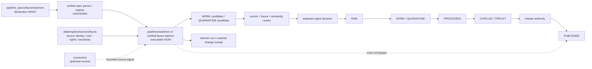

<!-- [KFM_META_BLOCK_V2]
doc_id: kfm://doc/pipeline-specs-fauna-watchers-readme
title: pipeline_specs/fauna/watchers/ — Governed Fauna Watcher Specification Boundary
type: readme
version: v0.2
status: draft; repository-grounded; readme-only; no-active-watcher-specs-established; sensitive-domain
owners: OWNER_TBD — Pipeline-spec steward · Fauna steward · Watcher steward · Source steward · Rights steward · Sensitivity/geoprivacy reviewer · Temporal/freshness steward · Validation steward · Evidence steward · Policy steward · Release steward · Docs steward
created: 2026-06-13
updated: 2026-07-15
supersedes: v0.1
policy_label: public; pipeline-specs; fauna; watchers; declarative-only; metadata-first; no-secrets; no-live-activation; no-direct-fetch; no-direct-admission; no-direct-raw; no-direct-release; sensitive-location-denial; source-role-preserving; rights-aware; stale-state-aware; review-gated
current_path: pipeline_specs/fauna/watchers/README.md
truth_posture: CONFIRMED current target, pipeline_specs root and shared watcher-spec contracts, Fauna parent spec contract, bounded README-only direct watcher-spec inventory, draft shared executable watcher and Fauna pipeline documentation, draft Fauna source-registry lane with unresolved topology, draft Fauna sensitivity doctrine, scaffold policy/sensitivity policy lanes, scaffold domain tests, partial fixture inventory, TODO-only domain-fauna workflow, and placeholder CODEOWNERS / PROPOSED minimum active watcher-spec contract, deterministic consumer binding, metadata-first comparison rules, materiality vocabulary, finite outcomes, sensitive-diff suppression, validation matrix, activation/deactivation discipline, and rollback requirements / UNKNOWN accepted watcher-spec schema, parser, registry, discovery, scheduler, source activation, executable consumer, network behavior, substantive CI enforcement, emitted watcher receipts, review integration, and production use / NEEDS VERIFICATION owners, exhaustive recursive inventory, canonical source-registry topology, admitted SourceDescriptors, rights and source-role vocabulary, current upstream terms, cadence and stale-state budgets, watcher report and receipt schemas, fixtures, executable tests, validator wiring, geoprivacy policy implementation, correction propagation, and rollback execution
evidence_snapshot:
  repository: bartytime4life/Kansas-Frontier-Matrix
  repository_id: "1059091169"
  visibility: public
  base_ref: main
  base_commit: 8af224617684d8e708c7550510a1f27d314e585a
  prior_blob: 7e8c19d9b9099b6446f11e21bb8204698950944a
  direct_lane_files:
    - pipeline_specs/fauna/watchers/README.md
  direct_lane_posture: bounded searches surfaced no concrete fauna watcher profile beyond this README
  shared_spec_lane: pipeline_specs/watchers/README.md
  shared_implementation_lane: pipelines/watchers/README.md
  domain_implementation_lane: pipelines/domains/fauna/README.md
  workflow_posture: domain-fauna is pull-request-triggered TODO scaffolding
related:
  - ../../README.md
  - ../README.md
  - ../../watchers/README.md
  - ../../../docs/doctrine/directory-rules.md
  - ../../../docs/domains/fauna/SENSITIVITY.md
  - ../../../docs/domains/fauna/SOURCE_REGISTRY.md
  - ../../../docs/domains/fauna/SOURCE_ROLES.md
  - ../../../docs/domains/fauna/SOURCE_FAMILIES.md
  - ../../../docs/domains/fauna/DATA_LIFECYCLE.md
  - ../../../pipelines/watchers/README.md
  - ../../../pipelines/domains/fauna/README.md
  - ../../../data/registry/sources/fauna/README.md
  - ../../../policy/domains/fauna/README.md
  - ../../../policy/sensitivity/fauna/README.md
  - ../../../tests/domains/fauna/README.md
  - ../../../fixtures/domains/fauna/README.md
  - ../../../release/candidates/fauna/README.md
  - ../../../.github/workflows/domain-fauna.yml
  - ../../../.github/CODEOWNERS
notes:
  - "v0.2 replaces a planning-only proposed profile tree with commit-pinned repository evidence and classifies the direct Fauna watcher-spec lane as README-only."
  - "Watcher specs are declarative intent only. They do not fetch source payloads, activate sources, admit RAW, emit evidence, update catalogs, or release public artifacts."
  - "Fauna sensitivity doctrine is deny-by-default for exact sensitive occurrence and site detail. This README records control requirements but contains no exact coordinates, identifiers, generalization radii, fuzzing parameters, private endpoints, or source credentials."
  - "No executable watcher profile, source record, connector, pipeline, schema, contract, policy rule, fixture, test, validator, workflow, lifecycle object, receipt instance, proof, release object, runtime behavior, or public artifact is created or modified."
[/KFM_META_BLOCK_V2] -->

<a id="top"></a>

# Governed Fauna Watcher Specification Boundary

`pipeline_specs/fauna/watchers/`

> Declarative run-intent boundary for Fauna source-change watchers. A reviewed profile here may state **what metadata or source-head signals a verified watcher should compare**, at what cadence, against which admitted source descriptors, and which bounded candidate reports, review handoffs, or no-op outcomes are expected. It does not fetch or admit payloads, assert that Fauna truth changed, expose sensitive location detail, create evidence, update catalogs, or authorize publication.


**Quick links:** [Purpose](#purpose) · [Authority](#authority-and-anti-collapse) · [Status](#current-status) · [Placement](#repository-fit) · [Inventory](#current-inspected-inventory) · [Scope](#fauna-watcher-scope) · [Contract](#minimum-active-watcher-specification-contract) · [Checks](#watch-signals-and-comparison-boundaries) · [Materiality](#material-change-classification) · [Sensitivity](#fauna-sensitivity-and-no-leak-boundary) · [Lifecycle](#lifecycle-handoffs-and-finite-outcomes) · [Validation](#validation-and-enforceability) · [Review](#review-activation-and-change-discipline) · [Done](#definition-of-done-for-an-active-watcher-specification) · [Rollback](#rollback-correction-and-deactivation) · [Backlog](#open-verification-register) · [Evidence](#evidence-ledger)

> [!IMPORTANT]
> **Evidence snapshot:** `main@8af224617684d8e708c7550510a1f27d314e585a`  
> **Target blob before this revision:** `7e8c19d9b9099b6446f11e21bb8204698950944a`  
> **Bounded direct-lane result:** this README; searches for `fauna.watchers.*`, `kfm.pipeline_spec.fauna.watcher`, and `tests/pipeline_specs/fauna/watchers` surfaced no concrete watcher profile or spec-specific test implementation  
> **Activation:** path presence, merge state, cadence text, or successful syntax validation activates nothing

> [!CAUTION]
> A watcher noticing a changed ETag, checksum, timestamp, version, manifest, header, or metadata field does **not** mean a source is admitted, the payload is new, the content is material, the source role or rights remain valid, a Fauna claim changed, or a public artifact should be refreshed. Exact sensitive occurrence or site details, re-identifying diffs, and steward-controlled information fail closed and must not be copied into watcher logs, reports, receipts, alerts, issue text, or generated summaries.

---

## Purpose

`pipeline_specs/fauna/watchers/` is the Fauna-specific watcher profile lane inside the `pipeline_specs/` responsibility root.

Its safe future role is to hold small, reviewed, deterministic declarative profiles that bind:

- a stable watcher-spec identity, version, owner, and finite status;
- one verified executable watcher consumer;
- admitted Fauna `SourceDescriptor` references;
- source role, rights, sensitivity, steward, and cadence expectations;
- metadata-first source-head or source-version comparison checks;
- prior-state and comparison-baseline requirements;
- retry, outage, stale-state, and no-op behavior;
- material-change classes and bounded reason codes;
- candidate `MaterialChangeReport`, proposed work, quarantine, and review-handoff expectations;
- watcher-run and material-change receipt requirements;
- no-network fixtures and deterministic replay expectations;
- explicit no-fetch, no-admission, no-RAW, no-evidence, no-catalog, and no-release constraints;
- correction, supersession, deactivation, and rollback posture.

This README is not a watcher specification schema, parser, registry, scheduler, executable watcher, source activation decision, source data record, policy decision, sensitivity transform, receipt, evidence object, catalog record, release record, or public notification system.

### Audience

- Fauna, source, watcher, rights, sensitivity, validation, policy, evidence, and release stewards;
- maintainers designing source-refresh and upstream-change observation;
- connector owners preparing bounded metadata or source-head checks;
- reviewers validating that watchers remain non-publishing and non-admitting;
- security reviewers checking credentials, endpoint, logging, and data-minimization posture;
- maintainers planning fixtures, validators, CI, activation, deactivation, or migration.

[Back to top](#top)

---

## Authority and anti-collapse

### Responsibility roots

```text
pipeline_specs/  = declarative watcher intent: WHAT may be checked and under which gates
pipelines/       = executable watcher behavior: HOW comparisons and handoffs occur
connectors/      = upstream access and source retrieval authority
registry/        = source identity, role, rights, sensitivity, cadence, and admission control
data/            = lifecycle records, candidate work, quarantine, receipts, proofs, catalogs, published artifacts
policy/          = admissibility, sensitivity, rights, and release decisions
release/         = publication, correction, withdrawal, supersession, and rollback authority
apps/            = governed serving surfaces; never direct watcher/spec truth clients
```

A watcher spec may require a gate. It cannot satisfy that gate merely by naming it.

### Disallowed collapses

```text
README or path existence           -> active watcher specification
merged watcher spec                -> scheduled execution
scheduled watcher                  -> source activation
watcher invocation                 -> source fetch
source signal changed              -> payload changed
payload changed                    -> material Fauna change
material change                    -> source admission
candidate report                   -> RAW capture
candidate report                   -> ValidationReport
candidate report                   -> EvidenceBundle
source-head match                  -> rights or terms approval
checksum match                     -> schema or content validation
cadence completed                  -> source freshness proof
watcher receipt                    -> proof or catalog closure
watcher handoff                    -> release approval
watcher notification               -> public or official alert
generated watcher summary          -> Fauna truth
```

### Required separations

- specs remain declarative under `pipeline_specs/`;
- executable watcher logic remains under verified `pipelines/` lanes;
- network access remains connector-owned or otherwise explicitly governed;
- source identity, role, rights, sensitivity, cadence, and activation remain registry-owned;
- candidate work and quarantine records remain in lifecycle homes;
- receipts remain process memory and do not become proof;
- evidence and catalog closure remain separate;
- policy and sensitivity decisions remain separate;
- release, correction, and rollback decisions remain separate;
- public clients consume governed released artifacts, not watcher state;
- missing or ambiguous trust-bearing state fails closed.

### Watchers are non-publishers

A Fauna watcher may report that a source-facing signal changed. It must not:

- fetch or persist an unapproved source payload merely because a signal changed;
- admit a payload to RAW;
- promote work or quarantine records;
- recalculate public Fauna layers;
- expose exact occurrence or sensitive-site details;
- create an `EvidenceBundle` or claim that proof closed;
- mutate catalog, triplet, release, API, map, tile, search, embedding, or generated-answer state;
- issue enforcement, health, disease, invasive-species, conservation, or emergency instructions.

[Back to top](#top)

---

## Current status

### Safe conclusion

`pipeline_specs/fauna/watchers/` is a repository-present README lane. The bounded inspection did not establish a concrete watcher profile, accepted schema, parser, registry entry, scheduler, consumer binding, active source, emitted watcher receipt, or production execution path.

| Capability or artifact | Status | Evidence-bounded conclusion |
|---|---:|---|
| Target README | `CONFIRMED` | `pipeline_specs/fauna/watchers/README.md` exists. |
| Concrete Fauna watcher profile | `NOT ESTABLISHED` | Searches for lane files and proposed schema/spec IDs surfaced no profile beyond this README. |
| Parent Fauna spec lane | `DRAFT README` | `pipeline_specs/fauna/README.md` defines declarative boundaries; active Fauna specs remain unverified. |
| Shared watcher-spec lane | `DRAFT README` | `pipeline_specs/watchers/README.md` documents shared watcher intent and domain-specific sublanes. |
| Shared executable watcher lane | `DRAFT / PROPOSED` | `pipelines/watchers/README.md` is detailed documentation; executable behavior, schedules, activation, and fixture coverage remain unverified. |
| Fauna executable pipeline | `DRAFT / PROPOSED` | `pipelines/domains/fauna/README.md` documents fail-closed processing; concrete executable behavior remains unverified. |
| Fauna source registry | `DRAFT CONTROL LANE` | `data/registry/sources/fauna/README.md` exists and records topology conflict; admitted descriptor inventory and current upstream terms remain unverified. |
| Source-registry topology | `CONFLICTED / NEEDS VERIFICATION` | Subtype-first and domain-first Fauna registry lanes both exist; duplicate authority is prohibited. |
| Fauna domain policy | `GREENFIELD SCAFFOLD` | The inspected policy README is only a 33-line broad scaffold. |
| Fauna sensitivity policy | `PROPOSED SCAFFOLD` | The inspected sensitivity-policy README contains no implemented rules. |
| Sensitivity doctrine | `DRAFT DOCTRINE` | Human-facing docs state deny-by-default and deliberately omit operational transform parameters. |
| Domain tests | `README-BACKED SCAFFOLD` | `tests/domains/fauna/` documents expected proof; executable test inventory remains unknown. |
| Watcher-spec-specific tests | `NOT ESTABLISHED` | Search surfaced no `tests/pipeline_specs/fauna/watchers/` implementation. |
| Fauna fixtures | `PARTIAL / DOCUMENTED` | Domain fixture lanes and some placeholder/search-visible examples are documented; watcher consumer alignment remains unverified. |
| Domain workflow | `TODO SCAFFOLD` | All `domain-fauna` jobs execute `echo TODO ...`. |
| CODEOWNERS | `PLACEHOLDER` | No Fauna watcher-spec ownership rule is present. |
| Parser, registry, scheduler, runtime | `UNKNOWN` | No production binding or execution was established. |
| Release/public behavior | `UNKNOWN / NOT AUTHORIZED HERE` | This lane cannot publish or serve public state. |

### Truth labels used here

| Label | Meaning |
|---|---|
| `CONFIRMED` | Directly inspected in the pinned repository snapshot or verified by branch/read-back checks. |
| `PROPOSED` | Safe design or contract language not accepted as implemented authority. |
| `NEEDS VERIFICATION` | Checkable but not verified strongly enough to use operationally. |
| `UNKNOWN` | Not resolved by the bounded inspection. |

### Explicitly not claimed

This README does not claim:

- a watcher schema is accepted;
- the lane contains a concrete YAML/JSON profile;
- a parser or auto-discovery mechanism exists;
- a schedule is active;
- a source is admitted or monitored;
- watcher network calls occur;
- watcher reports or receipts are emitted;
- sensitivity policy is executable;
- CI blocks watcher violations;
- a detected source change reaches RAW, PROCESSED, catalog, release, or public clients.

[Back to top](#top)

---

## Repository fit

### Directory Rules basis

The existing path is consistent with the responsibility-first model:

```text
pipeline_specs/fauna/watchers/
```

- `pipeline_specs/` owns declarative pipeline intent;
- `fauna/` is the domain segment;
- `watchers/` narrows the profile family to Fauna-specific source-change observation;
- executable orchestration stays in `pipelines/watchers/` or a verified Fauna implementation lane;
- domain sensitivity and representation rules remain in policy and review authorities;
- lifecycle records, receipts, proofs, catalog records, and releases remain in their own roots.

This update does not add, move, rename, delete, or canonicalize a path.

### Related-lane map



The diagram is a proposed governed relationship, not proof that the parser, watcher, scheduler, receipts, or handoffs are implemented.

### Shared versus domain-specific watcher profiles

Use the shared watcher-spec lane when the profile is domain-neutral. Use this Fauna lane only when the watcher needs Fauna-specific:

- source roles or source families;
- restricted-occurrence and sensitive-site handling;
- geoprivacy or representation review;
- taxonomy/status/occurrence/monitoring/range/health/invasive-species materiality rules;
- Fauna-specific reason codes or steward handoffs.

Do not copy the same authoritative profile into shared and Fauna lanes. One profile ID must have one authoritative home and explicit compatibility pointers if migration is needed.

[Back to top](#top)

---

## Current inspected inventory

### Direct lane

| Path | Observed status | Safe interpretation |
|---|---:|---|
| `pipeline_specs/fauna/watchers/README.md` | `CONFIRMED` | Documentation boundary; not an active profile. |
| Concrete `*.yaml`, `*.yml`, or `*.json` watcher profile | `NOT ESTABLISHED` | Bounded searches surfaced none. |

### Profile families preserved from v0.1

These are planning categories, not repository-established files:

| Family | Intended source-change scope | Current status |
|---|---|---:|
| taxonomy | Taxon authority, synonym, crosswalk, classification, or identifier drift. | `PROPOSED` |
| status | Conservation, legal, invasive, or stewardship status drift. | `PROPOSED` |
| occurrence | Occurrence-source release/version/manifest changes. | `PROPOSED` |
| monitoring | Monitoring or survey feed update signals. | `PROPOSED` |
| range | Range or seasonal-range source updates. | `PROPOSED` |
| health/mortality | Mortality, disease, rehabilitation, or surveillance source changes. | `PROPOSED` |
| invasive species | Invasive-species status, range, alert-feed, or registry changes. | `PROPOSED` |
| indicators | Public-indicator input source changes. | `PROPOSED` |

A family name does not authorize creating a profile, choosing an endpoint, assigning a source role, setting a cadence, or exposing a sensitive diff.

### Adjacent evidence boundary

| Surface | What it establishes | What it does not establish |
|---|---|---|
| Fauna parent spec README | Domain-specific declarative profiles are expected and fail closed on restricted/review gaps. | Active specs, parser, consumer, schedule, or CI. |
| Shared watcher-spec README | Shared watcher intent and anti-collapse rules. | Active shared profile or domain override behavior. |
| Shared watcher pipeline README | Intended executable watcher responsibilities. | Working code, schedule, source activation, or receipt emission. |
| Fauna pipeline README | Intended Fauna processing and geoprivacy boundaries. | Working watcher adapter or direct execution. |
| Fauna registry README | Source-control responsibilities and topology conflict. | A particular source is admitted, active, or safe to watch. |
| Fauna sensitivity docs | Deny-by-default doctrine and review expectations. | Executable policy or concrete transform parameters. |
| Domain tests/fixtures | Expected no-network and fail-closed proof posture. | Watcher-spec-specific executable coverage. |
| Domain workflow | Pull-request trigger exists. | Substantive validation; jobs are TODO echoes. |

[Back to top](#top)

---

## Fauna watcher scope

A future accepted Fauna watcher profile may observe only bounded source-change signals for an admitted, explicitly referenced source.

### In-scope signal families

- source availability or documented source-head state;
- source version, release number, revision date, or dataset vintage;
- ETag, Last-Modified, or equivalent response metadata when terms and access controls permit;
- manifest, index, inventory, or checksum changes;
- schema/version metadata changes;
- source descriptor changes or activation-state drift;
- taxonomy-authority release changes;
- status-list or conservation/legal-status release changes;
- occurrence, monitoring, range, mortality/disease, invasive-species, or indicator source release changes;
- upstream correction, withdrawal, deprecation, or supersession notices;
- source outage or stale-state signals.

### Out of scope

A watcher profile must not instruct the watcher to:

- crawl or download unrestricted content without connector/source approval;
- scrape terms-prohibited or authentication-protected material;
- store credentials, tokens, cookies, signed URLs, or private endpoints;
- ingest a changed payload into RAW;
- parse source content into Fauna records;
- infer sensitive species presence from metadata;
- include source payload excerpts or sensitive coordinates in reports;
- decide taxonomy, conservation status, occurrence validity, disease causality, or invasive-species truth;
- trigger a public map, tile, API, Focus Mode, notification, or release update;
- replace an official agency, scientific authority, steward, landowner, rights holder, or emergency authority.

### Metadata-first default

Prefer the least invasive change signal that can answer whether review may be needed:

1. accepted registry state and prior watcher receipt;
2. source-published version/release metadata;
3. manifest/index/checksum metadata;
4. bounded connector-provided head metadata;
5. payload retrieval only through a separately governed connector/ingest decision.

A watcher should not fetch content merely because a metadata comparison is unavailable. Missing support returns a finite negative outcome.

[Back to top](#top)

---

## Minimum active watcher-specification contract

> [!WARNING]
> The contract below is **PROPOSED**. It is not the accepted schema and must not be used to activate a watcher until schema, parser, consumer, policy, tests, ownership, and activation review are verified.

### 1. Identity and state

An active profile should have:

- stable `spec_id` and immutable identity semantics;
- semantic `version`;
- finite `status` from an accepted vocabulary;
- domain `fauna` and lane `watchers`;
- named owners and reviewers;
- creation, update, approval, activation, suspension, deprecation, and supersession timestamps where applicable;
- content digest and prior-version pointer;
- one authoritative path.

Proposed lifecycle states:

```text
PLACEHOLDER -> DRAFT -> REVIEW_REQUIRED -> APPROVED_INACTIVE -> ACTIVE
ACTIVE -> SUSPENDED | SUPERSEDED | DEPRECATED | REVOKED
ANY -> REJECTED | ERROR
```

These names are illustrative until a schema and state machine are accepted.

### 2. Parser and consumer binding

The spec must identify:

- parser/loader name and version;
- schema ID and version;
- one executable consumer or adapter;
- discovery method;
- precedence and duplicate-ID behavior;
- unknown-field behavior;
- unsupported-version behavior;
- fail-closed behavior for missing consumer or parser mismatch;
- activation record or equivalent approval pointer.

No auto-discovery should treat an unreviewed file as active merely because it is located in this directory.

### 3. Source binding

Every watched source must resolve to an admitted source-control record with:

- stable source ID;
- source family and source role;
- upstream authority and steward;
- rights/license/terms posture;
- sensitivity and geoprivacy posture;
- approved access method;
- allowed metadata checks;
- cadence and freshness expectations;
- attribution/citation requirements;
- activation, suspension, correction, withdrawal, and supersession state;
- connector or bounded access adapter reference;
- no embedded secrets.

If source-registry topology remains unresolved, activation must fail rather than guessing which registry record is authoritative.

### 4. Watch signal contract

Each check should declare:

- stable check ID;
- signal type;
- expected source field/header/manifest entry;
- comparison method;
- normalization rules for non-sensitive metadata;
- prior-state reference;
- deterministic digest method where used;
- timeout and bounded retry behavior;
- error and outage behavior;
- evidence minimization and log-redaction rules;
- whether a change can be classified without retrieving content.

### 5. Time, cadence, and stale state

The spec should distinguish:

- scheduled evaluation time;
- last successful check time;
- upstream issue/release time;
- source-provided effective or valid time;
- retrieval/check time;
- processing/report time;
- stale-after time;
- retry window;
- suspension time;
- correction or supersession time.

Required rules:

- cadence is not proof of freshness;
- a completed check does not make the source current;
- clock/time-zone handling is explicit;
- missing or unparsable source time fails closed;
- outages and rate limits preserve stale/unknown state;
- backoff does not silently extend freshness;
- stale sources do not produce public-current claims;
- a source revision may invalidate prior comparison baselines.

### 6. Prior-state and idempotency

An active watcher must define:

- accepted prior receipt or baseline ref;
- baseline digest/version/source-head;
- behavior when no prior state exists;
- deterministic replay behavior;
- duplicate-run suppression;
- no-op receipt behavior;
- handling of upstream rollback or version regression;
- handling of digest instability caused by ordering or volatile metadata;
- atomic update of watcher state after reviewable success.

A missing baseline must not be treated as “everything changed” without a reviewable bootstrap state.

### 7. Materiality

The spec may classify signals into finite categories such as:

```text
NO_CHANGE
NON_MATERIAL_CHANGE
MATERIAL_METADATA_CHANGE
POTENTIAL_CONTENT_CHANGE
RIGHTS_OR_TERMS_CHANGE
SENSITIVITY_OR_REPRESENTATION_CHANGE
SOURCE_ROLE_CHANGE
SCHEMA_OR_FORMAT_CHANGE
SOURCE_WITHDRAWN
SOURCE_SUPERSEDED
SOURCE_STALE
OUTAGE
NEEDS_REVIEW
ABSTAIN
ERROR
```

This vocabulary is proposed, not canonical.

Materiality classification must not decide:

- that a Fauna record is true;
- that a sensitive location is safe;
- that changed content should be admitted;
- that rights or terms remain acceptable;
- that public representation should change;
- that release should proceed.

### 8. Outputs and handoffs

Allowed declared outputs are bounded pointers or candidate artifacts such as:

- watcher-run receipt;
- material-change receipt;
- candidate `MaterialChangeReport`;
- proposed work record;
- quarantine candidate and reason codes;
- source-steward review request;
- Fauna-steward review request;
- rights/sensitivity review request;
- connector or ingest recommendation;
- no-op result;
- suspension or deactivation recommendation.

The spec must not declare direct outputs to RAW, PROCESSED, catalog, triplet, published, API, tile, map, search, embedding, notification, or release surfaces.

### 9. Security and logging

The spec and its consumer must prevent:

- credentials, tokens, cookies, authorization headers, private endpoints, signed URLs, or secrets in the file;
- source payloads or response bodies in watcher logs by default;
- exact occurrence geometry, sensitive-site identifiers, private observer details, steward-only notes, or reconstructive clues in reports;
- unrestricted HTTP targets or user-controlled URL expansion;
- redirect or DNS behavior that bypasses allowlists;
- uncontrolled log retention;
- sensitive diffs in issue trackers, notifications, traces, screenshots, metrics labels, or generated summaries;
- source terms or rate limits being bypassed by scheduling.

### 10. Review and activation

Activation should require:

- accepted schema and successful parse;
- unique profile ID;
- verified consumer binding;
- source record resolved and active;
- rights and sensitivity review;
- cadence/freshness review;
- no-network fixture coverage;
- deterministic positive, negative, and no-op tests;
- logging/no-leak tests;
- receipt/report schema support;
- separation-of-duties review appropriate to risk;
- explicit activation decision and rollback target.

A merged file without an activation record remains inactive.

[Back to top](#top)

---

## Illustrative inactive YAML

The example below is **incomplete, non-canonical, inactive, and unsafe for production use**. It demonstrates the boundaries an accepted schema would need to preserve.

```yaml
schema_version: kfm.pipeline_spec.fauna.watcher.v1  # PROPOSED; not accepted
spec_id: fauna.watchers.example_metadata_only
version: 0.0.0
status: PLACEHOLDER
active: false

domain: fauna
lane: watchers
owners:
  watcher: OWNER_TBD
  fauna: OWNER_TBD
  source: OWNER_TBD
  sensitivity: OWNER_TBD

consumer:
  parser: null
  parser_version: null
  executable: null
  discovery: explicit_only
  activation_record_ref: null

sources:
  - source_descriptor_ref: null
    required_state: active
    source_role: null
    rights_profile_ref: null
    sensitivity_profile_ref: null

watch:
  mode: metadata_only
  cadence: manual
  timezone: UTC
  checks:
    - source_version
    - etag
    - last_modified
    - manifest_digest
  payload_fetch_allowed: false
  baseline_receipt_ref: null

materiality:
  allowed_outcomes:
    - NO_CHANGE
    - NON_MATERIAL_CHANGE
    - NEEDS_REVIEW
    - ABSTAIN
    - ERROR
  content_change_requires_separate_ingest_review: true

sensitivity:
  exact_location_logging_allowed: false
  payload_excerpt_logging_allowed: false
  sensitive_diff_allowed: false
  public_notification_allowed: false

outputs:
  watcher_run_receipt_required: true
  material_change_report_allowed: true
  proposed_work_record_allowed: true
  raw_write_allowed: false
  catalog_write_allowed: false
  release_write_allowed: false

rollback:
  deactivate_on_error: true
  previous_spec_ref: null
  state_restore_ref: null
```

No implementation should accept this example merely because it parses as YAML.

[Back to top](#top)

---

## Watch signals and comparison boundaries

### Signal types

| Signal | What it can indicate | What it cannot establish |
|---|---|---|
| availability/HEAD | Endpoint or object appears reachable. | Source admission, content validity, freshness, or rights. |
| ETag | Upstream representation tag changed or remained stable. | Semantic equality, payload safety, or materiality. |
| Last-Modified | Upstream reports a modification time. | Trusted event time, complete revision history, or current truth. |
| version/release ID | Upstream names a new version or release. | Accepted schema, source role, or safe representation. |
| manifest/index | Inventory or listed objects changed. | Payload validity or Fauna claim change. |
| checksum/digest | Compared bytes or canonicalized metadata differ. | Meaningful domain change or safe admission. |
| schema/format metadata | Format/version appears changed. | Successful parsing or contract compatibility. |
| source descriptor drift | KFM control record changed. | Upstream payload changed. |
| correction/withdrawal notice | Upstream signals correction or withdrawal. | Complete downstream invalidation without review. |
| outage/rate-limit signal | Watcher cannot complete normally. | Source is unchanged or current. |

### Comparison discipline

- Normalize only non-sensitive metadata under a documented deterministic method.
- Preserve raw comparison evidence by hash or governed pointer, not by copying restricted content into public logs.
- Ignore known volatile fields only through reviewed rules.
- Treat unstable ordering, timestamps, signatures, and generated identifiers as explicit normalization concerns.
- Distinguish byte-level, manifest-level, schema-level, metadata-level, and semantic change.
- Do not infer semantic change when only a transport-level signal changed.
- Do not infer no change when a source omits or reuses metadata incorrectly.
- Record comparison uncertainty and reason codes.

### Source-family cautions

| Fauna source family | Watch concern | Required boundary |
|---|---|---|
| taxonomy/crosswalk | Identifier, synonym, classification, authority, or version drift. | Watcher cannot remap existing taxa or rewrite identity. |
| conservation/legal status | Status list revisions, jurisdiction, effective dates, or source withdrawal. | Watcher cannot determine legal status or enforcement effect. |
| occurrence aggregators | Dataset/version/manifest changes. | Aggregator access path is not source role; no sensitive payload excerpts. |
| monitoring/survey | Release notices, station/program metadata, protocol version. | Watcher cannot treat monitoring metadata as occurrence truth. |
| range/seasonal range | Product/version or methodology changes. | Range is derived context, not exact occurrence evidence. |
| mortality/disease | Bulletin/release/version changes. | Watcher cannot infer cause, risk, outbreak status, or public-health advice. |
| invasive species | Registry/status/update signals. | Watcher cannot issue alerts or expose private parcel/location detail. |
| public indicators | Input release/version changes. | Watcher cannot recompute or publish the indicator. |

[Back to top](#top)

---

## Material change classification

### Materiality is a review aid

Materiality classification exists to decide what kind of review or follow-up may be needed. It does not make a domain decision.

Possible dimensions:

- source identity or ownership changed;
- rights, terms, license, attribution, or redistribution changed;
- source role or authority scope changed;
- sensitivity or public-representation posture changed;
- source version, schema, field set, or format changed;
- taxonomy/status vocabulary changed;
- source coverage, geography, time range, or resolution changed;
- correction, withdrawal, deprecation, or supersession occurred;
- expected cadence or freshness behavior changed;
- only transport metadata changed;
- change could not be classified safely.

### No-op behavior

A no-op outcome should still be auditable when required, but it must not:

- overwrite a prior baseline without deterministic confirmation;
- suppress an outage or stale-state warning;
- imply that rights, sensitivity, source role, or release state were reapproved;
- cause downstream rebuilds by default;
- produce public-facing “no change” truth claims.

### Change storms and deduplication

An accepted spec should define:

- debouncing or aggregation windows;
- duplicate signal detection;
- correlation IDs;
- repeated-failure handling;
- maximum candidate/report rate;
- escalation thresholds;
- suspension behavior;
- recovery criteria;
- preservation of the first and latest relevant signal;
- no loss of correction or withdrawal notices.

Operational values belong in accepted spec/config/policy homes and should not expose sensitive source behavior in public documentation.

[Back to top](#top)

---

## Fauna sensitivity and no-leak boundary

### Deny-by-default material

Fauna watcher handling must fail closed for signals or derived diffs that could reveal:

- exact sensitive occurrence geometry;
- nests, dens, roosts, hibernacula, spawning, breeding, or refuge sites;
- telemetry paths, movement tracks, repeated timestamps, or location history;
- steward-controlled, agency-restricted, tribal, landowner, researcher, or private records;
- observer or contributor identities where restricted;
- private parcel or access detail;
- rare-species presence inferred from source object names, URLs, manifest paths, filenames, tile names, counts, or timing;
- combinations of public metadata that reconstruct a protected location.

### Sensitive-diff minimization

A watcher should record the smallest useful control result:

- changed/not changed/unknown;
- source and check IDs;
- safe digest or governed pointer;
- finite reason code;
- required reviewer;
- no sensitive values.

It should not record a field-level diff when that diff contains or reveals protected content. Use a restricted review pointer if authorized storage exists.

### Public and semi-public channels

Do not send sensitive watcher detail to:

- public or broadly visible issues;
- chat notifications;
- email distribution lists;
- metrics labels or dashboards;
- traces or error aggregators;
- screenshots or build artifacts;
- generated summaries or AI prompts;
- public API, UI, map, tile, search, or export systems.

### Geoprivacy boundary

A watcher does not apply or approve geoprivacy transforms. It may require that a later handoff route to a sensitivity/geoprivacy review. Concrete transform parameters remain outside this README and must be governed by accepted policy.

### Re-identification review

Even metadata-only signals require review when:

- a source object name encodes a species or site;
- small counts reveal a rare event;
- timing reveals breeding, migration, roosting, or survey activity;
- a manifest path or release unit identifies a restricted geography;
- cross-source correlation narrows a location;
- a source withdrawal itself reveals a sensitive event.

[Back to top](#top)

---

## Lifecycle handoffs and finite outcomes

### Watcher handoff flow

```text
SOURCE CONTROL SIGNAL
  -> WATCHER CHECK
  -> NO_CHANGE | CANDIDATE REPORT | QUARANTINE CANDIDATE | ABSTAIN | ERROR
  -> SOURCE / FAUNA / RIGHTS / SENSITIVITY REVIEW
  -> SEPARATE CONNECTOR OR INGEST DECISION
  -> RAW
  -> WORK / QUARANTINE
  -> PROCESSED
  -> CATALOG / TRIPLET
  -> PUBLISHED
```

The watcher cannot skip any downstream lifecycle or release gate.

### Proposed finite outcomes

| Outcome | Meaning | Required behavior |
|---|---|---|
| `NO_CHANGE` | Compared safe signals are equivalent under the declared method. | Record bounded no-op state; do not claim source truth is unchanged. |
| `NON_MATERIAL_CHANGE` | A change is observed but classified as non-material for the watcher scope. | Record reason; no ingest or release side effect. |
| `NEEDS_REVIEW` | Change may be material or trust-bearing. | Emit bounded candidate and route to named review. |
| `QUARANTINE_CANDIDATE` | Signal or metadata is unsupported, sensitive, rights-unclear, or unsafe. | Route a pointer/reason, not sensitive content. |
| `SOURCE_STALE` | Expected freshness cannot be established. | Preserve stale state; no public-current claim. |
| `SOURCE_WITHDRAWN` | Upstream withdrawal/deprecation signal exists. | Hold dependent actions and trigger governed review/correction. |
| `ABSTAIN` | Watcher lacks enough trusted information to classify safely. | No side effect beyond auditable bounded record. |
| `ERROR` | Parser, network, comparison, storage, or policy dependency failed. | Fail closed; preserve error without secrets/sensitive data. |

These names are proposed until accepted contracts and schemas define them.

### Failure codes

Candidate reason codes may include:

```text
WATCH_SPEC_INACTIVE
WATCH_SCHEMA_UNSUPPORTED
WATCH_CONSUMER_MISSING
WATCH_SOURCE_REF_MISSING
WATCH_SOURCE_INACTIVE
WATCH_REGISTRY_CONFLICT
WATCH_RIGHTS_UNRESOLVED
WATCH_SENSITIVITY_UNRESOLVED
WATCH_BASELINE_MISSING
WATCH_SIGNAL_UNAVAILABLE
WATCH_SIGNAL_CHANGED
WATCH_SIGNAL_AMBIGUOUS
WATCH_SOURCE_STALE
WATCH_SOURCE_WITHDRAWN
WATCH_FORMAT_CHANGED
WATCH_RATE_LIMITED
WATCH_OUTAGE
WATCH_NO_LEAK_BLOCK
WATCH_RECEIPT_FAILED
WATCH_REVIEW_REQUIRED
WATCH_ERROR
```

Reason codes must not encode protected species, sites, locations, private endpoints, or credentials.

[Back to top](#top)

---

## Validation and enforceability

### Validation layers

An active watcher spec should pass distinct checks:

1. **File and parser validation** — syntax, schema, version, finite fields.
2. **Identity validation** — unique IDs, versions, digests, one authoritative path.
3. **Consumer binding** — parser and executable target exist and agree.
4. **Source control validation** — source record resolves, is active, and has rights/sensitivity/cadence state.
5. **Security validation** — no secrets, private endpoints, unrestricted targets, or unsafe logging.
6. **Temporal validation** — cadence, stale state, time zones, retry, outage, and source vintage are explicit.
7. **Comparison validation** — deterministic baselines, normalization, digests, and no-op behavior.
8. **Materiality validation** — finite classes and review-only authority.
9. **Sensitivity validation** — no sensitive/reconstructive data in spec, logs, reports, receipts, or notifications.
10. **Lifecycle validation** — no direct fetch/admission/RAW/processed/catalog/release writes.
11. **Receipt validation** — process memory is bounded and separate from proof.
12. **Rollback validation** — deactivation and baseline restoration are realistic and tested.

### Required negative tests

- malformed YAML/JSON;
- unsupported schema version;
- unknown field in fail-closed mode;
- duplicate `spec_id`;
- duplicate authoritative profile in shared and Fauna lanes;
- missing consumer/parser;
- consumer version mismatch;
- implicit auto-activation;
- missing source descriptor;
- conflicting source-registry records;
- inactive, suspended, withdrawn, or superseded source;
- unresolved rights or terms;
- unresolved source role;
- unresolved sensitivity or review state;
- missing cadence or stale-after rule;
- ambiguous time zone;
- missing baseline;
- unstable digest caused by volatile metadata;
- ETag/Last-Modified absent or reused;
- network timeout, redirect, DNS failure, rate limit, outage;
- private endpoint or credential in spec;
- sensitive payload excerpt in log/report;
- exact or reconstructive location in diff;
- source change incorrectly causing RAW admission;
- watcher report incorrectly treated as validation/evidence/catalog/release;
- missing watcher receipt;
- failed receipt write;
- repeated change storm without deduplication;
- correction, withdrawal, or supersession not propagated;
- deactivation ignored by scheduler;
- rollback baseline cannot be restored.

### Required positive and no-op tests

- inactive placeholder parses but does not schedule;
- approved inactive profile remains inactive;
- active profile requires explicit activation record;
- metadata-only no-change produces deterministic no-op;
- safe version change produces bounded review candidate;
- rights-change signal routes to rights review;
- sensitivity-change signal routes to sensitivity review without detail leakage;
- outage preserves stale/unknown state;
- duplicate run is idempotent;
- repeated signal is deduplicated;
- deactivation stops future scheduling;
- rollback restores the prior accepted profile/baseline;
- all outputs remain outside RAW, catalog, release, and public surfaces.

### No-network default

Default tests should use small, synthetic, public-safe fixture snapshots. Live source calls must be separately authorized, marked, isolated, rate-limited, and excluded from the normal deterministic suite.

### CI posture

The repository-present `domain-fauna` workflow is not substantive proof because each job only echoes a TODO command. A future watcher-spec gate should execute real parser, source-control, no-leak, no-admission, receipt, deactivation, and rollback tests and block merge or activation on failure.

[Back to top](#top)

---

## Review, activation, and change discipline

### Required reviewers

Depending on the profile, review should include:

- pipeline-spec steward;
- watcher/executable owner;
- Fauna domain steward;
- source steward;
- rights/terms reviewer;
- sensitivity/geoprivacy reviewer;
- temporal/freshness reviewer;
- validation/test owner;
- security reviewer for network, endpoint, logging, or credential changes;
- release/correction reviewer when downstream public artifacts may be affected.

CODEOWNERS does not currently provide a verified Fauna watcher-spec rule, so reviewer assignment must not be inferred from path alone.

### Changes requiring renewed review

- source ID, source role, rights, terms, sensitivity, or activation state;
- endpoint/access adapter or network behavior;
- cadence, retry, stale-after, or outage behavior;
- check type, normalization, digest, or prior-state method;
- materiality classes or thresholds;
- report/receipt fields;
- logging, notification, or retention behavior;
- consumer/parser/discovery/precedence;
- activation/deactivation behavior;
- review routing;
- correction/supersession/withdrawal handling;
- rollback target or baseline state.

### Profile activation is governed state

Activation should be auditable and separate from file creation or merge. An activation record should identify:

- exact spec path/version/digest;
- parser and consumer versions;
- source refs and registry topology used;
- approvers and review timestamps;
- tests and fixtures executed;
- policy/rights/sensitivity state;
- schedule/cadence and environment;
- state/baseline storage location;
- receipt/report destinations;
- deactivation and rollback targets.

### Smallest useful change

Prefer one narrow watcher profile for one admitted source and one metadata signal over a broad multi-source framework. Prove no-op, failure, no-leak, no-admission, deactivation, and rollback behavior before expanding scope.

[Back to top](#top)

---

## Definition of done for an active watcher specification

A concrete Fauna watcher profile is not active or production-ready until all applicable items are verified:

### Placement and identity

- [ ] file lives in the accepted watcher-spec home;
- [ ] stable unique ID and version exist;
- [ ] one authoritative copy exists;
- [ ] prior version and digest are recorded;
- [ ] owners and reviewers are assigned.

### Parser and execution

- [ ] accepted schema exists;
- [ ] parser/loader is verified;
- [ ] unknown/unsupported input fails closed;
- [ ] executable consumer exists;
- [ ] discovery and precedence are deterministic;
- [ ] activation is explicit and auditable.

### Source and rights

- [ ] canonical source record resolves;
- [ ] registry topology conflict is resolved for the source;
- [ ] source is admitted and active;
- [ ] role, rights, terms, attribution, sensitivity, cadence, and steward are current;
- [ ] allowed metadata checks are documented;
- [ ] no credential or private endpoint is embedded.

### Watch behavior

- [ ] prior-state bootstrap is defined;
- [ ] comparison method is deterministic;
- [ ] volatile metadata handling is documented;
- [ ] time, cadence, retry, outage, and stale-state semantics are explicit;
- [ ] no-op and duplicate-run behavior are deterministic;
- [ ] materiality is finite and review-only;
- [ ] source withdrawal/correction/supersession is handled.

### Fauna sensitivity

- [ ] exact sensitive occurrence/site detail is absent from spec and public logs;
- [ ] re-identifying diffs are denied;
- [ ] sensitive metadata channels are reviewed;
- [ ] report/receipt schemas minimize detail;
- [ ] public notifications are prohibited unless a separately governed safe summary exists;
- [ ] geoprivacy remains policy/review-owned.

### Outputs and lifecycle

- [ ] only bounded candidate/report/receipt/handoff outputs are allowed;
- [ ] no direct fetch/admission/RAW write occurs;
- [ ] no normalize/validate/catalog/triplet/release/public write occurs;
- [ ] receipts remain separate from evidence/proof;
- [ ] quarantine routing is available for unresolved state.

### Tests and operations

- [ ] deterministic no-network fixtures exist;
- [ ] positive, negative, no-op, outage, stale, and sensitive-deny tests pass;
- [ ] no-leak and secret scans pass;
- [ ] activation/deactivation tests pass;
- [ ] rollback and baseline restore are demonstrated;
- [ ] substantive CI blocks failure;
- [ ] runbooks and correction paths are linked.

Until then, label the profile `PLACEHOLDER`, `DRAFT`, `REVIEW_REQUIRED`, or equivalent inactive state.

[Back to top](#top)

---

## Rollback, correction, and deactivation

### This README change

Before merge, close the draft PR and abandon its scoped branch. After merge, use a transparent revert commit or revert PR restoring the prior README and removing its generated-work receipt. No runtime rollback is expected because this README activates nothing.

### Future watcher profile rollback

A governed rollback should:

1. disable discovery and scheduling for the affected profile;
2. preserve the exact spec version, digest, activation record, and run receipts;
3. stop network or connector metadata checks associated only with the profile;
4. freeze or quarantine uncertain watcher state;
5. restore the last accepted profile and comparison baseline, or remain disabled;
6. prevent pending candidate reports from silently entering ingest;
7. review any rights, sensitivity, source-role, correction, or withdrawal change;
8. invalidate unsafe notifications, indexes, dashboards, caches, and generated summaries;
9. confirm no sensitive detail escaped into logs, receipts, issues, or artifacts;
10. issue correction, withdrawal, or downstream review records where required;
11. re-run no-op, no-leak, no-admission, deactivation, and rollback tests;
12. record the rollback decision and outcome.

### Source correction and withdrawal

When an upstream source corrects, withdraws, or supersedes material:

- the watcher may detect the control signal;
- dependent evidence, catalog, release, and public artifacts require separate governed review;
- the watcher must not silently delete history or public artifacts;
- prior receipts and baselines remain auditable;
- sensitive withdrawal signals must not disclose why or where material was restricted.

### Emergency stop

An emergency stop may suspend the watcher to prevent leakage or repeated unsafe calls, but it does not authorize history rewriting, source deletion, public correction, or release withdrawal without the appropriate governed records.

[Back to top](#top)

---

## No-loss crosswalk from v0.1

| v0.1 concern | v0.2 location | Preservation result |
|---|---|---|
| Declarative WHAT versus executable HOW | Purpose; Authority | Preserved and strengthened. |
| Watch source IDs and metadata signals | Scope; Minimum contract; Checks | Preserved with source-control gates. |
| Cadence and stale-source behavior | Minimum contract; Time/cadence rules; Validation | Preserved and expanded. |
| Material-change classification | Materiality; Finite outcomes | Preserved with bounded authority. |
| Candidate reports and review handoffs | Outputs; Lifecycle | Preserved; direct admission prohibited. |
| Watcher receipts | Minimum contract; Outputs; Validation | Preserved; receipt/proof separation added. |
| No source admission | Authority; Lifecycle; Tests | Preserved and expanded to no fetch/RAW/catalog/release. |
| Fauna profile families | Inventory; Source-family cautions | Preserved as planning categories, not files. |
| Minimal YAML example | Illustrative inactive YAML | Preserved, clearly inactive/non-canonical. |
| Spec tests and fixtures | Validation | Preserved with no-network/no-leak/rollback cases. |
| Definition of done | Definition of done | Expanded to activation and operations. |
| Open questions | Open verification register | Expanded and evidence-bounded. |

[Back to top](#top)

---

## Open verification register

| ID | Question | Status |
|---|---|---:|
| `FAUNA-WATCH-001` | What schema and finite state vocabulary are accepted for watcher specs? | `NEEDS VERIFICATION` |
| `FAUNA-WATCH-002` | What parser, registry, discovery, precedence, and duplicate-ID behavior are implemented? | `UNKNOWN` |
| `FAUNA-WATCH-003` | Which executable lane owns Fauna watcher adapters: shared watchers or a Fauna domain sublane? | `NEEDS VERIFICATION / ADR` |
| `FAUNA-WATCH-004` | Which concrete Fauna source descriptors are admitted, active, rights-cleared, and appropriate for metadata watching? | `NEEDS VERIFICATION` |
| `FAUNA-WATCH-005` | Which Fauna source-registry topology is canonical? | `NEEDS VERIFICATION / ADR` |
| `FAUNA-WATCH-006` | Which source roles, rights, sensitivity, and activation vocabularies are canonical? | `NEEDS VERIFICATION` |
| `FAUNA-WATCH-007` | Which source-head, manifest, checksum, ETag, Last-Modified, and version checks are allowed per source? | `NEEDS VERIFICATION` |
| `FAUNA-WATCH-008` | Which cadence, time-zone, retry, outage, and stale-state budgets are accepted? | `NEEDS VERIFICATION` |
| `FAUNA-WATCH-009` | What are the canonical `MaterialChangeReport`, proposed work, watcher receipt, and material-change receipt contracts/schemas? | `NEEDS VERIFICATION` |
| `FAUNA-WATCH-010` | Where does comparison baseline/state live, and how is it versioned and restored? | `UNKNOWN` |
| `FAUNA-WATCH-011` | Which fixtures and tests prove metadata-only, no-network, no-admission, no-leak, idempotency, deactivation, and rollback behavior? | `NEEDS VERIFICATION` |
| `FAUNA-WATCH-012` | Which validator owns watcher-spec and sensitive-diff enforcement? | `UNKNOWN` |
| `FAUNA-WATCH-013` | Which CI workflow substantively blocks watcher-spec violations? | `UNKNOWN`; current domain job is TODO-only |
| `FAUNA-WATCH-014` | How are rights, terms, source-role, sensitivity, correction, withdrawal, and supersession changes propagated downstream? | `NEEDS VERIFICATION` |
| `FAUNA-WATCH-015` | Which reviewers and separation-of-duties rules apply to activation and material changes? | `NEEDS VERIFICATION` |
| `FAUNA-WATCH-016` | How are unsafe logs, notifications, metrics, issues, artifacts, or generated summaries detected and invalidated? | `NEEDS VERIFICATION` |
| `FAUNA-WATCH-017` | What activation, suspension, revocation, and emergency-stop records are required? | `NEEDS VERIFICATION` |
| `FAUNA-WATCH-018` | Which first narrow profile should be implemented and proven end-to-end? | `PROPOSED decision needed` |

[Back to top](#top)

---

## Evidence ledger

### Repository evidence inspected

| Evidence | Blob / status | Relevance |
|---|---|---|
| `pipeline_specs/fauna/watchers/README.md` | `7e8c19d9...` | Prior watcher-spec README and v0.1 controls. |
| `pipeline_specs/fauna/README.md` | `40856b10...` | Parent Fauna spec boundary and sensitivity/release gates. |
| `pipeline_specs/watchers/README.md` | `4a1f642d...` | Shared watcher-spec boundary and domain-specific placement. |
| `pipelines/watchers/README.md` | `a3157c70...` | Intended shared executable watcher responsibilities; implementation unverified. |
| `pipelines/domains/fauna/README.md` | `7eb4baa9...` | Intended Fauna processing and geoprivacy boundary. |
| `data/registry/sources/fauna/README.md` | `c3a36f72...` | Source-control posture, topology conflict, sensitive-site denial. |
| `docs/domains/fauna/SENSITIVITY.md` | `58c557cd...` | Deny-by-default and no-operational-parameter doctrine. |
| `policy/domains/fauna/README.md` | `39b7c7dd...` | Greenfield policy scaffold; no enforcement proof. |
| `policy/sensitivity/fauna/README.md` | `aac9f7b6...` | Proposed sensitivity scaffold; no implemented rules. |
| `tests/domains/fauna/README.md` | `f9ea96cd...` | Expected proof posture; executable tests unknown. |
| `fixtures/domains/fauna/README.md` | `65939f4f...` | Partial synthetic/public-safe fixture inventory. |
| `.github/workflows/domain-fauna.yml` | `53e6b038...` | Three TODO-only jobs. |
| `.github/CODEOWNERS` | `6adabefc...` | Placeholder ownership; no Fauna watcher rule. |
| `.github/PULL_REQUEST_TEMPLATE.md` | `13c5d4ed...` | Required governance PR structure. |
| generated-receipt schema | `fba21ed2...` | AI-authorship provenance contract. |
| Directory Rules | `2affb080...` | Responsibility-root placement and lifecycle invariant. |

### Search evidence

- direct search for `pipeline_specs/fauna/watchers` surfaced this README and planning references;
- search for `fauna.watchers` surfaced only this README;
- search for `kfm.pipeline_spec.fauna.watcher` surfaced only this README;
- search for `tests/pipeline_specs/fauna/watchers` surfaced only README references;
- no matching open PR or scoped branch existed before this update.

### Evidence limitations

The inspection was bounded and did not prove a full recursive repository inventory, branch-protection state, external scheduler state, deployed runtime state, secret-manager state, upstream source terms, or off-repository operational configuration. Those remain `UNKNOWN` or `NEEDS VERIFICATION`.

[Back to top](#top)

---

## Maintainer checklist

Before accepting a change in this lane, confirm:

- [ ] the change is declarative watcher intent, not executable code;
- [ ] no profile becomes active by path or merge alone;
- [ ] source refs resolve to one canonical registry topology;
- [ ] rights, source role, sensitivity, cadence, and activation state are current;
- [ ] network behavior is connector-governed and bounded;
- [ ] no secret or private endpoint is committed;
- [ ] no sensitive location or reconstructive clue appears;
- [ ] materiality remains a review aid, not a domain decision;
- [ ] outputs are bounded candidate/report/receipt/handoff records only;
- [ ] no direct RAW, processed, catalog, triplet, release, or public write exists;
- [ ] no-network, no-leak, no-admission, idempotency, deactivation, and rollback tests exist;
- [ ] correction, withdrawal, supersession, and stale-state behavior are explicit;
- [ ] documentation, generated-work receipt, reviewers, and rollback notes are updated.

---

## Changelog

### v0.2 — 2026-07-15

- Replaced the planning-only profile-tree presentation with commit-pinned repository evidence.
- Classified the direct lane as README-only with no active watcher spec established.
- Added source-registry topology, policy, workflow, ownership, and implementation maturity boundaries.
- Added metadata-first access, source-control, time, prior-state, idempotency, materiality, security, sensitive-diff, finite-outcome, validation, activation, deactivation, correction, and rollback requirements.
- Preserved all v0.1 watcher families, lifecycle, no-admission, receipt, review, fixture, test, and open-question concerns through the no-loss crosswalk.
- Added no exact coordinates, identifiers, generalization parameters, credentials, endpoints, payloads, or public-operational instructions.

### v0.1 — 2026-06-13

- Established the initial declarative Fauna watcher-spec README and WHAT-versus-HOW boundary.

---

## Maintainer note

Keep this directory declarative, inactive by default, metadata-minimizing, and fail-closed. Do not add executable watcher code, connectors, credentials, source payloads, source descriptors, exact sensitive locations, operational geoprivacy parameters, lifecycle records, receipts, EvidenceBundles, catalog records, release decisions, public API/UI code, notifications, or generated source summaries here. Reference governed authority records by stable identifier and preserve an auditable correction and rollback path.
