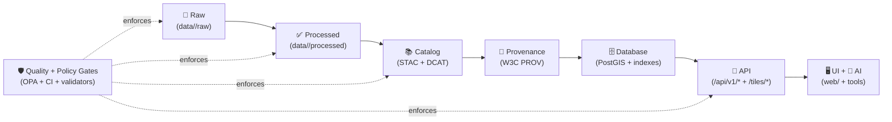

# 🚰 Pipelines


---

## 🎯 Purpose

This directory is the **runbook + conventions hub** for KFM’s data pipelines.

Pipelines are responsible for:
- 📥 **Ingesting** raw data (vector, raster, tabular, historical artifacts)
- 🧪 **Transforming** into interoperable, queryable formats
- 📚 **Publishing metadata** (DCAT + STAC) and 🧾 **provenance** (W3C PROV)
- 🗄️ **Loading / serving** via PostGIS + tile services
- 🧩 **Exposing** through the API (datasets, search, tiles, safe query)
- 🖥️ **Powering** UI + AI experiences with consistent, governed data

> 🧠 **Design principle:** “fail-closed” governance — if required metadata/policy checks are missing, pipelines **do not publish**.

---

## 🧭 Quick Links

- 🏗️ System architecture: `../docs/architecture/system_overview.md`
- 📦 Repo standards (STAC/DCAT/PROV + structure): `../docs/standards/`
- 🧩 API contract (datasets, tiles, pipeline triggers): `../src/server/api/README.md`
- 🧰 Tools (validators / helpers): `../tools/`
- 🧪 Tests: `../tests/`
- 📚 Data catalog outputs:
  - STAC: `../data/stac/`
  - DCAT: `../data/catalog/dcat/`
  - PROV bundles: `../data/prov/`

---

## 🗺️ Canonical Pipeline Flow



✅ **Rule of thumb:** if a dataset isn’t **cataloged** (STAC/DCAT/PROV), it isn’t “real” in KFM.

---

## 🧱 Where Data & Metadata Live

KFM splits **data** from **pipeline code**:

### 📁 Data domains (inputs + outputs)
Each domain has the same pattern:

```
data/<domain>/
  🧱 raw/         # read-only source drops (immutable snapshots)
  🧪 work/        # intermediate artifacts (cache, scratch, temp)
  ✅ processed/   # final outputs (publishable)
  🗺️ mappings/    # optional: dataset → STAC/DCAT/PROV mapping notes
  📄 README.md    # domain runbook
```

### 📁 Catalog / provenance (system-wide)
```
data/
  📁 stac/                # STAC Collections + Items
  📁 catalog/dcat/        # DCAT outputs (JSON-LD, etc.)
  📁 prov/                # provenance bundles per run/dataset
```

### 🧠 Pipeline implementation code
Depending on the repo version, pipeline code may live in:
- ✅ `src/pipelines/` (canonical layout)
- or this directory acts as the orchestration layer pointing into `src/pipelines/`

---

## 🚀 Running Pipelines

### Option A — Local dev (recommended) 🐳

1) Start the stack (DB/API/services):
```bash
docker compose up -d
```

2) Run a pipeline (examples — map to your actual runner):
```bash
# Example runner patterns (pick the one your repo implements)
python -m kfm.pipelines run <pipeline_name>
python -m src.pipelines run <pipeline_name>

# If you use Makefile targets:
make pipeline PIPELINE=<pipeline_name>
```

3) Validate outputs:
```bash
# Validators should confirm: schemas, metadata, provenance, policy
make validate
python -m tools.validate all
```

---

### Option B — Trigger via API (maintainers) 🔐

Pipelines can be triggered remotely (useful for automation / CI):

```bash
curl -X POST "http://localhost:5000/api/v1/ingest/runPipeline" \
  -H "Authorization: Bearer $KFM_TOKEN" \
  -H "Content-Type: application/json" \
  -d '{"pipeline":"<pipeline_name>","reason":"new raw drop"}'
```

Then monitor status via the pipeline run endpoints (run logs + PROV bundle).

> 🔁 **CI/CD hook idea:** GitHub Actions (or another CI) can call this endpoint after data changes land.

---

### Option C — Scheduled runs ⏱️

Typical schedules:
- 🌙 Nightly: “poll sources” + refresh federated datasets
- 📆 Weekly: heavier recompute / derived analytics refresh
- 🛰️ Event-driven: STAC feed triggers remote sensing ingest

---

## 🛰️ Pipeline Types

### 1) Remote sensing ingest (STAC-fed)
**Trigger:** new scene notification (e.g., Landsat/Sentinel/LiDAR)  
**Compute:** clip/mosaic, reproject, tile pyramid, COG conversion  
**Publish:** store raster in object store + emit STAC Item + PROV run bundle

Outputs often include:
- 🗺️ COGs (Cloud-Optimized GeoTIFF)
- 🧱 Tile sets (PMTiles / XYZ tiles)
- 🧾 Provenance + processing lineage

Optional: run AI steps (cloud masks, land cover classification, change detection) to produce new “geo-intelligence” layers 🤖🌾

---

### 2) Vector + tabular ingest (federated + harvested)
**Inputs:** boundary layers, infrastructure networks, historical features, CSVs  
**Storage:** PostGIS (spatial indexing, joins, point-in-polygon, etc.)  
**Serving:** vector tiles (MVT), GeoJSON streaming, approved SQL views

Federated approach options:
- 🔗 Live-link via external services (ArcGIS/OGC)
- 📦 Periodic harvest into `data/<domain>/raw/` snapshots for reproducibility

---

### 3) AI-derived layers (governed outputs)
If a pipeline produces AI-derived content (classifications, extractions, summaries):
- must attach 📌 model/run context
- must include 🧾 provenance + citations (where applicable)
- must pass 🚫 disallowed-content / policy checks  
Failing checks means: **no publish**.

---

## 📚 Metadata + Provenance (Non‑negotiable)

Every published dataset must be discoverable & auditable:

### ✅ DCAT (dataset catalog)
- Title, description, license, publisher/owner
- Distributions / assets (files, API links, tile URLs)
- Tags, temporal coverage, spatial extent

### ✅ STAC (spatiotemporal assets)
For imagery & tiled datasets:
- Collection + Items (footprints, timestamps, resolution, cloud cover, etc.)
- Links to physical assets (COGs, thumbnails, tile endpoints)

### ✅ W3C PROV (lineage)
Per run / dataset, record:
- inputs (source manifest, raw artifact hash)
- processing steps + parameters
- software versions / container digests
- outputs + checksums

---

## 🛡️ Quality Gates (Fail‑Closed)

These gates are intentionally strict. Pipelines **must** stop if requirements aren’t met:

### 🧾 Source manifest required (before processing)
A pipeline **cannot begin** unless a source manifest exists with at least:
- publisher / origin
- license / usage rights
- sensitivity classification

### 📚 Catalog publish requires metadata completeness
A dataset **cannot be listed** unless:
- STAC/DCAT/PROV artifacts exist
- mapping/links are valid
- required fields pass schema validation

### 🤖 AI outputs require extra checks
AI-derived layers must include:
- citations / justification (where applicable)
- disallowed content checks
- governance policy compliance

### 🧪 CI checks fail the merge
CI should block merges if:
- validations fail
- formatting/linting fails
- license header / attribution checks fail
- policy-as-code checks fail (OPA)

> 💥 “Fail-closed” means **default deny** — no silent success, no partial publish.

---

## 🧰 Authoring a New Pipeline

### 1) Pick a dataset ID 🏷️
Use a stable, readable ID:
- `ks_hydrology_1880`
- `ks_trails_historic`
- `ks_landsat_ndvi_monthly`

### 2) Create a source manifest 🧾
Put it next to the raw drop or pipeline definition.

Example (YAML):
```yaml
id: ks_hydrology_1880
title: Kansas Hydrology (1880)
publisher: "<agency_or_archive>"
source_url: "<where_it_came_from>"
license: "<license_name_or_url>"
sensitivity: public   # public | internal | restricted
update_frequency: "one-time" # or daily/weekly/monthly/event-driven
spatial_extent: "Kansas"
notes: "Add any acquisition constraints or caveats here"
```

### 3) Implement the ETL stages 🧱→✅
Recommended breakdown:
- `extract` → fetch/read/normalize raw
- `transform` → clean/standardize/projection fixes
- `validate` → schema + geometry + constraints
- `load` → PostGIS / object store
- `publish` → metadata + provenance + tiles

### 4) Emit STAC/DCAT/PROV 📚🧾
- DCAT dataset summary + distributions
- STAC items/collections (if spatiotemporal assets)
- PROV run bundle with hashes + parameters

### 5) Add tests ✅
Minimum:
- schema validation
- sample query checks (can the API serve it?)
- metadata completeness checks
- policy checks (OPA)

---

## 🧪 Recommended File Layout (Template)

> Adjust to match your repo layout — the goal is consistency.

```
src/pipelines/
  📁 <domain>/
    📁 <dataset_id>/
      📄 pipeline.yaml
      📄 source_manifest.yaml
      🐍 extract.py
      🐍 transform.py
      🐍 load.py
      🐍 publish.py
      📁 tests/
        🧪 test_contracts.py
        🧪 test_metadata.py
      📄 README.md   # dataset-specific runbook (optional)

tools/
  🧰 validate.py
  🧰 stac_build.py
  🧰 dcat_build.py
  🧰 prov_build.py

data/
  📁 <domain>/
    🧱 raw/
    🧪 work/
    ✅ processed/
```

---

## 🧩 How Pipelines Surface Through the API

Once processed + cataloged, datasets should be available via:
- `GET /api/v1/datasets/{id}` → DCAT summary + asset links (STAC, files, etc.)
- `GET /api/v1/catalog/search` → discoverability by keyword/bbox/time
- `GET /api/v1/datasets/{id}/data?format=geojson&bbox=...` → data streaming
- `GET /api/v1/query?...` → safe, logged SQL-like access to approved views
- `GET /tiles/{layer}/{z}/{x}/{y}.pbf|.png` → map tile serving

---

## 🔒 Security & Sensitivity

KFM pipelines are expected to:
- 🧷 tag datasets with sensitivity (public/internal/restricted)
- 🧹 sanitize outputs where required (columns, geometry precision, redactions)
- 🕵️ log access + pipeline runs for auditability
- 🛡️ enforce policy checks at every boundary (ingest, publish, API)

---

## 🧯 Troubleshooting

- **Pipeline won’t start** → check for missing `source_manifest.yaml`
- **Dataset not appearing in UI/search** → DCAT/STAC not published or schema invalid
- **Tiles 404** → layer not registered / tile cache not built / permissions issue
- **API returns sanitized output** → sensitivity classification or policy enforcement
- **CI blocks merge** → treat as a feature; fix gates rather than bypass them 😉

---

## 🧠 Glossary

- **STAC**: SpatioTemporal Asset Catalog (imagery + spatiotemporal asset metadata)
- **DCAT**: Data Catalog Vocabulary (dataset discovery + distributions)
- **PROV**: W3C Provenance model (lineage + reproducibility)
- **COG**: Cloud-Optimized GeoTIFF (efficient raster access)
- **MVT**: Mapbox Vector Tiles (`.pbf`) for fast vector map rendering
- **OPA**: Open Policy Agent (policy-as-code enforcement)

---

### 🌾 Build responsibly. Publish confidently. Keep provenance forever. 🧾✨