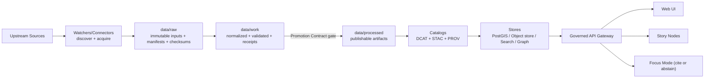

<!--
GOVERNED ARTIFACT NOTICE
This README governs KFM’s pipeline layer. Pipelines are a trust-boundary surface: they produce “served truth.”
If you change meaning (not just phrasing), route through the governance review path (CODEOWNERS + CI gates).
-->

# KFM Pipelines 📦🧬🗺️

> **Scope:** This README governs the **pipeline layer**: ingestion, normalization, validation, promotion, catalogs/provenance emission, and downstream refresh triggers.  
> **Applies to:** `pipelines/` **or** `src/pipelines/` (repo-dependent).  
> **Design intent:** KFM pipelines are **not scripts**. They are **governed production systems** that create *publishable, reproducible, auditable* datasets.


> [!NOTE]
> Wire badges above to real CI workflows once workflow names/URLs are finalized.

---

## Quick links

- Repo governance + required CI gates: `.github/README.md`
- Policies (default deny, promotion guard): `policy/`
- Contracts/schemas (Promotion Contract + receipt schemas): `contracts/` or `schemas/`
- Data zones (raw/work/processed + catalogs): `data/`
- Story Nodes + docs (governed narratives): `docs/`

---

## Table of contents

- [Governance header](#governance-header)
- [Non-negotiables](#non-negotiables)
- [What lives here](#what-lives-here)
- [Directory layout](#directory-layout)
- [Truth path](#truth-path)
- [Data zones and promotion gates](#data-zones-and-promotion-gates)
- [Artifact contracts (required outputs)](#artifact-contracts-required-outputs)
- [Deterministic spec identity (`spec_hash`)](#deterministic-spec-identity-spec_hash)
- [Connector contract](#connector-contract)
- [Validation gates](#validation-gates)
- [Promotion to processed](#promotion-to-processed)
- [Catalog + provenance emission](#catalog--provenance-emission)
- [Downstream refresh triggers (indexes/graph/search)](#downstream-refresh-triggers-indexesgraphsearch)
- [Policy + sensitivity (redaction-first)](#policy--sensitivity-redaction-first)
- [Orchestration, scheduling, and backfills](#orchestration-scheduling-and-backfills)
- [CI gates (must pass)](#ci-gates-must-pass)
- [Local development (Docker Compose)](#local-development-docker-compose)
- [Operations runbook (pipelines)](#operations-runbook-pipelines)
- [PR checklist](#pr-checklist)
- [Sources and provenance for this README](#sources-and-provenance-for-this-readme)

---

## Governance header

| Field | Value |
|---|---|
| Document | `pipelines/README.md` *(or `src/pipelines/README.md`)* |
| Status | **Governed** (changes require review) |
| Applies to | Ingestion, promotion gates, receipts, catalogs, provenance, index refresh triggers |
| Version | `v2.0.0-draft` |
| Effective date | 2026-02-15 |
| Owners | `.github/CODEOWNERS` *(required; if missing, treat as governance gap)* |
| Review triggers | Any change touching contracts/schemas, promotion rules, receipt formats, catalog emission, sensitivity/redaction behavior |

> [!WARNING]
> **Fail-closed rule:** if a required enforcement surface is missing (policy, receipts, catalogs, checksums, validators), promotion and serving must **deny** by default.

---

## Non-negotiables

These are **build invariants**. If you violate them, you are not “moving fast”—you are breaking KFM.

1) **Processed is the only publishable source of truth.**  
   - `data/processed/` (and its catalogs) are the only sources eligible for serving via API.  
   - `data/raw/` and `data/work/` are **never served** directly to end users.

2) **Promotion is contract-governed and fail-closed.**  
   Promotion must deny unless required proofs exist and validate:
   - receipts (run manifest/receipt + run record)
   - deterministic checksums
   - validation report(s)
   - catalogs (DCAT always; STAC/PROV as applicable)
   - sensitivity classification + redaction provenance (when required)

3) **Every pipeline run emits governed receipts.**
   - `run_record.json` (run metadata, inputs/outputs, code identity, links)  
   - `validation_report.json` (schema/geo/time/license/policy/pruning checks)  
   - `run_manifest.json` *(receipt)* validating Promotion Contract requirements

4) **Deterministic identity (`spec_hash`) is required for governed specs.**
   - `spec_hash = sha256(JCS(spec))` using RFC 8785 canonical JSON (JCS)  
   - specs drive watchers, pipelines, promotion jobs, and should be reproducible

5) **Trust membrane rules apply end-to-end.**
   - frontends/external clients never access DBs directly
   - policy is evaluated on governed requests (fail closed)
   - audit and evidence are part of the normal request path

6) **Evidence resolution must be possible.**
   - provenance and citations must be resolvable via evidence endpoints (e.g., `prov://`, `stac://`, `dcat://`, `doc://`, `graph://`, optionally `oci://`).

> [!IMPORTANT]
> Pipelines must be designed so Focus Mode can **cite or abstain**—which is only possible when datasets have complete catalogs + provenance.

---

## What lives here

Pipeline code is responsible for:

- **Connectors/watchers** (discover + acquire upstream sources; open PRs on material change where used)
- **Normalization** (canonical encoding/geometry/time; stable schemas)
- **Validation** (schema + geo + time + license + policy prerequisites)
- **Enrichment** (join keys, place/time normalization, entity-resolution candidates)
- **Receipts** (run record + run manifest + validation report + checksums)
- **Catalogs** (DCAT always; STAC/PROV as applicable; cross-linked and validated)
- **Promotion** (controlled act of making data publishable: raw/work → processed)
- **Index refresh triggers** (search/vector/graph refresh derived from catalogs, not ad-hoc)
- **Backfills** (documented strategy for historical ranges and reprocessing)
- **Determinism** (content-based versions; reproducible runs; stable IDs)

---

## Directory layout

> [!NOTE]
> This is a **recommended** structure aligned with KFM’s governance model. If your repo already uses a different structure,
> keep your existing structure but preserve the invariants and document your mapping here.

```text
pipelines/ or src/pipelines/
├─ README.md                           # (this file)
│
├─ registry/                           # declarative configs (CI-validated; CODEOWNED)
│  ├─ datasets.yml                     # dataset_id → connector/watchers + cadence + policy labels
│  ├─ sources.yml                      # upstream sources capability metadata (limits, formats, paging)
│  └─ schedules.yml                    # run schedules (cron-like) + materiality thresholds (optional)
│
├─ connectors/                         # one connector per upstream source
│  └─ <source_slug>/                   # stable source id (kebab-case)
│     ├─ connector.py                  # acquire/discover implementation
│     ├─ mapping.yml                   # source → canonical schema mapping (units/transforms/defaults)
│     ├─ contract.json                 # connector contract metadata (capabilities, cursors, formats)
│     ├─ fixtures/                     # tiny deterministic slices (no sensitive real data)
│     └─ tests/                        # unit/contract/integration tests
│
├─ specs/                              # governed specs (inputs to runs; hashed via spec_hash)
│  ├─ ingest/                          # ingestion specs (dataset_id, windows, parameters)
│  ├─ promote/                         # promotion specs (what becomes processed)
│  └─ backfill/                        # backfill specs (ranges, chunking, throttles)
│
├─ transforms/                         # normalization + enrichment steps (pure, repeatable)
│  ├─ normalize/                       # encoding, geometry/time standardization
│  ├─ enrich/                          # joins, derived fields, entity candidates
│  └─ export/                          # parquet/geojson/cog generation, tiling (as applicable)
│
├─ validation/                         # reusable validators (must be deterministic)
│  ├─ schema/                          # schema checks + coercion rules
│  ├─ geo/                             # geometry validity, bounds, CRS checks
│  ├─ time/                            # temporal sanity checks
│  ├─ license/                         # license/attribution presence checks
│  ├─ policy/                          # sensitivity classification prerequisites, redaction checks
│  └─ checksums/                       # digest computation + verification helpers
│
├─ catalogs/                           # catalog writers/builders (publishable metadata products)
│  ├─ dcat/                            # DCAT outputs (dataset/distribution records)
│  ├─ stac/                            # STAC outputs (Collections/Items; asset href conventions)
│  └─ prov/                            # PROV outputs (lineage bundles; activities/entities/agents)
│
├─ promotion/                          # promotion logic (raw/work → processed)
│  ├─ gate/                            # Promotion Contract evaluation (fail closed)
│  ├─ materialize/                     # filesystem/object-store materialization
│  └─ publish/                         # publish metadata + trigger index refresh
│
├─ receipts/                           # receipt generation helpers + schema adapters
│  ├─ run_record.py
│  ├─ run_manifest.py
│  └─ audit_event.py                   # promotion event emission (if pipelines emit directly)
│
├─ orchestration/                      # job orchestration adapters (CI, cron, k8s jobs, etc.)
│  ├─ local/                           # local entrypoints (parity with CI)
│  └─ ci/                              # CI wrappers (thin; call same core logic)
│
└─ tests/
   ├─ unit/
   ├─ integration/
   ├─ contract/
   └─ regression/                      # drift checks, leakage regressions, golden proofs
```

### Layout rules (pipeline invariants)
- Specs used to run pipelines must be **stable** and must produce a reproducible `spec_hash`.
- Promotion is a **separate controlled step** (not implicit in ingest), and must evaluate Promotion Contract gates.
- Fixture data must never include sensitive locations/PII; use synthetic or heavily generalized data.

---

## Truth path

KFM’s truth path is the required mental model for every pipeline change.



---

## Data zones and promotion gates

Every dataset flows through three zones. **Promotion is only allowed** when machine-checkable catalogs and validations succeed.

### Zones

| Zone | Purpose | Allowed operations | Must exist before promotion |
|---|---|---|---|
| **Raw** | immutable capture of upstream source-of-truth | append-only writes; no transforms | raw manifest + checksums + license/sensitivity captured |
| **Work** | repeatable transforms + QA staging | derivation, normalization, enrichment | run record + validation report + PROV activity stub |
| **Processed** | query-ready artifacts eligible for serving | publishable outputs only | checksums + catalogs (DCAT always; STAC conditional; PROV required) + promotion audit event |

> [!IMPORTANT]
> If something is visible to end users, it must trace back to **processed** and its catalogs.

---

## Artifact contracts (required outputs)

Pipelines must produce **machine-readable artifacts** that make the system reproducible and auditable.

### Required artifacts (baseline matrix)

| Artifact | Required | Canonical location (preferred) | Purpose |
|---|---:|---|---|
| Raw manifest | ✅ | `data/raw/<dataset_id>/manifest.yml` | license + expected inputs + checksums + sensitivity |
| Raw checksums | ✅ | `data/raw/<dataset_id>/checksums.sha256` | integrity for upstream captures |
| Run record | ✅ | `data/work/<dataset_id>/runs/<run_id>/run_record.json` | inputs/outputs + code identity + links |
| Validation report | ✅ | `data/work/<dataset_id>/runs/<run_id>/validation_report.json` | schema/geo/time/license/policy + profiles |
| Run manifest / receipt | ✅ | `data/work/<dataset_id>/runs/<run_id>/run_manifest.json` | Promotion Contract proof bundle |
| Processed checksums | ✅ | `data/processed/<dataset_id>/checksums.sha256` | integrity for served truth |
| DCAT record | ✅ | `data/catalog/dcat/<dataset_id>.json` | discovery + license + restrictions |
| STAC collection/items | ◻︎ conditional | `data/catalog/stac/<dataset_id>/**` | spatial assets catalog |
| PROV bundle | ✅ | `data/catalog/prov/<dataset_id>/run_<run_id>.json` | lineage raw → processed |
| Promotion audit event | ✅ | runtime ledger (or `data/audit/` in dev) | append-only promotion record |
| Bundle descriptor | ◻︎ optional | `data/bundles/<bundle_digest>/descriptor.json` | digest-addressed evidence pack |

> [!NOTE]
> Naming: KFM uses “run record / run receipt / run manifest” interchangeably across drafts. This README treats:
> - `run_record.json` = run metadata  
> - `run_manifest.json` = Promotion Contract receipt

---

## Deterministic spec identity (`spec_hash`)

> [!IMPORTANT]
> KFM treats specs as governed inputs. If specs are not reproducible, receipts are not trustworthy.

### Required definition

- `spec_hash = sha256(JCS(spec))`  
  - `JCS` is JSON Canonicalization Scheme (RFC 8785)
  - the same semantic spec must hash the same across platforms and runs

### Required companion fields (recommended for comparability)

- `spec_schema_id` — stable identifier for the spec schema (URI or canonical ID)
- `spec_recipe_version` — semver of the pipeline recipe interpreting the spec

### Run manifest excerpt (illustrative)

```json
{
  "run_id": "run_2026-02-15T12:34:56Z",
  "dataset_id": "example_dataset",

  "spec_schema_id": "kfm.schema.ingest_spec.v1",
  "spec_recipe_version": "1.2.0",
  "spec_hash": "sha256:...",

  "inputs": [{"uri":"data/raw/example_dataset/source.csv","sha256":"..."}],
  "code": {"git_sha":"...","image":"kfm/pipeline@sha256:..."},
  "outputs": [{"uri":"data/processed/example_dataset/out.parquet","sha256":"..."}],

  "validation_report": "data/work/example_dataset/runs/run_.../validation_report.json",
  "prov_ref": "data/catalog/prov/example_dataset/run_run_....json",
  "catalogs": {
    "dcat_ref": "data/catalog/dcat/example_dataset.json",
    "stac_ref": "data/catalog/stac/example_dataset/collection.json",
    "prov_ref": "data/catalog/prov/example_dataset/run_run_....json"
  },
  "policy": {
    "classification": "public|internal|restricted",
    "sensitivity_flags": ["sensitive_location","culturally_sensitive","pii_risk"]
  }
}
```

---

## Connector contract

Connectors must support the ingestion workflow:

1) **Discover**: resolve endpoints/parameters/auth; cache capability metadata  
2) **Acquire**: fetch incremental slices when possible; otherwise snapshot+diff  
3) **Normalize**: canonical encodings (UTF-8), geometry (WGS84), time (ISO 8601)  
4) **Validate**: schema + geometry + timestamp sanity + license/policy prerequisites  
5) **Enrich**: join keys, place/time normalization, entity candidates  
6) **Emit receipts + catalogs**: run record + validation report + run manifest; DCAT/STAC/PROV as applicable  
7) **Publish**: only via **promotion job** that enforces the Promotion Contract

### Connector config keys (minimum)

| Key | Rule |
|---|---|
| `dataset_id` | stable ID (prefer snake_case) |
| `schedule` | cadence (near real-time / daily / monthly / annual / on-demand) |
| `incremental_cursor` | use `modified_date`/`event_date` where possible; else snapshot+diff |
| `auth` | secrets in secret manager; never committed |
| `rate_limit` | respect provider limits; bounded retries; exponential backoff |
| `format_targets` | canonical outputs (Parquet/GeoParquet/GeoJSON/COG as applicable) |
| `policy` | classification + sensitivity flags + redistribution constraints |
| `lineage` | upstream identifiers + stable `source_record_id` mapping |

### Identity mapping rules (minimum)

- Persist `dataset_id` + upstream identifiers.
- A **DatasetVersion** is defined by **inputs + spec_hash + code identity + output digests** (receipt-driven).
- `source_record_id` must be stable per upstream semantics (supports evidence citations and joins).

---

## Validation gates

**Minimum validation gates (must be automated + CI-enforced):**

- Row-level schema validation (required fields, coercion rules documented)
- Geometry validity + bounds (if spatial)
- Temporal consistency checks
- License + attribution captured (DCAT prerequisites)
- Sensitivity classification present (fail closed if missing/unknown)
- Checksums computed and verified for inputs and outputs
- Provenance completeness: PROV links raw inputs → processed outputs

### Recommended quality gates (strongly encouraged)

- Profile summary: row counts, null rates, key uniqueness, distributions (drift baseline)
- Duplicate detection / primary key strategy check
- Spatial sanity: expected bbox/extent, geometry types, SRID checks
- Join key health: unmatched rates, referential stability
- Redaction/generalization validation when sensitivity flags require it

### Test plan expectations (CI-ready)

- **Unit:** schema mapping/type coercion; geometry validity helpers; incremental window logic
- **Integration:** connector runs against a deterministic tiny slice; asserts stable digests + counts
- **Contract:** API responses reference processed artifacts and include evidence hooks
- **Regression:** drift metrics stable or explainably versioned; leak regressions remain denied forever

---

## Promotion to processed

Promotion is a **separate job** from ingestion. It is the controlled act of making data publishable.

### Promotion steps (minimum)

1) **Evaluate kill switch**  
   - if `KFM_GOVERNANCE_KILL_SWITCH=true` → deny promotion

2) Confirm receipts exist and validate  
   - run record present  
   - validation report present  
   - run manifest validates Promotion Contract schema

3) Materialize processed artifacts  
   - copy/move/build outputs into `data/processed/<dataset_id>/...`

4) Compute and verify processed checksums  
   - `checksums.sha256` for every served artifact

5) Generate and validate catalogs  
   - **DCAT**: required  
   - **STAC**: required when spatial assets are present  
   - **PROV**: required

6) Append promotion audit event  
   - audit ledger records promotion with `run_id`, dataset identity, digests

7) Trigger downstream refresh from canonical catalogs  
   - search/vector/graph refresh is driven from catalogs, not ad-hoc paths

> [!IMPORTANT]
> Promotion fails if any required artifact is missing or invalid. **Fail closed.**

---

## Catalog + provenance emission

Catalogs are not documentation. They are **served products**.

### Cross-linking rules (minimum)

- DCAT dataset record must include:
  - license + attribution + restrictions
  - temporal/spatial coverage (if applicable)
  - dataset_id + version identifiers (receipt-driven)
  - links to distributions (processed artifacts) and their digests/checksums
  - links to related STAC collection (when used)
  - links to PROV run bundle(s)

- STAC collection/items must:
  - describe spatial assets (COGs, vectors, tiles) with stable href conventions
  - link back to DCAT dataset identity where possible (via common IDs/links)

- PROV bundle must:
  - link raw inputs → work transforms → processed outputs
  - record activity metadata (run_id, toolchain, code identity)
  - include agents where appropriate (service/pipeline identity)

### Evidence resolution goal

Every dataset should support stable evidence references:
- `dcat://dataset/<dataset_id>`  
- `stac://collection/<dataset_id>` and `stac://item/<asset>`  
- `prov://run/<run_id>` or `prov://entity/<digest>`

(Exact schemes are implementation-defined, but the UI must resolve them.)

---

## Downstream refresh triggers (indexes/graph/search)

Pipelines may trigger refreshes for:
- text search index
- vector index (embeddings)
- knowledge graph (entity/relationship extraction)
- tile caches

### Non-negotiable rule
Refresh triggers must be driven by **canonical catalogs/receipts**, not by ad-hoc file paths.

Recommended pattern:
- promotion writes/updates catalogs
- a refresh job reads catalogs and updates indexes idempotently
- receipts capture refresh results (optional but recommended)

---

## Policy + sensitivity (redaction-first)

Pipelines treat sensitivity classification as a **first-class input** and support redaction/generalization as a governed transformation.

### Minimum policy behavior
- Fail closed when classification is missing/unknown.
- For `sensitive_location`, publish generalized derivatives for public audiences (and/or deny precise geometry).
- For restricted fields, publish redacted derivatives or enforce field-level policy at API boundary (prefer both).

### Human review gate
If sensitivity flags are present (e.g., `sensitive_location`, `culturally_sensitive`, `pii_risk`):
- require governance review before promotion
- record approval reference in receipt/audit metadata (implementation-defined)

> [!CAUTION]
> Never include sensitive coordinates or restricted fields in fixtures, logs, screenshots, or PR text.

---

## Orchestration, scheduling, and backfills

### Orchestration expectations
- Jobs must be idempotent (safe to re-run).
- Retries are bounded; backoff respects upstream limits.
- Each stage is observable (discover/acquire/normalize/validate/enrich/promote).

### Backfills (required for dataset integrations)
Each dataset connector should include a backfill spec/runbook:
- historical range coverage
- chunking strategy
- throttling/rate-limit strategy
- safe restart strategy
- stop-the-bleed mechanism (disable quickly)

> [!CHECKLIST]
> Backfill strategy documented is part of Definition-of-Done for a dataset integration.

---

## CI gates (must pass)

These checks must block merge and/or promotion.

### CI hardening (minimum set)
- **Contracts:** schema validation for Promotion Contract + receipts + catalog minimums
- **Catalogs:** STAC/DCAT/PROV validation + link-check
- **Receipts:** run manifest validation + checksum verification + spec_hash reproducibility checks
- **Policy:** `opa test` + Conftest regression suite (default deny; promotion guard)
- **Docs/Stories (when touched):** Story Node validator + citation resolution
- **Build:** container build + smoke tests (when applicable)
- **Supply chain (release):** SBOM + provenance attestation + signature verification (where configured)

### Dataset integration Definition of Done (DoD)
- [ ] Connector implemented + registered in pipeline registry
- [ ] Raw acquisition produces deterministic manifest + checksums
- [ ] Normalization emits canonical schema and/or STAC assets
- [ ] Validation gates implemented and enforced
- [ ] Policy labels defined; redaction/generalization implemented where required
- [ ] Receipts emitted (run record + validation report + run manifest)
- [ ] Catalogs emitted (DCAT always; STAC/PROV as applicable) and validate
- [ ] Promotion gate enforced and audited
- [ ] Downstream refresh strategy defined (search/graph/vector as applicable)
- [ ] Backfill strategy documented

---

## Local development (Docker Compose)

Local development is expected to run via Docker Compose (repo-dependent names/services).

### Quickstart
```bash
cp .env.example .env
docker compose up --build
```

Typical defaults:
- UI: `http://localhost:3000`
- API docs: `http://localhost:8000/docs`

### Recommended local execution patterns (illustrative)

> [!NOTE]
> The exact CLI/entrypoint must match your repo implementation. If you don’t have one yet, this is the recommended shape.

```bash
# Run an ingest for a dataset_id (inside API/pipeline container)
docker compose exec api python -m pipelines.ingest --dataset example_dataset --spec specs/ingest/example_dataset.json

# Run promotion as a separate controlled job
docker compose exec api python -m pipelines.promote --dataset example_dataset --run-id run_...
```

---

## Operations runbook (pipelines)

### Observability (minimum)
- run_id, dataset_id, spec_hash, code identity (git SHA + image digest)
- inputs/outputs digests + counts
- validation summary (pass/fail + key metrics)
- promotion event (audit reference)
- freshness signals (last success timestamp + expected cadence)
- drift metrics (null rates, distributions, geometry error rates)

### Incident patterns
- **Data leak:** deny via policy toggle; withdraw affected versions; publish redacted derivative; add regression tests.
- **Corrupted processed artifacts:** verify checksums; roll back version; rebuild indexes from catalogs.
- **Upstream schema change:** fail closed; update mapping + validators; document migration; rerun backfill slice.

### Emergency controls (required pattern)
- Maintain a kill switch that denies publish/promote surfaces without redeploying code (`KFM_GOVERNANCE_KILL_SWITCH` or equivalent).

---

## PR checklist

Before merging any pipeline PR:

- [ ] Non-negotiables preserved (processed-only serving, fail-closed promotion)
- [ ] Receipts emitted and schema-valid (run record + validation report + run manifest)
- [ ] spec_hash semantics preserved (RFC 8785 JCS + sha256)
- [ ] Checksums computed and verified
- [ ] DCAT validates (required); STAC validates when applicable; PROV validates (required)
- [ ] Sensitivity classification present; redaction/generalization implemented where required
- [ ] Policy tests pass (default deny; promotion guard)
- [ ] Backfill strategy updated if ranges/cadence changed
- [ ] Drift/regression tests added/updated where risk exists
- [ ] Observability updated (fields/metrics/logs) as needed

---

## Sources and provenance for this README

This README is derived from governed KFM design documents (internal drafts, not confirmed in repo paths):

- KFM Next-Gen Blueprint & Primary Guide: truth path, zones, promotion contract, receipts, audit ledger, evidence UX requirements.
- KFM Comprehensive Data Source Integration Blueprint: ingest framework, connector config rules, validation gates, CI-ready test plans.
- KFM Feb-2026 integration patterns: `spec_hash` semantics (RFC 8785), digest pinning, evidence bundles/referrers, kill switch expectations.
