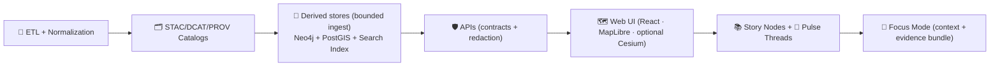
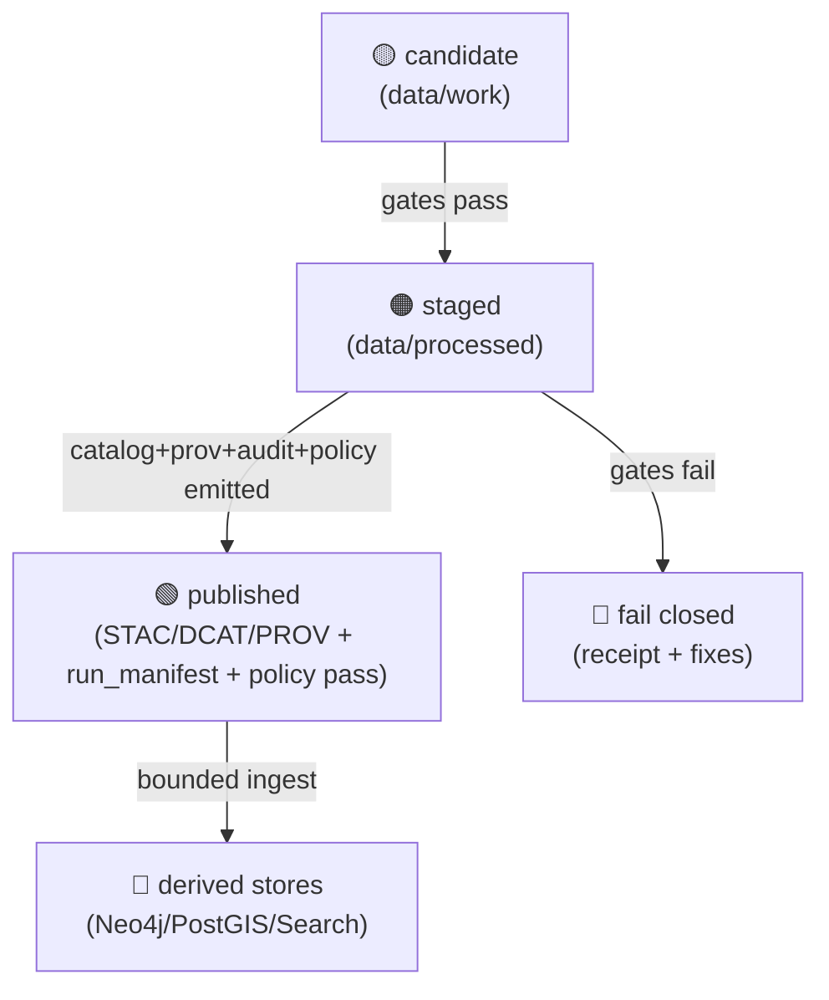
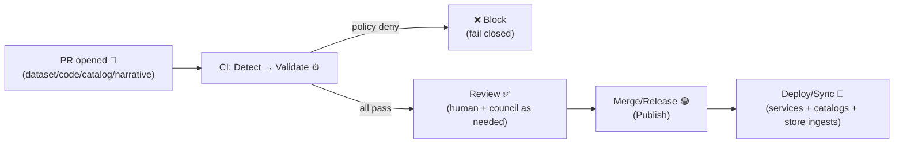
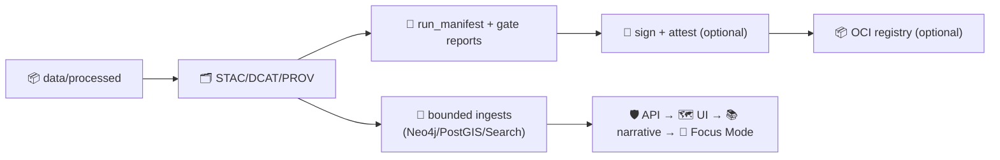

<!-- According to a document refresh from 2026-01-26: this README was updated using the full KFM project doc set (core PDFs + AI infra + UI architecture + Master Guide v13 + reference bundles). -->
<!--
📌 This README defines the *canonical pipeline boundary* for KFM (Kansas Frontier Matrix) / Kansas‑Matrix‑System.
🗓️ Last updated: 2026-01-26
🔁 Review cycle: 90 days (or anytime pipeline order / catalogs / policy / distribution / narrative rules change)
-->

<div align="center">

# 🧬 KFM Pipelines  
`pipelines/README.md`

**Deterministic ETL → source manifests → governed catalogs → derived stores (Neo4j + PostGIS + Search Index) → APIs → UI → Story Nodes + Pulse Threads → Focus Mode**  
The operational spine of **Kansas Frontier Matrix (KFM)**. 🧠🗺️🧾


-ff6b6b)
-0ea5e9)
-111827)


</div>

> **TL;DR:** `pipelines/` is the **portal + contract** for how KFM builds evidence.  
> The **executable pipeline code** lives in `src/pipelines/`.  
> The **publishable evidence** lives in `data/processed/**` and is not “real” until it’s **cataloged (STAC/DCAT)** and **traceable (PROV)** — *then* it can power derived stores (graph / PostGIS / search index) behind the governed API boundary. 🧾✅

> [!IMPORTANT]
> **Prime directive:** **No catalog → no derived stores (graph/index) → no API → no UI.**  
> Catalogs are the interface. Provenance is the receipt. 🧾✅

> [!IMPORTANT]
> **Second directive:** **No policy pass → no merge → no publish.**  
> Governance is enforced (automated + human review), not “best-effort.” ⚖️🔒

> [!IMPORTANT]
> **Narrative directive:** **No narrative without evidence.**  
> Story Nodes & Pulse Threads must ship with an **evidence manifest** that points to **cataloged evidence** (STAC/DCAT/PROV) and/or stable graph IDs (that resolve back to catalogs). 🗂️📚

---

## 🔗 Quick links (start here) 🧭
- 🏠 Repo overview: `../README.md`
- 🧩 Executable boundary: `../src/README.md` *(if present)*
- 🧪 Pipeline implementations: `../src/pipelines/README.md` *(if present)*
- 🕸️ Graph tooling (exports/ingest): `../src/graph/README.md` *(if present)*
- 🚪 API boundary (governed trust edge): `../src/server/README.md` *(if present)*
- 📜 API contracts (OpenAPI + GraphQL SDL): `../src/server/contracts/` *(if present)*
- ⚖️ Policy Pack (OPA/Rego): `../tools/validation/policy/` *(and/or `../src/server/policy/` if present)*
- 🤖 AI boundary (Focus Mode service): `../src/ai/README.md` *(if present)*
- 📦 Data + metadata boundary: `../data/README.md` *(required reading)*
- 🧾 Audits (run manifests + gate reports): `../data/audits/README.md` *(if present)*
- 📈 Telemetry (append-only NDJSON): `../data/telemetry/README.md` *(if present)*
- 🧪 Tests & QA gates: `../tests/README.md`
- 🧰 Governed toolchain surface: `../tools/README.md`
- 🧰 Automation wrappers: `../scripts/README.md`
- 📓 MCP (runs, experiments, receipts): `../mcp/README.md` *(or `../mcp/MCP-README.md` if that’s canonical)*
- 📘 Master Guide (canonical intent + paths): `../docs/MASTER_GUIDE_v13.md` *(if present)*
- 🧱 Architecture & ADRs: `../docs/architecture/`
- 🧾 Governance: `../docs/governance/`
- 📐 Schemas + profiles: `../schemas/` **and** `../docs/standards/`
- 🧩 Templates: `../docs/templates/`
- 📚 Story Nodes (narrative content): `../docs/reports/story_nodes/` *(draft/published workflow)*
- 📣 Pulse Threads (rapid narrative updates): `../docs/reports/pulse_threads/` *(if present)*
- 🧩 Design Packs (domain blueprints): `../docs/design_packs/` *(if present)*
- 🌐 Web UI boundary: `../web/` *(React · MapLibre · optional Cesium)*

---

<details>
<summary><b>🧭 Table of contents</b></summary>

- [🧾 Doc metadata](#-doc-metadata)
- [🚦 Non‑negotiables](#-non-negotiables)
- [🧠 What a “pipeline” means in KFM](#-what-a-pipeline-means-in-kfm)
- [🧭 Canonical paths & aliases](#-canonical-paths--aliases)
- [🧱 The canonical ordering](#-the-canonical-ordering)
- [🔎 Derived stores & indexing (Neo4j + PostGIS + search)](#-derived-stores--indexing-neo4j--postgis--search)
- [🧠 Pipelines as “compilers”](#-pipelines-as-compilers)
- [🧩 Pipeline taxonomy](#-pipeline-taxonomy)
- [🤖 Focus Mode & AI infrastructure (Ollama + policy gates)](#-focus-mode--ai-infrastructure-ollama--policy-gates)
- [📣 Narrative layer: Story Nodes + Pulse Threads](#-narrative-layer-story-nodes--pulse-threads)
- [📦 Data & metadata lifecycle](#-data--metadata-lifecycle)
- [🚀 Promotion workflow](#-promotion-workflow)
- [🧰 GitOps publish boundary](#-gitops-publish-boundary)
- [📦 Artifact distribution: Filesystem + OCI registries](#-artifact-distribution-filesystem--oci-registries)
- [⚖️ Policy-as-code](#️-policy-as-code-opa--conftest)
- [🧑‍🤝‍🧑 W‑P‑E automation](#-wpe-automation-watcher--planner--executor)
- [📁 Where things live](#-where-things-live)
- [🧾 Standard artifacts](#-standard-artifacts)
- [🧾 Manifests: run_manifest + evidence_manifest](#-manifests-run_manifest--evidence_manifest)
- [🩺 Derived store health checks](#-derived-store-health-checks)
- [📜 KFM Pipeline Definition Contract](#-kfm-pipeline-definition-contract)
- [⚙️ Running pipelines](#️-running-pipelines)
- [✅ Quality gates](#-quality-gates)
- [🧾 Receipts, telemetry, and replay](#-receipts-telemetry-and-replay)
- [🔐 Governance & sovereignty](#-governance--sovereignty)
- [🛡️ Security & hostile inputs](#️-security--hostile-inputs)
- [🔭 Performance & scaling](#-performance--scaling)
- [🌾 Example pipeline archetypes](#-example-pipeline-archetypes)
- [🧩 Adding a new pipeline](#-adding-a-new-pipeline)
- [🧩 Design Packs](#-design-packs)
- [📚 Project reference library influence map](#-project-reference-library-influence-map)
- [🧾 Metadata](#-metadata)
- [🕰️ Version history](#️-version-history)
- [📎 Evidence anchors](#-evidence-anchors)

</details>

---

## 🧾 Doc metadata

| Field | Value |
|---|---|
| Doc | `pipelines/README.md` |
| Status | Active ✅ |
| Last updated | **2026-01-26** |
| Review cycle | 90 days 🔁 |
| Audience | Contributors implementing ETL jobs, validators, catalog writers, store/index builders, graph exports/ingest bridges, narrative builders |
| Prime directive | **No catalog → no derived stores (graph/index) → no API → no UI.** Catalogs are the interface. |
| Second directive | **No policy pass → no merge → no publish.** |
| Narrative directive | **No narrative without evidence** (Story Nodes + Pulse Threads require evidence manifests). |
| System mission fit | Make Kansas spatial truth **searchable, mappable, auditable, modelable** (provenance-first; AI is advisory; no black boxes) 🧠🧾 |

---

## 🚦 Non‑negotiables

1) **Deterministic, idempotent ETL** 🧪  
   Same inputs + same config + same code ⇒ same outputs (stable IDs/hashes) and reruns do not corrupt or duplicate.

2) **Immutable raw is the first trust boundary** 🧊  
   `data/raw/**` is treated as **read-only evidence**. Any byte changes occur downstream in `data/work/**` or `data/processed/**` (and must be traceable).  
   *If you “fixed it by editing raw,” you broke auditability.* 🧾

3) **Contract-first** 📜  
   Pipelines are driven by declared contracts (schemas, profiles, OpenAPI/GraphQL). Contract changes trigger compatibility checks.

4) **Catalogs are not optional** 🗂️  
   Evidence is not “real” in KFM until it has:
   - **STAC** (assets + spatial/temporal metadata) — `data/stac/collections/` + `data/stac/items/`
   - **DCAT** (dataset discovery & distributions) — `data/catalog/dcat/`
   - **PROV** (lineage + run identity) — `data/prov/`

5) **Derived stores are rebuildable (never hand-edit)** 🧱  
   Neo4j, PostGIS loads, and the search index are **derived** layers. They must be rebuilt from **cataloged artifacts** (and bounded ingest/export files), not manually patched.

6) **Evidence-first narrative** 📚  
   Story Nodes / Pulse Threads / Focus Mode must cite **cataloged evidence** (or stable graph IDs that resolve to cataloged evidence).  
   If AI helps generate text: label it, attach provenance, and include confidence/uncertainty where applicable.

7) **API boundary rule** 🛡️  
   The UI must **never** query Neo4j/PostGIS/index directly; all access goes through governed APIs (contracts + redaction).

8) **Governed ordering is sacred** 🧱  
   **ETL → STAC/DCAT/PROV → Derived stores → API → UI → Story Nodes + Pulse Threads → Focus Mode**

9) **Stable identifiers (no semantic IDs)** 🧷  
   IDs must be **information-free** and invariant over time (don’t encode meaning that will drift). Prefer UUID/ULID + metadata.  
   *If it “needs renaming,” it wasn’t a stable ID.* 🧠

10) **Policy-as-code gating (fail closed)** ⚖️🔒  
   Governance rules are enforced automatically (OPA/Rego + Conftest is the default posture). If a policy can’t be evaluated, default is **deny**.

11) **Run manifests are required for publish** 🧾  
   Every publish produces a machine-readable **run manifest** (what ran, what changed, what passed/failed, what got signed, where it got distributed).

12) **GitOps & auditable publishing** 🧾🔁  
   “Published” means: validated artifacts + catalogs + provenance + policy report + review trail (PR/approvals).  
   *If it didn’t go through review, it’s not production evidence.*

> [!TIP]
> If your pipeline can’t produce a clean paper trail (inputs → transforms → outputs → catalogs → lineage → gates → signatures), it’s not ready to merge. ✅🧾

---

## 🧠 What a “pipeline” means in KFM

A KFM pipeline is a **replayable builder** that produces (at minimum):

- 📎 **Source manifests** → `data/sources/**` *(where the data came from, rights, sensitivity; pointer-over-payload)*
- 📦 **Evidence artifacts** → `data/processed/**` *(COG, GeoParquet, CSV, tiles, thumbnails, reports, model artifacts, etc.)*
- 🗂️ **Catalog artifacts** → `data/stac/**` + `data/catalog/dcat/**`
- 🧬 **Lineage artifacts** → `data/prov/**` *(W3C PROV JSON‑LD recommended)*
- 🧾 **Audit artifacts** → `data/audits/**` *(run manifests + deterministic gate reports)*
- 🧷 **Integrity artifacts** → manifests, checksums, inventories
- 🧪 **Gate artifacts** → schema reports, policy reports, link-check reports *(deterministic + storable)*
- 📈 **Telemetry artifacts** → append-only NDJSON summaries *(location configurable; linkable to run_id)*

Optionally (but commonly), a pipeline also emits **bounded ingest payloads** for derived stores:

- 🕸️ **Graph exchange artifacts** → `data/graph/csv/**` *(or `data/graph/cypher/**` optional)*
- 🗄️ **PostGIS load artifacts** → `data/db/postgis/**` *(recommended pattern; repo may vary)*
- 🔎 **Search index docs + mappings** → `data/index/search/**` *(recommended pattern; repo may vary)*

> [!IMPORTANT]
> Pipelines do **not** “secretly update the stores.”  
> Derived stores ingest **from catalogs** (and/or explicit bounded ingest artifacts) via controlled paths.

---

## 🧭 Canonical paths & aliases

KFM has a few “names you’ll see in old notes.” Here’s the **current canonical set**:

| Concept | Canonical path ✅ | Common aliases you may see ⚠️ |
|---|---|---|
| Source manifests | `data/sources/**` | *(varies)* |
| Raw drops | `data/raw/**` | *(same)* |
| Work / intermediate | `data/work/**` | *(same)* |
| Processed evidence | `data/processed/**` | *(same)* |
| STAC catalogs | `data/stac/collections/**` + `data/stac/items/**` | `data/stac/**` *(loose)*, `data/catalog/**` *(older drafts)* |
| DCAT catalogs | `data/catalog/dcat/**` | `data/catalogs/**`, `data/catalog/**` |
| Provenance | `data/prov/**` | `data/provenance/**` |
| Audit run manifests | `data/audits/**` | `data/runs/**`, `mcp/runs/**` *(context-dependent)* |
| Telemetry logs | `data/telemetry/**` | `logs/**`, `observability/**` |
| Graph exchange | `data/graph/csv/**` | `data/neo4j/**` *(older notes)* |
| Index exchange (recommended) | `data/index/**` | `data/search/**`, `data/indexes/**` |
| API implementation | `src/server/**` | `api/**` *(sometimes only docs/gateway)* |
| UI implementation | `web/**` | `frontend/**` |

> [!NOTE]
> When in doubt: follow **Master Guide v13** canonical paths. Older spellings should be treated as legacy aliases.

---

## 🧱 The canonical ordering

> [!IMPORTANT]
> This is a governance boundary, not a preference.



> [!NOTE]
> The Master Guide often shorthand’s “Derived stores” as “Neo4j graph,” but the **API may also query PostGIS and the search index**.  
> The invariant is: **catalogs are produced first** and **all stores are built from cataloged truth**, not raw guesses. 🧾

---

## 🔎 Derived stores & indexing (Neo4j + PostGIS + search)

KFM uses a **“storage trio”** pattern behind the API boundary:

### 🗄️ PostGIS (spatial-first)
- Efficient spatial queries, joins, aggregations, and raster/vector operations
- Good for “map features by bbox/time,” “buffer/intersect,” “group-by,” and analytics that are safer in SQL
- Pipelines should treat PostGIS loads as **rebuildable** and record:
  - table/schema targets
  - load method (COPY/ogr2ogr/etc.)
  - row counts + spatial bounds + indexes created
  - provenance pointer back to STAC/DCAT/PROV

### 🕸️ Neo4j (relationship-first)
- Represents **entities, events, documents, places, and their relationships**
- Should store **references/pointers** to catalogs (STAC/DCAT IDs, PROV activity IDs), not bulky payloads
- Ontology posture: stable labels/relationships; migrations required for breaking changes  
  *(CIDOC‑CRM mappings are encouraged for cultural heritage entities when relevant.)* 🏛️

### 🔎 Search index (discovery-first)
- Full-text search over:
  - DCAT dataset metadata (title, keywords, themes)
  - extracted text corpora (documents, OCR outputs, transcripts)
  - optional embedding/vector retrieval for Focus Mode
- Pipelines should build search docs **from cataloged artifacts** and emit:
  - index mappings (schema)
  - an index build manifest (counts, hashes, run_id)
  - a policy-sanitized “public vs restricted” split (never index forbidden fields)

> [!IMPORTANT]
> The stores are **implementation details** behind the API boundary.  
> The **catalog triplet (STAC/DCAT/PROV)** remains the contract surface and the audit anchor. 🧾✅

---

## 🧠 Pipelines as “compilers”

A helpful mental model: **pipelines behave like compilers** — inputs go through phases, and each phase has gates.  
This keeps the system honest: “build steps” are explicit, testable, and replayable. 🧱

| Compiler concept 🧩 | Pipeline analogue 🧬 | What we enforce ✅ |
|---|---|---|
| Lexing/parsing | ingest + schema parse | reject malformed inputs early |
| Type checking | semantic validation | CRS, geometry validity, ranges, licensing |
| IR transforms | normalization | canonical encodings + stable sort order |
| Linking | catalog linkage | STAC ↔ DCAT ↔ PROV cross-refs present |
| Linting | policy checks | OPA/Rego denies block publish |
| Codegen | artifacts + catalogs | COG/Parquet + STAC/DCAT + PROV receipts |
| Packaging | distribution | file paths **and/or** OCI artifact packaging + signing |
| Indexing | derived stores | Neo4j/PostGIS/search builds are reproducible + bounded |
| Optimization | scaling tactics | tiling, partitioning, caching, indexing |
| Error reporting | receipts & logs | actionable failures + correlation IDs |

> [!NOTE]
> A pipeline that “kind of works” but can’t explain itself is a governance bug, not a feature. 🧾

---

## 🧩 Pipeline taxonomy

Not all pipelines look the same. KFM supports a few **governed shapes**:

| Type | When to use | Key rule 🔑 |
|---|---|---|
| 🧱 **Build (batch)** | One-time or periodic creation of a dataset | Deterministic + cataloged + prov’d before use |
| 🔁 **Refresh (scheduled)** | Regular updates (daily/weekly/monthly) | Idempotent; versioned outputs; diffs inspectable |
| 👀 **Watcher (near‑real‑time)** | Polling/streaming feeds (e.g., GTFS‑RT) | Each window produces catalogable “units” + receipts |
| 🔌 **Adapter (import bridge)** | External exports (partner datasets, agency drops) | Validate schema/license/classification before promotion |
| 🧪 **Analysis/Model** | Derived indicators, Bayesian inference, simulation runs | Record params/seeds; output uncertainty + diagnostics |
| 🧮 **Optimization** | Multi-constraint optimization runs | Record objective/constraints; deterministic run IDs |
| 🕸️ **Graph build/export** | Build bounded graph exports from catalogs | Edges reference catalog IDs + provenance IDs |
| 🗄️ **PostGIS loader** | Populate PostGIS from cataloged evidence | Load is reproducible; never a “manual hotfix” |
| 🔎 **Search index builder** | Publish metadata + doc corpora into search | Public/restricted indexing is policy-gated |
| 📄 **Document ingest** | PDFs/scans → extracted text/entities | Store raw + derived; provenance + redaction rules required |
| 🧊 **3D/volumetric** | 3D meshes, point clouds, 3D tiles | Coordinate conventions + LOD/tiling + validation gates |
| 🧳 **Offline pack builder** | Field/classroom bundles | Packs embed manifests + catalog pointers + license bundle |
| 📣 **Pulse Thread generator** | Rapid narrative updates from evidence | Must ship evidence_manifest; review path required |
| 🧠 **Pattern detector** | Detects narrative-worthy shifts (EWMA/CUSUM/threshold) | Produces alert artifacts; never “publishes silently” |
| 🩺 **Derived-store health check** | Integrity + drift checks (graph/DB/index) | Emits reports; triggers W‑P‑E (PR) on anomalies |
| 🧩 **Design Pack builder** | Create repeatable domain blueprints | Packs are versioned specs; used to scaffold pipelines |

> [!NOTE]
> Watchers (and narrative generators) are still bound by ordering: **they produce cataloged outputs first**, then store/API/UI consumption follows.

---

## 🤖 Focus Mode & AI infrastructure (Ollama + policy gates)

KFM AI is **advisory-only** and **evidence-bound**. Focus Mode does not “invent” truth — it composes answers **from governed evidence**. 🧭🤖

### 🧩 Architecture snapshot (high level)
- UI captures: question + map context (location, layers, time)
- Backend AI service performs retrieval:
  - Neo4j (relationships)
  - Search index (documents/full-text; optionally embeddings)
  - Catalog lookups (STAC/DCAT/PROV metadata)
- LLM composes answer **with citations**
- Output is policy-validated (OPA) **before** returning to UI
- All Q&A emits receipts (audit + provenance pointers)

### 🛡️ “Prompt gateway” posture (deny-by-default)
- sanitize incoming prompts (treat user text as hostile input)
- strip or quarantine instructions that attempt to override policy (“ignore system rules…”, etc.)
- enforce:
  - tool allowlists (if any tool calling exists)
  - model allowlists + pinned versions/digests
  - output schema (structured response preferred)
  - cite-or-refuse rule (no citations → deny)

### 🧾 AI answer receipts (required for anything user-visible)
At minimum, a Focus Mode answer should be linkable to:
- `run_id` (or `answer_id`)
- model name + version/digest
- retrieval set (catalog IDs + graph IDs + doc IDs)
- OPA decision ID + policy bundle hash/version
- rendered answer + citations (machine-readable list)

> [!IMPORTANT]
> Focus Mode answers are treated like “evidence outputs” when persisted: they must be **traceable**, **policy-gated**, and **clearly labeled** as AI-assisted.

---

## 📣 Narrative layer: Story Nodes + Pulse Threads

KFM treats narrative as **governed content**, not “freeform text.” 📚🔒

### 📚 Story Nodes (curated narrative)
- Long-form, structured narrative tied to map state (layers + camera + timeline)
- Must include citations to cataloged evidence (and/or stable graph IDs that resolve to evidence)
- Has draft/published workflow; Focus Mode shows **published** only

**Recommended Story Node folder shape (v13-style):**
```text
docs/reports/story_nodes/
  ├─ draft/
  │   └─ <story_id>/
  │      ├─ story.md                # governed narrative markdown (template-based)
  │      ├─ story.json              # map/timeline script (camera, layers, steps)
  │      ├─ evidence_manifest.yml   # machine-checkable claim→evidence map
  │      └─ assets/                 # images, figures (with captions/alt text)
  └─ published/
      └─ <story_id>/...
```

### 📣 Pulse Threads (rapid narrative updates)
Pulse Threads are short, time-aware narrative updates linked to place/time + evidence.  
They are ideal for “what changed?” moments (new dataset drop, anomaly detection, model update, hazard refresh).

**Key rules:**
- Must include an **evidence manifest** (see below) pointing to catalog IDs
- Must be labeled **human-authored** vs **AI-suggested** (opt-in for AI content)
- Must respect sovereignty + sensitivity (no location side-channels)

### 🧠 Conceptual Attention Nodes (concept taxonomy)
Concept nodes (e.g., “drought”, “railroad expansion”, “biodiversity”) provide:
- consistent tagging across datasets, graph entities, Story Nodes, Pulse Threads
- transparent “why did the AI show this?” anchors (Focus Mode auditability)
- federation-friendly mapping across jurisdictions (shared concept IDs)

### ♿ Accessibility & UX (non-optional for published narrative)
- captions/alt text for assets
- readable map symbology + legends
- keyboard navigation + focus states in UI where applicable
- avoid color-only encoding for critical meaning

> [!TIP]
> Narrative is *also data* in KFM: it must be searchable, auditable, and cross-referenced. 🧾✅

---

## 📦 Data & metadata lifecycle

KFM uses a required staging lifecycle so everyone can tell “what stage is this file in?” at a glance:

### 📎 Source manifests (pointer-over-payload)
- `data/sources/<domain>/<dataset>/source.json` → where it came from, license, sensitivity, checksums/URLs *(best-effort)*  
  Think: **intent + rights + risk**.

### 📥 Data stages
- `data/raw/<domain>/...` → raw source drops *(read-only mindset)*
- `data/work/<domain>/...` → intermediate transforms *(ok to delete/regenerate)*
- `data/processed/<domain>/...` → final evidence artifacts *(publishable)*

### 🗂️ Catalog + provenance stages (required before downstream use)
- `data/stac/collections/` + `data/stac/items/` → STAC collections/items (assets + metadata)
- `data/catalog/dcat/` → DCAT datasets/distributions (discovery)
- `data/prov/` → PROV bundles (run + dataset lineage)

### 🧾 Audit + telemetry stages (required for publish)
- `data/audits/<run_id>/run_manifest.json` → canonical run record (what ran, inputs, outputs, digests)
- `data/audits/<run_id>/gates/**` → deterministic gate artifacts (schema/policy/link checks)
- `data/telemetry/**` → append-only NDJSON summaries keyed by run_id *(location/configurable)*

### 🧩 Derived store exchange stages (recommended; bounded)
- `data/graph/csv/` → bounded import/export CSVs (bulk ingest friendly)
- `data/graph/cypher/` *(optional)* → bounded Cypher scripts for controlled ingest
- `data/db/postgis/` *(recommended)* → load scripts/manifests (COPY/DDL + checks)
- `data/index/search/` *(recommended)* → mappings + doc exports + build manifests

### 🧳 Offline pack stages (optional, but governed)
- `data/packs/<pack_id>/` → a self-contained “evidence bundle” *(tiles + indexes + manifests + README + licenses)*

---

## 🚀 Promotion workflow

A pipeline output is either **not yet trustworthy**, or **published as governed evidence**.

### ✅ Promotion states (recommended)

| State | Location | Who can use it? | Required artifacts |
|---|---|---|---|
| 🟡 `candidate` | `data/work/**` | pipeline devs only | none (but logs helpful) |
| 🟠 `staged` | `data/processed/**` | reviewers + QA | checksums + basic gates |
| 🟢 `published` | `data/processed/**` + catalogs + audits | everyone downstream | **STAC + DCAT + PROV + run_manifest + policy pass** |

### 🔁 Promotion rules (fail closed 🔒)
- **No publish without license + classification.**
- **No publish without PROV lineage** (inputs + run config + output IDs).
- **No publish without STAC/DCAT** for anything user-visible.
- **No publish without run manifest + gate reports** (schema + policy).
- **No publish if classification would downgrade** (unless audited redaction step exists).
- **No publish if policy checks cannot run** (missing policies/inputs = deny).
- **No derived-store “production ingest” from non-published evidence** *(dev/stage exceptions must be explicit and labeled)*.



> [!TIP]
> Think “**atomic publish**”: write new outputs to a run-scoped directory → validate → promote/swap pointer → emit catalogs → emit audits → declare published. ✅

---

## 🧰 GitOps publish boundary

KFM treats the repo + CI as part of the pipeline boundary:

- PRs are the default “change envelope” for **datasets, catalogs, policies, narrative, and pipeline code**
- CI runs **data QA + schema validation + policy pack + narrative lint + doc protocol checks**
- Merge (or signed release) is what *turns a candidate into published evidence*



> [!NOTE]
> GitOps becomes provenance: run manifests and PROV bundles should record git SHA and (when available) PR/review references. 🧾🔁

---

## 📦 Artifact distribution: Filesystem + OCI registries

KFM’s default posture is **pointer-over-payload**: catalogs point to evidence assets wherever they live. 🔗🗂️

### ✅ Distribution modes
1) **Filesystem / object storage paths (default)**  
   - STAC assets reference `href` paths (local, S3, HTTPS, etc.)
   - DCAT distributions reference download/service endpoints

2) **OCI registry distribution (optional, advanced)** 📦🐳  
   For reproducible distribution and strong supply-chain posture, datasets can be packaged as OCI artifacts:
   - push evidence + catalogs + provenance as an OCI artifact
   - sign with cosign / attach attestations (SBOM, provenance, gate reports)
   - reference the OCI artifact from DCAT `distribution` (and/or STAC links)

3) **Citable release identifiers (optional, roadmap-friendly)** 🔖  
   For externally referenced “editions” of datasets:
   - include stable identifiers (e.g., DOI/URN) in DCAT `identifier`
   - ensure identifier resolves to the signed release manifest (and catalogs)



> [!IMPORTANT]
> OCI is a *distribution enhancement*, not a bypass.  
> **The ordering stays the same:** evidence → catalogs/prov → audits → (optional packaging/signing) → derived stores → downstream.

---

## ⚖️ Policy-as-code (OPA + Conftest)

KFM governance rules should be executable:

- **OPA/Rego** encodes rules (license required, classification propagation, cite-or-refuse for AI outputs, no direct-store UI access, etc.)
- **Conftest** runs those rules in CI and produces actionable failures (rule IDs + messages)
- Policy checks are just another ring in the quality gates (and must be replayable)

**Recommended homes (common patterns):**
- `tools/validation/policy/*.rego` *(policy source)*
- `src/server/policy/` *(runtime policy bundles / adapters, if used)*
- `src/server/contracts/` *(OpenAPI + GraphQL schemas as contracts)*

### 🧩 Example policy (pattern): “AI responses must include citations”
```rego
package kfm.ai

default allow = false

allow {
  input.response.citations
  count(input.response.citations) > 0
}
```

> [!TIP]
> Treat policy failures like compiler errors: fix the input until it compiles. 🧩⚖️

---

## 🧑‍🤝‍🧑 W‑P‑E automation (Watcher · Planner · Executor)

Some KFM maintenance can be automated — but only with guardrails:

- 👀 **Watcher** detects events (new upstream data drop, broken link, schema drift, policy warning, derived-store drift, graph/index health anomaly)
- 🧠 **Planner** drafts a plan **under policy constraints**
- 🛠️ **Executor** performs the work by opening a PR (and never bypasses CI/policy)

**Rule of thumb:** automation must still produce **the same artifacts humans do**  
(manifests → processed → catalogs → provenance → audits → policy pass → PR trail). 🧾✅

---

## 📁 Where things live

### 🧭 Repo context (target shape)
```text
📁 pipelines/                 # 📍 this folder (portal + conventions; not executable code)
📁 src/                       # 🧩 executable source code
│  ├── 📁 pipelines/          # 🧪 ETL jobs + catalog writers + validators
│  ├── 📁 graph/              # 🕸️ graph export/ingest tooling (from catalogs)
│  ├── 📁 server/             # 🛡️ APIs (FastAPI; REST + GraphQL; contracts + redaction)
│  │   └── 📁 contracts/      # 📜 OpenAPI + GraphQL SDL (contract-first)
│  └── 📁 ai/                 # 🤖 AI services (Focus Mode; advisory-only; citation gates)
📁 data/                      # 📦 sources → raw → work → processed + catalogs + audits + exchange payloads
│  ├── 📁 sources/            # 📎 source manifests (rights + sensitivity + pointers)
│  ├── 📁 raw/                # 📥 raw drops (immutable evidence)
│  ├── 📁 work/               # 🧪 intermediates
│  ├── 📁 processed/          # 📦 publishable evidence artifacts
│  ├── 📁 stac/               # 🗂️ STAC catalogs (collections/ + items/)
│  ├── 📁 catalog/dcat/       # 🗂️ DCAT catalogs
│  ├── 📁 prov/               # 🧬 provenance
│  ├── 📁 audits/             # 🧾 run_manifest + deterministic gate reports
│  ├── 📁 telemetry/          # 📈 append-only NDJSON summaries (optional)
│  ├── 📁 graph/csv/          # 🕸️ bounded CSV exports/imports
│  ├── 📁 index/search/       # 🔎 search docs/mappings/manifests (recommended)
│  └── 📁 packs/              # 🧳 offline packs (optional)
📁 schemas/                   # 📐 JSON Schemas (contracts)
📁 docs/                      # 📘 governed documentation (templates, standards, governance)
│  ├── 📁 reports/story_nodes/   # 📚 curated narrative (draft/published)
│  ├── 📁 reports/pulse_threads/ # 📣 rapid narrative updates (optional)
│  └── 📁 design_packs/          # 🧩 domain blueprints (optional)
📁 tools/                     # 🧰 validators, QA tools, deterministic entrypoints
📁 scripts/                   # 🧰 orchestration wrappers (call tools/src)
📁 tests/                     # ✅ automated tests (unit/integration/e2e)
📁 web/                       # 🌐 UI (React + MapLibre + optional Cesium)
📁 releases/                  # 📦 packaged releases (manifest + SBOM + attestations)
📁 .github/                   # 🤝 CI/CD, policies, automation
```

### 🧱 Clean architecture lens (conceptual)
Even if folders don’t literally match these names, the **layering concept** matters:

- **Domain**: schemas + core entities (contracts, invariants)
- **Application**: use-cases (pipelines, validators, ingestion orchestration)
- **Infrastructure**: storage drivers (PostGIS/Neo4j/search adapters), external APIs
- **Interfaces**: API controllers/resolvers, CLI entrypoints, UI

> [!NOTE]
> Keep “governed boundaries” clean: catalogs/prov/audits sit between raw computation and user-facing surfaces. 🧾✅

---

## 🧾 Standard artifacts

KFM evidence is **pointer-over-payload** whenever possible: catalogs + IDs + signed URLs/paths  
(instead of dumping giant blobs into API/UI). 🔗🗂️

### ✅ Minimum publishable artifact set (KFM standard)
For any dataset intended for search/map/story/focus:

1) **Source manifests** in `data/sources/**`
   - origin, license, sensitivity/classification, access pointers
   - (optional) checksums for remote sources

2) **Evidence artifacts** in `data/processed/**`
   - preferred geo formats: **COG**, **GeoParquet**, **PMTiles** *(as needed)*
   - optional: thumbnails/quicklooks (small, cacheable)
   - optional: 3D Tiles / glTF assets (for 3D domains)

3) **Catalog artifacts**
   - **STAC** items/collections that reference the evidence assets
   - **DCAT** dataset + distributions for discovery

4) **Lineage artifacts**
   - **PROV** bundle: inputs → activities → outputs
   - includes run identity, config hash, git SHA *(where available)*

5) **Audit + gate artifacts**
   - **run_manifest.json** (canonical run record)
   - checksums manifest (sha256 preferred)
   - schema validation reports (machine-readable)
   - policy report (OPA/Conftest output, machine-readable)
   - optional: inventory (file sizes + media types)
   - optional: energy/sustainability report for heavy runs 🌱

6) **Derived-store exchange artifacts (only when needed)**
   - Neo4j: bounded CSV export/import in `data/graph/csv/**`
   - PostGIS: bounded load scripts + manifests in `data/db/postgis/**` *(recommended)*
   - Search: docs + mappings + build manifest in `data/index/search/**` *(recommended)*

7) **Narrative artifacts (when producing Story Nodes / Pulse Threads)**
   - `story.md` / `pulse.md` plus `evidence_manifest.yml` *(see below)*
   - map-state config (Story Nodes): `story.json` *(recommended)*
   - stable IDs / concept tags / sensitivity flags

8) **AI receipts (when Focus Mode content is persisted or used operationally)**
   - answer ID + model version/digest
   - retrieval set (catalog IDs + graph IDs + doc IDs)
   - policy decision logs (OPA decision IDs + bundle hash)
   - classification/sensitivity posture for the output (labels)

9) **Safety artifacts (when shipping containers/releases)**
   - SBOM (software bill of materials)
   - signed images/artifacts + attestations *(SLSA-like posture)*

> [!NOTE]
> Quicklooks are UX helpers. The authoritative truth is the evidence artifact + catalog metadata. 🗂️✅

---

## 🧾 Manifests: run_manifest + evidence_manifest

Manifests are the “receipts you can compile.” 🧾🧩  
They’re designed to let CI, reviewers, and future-you answer:

- **What ran?**
- **With what inputs/config?**
- **What outputs were produced, cataloged, indexed, and signed?**
- **What gates passed/failed?**
- **What narrative content was generated and what evidence supports it?**

### 🧾 `run_manifest.json` (required for publish)
**Recommended home:** `data/audits/<RUN-ID>/run_manifest.json`

**Recommended contents (minimum):**
- `run_id`, `pipeline_id`, `env`, `git_sha`
- `config_hash`, `idempotency_key`
- `inputs[]` (source refs + checksums/ETags when feasible)
- `outputs[]` (paths + hashes + dataset IDs)
- `catalog_refs` (STAC/DCAT/PROV IDs/paths)
- `gate_reports[]` (schema/policy/link checks)
- `policy_bundle` *(recommended)*: bundle version/hash, decision IDs
- `store_ingests[]` *(recommended when used)*: graph/postgis/search build summaries
- `signatures[]` *(optional)* (cosign refs, attestations, SBOM)
- `distribution[]` *(optional)* (OCI refs, object store URLs, DOI/URN identifiers)

> [!TIP]
> Keep it deterministic: if the pipeline is replayed with identical inputs/config, the manifest should be materially identical (except for timestamps). ⏱️✅

### 📚 `evidence_manifest.yml` (required for Story Nodes & Pulse Threads)
**Recommended homes:**
- Story Nodes: `docs/reports/story_nodes/<draft|published>/<story_id>/evidence_manifest.yml`
- Pulse Threads: `docs/reports/pulse_threads/<draft|published>/<pulse_id>/evidence_manifest.yml`

**Recommended contents (minimum):**
- `content_id`, `type: story_node|pulse_thread`, `version`
- `claims[]` (each claim has at least one evidence reference)
- `evidence[]` (STAC/DCAT/PROV IDs, graph IDs, external sources that are themselves cataloged)
- `concept_tags[]` (Conceptual Attention Node IDs)
- `sensitivity` (flags and redaction/generalization notes)
- `ai_assistance` (true/false + model/run refs + confidence)

> [!IMPORTANT]
> Evidence manifests do **not** replace citations—they make them enforceable and machine-checkable. 🧾✅

---

## 🩺 Derived store health checks

The stores are derived layers. They must stay healthy. 🧩🩺

### ✅ Weekly (recommended) health check job
A scheduled “store health” pipeline should emit:
- Neo4j: constraints/index status, node/edge deltas, orphan detection (missing catalog/prov refs)
- PostGIS: schema drift, table row deltas, spatial index checks, bounds sanity
- Search index: mapping drift, doc count deltas, forbidden-field detection, stale doc cleanup
- lag detection (catalog published but store not updated)
- policy posture drift (new denies, missing rules, failing checks)

**Recommended outputs:**
- `data/audits/store-health/<YYYY-MM-DD>/report.json`
- `data/audits/store-health/<YYYY-MM-DD>/report.md` *(review-friendly summary)*

**Recommended behavior:**
- health check failures open a PR (W‑P‑E Executor) with:
  - the report artifacts
  - proposed fixes (ingest rerun, reindex, migrations, etc.)
  - explicit human review requirements when sensitive

---

## 📜 KFM Pipeline Definition Contract

KFM pipelines are contract-first. A pipeline should have a machine-readable contract file (recommended: `pipeline.yml`)
that explains **what it reads, what it writes, and what it guarantees**.

### ✅ Minimum contract fields (recommended)
- `id` (stable, versioned; do not encode secrets)
- `name`, `description`, `owner`
- `sources` (source manifest refs; rights + sensitivity posture)
- `inputs` (sources, paths, checksums/ETags when feasible)
- `outputs` (paths + formats + dataset IDs)
- `catalogs` (STAC/DCAT targets; collections/items/datasets)
- `provenance` (how run_id/config hash is captured)
- `audits` (run_manifest location; gate report locations)
- `gates` (schema/bounds/link/license/classification/policy checks)
- `determinism` (stable sorting, seed strategy, idempotency key)
- `classification` + `license` rules (deny-by-default on unknowns)
- `policy` (which bundles/rulesets must pass)
- `stores` *(recommended)*: how derived stores are built (Neo4j/PostGIS/search), bounded artifact paths
- `network` posture (deny-by-default; allowlist & logging if enabled)
- `distribution` *(optional)* (OCI registry packaging + signing requirements)
- `identifiers` *(optional)* (DOI/URN/content-addressed digests)
- `narrative` *(optional)* (Story Node/Pulse Thread outputs + evidence manifest rules)
- `ai` *(optional)* (model allowlist, prompt gateway rules, cite-or-refuse gates)
- `concept_tags` *(optional)* (Conceptual Attention Node IDs used)
- `resources` *(optional)* (memory/CPU hints; chunking strategy)
- `retention` *(optional)* (how long intermediate artifacts persist)
- `privacy` *(optional)* (PII checks; redaction/generalization rules)
- `offline_packs` *(optional)* (pack output + manifest rules)

### 🧩 Example `pipeline.yml` (starter template)
```yaml
id: "kfm.hydrology.watersheds.v1"
name: "Hydrology Watersheds Builder"
owner: "@kfm-engineering"
description: "Derives watershed boundaries + flow products from DEM inputs and publishes map-ready layers."

envs: ["dev", "stage", "prod"]

sources:
  - ref: "data/sources/elevation/3dep/source.json"
    notes: "Rights + sensitivity are enforced from source.json into catalogs and APIs."

inputs:
  - id: "kfm.elevation.dem.3dep.v1"
    stage: "raw"
    paths:
      - "data/raw/elevation/3dep/**"
    license: "public-domain-or-provider-license"
    classification: "public"

outputs:
  stage: "processed"
  datasets:
    - id: "kfm.hydrology.watersheds.v1"
      paths:
        - "data/processed/hydrology/watersheds/**"
      formats: ["COG", "GeoParquet", "PMTiles"]
      classification: "public"
      license: "CC-BY-4.0"

catalogs:
  stac_root: "data/stac"
  stac_collections: "data/stac/collections"
  stac_items: "data/stac/items"
  dcat_root: "data/catalog/dcat"
  collections:
    - "kfm.hydrology"
  items:
    strategy: "one item per logical unit (tile/county/basin)"
  dcat:
    dataset_id: "kfm.hydrology.watersheds.v1"

provenance:
  prov_root: "data/prov"
  run_id_env: "KFM_RUN_ID"
  config_hash: "sha256(pipeline.yml + config/<env>.yml)"
  record_git_sha: true
  record_seeds: true

audits:
  audits_root: "data/audits"
  run_manifest: "data/audits/${KFM_RUN_ID}/run_manifest.json"
  gate_reports_root: "data/audits/${KFM_RUN_ID}/gates"

gates:
  - "schema_required"
  - "crs_required"
  - "geometry_valid"
  - "bounds_sane"
  - "license_required"
  - "classification_no_downgrade"
  - "stac_schema"
  - "dcat_schema"
  - "prov_bundle_present"
  - "run_manifest_present"
  - "policy_pack_pass"
  - "link_check"

determinism:
  stable_sorting: true
  seeded: true
  seed_source: "KFM_SEED or derived from run_id"
  idempotency_key: "(dataset_id, input_checksums, config_hash)"

stores:
  neo4j:
    enabled: true
    export_csv_root: "data/graph/csv/${KFM_RUN_ID}"
    constraints_profile: "kfm-v13"
  postgis:
    enabled: false
    load_root: "data/db/postgis/${KFM_RUN_ID}"
  search:
    enabled: false
    index_docs_root: "data/index/search/${KFM_RUN_ID}"

policy:
  required_rulesets:
    - "tools/validation/policy"
  conftest_profile: "kfm-v13"

network:
  default: "deny"
  allow_with_flag: "--allow-network"
  ssrf_protection: true
  log_urls_and_checksums: true

distribution:
  mode: "filesystem"   # or "oci"
  oci:
    enabled: false
    ref: "oci://registry.example/kfm/${dataset_id}:${version}"
    sign_with_cosign: true
    attach_sbom: true
    attach_prov: true

ai:
  enabled: false
  llm_runtime: "ollama"
  model_allowlist:
    - "llama3.1"
  cite_or_refuse: true

offline_packs:
  enabled: false
  packs_root: "data/packs"

retention:
  work_dir_ttl_days: 14
  keep_failed_runs: true
```

> [!IMPORTANT]
> The contract does not replace docs; it makes the docs **enforceable**.  
> CI can validate `pipeline.yml` shape and cross-check it against produced artifacts.

---

## ⚙️ Running pipelines

> [!NOTE]
> Prefer the repo’s **make/CI entrypoints** when available.  
> If your repo doesn’t have these targets yet, treat this section as intended ergonomics.

### ✅ Recommended: `make` entrypoints (examples)
```bash
# list pipelines (example)
make pipelines-list

# run a pipeline (example)
make pipeline RUN=hydrology/watersheds ENV=dev

# validate catalogs + policy (example)
make catalog-qa
make policy-qa

# derived store ingests (examples)
make graph-export
make graph-ingest
make postgis-load
make search-index-build

# health checks (example)
make store-health
```

### 🐍 Direct execution (module style)
```bash
python -m src.pipelines.hydrology.watersheds.run --env dev --config config/dev.yml --run-id "RUN-2026-01-26-demo"
python -m src.pipelines.hazards.refresh.run --env dev --since "2026-01-01T00:00:00Z" --run-id "RUN-2026-01-26-hazards"
```

### 🧱 Expected flags (strongly recommended)
- `--help` (must include ≥2 runnable examples)
- `--env {dev|stage|prod}`
- `--config <path>`
- `--run-id <id>` (or `KFM_RUN_ID`)
- `--dry-run` default OR “no writes unless `--apply`”
- `--apply` for state mutation
- `--allow-network` for any remote fetching (deny-by-default)
- `--telemetry-root <path>` *(optional but recommended)*
- `--log-level {DEBUG|INFO|WARNING|ERROR}` *(optional)*

### 🧱 Typical environment variables
| Variable | Purpose |
|---|---|
| `KFM_ENV` | `dev|stage|prod` |
| `KFM_RUN_ID` | provenance correlation across logs/catalogs/PROV/audits |
| `KFM_DATA_ROOT` | data root (if not repo-relative) |
| `KFM_SOURCES_ROOT` | source manifests root |
| `KFM_STAC_ROOT` | STAC output root |
| `KFM_DCAT_ROOT` | DCAT output root |
| `KFM_PROV_ROOT` | PROV output root |
| `KFM_AUDITS_ROOT` | audits output root (run manifests + gate reports) |
| `KFM_TELEMETRY_ROOT` | telemetry output root |
| `KFM_POLICY_ROOT` | policy pack root (OPA/Rego) |
| `KFM_SEED` | RNG seed for stochastic pipelines |
| `KFM_NEO4J_URI` | graph endpoint *(only for controlled ingest steps)* |
| `KFM_POSTGIS_DSN` | PostGIS connection *(only for controlled ingest steps)* |
| `KFM_SEARCH_URI` | search/index endpoint *(only for controlled ingest steps)* |
| `KFM_OLLAMA_URL` | Ollama runtime URL *(Focus Mode / AI service)* |
| `KFM_LLM_MODEL` | model name allowlisted by policy |
| `KFM_POLICY_BUNDLE_SHA` | record which policy bundle was applied |

> [!TIP]
> For heavy geo deps (GDAL/PROJ), **Docker is your friend** 🐳  
> Containerize pipeline environments to reduce “works on my machine” drift.

---

## ✅ Quality gates

A pipeline is “done” only when these pass (prefer “fail closed” 🔒):

### Ring 0 — Structure 🧱
- JSON/YAML parses
- schema validation for outputs + catalogs + manifests
- required files exist (`pipeline.yml`, configs, outputs present)
- docs protocol checks (where applicable): YAML front-matter, required sections, link validity

### Ring 1 — Integrity 🧷
- checksums/manifests recorded
- deterministic IDs stable when inputs unchanged
- atomic publish (no half-written processed outputs)
- run_manifest emitted for staged/published

### Ring 2 — Semantics 🧠
- CRS correctness + axis order
- geometry validity (and any repair policy is explicit + logged)
- raster sanity (nodata, resolution, overviews for COG)
- bounds/time sanity (Kansas extent, plausible ranges, monotonic windows where required)

### Ring 3 — Governance & safety 🔐🛡️
- license required before publish
- classification/sensitivity propagation (no downgrade)
- redaction/generalization audited (when required)
- hostile input guards (archives, rasters, PDFs, GeoJSON, etc.)
- secrets/sensitive patterns not leaked to logs

### Ring 4 — Policy pack (OPA/Rego) ⚖️
- policy checks run and produce a deterministic report artifact
- deny rules block merge/publish (missing policies = deny)
- AI outputs: cite-or-refuse gates (uncited assertions are denied)

### Ring 5 — Derived store integrity (when building stores) 🧩
- Neo4j: referential integrity across CSVs, constraints/profile checks, no orphan edges
- PostGIS: schema drift checks, index creation verified, bounds sanity
- Search: mapping/schema pinned, forbidden-field scanning, doc count sanity

### Ring 6 — Narrative integrity (Story Nodes + Pulse Threads) 📚🧾
- evidence_manifest present and machine-checkable
- all cited evidence resolves to STAC/DCAT/PROV or stable graph IDs
- fact vs interpretation clearly signaled (AI-labeled, confidence provided when applicable)
- no sensitive location leaks (sovereignty rules enforced)
- accessibility basics satisfied for published narrative assets ♿

### Ring 7 — Modeling credibility (when doing inference/simulation) 🧪📊
If a pipeline produces analytical/model outputs, it must emit diagnostics artifacts:
- EDA/QC summaries (missingness, distribution checks)
- regression diagnostics (residual checks, assumptions, baselines)
- Bayesian outputs (priors, posterior summaries, credible intervals)
- simulation V&V posture (verification/validation notes, sensitivity metadata)
- uncertainty is first-class (intervals, confidence/credible bounds, caveats)
- model cards (recommended) for AI/ML artifacts 📇

> [!TIP]
> Make it easy for reviewers: `make catalog-qa` and `make store-health` should be boring. 😌✅

---

## 🧾 Receipts, telemetry, and replay

KFM is evidence-first: pipelines should emit “receipts” that let someone reproduce the run.

### ✅ Minimum receipt set (recommended for any publish)
- 🧬 `data/prov/<RUN-ID>.jsonld` (or a bundle directory)
- 🧾 `data/audits/<RUN-ID>/run_manifest.json`
- 🧷 checksums manifest for produced outputs
- 🗂️ STAC + DCAT references for all published artifacts
- ⚖️ policy report artifact (Conftest output; machine-readable)
- 🪵 structured logs (human + optional JSONL)
- 🔗 PR/review reference *(recommended)*: publish trail is part of provenance

### 📈 Telemetry (append-only, linkable)
- Keep telemetry append-only and keyed by `run_id`
- Prefer NDJSON summaries that can be indexed by tooling
- Do not log secrets or restricted raw content
- Recommended signals (governance-friendly):
  - policy deny events
  - redaction/generalization events
  - sensitive access flags
  - derived-store ingest counts + drift deltas

### ⭐ Recommended: MCP run receipt (when used for decisions or publish)
- `mcp/runs/<RUN-ID>/MANIFEST.md` (human narrative of “what happened”)
- links to the relevant catalogs + outputs + gates
- any redactions/generalizations applied + rationale

> [!NOTE]
> Telemetry should help answer: **what ran, what changed, what gates passed, what was withheld/redacted, and why**.  
> In KFM, governance/AI can also produce an **append-only ledger** of significant outputs (especially AI answers).

---

## 🔐 Governance & sovereignty

KFM is FAIR + CARE + sovereignty-aware by design 🪶

### 🪪 Classification propagation (deny-by-default)
- Outputs cannot be **less restricted** than inputs unless an explicit redaction/generalization step exists and is reviewed.
- If classification cannot be determined, default to **restricted**.

### 🧷 Stable IDs (information-free)
- Don’t embed meaning (names, years, sequence, geography) into identifiers.
- Treat IDs as stable pointers; store meaning in metadata where it can evolve safely.

### 🪶 Sovereignty & cultural protocols (first-class)
Some datasets require extra governance and/or special handling:
- culturally sensitive locations (coordinate fuzzing / aggregation)
- restricted heritage knowledge (access controls + disclosure UX)
- council/community approvals recorded as part of provenance

### ✂️ Redaction/generalization is multi-layer
If redaction is required, it must be applied consistently:
- `data/processed/**` (redacted evidence artifact)
- STAC/DCAT metadata (flags + documentation)
- API layer (access control + redaction enforcement)
- UI layer (additional disclosure/UX checks)

### 🧮 Statistical disclosure control (when needed)
When “aggregation can still reveal” (small counts, unique patterns, linkage risk), consider:
- k-anonymity / l-diversity / t-closeness style protections
- differential privacy for published aggregates (where appropriate)
- query auditing / inference control for sensitive analytics endpoints
- “deny-by-default” on derived indexes that might leak protected fields

### 🧾 Audit trails
- Pipelines should emit telemetry and provenance notes when redaction/generalization occurs.
- Governance reviews are required for classification/sensitivity changes.

### 🌐 Federation-ready posture (planned)
KFM is designed to scale into a multi-region “Frontier Matrix” federation:
- prefer global/URN-like dataset identifiers
- allow cross-instance catalog references (don’t duplicate what can be cited)
- permit policy pack tuning per jurisdiction (while sharing a baseline)

---

## 🛡️ Security & hostile inputs

Pipelines ingest “files from the world.” Assume inputs are hostile by default. 🧯

### ✅ Required defensive posture
- validate file types & magic bytes (don’t trust extensions)
- prevent path traversal (archives/extractors)
- defend against decompression bombs (archives/images)
- sanitize subprocess args when calling GDAL/other tooling
- parameterize SQL (never string-concat untrusted values)
- **never log secrets**; never print sensitive raw content
- treat prompt inputs (for AI) as hostile too (prompt-injection posture)
- enforce allowlists for any outbound network fetch

### 🐚 Shell scripting standards (when using Bash wrappers)
- default to strict mode: `set -euo pipefail`
- quote variables *always*
- never `eval` user-controlled inputs
- prefer explicit allowlists for arguments and file patterns

### 🌐 Network posture
- default: **no network**
- if a pipeline fetches remote inputs:
  - require `--allow-network`
  - block private IP ranges by default (SSRF defense)
  - log URLs + checksums/ETags of downloaded artifacts

> [!CAUTION]
> If someone malicious controls this input, what’s the maximum harm?  
> If the answer includes “run code / exfiltrate / crash,” add guards **before** merging. 🚫🧨✅

---

## 🔭 Performance & scaling

KFM scales by staying **metadata-driven** and **chunk-friendly**:

- 📦 partition work (tiles, counties, watersheds, time windows)
- 🧱 pipeline breakers at materialization boundaries (COG/Parquet outputs)
- 🔁 replay safety (idempotency keys + deterministic ordering)
- ♻️ avoid reprocessing unchanged inputs (checksums + manifests + ETags)
- 🗄️ push heavy spatial ops into PostGIS when safe (joins, intersects, buffers)
- ⚡ scale batch jobs with Spark/cluster tooling when domains demand it *(only with strong provenance + determinism posture)*
- ⚖️ acknowledge workload mix (real-time vs batch; read-heavy vs write-heavy) and isolate where needed
- 🛰️ compute-to-data for imagery-heavy domains
- 🧳 offline packs (PMTiles + compact indexes) for field/classroom modes

> [!TIP]
> Prefer “boring performance wins”: stable chunking + caching + deterministic manifests.  
> Speed is good — **but correctness and provenance come first**. 🧾✅

---

## 🌾 Example pipeline archetypes

Match an archetype before inventing a new one 🧩

### 1) 🌊 Time-series & sensor ingestion (batch/refresh)
**Use when:** climate records, stream gauges, socio-economic time series  
**Outputs:** Parquet + temporal coverage metadata + catalog entries  
**Key gates:** schema, time window sanity, missingness checks, license, provenance.

### 2) 🛰️ Remote sensing compute-to-data ingest (batch/refresh)
**Use when:** imagery too large for local processing  
**Pattern:** compute externally → ingest derived product → publish COG + STAC + DCAT + PROV  
**Key gates:** range sanity, export params captured, uncertainty metadata.

### 3) 💧 Hydrology terrain processing (batch)
**Use when:** DEM-derived flow direction/accumulation, watersheds, streams  
**Outputs:** COG rasters + vectors + STAC Items per logical unit  
**Key gates:** CRS, nodata, alignment, geometry validity, Kansas bounds.

### 4) 🌪️ Hazards refresh (scheduled refresh)
**Use when:** multi-source hazard chronicles (tornado, flood, drought, fire)  
**Pattern:** scheduled ETL → normalized event records → cataloged evidence + summaries  
**Downstream:** events become graph nodes linked to provenance + sources.

### 5) 🚍 GTFS‑RT watcher (near‑real‑time)
**Use when:** live transit telemetry (vehicle positions, trip updates)  
**Pattern:** watcher polls/streams → time-window artifacts → STAC Items per window/day → DCAT distributions → PROV per run/window  
**Key gates:** strict timestamp handling, dedupe, retention policy, governance classification.

### 6) 📄 Bulk document ingest (evidence-first)
**Use when:** PDFs/scans (reports, notices, historical docs) must become searchable evidence  
**Pattern:** store raw doc → extract text (and optional entities) → catalog as evidence with provenance + redaction rules  
**Key gates:** hostile PDF handling, PII policy checks, attribution/license capture.

### 7) 🧮 Simulation + optimization runs (job-style)
**Use when:** scenario runs matter for decision support  
**Pattern:** parameterized run → outputs + uncertainty + diagnostics → STAC/DCAT + PROV run bundle  
**Key gates:** V&V posture, sensitivity metadata, deterministic seeds, reproducible configs.

### 8) 🧊 3D GIS / volumetric artifacts (optional advanced)
**Use when:** 3D trenches, volumes, meshes, point clouds, LOD needs  
**Pattern:** ingest → validate CRS/scale → generate LOD/tiles → catalog assets + provenance  
**Key gates:** coordinate sanity, metadata completeness, LOD budgets.

### 9) 🧳 Offline pack builder (field/classroom)
**Use when:** no-network mode, demos, outreach, field research  
**Pattern:** compile PMTiles + small GeoParquet slices + indexes + README + license bundle  
**Key gates:** pack manifest present, license bundle present, size budgets, reproducible build.

### 10) 🔎 Search index build (discovery + Focus Mode retrieval)
**Use when:** datasets/docs must be discoverable by keyword and/or embeddings  
**Pattern:** build index docs from DCAT/STAC/PROV + approved corpora → policy-sanitized index publish → audit manifest  
**Key gates:** forbidden-field scan, mapping pinned, doc count sanity, replayable build.

### 11) 🗄️ PostGIS load + derived views (optional but common)
**Use when:** map/API queries need spatial joins/aggregations fast  
**Pattern:** load cataloged evidence → create materialized views → index → emit load manifest  
**Key gates:** schema drift checks, bounds sanity, reproducible SQL/DDL, provenance refs.

### 12) 📣 Pulse Thread generator + 🧠 pattern detector
**Use when:** “what changed?” updates should be generated from evidence and alerts  
**Pattern:** detector emits alert artifacts → curator/agent drafts Pulse Thread → evidence_manifest → review → publish  
**Key gates:** evidence_manifest completeness, cite coverage, sensitivity/sovereignty checks, opt-in AI labeling.

### 13) 🩺 Store health check pipeline (maintenance)
**Use when:** long-lived integrity requires scheduled checks  
**Outputs:** health report artifacts + remediation PRs  
**Key gates:** fail-closed remediation workflow, auditability, no silent fixes.

> [!TIP]
> “Value-added” derived layers (summaries, clustering, indices) are still **evidence artifacts**: store in `data/processed/**` + STAC/DCAT + PROV + audits. ✅🗂️🧬

---

## 🧩 Adding a new pipeline

### ✅ Checklist (minimum bar)
- [ ] Choose a domain: `src/pipelines/<domain>/`
- [ ] Define inputs/outputs **before** coding (contract-first)
- [ ] Add/confirm `data/sources/**/source.json` (rights + sensitivity + pointers)
- [ ] Implement deterministic ETL (config-driven; stable IDs)
- [ ] Write to `data/raw → data/work → data/processed` *(stage appropriately; raw is immutable)*
- [ ] Emit STAC + DCAT + PROV (before downstream use)
- [ ] Emit audits: `run_manifest.json` + deterministic gate reports
- [ ] Produce a policy report (OPA/Conftest) and ensure it passes
- [ ] Add validators (schema, bounds, links, license, classification propagation)
- [ ] Add tests (unit + at least one mini end-to-end run)
- [ ] Add docs: `docs/data/<domain>/pipelines/<pipeline_name>/README.md`
- [ ] If needed, add bounded ingest artifacts for Neo4j/PostGIS/search (never manual edits)
- [ ] Ensure UI access stays API-only; catalogs remain the interface

### 🧾 Pipeline runbook contract (what every pipeline doc must include)
Under `docs/data/<domain>/pipelines/<pipeline_name>/README.md`:

- 🎯 Purpose + scope + SLA cadence
- 🧺 Inputs (sources, access requirements, licenses)
- 📎 Source manifest notes (rights + sensitivity + access pointers)
- ✅ Validation gates (what fails fast; what warns)
- ⚖️ Policy gates (which denies could block publish)
- 🧷 Integrity model (hashing, manifests, idempotency)
- 🗂️ STAC/DCAT mapping (collections/items/datasets)
- 🧬 PROV mapping (entities/activities/agents)
- 🧾 Audit mapping (run_manifest + gate reports)
- 🧩 Derived store mapping (graph/postgis/search) if applicable
- 💥 Failure modes + replay rules + kill switch
- 🪶 Governance notes (classification, redaction/generalization, restrictions)
- 📣 Narrative outputs (if any): evidence_manifest rules + review path
- 🧠 Concept tags (if any): conceptual attention nodes used

---

## 🧩 Design Packs

Design Packs are **domain blueprints** that compress “how to build this kind of pipeline” into a repeatable spec. 🧩📦  
They’re especially useful for fast expansion (new domains, new indicators, new narrative templates) without rewriting governance from scratch.

### ✅ Typical Design Pack contents (recommended)
- `design_pack.yml` (domain goals, dataset IDs, ontologies, gates, UI expectations)
- `schemas/` (domain schemas)
- `examples/` (example evidence_manifest + run_manifest patterns)
- `mockups/` (optional UI expectations: layer names, symbology hints, story node templates)
- `budgets/` (size + latency targets, offline pack budgets)

> [!TIP]
> Design Packs should be versioned and reviewed like code. If a design pack changes, pipelines generated from it must re-run compatibility checks. ✅🧾

---

## 📚 Project reference library influence map

These project files shape pipeline design + review standards: determinism, validation, scaling, governance, security posture, map readiness, and human-centered constraints. 🧠🧾

<details>
<summary><strong>📦 Expand: Project files → what they influence in pipelines</strong></summary>

### 🧭 Core KFM design docs (direct pipeline influence)
| Project file | Primary lens | Pipeline-level impact |
|---|---|---|
| `Kansas Frontier Matrix (KFM) – Comprehensive Platform Overview and Roadmap.pdf` | 🧭 Roadmap + distribution | OCI/ORAS packaging, signing/attestations posture, federation + identifiers, long-horizon expansion constraints. |
| `Kansas Frontier Matrix (KFM) – Comprehensive Architecture, Features, and Design.pdf` | 🧱 Architecture | Storage trio (PostGIS + Neo4j + search index), clean architecture lens, API stack (FastAPI; REST + GraphQL), governance boundaries. |
| `Kansas Frontier Matrix (KFM) – Comprehensive Technical Documentation.pdf` | 🧭 System blueprint | Standards posture, data stores, performance/offline constraints, evidence-first rules. |
| `📚 Kansas Frontier Matrix (KFM) – Expanded Technical & Design Guide.pdf` | 📥 Intake + deep tech | Raw immutability boundary, deterministic ETL, catalog triplet linkage, bounded CSV graph ingest posture, ontology mapping patterns. |
| `Kansas Frontier Matrix (KFM) – Comprehensive UI System Overview (Technical Architecture Guide).pdf` | 🗺️ UI constraints | Provenance UX (“layer provenance”), Story Node + Focus Mode integration, map/timeline workflows, accessibility posture. |
| `Kansas Frontier Matrix (KFM) – AI System Overview 🧭🤖.pdf` | 🤖 AI governance | Cite-or-refuse, explainable AI panel posture, governance ledger, drift monitoring, prompt security. |
| `KFM AI Infrastructure – Ollama Integration Overview.pdf` | 🤖 Runtime AI infra | Local LLM runtime integration, prompt gateway, policy gates for citations, auditing AI answers, resource constraints. |
| `MARKDOWN_GUIDE_v13.md.gdoc` | ✍️ Canonical ordering + doc protocol | v13 invariants, canonical paths, STAC/DCAT/PROV alignment, Story Node governance, CI gates (schemas/links/security scans). |

### 📚 Reference library bundles (PDF portfolios)
These are **shelf bundles** containing many embedded PDFs used as implementation references.

| Bundle file | Primary lens | Pipeline-level impact |
|---|---|---|
| `AI Concepts & more.pdf` | 🤖 ML/AI foundations | Credibility gates (diagnostics, uncertainty), evaluation discipline, advisory-only posture for AI. |
| `Data Managment-Theories-Architures-Data Science-Baysian Methods-Some Programming Ideas.pdf` | 🗄️ Data architecture + Bayesian methods | Provenance-first data management patterns, reproducibility discipline, uncertainty reporting standards. |
| `Maps-GoogleMaps-VirtualWorlds-Archaeological-Computer Graphics-Geospatial-webgl.pdf` | 🧊 GIS/3D/WebGL | Projection hygiene, LOD/tiling discipline, WebGL storytelling + 3D readiness (Cesium optional). |
| `Various programming langurages & resources 1.pdf` | 🧰 Implementation shelf | Polyglot tooling references, deterministic builds, secure scripting, CI discipline. |
| `Mapping-Modeling-Python-Git-HTTP-CSS-Docker-GraphQL-Data Compression-Linux-Security.pdf` | 🧰 DevOps + security | Dockerized pipelines, GraphQL contracts, compression + storage efficiency, Linux/security posture. |
| `Geographic Information-Security-Git-R coding-SciPy-MATLAB-ArcGIS-Apache Spark-Type Script-Web Applications.pdf` | 🗺️ GIS + compute ecosystem | ArcGIS/Spark/TypeScript and applied GIS patterns; informs scale-out options and interoperability considerations. |

</details>

---

## 🧾 Metadata

```yaml
title: "KFM Pipelines — canonical pipeline boundary"
path: "pipelines/README.md"
version: "v1.8.0"
last_updated: "2026-01-26"
review_cycle: "90 days"
prime_directive: "No catalog → no derived stores (graph/index) → no API → no UI"
second_directive: "No policy pass → no merge → no publish"
narrative_directive: "No narrative without evidence manifests"
pipeline_order: "ETL → STAC/DCAT/PROV → Derived stores (Neo4j/PostGIS/Search) → APIs → UI → Story Nodes + Pulse Threads → Focus Mode"
principles:
  - "contract-first"
  - "evidence-first"
  - "raw-is-immutable trust-boundary"
  - "determinism-by-default"
  - "stable-identifiers (information-free)"
  - "deny-by-default security"
  - "policy-as-code (OPA/Rego) fail-closed"
  - "GitOps publish trail (PR/review as provenance)"
  - "run_manifest + gate reports required for publish"
  - "narrative evidence_manifest required (Story Nodes + Pulse Threads)"
  - "FAIR+CARE + sovereignty-aware"
  - "privacy + disclosure control when needed"
  - "modeling credibility (V&V + uncertainty artifacts)"
  - "artifact distribution is pointer-first (OCI optional; signing/attestations optional)"
  - "derived stores are rebuildable from catalogs"
  - "federation-ready (cross-instance references)"
```

---

## 🕰️ Version history

| Version | Date | Summary | Author |
|---:|---|---|---|
| v1.8.0 | 2026-01-26 | Aligned canonical STAC subpaths (`collections/` + `items/`) and `src/server/` API home (v13); formalized “derived stores” stage (Neo4j + PostGIS + search index) behind API boundary; added Focus Mode AI infra gates (Ollama + prompt gateway + cite-or-refuse policy); expanded artifacts and gates for index/store builds; strengthened doc protocol + CI gate notes (links/schemas/security scans); added disclosure-control methods to governance section; refreshed influence map to include all current project files. | KFM Engineering |
| v1.7.0 | 2026-01-20 | Added narrative layer formalization (Pulse Threads + evidence_manifest); added run_manifest + audits directory; added OCI distribution concept (optional) and signing/attestation posture; added graph health check pipeline guidance; added Design Packs concept; strengthened raw-immutability as first trust boundary; updated influence map with Additional Project Ideas + Markdown Guide v13. | KFM Engineering |
| v1.6.0 | 2026-01-19 | Added manifest-first intake (`data/sources/**`); clarified canonical path aliases (catalog/prov); added GitOps publish boundary; formalized policy-as-code ring (OPA/Rego + Conftest); added W‑P‑E automation section; expanded standard artifacts (policy report, graph exchange, offline packs); refreshed influence map to the current project docs + portfolio bundles. | KFM Engineering |
| v1.5.0 | 2026-01-13 | Tightened “pipelines as compilers” phase model; formalized promotion workflow (candidate→staged→published); added standard artifact set incl. integrity + supply-chain notes; expanded credibility gates for inference/simulation; updated influence map. | KFM Engineering |
| v1.4.0 | 2026-01-11 | Aligned pipeline README with Master Guide v13 invariants (API boundary, evidence-first narrative); added pipeline taxonomy + PDC contract template; expanded receipts/telemetry; clarified docs paths. | KFM Engineering |
| v1.3.0 | 2026-01-09 | Strengthened pipeline contract essentials (declared IO, PROV, schema/bounds, atomic publish); expanded governance, security, scaling, and archetype guidance. | KFM Engineering |

---

## 📎 Evidence anchors

> These are the project files directly used while updating this README.

### 🧭 Core KFM docs
- `MARKDOWN_GUIDE_v13.md.gdoc`
- `Kansas Frontier Matrix (KFM) – Comprehensive Platform Overview and Roadmap.pdf`
- `Kansas Frontier Matrix (KFM) – Comprehensive Architecture, Features, and Design.pdf`
- `Kansas Frontier Matrix (KFM) – Comprehensive Technical Documentation.pdf`
- `📚 Kansas Frontier Matrix (KFM) – Expanded Technical & Design Guide.pdf`
- `Kansas Frontier Matrix (KFM) – Comprehensive UI System Overview (Technical Architecture Guide).pdf`
- `Kansas Frontier Matrix (KFM) – AI System Overview 🧭🤖.pdf`
- `KFM AI Infrastructure – Ollama Integration Overview.pdf`

### 📚 Reference bundles (PDF portfolios)
- `AI Concepts & more.pdf`
- `Data Managment-Theories-Architures-Data Science-Baysian Methods-Some Programming Ideas.pdf`
- `Maps-GoogleMaps-VirtualWorlds-Archaeological-Computer Graphics-Geospatial-webgl.pdf`
- `Various programming langurages & resources 1.pdf`
- `Mapping-Modeling-Python-Git-HTTP-CSS-Docker-GraphQL-Data Compression-Linux-Security.pdf`
- `Geographic Information-Security-Git-R coding-SciPy-MATLAB-ArcGIS-Apache Spark-Type Script-Web Applications.pdf`

---

<div align="center">

**© 2026 Kansas Frontier Matrix** · CC‑BY 4.0 (project docs)  
🧬 FAIR+CARE · 🪶 Sovereignty-aware · 🛡️ Policy-gated builds · 🧾 Evidence-first

</div>