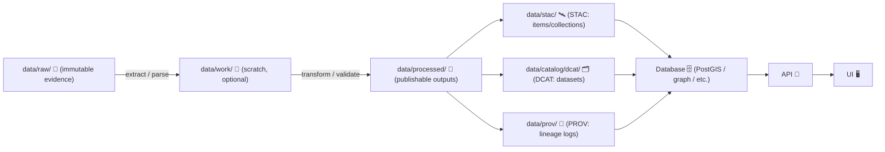

# 🧪 pipelines/ — ETL & Simulation Pipelines


> 📜 **Canonical order (non-negotiable):** **Raw → Processed → Catalog/Prov → Database → API → UI**  
> Any shortcut (e.g., injecting into UI directly, or bypassing metadata) is considered flawed unless proven otherwise.  [oai_citation:0‡Kansas Frontier Matrix (KFM) – Comprehensive Technical Blueprint.pdf](sediment://file_000000006dbc71f89a5094ce310a452d)

This folder is KFM’s offline “data refinery” 🏭: **ETL scripts, ingestion notebooks, simulations, and analysis pipelines** that transform **immutable evidence** into **reviewable, versioned, documented datasets** that the platform can serve.  [oai_citation:1‡Kansas Frontier Matrix (KFM) – Comprehensive Technical Blueprint.pdf](sediment://file_000000006dbc71f89a5094ce310a452d)

---

## 🚦 Read this first (KFM pipeline doctrine)

- 🧾 **`data/raw/` is evidence** → treat as read-only snapshots.  [oai_citation:2‡Kansas Frontier Matrix (KFM) – Comprehensive Technical Blueprint.pdf](sediment://file_000000006dbc71f89a5094ce310a452d)  
- 🧼 **`data/processed/` is publishable** → everything here must be ready for the platform (schema, CRS, naming, etc.).  [oai_citation:3‡Kansas Frontier Matrix (KFM) – Comprehensive Technical Blueprint.pdf](sediment://file_000000006dbc71f89a5094ce310a452d)  
- 🗂️🧬 **Metadata + lineage ship with the data** → “no data enters KFM without documentation.”  [oai_citation:4‡Kansas Frontier Matrix (KFM) – Comprehensive Technical Blueprint.pdf](sediment://file_000000006dbc71f89a5094ce310a452d)  
- ✋ **No manual edits to processed outputs** → if something must change, change the pipeline and re-run.  [oai_citation:5‡Kansas Frontier Matrix (KFM) – Comprehensive Technical Blueprint.pdf](sediment://file_000000006dbc71f89a5094ce310a452d)  
- 🛡️ **Fail-closed** governance → missing license/access/policy info should block merges and deployments.  [oai_citation:6‡Kansas Frontier Matrix (KFM) – Comprehensive Technical Blueprint.pdf](sediment://file_000000006dbc71f89a5094ce310a452d)  

---

## 🧭 Quick Navigation

<details>
<summary><strong>🧭 Table of Contents (click to expand)</strong></summary>

- [🔁 Canonical Contract](#-canonical-contract-non-negotiable)
- [🗃️ Repo & Data Layout](#️-repo--data-layout)
- [🧰 Pipeline Types](#-pipeline-types)
- [🧱 Hard Requirements](#-hard-requirements)
- [🏃 Running Pipelines](#-running-pipelines)
- [🧩 Plugin-Based Pipelines](#-plugin-based-pipelines)
- [🗂️ Metadata & Provenance](#️-metadata--provenance)
- [🎯 Determinism & Reproducibility](#-determinism--reproducibility)
- [🧪 Quality Checks](#-quality-checks)
- [⚡ Performance & Scaling](#-performance--scaling)
- [🌍 Special Patterns](#-special-patterns)
- [🛡️ Governance & Sensitive Data](#️-governance--sensitive-data)
- [🧬 Data Spaces & Federation](#-data-spaces--federation-future-facing)
- [🧾 Pipeline Documentation Standard](#-pipeline-documentation-standard-required-for-human-review)
- [✅ Contribution Checklist](#-contribution-checklist)
- [📚 References](#-references)

</details>

---

## 🔁 Canonical Contract (Non-Negotiable)

### ✅ The pipeline flow



> [!IMPORTANT]
> The **“publish boundary”** is the point where processed data is accompanied by **STAC + DCAT + PROV**.  
> Until that boundary is satisfied, the dataset is **not considered KFM-grade**.  [oai_citation:7‡Kansas Frontier Matrix (KFM) – Comprehensive Technical Blueprint.pdf](sediment://file_000000006dbc71f89a5094ce310a452d)  [oai_citation:8‡MARKDOWN_GUIDE_v13.md.gdoc](file-service://file-UYVruFXfueR8veHMUKeugU)

---

## 🗃️ Repo & Data Layout

KFM is a monorepo where code + data + documentation evolve together. A core repo layout is explicitly described in the blueprint, including `pipelines/` and `data/` with raw/processed/catalog/provenance.  [oai_citation:9‡Kansas Frontier Matrix (KFM) – Comprehensive Technical Blueprint.pdf](sediment://file_000000006dbc71f89a5094ce310a452d)

### 📁 Layouts you will see (and how to think about them)

#### A) Blueprint baseline (common in existing docs)

```text
Kansas-Frontier-Matrix/
├─ 🧪 pipelines/
└─ 🗺️ data/
   ├─ raw/         🧾 immutable evidence
   ├─ processed/   🧼 curated outputs
   ├─ catalog/     🗂️ STAC/DCAT metadata
   └─ provenance/  🧬 PROV lineage logs
```

#### B) KFM Docs v13 “expanded” layout (preferred for clarity)

The v13 doc standard clarifies a separation between **STAC**, **DCAT**, **PROV**, and introduces an optional `data/work/` scratch area.  [oai_citation:10‡MARKDOWN_GUIDE_v13.md.gdoc](file-service://file-UYVruFXfueR8veHMUKeugU)

```text
Kansas-Frontier-Matrix/
├─ 🧪 pipelines/
└─ 🗺️ data/
   ├─ raw/               🧾 immutable evidence
   ├─ work/              🧰 scratch / intermediate (can be cleaned)
   ├─ processed/         🧼 publishable outputs
   ├─ stac/              🛰️ STAC (collections/items/assets)
   ├─ catalog/
   │  └─ dcat/            🗂️ DCAT dataset records
   └─ prov/              🧬 PROV lineage logs
```

> [!NOTE]
> If your branch still uses `data/catalog/` + `data/provenance/`, you can still apply the rules in this README — just treat the newer paths as a **semantic refinement** (STAC vs DCAT vs PROV).  [oai_citation:11‡Kansas Frontier Matrix (KFM) – Comprehensive Technical Blueprint.pdf](sediment://file_000000006dbc71f89a5094ce310a452d)  [oai_citation:12‡MARKDOWN_GUIDE_v13.md.gdoc](file-service://file-UYVruFXfueR8veHMUKeugU)

---

## 🧰 Pipeline Types

| Type | What it does | Typical outputs |
|---|---|---|
| 🧲 Ingestion (ETL) | Pull/parse a source dataset and standardize it | Processed dataset + STAC + DCAT + PROV |
| 🧽 Normalization | CRS/unit normalization, schema alignment | Updated processed dataset + updated PROV |
| 🧠 Enrichment | Joins, derived fields, aggregates, computed indices | New derived dataset + metadata updates |
| 🌪️ Simulation | Generates “what-if” layers & modeled outputs | Sim outputs + provenance of assumptions |
| ♻️ Refresh | Adds new time slices / releases | Version bump + lineage updates |

The blueprint explicitly calls out `pipelines/` as the home for ETL and simulation scripts and notes simulation outputs should also carry metadata + provenance.  [oai_citation:13‡Kansas Frontier Matrix (KFM) – Comprehensive Technical Blueprint.pdf](sediment://file_000000006dbc71f89a5094ce310a452d)

---

## 🧱 Hard Requirements

### 1) Deterministic, reproducible execution ✅
Official pipelines must be non-interactive (no prompts) and reproducible given the same inputs/config.  [oai_citation:14‡Kansas Frontier Matrix (KFM) – Comprehensive Technical Blueprint.pdf](sediment://file_000000006dbc71f89a5094ce310a452d)

### 2) Idempotent behavior ♻️
Re-running a pipeline without changes should not create duplicates (use hashes/version checks where practical).  [oai_citation:15‡Kansas Frontier Matrix (KFM) – Comprehensive Technical Blueprint.pdf](sediment://file_000000006dbc71f89a5094ce310a452d)

### 3) Standard pipeline “shape” 🧱
A typical pipeline should:

1. Read **from** `data/raw/…`  
2. Transform (parsing, CRS conversion, normalization, joins)  
3. Write **to** `data/processed/…`  
4. Emit/Update:
   - `data/stac/…` (STAC)
   - `data/catalog/dcat/…` (DCAT)
   - `data/prov/…` (PROV)

This “produce data + produce documentation” expectation is repeatedly emphasized in the blueprint.  [oai_citation:16‡Kansas Frontier Matrix (KFM) – Comprehensive Technical Blueprint.pdf](sediment://file_000000006dbc71f89a5094ce310a452d)

### 4) No manual edits (treat datasets like code) 🚫✍️
If a value is “wrong,” write a transformation step to correct it (or update raw source), then re-run the pipeline. Manual edits erode trust.  [oai_citation:17‡Kansas Frontier Matrix (KFM) – Comprehensive Technical Blueprint.pdf](sediment://file_000000006dbc71f89a5094ce310a452d)

---

## 🏃 Running Pipelines

> [!TIP]
> The blueprint recommends running pipelines in a dev environment that mirrors production (often via Docker Compose).  [oai_citation:18‡Kansas Frontier Matrix (KFM) – Comprehensive Technical Blueprint.pdf](sediment://file_000000006dbc71f89a5094ce310a452d)

Because repo implementations evolve, below is the **expected UX** (whether done via a simple script, Makefile target, or a future orchestrator):

### ✅ Expected run loop (human + CI friendly)

```bash
# 1) Add/refresh evidence
mkdir -p data/raw/<domain>/<source>/
# drop raw snapshots here

# 2) Run pipeline (non-interactive)
python pipelines/<your_pipeline>.py --config pipelines/<your_pipeline>.yml

# 3) Verify outputs exist (processed + metadata + provenance)
ls data/processed/<domain>/
ls data/stac/ data/catalog/dcat/ data/prov/

# 4) Commit + PR (CI will gate)
git add data/processed data/stac data/catalog/dcat data/prov pipelines/
git commit -m "ingest: <dataset_id> vX.Y.Z"
```

The blueprint explicitly describes the workflow pattern: commit processed + metadata + provenance, open PR, CI validates presence/quality, then merge and optionally load to PostGIS.  [oai_citation:19‡Kansas Frontier Matrix (KFM) – Comprehensive Technical Blueprint.pdf](sediment://file_000000006dbc71f89a5094ce310a452d)

---

## 🧩 Plugin-Based Pipelines

KFM’s blueprint proposes a **plugin-based ETL framework**: each source integration is a self-contained module discovered by an orchestrator, with a standard interface (`ingest()`, `transform()`, `load()`) and a manifest (`pipeline.yml`).  [oai_citation:20‡Kansas Frontier Matrix (KFM) – Comprehensive Technical Blueprint.pdf](sediment://file_000000006dbc71f89a5094ce310a452d)

### 📦 Recommended plugin layout

```text
pipelines/plugins/
└─ 🧩 usgs_water/
   ├─ pipeline.yml          🗒️ manifest (inputs/outputs/governance)
   ├─ src/
   │  ├─ __init__.py
   │  └─ pipeline.py        🧠 ingest / transform / emit artifacts
   ├─ tests/                🧪 unit + data-contract tests
   └─ README.md             📘 human review notes
```

### 🗒️ `pipeline.yml` (manifest) — recommended schema (v13-aligned)

```yaml
name: usgs_water
pipeline_version: 0.1.0
kind: ingestion            # ingestion | enrichment | simulation | refresh
description: "USGS water observations standardized for KFM"

dataset:
  id: hydrology.usgs_water
  version: 2026.01.0       # data version (not necessarily same as pipeline_version)
  theme: hydrology
  license: CC-BY-4.0

inputs:
  - path: data/raw/usgs_water/
    required: true
    evidence: true

outputs:
  processed:
    - path: data/processed/hydrology/usgs_water.parquet
  stac:
    - path: data/stac/hydrology.usgs_water.collection.json
  dcat:
    - path: data/catalog/dcat/hydrology.usgs_water.dataset.json
  prov:
    - path: data/prov/hydrology.usgs_water.prov.json

reproducibility:
  deterministic: true
  seed: 42
  timezone: UTC

governance:
  accessLevel: Public       # Public | Restricted | Withdrawn
  ownerGroup: null          # e.g., "TribeABC" when restricted
  retention: indefinite
  pii: false
```

> [!WARNING]
> Governance fields are not “nice-to-have.” KFM’s architecture is **policy-driven and fail-closed**, and CARE-style controls (like owner group restrictions) must be carried forward into derived data.  [oai_citation:21‡Kansas Frontier Matrix (KFM) – Comprehensive Technical Blueprint.pdf](sediment://file_000000006dbc71f89a5094ce310a452d)

### 🧱 Minimal pipeline interface (reference)

```python
# pipelines/plugins/<name>/src/pipeline.py

class Pipeline:
    name: str
    pipeline_version: str

    def ingest(self, ctx): ...
    def transform(self, ctx, raw): ...
    def write_processed(self, ctx, processed): ...

    # Non-negotiable artifacts:
    def emit_stac(self, ctx): ...
    def emit_dcat(self, ctx): ...
    def emit_prov(self, ctx): ...
```

---

## 🗂️ Metadata & Provenance

### 🛰️ STAC outputs (spatiotemporal discoverability)
- For a single “thing”: STAC **Item**
- For multi-date/multi-part: STAC **Collection + Items**
- STAC assets should reference (or embed) key publishable outputs (GeoParquet/Parquet/GeoJSON/GeoTIFF).  [oai_citation:22‡Kansas Frontier Matrix (KFM) – Comprehensive Technical Blueprint.pdf](sediment://file_000000006dbc71f89a5094ce310a452d)

### 🗂️ DCAT outputs (portal/catalog friendliness)
DCAT dataset records help publish to broader catalogs and data portals, complementing STAC.  [oai_citation:23‡Kansas Frontier Matrix (KFM) – Comprehensive Technical Blueprint.pdf](sediment://file_000000006dbc71f89a5094ce310a452d)

### 🧬 PROV outputs (lineage you can audit)
Provenance logs should answer: **“How was this produced?”** using the W3C PROV model (Entities, Activities, Agents).  [oai_citation:24‡Kansas Frontier Matrix (KFM) – Comprehensive Technical Blueprint.pdf](sediment://file_000000006dbc71f89a5094ce310a452d)

#### 🔎 Example `*.prov.json` (minimal but useful)

```json
{
  "dataset_id": "hydrology.usgs_water",
  "prov": {
    "entity": {
      "raw:zip": {"path": "data/raw/usgs_water/source.zip", "sha256": "…"},
      "out:parquet": {"path": "data/processed/hydrology/usgs_water.parquet", "sha256": "…"}
    },
    "activity": {
      "run:2026-01-28T00:00:00Z": {
        "type": "pipelines/plugins/usgs_water",
        "git_commit": "abc123",
        "started_at": "2026-01-28T00:00:00Z",
        "ended_at": "2026-01-28T00:01:12Z",
        "params": {"normalize_units": true}
      }
    },
    "agent": {
      "software:pipeline": {"name": "usgs_water", "version": "0.1.0"},
      "person:trigger": {"name": "CI"}
    }
  }
}
```

> [!TIP]
> The blueprint suggests leveraging AI to draft metadata/provenance (especially descriptions), **but** the results must still be reviewable and governed.  [oai_citation:25‡Kansas Frontier Matrix (KFM) – Comprehensive Technical Blueprint.pdf](sediment://file_000000006dbc71f89a5094ce310a452d)

---

## 🎯 Determinism & Reproducibility

> [!IMPORTANT]
> Determinism is a contract: reruns on the same inputs/config should yield **byte-identical** outputs whenever feasible.

### ✅ Practices that make pipelines deterministic

- 🔒 **Pin environments** (lockfiles, containers, pinned base images)
- 🎲 **Fix randomness** (explicit seeds; record them in PROV)
- 🔤 **Stable ordering** (sort before writing; stable IDs)
- 🕰️ **No “now()” inside dataset rows** (timestamps belong in PROV)
- 🧾 **Stable file naming** (include dataset_id + version)
- 🧪 **Golden tests** for small sample fixtures

---

## 🧪 Quality Checks

Pipelines should validate:
- schema expectations (required columns, types)
- plausible value ranges
- geometry validity + CRS correctness  
- record counts + basic summaries (min/max, null rates)

The blueprint notes that validation + summary stats aren’t always mandatory, but strongly improve reviewer confidence and maintenance.  [oai_citation:26‡Kansas Frontier Matrix (KFM) – Comprehensive Technical Blueprint.pdf](sediment://file_000000006dbc71f89a5094ce310a452d)

---

## ⚡ Performance & Scaling

### 🧱 Git-friendly dataset strategy
Very large assets can be challenging to store in Git. A practical approach is:
- commit “reviewable” derivatives (e.g., vector tiles, sampled GeoParquet, or simplified GeoJSON)
- store large rasters externally and commit **hashes/pointers** in STAC assets
- keep pipeline outputs deterministic so caches are safe

### 📈 Plan for growth
Pipelines are ingestion engines: track ingestion rate, burstiness, and storage needs as datasets grow.  [oai_citation:27‡Database Performance at Scale.pdf](sediment://file_000000002cf871f5905f30dcc65cc90b)

### 🧠 Performance patterns worth adopting
- partition processed outputs by time and/or region (especially time series)
- avoid monolithic “one file forever” outputs when diffs become unreviewable
- precompute rollups used by the UI (don’t compute them on every request)
- if/when streaming data appears, consider partitioning/time-window strategies (the blueprint discusses time-partitioning needs for volume).  [oai_citation:28‡Kansas Frontier Matrix (KFM) – Comprehensive Technical Blueprint.pdf](sediment://file_000000006dbc71f89a5094ce310a452d)

---

## 🌍 Special Patterns

### 🛰️ Remote sensing pipelines (Google Earth Engine)

Earth Engine workflows often look like **filter → map → reduce**, and pipelines must capture the parameters that define those steps.  [oai_citation:29‡Cloud-Based Remote Sensing with Google Earth Engine-Fundamentals and Applications.pdf](sediment://file_00000000a58071f586f00793dee712d6)

**Critical gotcha:** Earth Engine can behave differently depending on whether CRS/scale are explicitly set (e.g., `reduceRegion` may default to the image band projection; map visualization often defaults to EPSG:3857). Always specify CRS + scale where possible.  [oai_citation:30‡Cloud-Based Remote Sensing with Google Earth Engine-Fundamentals and Applications.pdf](sediment://file_00000000a58071f586f00793dee712d6)

**KFM implication:**
- export derived rasters (GeoTIFF/COG) and/or extracted tables (Parquet/CSV)
- emit STAC with assets and parameters (cloud thresholds, reducers, scale, CRS, temporal window)
- emit PROV describing filters and reducer choices (so results are reproducible)

### 🧭 CRS & projection choices (don’t guess)
No projection preserves everything; choose based on what you’re mapping (area vs shape vs distance). Web maps often use a modified Mercator; equal-area projections are often better for area statistics.  [oai_citation:31‡making-maps-a-visual-guide-to-map-design-for-gis.pdf](sediment://file_00000000602471f786dfbbaac9329fb9)

> [!TIP]
> For KFM, it’s acceptable to standardize interchange to **EPSG:4326** (or a Kansas-specific CRS) as long as you record the original CRS and document why/when reprojection occurs.  [oai_citation:32‡Kansas Frontier Matrix (KFM) – Comprehensive Technical Blueprint.pdf](sediment://file_000000006dbc71f89a5094ce310a452d)

### 🕰️ Time-oriented datasets (for UI exploration)
Interactive time systems rely on fast navigation, selection/highlighting, and linked views. Pipelines should therefore produce:
- clean temporal indexes (timezone explicitly documented)
- rollups/aggregations for fast API queries
- metadata describing temporal extent + resolution

This is consistent with time-oriented visualization design patterns and is aligned with KFM’s “scroll-linked” / timeline ambitions.  [oai_citation:33‡Visualization of Time-Oriented Data.pdf](sediment://file_000000001468722f929b8752236e5a72)  [oai_citation:34‡Kansas Frontier Matrix (KFM) – Comprehensive Technical Blueprint.pdf](sediment://file_000000006dbc71f89a5094ce310a452d)

---

## 🛡️ Governance & Sensitive Data

KFM is designed to **fail closed**: if policy checks fail, actions are blocked.  [oai_citation:35‡Kansas Frontier Matrix (KFM) – Comprehensive Technical Blueprint.pdf](sediment://file_000000006dbc71f89a5094ce310a452d)  
KFM also embeds **FAIR + CARE** as enforceable behaviors (not just ethics statements).  [oai_citation:36‡Kansas Frontier Matrix (KFM) – Comprehensive Technical Blueprint.pdf](sediment://file_000000006dbc71f89a5094ce310a452d)

### 🔒 Restricted data patterns (owner group + access level)
Use governance metadata such as:
- `accessLevel: Restricted`
- `ownerGroup: TribeABC`

…and ensure derived datasets inherit restrictions (“no laundering Restricted into Public”).  [oai_citation:37‡Kansas Frontier Matrix (KFM) – Comprehensive Technical Blueprint.pdf](sediment://file_000000006dbc71f89a5094ce310a452d)

---

## 🧬 Data Spaces & Federation (Future-Facing)

Data Spaces thinking emphasizes **co-existence over full integration** (a pay-as-you-go path), plus pillars like interoperability, trust, and governance.  [oai_citation:38‡Data Spaces.pdf](sediment://file_0000000053c071f5a9733b1b09cc9f76)

**KFM implication:** pipelines should be able to:
- catalog some data *in-place* (federated via APIs) while maintaining STAC/DCAT/PROV
- store pointers/hashes and still maintain trustworthy provenance
- keep governance attached even when bytes aren’t centrally stored

---

## 🧾 Pipeline Documentation Standard (Required for Human Review)

Every pipeline/plugin should include a small human-facing README describing:
- stages (extract/transform/load) + dependencies
- input evidence and how it was obtained
- outputs (processed + STAC + DCAT + PROV) with paths
- governance + licensing notes
- validation steps and “how to verify”

The docs v13 standard frames “data as an artifact” with required companion metadata and provenance outputs.  [oai_citation:39‡MARKDOWN_GUIDE_v13.md.gdoc](file-service://file-UYVruFXfueR8veHMUKeugU)

---

## ✅ Contribution Checklist

Before opening a PR for a new/updated pipeline:

- [ ] **Raw evidence** is under `data/raw/` and is not modified in-place.  [oai_citation:40‡Kansas Frontier Matrix (KFM) – Comprehensive Technical Blueprint.pdf](sediment://file_000000006dbc71f89a5094ce310a452d)  
- [ ] Pipeline is **non-interactive** and reproducible.  [oai_citation:41‡Kansas Frontier Matrix (KFM) – Comprehensive Technical Blueprint.pdf](sediment://file_000000006dbc71f89a5094ce310a452d)  
- [ ] Outputs are written to `data/processed/` in appropriate formats.  [oai_citation:42‡Kansas Frontier Matrix (KFM) – Comprehensive Technical Blueprint.pdf](sediment://file_000000006dbc71f89a5094ce310a452d)  
- [ ] STAC exists under `data/stac/` (or `data/catalog/` in older branches).  [oai_citation:43‡Kansas Frontier Matrix (KFM) – Comprehensive Technical Blueprint.pdf](sediment://file_000000006dbc71f89a5094ce310a452d)  
- [ ] DCAT exists under `data/catalog/dcat/` (or alongside STAC in older branches).  [oai_citation:44‡Kansas Frontier Matrix (KFM) – Comprehensive Technical Blueprint.pdf](sediment://file_000000006dbc71f89a5094ce310a452d)  
- [ ] PROV exists under `data/prov/` (or `data/provenance/` in older branches).  [oai_citation:45‡Kansas Frontier Matrix (KFM) – Comprehensive Technical Blueprint.pdf](sediment://file_000000006dbc71f89a5094ce310a452d)  
- [ ] Governance metadata is correct (license/access level/owner group).  [oai_citation:46‡Kansas Frontier Matrix (KFM) – Comprehensive Technical Blueprint.pdf](sediment://file_000000006dbc71f89a5094ce310a452d)  
- [ ] No manual edits to processed data (fix the pipeline instead).  [oai_citation:47‡Kansas Frontier Matrix (KFM) – Comprehensive Technical Blueprint.pdf](sediment://file_000000006dbc71f89a5094ce310a452d)  
- [ ] Optional but encouraged: schema + range checks + summary stats.  [oai_citation:48‡Kansas Frontier Matrix (KFM) – Comprehensive Technical Blueprint.pdf](sediment://file_000000006dbc71f89a5094ce310a452d)  

---

## 📚 References

Project sources used to align this README:

- Kansas Frontier Matrix (KFM) – Comprehensive Technical Blueprint  [oai_citation:49‡Kansas Frontier Matrix (KFM) – Comprehensive Technical Blueprint.pdf](sediment://file_000000006dbc71f89a5094ce310a452d)  
- MARKDOWN_GUIDE_v13 (KFM doc + artifact conventions)  [oai_citation:50‡MARKDOWN_GUIDE_v13.md.gdoc](file-service://file-UYVruFXfueR8veHMUKeugU)  
- Cloud-Based Remote Sensing with Google Earth Engine (Fundamentals & Applications)  [oai_citation:51‡Cloud-Based Remote Sensing with Google Earth Engine-Fundamentals and Applications.pdf](sediment://file_00000000a58071f586f00793dee712d6)  
- Visualization of Time-Oriented Data  [oai_citation:52‡Visualization of Time-Oriented Data.pdf](sediment://file_000000001468722f929b8752236e5a72)  
- Database Performance at Scale  [oai_citation:53‡Database Performance at Scale.pdf](sediment://file_000000002cf871f5905f30dcc65cc90b)  
- Data Spaces: Design, Deployment, and Future Directions  [oai_citation:54‡Data Spaces.pdf](sediment://file_0000000053c071f5a9733b1b09cc9f76)  
- Making Maps: A Visual Guide to Map Design for GIS (projection & cartographic tradeoffs)  [oai_citation:55‡making-maps-a-visual-guide-to-map-design-for-gis.pdf](sediment://file_00000000602471f786dfbbaac9329fb9)  