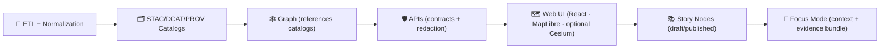
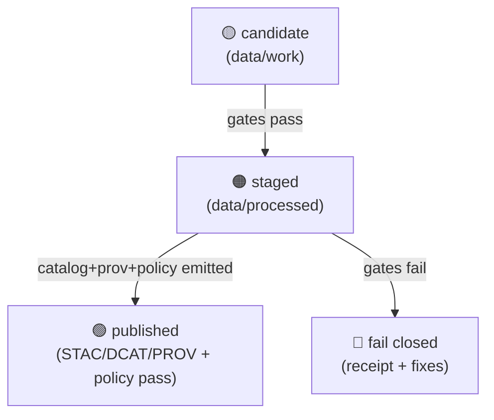
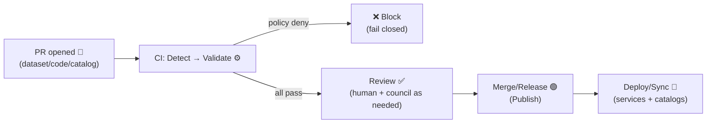

<!--
📌 This README defines the *canonical pipeline boundary* for KFM (Kansas Frontier Matrix) / Kansas‑Matrix‑System.
🗓️ Last updated: 2026-01-19
🔁 Review cycle: 90 days (or anytime pipeline order / catalogs / policy changes)
-->

<div align="center">

# 🧬 KFM Pipelines  
`pipelines/README.md`

**Deterministic ETL → source manifests → governed catalogs → graph ingest → APIs → UI → Story Nodes → Focus Mode**  
The operational spine of **Kansas Frontier Matrix (KFM)**. 🧠🗺️🧾


-ff6b6b)
-0ea5e9)


</div>

> **TL;DR:** `pipelines/` is the **portal + contract** for how KFM builds evidence.  
> The **executable pipeline code** lives in `src/pipelines/`.  
> The **publishable artifacts** live in `data/processed/**` and are not “real” until they’re **cataloged (STAC/DCAT)** and **traceable (PROV)**.

> [!IMPORTANT]
> **Prime directive:** **No catalog → no graph → no API → no UI.**  
> Catalogs are the interface. Provenance is the receipt. 🧾✅

> [!IMPORTANT]
> **Second directive:** **No policy pass → no merge → no publish.**  
> Governance is enforced (automated + human review), not “best-effort.” ⚖️🔒

---

## 🔗 Quick links (start here) 🧭
- 🏠 Repo overview: `../README.md`
- 🧩 Executable boundary: `../src/README.md` *(if present)*
- 🚪 API boundary (governed trust edge): `../api/README.md` *(if present)*
- ⚖️ Policy Pack (OPA/Rego): `../api/scripts/policy/README.md` *(if present)*
- 📦 Data + metadata boundary: `../data/README.md` *(required reading)*
- 🧪 Tests & QA gates: `../tests/README.md`
- 🧰 Governed toolchain surface: `../tools/README.md`
- 🧰 Automation wrappers: `../scripts/README.md`
- 📓 MCP (runs, experiments, receipts): `../mcp/README.md` *(or `../mcp/MCP-README.md` if that’s the canonical name)*
- 📘 Master Guide (canonical intent + paths): `../docs/MASTER_GUIDE_v13.md` *(if present)*
- 🧱 Architecture & ADRs: `../docs/architecture/`
- 🧾 Governance: `../docs/governance/`
- 📐 Schemas + profiles: `../schemas/` **and** `../docs/standards/`
- 🧩 Templates: `../docs/templates/`
- 📚 Story Nodes (narrative content): `../docs/reports/story_nodes/` *(draft/published workflow)*
- 🌐 Web UI boundary: `../web/` *(React · MapLibre · optional Cesium)*

---

<details>
<summary><b>🧭 Table of contents</b></summary>

- [🧾 Doc metadata](#-doc-metadata)
- [🚦 Non‑negotiables](#-non-negotiables)
- [🧠 What a “pipeline” means in KFM](#-what-a-pipeline-means-in-kfm)
- [🧭 Canonical paths & aliases](#-canonical-paths--aliases)
- [🧱 The canonical ordering](#-the-canonical-ordering)
- [🧠 Pipelines as “compilers”](#-pipelines-as-compilers)
- [🧩 Pipeline taxonomy](#-pipeline-taxonomy)
- [📦 Data & metadata lifecycle](#-data--metadata-lifecycle)
- [🚀 Promotion workflow](#-promotion-workflow)
- [🧰 GitOps publish boundary](#-gitops-publish-boundary)
- [⚖️ Policy-as-code](#️-policy-as-code-opa--conftest)
- [🧑‍🤝‍🧑 W‑P‑E automation](#-wpe-automation-watcher--planner--executor)
- [📁 Where things live](#-where-things-live)
- [🧾 Standard artifacts](#-standard-artifacts)
- [📜 KFM Pipeline Definition Contract](#-kfm-pipeline-definition-contract)
- [⚙️ Running pipelines](#️-running-pipelines)
- [✅ Quality gates](#-quality-gates)
- [🧾 Receipts, telemetry, and replay](#-receipts-telemetry-and-replay)
- [🔐 Governance & sovereignty](#-governance--sovereignty)
- [🛡️ Security & hostile inputs](#️-security--hostile-inputs)
- [🔭 Performance & scaling](#-performance--scaling)
- [🌾 Example pipeline archetypes](#-example-pipeline-archetypes)
- [🧩 Adding a new pipeline](#-adding-a-new-pipeline)
- [📚 Project reference library influence map](#-project-reference-library-influence-map)
- [🧾 Metadata](#-metadata)
- [🕰️ Version history](#️-version-history)
- [📎 Evidence anchors](#-evidence-anchors)

</details>

---

## 🧾 Doc metadata

| Field | Value |
|---|---|
| Doc | `pipelines/README.md` |
| Status | Active ✅ |
| Last updated | **2026-01-19** |
| Review cycle | 90 days 🔁 |
| Audience | Contributors implementing ETL jobs, validators, catalog writers, graph exports/ingest bridges |
| Prime directive | **No catalog → no graph → no API → no UI.** Catalogs are the interface. |
| Second directive | **No policy pass → no merge → no publish.** |
| System mission fit | Make Kansas spatial truth **searchable, mappable, auditable, modelable** (provenance-first; AI is advisory) 🧠🧾 |

---

## 🚦 Non‑negotiables

1) **Deterministic, idempotent ETL** 🧪  
   Same inputs + same config + same code ⇒ same outputs (stable IDs/hashes) and reruns do not corrupt or duplicate.

2) **Contract-first** 📜  
   Pipelines are driven by declared contracts (schemas, profiles, OpenAPI) and contract changes trigger compatibility checks.

3) **Catalogs are not optional** 🗂️  
   Data is not “real” in KFM until it has:
   - **STAC** (assets + spatial/temporal metadata)
   - **DCAT** (dataset discovery & distributions)
   - **PROV** (lineage + run identity)

4) **Evidence-first narrative** 📚  
   Story Nodes / Focus Mode must cite **cataloged evidence**. No unsourced narrative content.  
   If AI helps generate text: label it, attach provenance, and include confidence/uncertainty where applicable.

5) **API boundary rule** 🛡️  
   The UI must **never** query Neo4j/DB directly; all access goes through governed APIs (contracts + redaction).

6) **Governed ordering is sacred** 🧱  
   **ETL → STAC/DCAT/PROV → Graph → API → UI → Story Nodes → Focus Mode**

7) **Stable identifiers (no semantic IDs)** 🧷  
   IDs must be **information-free** and invariant over time (don’t encode meaning that will drift). Prefer UUID/ULID + metadata.  
   *If it “needs renaming,” it wasn’t a stable ID.* 🧠

8) **Policy-as-code gating (fail closed)** ⚖️🔒  
   Governance rules are enforced automatically (OPA/Rego + Conftest is the default posture). If a policy can’t be evaluated, default is **deny**.

9) **GitOps & auditable publishing** 🧾🔁  
   “Published” generally means: validated artifacts + catalogs + provenance + policy report + review trail (PR/approvals).  
   *If it didn’t go through review, it’s not production evidence.*

> [!TIP]
> If your pipeline can’t produce a clean paper trail (inputs → transforms → outputs → catalogs → lineage), it’s not ready to merge. ✅🧾

---

## 🧠 What a “pipeline” means in KFM

A KFM pipeline is a **replayable builder** that produces (at minimum):

- 📎 **Source manifests** → `data/sources/**` *(where the data came from, rights, sensitivity; pointer-over-payload)*
- 📦 **Evidence artifacts** → `data/processed/**` *(COG, GeoParquet, CSV, tiles, thumbnails, reports, model artifacts, etc.)*
- 🗂️ **Catalog artifacts** → `data/stac/**` + `data/catalog/dcat/**`
- 🧬 **Lineage artifacts** → `data/prov/**` *(W3C PROV JSON‑LD recommended)*
- 🧷 **Integrity artifacts** → manifests, checksums, inventories
- 🧪 **Gate artifacts** → schema reports, policy reports, link-check reports *(deterministic + storable)*
- 📈 **Telemetry artifacts** → run summaries, gate outcomes, timings *(location is configurable; keep it deterministic and linkable)*

> [!IMPORTANT]
> Pipelines do **not** “secretly update the graph.”  
> The graph ingests **from catalogs** (and/or explicit graph export artifacts) via controlled paths.

---

## 🧭 Canonical paths & aliases

KFM has a few “names you’ll see in old notes.” Here’s the **current canonical set**:

| Concept | Canonical path ✅ | Common aliases you may see ⚠️ |
|---|---|---|
| Source manifests | `data/sources/**` | *(varies)* |
| Raw drops | `data/raw/**` | *(same)* |
| Work / intermediate | `data/work/**` | *(same)* |
| Processed evidence | `data/processed/**` | *(same)* |
| STAC catalogs | `data/stac/**` | `data/catalog/**` *(older drafts)* |
| DCAT catalogs | `data/catalog/dcat/**` | `data/catalogs/**`, `data/catalog/**` |
| Provenance | `data/prov/**` | `data/provenance/**` |

> [!NOTE]
> When in doubt: follow **Master Guide v13** paths. Older path spellings should be treated as legacy aliases.

---

## 🧱 The canonical ordering

> [!IMPORTANT]
> This is a governance boundary, not a preference.



---

## 🧠 Pipelines as “compilers”

A helpful mental model: **pipelines behave like compilers** — inputs go through phases, and each phase has gates.  
This keeps the system honest: “build steps” are explicit, testable, and replayable. 🧱

| Compiler concept 🧩 | Pipeline analogue 🧬 | What we enforce ✅ |
|---|---|---|
| Lexing/parsing | ingest + schema parse | reject malformed inputs early |
| Type checking | semantic validation | CRS, geometry validity, ranges, licensing |
| IR transforms | normalization | canonical encodings + stable sort order |
| Linking | catalog linkage | STAC ↔ DCAT ↔ PROV cross-refs present |
| Linting | policy checks | OPA/Rego denies block publish |
| Codegen | artifacts + catalogs | COG/Parquet + STAC/DCAT + PROV receipts |
| Optimization | scaling tactics | tiling, partitioning, caching, indexing |
| Error reporting | receipts & logs | actionable failures + correlation IDs |

> [!NOTE]
> A pipeline that “kind of works” but can’t explain itself is a governance bug, not a feature. 🧾

---

## 🧩 Pipeline taxonomy

Not all pipelines look the same. KFM supports a few **governed shapes**:

| Type | When to use | Key rule 🔑 |
|---|---|---|
| 🧱 **Build (batch)** | One-time or periodic creation of a dataset | Must be deterministic + cataloged + prov’d before use |
| 🔁 **Refresh (scheduled)** | Regular updates (daily/weekly/monthly) | Must be idempotent; versioned outputs; diffs are inspectable |
| 👀 **Watcher (near‑real‑time)** | Polling/streaming feeds (e.g., GTFS‑RT) | Each window produces catalogable “units” + receipts; no mystery updates |
| 🔌 **Adapter (import bridge)** | Bring in external exports (partner datasets, agency drops) | Must validate schema/license/classification before promotion |
| 🧪 **Analysis/Model** | Derived indicators, Bayesian inference, simulation runs | Record params/seeds; output uncertainty + diagnostics as artifacts |
| 🧮 **Optimization** | Multi-constraint optimization runs (optional) | Record objective/constraints; deterministic run IDs; replay rules |
| 🧱 **Graph build/export** | Build bounded graph exports from catalogs | Graph edges must reference catalog IDs + provenance |
| 📄 **Document ingest** | PDFs/scans → extracted text/entities | Store raw + derived; provenance + redaction rules required |
| 🧊 **3D/volumetric** | 3D meshes, point clouds, volumes, 3D tiles | Coordinate conventions + LOD/tiling + validation gates |
| 🧳 **Offline pack builder** | Field/classroom bundles (tiles + data slices) | Packs must embed manifests + catalog pointers + license bundle |

> [!NOTE]
> Watchers are still bound by ordering: **they produce cataloged outputs first**, then (optionally) graph/API consumption follows.

---

## 📦 Data & metadata lifecycle

KFM uses a required staging lifecycle so everyone can tell “what stage is this file in?” at a glance:

### 📎 Source manifests (pointer-over-payload)
- `data/sources/<domain>/<dataset>/source.json` → where it came from, license, sensitivity, checksums/URLs *(best-effort)*  
  Think: **intent + rights + risk**.

### 📥 Data stages
- `data/raw/<domain>/...` → raw source drops *(read-only mindset)*
- `data/work/<domain>/...` → intermediate transforms *(ok to delete/regenerate)*
- `data/processed/<domain>/...` → final evidence artifacts *(publishable)*

### 🗂️ Catalog + provenance stages (required before downstream use)
- `data/stac/` → STAC collections/items (assets + metadata)
- `data/catalog/dcat/` → DCAT datasets/distributions (discovery)
- `data/prov/` → PROV bundles (run + dataset lineage)

### 🕸️ Graph exchange stages (recommended when graph updates are needed)
- `data/graph/csv/` → bounded import/export CSVs (bulk ingest friendly)
- `data/graph/cypher/` *(optional)* → bounded Cypher scripts for controlled ingest

### 🧳 Offline pack stages (optional, but governed)
- `data/packs/<pack_id>/` → a self-contained “evidence bundle” *(tiles + indexes + manifests + README)*

---

## 🚀 Promotion workflow

A pipeline output is either **not yet trustworthy**, or **published as governed evidence**.

### ✅ Promotion states (recommended)

| State | Location | Who can use it? | Required artifacts |
|---|---|---|---|
| 🟡 `candidate` | `data/work/**` | pipeline devs only | none (but logs helpful) |
| 🟠 `staged` | `data/processed/**` | reviewers + QA | checksums + basic gates |
| 🟢 `published` | `data/processed/**` + catalogs | everyone downstream | **STAC + DCAT + PROV + manifest + policy pass** |

### 🔁 Promotion rules (fail closed 🔒)
- **No publish without license + classification.**
- **No publish without PROV lineage** (inputs + run config + output IDs).
- **No publish without STAC/DCAT** for anything user-visible.
- **No publish if classification would downgrade** (unless audited redaction step exists).
- **No publish if policy checks cannot run** (missing policies/inputs = deny).



> [!TIP]
> Think “**atomic publish**”: write new outputs to a run-scoped directory → validate → promote/swap pointer → emit catalogs → declare published. ✅

---

## 🧰 GitOps publish boundary

KFM treats the repository + CI as part of the pipeline boundary:

- PRs are the default “change envelope” for **datasets, catalogs, policies, and pipeline code**
- CI runs **data QA + schema validation + policy pack** (deny-by-default)
- Merge (or signed release) is what *turns a candidate into published evidence*



> [!NOTE]
> This is why “No policy pass → no merge → no publish” is a **pipeline rule**, not an ops detail.

---

## ⚖️ Policy-as-code (OPA + Conftest)

KFM governance rules should be executable:

- **OPA/Rego** encodes rules (license required, classification propagation, citation coverage for AI outputs, no direct-graph UI access, etc.)
- **Conftest** runs those rules in CI and produces actionable failures (rule IDs + messages)
- Policy checks are just another ring in the quality gates (and must be replayable)

**Recommended homes (common patterns):**
- `api/scripts/policy/` *(docs + CI hooks)*
- `tools/validation/policy/*.rego` *(policy source)*

> [!TIP]
> Treat policy failures like compiler errors: fix the input until it compiles. 🧩⚖️

---

## 🧑‍🤝‍🧑 W‑P‑E automation (Watcher · Planner · Executor)

Some KFM maintenance can be automated — but only with guardrails:

- 👀 **Watcher** detects events (new upstream data drop, broken link, schema drift, policy warning)
- 🧠 **Planner** drafts a plan **under policy constraints**
- 🛠️ **Executor** performs the work by opening a PR (and never bypasses CI/policy)

**Rule of thumb:** automation must still produce **the same artifacts humans do**  
(manifests → processed → catalogs → provenance → policy pass → PR trail). 🧾✅

---

## 📁 Where things live

### 🧭 Repo context (target shape)
```text
📁 pipelines/                 # 📍 this folder (portal + conventions; not executable code)
📁 src/                       # 🧩 executable source code
│  ├── 📁 pipelines/          # 🧪 ETL jobs + catalog writers + validators
│  ├── 📁 graph/              # 🕸️ graph export/ingest tooling (from catalogs)
│  ├── 📁 server/             # 🛡️ APIs (contracts + redaction enforcement)
│  └── 📁 ai/                 # 🤖 AI services (Focus Mode; advisory-only; citation gates)
📁 api/                       # 🚪 API boundary docs/contracts (if separated)
│  └── 📁 scripts/policy/     # ⚖️ policy pack docs + hooks (if separated)
📁 data/                      # 📦 sources → raw → work → processed + STAC/DCAT/PROV + graph exports
│  ├── 📁 sources/            # 📎 source manifests (rights + sensitivity + pointers)
│  ├── 📁 raw/                # 📥 raw drops
│  ├── 📁 work/               # 🧪 intermediates
│  ├── 📁 processed/          # 📦 publishable evidence artifacts
│  ├── 📁 stac/               # 🗂️ STAC catalogs
│  ├── 📁 catalog/dcat/       # 🗂️ DCAT catalogs
│  ├── 📁 prov/               # 🧬 provenance
│  ├── 📁 graph/csv/          # 🕸️ bounded CSV exports/imports
│  └── 📁 packs/              # 🧳 offline packs (optional)
📁 schemas/                   # 📐 JSON Schemas (contracts)
📁 docs/                      # 📘 governed documentation (templates, standards, governance)
📁 tools/                     # 🧰 validators, QA tools, deterministic entrypoints
📁 scripts/                   # 🧰 orchestration wrappers (call tools/src)
📁 tests/                     # ✅ automated tests (unit/integration/e2e)
📁 web/                       # 🌐 UI (React + MapLibre + optional Cesium)
📁 releases/                  # 📦 packaged releases (manifest + SBOM + attestations)
📁 .github/                   # 🤝 CI/CD, policies, automation
```

### 🧪 Pipeline code (canonical)
```text
📁 src/pipelines/
└── 📁 <domain>/
    └── 📁 <pipeline_name>/
        ├── run.py                     # entrypoint (CLI)
        ├── pipeline.yml               # 📜 pipeline contract (recommended)
        ├── README.md                  # short notes + examples (dev-facing)
        ├── config/                    # env configs (dev/stage/prod)
        ├── schemas/                   # domain schemas (if needed)
        ├── validators/                # QA gates (schema, bounds, link checks, etc.)
        ├── tests/                     # mini-run tests + fixtures
        └── _shared/                   # optional submodules (prefer src/pipelines/_shared)
```

### 📘 Domain module docs (recommended)
```text
📁 docs/data/
└── 📁 <domain>/
    ├── README.md                      # domain overview + pipeline list + access notes
    └── 📁 pipelines/
        └── 📁 <pipeline_name>/
            └── README.md              # runbook: IO, cadence, gates, failure modes, replay rules
```

### 📚 Story Node content (governed narrative)
```text
📁 docs/reports/story_nodes/
├── 📁 draft/
└── 📁 published/
```

> [!TIP]
> If you add a new domain pipeline, add a domain module README under `docs/data/<domain>/README.md` so reviewers can find the “what/why/how” quickly. 🧭✅

---

## 🧾 Standard artifacts

KFM evidence is **pointer-over-payload** whenever possible: catalogs + IDs + signed URLs/paths  
(instead of dumping giant blobs into API/UI). 🔗🗂️

### ✅ Minimum publishable artifact set (KFM standard)
For any dataset intended for search/map/story/focus:

1) **Source manifests** in `data/sources/**`
   - origin, license, sensitivity/classification, access pointers
   - (optional) checksums for remote sources

2) **Evidence artifacts** in `data/processed/**`
   - preferred geo formats: **COG**, **GeoParquet**, **PMTiles** *(as needed)*
   - optional: thumbnails/quicklooks (small, cacheable)
   - optional: 3D Tiles / glTF assets (for 3D domains)

3) **Catalog artifacts**
   - **STAC** items/collections that reference the evidence assets
   - **DCAT** dataset + distributions for discovery

4) **Lineage artifacts**
   - **PROV** bundle: inputs → activities → outputs
   - includes run identity, config hash, git SHA *(where available)*

5) **Integrity + gate artifacts**
   - checksums manifest (sha256 preferred)
   - policy report (OPA/Conftest output, machine-readable)
   - optional: inventory (file sizes + media types)

6) **Graph exchange artifacts (only when needed)**
   - bounded CSV export/import in `data/graph/csv/**`
   - edges reference catalog IDs + provenance IDs

7) **Safety artifacts (when shipping containers/releases)**
   - SBOM (software bill of materials)
   - signed images/artifacts + attestations *(SLSA-like posture)*

> [!NOTE]
> Quicklooks are UX helpers. The authoritative truth is the evidence artifact + catalog metadata. 🗂️✅

---

## 📜 KFM Pipeline Definition Contract

KFM pipelines are contract-first. A pipeline should have a machine-readable contract file (recommended: `pipeline.yml`)
that explains **what it reads, what it writes, and what it guarantees**.

### ✅ Minimum contract fields (recommended)
- `id` (stable, versioned; do not encode secrets)
- `name`, `description`, `owner`
- `sources` (source manifest refs; rights + sensitivity posture)
- `inputs` (sources, paths, checksums when feasible)
- `outputs` (paths + formats + dataset IDs)
- `catalogs` (STAC/DCAT targets; collections/items/datasets)
- `provenance` (how run_id/config hash is captured)
- `gates` (schema/bounds/link/license/classification/policy checks)
- `determinism` (stable sorting, seed strategy, idempotency key)
- `classification` + `license` rules (deny-by-default on unknowns)
- `policy` (which policy bundles/rulesets must pass)
- `network` posture (deny-by-default; allowlist & logging if enabled)
- `resources` (optional: memory/CPU hints; chunking strategy)
- `retention` (optional: how long intermediate artifacts persist)
- `privacy` posture (optional: PII checks; redaction/generalization rules)
- `graph_exports` *(optional)* (CSV/Cypher export paths and constraints)
- `offline_packs` *(optional)* (pack output + manifest rules)

### 🧩 Example `pipeline.yml` (starter template)
```yaml
id: "kfm.hydrology.watersheds.v1"
name: "Hydrology Watersheds Builder"
owner: "@kfm-engineering"
description: "Derives watershed boundaries + flow products from DEM inputs and publishes map-ready layers."

envs: ["dev", "stage", "prod"]

sources:
  - ref: "data/sources/elevation/3dep/source.json"
    notes: "Rights + sensitivity are enforced from source.json into catalogs and APIs."

inputs:
  - id: "kfm.elevation.dem.3dep.v1"
    stage: "raw"
    paths:
      - "data/raw/elevation/3dep/**"
    license: "public-domain-or-provider-license"
    classification: "public"

outputs:
  stage: "processed"
  datasets:
    - id: "kfm.hydrology.watersheds.v1"
      paths:
        - "data/processed/hydrology/watersheds/**"
      formats: ["COG", "GeoParquet", "PMTiles"]
      classification: "public"
      license: "CC-BY-4.0"

catalogs:
  stac_root: "data/stac"
  dcat_root: "data/catalog/dcat"
  collections:
    - "kfm.hydrology"
  items:
    strategy: "one item per logical unit (tile/county/basin)"
  dcat:
    dataset_id: "kfm.hydrology.watersheds.v1"

provenance:
  prov_root: "data/prov"
  run_id_env: "KFM_RUN_ID"
  config_hash: "sha256(pipeline.yml + config/<env>.yml)"
  record_git_sha: true
  record_seeds: true

gates:
  - "schema_required"
  - "crs_required"
  - "geometry_valid"
  - "bounds_sane"
  - "license_required"
  - "classification_no_downgrade"
  - "stac_schema"
  - "dcat_schema"
  - "prov_bundle_present"
  - "policy_pack_pass"
  - "link_check"

determinism:
  stable_sorting: true
  seeded: true
  seed_source: "KFM_SEED or derived from run_id"
  idempotency_key: "(dataset_id, input_checksums, config_hash)"

policy:
  required_rulesets:
    - "tools/validation/policy"
  conftest_profile: "kfm-v13"

network:
  default: "deny"
  allow_with_flag: "--allow-network"
  ssrf_protection: true
  log_urls_and_checksums: true

graph_exports:
  enabled: false
  csv_root: "data/graph/csv"
  rule: "edges must reference catalog ids + prov activity ids"

offline_packs:
  enabled: false
  packs_root: "data/packs"

retention:
  work_dir_ttl_days: 14
  keep_failed_runs: true
```

> [!IMPORTANT]
> The contract does not replace docs; it makes the docs **enforceable**.  
> CI can validate `pipeline.yml` shape and cross-check it against produced artifacts.

---

## ⚙️ Running pipelines

> [!NOTE]
> Prefer the repo’s **make/CI entrypoints** when available.  
> If your repo doesn’t have these targets yet, treat this section as intended ergonomics.

### ✅ Recommended: `make` entrypoints (examples)
```bash
# list pipelines (example)
make pipelines-list

# run a pipeline (example)
make pipeline RUN=hydrology/watersheds ENV=dev

# validate catalogs + policy (example)
make catalog-qa
make policy-qa

# graph ingest/export (example)
make graph-export
make graph-ingest
```

### 🐍 Direct execution (module style)
```bash
python -m src.pipelines.hydrology.watersheds.run --env dev --config config/dev.yml --run-id "RUN-2026-01-19-demo"
python -m src.pipelines.hazards.refresh.run --env dev --since "2026-01-01T00:00:00Z" --run-id "RUN-2026-01-19-hazards"
```

### 🧱 Expected flags (strongly recommended)
- `--help` (must include ≥2 runnable examples)
- `--env {dev|stage|prod}`
- `--config <path>`
- `--run-id <id>` (or `KFM_RUN_ID`)
- `--dry-run` default OR “no writes unless `--apply`”
- `--apply` for state mutation
- `--allow-network` for any remote fetching (deny-by-default)
- `--telemetry-root <path>` *(optional but recommended)*
- `--log-level {DEBUG|INFO|WARNING|ERROR}` *(optional)*

### 🧱 Typical environment variables
| Variable | Purpose |
|---|---|
| `KFM_ENV` | `dev|stage|prod` |
| `KFM_RUN_ID` | provenance correlation across logs/catalogs/PROV |
| `KFM_DATA_ROOT` | data root (if not repo-relative) |
| `KFM_SOURCES_ROOT` | source manifests root |
| `KFM_STAC_ROOT` | STAC output root |
| `KFM_DCAT_ROOT` | DCAT output root |
| `KFM_PROV_ROOT` | PROV output root |
| `KFM_GRAPH_EXPORT_ROOT` | graph export root (CSV/Cypher/JSON) |
| `KFM_TELEMETRY_ROOT` | telemetry output root |
| `KFM_POLICY_ROOT` | policy pack root (OPA/Rego) |
| `KFM_SEED` | RNG seed for stochastic pipelines |
| `KFM_NEO4J_URI` | graph endpoint *(only for controlled ingest steps)* |

> [!TIP]
> For heavy geo deps (GDAL/PROJ), **Docker is your friend** 🐳  
> Containerize pipeline environments to reduce “works on my machine” drift.

---

## ✅ Quality gates

A pipeline is “done” only when these pass (prefer “fail closed” 🔒):

### Ring 0 — Structure 🧱
- JSON/YAML parses
- schema validation for outputs + catalogs + manifests
- required files exist (`pipeline.yml`, configs, outputs present)

### Ring 1 — Integrity 🧷
- checksums/manifests recorded
- deterministic IDs stable when inputs unchanged
- atomic publish (no half-written processed outputs)

### Ring 2 — Semantics 🧠
- CRS correctness + axis order
- geometry validity (and any repair policy is explicit + logged)
- raster sanity (nodata, resolution, overviews for COG)
- bounds/time sanity (Kansas extent, plausible ranges, monotonic windows where required)

### Ring 3 — Governance & safety 🔐🛡️
- license required before publish
- classification/sensitivity propagation (no downgrade)
- redaction/generalization audited (when required)
- hostile input guards (archives, rasters, PDFs, GeoJSON, etc.)
- secrets/sensitive patterns not leaked to logs

### Ring 4 — Policy pack (OPA/Rego) ⚖️
- policy checks run and produce a deterministic report artifact
- deny rules block merge/publish (missing policies = deny)
- AI narrative outputs must include citations (cite-or-refuse)

### Ring 5 — Modeling credibility (when doing inference/simulation) 🧪📊
If a pipeline produces analytical/model outputs, it must emit *diagnostics artifacts*:
- EDA/QC summaries (missingness, distribution checks)
- regression diagnostics (residual checks, assumptions, baselines)
- Bayesian outputs (priors, posterior summaries, credible intervals)
- simulation V&V posture (verification/validation notes, sensitivity metadata)
- uncertainty is first-class (intervals, confidence/credible bounds, caveats)

### 🧰 Catalog QA tooling (standard)
KFM uses a **Catalog QA gate** in CI/pre-release:
- expected home: `tools/validation/catalog_qa/`

> [!TIP]
> Make it easy for reviewers: `make catalog-qa` should be boring. 😌✅

---

## 🧾 Receipts, telemetry, and replay

KFM is evidence-first: pipelines should emit “receipts” that let someone reproduce the run.

### ✅ Minimum receipt set (recommended for any publish)
- 🧾 `data/prov/<RUN-ID>.jsonld` (or a bundle directory)
- 🧷 checksums manifest for produced outputs
- 🗂️ STAC + DCAT references for all published artifacts
- ⚖️ policy report artifact (Conftest output; machine-readable)
- 🪵 structured logs (human + optional JSONL)
- 🔗 PR/review reference *(recommended)*: publish trail is part of provenance

### ⭐ Recommended: MCP run receipt (when used for decisions or publish)
- `mcp/runs/<RUN-ID>/MANIFEST.md` (human narrative of “what happened”)
- links to the relevant catalogs + outputs + gates
- any redactions/generalizations applied + rationale

> [!NOTE]
> Telemetry should help answer: **what ran, what changed, what gates passed, what was withheld/redacted, and why**.  
> In KFM, governance/AI can also produce an **append-only ledger** of significant outputs (especially AI answers).

---

## 🔐 Governance & sovereignty

KFM is FAIR + CARE + sovereignty-aware by design 🪶

### 🪪 Classification propagation (deny-by-default)
- Outputs cannot be **less restricted** than inputs unless an explicit redaction/generalization step exists and is reviewed.
- If classification cannot be determined, default to **restricted**.

### 🧷 Stable IDs (information-free)
- Don’t embed meaning (names, years, sequence, geography) into identifiers.
- Treat IDs as stable pointers; store meaning in metadata where it can evolve safely.

### 🪶 Sovereignty & cultural protocols (first-class)
Some datasets require extra governance and/or special handling:
- culturally sensitive locations (coordinate fuzzing / aggregation)
- restricted heritage knowledge (access controls + disclosure UX)
- council/community approvals recorded as part of provenance

> [!TIP]
> If you need a custom field like `care_label` or `kfm:sensitivity`, treat it like a *contracted interface* and validate it in CI.

### ✂️ Redaction/generalization is multi-layer
If redaction is required, it must be applied consistently:
- `data/processed/**` (redacted evidence artifact)
- STAC/DCAT metadata (flags + documentation)
- API layer (access control + redaction enforcement)
- UI layer (additional disclosure/UX checks)

### 🧾 Audit trails
- Pipelines should emit telemetry and provenance notes when redaction/generalization occurs.
- Governance reviews are required for classification/sensitivity changes.

### 🌐 Federation-ready posture (optional, but planned)
KFM is designed to scale into a multi-region “Frontier Matrix” federation:
- prefer global/URN-like dataset identifiers
- allow cross-instance catalog references (don’t duplicate what can be cited)
- permit policy pack tuning per jurisdiction (while sharing a baseline)

---

## 🛡️ Security & hostile inputs

Pipelines ingest “files from the world.” Assume inputs are hostile by default. 🧯

### ✅ Required defensive posture
- validate file types & magic bytes (don’t trust extensions)
- prevent path traversal (archives/extractors)
- defend against decompression bombs (archives/images)
- sanitize subprocess args when calling GDAL/other tooling
- parameterize SQL (never string-concat untrusted values)
- **never log secrets**; never print sensitive raw content

### 🐚 Shell scripting standards (when using Bash wrappers)
- default to strict mode: `set -euo pipefail`
- quote variables *always*
- never `eval` user-controlled inputs
- prefer explicit allowlists for arguments and file patterns

### 🌐 Network posture
- default: **no network**
- if a pipeline fetches remote inputs:
  - require `--allow-network`
  - block private IP ranges by default (SSRF defense)
  - log URLs + checksums of downloaded artifacts

> [!CAUTION]
> If someone malicious controls this input, what’s the maximum harm?  
> If the answer includes “run code / exfiltrate / crash,” add guards **before** merging. 🚫🧨✅

---

## 🔭 Performance & scaling

KFM scales by staying **metadata-driven** and **chunk-friendly**:

- 📦 partition work (tiles, counties, watersheds, time windows)
- 🧱 pipeline breakers at materialization boundaries (COG/Parquet outputs)
- 🔁 replay safety (idempotency keys + deterministic ordering)
- ♻️ avoid reprocessing unchanged inputs (checksums + manifests)
- 🗄️ push heavy spatial ops into PostGIS when safe (joins, intersects, buffers)
- ⚖️ acknowledge workload mix (real-time vs batch; read-heavy vs write-heavy) and isolate where needed
- 🛰️ compute-to-data for imagery-heavy domains
- 🧳 offline packs (PMTiles + compact indexes) for field/classroom modes

> [!TIP]
> Prefer “boring performance wins”: stable chunking + caching + deterministic manifests.  
> Speed is good — **but correctness and provenance come first**. 🧾✅

---

## 🌾 Example pipeline archetypes

Match an archetype before inventing a new one 🧩

### 1) 🌊 Time-series & sensor ingestion (batch/refresh)
**Use when:** climate records, stream gauges, socio-economic time series  
**Outputs:** Parquet + temporal coverage metadata + catalog entries  
**Key gates:** schema, time window sanity, missingness checks, license, provenance.

### 2) 🛰️ Remote sensing compute-to-data ingest (batch/refresh)
**Use when:** imagery too large for local processing  
**Pattern:** compute externally → ingest derived product → publish COG + STAC + DCAT + PROV  
**Key gates:** range sanity, export params captured, uncertainty metadata.

### 3) 💧 Hydrology terrain processing (batch)
**Use when:** DEM-derived flow direction/accumulation, watersheds, streams  
**Outputs:** COG rasters + vectors + STAC Items per logical unit  
**Key gates:** CRS, nodata, alignment, geometry validity, Kansas bounds.

### 4) 🌪️ Hazards refresh (scheduled refresh)
**Use when:** multi-source hazard chronicles (tornado, flood, drought, fire)  
**Pattern:** scheduled ETL → normalized event records → cataloged evidence + summaries  
**Downstream:** events become graph nodes linked to provenance + sources.

### 5) 🚍 GTFS‑RT watcher (near‑real‑time)
**Use when:** live transit telemetry (vehicle positions, trip updates)  
**Pattern:** watcher polls/streams → writes time-windowed artifacts → emits STAC Items per window/day → DCAT distributions → PROV per run/window  
**Key gates:** strict timestamp handling, dedupe, retention policy, governance classification.

### 6) 📄 Bulk document ingest (evidence-first)
**Use when:** PDFs/scans (reports, notices, historical docs) must become searchable evidence  
**Pattern:** store raw doc → extract text (and optional entities) → catalog as evidence with provenance + redaction rules  
**Key gates:** hostile PDF handling, PII policy checks, attribution/license capture.

### 7) 🧮 Simulation + optimization runs (job-style)
**Use when:** scenario runs matter for decision support  
**Pattern:** parameterized run → outputs + uncertainty + diagnostics → STAC/DCAT + PROV run bundle  
**Key gates:** V&V posture, sensitivity metadata, deterministic seeds, reproducible configs.

### 8) 🧊 3D GIS / volumetric artifacts (optional advanced)
**Use when:** 3D trenches, volumes, meshes, point clouds, LOD needs  
**Pattern:** ingest → validate CRS/scale → generate LOD/tiles → catalog assets + provenance  
**Key gates:** coordinate sanity, metadata completeness, LOD budgets.

### 9) 🧳 Offline pack builder (field/classroom)
**Use when:** no-network mode, demos, outreach, field research  
**Pattern:** compile PMTiles + small GeoParquet slices + indexes + README + license bundle  
**Key gates:** pack manifest present, license bundle present, size budgets, reproducible build.

> [!TIP]
> “Value-added” derived layers (summaries, clustering, indices) are still **evidence artifacts**: store in `data/processed/**` + STAC/DCAT + PROV. ✅🗂️🧬

---

## 🧩 Adding a new pipeline

### ✅ Checklist (minimum bar)
- [ ] Choose a domain: `src/pipelines/<domain>/`
- [ ] Define inputs/outputs **before** coding (contract-first)
- [ ] Add/confirm `data/sources/**/source.json` (rights + sensitivity + pointers)
- [ ] Implement deterministic ETL (config-driven; stable IDs)
- [ ] Write to `data/raw → data/work → data/processed` *(stage appropriately)*
- [ ] Emit STAC + DCAT + PROV (before downstream use)
- [ ] Produce a policy report (OPA/Conftest) and ensure it passes
- [ ] Add validators (schema, bounds, links, license, classification propagation)
- [ ] Add tests (unit + at least one mini end-to-end run)
- [ ] Add docs: `docs/data/<domain>/pipelines/<pipeline_name>/README.md`
- [ ] Ensure graph ingest/export is driven from catalogs (no ad-hoc inserts)

### 🧾 Pipeline runbook contract (what every pipeline doc must include)
Under `docs/data/<domain>/pipelines/<pipeline_name>/README.md`:

- 🎯 Purpose + scope + SLA cadence
- 🧺 Inputs (sources, access requirements, licenses)
- 📎 Source manifest notes (rights + sensitivity + access pointers)
- ✅ Validation gates (what fails fast; what warns)
- ⚖️ Policy gates (which denies could block publish)
- 🧷 Integrity model (hashing, manifests, idempotency)
- 🗂️ STAC/DCAT mapping (collections/items/datasets)
- 🧬 PROV mapping (entities/activities/agents)
- 💥 Failure modes + replay rules + kill switch
- 🪶 Governance notes (classification, redaction/generalization, restrictions)

### 🧪 Run receipts (MCP alignment)
If this run is used to justify decisions or publish evidence:
- add a run receipt: `mcp/runs/RUN-YYYY-MM-DD-.../`
- link evidence outputs (paths + catalog IDs)
- include gate outcomes + any redactions applied

---

## 📚 Project reference library influence map

These project files shape pipeline design + review standards: determinism, validation, scaling, governance, security posture, map readiness, and human-centered constraints. 🧠🧾

<details>
<summary><strong>📦 Expand: Project files → what they influence in pipelines</strong></summary>

### 🧭 Core KFM design docs (direct pipeline influence)
| Project file | Primary lens | Pipeline-level impact |
|---|---|---|
| `Kansas Frontier Matrix (KFM) – Comprehensive Technical Documentation.pdf` | 🧭 System blueprint | Defines evidence-first posture, advisory-only AI, audit logging, and how UI/API/graph relate. |
| `Kansas Frontier Matrix (KFM) – Comprehensive Architecture, Features, and Design.pdf` | 🧱 Architecture | Clean architecture boundaries, hybrid data stores, automation patterns (incl. W‑P‑E), observability posture. |
| `Kansas Frontier Matrix (KFM) – AI System Overview 🧭🤖.pdf` | 🤖 AI governance | Focus Mode is cite-or-refuse; XAI audit panel; immutable governance ledger; policy pack + CI pattern. |
| `Kansas Frontier Matrix – Comprehensive UI System Overview.pdf` | 🗺️ UI constraints | “Map behind the map” provenance UX, offline pack needs, story + focus UX constraints that pipelines must serve. |
| `📚 Kansas Frontier Matrix (KFM) Data Intake – Technical & Design Guide.pdf` | 📥 Intake mechanics | Source manifests, catalog triplet linkage, CSV bulk graph ingest posture, federation considerations, policy pack role. |
| `Innovative Concepts to Evolve the Kansas Frontier Matrix (KFM).pdf` | 🚀 Next features | 4D digital twin posture, indigenous data sovereignty handling, AI co-pilot boundaries, community workflows. |
| `🌟 Kansas Frontier Matrix – Latest Ideas & Future Proposals.docx.pdf` | 🧪 Roadmap | Performance/CI improvements, simulation expansion, UX + pipeline ergonomics targets. |

### 📚 Reference library bundles (PDF portfolios)
These are **shelf bundles** containing many embedded PDFs used as implementation references.

| Bundle file | Primary lens | Pipeline-level impact |
|---|---|---|
| `AI Concepts & more.pdf` | 🤖 ML/AI foundations | Model credibility gates (diagnostics, uncertainty), human-centered AI constraints, advisory-only posture. |
| `Data Managment-Theories-Architures-Data Science-Baysian Methods-Some Programming Ideas.pdf` | 🗄️ Data architecture | Catalogs as interfaces, scalability, CI/CD discipline, Bayesian methods for uncertainty-first outputs. |
| `Maps-GoogleMaps-VirtualWorlds-Archaeological-Computer Graphics-Geospatial-webgl.pdf` | 🧊 GIS/3D/WebGL | Map honesty, projection hygiene, 3D evidence conventions, GPU-friendly formats + tiling/LOD discipline. |
| `Various programming langurages & resources 1.pdf` | 🧰 Implementation shelf | Polyglot tooling, compilers/phase thinking, security mindset, scripting discipline for wrappers and CI. |

</details>

---

## 🧾 Metadata

```yaml
title: "KFM Pipelines — canonical pipeline boundary"
path: "pipelines/README.md"
version: "v1.6.0"
last_updated: "2026-01-19"
review_cycle: "90 days"
prime_directive: "No catalog → no graph → no API → no UI"
second_directive: "No policy pass → no merge → no publish"
pipeline_order: "ETL → STAC/DCAT/PROV → Graph → APIs → UI → Story Nodes → Focus Mode"
principles:
  - "contract-first"
  - "evidence-first"
  - "determinism-by-default"
  - "stable-identifiers (information-free)"
  - "deny-by-default security"
  - "policy-as-code (OPA/Rego) fail-closed"
  - "GitOps publish trail (PR/review as provenance)"
  - "FAIR+CARE + sovereignty-aware"
  - "modeling credibility (V&V + uncertainty artifacts)"
  - "federation-ready (cross-instance references)"
```

---

## 🕰️ Version history

| Version | Date | Summary | Author |
|---:|---|---|---|
| v1.6.0 | 2026-01-19 | Added manifest-first intake (`data/sources/**`); clarified canonical path aliases (catalog/prov); added GitOps publish boundary; formalized policy-as-code ring (OPA/Rego + Conftest); added W‑P‑E automation section; expanded standard artifacts (policy report, graph exchange, offline packs); refreshed influence map to the current project docs + portfolio bundles. | KFM Engineering |
| v1.5.0 | 2026-01-13 | Tightened “pipelines as compilers” phase model; formalized promotion workflow (candidate→staged→published); added standard artifact set incl. integrity + supply-chain notes; expanded credibility gates for inference/simulation; updated influence map. | KFM Engineering |
| v1.4.0 | 2026-01-11 | Aligned pipeline README with Master Guide v13 invariants (API boundary, evidence-first narrative); added pipeline taxonomy + PDC contract template; expanded receipts/telemetry; clarified docs paths. | KFM Engineering |
| v1.3.0 | 2026-01-09 | Strengthened pipeline contract essentials (declared IO, PROV, schema/bounds, atomic publish); expanded governance, security, scaling, and archetype guidance. | KFM Engineering |

---

## 📎 Evidence anchors

> These are the project files directly used while updating this README.

### 🧭 Core KFM docs
- `Kansas Frontier Matrix (KFM) – Comprehensive Technical Documentation.pdf`
- `Kansas Frontier Matrix (KFM) – Comprehensive Architecture, Features, and Design.pdf`
- `Kansas Frontier Matrix (KFM) – AI System Overview 🧭🤖.pdf`
- `Kansas Frontier Matrix – Comprehensive UI System Overview.pdf`
- `📚 Kansas Frontier Matrix (KFM) Data Intake – Technical & Design Guide.pdf`
- `Innovative Concepts to Evolve the Kansas Frontier Matrix (KFM).pdf`
- `🌟 Kansas Frontier Matrix – Latest Ideas & Future Proposals.docx.pdf`

### 📚 Reference bundles (PDF portfolios)
- `AI Concepts & more.pdf`
- `Data Managment-Theories-Architures-Data Science-Baysian Methods-Some Programming Ideas.pdf`
- `Maps-GoogleMaps-VirtualWorlds-Archaeological-Computer Graphics-Geospatial-webgl.pdf`
- `Various programming langurages & resources 1.pdf`

---

<div align="center">

**© 2026 Kansas Frontier Matrix** · CC‑BY 4.0 (project docs)  
🧬 FAIR+CARE · 🪶 Sovereignty-aware · 🛡️ Policy-gated builds · 🧾 Evidence-first

</div>