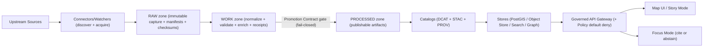

<!--
GOVERNED ARTIFACT NOTICE
This README governs KFM’s pipeline layer.

Pipelines are a trust-boundary surface: they produce “served truth.”
If you change meaning (not just phrasing), route through the governance review path
(CODEOWNERS + CI gates). If CODEOWNERS or required gates are missing, treat as a
governance gap and fail closed on promotion.

This doc is written to be both human-readable and machine-operable:
- it states invariants (“MUST / MUST NOT”)
- it names required artifacts (receipts, catalogs, checksums)
- it defines the promotion and serving boundary (processed-only)
-->

# Kansas Frontier Matrix Pipelines 📦🧬🗺️

> **What this is:** The governed **pipeline layer** that transforms upstream sources into **publishable, reproducible, auditable** KFM datasets.  
> **What this is not:** A folder of scripts. Pipelines are **production systems** with contracts, validation gates, audit trails, and policy enforcement.


> [!NOTE]
> Badges are placeholders until CI workflow names/URLs exist. Wire them to real workflows when available.

---

## Quick links

> Repo structure is **repo-dependent**. If your repo differs, keep your existing structure, but **preserve the invariants** and document the mapping here.

- Repo governance + CI gates: `.github/README.md`
- Ownership / required reviewers: `.github/CODEOWNERS`
- Policy-as-code + default deny: `policy/`
- Contracts + schemas: `contracts/` *(or `schemas/`)*
- Pipeline implementation: `pipelines/` *(or `src/pipelines/`)*
- Data lifecycle zones: `data/raw/`, `data/work/`, `data/processed/`
- Catalog outputs: `data/catalog/` *(DCAT/STAC/PROV)*
- Story Nodes + narrative docs: `docs/`

---

## Table of contents

- [Governance header](#governance-header)
- [Normative language](#normative-language)
- [Non-negotiables](#non-negotiables)
- [Mental model: the Truth Path](#mental-model-the-truth-path)
- [Layer boundaries and the trust membrane](#layer-boundaries-and-the-trust-membrane)
- [What lives in the pipeline layer](#what-lives-in-the-pipeline-layer)
- [Recommended directory layout](#recommended-directory-layout)
- [Data lifecycle zones](#data-lifecycle-zones)
- [Pipeline primitives](#pipeline-primitives)
- [Required outputs: receipts, checksums, catalogs](#required-outputs-receipts-checksums-catalogs)
- [Deterministic identity: spec_hash + content digests](#deterministic-identity-spec_hash--content-digests)
- [Connector contract](#connector-contract)
- [Validation gates](#validation-gates)
- [Promotion to processed](#promotion-to-processed)
- [Catalog + provenance emission](#catalog--provenance-emission)
- [Downstream refresh triggers](#downstream-refresh-triggers)
- [Policy + sensitivity: redaction-first](#policy--sensitivity-redaction-first)
- [Orchestration, scheduling, and backfills](#orchestration-scheduling-and-backfills)
- [CI gates: merge-blocking and promotion-blocking](#ci-gates-merge-blocking-and-promotion-blocking)
- [Local development](#local-development)
- [Operations runbook](#operations-runbook)
- [PR checklist](#pr-checklist)
- [Glossary](#glossary)
- [Sources and provenance for this README](#sources-and-provenance-for-this-readme)

---

## Governance header

| Field | Value |
|---|---|
| Document | `pipelines/README.md` *(or `src/pipelines/README.md`)* |
| Status | **Governed** (changes require review) |
| Scope | Ingestion → normalization → validation → promotion → catalogs/provenance → refresh triggers |
| Version | `v3.0.0-draft` |
| Effective date | 2026-02-16 |
| Owners | `.github/CODEOWNERS` *(required)* |
| Review triggers | Any change touching: contracts/schemas, promotion rules, receipts, catalog emission, sensitivity/redaction |

> [!WARNING]
> **Fail-closed rule:** if a required enforcement surface is missing (policy, receipts, catalogs, validators, checksums), then promotion and/or serving MUST deny by default.

---

## Normative language

This README uses RFC-style keywords:

- **MUST / MUST NOT**: required invariants. Violations break KFM governance.
- **SHOULD / SHOULD NOT**: strong recommendations; deviations must be justified and documented.
- **MAY**: optional behaviors.

---

## Non-negotiables

These are **build invariants**. Treat them as constitutional.

1) **Processed is the only publishable source of truth**  
   - **MUST** only serve datasets from `data/processed/` (and its catalogs).  
   - **MUST NOT** serve `data/raw/` or `data/work/` directly to end users, Focus Mode, or Story Nodes.

2) **Promotion is contract-governed and fail-closed**  
   - Promotion **MUST** deny unless required proofs exist and validate: receipts + checksums + catalogs + policy classification.  
   - “Close enough” is not acceptable. If a proof is missing, promotion is **not allowed**.

3) **Every run emits governed receipts**  
   - **MUST** emit: `run_record.json`, `validation_report.json`, `run_manifest.json` (Promotion Contract receipt).  
   - Receipts are not logs; they are **auditable artifacts**.

4) **Deterministic spec identity is required (`spec_hash`)**  
   - **MUST** compute `spec_hash = sha256(JCS(spec))`, where JCS is RFC 8785 JSON Canonicalization Scheme.  
   - **MUST** include `spec_hash` in receipts and tie it to inputs/outputs.

5) **Trust membrane rules apply end-to-end**  
   - UI and external clients **MUST NOT** access databases or object stores directly.  
   - All access goes through the governed API + policy boundary.  
   - Pipelines **MUST NOT** bypass repository interfaces / governance boundaries in code (clean layers).

6) **Evidence resolution must be possible**  
   - Every user-visible claim **MUST** trace to resolvable evidence objects.  
   - If evidence cannot resolve, the system must **abstain** or **deny**.

> [!IMPORTANT]
> Pipeline design must enable Focus Mode to **cite or abstain**. That only works when datasets have complete catalogs + provenance and stable evidence references.

---

## Mental model: the Truth Path

The Truth Path is the required pipeline worldview.



---

## Layer boundaries and the trust membrane

KFM uses clean layers (domain → use-cases/services → interfaces/adapters → infrastructure). The pipeline layer is an **infrastructure + integration** surface, but it must still respect boundaries.

### Trust membrane rule (non-negotiable)

- The browser/UI **never** talks to PostGIS, Neo4j, OpenSearch, object storage, or raw files directly.  
- Everything flows through governed API endpoints where policy is evaluated.  
- Pipelines produce artifacts; APIs decide what is served.

> [!CAUTION]
> Any “shortcut” that lets a client read data directly from storage is a governance bypass and must be treated as a security defect.

---

## What lives in the pipeline layer

Pipelines are responsible for:

- **Discovery + acquisition** (watchers/connectors)
- **Raw capture** (immutable snapshots + manifests + input digests)
- **Normalization** (canonical geometry/time/encoding; stable schema mapping)
- **Validation** (schema + geo + time + license + policy prerequisites)
- **Enrichment** (join keys, place/time normalization, entity-candidate generation)
- **Receipts** (run record + validation report + run manifest)
- **Catalog outputs** (DCAT always; STAC/PROV as applicable)
- **Promotion** (raw/work → processed, gated by contract)
- **Refresh triggers** (search/vector/graph refresh derived from catalogs—not ad hoc)
- **Backfills** (documented reprocessing of history with throttles and restart safety)
- **Determinism + reproducibility** (spec_hash + digests + pinned runtime identity)

---

## Recommended directory layout

> [!NOTE]
> This is a recommended governance-aligned structure. If your repo differs, create a mapping section (below) rather than forcing a churn rename.

```text
pipelines/ or src/pipelines/
├─ README.md
│
├─ registry/                        # declarative dataset/source registries (CODEOWNED)
│  ├─ datasets.yml                  # dataset_id → source(s), cadence, policy labels
│  ├─ sources.yml                   # upstream capabilities + formats + limits
│  └─ schedules.yml                 # orchestration defaults + materiality thresholds
│
├─ specs/                           # governed specs used to run (spec_hash computed)
│  ├─ ingest/
│  ├─ promote/
│  └─ backfill/
│
├─ connectors/                      # one connector per upstream source
│  └─ <source_slug>/
│     ├─ connector.<py|ts>          # discover + acquire implementation
│     ├─ mapping.yml                # source → canonical schema mapping
│     ├─ contract.json              # connector capabilities + cursor strategy
│     ├─ fixtures/                  # synthetic or generalized test slices
│     └─ tests/
│
├─ transforms/                      # deterministic transforms
│  ├─ normalize/
│  ├─ enrich/
│  └─ export/
│
├─ validation/                      # deterministic validators
│  ├─ schema/
│  ├─ geo/
│  ├─ time/
│  ├─ license/
│  ├─ policy/
│  └─ checksums/
│
├─ catalogs/                        # catalog writers (publishable metadata products)
│  ├─ dcat/
│  ├─ stac/
│  └─ prov/
│
├─ promotion/                       # promotion logic (fail-closed)
│  ├─ gate/                         # Promotion Contract evaluation
│  ├─ materialize/                  # filesystem/object-store writes
│  └─ publish/                      # publish catalogs + trigger refresh
│
├─ receipts/                        # receipt builders + schema adapters
│  ├─ run_record.<py|ts>
│  ├─ validation_report.<py|ts>
│  └─ run_manifest.<py|ts>
│
├─ orchestration/                   # adapters (CI, cron, k8s Jobs, etc.)
│  ├─ local/
│  └─ ci/
│
└─ tests/
   ├─ unit/
   ├─ integration/
   ├─ contract/
   └─ regression/
```

### Layout invariants

- Specs used for runs **MUST** be stable and produce reproducible `spec_hash`.
- Promotion **MUST** be an explicit controlled step (never implicit inside ingest).
- Fixtures **MUST NOT** include sensitive locations/PII; use synthetic or generalized data.

### Repo mapping section (fill this in)

| Concept | Canonical name in this README | Where it lives in *this repo* |
|---|---|---|
| Pipeline code root | `pipelines/` | `(not confirmed in repo)` |
| Contracts/schemas | `contracts/` | `(not confirmed in repo)` |
| Policies | `policy/` | `(not confirmed in repo)` |
| Data zones | `data/raw|work|processed` | `(not confirmed in repo)` |

> [!TIP]
> Keep the mapping table current. It is the easiest way to avoid “docs drift.”

---

## Data lifecycle zones

KFM datasets move through three zones.

| Zone | Purpose | Allowed operations | Absolute rules |
|---|---|---|---|
| **RAW** | Immutable capture of upstream truth | append-only writes | MUST include manifest + checksums + license/sensitivity capture |
| **WORK** | Repeatable transforms + QA staging | derive/normalize/enrich/validate | MUST include receipts + validation reports |
| **PROCESSED** | Publishable artifacts eligible for serving | publishable outputs only | MUST include checksums + catalogs + promotion audit |

> [!IMPORTANT]
> If it’s visible to end users, it must trace to **PROCESSED** and its catalogs.

---

## Pipeline primitives

Pipelines are easier to reason about when KFM objects are explicit.

| Primitive | Definition | Why it exists |
|---|---|---|
| `dataset_id` | Stable identifier for a dataset family/version stream | Registry key; controls cadence, policy, and contracts |
| `run_id` | Unique identifier for one pipeline execution | Auditability; links inputs/outputs/receipts |
| `spec` | Governed input describing what to run | Reproducibility; becomes `spec_hash` |
| `spec_hash` | Deterministic hash of canonicalized spec | Proves run intent; supports replays |
| `receipt` | Machine-readable proof bundle | Promotion gate input; audit artifact |
| `dataset_version` | The promoted unit (inputs + spec_hash + code + output digests) | The thing APIs can safely serve |

---

## Required outputs: receipts, checksums, catalogs

Pipelines must produce **machine-readable artifacts** that make the system reproducible and auditable.

### Baseline artifact matrix

| Artifact | Required | Preferred canonical location | Purpose |
|---|---:|---|---|
| Raw manifest | ✅ | `data/raw/<dataset_id>/manifest.yml` | license + source refs + sensitivity + expected inputs |
| Raw checksums | ✅ | `data/raw/<dataset_id>/checksums.sha256` | integrity of upstream capture |
| Run record | ✅ | `data/work/<dataset_id>/runs/<run_id>/run_record.json` | inputs/outputs + code identity + timing |
| Validation report | ✅ | `data/work/<dataset_id>/runs/<run_id>/validation_report.json` | schema/geo/time/license/policy checks |
| Run manifest (receipt) | ✅ | `data/work/<dataset_id>/runs/<run_id>/run_manifest.json` | Promotion Contract proof bundle |
| Processed checksums | ✅ | `data/processed/<dataset_id>/checksums.sha256` | integrity for served truth |
| DCAT record | ✅ | `data/catalog/dcat/<dataset_id>.json` | dataset discovery + license + restrictions |
| STAC collection/items | ◻︎ conditional | `data/catalog/stac/<dataset_id>/**` | spatial assets catalog (when spatial assets exist) |
| PROV bundle | ✅ | `data/catalog/prov/<dataset_id>/run_<run_id>.json` | lineage raw → work → processed |
| Promotion audit event | ✅ | `data/audit/` *(dev)* / append-only ledger *(prod)* | immutable record of publish action |

> [!NOTE]
> Naming drift exists across drafts (“run receipt/run manifest/run record”). This README standardizes:
> - `run_record.json` = run metadata  
> - `validation_report.json` = validation outputs  
> - `run_manifest.json` = Promotion Contract receipt

---

## Deterministic identity: `spec_hash` + content digests

### `spec_hash` definition

- **Required:** `spec_hash = sha256(JCS(spec))`
- **JCS:** RFC 8785 JSON Canonicalization Scheme
- **Goal:** the same semantic spec hashes the same across platforms and runs

### Required companion fields (recommended)

- `spec_schema_id` — stable identifier of the spec schema (URI or canonical ID)
- `spec_recipe_version` — semver of the pipeline “recipe” interpreting the spec
- `code_identity` — git SHA + container image digest (when containerized)

<details>
<summary><strong>Illustrative run_manifest excerpt</strong></summary>

```json
{
  "run_id": "run_2026-02-16T12:34:56Z",
  "dataset_id": "example_dataset",

  "spec_schema_id": "kfm.schema.ingest_spec.v1",
  "spec_recipe_version": "1.3.0",
  "spec_hash": "sha256:...",

  "inputs": [{"uri":"data/raw/example_dataset/source.csv","sha256":"..."}],
  "code": {"git_sha":"...","image":"kfm/pipeline@sha256:..."},
  "outputs": [{"uri":"data/processed/example_dataset/out.parquet","sha256":"..."}],

  "validation_report_ref": "data/work/example_dataset/runs/run_.../validation_report.json",
  "catalogs": {
    "dcat_ref": "data/catalog/dcat/example_dataset.json",
    "stac_ref": "data/catalog/stac/example_dataset/collection.json",
    "prov_ref": "data/catalog/prov/example_dataset/run_run_....json"
  },
  "policy": {
    "classification": "public|internal|restricted",
    "sensitivity_flags": ["sensitive_location","culturally_sensitive","pii_risk"]
  }
}
```
</details>

---

## Connector contract

Connectors are KFM’s “hands” on upstream sources.

### Connector lifecycle

1) **Discover**: resolve endpoints/parameters/auth; cache capabilities  
2) **Acquire**: incremental slices (preferred) or snapshot+diff  
3) **Normalize**: encoding (UTF‑8), geometry (WGS84), time (ISO 8601)  
4) **Validate**: schema + geo + time + license + policy prerequisites  
5) **Enrich**: join keys, place/time normalization, entity candidates  
6) **Emit receipts + catalogs**: run record + validation report + run manifest; DCAT/STAC/PROV  
7) **Publish**: only via promotion job enforcing the Promotion Contract

### Minimum connector config keys

| Key | Rule |
|---|---|
| `dataset_id` | stable ID (prefer `snake_case`) |
| `schedule` | cadence (daily/weekly/monthly/on-demand) |
| `incremental_cursor` | prefer `modified_date`/`event_date`; else snapshot+diff |
| `auth` | secrets only via secret manager; never committed |
| `rate_limit` | bounded retries; exponential backoff; honor upstream rules |
| `format_targets` | canonical outputs (Parquet/GeoParquet/GeoJSON/COG as applicable) |
| `policy` | classification + sensitivity flags + redistribution constraints |
| `lineage` | upstream identifiers + stable `source_record_id` mapping |

### Identity mapping rules (minimum)

- Persist `dataset_id` + upstream identifiers.
- `source_record_id` MUST be stable per upstream semantics.
- A `dataset_version` is defined by inputs + spec_hash + code identity + output digests (receipt-driven).

---

## Validation gates

Validation is the difference between “we ran a job” and “we can serve truth.”

### Minimum automated gates (MUST)

- **Schema**: required fields, coercion rules, types
- **Geo** (if spatial): geometry validity + bounds + CRS checks
- **Time**: temporal sanity checks (range, ordering, timezone normalization)
- **License/attribution**: required for DCAT
- **Policy prerequisites**: classification present; required redactions/generalization performed
- **Checksums**: compute + verify for inputs and outputs
- **Provenance completeness**: PROV links raw inputs → processed outputs

### Recommended quality gates (SHOULD)

- Profile summaries: row counts, null rates, uniqueness, distribution snapshots
- Drift checks against prior processed version
- Duplicate detection / key strategy checks
- Join-key health (unmatched rates, referential stability)
- Redaction/generalization audits when sensitivity flags exist

### Test plan expectations (CI-ready)

- **Unit tests:** mapping/coercion, cursor logic, validators
- **Integration tests:** deterministic tiny-slice run; stable outputs + digests
- **Contract tests:** receipts/catalog schemas validate; cross-links resolve
- **Regression tests:** drift/leakage regressions stay denied forever

---

## Promotion to processed

Promotion is a **separate controlled job**. It is the moment data becomes publishable.

### Promotion steps (minimum)

1) **Evaluate kill switch**  
   - If `KFM_GOVERNANCE_KILL_SWITCH=true` → deny promotion

2) **Validate receipt bundle**  
   - run record exists  
   - validation report exists  
   - run manifest validates against Promotion Contract schema

3) **Materialize processed outputs**  
   - write to `data/processed/<dataset_id>/...` (or governed object store path)

4) **Compute processed checksums**  
   - produce `checksums.sha256` for every served artifact

5) **Generate + validate catalogs**  
   - DCAT: required  
   - STAC: required when spatial assets exist  
   - PROV: required

6) **Append promotion audit event**  
   - append-only event containing `run_id`, digests, and approvals (when needed)

7) **Trigger downstream refresh**  
   - refresh driven from catalogs/receipts, idempotent and traceable

> [!WARNING]
> Promotion fails if any required proof is missing or invalid. **Fail closed.**

---

## Catalog + provenance emission

Catalogs are **served products**. They are not optional documentation.

### Cross-linking rules (minimum)

- **DCAT** MUST include:
  - license + attribution + restrictions
  - temporal/spatial coverage (if applicable)
  - dataset version identifiers (receipt-driven)
  - links to distributions (processed artifacts) + checksums/digests
  - links to STAC (when applicable) and PROV run bundles

- **STAC** MUST:
  - describe spatial assets (COG, vector, tiles) with stable href conventions
  - include versioning/lineage references where feasible (implementation-defined)

- **PROV** MUST:
  - connect raw inputs → work transforms → processed outputs
  - include activity metadata (run_id, toolchain, code identity)
  - record agents (pipeline identity/service account) where appropriate

### Evidence resolution goal

Every dataset SHOULD support stable evidence references:

- `dcat://dataset/<dataset_id>`
- `stac://collection/<dataset_id>`
- `prov://run/<run_id>`

> [!NOTE]
> Exact URI schemes are implementation-defined, but the UI must be able to resolve them consistently.

---

## Downstream refresh triggers

Pipelines may trigger refreshes for:

- full-text search index
- vector/embedding index
- knowledge graph extraction
- tile caches

### Non-negotiable rule

Refresh triggers MUST be driven by canonical catalogs/receipts, not by ad-hoc file paths.

Recommended pattern:

- promotion writes/updates catalogs
- refresh job reads catalogs and updates indexes idempotently
- refresh results are captured in receipts (recommended)

---

## Policy + sensitivity: redaction-first

Sensitivity classification is a first-class input and a publish gate.

### Minimum policy behavior (MUST)

- Fail closed when classification is missing/unknown.
- For `sensitive_location`, prefer publish-safe generalizations for public audiences (and/or deny precise geometry).
- For restricted fields, publish redacted derivatives and/or enforce field-level policy at API boundary (**prefer both**).

### Human review gate (MUST when flagged)

If sensitivity flags are present (e.g., `sensitive_location`, `culturally_sensitive`, `pii_risk`):

- require governance review before promotion
- record approval reference in receipt/audit metadata (implementation-defined)

> [!CAUTION]
> Never include sensitive coordinates or restricted fields in fixtures, logs, screenshots, or PR text.

---

## Orchestration, scheduling, and backfills

### Orchestration expectations

- Jobs MUST be idempotent (safe to re-run).
- Retries MUST be bounded; backoff respects upstream limits.
- Each stage MUST be observable (discover/acquire/normalize/validate/enrich/promote).

### Backfills (required for dataset integrations)

Each dataset connector SHOULD include a backfill spec + runbook:

- historical range coverage
- chunking strategy
- throttling/rate-limit strategy
- safe restart strategy
- stop-the-bleed mechanism (disable quickly)

> [!CHECKLIST]
> Backfill strategy documented is part of Definition-of-Done for a dataset integration.

---

## CI gates: merge-blocking and promotion-blocking

These checks MUST block merge and/or promotion.

### Required CI hardening set

- **Contracts:** validate Promotion Contract + receipt schemas + catalog minimums
- **Catalogs:** STAC/DCAT/PROV validation + link-checks
- **Receipts:** checksum verification + spec_hash reproducibility checks
- **Policy:** OPA tests + Conftest regression suite (default deny + promotion guard)
- **Docs (when touched):** Story Node validator + citation resolution
- **Build:** container build + smoke tests (when applicable)
- **Supply chain:** SBOM + provenance attestation + signature verification (where configured)

### Security CI expectations (supply chain)

- Protect main branches with required reviews and required status checks.
- Require signed commits/tags where feasible.
- Enable secret scanning and pre-commit secret detection.
- Pin third-party GitHub Actions to commit SHAs and minimize workflow token permissions.

> [!TIP]
> Treat workflow changes as “pipeline code changes” (they can exfiltrate secrets or bypass gates).

---

## Local development

Local dev is expected to run with Docker Compose (service names may vary).

### Quickstart

```bash
cp .env.example .env
docker compose up --build
```

Typical defaults (repo-dependent):

- UI: `http://localhost:3000`
- API docs: `http://localhost:8000/docs`

### Suggested CLI entrypoints (recommended shape)

> [!NOTE]
> If your repo lacks a CLI, this is the recommended contract to implement.

```bash
# Ingest a dataset from an ingest spec
docker compose exec api python -m pipelines.ingest \
  --dataset example_dataset \
  --spec pipelines/specs/ingest/example_dataset.json

# Promote a specific run (controlled publish)
docker compose exec api python -m pipelines.promote \
  --dataset example_dataset \
  --run-id run_2026-02-16T12:34:56Z
```

---

## Operations runbook

### Observability (minimum signals)

- `run_id`, `dataset_id`, `spec_hash`, code identity (git SHA + image digest)
- input/output digests + row/feature counts
- validation summary (pass/fail + key metrics)
- promotion audit reference
- freshness signals (last success + expected cadence)
- drift metrics (null rates, distributions, geometry error rates)

### Common incident patterns

- **Data leak risk:** disable promotion; withdraw affected versions; publish redacted derivatives; add regression tests.
- **Corrupted processed artifacts:** verify checksums; roll back version; rebuild indexes from catalogs.
- **Upstream schema change:** fail closed; update mapping + validators; document migration; rerun backfill slice.

### Emergency controls

- Maintain a kill switch that denies publish/promote surfaces without redeploying code (e.g., `KFM_GOVERNANCE_KILL_SWITCH`).

---

## PR checklist

Before merging pipeline changes:

- [ ] Non-negotiables preserved (processed-only serving, fail-closed promotion)
- [ ] Receipts emitted and schema-valid (run record + validation report + run manifest)
- [ ] `spec_hash` semantics preserved (RFC 8785 JCS + SHA-256)
- [ ] Checksums computed and verified
- [ ] DCAT validates (required); STAC validates when applicable; PROV validates (required)
- [ ] Sensitivity classification present; redaction/generalization implemented where required
- [ ] Policy tests pass (default deny; promotion guard)
- [ ] Backfill strategy updated if ranges/cadence changed
- [ ] Drift/regression tests added/updated where risk exists
- [ ] Observability fields/metrics/logs updated as needed

### Dataset integration “Definition of Done”

- [ ] Connector implemented + registered in `registry/`
- [ ] Raw acquisition produces deterministic manifest + checksums
- [ ] Normalization emits canonical schema and/or STAC assets
- [ ] Validation gates implemented and enforced
- [ ] Policy labels defined; redaction/generalization implemented where required
- [ ] Receipts emitted (run record + validation report + run manifest)
- [ ] Catalogs emitted (DCAT always; STAC/PROV as applicable) and validate
- [ ] Promotion gate enforced and audited
- [ ] Downstream refresh strategy defined (search/graph/vector as applicable)
- [ ] Backfill spec/runbook provided

---

## Glossary

- **Processed-only truth**: only `data/processed/` may be served or cited as KFM truth.
- **Promotion Contract**: the schema + policy requirements that gate publishability.
- **Receipt**: machine-readable proof that a run occurred with validated inputs/outputs and governance compliance.
- **Catalog**: machine-readable metadata product (DCAT/STAC/PROV) that drives discovery and evidence resolution.
- **Fail-closed**: deny when unsure; missing enforcement surfaces must never become “implicit allow.”
- **Trust membrane**: enforced boundary where all data access is mediated by governed APIs + policy checks.

---

## Sources and provenance for this README

This README is derived and expanded from KFM governed architecture and integration materials and aligned security/documentation guidance:

- KFM Next-Generation Blueprint & Primary Guide (draft, 2026-02-12). :contentReference[oaicite:0]{index=0}  
- KFM Comprehensive Data Source Integration Blueprint (v1.0, 2026-02-12). :contentReference[oaicite:1]{index=1}  
- Kansas Frontier Matrix Project Blueprint (governance-first system framing). :contentReference[oaicite:2]{index=2}  
- Kansas Frontier Matrix Companion Blueprint (implementation patterns + enforcement loop). :contentReference[oaicite:3]{index=3}  
- KFM Cultivated Integration Ideas (thin-slice modules: catalogs, validation, provenance, sensitivity). :contentReference[oaicite:4]{index=4}  
- Massive Gap-Filling Diagnosis (contract vs enforcement gap framing). :contentReference[oaicite:5]{index=5}  
- Software Security Guide for Developers (2026 Edition) – Expanded Sections (GitHub/CI supply-chain controls). :contentReference[oaicite:6]{index=6}  
- Professional Markdown Guide (formatting and maintainability practices). :contentReference[oaicite:7]{index=7}  
- KFM Data Sources inventory (dataset integration targets and licensing constraints). :contentReference[oaicite:8]{index=8}  
- Focus Mode and Story Mode design references (cite-or-abstain and evidence UX requirements). :contentReference[oaicite:9]{index=9} :contentReference[oaicite:10]{index=10}  
- Master corpus consolidation spec (schemas + governance-made-physical approach). :contentReference[oaicite:11]{index=11}  

---
