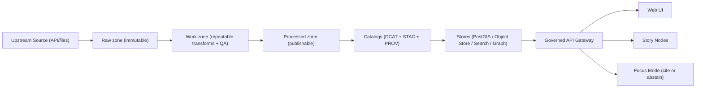

# KFM Pipelines 📦🧬🗺️

> **Scope:** This README governs the **pipeline layer** (ingestion, normalization, validation, promotion, catalog/provenance emission, and downstream index refresh triggers).
>
> **Applies to:** `pipelines/` (or `src/pipelines/` depending on repo layout).
>
> **Design intent:** KFM pipelines are **not “scripts”**. They are **governed production systems** that create *publishable, reproducible, auditable* datasets.

---

## Badges (wire these to real workflows)


> [!NOTE]
> Replace the placeholders above with real GitHub Actions / CI badges once workflow names exist.

---

## Table of contents

- [Non-negotiables](#non-negotiables)
- [What lives here](#what-lives-here)
- [Truth path](#truth-path)
- [Data zones and promotion gates](#data-zones-and-promotion-gates)
- [Artifact contracts (required outputs)](#artifact-contracts-required-outputs)
- [Connector contract](#connector-contract)
- [Validation gates](#validation-gates)
- [Promotion to processed](#promotion-to-processed)
- [Policy + sensitivity (redaction-first)](#policy--sensitivity-redaction-first)
- [Orchestration, scheduling, and backfills](#orchestration-scheduling-and-backfills)
- [CI/CD gates (must pass)](#cicd-gates-must-pass)
- [Local development (Docker Compose)](#local-development-docker-compose)
- [Operations runbook (pipelines)](#operations-runbook-pipelines)
- [PR checklist](#pr-checklist)
- [Sources and provenance for this README](#sources-and-provenance-for-this-readme)

---

## Non-negotiables

These are **build invariants**. If you violate them, you are not “moving fast”—you are breaking KFM.

1) **Processed is the only publishable source of truth.**  
   - Raw/work are **never served** directly to users.

2) **Every pipeline run emits:**
   - a **run record** (JSON) and
   - a **validation report** (JSON).  
   Promotion is **blocked** unless both exist and are complete.

3) **Promotion gate checklist (minimum):**
   - License present
   - Sensitivity classification present
   - Schema + geospatial checks pass
   - Checksums computed
   - STAC/DCAT/PROV artifacts exist **and validate**
   - Audit event recorded
   - Human approval if sensitive

4) **Trust membrane rules apply end-to-end:**
   - Frontend/external clients never access databases directly
   - Policy evaluation on every data/story/AI request
   - Audit + provenance are part of the normal request path

5) **Evidence resolution is mandatory:**
   - Every provenance/citation reference must be resolvable via an evidence endpoint (e.g., `prov://`, `stac://`, `dcat://`, `doc://`, `graph://`).

> [!IMPORTANT]
> Pipelines must be designed so **Focus Mode can cite or abstain**—which is only possible when datasets have complete catalogs + provenance.

---

## What lives here

Pipeline code is responsible for:

- **Connectors** (acquire from upstream APIs/files)
- **Normalization** (canonical encoding/geometry/time)
- **Validation** (schema + geometry + time + license/policy)
- **Enrichment** (join keys, place/time normalization, entity-resolution candidates)
- **Publication** (promotion to processed + catalog/prov emission + index refresh triggers)
- **Backfills** (documented strategy for historical ranges)
- **Deterministic versioning** (content-hash versioning via raw manifest/manifests)
- **Governed outputs** (run records, validation reports, checksums, STAC/DCAT/PROV)

### Recommended (not repo-confirmed) directory layout

> [!NOTE]
> This is a **recommended** structure aligned with the “ETL jobs live in pipelines” repository mapping. If your repo already has a different structure, **keep your existing structure** but preserve the invariants above.

```text
pipelines/
├─ README.md                          # this file
├─ registry/                          # dataset/source registry (governed configs)
│  ├─ datasets.yaml                   # dataset_id → connector + schedule + policy_label
│  └─ sources/                        # per-source configs and capability metadata
├─ connectors/
│  └─ <source_slug>/
│     ├─ connector.(py|ts|go)         # implements acquire/discover and paging
│     ├─ mapping.yml                  # source fields → canonical schema mapping
│     ├─ fixtures/                    # small frozen slices for integration tests
│     └─ tests/
├─ transforms/
├─ validators/
├─ catalogs/
│  ├─ dcat/
│  ├─ stac/
│  └─ prov/
├─ orchestration/
│  ├─ schedules/                      # cron / workflow schedules
│  └─ backfills/                      # backfill specs and runbooks
└─ scripts/
```

---

## Truth path

KFM’s “truth path” is a required mental model for every pipeline change.



---

## Data zones and promotion gates

Every dataset flows through three zones. **Promotion is only allowed** when machine-checkable catalogs and validations succeed.

### Zones

| Zone | Purpose | Allowed operations | Must exist before promotion |
|------|---------|--------------------|-----------------------------|
| **Raw** | Immutable capture of source-of-truth | Append-only writes; no transforms | Checksums + raw manifest; source license captured |
| **Work** | Repeatable transforms + QA staging | Derivation, normalization, enrichment | PROV activity; intermediate QA reports |
| **Processed** | Query-ready artifacts exposed via API | Publishable outputs only | Checksums + catalogs (DCAT always; STAC/PROV as applicable) + audit event |

> [!IMPORTANT]
> “Processed” is the **only** publishable zone. If a feature is visible to users, it must trace back to **processed**.

---

## Artifact contracts (required outputs)

Pipelines are required to produce **machine-readable artifacts** that make the system reproducible and auditable.

### 1) Raw manifest (`data/raw/<dataset_id>/manifest.yml`) — illustrative

```yaml
dataset_id: example_dataset
source:
  type: http
  uri: "https://example.org/source.csv"
license: "CC-BY-4.0"
expected_files:
  - name: source.csv
    sha256: "..."
sensitivity_level: "public"
```

### 2) Run record (`run_record.json`) — illustrative (required)

```json
{
  "run_id": "run_...",
  "dataset_id": "example_dataset",
  "inputs": [{"uri": "data/raw/example.csv", "sha256": "..."}],
  "code": {"git_sha": "...", "image": "kfm/pipeline:..."},
  "outputs": [{"uri": "data/processed/example.parquet", "sha256": "..."}],
  "validation_report": "data/work/example_dataset/validation_report.json",
  "prov_ref": "data/catalog/prov/example_dataset/run_....json"
}
```

### 3) Validation report (`validation_report.json`) — required

**Minimum expectations:**
- schema validation results
- geometry validity + bounds results (if spatial)
- temporal sanity results
- license present + policy label present
- sensitivity classification present
- summary stats/profile (row counts, null rates, key uniqueness) for regression tracking

> [!TIP]
> Keep the validation report stable and versioned—it becomes your regression baseline.

### 4) Checksums (`checksums.txt`) — required for processed artifacts

- A deterministic checksum list for every publishable artifact.
- Promotion must compute and verify checksums before serving through the API.

### 5) DCAT (dataset catalog) — required

- Every promoted dataset version must have a DCAT record capturing:
  - license + attribution
  - access restrictions
  - temporal/spatial coverage
  - dataset_id + version identifier

### 6) STAC (geospatial asset catalog) — required when assets are spatial

- Spatial assets (rasters/vectors) should register in a STAC collection.
- Include collection + items (per asset) and link STAC to DCAT dataset identity.

### 7) PROV (lineage) — required

- Every promoted artifact must have a PROV chain linking raw inputs → work transforms → processed outputs.
- Treat provenance as queryable, first-class data (not “logs”).

---

## Connector contract

Connectors must support the ingestion workflow:

1) **Discover**: resolve endpoints/parameters/auth; cache capability metadata  
2) **Acquire**: fetch incremental slices when possible; otherwise snapshot+diff  
3) **Normalize**: canonical encodings (UTF‑8), geometry (WGS84), time (ISO 8601)  
4) **Validate**: schema + geometry + timestamp sanity + license/policy checks  
5) **Enrich**: derive join keys (GeoIDs), place/time normalization, entity resolution candidates  
6) **Publish**: promote to processed, update catalogs (DCAT/STAC/PROV), trigger index refresh (search/graph)

### Connector config keys (minimum)

| Key | Rule |
|-----|------|
| `schedule` | cadence (near real-time / daily / annual / etc.) |
| `incremental_cursor` | `modified_date`/`eventDate`/`publicationDate` when possible; else snapshot+diff |
| `auth` | none unless required; **secrets stored in vault and never committed** |
| `rate_limit` | respect provider limits; exponential backoff; cache common queries |
| `format_targets` | JSON/CSV for tabular; GeoJSON/Parquet for vectors; COG for rasters; PDF/JPEG/PNG for artifacts |
| `policy_label` | `public` \| `restricted` \| `sensitive-location` (per source and sometimes per record) |

### Identity mapping rules (minimum)

- Persist `dataset_id` + upstream identifier; dataset **version** is a content-hash of the raw manifest (deterministic).
- `source_record_id` must be stable per upstream semantics (used in evidence citations).

---

## Validation gates

**Minimum validation gates (must be automated + CI-enforced):**

- Row-level schema validation (required fields, coercion rules documented)
- Geometry validity + bounds (no self-intersections; expected extent when applicable)
- Temporal consistency (no future dates for historic archives; no negative durations)
- License + attribution captured in DCAT; restrictions encoded in policy
- Provenance completeness: every promoted artifact has a PROV chain + deterministic checksum

### Test plan (CI-ready)

- **Unit:** schema mapping/type coercion; geometry validity helpers; incremental window logic
- **Integration:** connector runs against a fixed small slice; asserts stable checksums + counts
- **Contract:** API response includes provenance bundle and respects policy redaction
- **Regression:** dataset profiling metrics stable or explainably versioned

---

## Promotion to processed

Promotion is a **separate job** from ingestion. It is the controlled act of making data publishable.

### Promotion steps (minimum)

1) Confirm run record + validation report exist
2) Copy/create processed artifacts
3) Compute checksums (`checksums.txt`)
4) Generate + validate catalogs:
   - DCAT (required)
   - STAC (if spatial assets)
   - PROV (required)
5) Write audit event to ledger referencing `run_id`
6) Trigger downstream refresh (search/graph indices) *from canonical catalogs*

> [!IMPORTANT]
> Promotion fails if any catalog is invalid.

---

## Policy + sensitivity (redaction-first)

Pipelines must treat sensitivity classification as a **first-class field** and support redaction/generalization as a transformation.

### Minimum policy behavior

- **Fail closed** when policy label or sensitivity is missing/unknown.
- For `sensitive-location`, return generalized geometry at query time (and/or store a generalized derivative).

### Human review gate

If a dataset triggers sensitive flags, route it to governance review (do not publish by default).

---

## Orchestration, scheduling, and backfills

### Orchestration expectations

- Jobs must be **idempotent** (safe to re-run).
- Retries must be bounded; backoff must respect upstream rate limits.
- Keep “discover/acquire/normalize/validate/enrich/publish” stages observable and measurable.

### Backfills

Every dataset connector must include:

- historical range coverage
- expected runtime and resource profile
- safe restart strategy
- a “stop-the-bleed” mechanism (ability to disable quickly)

> [!CHECKLIST]
> **Backfill strategy documented** is part of Definition-of-Done for a dataset integration.

---

## CI/CD gates (must pass)

These checks must block merge/promotion:

### CI hardening (minimum set)

- **Docs:** lint + link-check + template validator
- **Stories:** v3 validator + citation resolution
- **Data:** STAC/DCAT/PROV validation + checksums
- **Policy:** `opa test` policy suite (default deny)
- **Supply chain:** SBOM (SPDX) + provenance attestation (SLSA/in-toto style)

### Dataset integration Definition of Done (DoD)

A dataset integration ticket is complete only when:

- [ ] Connector implemented + registered in data-source registry config
- [ ] Raw acquisition produces deterministic manifest + checksums
- [ ] Normalization emits canonical schema and/or STAC assets
- [ ] Validation gates implemented and enforced in CI
- [ ] Policy labels defined; restricted fields/locations are redacted per rules
- [ ] Catalogs emitted (DCAT always; STAC/PROV as applicable) and link-check clean
- [ ] API contract tests pass for at least one representative query
- [ ] Backfill strategy documented (historical ranges + expected runtime)

---

## Local development (Docker Compose)

Local development is expected to run via Docker Compose.

### Quickstart

```bash
cp .env.example .env
docker compose up --build
```

Expected (documented) defaults:
- UI: `http://localhost:3000`
- API docs: `http://localhost:8000/docs`

### Compose baseline (reference)

A baseline stack includes:
- `api`
- `web`
- `postgis`
- `neo4j`
- `opensearch`
- `opa`

> [!NOTE]
> Pipeline workers may run as separate containers/jobs, or as one-shot runs inside the API container, depending on repo implementation.

### Recommended local execution pattern (not repo-confirmed)

> [!WARNING]
> The exact CLI/entrypoint must match your repo. If you don’t have one yet, this is the recommended shape.

```bash
# example: run an ingest for a dataset_id (containerized)
docker compose run --rm api \
  python -m pipelines.ingest --dataset example_dataset

# example: promote to processed (separate controlled step)
docker compose run --rm api \
  python -m pipelines.promote --dataset example_dataset
```

---

## Operations runbook (pipelines)

### Start/stop and health checks

- Start order: deploy **web/api/opa first**, then **stores**, then **pipeline workers**.
- Minimum smoke tests:
  - load home map
  - toggle a layer
  - open provenance panel
  - run one Focus Mode query

### Backup and restore (pipeline-critical)

- PostGIS backups daily; periodic restore verification.
- Object store versioning on; immutable retention for catalogs and audit checkpoints.
- Graph (Neo4j) is rebuildable from canonical catalogs; align backups to rebuild strategy.
- Audit ledger checkpoints must verify hash chain after restore.

### Incident response (pipeline-related)

- **Data leak:** deny via policy toggle; rotate credentials; withdraw affected artifacts; publish redacted derivative.
- **AI unsafe output:** disable `/ai/query` via policy; preserve audit logs; fix policy/validator/prompt; add regression test.
- **Corrupted processed artifacts:** verify checksums; rollback dataset version; rebuild indexes.

> [!IMPORTANT]
> Maintain an emergency policy switch that can disable public endpoints and Focus Mode without deploying code.

---

## Optional: Production orchestration (Kubernetes/OpenShift + GitOps)

> [!NOTE]
> This section describes recommended patterns for running pipelines and promoting data in a GitOps-aligned way.

### Why GitOps fits pipeline promotion

GitOps uses a reconciliation loop to continuously apply desired state from Git. This can be adapted to **data promotion** by treating “which dataset versions are in prod” as a declarative manifest.

### Suggested (not required) pattern

- CI builds pipeline images and runs validations.
- Promotion happens by updating a “desired dataset versions” manifest in Git (via PR).
- A GitOps controller (Argo CD / Flux / OpenShift GitOps) reconciles that manifest into:
  - promoted dataset artifacts in object storage / databases
  - updated catalog indexes
  - deployed pipeline worker schedules

### Secrets in GitOps

Do **not** store secrets in plaintext in Git. Use encrypted secrets or external secret stores and store only references.

---

## PR checklist

Before merging any pipeline PR:

- [ ] No changes violate the **trust membrane** (no UI direct DB access; policy enforced centrally)
- [ ] Run records + validation reports emitted for every pipeline run
- [ ] Promotion gate enforced (license + sensitivity + schema/geo + checksums + catalogs + audit)
- [ ] STAC/DCAT/PROV validate and are link-check clean
- [ ] Policy tests pass (`opa test ...`) and default-deny behavior preserved
- [ ] Backfill strategy updated (if dataset ranges/cadence changed)
- [ ] Observability added/updated (logs, metrics, run record fields)

---

## Sources and provenance for this README

This README is derived from governed KFM design documents (internal):

- **KFM Next-Gen Blueprint & Primary Guide** (draft, 2026-02-12): truth path, zones, run records, promotion gates, CI hardening, local dev baseline, audit ledger and evidence UX requirements.
- **KFM Comprehensive Data Source Integration Blueprint** (2026-02-12): ingestion framework (discover/acquire/normalize/validate/enrich/publish), connector config rules, minimum validation gates, CI-ready test plans, integration DoD.
- Optional operations references: GitOps and OpenShift pipeline patterns (for productionization guidance).
