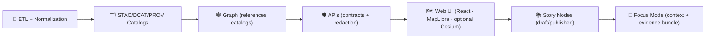

<!--
📌 This README defines the *canonical pipeline boundary* for KFM (Kansas Frontier Matrix) / Kansas‑Matrix‑System.
🗓️ Last updated: 2026-01-11
🔁 Review cycle: 90 days (or anytime pipeline order / catalogs / policy changes)
-->

<div align="center">

# 🧬 KFM Pipelines  
`pipelines/README.md`

**Deterministic ETL → governed catalogs → graph ingestion → APIs → UI → Story Nodes → Focus Mode**  
The operational spine of **Kansas Frontier Matrix (KFM)**. 🧠🗺️🧾


-1f6feb)


-7b42f6)

-ff6b6b)


</div>

> **TL;DR:** `pipelines/` is the **portal + contract** for how KFM builds evidence.  
> The **executable pipeline code** lives in `src/pipelines/`.  
> The **publishable artifacts** live in `data/processed/**` and are not “real” until they’re **cataloged (STAC/DCAT)** and **traceable (PROV)**.

> [!IMPORTANT]
> **Prime directive:** **No catalog → no graph → no API → no UI.**  
> Catalogs are the interface. Provenance is the receipt. 🧾✅

---

## 🔗 Quick links (start here) 🧭
- 🏠 Repo overview: `../README.md`
- 🧩 Executable boundary: `../src/README.md` *(if present)*
- 📦 Data + metadata boundary: `../data/README.md` *(required reading)*
- 🧪 Tests & QA gates: `../tests/README.md`
- 🧰 Governed toolchain surface: `../tools/README.md`
- 🧰 Automation wrappers: `../scripts/README.md`
- 📓 MCP (runs, experiments, receipts): `../mcp/README.md` *(or `../mcp/MCP-README.md` if that’s the canonical name)*
- 📘 Master Guide (canonical intent + paths): `../docs/MASTER_GUIDE_v13.md` *(if present)*
- 🧱 Architecture & ADRs: `../docs/architecture/`
- 🧾 Governance: `../docs/governance/`
- 📐 Schemas + profiles: `../schemas/` **and** `../docs/standards/`
- 🧩 Templates: `../docs/templates/`
- 📚 Story Nodes (narrative content): `../docs/reports/story_nodes/` *(draft/published workflow)*
- 🌐 Web UI boundary: `../web/` *(React · MapLibre · optional Cesium)*

---

<details>
<summary><b>🧭 Table of contents</b></summary>

- [🧾 Doc metadata](#-doc-metadata)
- [🚦 Non‑negotiables](#-non-negotiables)
- [🧠 What a “pipeline” means in KFM](#-what-a-pipeline-means-in-kfm)
- [🧱 The canonical ordering](#-the-canonical-ordering)
- [🧩 Pipeline taxonomy](#-pipeline-taxonomy)
- [📦 Data & metadata lifecycle](#-data--metadata-lifecycle)
- [📁 Where things live](#-where-things-live)
- [📜 KFM Pipeline Definition Contract](#-kfm-pipeline-definition-contract)
- [⚙️ Running pipelines](#️-running-pipelines)
- [✅ Quality gates](#-quality-gates)
- [🧾 Receipts, telemetry, and replay](#-receipts-telemetry-and-replay)
- [🔐 Governance & sovereignty](#-governance--sovereignty)
- [🛡️ Security & hostile inputs](#️-security--hostile-inputs)
- [🔭 Performance & scaling](#-performance--scaling)
- [🌾 Example pipeline archetypes](#-example-pipeline-archetypes)
- [🧩 Adding a new pipeline](#-adding-a-new-pipeline)
- [📚 Project reference library influence map](#-project-reference-library-influence-map)
- [🧾 Metadata](#-metadata)
- [🕰️ Version history](#️-version-history)

</details>

---

## 🧾 Doc metadata

| Field | Value |
|---|---|
| Doc | `pipelines/README.md` |
| Status | Active ✅ |
| Last updated | **2026-01-11** |
| Review cycle | 90 days 🔁 |
| Audience | Contributors implementing ETL jobs, validators, catalog writers, graph exports/ingest bridges |
| Prime directive | **No catalog → no graph → no API → no UI.** Catalogs are the interface. |

---

## 🚦 Non‑negotiables

1) **Deterministic, idempotent ETL** 🧪  
   Same inputs + same config + same code ⇒ same outputs (stable IDs/hashes) and reruns do not corrupt or duplicate.

2) **Contract-first** 📜  
   Pipelines are driven by declared contracts (schemas, profiles, OpenAPI) and contract changes trigger compatibility checks.

3) **Catalogs are not optional** 🗂️  
   Data is not “real” in KFM until it has:
   - **STAC** (assets + spatial/temporal metadata)
   - **DCAT** (dataset discovery & distributions)
   - **PROV** (lineage + run identity)

4) **Evidence-first narrative** 📚  
   Story Nodes / Focus Mode must cite **cataloged evidence**. No unsourced narrative content.  
   If AI helps generate text: label it, attach provenance, and include confidence/uncertainty where applicable.

5) **API boundary rule** 🛡️  
   The UI must **never** query Neo4j/DB directly; all access goes through governed APIs (contracts + redaction).

6) **Governed ordering is sacred** 🧱  
   **ETL → STAC/DCAT/PROV → Graph → API → UI → Story Nodes → Focus Mode**

> [!TIP]
> If your pipeline can’t produce a clean paper trail (inputs → transforms → outputs → catalogs → lineage), it’s not ready to merge. ✅🧾

---

## 🧠 What a “pipeline” means in KFM

A KFM pipeline is a **replayable builder** that produces:

- 📦 **Evidence artifacts** → `data/processed/**` *(COG, GeoParquet, CSV, tiles, thumbnails, reports, model artifacts, etc.)*
- 🗂️ **Catalog artifacts** → `data/stac/**` + `data/catalog/dcat/**`
- 🧬 **Lineage artifacts** → `data/prov/**` *(W3C PROV JSON‑LD recommended)*
- 🧷 **Integrity artifacts** → manifests, checksums, inventories
- 📈 **Telemetry artifacts** → run summaries, gate outcomes, timings *(location is configurable; keep it deterministic and linkable)*

> [!IMPORTANT]
> Pipelines do **not** “secretly update the graph.”  
> The graph ingests **from catalogs** (and/or explicit graph export artifacts) via controlled paths.

---

## 🧱 The canonical ordering

> [!IMPORTANT]
> This is a governance boundary, not a preference.



---

## 🧩 Pipeline taxonomy

Not all pipelines look the same. KFM supports a few **governed shapes**:

| Type | When to use | Key rule 🔑 |
|---|---|---|
| 🧱 **Build (batch)** | One-time or periodic creation of a dataset | Must be deterministic + cataloged + prov’d before use |
| 🔁 **Refresh (scheduled)** | Regular updates (daily/weekly/monthly) | Must be idempotent; versioned outputs; diffs are inspectable |
| 👀 **Watcher (near‑real‑time)** | Polling/streaming feeds (e.g., GTFS‑RT) | Each window produces catalogable “units” + receipts; no mystery updates |
| 🔌 **Adapter (import bridge)** | Bring in external exports (partner datasets, agency drops) | Must validate schema/license/classification before promotion |
| 🧪 **Analysis/Model** | Derived indicators, regression outputs, simulation runs | Record params/seeds; treat results as evidence artifacts |
| 📄 **Document ingest** | PDFs/scans → extracted text/entities | Must store raw doc + derived text; provenance + redaction rules required |

> [!NOTE]
> Watchers are still bound by ordering: **they produce cataloged outputs first**, then (optionally) graph/API consumption follows.

---

## 📦 Data & metadata lifecycle

KFM uses a required staging lifecycle so everyone can tell “what stage is this file in?” at a glance:

### 📥 Data stages
- `data/raw/<domain>/...` → raw source drops *(read-only mindset)*
- `data/work/<domain>/...` → intermediate transforms *(ok to delete/regenerate)*
- `data/processed/<domain>/...` → final evidence artifacts *(publishable)*

### 🗂️ Catalog + provenance stages (required before downstream use)
- `data/stac/` → STAC collections/items (assets + metadata)
- `data/catalog/dcat/` → DCAT datasets/distributions (discovery)
- `data/prov/` → PROV bundles (run + dataset lineage)

> [!NOTE]
> Some older notes may say `data/provenance/`.  
> **Canonical path is `data/prov/`.** Keep new work aligned.

---

## 📁 Where things live

### 🧭 Repo context (target shape)
```text
📁 pipelines/                 # 📍 this folder (portal + conventions; not executable code)
📁 src/                       # 🧩 executable source code
│  ├── 📁 pipelines/          # 🧪 ETL jobs + catalog writers + validators
│  ├── 📁 graph/              # 🕸️ graph construction + queries (from catalogs)
│  └── 📁 server/             # 🛡️ APIs (contracts + redaction enforcement)
📁 data/                      # 📦 raw → work → processed + STAC/DCAT/PROV
📁 schemas/                   # 📐 JSON Schemas (contracts)
📁 docs/                      # 📘 governed documentation (templates, standards, governance)
📁 tools/                     # 🧰 validators, QA tools, deterministic entrypoints
📁 scripts/                   # 🧰 orchestration wrappers (call tools/src)
📁 tests/                     # ✅ automated tests (unit/integration/e2e)
📁 web/                       # 🌐 UI (React + MapLibre + optional Cesium)
📁 releases/                  # 📦 packaged releases (manifest + SBOM + attestations)
📁 .github/                   # 🤝 CI/CD, policies, automation
```

### 🧪 Pipeline code (canonical)
```text
📁 src/pipelines/
└── 📁 <domain>/
    └── 📁 <pipeline_name>/
        ├── run.py                     # entrypoint (CLI)
        ├── pipeline.yml               # 📜 pipeline contract (required / strongly recommended)
        ├── README.md                  # short notes + examples (dev-facing)
        ├── config/                    # env configs (dev/stage/prod)
        ├── schemas/                   # domain schemas (if needed)
        ├── validators/                # QA gates (schema, bounds, link checks, etc.)
        ├── tests/                     # mini-run tests + fixtures
        └── _shared/                   # optional submodules (keep DRY; prefer src/pipelines/_shared)
```

### 📘 Domain module docs (recommended)
A domain should document its pipelines + governance posture here:

```text
📁 docs/data/
└── 📁 <domain>/
    ├── README.md                      # domain overview + pipeline list + access notes
    └── 📁 pipelines/
        └── 📁 <pipeline_name>/
            └── README.md              # runbook: IO, cadence, gates, failure modes, replay rules
```

### 📚 Story Node content (governed narrative)
```text
📁 docs/reports/story_nodes/
├── 📁 draft/
└── 📁 published/
```

> [!TIP]
> If you add a new domain pipeline, add a domain module README under `docs/data/<domain>/README.md` so reviewers can find the “what/why/how” quickly. 🧭✅

---

## 📜 KFM Pipeline Definition Contract

KFM pipelines are contract-first. A pipeline should have a machine-readable contract file (recommended name: `pipeline.yml`) that explains **what it reads, what it writes, and what it guarantees**.

### ✅ Minimum contract fields (recommended)
- `id` (stable, versioned; do not encode secrets)
- `name`, `description`, `owner`
- `inputs` (sources, paths, licenses, checksums when feasible)
- `outputs` (paths + formats + dataset IDs)
- `catalogs` (STAC/DCAT targets; collections/items/datasets)
- `provenance` (how run_id/config hash is captured)
- `gates` (schema/bounds/link/license/classification checks)
- `determinism` (stable sorting, seed strategy, idempotency key)
- `network` posture (deny-by-default; allowlist & logging if enabled)
- `resources` (optional: memory/CPU hints; chunking strategy)

### 🧩 Example `pipeline.yml` (starter template)
```yaml
id: "kfm.hydrology.watersheds.v1"
name: "Hydrology Watersheds Builder"
owner: "@kfm-engineering"
description: "Derives watershed boundaries + flow products from DEM inputs and publishes map-ready layers."

envs: ["dev", "stage", "prod"]

inputs:
  - id: "kfm.elevation.dem.3dep.v1"
    stage: "raw"
    paths:
      - "data/raw/elevation/3dep/**"
    license: "public-domain-or-provider-license"
    notes: "Record exact source + version in PROV."

outputs:
  stage: "processed"
  datasets:
    - id: "kfm.hydrology.watersheds.v1"
      paths:
        - "data/processed/hydrology/watersheds/**"
      formats: ["COG", "GeoParquet", "GeoJSON (small only)"]

catalogs:
  stac_root: "data/stac"
  dcat_root: "data/catalog/dcat"
  collections:
    - "kfm.hydrology"
  items:
    strategy: "one item per logical unit (tile/county/basin)"
  dcat:
    dataset_id: "kfm.hydrology.watersheds.v1"

provenance:
  prov_root: "data/prov"
  run_id_env: "KFM_RUN_ID"
  config_hash: "sha256(pipeline.yml + config/<env>.yml)"
  record_git_sha: true
  record_seeds: true

gates:
  - "schema_required"
  - "crs_required"
  - "geometry_valid"
  - "bounds_sane"
  - "license_required"
  - "classification_no_downgrade"
  - "stac_schema"
  - "dcat_schema"
  - "prov_bundle_present"
  - "link_check"

determinism:
  stable_sorting: true
  seeded: true
  seed_source: "KFM_SEED or derived from run_id"
  idempotency_key: "(dataset_id, input_checksums, config_hash)"

network:
  default: "deny"
  allow_with_flag: "--allow-network"
  ssrf_protection: true
  log_urls_and_checksums: true
```

> [!IMPORTANT]
> The contract does not replace docs; it makes the docs **enforceable**.  
> CI can validate `pipeline.yml` shape and cross-check it against produced artifacts.

---

## ⚙️ Running pipelines

> [!NOTE]
> Prefer the repo’s **make/CI entrypoints** when available.  
> If your repo doesn’t have these targets yet, treat this section as intended ergonomics.

### ✅ Recommended: `make` entrypoints (examples)
```bash
# list pipelines (example)
make pipelines-list

# run a pipeline (example)
make pipeline RUN=hydrology/watersheds ENV=dev

# validate catalogs (example)
make catalog-qa

# graph ingest/export (example)
make graph-export
make graph-ingest
```

### 🐍 Direct execution (module style)
```bash
python -m src.pipelines.hydrology.watersheds.run --env dev --config config/dev.yml --run-id "RUN-2026-01-11-demo"
python -m src.pipelines.hazards.refresh.run --env dev --since "2026-01-01T00:00:00Z" --run-id "RUN-2026-01-11-hazards"
```

### 🧱 Expected flags (strongly recommended)
- `--help` (must include ≥2 runnable examples)
- `--env {dev|stage|prod}`
- `--config <path>`
- `--run-id <id>` (or `KFM_RUN_ID`)
- `--dry-run` default OR “no writes unless `--apply`”
- `--apply` for state mutation
- `--allow-network` for any remote fetching (deny-by-default)

### 🧱 Typical environment variables
| Variable | Purpose |
|---|---|
| `KFM_ENV` | `dev|stage|prod` |
| `KFM_RUN_ID` | provenance correlation across logs/catalogs/PROV |
| `KFM_DATA_ROOT` | data root (if not repo-relative) |
| `KFM_STAC_ROOT` | STAC output root |
| `KFM_DCAT_ROOT` | DCAT output root |
| `KFM_PROV_ROOT` | PROV output root |
| `KFM_GRAPH_EXPORT_ROOT` | graph export root (CSV/Cypher/JSON) |
| `KFM_TELEMETRY_ROOT` | telemetry output root |
| `KFM_SEED` | RNG seed for stochastic pipelines |
| `KFM_NEO4J_URI` | graph endpoint *(only for controlled ingest steps)* |

> [!TIP]
> For heavy geo deps (GDAL/PROJ), **Docker is your friend** 🐳  
> Containerize pipeline environments to reduce “works on my machine” drift.

---

## ✅ Quality gates

A pipeline is “done” only when these pass (prefer “fail closed” 🔒):

### Ring 0 — Structure 🧱
- JSON/YAML parses
- schema validation for outputs + catalogs
- required files exist (pipeline.yml, configs, outputs present)

### Ring 1 — Integrity 🧷
- checksums/manifests recorded
- deterministic IDs stable when inputs unchanged
- atomic publish (no half-written processed outputs)

### Ring 2 — Semantics 🧠
- CRS correctness + axis order
- geometry validity (and any repair policy is explicit + logged)
- raster sanity (nodata, resolution, overviews for COG)
- bounds/time sanity (Kansas extent, plausible ranges, monotonic windows where required)

### Ring 3 — Governance & safety 🔐🛡️
- license required before publish
- classification/sensitivity propagation (no downgrade)
- redaction/generalization audited
- hostile input guards (archives, rasters, PDFs, GeoJSON, etc.)
- secrets/sensitive patterns not leaked to logs

### 🧰 Catalog QA tooling (standard)
KFM uses a **Catalog QA gate** in CI/pre-release:
- expected home: `tools/validation/catalog_qa/`

> [!TIP]
> Make it easy for reviewers: `make catalog-qa` should be boring. 😌✅

---

## 🧾 Receipts, telemetry, and replay

KFM is evidence-first: pipelines should emit “receipts” that let someone reproduce the run.

### ✅ Minimum receipt set (recommended for any publish)
- 🧾 `data/prov/<RUN-ID>.jsonld` (or a bundle directory)
- 🧷 checksums manifest for produced outputs
- 🗂️ STAC + DCAT references for all published artifacts
- 🪵 structured logs (human + optional JSONL)

### ⭐ Recommended: MCP run receipt (when used for decisions or publish)
- `mcp/runs/<RUN-ID>/MANIFEST.md` (human narrative of “what happened”)
- links to the relevant catalogs + outputs + gates

> [!NOTE]
> Telemetry should help answer: **what ran, what changed, what gates passed, what was withheld/redacted, and why**.  
> Example event concept: `focus_mode_redaction_notice_shown` when sensitive data is withheld/generalized in downstream experiences.

---

## 🔐 Governance & sovereignty

KFM is FAIR + CARE + sovereignty-aware by design 🪶

### 🪪 Classification propagation (deny-by-default)
- Outputs cannot be **less restricted** than inputs unless an explicit redaction/generalization step exists and is reviewed.
- If classification cannot be determined, default to **restricted**.

### ✂️ Redaction/generalization is multi-layer
If redaction is required, it must be applied consistently:
- `data/processed/**` (redacted evidence artifact)
- STAC/DCAT metadata (flags + documentation)
- API layer (access control + redaction enforcement)
- UI layer (additional disclosure/UX checks)

### 🧾 Audit trails
- Pipelines should emit telemetry and provenance notes when redaction/generalization occurs.
- Governance reviews are required for classification/sensitivity changes.

---

## 🛡️ Security & hostile inputs

Pipelines ingest “files from the world.” Assume inputs are hostile by default. 🧯

### ✅ Required defensive posture
- validate file types & magic bytes (don’t trust extensions)
- prevent path traversal (archives/extractors)
- defend against decompression bombs (archives/images)
- sanitize subprocess args when calling GDAL/other tooling
- parameterize SQL (never string-concat untrusted values)
- **never log secrets**; never print sensitive raw content

### 🌐 Network posture
- default: **no network**
- if a pipeline fetches remote inputs:
  - require `--allow-network`
  - block private IP ranges by default (SSRF defense)
  - log URLs + checksums of downloaded artifacts

> [!CAUTION]
> If someone malicious controls this input, what’s the maximum harm?  
> If the answer includes “run code / exfiltrate / crash,” add guards **before** merging. 🚫🧨✅

---

## 🔭 Performance & scaling

KFM scales by staying **metadata-driven** and **chunk-friendly**:

- 📦 partition work (tiles, counties, watersheds, time windows)
- 🧱 pipeline breakers at materialization boundaries (COG/Parquet outputs)
- 🔁 replay safety (idempotency keys + deterministic ordering)
- ♻️ avoid reprocessing unchanged inputs (checksums + manifests)
- 🗄️ push heavy spatial ops into PostGIS when safe (joins, intersects, buffers)
- 🛰️ compute-to-data for imagery-heavy domains

> [!TIP]
> Prefer “boring performance wins”: stable chunking + caching + deterministic manifests.  
> Speed is good — **but correctness and provenance come first**. 🧾✅

---

## 🌾 Example pipeline archetypes

Match an archetype before inventing a new one 🧩

### 1) 🌊 Time-series & sensor ingestion (batch/refresh)
**Use when:** climate records, stream gauges, socio-economic time series  
**Outputs:** Parquet + temporal coverage metadata + catalog entries  
**Key gates:** schema, time window sanity, missingness checks, license, provenance.

### 2) 🛰️ Remote sensing compute-to-data ingest (batch/refresh)
**Use when:** imagery too large for local processing  
**Pattern:** compute externally (e.g., cloud workflows) → ingest derived product → publish COG + STAC + DCAT + PROV  
**Key gates:** band/range sanity (e.g., NDVI ∈ [-1,1]), cloud mask logic recorded, export params captured.

### 3) 💧 Hydrology terrain processing (batch)
**Use when:** DEM-derived flow direction/accumulation, watersheds, streams  
**Outputs:** COG rasters + web-ready vectors + STAC Items for each logical unit  
**Key gates:** CRS, nodata, alignment, geometry validity, Kansas bounds.

### 4) 🌪️ Hazards refresh (scheduled refresh)
**Use when:** multi-source hazard chronicles (tornado, flood, drought, fire)  
**Pattern:** scheduled ETL → normalized event records → cataloged evidence + summaries  
**Downstream:** events become graph nodes linked to provenance + sources.

### 5) 🚍 GTFS‑RT watcher (near‑real‑time)
**Use when:** live transit telemetry (vehicle positions, trip updates)  
**Pattern:** watcher polls/streams → writes time-windowed artifacts → emits STAC Items per window/day → DCAT dataset distribution → PROV per run/window  
**Key gates:** strict timestamp handling, dedupe, retention policy, governance classification.

### 6) 📄 Bulk document ingest (evidence-first)
**Use when:** PDFs/scans (reports, notices, historical docs) must become searchable evidence  
**Pattern:** store raw doc → extract text (and optional entities) → catalog as evidence with provenance + redaction rules  
**Key gates:** hostile PDF handling, PII policy checks, attribution/license capture.

> [!TIP]
> “Value-added” derived layers (summaries, clustering, indices) are still **evidence artifacts**: store in `data/processed/**` + STAC/DCAT + PROV. ✅🗂️🧬

---

## 🧩 Adding a new pipeline

### ✅ Checklist (minimum bar)
- [ ] Choose a domain: `src/pipelines/<domain>/`
- [ ] Define inputs/outputs **before** coding (contract-first)
- [ ] Implement deterministic ETL (config-driven; stable IDs)
- [ ] Write to `data/raw → data/work → data/processed` *(stage appropriately)*
- [ ] Emit STAC + DCAT + PROV (before downstream use)
- [ ] Add validators (schema, bounds, links, license, classification propagation)
- [ ] Add tests (unit + at least one mini end-to-end run)
- [ ] Add docs: `docs/data/<domain>/pipelines/<pipeline_name>/README.md`
- [ ] Ensure graph ingest/export is driven from catalogs (no ad-hoc inserts)

### 🧾 Pipeline runbook contract (what every pipeline doc must include)
Under `docs/data/<domain>/pipelines/<pipeline_name>/README.md`:

- 🎯 Purpose + scope + SLA cadence
- 🧺 Inputs (sources, access requirements, licenses)
- ✅ Validation gates (what fails fast; what warns)
- 🧷 Integrity model (hashing, manifests, idempotency)
- 🗂️ STAC/DCAT mapping (collections/items/datasets)
- 🧬 PROV mapping (entities/activities/agents)
- 💥 Failure modes + replay rules + kill switch
- 🪶 Governance notes (classification, redaction/generalization, restrictions)

### 🧪 Run receipts (MCP alignment)
If this run is used to justify decisions or publish evidence:
- add a run receipt: `mcp/runs/RUN-YYYY-MM-DD-.../`
- link evidence outputs (paths + catalog IDs)
- include gate outcomes + any redactions applied

---

## 📚 Project reference library influence map

These library files shape pipeline design + review standards: determinism, validation, scaling, governance, security posture, and map readiness. 🧠🧾

<details>
<summary><strong>📦 Expand: Project files → what they influence in pipelines</strong></summary>

| Project file | Primary lens | Pipeline-level impact |
|---|---|---|
| `MARKDOWN_GUIDE_v13.md.gdoc` | 🧱 Repo canon | Canonical ordering, subsystem boundaries, evidence-first narrative, API boundary rule, and v13 directory + standards expectations. |
| `Kansas Frontier Matrix (KFM) – Comprehensive Technical Documentation.docx` | 🧭 System blueprint | End-to-end architecture intent; how evidence supports maps, analysis, APIs, and decision support UX. |
| `Cloud-Based Remote Sensing with Google Earth Engine-Fundamentals and Applications.pdf` | 🛰️ RS workflows | Export discipline; record AOI/time/method; derived products as first-class datasets with provenance. |
| `python-geospatial-analysis-cookbook.pdf` | 🗺️ GIS engineering | Practical geospatial IO patterns; PostGIS-centric operations; safer spatial joins/filters; web mapping friendly outputs. |
| `making-maps-a-visual-guide-to-map-design-for-gis.pdf` | 🎨 Cartography | “Map honesty” constraints: classification/aggregation choices, legends, and style implications should be audited. |
| `Mobile Mapping_ Space, Cartography and the Digital - 9789048535217.pdf` | 📱 Offline/mobile | Payload budgets, tiling, caching, and progressive loading constraints upstream of UI. |
| `responsive-web-design-with-html5-and-css3.pdf` | 🌐 Frontend constraints | Pipeline artifacts should respect responsive payload budgets and progressive loading needs. |
| `webgl-programming-guide-interactive-3d-graphics-programming-with-webgl.pdf` | 🧊 3D/GPU | Coordinate conventions; LOD/tiling needs; GPU-friendly asset preparation and validation. |
| `compressed-image-file-formats-jpeg-png-gif-xbm-bmp.pdf` | 🖼️ Imagery | Compression/thumbnail strategy; preventing bloated repos; QA artifact conventions. |
| `PostgreSQL Notes for Professionals - PostgreSQLNotesForProfessionals.pdf` | 🐘 Data store | Transactional safety, migrations, indexing, staging→swap patterns for reproducible ingest. |
| `Scalable Data Management for Future Hardware.pdf` | ⚙️ Performance | Chunking, locality, concurrency-safe execution; pipeline breakers; future streaming/parallel models. |
| `Data Spaces.pdf` | 🔗 Interop | Catalogs as interfaces; rights/access awareness; monitoring mindset for data platforms. |
| `Scientific Modeling and Simulation_ A Comprehensive NASA-Grade Guide.pdf` | 🧪 V&V discipline | Verification/validation patterns; scientific reproducibility posture; run receipts + parameter capture. |
| `Understanding Statistics & Experimental Design.pdf` | 📊 Rigor | Bias/confounding awareness; acceptance gates that prevent misleading “derived truths.” |
| `regression-analysis-with-python.pdf` | 📈 Diagnostics | Baselines + residual checks as pipeline quality gates for modeled artifacts. |
| `Regression analysis using Python - slides-linear-regression.pdf` | 📈 Quick ref | Reminders for assumptions, diagnostics, and evaluation discipline. |
| `graphical-data-analysis-with-r.pdf` | 📉 EDA instincts | QC plots as pipeline artifacts (small, linked, and deterministic). |
| `think-bayes-bayesian-statistics-in-python.pdf` | 🎲 Uncertainty | Uncertainty as a first-class output (intervals/posteriors) for decision support. |
| `Spectral Geometry of Graphs.pdf` | 🕸️ Graph analytics | Caution: graph-derived metrics are signals; validate integrity & meaning; don’t overclaim. |
| `Generalized Topology Optimization for Structural Design.pdf` | 🧮 Optimization | Optimization runs must record objectives/constraints; determinism and replay rules matter. |
| `ethical-hacking-and-countermeasures-secure-network-infrastructures.pdf` | 🧯 Threat modeling | Defensive posture for networked ingestion; SSRF, logging, privilege boundaries. |
| `Gray Hat Python - Python Programming for Hackers and Reverse Engineers (2009).pdf` | 🛡️ Security mindset | Hostile-input awareness for parsers/extractors; hardening glue code and tooling. |
| `concurrent-real-time-and-distributed-programming-in-java-threads-rtsj-and-rmi.pdf` | 🧵 Concurrency | Deterministic concurrency patterns; avoid races; safe orchestration for scheduled/real-time pipelines. |
| `Introduction to Digital Humanism.pdf` | ❤️ Human-centered | Transparency + accountability defaults; explainability and community trust. |
| `On the path to AI Law’s prophecies and the conceptual foundations of the machine learning age.pdf` | ⚖️ AI governance | Label AI involvement; provenance + risk framing for decision-support outputs. |
| `A programming Books.pdf` … `U-X programming Books.pdf` | 🧰 Polyglot shelf | Broad implementation reference; pick tooling without breaking contracts/boundaries. |

</details>

---

## 🧾 Metadata

```yaml
title: "KFM Pipelines — canonical pipeline boundary"
path: "pipelines/README.md"
version: "v1.4.0"
last_updated: "2026-01-11"
review_cycle: "90 days"
prime_directive: "No catalog → no graph → no API → no UI"
pipeline_order: "ETL → STAC/DCAT/PROV → Graph → APIs → UI → Story Nodes → Focus Mode"
principles:
  - "contract-first"
  - "evidence-first"
  - "determinism-by-default"
  - "deny-by-default security"
  - "FAIR+CARE + sovereignty-aware"
```

---

## 🕰️ Version history

| Version | Date | Summary | Author |
|---:|---|---|---|
| v1.4.0 | 2026-01-11 | Aligned pipeline README with Master Guide v13 invariants (API boundary, evidence-first narrative); added pipeline taxonomy + PDC contract template; expanded receipts/telemetry; added watcher/document-ingest archetypes; clarified docs paths for domains/pipelines/story nodes. | KFM Engineering |
| v1.3.0 | 2026-01-09 | Strengthened pipeline contract essentials (declared IO, PROV, schema/bounds, atomic publish); expanded governance, security, scaling, and archetype guidance. | KFM Engineering |

---

<div align="center">

**© 2026 Kansas Frontier Matrix** · CC‑BY 4.0 (project docs)  
🧬 FAIR+CARE · 🪶 Sovereignty-aware · 🛡️ Policy-gated builds · 🧾 Evidence-first

</div>

<!--
📎 Evidence anchors (project docs used to update this README)
- Master Guide v13 invariants (ordering, API boundary, evidence-first narrative, determinism): :contentReference[oaicite:0]{index=0} :contentReference[oaicite:1]{index=1} :contentReference[oaicite:2]{index=2}
- KFM system blueprint + decision-support framing: :contentReference[oaicite:3]{index=3}
- Future pipeline extensions (watchers, document ingest, OpenLineage/attestation concepts): 
-->
