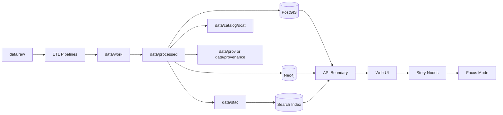
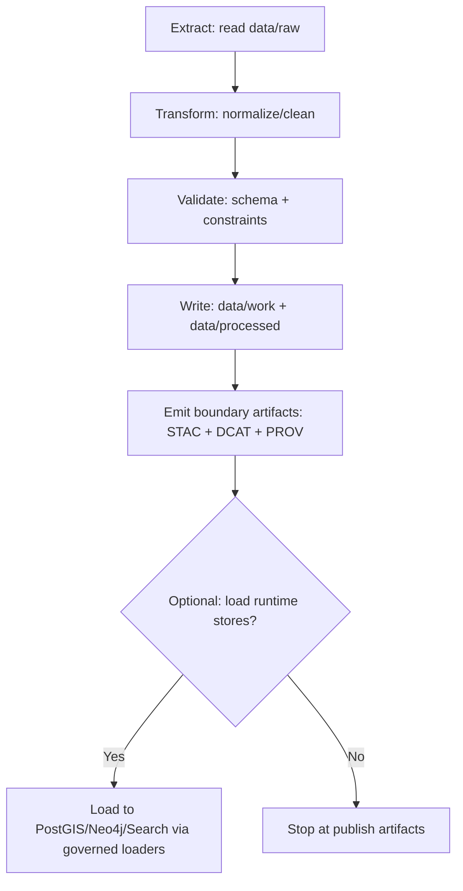

# Pipelines 🧪🗺️

> **Governed document** · **Evidence-first** · **Pipeline-synced** · **FAIR+CARE** · **CI-ready**  
> Text-badges (CI-safe): `governed-doc` · `truth-path` · `no-leapfrogging` · `provenance-required` · `no-external-images`

This directory contains KFM’s **data ingestion + ETL pipelines**: scripts, notebooks, and/or simulation workflows that transform **raw inputs** into **processed, publishable datasets** with machine-readable **metadata (STAC/DCAT)** and **lineage (PROV)**.  
KFM operates as a **pipeline → catalog → database → API → UI** system: users and the UI never “jump the queue.”[^truth-path]

---

## 📘 Overview

### Purpose
Provide a single, governed runbook for:
- What “counts” as a KFM pipeline
- Required outputs (processed data + boundary artifacts)
- Hard governance rules (what is **not allowed**)
- Contribution expectations (Definition of Done for pipelines)

### Scope
In scope:
- ETL jobs (extract → transform → load/publish)
- Domain-specific pipeline modules and shared pipeline utilities
- Pipeline validation, metadata/provenance emission, and DB/graph load hooks (where applicable)

Out of scope:
- One-off manual transformations that cannot be reproduced
- Ad-hoc, undocumented analysis outputs without full metadata + provenance

### Audience
- Engineers implementing and testing pipelines
- Data stewards validating sources, licenses, and sensitivity
- Governance reviewers assessing FAIR+CARE compliance

### Definitions (project-meaning)
- **Boundary artifacts**: required publish-time outputs: STAC + DCAT + PROV (see “📦 Data & Metadata”).
- **Truth path**: canonical sequence from raw → pipeline → processed + catalogs → runtime stores → API → UI. No bypassing.
- **Governed doc**: a Markdown file subject to governance + CI validation; this README is governed.[^governed-doc]

---

## 🗂️ Directory Layout

### This document
- **Path:** `pipelines/README.md`

### Related repository paths (expected)
> [!NOTE]
> Exact folder names can vary by repo revision. If your repo differs, **align to the current Master Guide / standards docs** and update this README accordingly.

| Area | Path(s) | What lives here |
|---|---|---|
| Raw inputs | `data/raw/` | Immutable source drops (snapshots) |
| Working/intermediate | `data/work/` | Intermediate artifacts and staging outputs |
| Final processed | `data/processed/` | Publishable outputs used downstream |
| STAC | `data/stac/` | STAC collections + items |
| DCAT | `data/catalog/dcat/` | DCAT dataset catalog entries (JSON-LD) |
| Provenance | `data/prov/` *(or `data/provenance/`)* | PROV lineage bundles/logs |
| Docs (domain notes) | `docs/data/<domain>/` | Domain runbooks (sources, ETL notes, quirks) |
| Schemas | `schemas/` | JSON Schemas for catalogs, story nodes, etc. |

### Recommended pipeline module shape
> [!TIP]
> This is a recommended structure to keep pipelines discoverable and testable.

```text
pipelines/
  _shared/                   # shared helpers (io, hashing, metadata emitters, validators)
  <domain>/                  # e.g., climate/, migration/, treaties/, railroads/
    README.md                # domain-level pipeline runbook
    <dataset_id>/            # optional: subfolder per dataset/product
      pipeline.py            # deterministic entrypoint
      config/                # params (non-secret), mapping tables
      tests/                 # unit + golden tests
      fixtures/              # tiny sample inputs for CI
```

---

## 🧭 Context

KFM is designed so that **every user-facing fact is traceable** back to versioned evidence, and every derived dataset has explicit lineage.[^truth-path]  
Pipelines are the mechanism that makes this possible.

> [!IMPORTANT]
> **Hard rule:** Do not shortcut the truth path.  
> - The UI must not read raw data directly.  
> - Every dataset exposed downstream must have an associated catalog entry and provenance record.

### Non-negotiable invariants (hard gates)
- ✅ **Deterministic & reproducible**: same inputs + same config → same outputs (byte-identical where feasible)
- ✅ **No interactive prompts / manual steps** in official pipelines (pipelines must be runnable unattended)
- ✅ **Raw is immutable**: `data/raw/` is treated as read-only snapshots
- ✅ **Boundary artifacts required** before publish: STAC + DCAT + PROV
- ✅ **Fail closed**: if required provenance/metadata/sensitivity checks are missing → pipeline must stop

> [!WARNING]
> If a pipeline produces processed outputs but skips metadata/provenance emission, the data is **not publishable** and must not be loaded into runtime stores or referenced by story content.

---

## 🗺️ Diagrams

### End-to-end “truth path” flow


### Single pipeline run (recommended lifecycle)


---

## 📦 Data & Metadata

### Required staging model
| Stage | Location | Rules |
|---|---|---|
| Raw | `data/raw/<domain>/...` | Immutable snapshot; no in-place edits |
| Work | `data/work/<domain>/...` | Intermediate outputs; can be re-generated |
| Processed | `data/processed/<domain>/...` | Final publishable outputs; versioned |

### Boundary artifacts (publish contract)
> [!IMPORTANT]
> A dataset is not “published” until these boundary artifacts exist and validate.

| Artifact | Purpose | Typical location |
|---|---|---|
| STAC Collection + Items | Spatial asset metadata (collections/items) | `data/stac/collections/` and `data/stac/items/` |
| DCAT Dataset entry | Dataset discovery view (JSON-LD) | `data/catalog/dcat/` |
| PROV bundle/log | Lineage: inputs, activities, agents | `data/prov/` *(or `data/provenance/`)* |

### Minimal provenance contract (recommended fields)
Use PROV to record:
- **Inputs**: raw file IDs/paths + checksums
- **Activities**: pipeline steps + parameters + versions
- **Agents**: author/service account + toolchain versions
- **Outputs**: processed artifacts + checksums
- **Code identity**: commit hash / release tag that produced the run
- **Sensitivity & redaction**: any withheld/generalized fields

---

## 🌐 STAC, DCAT & PROV Alignment

### Alignment rules
- **STAC ↔ DCAT ↔ PROV must cross-reference** stable dataset IDs.
- **No ad-hoc metadata fields**: extend project profiles/schemas instead.
- **Versioning must be explicit** (dataset version and/or run id).

### Pipeline publish checklist
- [ ] Processed data written to `data/processed/<domain>/...`
- [ ] STAC collection + item(s) generated and validated
- [ ] DCAT dataset entry generated and validated
- [ ] PROV bundle generated and validated
- [ ] Artifact IDs cross-link correctly (STAC/DCAT/PROV)
- [ ] Sensitivity classification recorded (and redactions applied where needed)
- [ ] License/provenance evidence recorded for every external source

---

## 🧱 Architecture

### Clean layers + trust membrane (pipeline implications)
Pipelines may touch storage and external sources, but they must still respect boundaries:
- **No direct UI access to DBs**: UI and clients consume data through the API boundary.
- **No bypass of governance**: anything loaded into runtime stores must be backed by boundary artifacts and policy checks.

> [!NOTE]
> If your pipeline loads into PostGIS/Neo4j/Search, treat those loaders as **adapters** behind stable interfaces. Do not scatter DB credentials or inline queries throughout dataset scripts.

### Recommended pipeline interface
Each pipeline should expose a deterministic entrypoint that can run in CI or batch:

```python
# pseudo-interface (illustrative; not a required implementation)
def run(*, dataset_id: str, inputs: dict, config: dict, run_id: str) -> dict:
    """
    Returns a manifest describing outputs + checksums + emitted STAC/DCAT/PROV paths.
    Must be non-interactive and deterministic.
    """
```

---

## 🧠 Story Node & Focus Mode Integration

Story nodes are “machine-ingestible storytelling” that must be **evidence-backed** and **provenance-linked**.[^governed-doc]

Pipeline responsibilities that enable story content:
- Produce stable dataset IDs that story nodes can reference
- Ensure every derived layer has STAC/DCAT/PROV artifacts
- Keep provenance “human-auditable” (clear activities/agents/inputs)

> [!TIP]
> When a story references a derived layer, it should cite the **dataset ID** and/or boundary artifacts produced here, not raw files.

---

## 🧪 Validation & CI/CD

### Local validation (typical)
> [!NOTE]
> Exact commands depend on repo tooling *(not confirmed in repo)*. Prefer whatever `Makefile`/`taskfile`/`invoke`/`npm` scripts exist.

Recommended minimum checks:
- [ ] Unit tests for transforms (including edge cases)
- [ ] “Golden” tests for determinism on tiny fixtures
- [ ] Schema validation for STAC/DCAT/PROV outputs
- [ ] Provenance completeness check (required fields present)
- [ ] Sensitivity scan / redaction rules enforced

<details>
<summary><strong>Example command patterns (adjust to repo)</strong></summary>

```bash
# Run a single pipeline (example shape)
python -m pipelines.<domain>.<dataset_id>.pipeline --config config/run.yml --run-id "$(git rev-parse HEAD)"

# Validate emitted artifacts (example shape)
python -m pipelines._shared.validate_artifacts --stac data/stac --dcat data/catalog/dcat --prov data/prov
```
</details>

### OpenShift / Kubernetes execution (recommended pattern)
If pipelines run as cluster jobs:
- Build a **pipeline-runner image** with pinned dependencies (portable, reproducible)
- Execute as a **batch job** (CronJob for schedules; Job for ad-hoc runs)
- Promote “published artifacts” through GitOps (declarative environments)

<details>
<summary><strong>Example OpenShift run shape (adjust to your cluster)</strong></summary>

```bash
# Build + push pipeline runner image (example; adjust registry/auth)
podman build -t <registry>/kfm/pipeline-runner:<tag> .
podman push <registry>/kfm/pipeline-runner:<tag>

# Run a one-off Job (YAML not shown here; keep it in deploy/ or infra/)
oc apply -f deploy/jobs/pipeline-<dataset_id>.yaml
oc logs job/pipeline-<dataset_id> -f
```
</details>

### GitOps promotion (recommended pattern)
- Treat **pipeline infra manifests** (jobs, schedules, secrets refs) as code.
- Keep separation between **cluster foundation** and **application workloads** (common GitOps practice).[^gitops]

---

## ⚖️ FAIR+CARE & Governance

FAIR+CARE is not optional: pipelines must respect collective benefit, authority to control, responsibility, and ethics.[^governed-doc]

### Sensitive data handling
> [!WARNING]
> If a dataset contains culturally sensitive, private, or restricted information, **generalize/redact** and trigger governance review. Do not publish precise locations or personally identifying details by default.

Minimum governance gates:
- [ ] Source license/terms recorded and compatible
- [ ] Sensitivity classification recorded (with appropriate redaction)
- [ ] Provenance complete (inputs/agents/activities/outputs)
- [ ] No leapfrogging the truth path (UI/API must only see curated outputs)

---

## 🕰️ Version History

| Version | Date | Summary | Author |
|---|---:|---|---|
| v0.1.0 | 2026-02-10 | Initial governed pipelines README (template-aligned; adds truth-path, boundary artifacts, and CI gates). | AI-assisted draft (review required) |

---

## References (project docs)
- `KFM Markdown Guide.docx.pdf` (governed documentation rules, section registry, CI expectations)
- `Kansas Frontier Matrix (KFM) – Comprehensive Technical Blueprint.pdf` (truth path + architecture)
- `Kansas Frontier Matrix (KFM) Comprehensive Guide.pdf` (repo layout and validation guidance)
- `DataPipelines-OpenShift-Podman-Kubernetes-Git.pdf` (OpenShift pipeline execution patterns)
- `Docker-GitOps-OpenShift.pdf` (GitOps and CI/CD operational patterns)

---

[^governed-doc]: Governed docs must be template-aligned, evidence-first, and CI-validatable (see KFM Markdown Guide).
[^truth-path]: KFM’s end-to-end flow preserves lineage from raw → processed + catalogs → stores → API → UI; no bypassing (see KFM technical blueprint).
[^gitops]: Use GitOps for declarative promotion and auditable environment changes (see GitOps references).