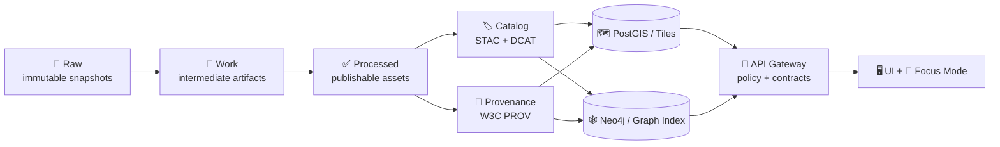

<div align="center">


# 🚰 KFM Pipelines

**Deterministic ingestion + GIS processing + AI-derived layers — published only when metadata, provenance, and policy gates pass.**  
<sub><em>“Raw ➜ Processed ➜ Catalog ➜ Databases ➜ API ➜ UI/AI” — the Truth Path is non‑negotiable.</em></sub>

<br/>


<br/>

<a href="#-purpose">🎯 Purpose</a> •
<a href="#-the-truth-path">🧭 Truth Path</a> •
<a href="#-pipeline-types">🛰️ Types</a> •
<a href="#-contracts--artifacts">📜 Contracts</a> •
<a href="#-running-pipelines">🚀 Run</a> •
<a href="#-quality--policy-gates-fail-closed">🛡️ Gates</a> •
<a href="#-observability--audit">🧾 Audit</a> •
<a href="#-author-a-new-pipeline">🧰 New Pipeline</a>

</div>

---

> [!WARNING]
> 🚧 **Under Construction (Active Development)**  
> This pipeline hub is evolving alongside the KFM platform. Treat it as the **current intent + guardrails**, not a finalized spec.  
> **If something here conflicts with the repository’s actual implementation, implementation wins — then update this doc.** ✅

---

## 🎯 Purpose

This directory is the **runbook + conventions hub** for Kansas Frontier Matrix (KFM) pipelines.

Pipelines are where we turn **evidence** into **publishable artifacts**:

- 📥 **Ingest** raw sources (vector, raster, tabular, scans, PDFs, APIs, feeds)
- 🧪 **Transform** into interoperable, queryable formats
- 🧾 **Record lineage** (W3C PROV) for audit + reproducibility
- 🏷️ **Publish catalogs** (STAC + DCAT) so datasets are findable & discoverable
- 🗄️ **Load caches** (PostGIS / tile caches / graph index) for performance
- 🧩 **Expose** only via governed interfaces (API), never direct DB from UI
- 🤖 **Produce AI-derived layers** only when governance + provenance are complete

KFM’s architecture is explicitly layered and “truth-path” driven; the pipeline stage is the start of that governed chain.  [oai_citation:0‡Kansas Frontier Matrix Comprehensive System Documentation.pdf](sediment://file_00000000ef40722faf17987b69730695)

---

## 🧭 Quick links

- 🏗️ System architecture: `../docs/architecture/system_overview.md`
- 🤖 AI system overview: `../docs/architecture/AI_SYSTEM_OVERVIEW.md`
- 🧰 Tooling & validators: `../tools/`
- 📦 Data vault + catalogs: `../data/`
  - STAC: `../data/stac/`
  - DCAT: `../data/catalog/dcat/`
  - PROV: `../data/prov/`
- 🧩 API gateway: `../api/` (or your repo’s API root)
- 🧪 Tests: `../tests/` (plus per-pipeline tests)

---

## 🧭 The Truth Path

> [!IMPORTANT]
> **Pipelines may transform data — they may not lower trust.**  
> If metadata, provenance, licensing, or policy classification is missing: **stop** (fail‑closed). 🔒

KFM enforces a strict ordering so any dataset can be rebuilt, audited, and governed end‑to‑end.  [oai_citation:1‡Kansas Frontier Matrix Comprehensive System Documentation.pdf](sediment://file_00000000ef40722faf17987b69730695)



**Design axiom:** Databases are **performance caches**, not the source of truth.  
The source of truth is the versioned artifacts in `data/` + pipeline code.  [oai_citation:2‡Kansas Frontier Matrix Comprehensive System Documentation.pdf](sediment://file_00000000ef40722faf17987b69730695)

---

## 🛰️ Pipeline Types

KFM pipelines typically fall into these buckets:

| Type | Examples | Primary outputs | Cataloging expectations |
|---|---|---|---|
| 🗺️ Vector + tabular ingest | boundaries, trails, census tables, railroads, historic points | GeoJSON / GeoParquet / Parquet | DCAT required; STAC if spatiotemporal assets; PROV always |
| 🛰️ Remote sensing ingest | Landsat/Sentinel scenes, LiDAR products, NOAA rasters | COGs, PMTiles, thumbnails, derived rasters | STAC item/collection required + PROV; DCAT for dataset record |
| 🕸️ Knowledge graph enrichment | entity extraction, relationship building, story-to-data linking | graph CSV/JSON, Neo4j load bundles | DCAT + PROV; graph contract docs encouraged |
| 🤖 AI-derived layers | classification layers, OCR corpora, change detection, “confidence layers” | publishable geo layers + run cards | **extra governance gates** + PROV must include model/run context |
| 🧪 QA / validation pipelines | geometry checks, schema validation, data profiling | reports, metrics, “data quality artifacts” | publish if referenced by UI/AI; otherwise keep as work artifacts |

Remote sensing automation (e.g., STAC feeds that trigger ingest, COG creation, tile generation, and STAC item emission) is explicitly part of KFM’s design direction.  [oai_citation:3‡Kansas Frontier Matrix Comprehensive System Documentation.pdf](sediment://file_00000000ef40722faf17987b69730695)

---

## 📜 Contracts & artifacts

### ✅ The dataset contract (minimum publishable bundle)

A dataset is “real” in KFM only when these exist:

- ✅ `data/processed/...` (the actual asset)
- 🏷️ `data/stac/...` (STAC Item/Collection when appropriate)
- 🗂️ `data/catalog/dcat/...` (DCAT dataset record)
- 🔗 `data/prov/...` (W3C PROV run bundle / lineage)

> [!TIP]
> **Think of STAC/DCAT/PROV as the data-layer API contract.**  
> The rest of the system (DB loaders, API, UI, AI) relies on these artifacts being accurate and linked.

### 🧾 Pipeline contract (how pipelines are defined)

A pipeline should be describable without reading the code:

- `pipeline.yaml` → **what it does**
- `source_manifest.yaml` → **where it came from + licensing + sensitivity**
- `extract/transform/load/publish` → **how it runs**
- `tests/` → **how we prove it works**
- `README.md` → dataset runbook (optional but strongly encouraged)

Recommended structure:

```text
pipelines/
└─ 📁 src/
   └─ 📁 pipelines/
      └─ 📁 <domain>/
         └─ 📁 <dataset_id>/
            ├─ 📄 pipeline.yaml
            ├─ 📄 source_manifest.yaml
            ├─ 🐍 extract.py
            ├─ 🐍 transform.py
            ├─ 🐍 load.py
            ├─ 🐍 publish.py
            ├─ 🧪 tests/
            │  ├─ 🧪 test_contracts.py
            │  └─ 🧪 test_metadata.py
            └─ 📄 README.md
```

---

## 🧱 Data formats & interoperability

KFM is built for interoperability with standard geo tooling and web viewers.  [oai_citation:4‡Kansas Frontier Matrix Comprehensive System Documentation.pdf](sediment://file_00000000ef40722faf17987b69730695)

### ✅ Recommended defaults
- 🗺️ Vector: **GeoParquet** (preferred for big) or GeoJSON (good for small, reviewable diffs)
- 📊 Tabular/time-series: **Parquet** (partitioned by time/region if large)
- 🛰️ Raster: **COG** (Cloud‑Optimized GeoTIFF) for web‑friendly partial reads
- 🧱 Tiles: **MVT/PBF** (vector) and PNG/WebP (raster)

### 🧩 Media artifacts (docs, thumbnails, previews)
Keep repo assets lightweight and intentional:
- GIF is great for short animations (like the KFM seal)
- PNG is best for crisp diagrams (lossless)
- JPEG is best for photo-like imagery

(General image format characteristics and tradeoffs are well-studied; optimize for clarity + size.)  [oai_citation:5‡Various Programming Concepts.pdf](sediment://file_00000000e86c71fd9eceb7eec4bba22e)

---

## 🚀 Running pipelines

> [!NOTE]
> The commands below show **common patterns**. Adjust to match the repo’s actual runner(s).

### Option A — Local dev (Compose) 🐳
1) Start dependencies:
```bash
docker compose up -d
```

2) Run a pipeline (examples):
```bash
# Pattern 1 — python module runner
python -m kfm.pipelines run <dataset_id>

# Pattern 2 — repo runner entrypoint
python -m pipelines run <dataset_id>

# Pattern 3 — Makefile shortcut
make pipeline PIPELINE=<dataset_id>
```

3) Validate outputs:
```bash
make validate
# or
python -m tools.validate all
```

### Option B — Trigger via API (maintainers) 🔐
Useful for CI automation and controlled remote runs:

```bash
curl -X POST "http://localhost:8000/api/v1/pipelines/run" \
  -H "Authorization: Bearer $KFM_TOKEN" \
  -H "Content-Type: application/json" \
  -d '{"pipeline":"<dataset_id>","reason":"new raw drop"}'
```

### Option C — Scheduled / event-driven ⏱️
Common schedules:
- 🌙 Nightly: refresh federated datasets, rebuild indexes
- 📆 Weekly: heavier recompute/derived analytics
- 🛰️ Event-driven: STAC feed triggers remote sensing ingest

KFM’s design anticipates orchestration options like Airflow/Step Functions and event streaming (Kafka/Kinesis) for larger deployments.  [oai_citation:6‡Kansas Frontier Matrix Comprehensive System Documentation.pdf](sediment://file_00000000ef40722faf17987b69730695)

---

## 🛡️ Quality & policy gates (Fail-Closed)

> [!IMPORTANT]
> **Default deny.** If policy can’t decide: **deny**. 🔒  
> If metadata/provenance/license is missing: **deny**. 🔒

### Gate 0 — Source manifest (before processing)
A pipeline cannot begin unless a `source_manifest.yaml` exists with at least:
- publisher/origin
- acquisition method + timestamp (or snapshot ID)
- license/usage rights
- sensitivity classification (`public | internal | restricted`)
- notes on limitations / known issues

### Gate 1 — Validation (before publish)
Before writing to `processed/`, confirm:
- schema validity (domain-specific)
- geometry validity + bbox sanity (if spatial)
- CRS documented (EPSG), units documented
- null conventions defined
- sampling/aggregation methods documented for derived stats

### Gate 2 — Catalog completeness (before listing/search)
A dataset cannot appear in search/UI unless:
- DCAT record exists and validates
- STAC exists when required (imagery/tiled/spatiotemporal assets)
- PROV exists and links inputs→steps→outputs
- external assets include checksums + retrieval method

### Gate 3 — AI-derived outputs (extra checks)
AI outputs are treated as **first-class datasets**:
- must include model + version + parameters + evaluation notes
- must include citations/inputs where applicable
- must pass governance checks (classification propagation, redaction rules)
- must log provenance and route through policy packs

> [!TIP]
> The CARE principles exist because “open” data practices can still harm communities if control, responsibility, and ethics are ignored.  
> KFM’s governance model intentionally pairs **FAIR + CARE** and treats data sovereignty as a real constraint, not a slogan.  [oai_citation:7‡Indigenous Statistics.pdf](sediment://file_0000000033ec72308e1f791a79f61bfe)

---

## 🧾 Observability & audit

Pipelines should produce artifacts humans can review **and** machines can validate:

### ✅ Minimum telemetry per run
- `run_id` (timestamp + dataset id + git sha)
- structured logs (JSON preferred)
- a PROV bundle (inputs, transforms, outputs, agents)
- checksums for publishable outputs
- counts/summary stats (feature count, time coverage, bbox)

### ⭐ Recommended (especially for CI and long-running pipelines)
- metrics: rows/sec, tiles/sec, memory usage
- traces across extract→transform→load→publish (OpenTelemetry-friendly)
- a “Run Card” markdown (human summary) stored under `data/prov/` or `docs/runs/`

> [!NOTE]
> KFM’s platform goal is to make every layer, chart, and answer traceable back to evidence — provenance is not optional.  [oai_citation:8‡Kansas Frontier Matrix Comprehensive System Documentation.pdf](sediment://file_00000000ef40722faf17987b69730695)

---

## ⚡ Performance & scaling patterns

Pipelines should scale from laptop → workstation → cloud without changing logic:

- ♻️ **Idempotency by design**: reruns shouldn’t duplicate rows/tiles
- 🧩 **Partition big data**: by year, county, quadkey, or domain-relevant shards
- 🗺️ **Index consciously**: spatial indexes + constraints for PostGIS loads
- 🛰️ **Tile smart**: prebuild where needed; cache where possible
- 📦 **Avoid giant GeoJSON**: prefer GeoParquet + streaming APIs
- 🧠 **Keep DB as cache**: rebuildable from `processed/` + catalogs + loaders

These principles align with KFM’s modular, service‑separated architecture approach for scalability and maintainability.  [oai_citation:9‡Kansas Frontier Matrix Comprehensive System Documentation.pdf](sediment://file_00000000ef40722faf17987b69730695)

---

## 🔒 Security & sensitivity

Pipelines must:
- 🧷 propagate classification from inputs → outputs (no “less restricted” outputs)
- 🧹 redact/sanitize outputs where required (columns, geometry precision, access rules)
- 🔐 never embed secrets in manifests or code
- 🛡️ enforce policy checks at boundaries (ingest, publish, API serve)
- 🕵️ log sensitive access and AI answers for audit

---

## 🧰 Author a new pipeline

### 1) Choose a stable dataset id 🏷️
Prefer a stable scheme:
- `kfm.<domain>.<topic>.<year_or_version>`
- examples: `kfm.census.population.1900`, `kfm.trails.historic.v1`, `kfm.imagery.landsat.ndvi.monthly.v2`

### 2) Add a source manifest 🧾
`source_manifest.yaml` (minimum):

```yaml
id: kfm.census.population.1900
title: "Kansas Census Population (1900)"
publisher: "<agency_or_archive>"
source_url: "<where_it_came_from>"
license: "<license_name_or_url>"
sensitivity: public  # public | internal | restricted
update_frequency: one-time  # or daily/weekly/monthly/event-driven
spatial_extent: "Kansas"
temporal_coverage: "1900"
notes: "Digitization caveats, known missingness, etc."
```

### 3) Implement stages 🧱→✅
Recommended breakdown:
- `extract` → fetch/read/normalize raw
- `transform` → clean/standardize/projection fixes
- `validate` → schema + geometry + constraints
- `load` → PostGIS / object store / graph loaders
- `publish` → STAC/DCAT/PROV + tile registration where applicable

### 4) Emit catalogs + provenance 🏷️🔗
- DCAT dataset summary + distributions (files + API links)
- STAC items/collections for spatiotemporal assets
- PROV bundle with hashes, parameters, container digests (when available)

### 5) Add tests ✅
Minimum:
- schema validation
- metadata completeness checks (STAC/DCAT/PROV links)
- a “smoke serve” check (can the API serve it?)
- policy checks (OPA pack evaluation)

---

## 🧯 Troubleshooting

<details>
<summary><b>Pipeline won’t start</b> 🚫</summary>

- Missing `source_manifest.yaml`  
- License is missing/ambiguous  
- Sensitivity classification not declared  
- Runner can’t locate pipeline config

</details>

<details>
<summary><b>Dataset doesn’t show up in search/UI</b> 🔎</summary>

- DCAT not published or invalid  
- STAC item missing (for imagery/tiled assets)  
- PROV missing or not linked  
- “bundle completeness” gate failing in CI

</details>

<details>
<summary><b>Tiles 404</b> 🧱</summary>

- layer not registered  
- tiles not built (or built in the wrong place)  
- permissions/policy denied  
- bbox/time constraints excluding requests

</details>

---

## 🧠 Glossary

- **STAC** 🏷️: SpatioTemporal Asset Catalog (assets metadata: where/when/what)
- **DCAT** 🗂️: Data Catalog Vocabulary (dataset discovery + distributions)
- **W3C PROV** 🔗: provenance model (inputs → process → outputs)
- **COG** 🛰️: Cloud‑Optimized GeoTIFF (partial reads, web-friendly)
- **MVT/PBF** 🧩: Mapbox Vector Tiles (fast vector map rendering)
- **OPA** 🧾: Open Policy Agent (policy-as-code enforcement)
- **Fail‑Closed** 🔒: default deny; publish only on complete compliance

---

## 📚 Reference shelf (project files)

These project references inform pipeline design, governance posture, and implementation patterns:

- 📘 **KFM — Comprehensive System Documentation** (architecture, truth path, remote sensing ingest patterns)  [oai_citation:10‡Kansas Frontier Matrix Comprehensive System Documentation.pdf](sediment://file_00000000ef40722faf17987b69730695)  
- 🧭 **Indigenous Statistics (2e)** (data sovereignty framing; FAIR + CARE rationale)  [oai_citation:11‡Indigenous Statistics.pdf](sediment://file_0000000033ec72308e1f791a79f61bfe)  
- 🧱 **Node.js & server scalability** (event-driven I/O patterns; dev ergonomics for tooling services)  [oai_citation:12‡Node.js-React-CSS-HTML.pdf](sediment://file_00000000b09c71f8b277cb19b9f597b2)  
- 🎨 **Learn to Code HTML & CSS** (documentation UX and readable structure patterns)  [oai_citation:13‡learn-to-code-html-and-css-develop-and-style-websites.pdf](sediment://file_00000000ed6471fdb0ecead71e051444)  
- 🖼️ **Compressed Image File Formats** (choosing GIF/PNG/JPEG wisely for repo media)  [oai_citation:14‡Various Programming Concepts.pdf](sediment://file_00000000e86c71fd9eceb7eec4bba22e)  

---

<div align="center">

### 🌾 Build responsibly. Publish confidently. Keep provenance forever. 🧾✨
<sub>When in doubt: make it reproducible, traceable, and policy-compliant.</sub>

</div>