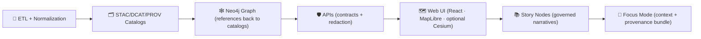

<!--
📌 This README defines the *canonical pipeline boundary* for KFM (Kansas Frontier Matrix).
🗓️ Last updated: 2026-01-09
-->

<div align="center">

# 🧬 KFM Pipelines  
`pipelines/README.md`

**Deterministic ETL → governed catalogs → graph ingestion → APIs → UI**  
The operational spine of **Kansas Frontier Matrix (KFM)**. 🧠🗺️


</div>

---

## 🔗 Quick links (start here)
- 🧭 Repo overview: `../README.md`
- 🧩 Executable boundary: `../src/README.md`
- 📦 Data + metadata boundary: `../data/README.md`
- 🧪 MCP (runs, experiments, model cards): `../mcp/README.md`
- 🏛️ Master architecture guide: `../docs/MASTER_GUIDE_v13.md` *(canonical intent + paths)*
- 🧱 Architecture & ADRs: `../docs/architecture/`
- 📜 Schemas + profiles: `../schemas/` *(STAC/DCAT/PROV, telemetry, story nodes, etc.)*
- 🧰 Validators & tools: `../tools/` *(incl. catalog QA)*
- 🤝 CI/CD: `../.github/` *(workflows, security policy, automation)*
- 🌐 Web UI boundary: `../web/` *(React · MapLibre · optional Cesium)*

> [!NOTE]
> This `pipelines/` folder is a **portal + contract** 📍  
> The **executable** pipeline code lives in `src/pipelines/`.  
> Evidence outputs live in `data/` (and must be cataloged).

---

## 🧭 Quick navigation
- [🚦 Non‑negotiables](#-non-negotiables)
- [🧬 What a “pipeline” means in KFM](#-what-a-pipeline-means-in-kfm)
- [🧱 The canonical ordering](#-the-canonical-ordering)
- [📦 Data & metadata lifecycle](#-data--metadata-lifecycle)
- [📁 Where things live](#-where-things-live)
- [⚙️ Running pipelines](#️-running-pipelines)
- [✅ Quality gates](#-quality-gates)
- [🔐 Governance & sovereignty](#-governance--sovereignty)
- [🛡️ Security & hostile inputs](#️-security--hostile-inputs)
- [🔭 Performance & scaling](#-performance--scaling)
- [🌾 Example pipeline archetypes](#-example-pipeline-archetypes)
- [🧩 Adding a new pipeline](#-adding-a-new-pipeline)
- [📚 Project reference library influence map](#-project-reference-library-influence-map)
- [🕰️ Version history](#️-version-history)

---

## 🧾 Doc metadata

| Field | Value |
|---|---|
| Doc | `pipelines/README.md` |
| Status | Active ✅ |
| Last updated | **2026-01-09** |
| Audience | Contributors implementing ETL jobs, validators, catalog writers, graph ingest exports |
| Prime directive | **No catalog → no graph → no API → no UI.** Catalogs are the interface. |

---

## 🚦 Non‑negotiables

1) **Pipelines are deterministic builders** 🧪  
   Same inputs + config + code = same outputs (IDs, hashes, metadata).

2) **Declared inputs / declared outputs** 📥➡️📤  
   Every pipeline must state what it reads and what it publishes (with paths + IDs).

3) **Catalogs are not optional** 🗂️  
   Data is not “real” in KFM until it has:
   - STAC (spatial/temporal assets)
   - DCAT (dataset discovery)
   - PROV (lineage + run identity)

4) **Atomic publish** 🧾  
   Stage first → validate → publish **all-or-nothing** (no half‑written datasets in `data/processed/` or catalogs).

5) **Governance travels with the data** 🪶  
   Classification, sensitivity, and redaction are enforced end‑to‑end. No downstream “loosening.”

6) **KFM ordering is sacred** 🧱  
   **ETL → STAC/DCAT/PROV → Neo4j Graph → APIs → Web UI → Story Nodes → Focus Mode**

> [!TIP]
> If your pipeline can’t produce a clean paper trail (inputs → transforms → outputs → catalogs → lineage), it’s not ready to merge. ✅

---

## 🧬 What a pipeline means in KFM

A KFM pipeline is a **replayable builder** that produces:

- 📦 **Evidence artifacts** in `data/processed/**` *(COG, Parquet, GeoJSON, CSV, tiles, etc.)*
- 🗂️ **Catalog artifacts** in canonical locations *(STAC/DCAT)*
- 🧬 **Lineage artifacts** *(W3C PROV bundles: inputs → activity → outputs)*
- 🧷 **Integrity artifacts** *(hash manifests; inventories; deterministic IDs)*
- 📈 **Telemetry artifacts** *(run summaries, timings, gate outcomes)*

> [!IMPORTANT]
> Pipelines do **not** “secretly update the graph.”  
> The graph ingests **from catalogs** (and/or graph export artifacts) via controlled paths.

---

## 🧱 The canonical ordering

> [!IMPORTANT]
> This is a governance boundary, not a preference.



> 🧭 Legend (kept outside Mermaid to avoid renderer issues):  
> 🧪 ETL → 🗂️ Catalogs → 🕸️ Graph → 🛡️ APIs → 🗺️ UI → 📚 Story → 🎯 Focus

---

## 📦 Data & metadata lifecycle

KFM uses a **required staging lifecycle** so everyone can tell “what stage is this file in?” at a glance:

- `data/raw/<domain>/...` → raw source drops (read-only mindset)
- `data/work/<domain>/...` → intermediate transforms (ok to delete/regenerate)
- `data/processed/<domain>/...` → final evidence artifacts (publishable)

At publish time, pipelines must also write catalogs & lineage:

- `data/stac/collections/` + `data/stac/items/` → STAC
- `data/catalog/dcat/` → DCAT (JSON‑LD dataset catalog)
- `data/prov/` → PROV bundles (run + dataset lineage)

> [!NOTE]
> Some older notes may say `data/provenance/`.  
> **v13 canonical path is `data/prov/`.** Keep new work aligned.

---

## 📁 Where things live

### 🧭 Repo context (target shape)
```text
📁 pipelines/                 # 📍 this folder (portal + conventions; not executable code)
📁 src/                       # 🧩 executable source code
│  └── 📁 pipelines/          # 🧪 ETL jobs + catalog writers + validators
📁 data/                      # 📦 raw → work → processed + STAC/DCAT/PROV
📁 schemas/                   # 📐 JSON Schemas (STAC/DCAT/PROV, telemetry, story nodes, etc.)
📁 tools/                     # 🧰 validators, QA tools, devops helpers
📁 web/                       # 🌐 UI (React + MapLibre + optional Cesium)
📁 mcp/                       # 📓 methods + experiments + run receipts
📁 tests/                     # ✅ automated tests (unit/integration)
📁 releases/                  # 📦 packaged release artifacts (manifest + SBOM)
📁 .github/                   # 🤝 CI/CD, policies, automation
```

### 🧪 Pipeline code lives here (canonical)
```text
📁 src/pipelines/
├── 📁 _shared/                  # 🧩 shared IO helpers, catalog emitters, validators
└── 📁 <domain>/
   └── 📁 <pipeline_name>/
      ├── run.py                 # entrypoint
      ├── pipeline.yml           # declarative config (recommended)
      ├── config/                # env-specific configs (dev/stage/prod)
      ├── schemas/               # domain schemas (if needed)
      ├── validators/            # QA gates (schema, bounds, link checks, etc.)
      ├── tests/                 # pipeline tests (fixtures + mini-run)
      └── README.md              # developer-facing notes (short)
```

### 🧾 Pipeline docs live here (runbooks)
```text
📁 docs/pipelines/
└── 📁 <domain>/
   └── 📁 <pipeline_name>/
      └── README.md              # purpose, inputs, outputs, SLA cadence, gates, failure modes
```

---

## ⚙️ Running pipelines

> [!NOTE]
> Prefer the repo’s `Makefile` command surface when available.  
> If your local repo doesn’t have these targets yet, treat this section as the **intended ergonomics**.

### ✅ Recommended: `make` entrypoints
```bash
# list pipelines (example)
make pipelines-list

# run a pipeline (example)
make pipeline RUN=hydrology/watersheds ENV=dev

# validate catalogs (example)
make catalog-qa

# build graph exports from catalogs (example)
make graph-export
```

### 🐍 Direct execution (module style)
```bash
python -m src.pipelines.hydrology.watersheds.run --env dev --config config/dev.yml
python -m src.pipelines.hazards.refresh.run --env dev --since "2026-01-01T00:00:00Z"
```

### 🧱 Typical environment variables
| Variable | Purpose |
|---|---|
| `KFM_ENV` | `dev|stage|prod` |
| `KFM_DATA_ROOT` | data root (if not repo-relative) |
| `KFM_STAC_ROOT` | STAC output root |
| `KFM_DCAT_ROOT` | DCAT output root |
| `KFM_PROV_ROOT` | PROV output root |
| `KFM_GRAPH_EXPORT_ROOT` | graph export root (CSV/Cypher) |
| `KFM_TELEMETRY_ROOT` | telemetry output root |
| `KFM_NEO4J_URI` | graph ingest endpoint *(if enabled)* |

> [!TIP]
> For complex geospatial dependencies (GDAL, PROJ, etc.), **Docker is your friend** 🐳  
> Containerize pipeline environments to reduce “works on my machine” drift.

---

## ✅ Quality gates

A pipeline is “done” only when all of these pass:

### 1) ✅ Schema & bounds validation
- Input schema checks (columns/types; required fields)
- Spatial bounds checks (Kansas extent, expected CRS, sane coordinate ranges)
- Unit sanity checks (meters vs feet, mm vs inches, etc.)

### 2) 🗂️ Catalog correctness
- STAC validity (Collections + Items)
- DCAT dataset/distributions are complete
- PROV bundles exist and link inputs/outputs

> [!NOTE]
> KFM treats metadata like code — it must pass tests.

### 3) 🔗 Link integrity
- Asset URLs/paths resolve
- STAC links are not broken
- Catalog IDs resolve downstream (graph ingest expects them)

### 4) 🧷 Integrity & determinism
- Checksums recorded (manifest inventories)
- Stable IDs for Items/datasets across reruns (when inputs unchanged)

### 5) 🧰 Catalog QA tooling
KFM uses a **Catalog QA gate** in CI/pre-release:
- expected tool location: `tools/validation/catalog_qa/`

> [!TIP]
> Make it easy for reviewers: `make catalog-qa` should be boring. 😌✅

---

## 🔐 Governance & sovereignty

KFM is FAIR + CARE + sovereignty-aware by design.

### 🪶 Classification propagation (deny-by-default)
- If an input is restricted, outputs **must not** be less restricted unless an explicit redaction/generalization step exists.
- Treat unknown sensitivity as restricted until reviewed.

### ✂️ Redaction & generalization is multi-layer
If redaction is required, it must be applied consistently:
- `data/processed/**` (redacted evidence artifact)
- STAC/DCAT metadata (flags and documentation)
- API (enforces access & redaction)
- UI (additional checks / disclosure UX)

### 🧾 Audit trails
- Pipelines should emit telemetry signals when redaction/generalization occurs.
- Governance reviews are required for classification or sensitivity changes.

---

## 🛡️ Security & hostile inputs

Pipelines ingest “files from the world.” Assume inputs are hostile by default. 🧯

### ✅ Required defensive posture
- Validate file types & magic bytes (don’t trust extensions)
- Prevent path traversal (archives/extractors)
- Defend against decompression bombs (archives/images)
- Avoid unsafe shelling-out; sanitize args when calling GDAL/other tools
- Parameterize SQL; never string-concatenate untrusted values
- Never log secrets or sensitive raw content

> [!CAUTION]
> If someone malicious controls this input, what’s the maximum harm?  
> If the answer includes “run code / exfiltrate / crash,” add guards **before** merging.

---

## 🔭 Performance & scaling

KFM scales by staying **metadata-driven** and **chunk-friendly**:

- 📦 Chunk work into partitions (tiles, counties, time windows)
- 🧱 Add pipeline breakers where materialization is necessary (write Parquet/COGs, then continue)
- 🔁 Favor replay safety (idempotent keys, stable output paths, deterministic ordering)
- 🛰️ Bring compute to the data when possible (cloud processing + ingest the result)

> [!NOTE]
> For future streaming/near-real-time pipelines, the architecture can extend toward event/stream processors, parallel task pools, and adaptive execution models — without breaking the governed ETL→catalog boundary.

---

## 🌾 Example pipeline archetypes

These are canonical *shapes* KFM supports. Match one before inventing a new one. 🧩

### 1) 🌊 Time-series & sensor ingestion
**Use when:** climate records, IoT readings, socio-economic time series  
**Outputs:** Parquet tables + temporal catalog coverage; supports timeline visualizations and analysis.

**Example intent:** ingest long-range NOAA monthly climate data into a single time-indexed Parquet dataset with spatial tags (FIPS/lat-long), then publish catalogs for discovery.

### 2) 🛰️ Remote sensing “compute-to-data” ingest
**Use when:** imagery is too large to download/process locally  
**Pattern:** compute in a cloud environment (e.g., GEE-like workflows), then ingest the final product into `data/processed/**` with full PROV pointers to scripts, params, and date ranges.

### 3) 💧 Hydrology terrain processing
**Use when:** DEM-derived hydrology (flow direction/accumulation, watersheds, streams)  
**Typical tools:** GDAL + WhiteboxTools  
**Outputs:** COG rasters + vector GeoJSON + STAC metadata for map-ready layers.

### 4) 🌪️ Hazards refresh pipeline (continuous ingest)
**Use when:** multi-source hazard chronicles (tornadoes, floods, fires, droughts, etc.)  
**Pattern:** automated ETL on a schedule (e.g., daily) that fetches, normalizes, catalogs, and produces higher-level summaries.  
**Downstream:** hazard events become graph nodes linked to provenance and related domains.

> [!TIP]
> “Value-added” derived layers (summaries, clustering, indices) are still **evidence artifacts**: store in `data/processed/**` + STAC/DCAT + PROV.

---

## 🧩 Adding a new pipeline

### ✅ Checklist (minimum bar)
- [ ] Choose a domain folder: `src/pipelines/<domain>/`
- [ ] Define the pipeline’s inputs/outputs **before** coding (contract-first)
- [ ] Implement deterministic ETL (config-driven; stable IDs)
- [ ] Write outputs to `data/processed/<domain>/...`
- [ ] Emit STAC + DCAT + PROV
- [ ] Add validators (schema, bounds, link checks, classification propagation)
- [ ] Add tests (unit + at least one mini end-to-end run)
- [ ] Add docs: `docs/pipelines/<domain>/<pipeline_name>/README.md`
- [ ] Ensure graph ingest/export is driven from catalogs (no ad-hoc inserts)

### 🧾 Pipeline doc contract (what every pipeline doc must include)
Under `docs/pipelines/<domain>/<pipeline_name>/README.md`:

- 🎯 Purpose + scope + SLA cadence
- 🧺 Inputs (sources, access requirements, licenses)
- 🧪 Validation gates (what fails fast; what warns)
- 🧷 Integrity model (hashing, manifests, idempotency)
- 🗂️ STAC/DCAT mapping (collections/items/datasets)
- 🧬 PROV mapping (entities/activities/agents)
- 💥 Failure modes + replay rules + kill switch
- 🪶 Governance notes (classification, redaction/generalization, restrictions)

### 🧪 Run receipts (MCP link)
If this pipeline run is used to justify decisions or publish evidence:
- add a run receipt: `mcp/runs/RUN-YYYY-MM-DD-.../`
- link the evidence outputs (paths + catalog IDs)

---

## 📚 Project reference library influence map

> [!NOTE]
> These project library files inform **pipeline design + review standards**: determinism, validation, scaling, governance, security posture, and map-readiness.

<details>
<summary><strong>📦 Expand: Project files → what they influence in pipelines</strong></summary>

| Project file | Primary lens | Pipeline-level impact |
|---|---|---|
| `Kansas Frontier Matrix (KFM) – Comprehensive Technical Documentation.docx` | 🧭 System blueprint | Defines deterministic pipeline contracts, provenance emission, schema/bounds validation, and atomic publish expectations. |
| `MARKDOWN_GUIDE_v13.md.gdoc` | 🧱 Repo canon | Canonical directory layout, evidence-first ordering, and where catalogs/lineage must be written. |
| `Cloud-Based Remote Sensing with Google Earth Engine-Fundamentals and Applications.pdf` | 🛰️ RS workflows | Cloud-first compute patterns; export discipline; treating derived indices as datasets with provenance. |
| `python-geospatial-analysis-cookbook.pdf` | 🗺️ GIS engineering | PostGIS + geospatial IO patterns; boundary transforms; web mapping-friendly outputs. |
| `making-maps-a-visual-guide-to-map-design-for-gis.pdf` | 🎨 Cartography | “Map honesty” constraints that should influence aggregation, classification, and derived layer publishing. |
| `Mobile Mapping_ Space, Cartography and the Digital - 9789048535217.pdf` | 📱 Offline/mobile | Asset sizing, tiling, caching, and “low bandwidth first” constraints upstream. |
| `responsive-web-design-with-html5-and-css3.pdf` | 🌐 Frontend constraints | Pipeline outputs should respect payload budgets and progressive loading needs. |
| `webgl-programming-guide-interactive-3d-graphics-programming-with-webgl.pdf` | 🧊 3D/GPU | LOD/tiling needs; coordinate convention clarity; performance-aware asset preparation. |
| `compressed-image-file-formats-jpeg-png-gif-xbm-bmp.pdf` | 🖼️ Imagery | Compression/thumbnail strategy; preventing bloated repos; QA screenshot conventions. |
| `PostgreSQL Notes for Professionals - PostgreSQLNotesForProfessionals.pdf` | 🐘 Data store | Postgres conventions; migrations; indexing; safe import/export practices for derived tables. |
| `Scalable Data Management for Future Hardware.pdf` | ⚙️ Performance | Chunking + task pools + pipeline breaker thinking; future streaming/parallel execution models. |
| `Data Spaces.pdf` | 🔗 Interop | Catalogs as interfaces; roles/access rights; monitoring mindset for data platforms. |
| `Scientific Modeling and Simulation_ A Comprehensive NASA-Grade Guide.pdf` | 🧪 V&V discipline | Verification/validation mindset for simulation outputs and analytical pipelines. |
| `Understanding Statistics & Experimental Design.pdf` | 📊 Rigor | Bias/confounding awareness; pipeline QA checks that prevent misleading derived products. |
| `regression-analysis-with-python.pdf` | 📈 Diagnostics | Baselines + residual checks as “quality gates” for modeled evidence artifacts. |
| `Regression analysis using Python - slides-linear-regression.pdf` | 📈 Quick ref | Handy reminders for assumptions and evaluation discipline. |
| `graphical-data-analysis-with-r.pdf` | 📉 EDA instincts | Early anomaly detection; QC plots as pipeline artifacts (small, linked). |
| `think-bayes-bayesian-statistics-in-python.pdf` | 🎲 Uncertainty | Uncertainty reporting as a first-class output (intervals, posteriors) when relevant. |
| `Spectral Geometry of Graphs.pdf` | 🕸️ Graph analytics | Caution for graph-derived features; treat metrics as signals, not facts. |
| `Generalized Topology Optimization for Structural Design.pdf` | 🧮 Optimization | Structuring optimization as reproducible workflows with explicit constraints/objectives. |
| `Principles of Biological Autonomy - book_9780262381833.pdf` | 🧠 Systems thinking | Feedback loops, stability, resilience in pipeline+governance design. |
| `Introduction to Digital Humanism.pdf` | ❤️ Human-centered | Accountability and transparency in how pipelines publish evidence and affect narratives. |
| `On the path to AI Law’s prophecies and the conceptual foundations of the machine learning age.pdf` | ⚖️ AI governance | Label AI involvement; provenance; risk framing for decision-support outputs. |
| `ethical-hacking-and-countermeasures-secure-network-infrastructures.pdf` | 🧯 Threat modeling | Pipeline and service hardening mindset; privilege boundaries; defensive defaults. |
| `Gray Hat Python - Python Programming for Hackers and Reverse Engineers (2009).pdf` | 🛡️ Security mindset | Hostile-input awareness for parsers, extractors, and automation glue code. |
| `concurrent-real-time-and-distributed-programming-in-java-threads-rtsj-and-rmi.pdf` | 🧵 Concurrency | Careful orchestration; race condition avoidance; safe worker/job design. |
| `A programming Books.pdf` | 🧰 Polyglot reference | General engineering reference; choose tools without breaking boundaries. |
| `B-C programming Books.pdf` | 🧰 DevOps & CI patterns | CI scheduling, validation-after-ETL, containerization for reproducibility. |
| `D-E programming Books.pdf` | 🧰 ML implementation patterns | End-to-end preprocessing consistency; reproducible model export patterns. |
| `F-H programming Books.pdf` | 🧰 GIS/RS/ML mixed ref | Data processing patterns spanning geo + ML use cases. |
| `I-L programming Books.pdf` | 🧰 Maintainability | Practical patterns for robust, maintainable systems. |
| `M-N programming Books.pdf` | 🧰 Systems reference | Systems + networking awareness where needed. |
| `O-R programming Books.pdf` | 🧰 Engineering reference | Pragmatic engineering patterns across stacks. |
| `S-T programming Books.pdf` | 🧰 Security & testing | Secure coding posture; data store attack awareness; test discipline. |
| `U-X programming Books.pdf` | 🧰 Cross-discipline | Long-term maintainability and integration thinking. |
| `Deep Learning for Coders with fastai and PyTorch - Deep.Learning.for.Coders.with.fastai.and.PyTorchpdf` | 🤖 ML practice | Pragmatic baselines + data-centric iteration (treat model outputs as governed evidence). |

</details>

---

## 🕰️ Version history

| Version | Date | Summary | Author |
|---:|---|---|---|
| v1.3.0 | 2026-01-09 | Removed placeholder citation markers; aligned repo paths to v13 canonical structure (`web/`, `data/catalog/dcat/`, `data/prov/`); strengthened pipeline contract essentials (declared IO, PROV, schema/bounds, atomic publish); added governance, security, scaling, and archetype guidance; expanded reference library influence map. | KFM Engineering |
| v1.2.0 | 2026-01-07 | Prior iteration with v11 contract badges and pipeline ordering statement. | KFM Engineering |

---

<div align="center">

**© 2026 Kansas Frontier Matrix** · CC‑BY 4.0 (project docs)  
🧬 FAIR+CARE · 🪶 Sovereignty-aware · 🛡️ Policy-gated builds

</div>
