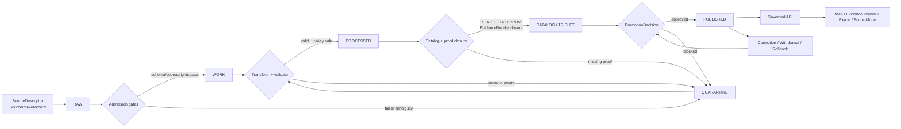
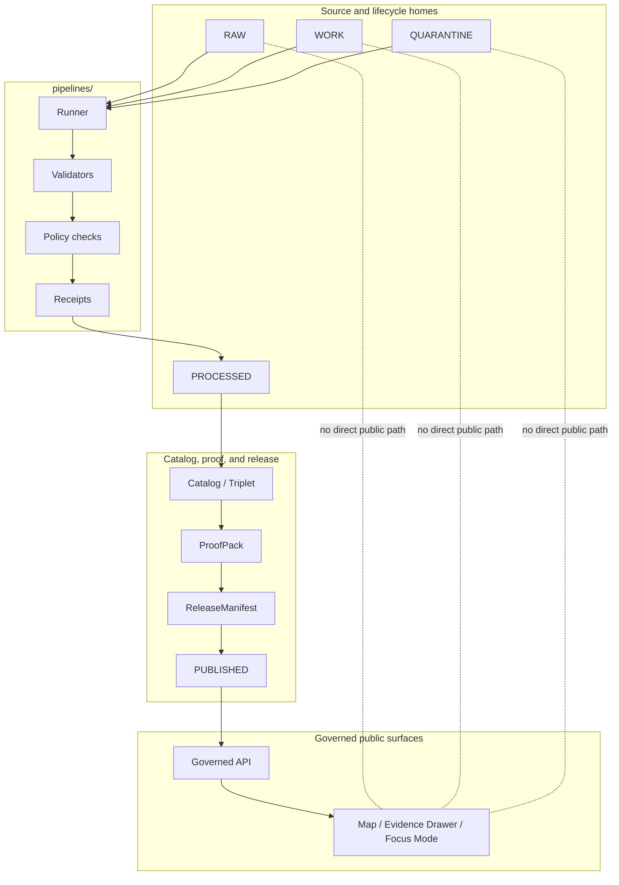

<!-- [KFM_META_BLOCK_V2]
doc_id: kfm://doc/TODO-pipelines-readme
title: KFM Pipelines
type: standard
version: v1
status: draft
owners: TODO(pipeline/data platform owners)
created: TODO(YYYY-MM-DD)
updated: 2026-04-26
policy_label: TODO(public|restricted)
related: [NEEDS_VERIFICATION:../docs/architecture/pipeline-lifecycle.md, NEEDS_VERIFICATION:../schemas/contracts/v1/, NEEDS_VERIFICATION:../policy/, NEEDS_VERIFICATION:../data/README.md]
tags: [kfm, pipelines, lifecycle, governance, evidence, validation, promotion]
notes: [GENERATED_THIS_RUN: revised from supplied pipeline README markdown; NEEDS VERIFICATION: target repo path, owners, links, workflows, schemas, policies, validators, and runtime behavior must be verified in a mounted KFM repository.]
[/KFM_META_BLOCK_V2] -->

# KFM Pipelines

<p align="center">
  <strong>Governed processing flows for moving spatial evidence through KFM without bypassing source integrity, policy, review, or publication gates.</strong>
</p>

<p align="center">
  
  
  
  
  
  
  
</p>

<p align="center">
  <a href="#scope">Scope</a> ·
  <a href="#repo-fit">Repo fit</a> ·
  <a href="#lifecycle-map">Lifecycle</a> ·
  <a href="#minimum-pipeline-contract">Contract</a> ·
  <a href="#validation-gates">Gates</a> ·
  <a href="#pipeline-families">Families</a> ·
  <a href="#quickstart">Quickstart</a> ·
  <a href="#faq">FAQ</a>
</p>

<a id="top"></a>

| Field | Value |
|---|---|
| **Status** | `draft` |
| **Owners** | `TODO(pipeline/data platform owners)` |
| **Path** | `pipelines/` — **NEEDS VERIFICATION** in mounted repo |
| **Document role** | Directory README and review gate for pipeline definitions, dry-runs, watchers, validation flows, and promotion rehearsals |
| **Evidence mode** | **CORPUS_ONLY / GENERATED_THIS_RUN:** revised from supplied Markdown and KFM guidance. **UNKNOWN:** actual current `pipelines/` contents, package manager, CI wiring, source registry, validator paths, and runtime behavior. |
| **Public posture** | Pipelines prepare governed artifacts; public and ordinary UI clients use governed APIs and released or policy-safe artifacts only. |
| **Core invariant** | `RAW -> WORK / QUARANTINE -> PROCESSED -> CATALOG / TRIPLET -> PUBLISHED` |

> [!IMPORTANT]
> This README defines the intended KFM role of `pipelines/`. It does **not** prove that any pipeline, workflow, connector, fixture, validator, release artifact, API route, source registry, or UI component already exists. Treat implementation-shaped examples as **PROPOSED** until verified from current repository evidence.

| What this document does | What it does not do |
|---|---|
| Defines how pipeline work should preserve evidence, policy, validation, review, publication, and rollback. | Does not authorize public release or live source activation. |
| Identifies accepted inputs, exclusions, object families, gates, and failure outcomes. | Does not prove current repo paths, tests, CI, route names, package manager, or runtime behavior. |
| Gives a reviewable README and manifest pattern for future pipeline directories. | Does not replace schemas, policies, validators, receipts, `EvidenceBundle` resolution, or promotion review. |

---

## Scope

`pipelines/` is the repository home for **governed, repeatable processing flows** that transform admitted source material into validated, catalogable, reviewable, and eventually publishable KFM artifacts.

A KFM pipeline is not just a script. A pipeline is a reviewable lifecycle transition with:

- a declared source and authority posture;
- explicit lifecycle inputs and outputs;
- schema, source-role, rights, sensitivity, spatial, temporal, citation, catalog, and publication checks;
- deterministic identity or canonical hashing where practical;
- receipts, validation reports, and policy decisions;
- rollback, correction, or withdrawal references;
- finite outcomes; and
- no hidden route around the trust membrane.

### What this directory should make obvious

| Question | Pipeline answer |
|---|---|
| What source or artifact is being processed? | A `SourceDescriptor`, `SourceIntakeRecord`, dataset version, no-network fixture, or governed prior-stage artifact. |
| What lifecycle transition is attempted? | Example: `RAW -> WORK`, `WORK -> PROCESSED`, `PROCESSED -> CATALOG`, or `CATALOG -> PUBLISHED_CANDIDATE`. |
| What supports visible claims? | `EvidenceRef -> EvidenceBundle` closure or a documented `ABSTAIN`, `DENY`, `ERROR`, quarantine, or blocked promotion outcome. |
| What can safely leave the pipeline? | Only artifacts that pass the gates appropriate to source role, rights, sensitivity, spatial/temporal support, review state, and release posture. |
| How is failure handled? | Fail closed to `QUARANTINE`, `ABSTAIN`, `DENY`, `ERROR`, or a blocked promotion state with a reason code and receipt. |

<p align="right"><a href="#top">Back to top ↑</a></p>

---

## Repo fit

### Path

```text
pipelines/
```

> [!NOTE]
> Path existence, naming conventions, runner commands, package manager, and CI integration are **NEEDS VERIFICATION** until the real KFM checkout is mounted and inspected.

### Upstream dependencies

These are intended repository relationships and must be verified against the actual checkout before merge.

| Upstream surface | Expected relationship | Link status |
|---|---|---|
| [`../docs/architecture/pipeline-lifecycle.md`][docs-pipeline-lifecycle] | Human architecture for lifecycle rules, transitions, and promotion semantics | **NEEDS VERIFICATION** |
| [`../schemas/contracts/v1/`][schemas-contracts] | Machine-checkable object contracts after schema-home ADR | **NEEDS VERIFICATION** |
| [`../data/registry/`][data-registry] | Source descriptors, source authority records, and registry inputs | **NEEDS VERIFICATION** |
| [`../data/fixtures/`][data-fixtures] | Valid and invalid no-network fixtures for pipeline tests | **NEEDS VERIFICATION** |
| [`../policy/`][policy] | Rights, sensitivity, source-role, publication, no-bypass, and fail-closed policies | **NEEDS VERIFICATION** |
| [`../tools/validators/`][validators] | Reusable validators invoked by pipelines and CI | **NEEDS VERIFICATION** |
| [`../docs/adr/`][adr] | ADRs for schema home, source activation, release gates, and path conventions | **NEEDS VERIFICATION** |

### Downstream consumers

| Downstream surface | Pipeline responsibility |
|---|---|
| [`../data/processed/`][data-processed] | Receives validated transformed artifacts, never unsupported claims. |
| [`../data/catalog/`][data-catalog] / [`../data/triplets/`][data-triplets] | Receives catalog and graph-ready derivatives after closure checks. |
| [`../data/receipts/`][data-receipts] / [`../data/proofs/`][data-proofs] | Receives process memory, proof objects, validation reports, and rollback references. |
| [`../release/`][release] | Receives release candidates only after promotion gates pass. |
| [`../apps/governed-api/`][governed-api] | Serves governed responses from released or policy-safe artifacts. |
| [`../apps/web/`][web-app] | Displays map, Evidence Drawer, Focus Mode, story, compare, review, and export states from governed payloads only. |

<p align="right"><a href="#top">Back to top ↑</a></p>

---

## Inputs

Accepted inputs are narrow by design.

| Input class | Belongs here when… | Required posture |
|---|---|---|
| `SourceDescriptor` / `SourceIntakeRecord` | A pipeline needs source identity, role, cadence, rights, support, and activation state | **Required before live source activation** |
| No-network fixtures | A pipeline needs repeatable tests before live connectors | **Required for first PRs** |
| Prior-stage lifecycle artifacts | A pipeline consumes `RAW`, `WORK`, `QUARANTINE`, `PROCESSED`, `CATALOG`, or `TRIPLET` outputs through declared homes | **Must preserve stage provenance** |
| Schema and policy references | A run declares which contracts and policies it expects | **Must be versioned or hashable where practical** |
| Dry-run configuration | A pipeline proves behavior without publication | **Default for first slices** |
| Review or promotion candidate metadata | A run prepares a candidate release package | **Must include receipts, proof closure, and rollback target** |

> [!WARNING]
> A source being public does not make it automatically publishable. Rights, sensitivity, source role, spatial support, temporal support, freshness, attribution, review state, and release state still matter.

<p align="right"><a href="#top">Back to top ↑</a></p>

---

## Exclusions

Do not put these in `pipelines/`.

| Excluded item | Why it does not belong | Put it here instead |
|---|---|---|
| Raw source dumps | Lifecycle storage belongs outside executable pipeline definitions | `../data/raw/` |
| Work-in-progress transformed data | Pipelines may produce it, but should not store bulk stage data beside code | `../data/work/` or `../data/quarantine/` |
| Released public artifacts | Publication is a governed transition, not a folder copy | `../release/` and `../data/published/` |
| Secrets, API keys, tokens, cookies, model keys | Pipeline definitions must be reviewable and safe to publish internally | Secret manager or deployment config outside repo |
| Canonical policy decisions encoded only in scripts | Policy must be inspectable and testable outside ad hoc code | `../policy/` plus tests |
| Canonical object schemas embedded only in a runner | Schemas must remain reusable and validator-addressable | `../schemas/contracts/v1/` after ADR |
| Browser or map renderer truth logic | Public clients must not own trust-bearing state | `../apps/governed-api/`, `../apps/web/`, and typed payload contracts |
| Free-form AI prompts as pipeline truth | AI is interpretive, not the root evidence source | Governed AI runtime contracts, evidence-bound receipts, and citation validation |

<p align="right"><a href="#top">Back to top ↑</a></p>

---

## Directory tree

**PROPOSED / NEEDS VERIFICATION** until the real repository is mounted.

```text
pipelines/
├── README.md
├── hydrology_huc12_dryrun/
│   ├── README.md
│   ├── run.py
│   └── manifests/
│       └── pipeline.manifest.yaml
└── <domain>_<slice>/
    ├── README.md
    ├── run.py
    ├── manifests/
    │   └── pipeline.manifest.yaml
    └── fixtures/ -> ../../data/fixtures/<domain>/
```

### Naming pattern

Use names that expose both the domain and the proof burden.

| Pattern | Meaning | Example |
|---|---|---|
| `<domain>_<source-or-object>_dryrun/` | Fixture-first proof lane with no live fetch and no publication | `hydrology_huc12_dryrun/` |
| `<domain>_<transition>/` | Lifecycle transition runner | `soil_processed_to_catalog/` |
| `<domain>_<source>_watcher/` | Source refresh detector, only after source rights and cadence are verified | `hydrology_wbd_watcher/` |
| `<domain>_<release>_dryrun/` | Promotion package rehearsal | `habitat_release_dryrun/` |
| `<shared-object>_validation/` | Shared governance-object validation | `evidence_bundle_validation/` |

<p align="right"><a href="#top">Back to top ↑</a></p>

---

## Lifecycle map


```mermaid
flowchart LR
  A[SourceDescriptor<br/>SourceIntakeRecord] --> B[RAW]
  B --> C{Admission gates}
  C -->|schema/source/rights pass| D[WORK]
  C -->|fail or ambiguity| E[QUARANTINE]
  D --> F{Transform + validate}
  E --> F
  F -->|valid + policy safe| G[PROCESSED]
  F -->|invalid / unsafe| E
  G --> H{Catalog + proof closure}
  H -->|STAC / DCAT / PROV<br/>EvidenceBundle closure| I[CATALOG / TRIPLET]
  H -->|missing proof| E
  I --> J{PromotionDecision}
  J -->|approved| K[PUBLISHED]
  J -->|blocked| E
  K --> L[Governed API]
  L --> M[Map / Evidence Drawer / Export / Focus Mode]
  K --> N[Correction / Withdrawal / Rollback]
  N --> J
```

### Stage responsibilities

| Stage | Pipeline role | Must not do |
|---|---|---|
| `RAW` | Preserve source arrival and intake identity | Pretend raw source data is public truth |
| `WORK` | Normalize, repair, enrich, and prepare with receipts | Hide transforms or overwrite lineage |
| `QUARANTINE` | Hold unsupported, unsafe, ambiguous, or failed records | Quietly drop records without disposition |
| `PROCESSED` | Emit validated artifacts and reports | Publish or serve directly to public clients |
| `CATALOG / TRIPLET` | Build catalog and graph-ready derivatives with closure | Let derived views replace canonical evidence |
| `PUBLISHED` | Release public-safe artifacts through promotion gates | Treat publication as a file move |
| `CORRECTION / WITHDRAWAL / ROLLBACK` | Repair released claims with visible lineage | Silently overwrite public history |

<p align="right"><a href="#top">Back to top ↑</a></p>

---

## Trust membrane

Pipelines sit inside the governed build path. They are not public serving surfaces.


```mermaid
flowchart TB
  subgraph Intake[Source and lifecycle homes]
    RAW[RAW]
    WORK[WORK]
    QUAR[QUARANTINE]
    PROC[PROCESSED]
  end

  subgraph Pipe[pipelines/]
    RUN[Runner]
    VAL[Validators]
    POL[Policy checks]
    REC[Receipts]
  end

  subgraph Release[Catalog, proof, and release]
    CAT[Catalog / Triplet]
    PROOF[ProofPack]
    MAN[ReleaseManifest]
    PUB[PUBLISHED]
  end

  subgraph Public[Governed public surfaces]
    API[Governed API]
    UI[Map / Evidence Drawer / Focus Mode]
  end

  RAW --> RUN
  WORK --> RUN
  QUAR --> RUN
  RUN --> VAL --> POL --> REC
  REC --> PROC --> CAT --> PROOF --> MAN --> PUB --> API --> UI

  RAW -. no direct public path .- UI
  WORK -. no direct public path .- UI
  QUAR -. no direct public path .- UI
```

> [!CAUTION]
> Public routes, map popups, Evidence Drawer, Focus Mode, exports, and story surfaces must not read `RAW`, `WORK`, `QUARANTINE`, unpublished candidates, direct model output, or canonical/internal stores as their normal path.

<p align="right"><a href="#top">Back to top ↑</a></p>

---

## Minimum pipeline contract

Every pipeline directory should include a local `README.md` and a machine-readable manifest once repository convention is confirmed.

### Human README checklist

A pipeline README should answer:

- What lifecycle transition does this pipeline attempt?
- What sources, descriptors, fixtures, or prior-stage artifacts does it consume?
- What object families are affected?
- Which schemas and policies must pass?
- Which receipts, validation reports, catalog records, proof objects, or release candidates does it emit?
- What are the finite outcomes?
- What is the rollback, correction, or withdrawal path?
- What remains `UNKNOWN`, `NEEDS VERIFICATION`, or `CONFLICTED`?

### Illustrative manifest shape

```yaml
# ILLUSTRATIVE EXAMPLE — PROPOSED, not confirmed repo schema.
pipeline_id: hydrology_huc12_dryrun
status: proposed
owner: TODO(pipeline/data platform owner)
lifecycle_transition:
  from: PROCESSED
  to: PUBLISHED_CANDIDATE
network: disabled
source_descriptors:
  - data/registry/sources/hydrology/wbd_huc12.source.json
schemas:
  - schemas/contracts/v1/source_descriptor.schema.json
  - schemas/contracts/v1/evidence_bundle.schema.json
  - schemas/contracts/v1/policy_decision.schema.json
policies:
  - policy/source_role.rego
  - policy/rights.rego
  - policy/sensitivity.rego
fixtures:
  valid:
    - data/fixtures/hydrology/huc12_public_safe.valid.json
  invalid:
    - data/fixtures/evidence_bundle/missing_ref.invalid.json
emits:
  receipts:
    - RunReceipt
    - ValidationReport
    - PolicyDecision
  candidates:
    - ReleaseManifest
    - RollbackReference
outcomes:
  - PASS
  - QUARANTINE
  - ABSTAIN
  - DENY
  - ERROR
publication_performed: false
```

<p align="right"><a href="#top">Back to top ↑</a></p>

---

## Quickstart

### 1. Inspect before running

```bash
# From the repository root.
git status --short
git branch --show-current

# Confirm this directory and adjacent governance surfaces exist.
find pipelines -maxdepth 2 -type f | sort
find docs schemas contracts policy data tools tests -maxdepth 2 -type f 2>/dev/null | sort | head -200
```

### 2. Prefer no-network dry-runs first

```bash
# PROPOSED placeholder.
# Replace with the repo-native command after package manager and runner conventions are verified.
python pipelines/hydrology_huc12_dryrun/run.py --dry-run --no-network
```

### 3. Run validators before widening trust

```bash
# PROPOSED placeholders.
# Use repo-native wrappers if they exist.
python tools/validators/validate_source_registry.py --fixtures data/fixtures
python tools/validators/validate_evidence_bundle.py --fixtures data/fixtures/evidence_bundle
python tools/validators/validate_layer_manifest.py --fixtures data/fixtures
```

> [!WARNING]
> Do not run live fetches, source watchers, bulk tile generation, release publishing, destructive cleanup, or external model calls until source rights, endpoint behavior, credentials, policy gates, rollback, logging, and CI expectations are verified.

<p align="right"><a href="#top">Back to top ↑</a></p>

---

## Validation gates

Pipeline work is not ready for public-facing use until gates pass at the correct risk level.

| Gate | Required evidence | Fail-closed outcome |
|---|---|---|
| Source admission | Descriptor exists; source role, rights, cadence, activation state, and support are declared | Reject, defer, or quarantine |
| Schema | Valid and invalid fixtures exercise expected shape | Block merge or promotion |
| Source role | Observation, model, regulatory, documentary, derived, and generalized roles stay distinct | Quarantine or deny unsupported claim |
| Rights | License, terms, attribution, redistribution, and access class are known | Block public release |
| Sensitivity | Exact-location, cultural, living-person, restricted, or critical infrastructure exposure is classified | Redact, generalize, restrict, or deny |
| Spatial | CRS, geometry validity, support, precision, and transform history are meaningful | Hold in `WORK` or `QUARANTINE` |
| Temporal | Time basis, effective date, observation date, validity interval, or freshness status is explicit | Hold, abstain, or expire |
| Evidence closure | `EvidenceRef` resolves to `EvidenceBundle` for consequential claims | Runtime must abstain, deny, or error |
| Catalog/proof | Catalog, provenance, receipts, release manifest, and rollback references cross-link | Block promotion |
| Public boundary | No public route reads `RAW`, `WORK`, `QUARANTINE`, unpublished candidates, direct model output, or canonical/internal stores directly | Block release |
| Promotion | `PromotionDecision` records approval, obligations, release state, and rollback target | Block publication |

### Definition of done for a first pipeline slice

- [ ] Repository conventions are inspected and documented.
- [ ] Pipeline has a local README with status, owner, inputs, exclusions, finite outcomes, and rollback.
- [ ] Source descriptors are present and inactive unless rights, terms, cadence, and endpoints are verified.
- [ ] Valid and invalid fixtures run without network access.
- [ ] Pipeline emits or simulates `RunReceipt`, `ValidationReport`, and `PolicyDecision`.
- [ ] `EvidenceRef -> EvidenceBundle` closure is demonstrated or the pipeline abstains.
- [ ] No public raw/work/quarantine path exists.
- [ ] No release or publication occurs in the first dry-run.
- [ ] Rollback is a documented reference, not an afterthought.
- [ ] CI command is repo-native or clearly marked `NEEDS VERIFICATION`.

<p align="right"><a href="#top">Back to top ↑</a></p>

---

## Pipeline families

| Family | Status | Description | First safe slice |
|---|---|---|---|
| Documentation/control-plane pipelines | **PROPOSED** | Check source ledgers, authority registers, ADR links, README completeness, and successor/supersession links | no-network doc lint and link inventory |
| Schema/contract pipelines | **PROPOSED** | Validate object shapes and fixture coverage | `SourceDescriptor`, `EvidenceBundle`, `PolicyDecision` |
| Source registry pipelines | **PROPOSED** | Validate source role, activation state, rights, cadence, support, and citation fields | inactive descriptor validation |
| Domain dry-runs | **PROPOSED** | Prove one lane without live source activation | hydrology HUC12 public-safe fixture |
| Catalog/proof pipelines | **PROPOSED** | Build catalog/provenance/proof closure | dry-run `ReleaseManifest` and rollback reference |
| API/UI payload pipelines | **PROPOSED** | Validate `LayerManifest`, `EvidenceDrawerPayload`, and `FocusModePayload` | fixture-only payload examples |
| Release dry-runs | **PROPOSED** | Rehearse promotion without publication | `publication_performed: false` |
| Watcher pipelines | **PROPOSED / BLOCKED until activation review** | Detect source change, generate diff receipts, and hold for review | no-network simulated change set |

<p align="right"><a href="#top">Back to top ↑</a></p>

---

## Finite outcomes

| Outcome | Meaning | Expected evidence |
|---|---|---|
| `PASS` | The pipeline completed the intended non-public or release-candidate transition | Run receipt, validation report, policy decision, artifact digest where applicable |
| `QUARANTINE` | Data or artifact is unsafe, ambiguous, unsupported, invalid, or incomplete | Reason code, failed gate, quarantine target, reviewer note |
| `ABSTAIN` | Evidence is insufficient to support the requested claim or output | Missing or unresolved `EvidenceRef`, stale support, unsupported source role |
| `DENY` | Policy or safety boundary blocks the output | Policy decision, denied exposure/release reason, obligation or transform note |
| `ERROR` | Technical or process failure prevents reliable result | Error class, safe logs, retry/disposition guidance, no secret leakage |

<p align="right"><a href="#top">Back to top ↑</a></p>

---

## Operating rules

### Pipelines may

- read declared inputs from governed lifecycle homes;
- produce stage outputs with receipts;
- create dry-run promotion candidates;
- write validation reports;
- write public-safe derived artifacts after gates;
- simulate release packages without publication; and
- fail closed with reviewable reason codes.

### Pipelines must not

- publish directly from `RAW`, `WORK`, or `QUARANTINE`;
- let source availability substitute for rights review;
- let a map layer imply a supported claim;
- let generated language substitute for `EvidenceBundle`;
- write secrets to receipts, logs, fixtures, screenshots, prompts, or docs;
- silently downgrade geometry precision without a transform receipt;
- skip citation validation for consequential claims; or
- turn a derived graph, tile, search index, vector store, summary, scene, or dashboard into sovereign truth.

<p align="right"><a href="#top">Back to top ↑</a></p>

---

## Review checklist

Use this checklist for new or changed pipeline PRs.

- [ ] The pipeline declares its lifecycle transition.
- [ ] Inputs and output homes are explicit.
- [ ] Source roles and source descriptors are present or marked `NEEDS VERIFICATION`.
- [ ] Rights, attribution, redistribution, and access posture are handled.
- [ ] Sensitivity and exact-location exposure are handled.
- [ ] Schema and policy checks have valid and invalid fixtures.
- [ ] `EvidenceRef -> EvidenceBundle` closure is required for consequential claims.
- [ ] Receipts, proofs, catalog records, release manifests, correction notices, and rollback references remain distinct.
- [ ] Public clients cannot use the pipeline as a direct source of truth.
- [ ] Live source activation, publication, and destructive cleanup are blocked unless reviewed.
- [ ] README, manifest, tests, and docs are updated together.
- [ ] Rollback or correction path is practical and named.

<p align="right"><a href="#top">Back to top ↑</a></p>

---

## Rollback and correction posture

A pipeline that can change release-facing artifacts must name the rollback or correction path before it runs.

| Scenario | Required response |
|---|---|
| Candidate fails validation | Block promotion and write a failed `ValidationReport`. |
| Source rights become unclear | Hold or withdraw affected release candidates; do not publish new public artifacts. |
| Sensitive geometry is discovered | Quarantine exact geometry, emit redaction/generalization receipt, and require review. |
| Published artifact is corrected | Preserve correction lineage and release a `CorrectionNotice` or replacement manifest. |
| Release must be withdrawn | Preserve withdrawal reason, affected artifacts, rollback target, and public-safe status. |

> [!IMPORTANT]
> Rollback is not just deleting files. In KFM, rollback must preserve evidence, release state, correction lineage, and reviewability.

<p align="right"><a href="#top">Back to top ↑</a></p>

---

## FAQ

### Can a pipeline write directly to `PUBLISHED`?

No. Publication is a governed state transition. A pipeline may prepare a candidate and proof package, but promotion requires validators, policy, review state, release manifest, and rollback target.

### Can a pipeline call a live source?

Only after a source descriptor, rights posture, endpoint behavior, cadence, attribution, credentials, failure mode, and source-role policy are verified. The default first slice should be fixture-first and no-network.

### Can a pipeline call an AI model?

Only as an evidence-subordinate, governed operation. Model output cannot become root truth, cannot bypass `EvidenceRef -> EvidenceBundle`, and must emit bounded outcomes or receipts when used.

### Can the UI read pipeline outputs directly?

Public and ordinary UI clients should use governed APIs and released artifacts. Pipeline internals, `RAW`, `WORK`, `QUARANTINE`, canonical stores, and unpublished candidate outputs are not normal public paths.

### Are watcher pipelines safe first slices?

Usually no. Watchers are useful after source terms, cadence, credentials, diff semantics, receipts, and failure handling are verified. Start with a no-network simulated change set.

<p align="right"><a href="#top">Back to top ↑</a></p>

---

## Open questions

| Question | Status | Why it matters |
|---|---|---|
| Where is the canonical repo and active branch? | **UNKNOWN** | Required before path claims become implementation claims |
| Does `pipelines/` already exist, and what does it contain? | **UNKNOWN** | Needed before revising rather than creating |
| What package manager and language stack are authoritative? | **UNKNOWN** | Determines runnable quickstart and CI commands |
| Is `schemas/contracts/v1/` the final machine schema home? | **NEEDS VERIFICATION** | Avoids contract/schema drift |
| Which CI workflows already exist? | **UNKNOWN** | Prevents speculative workflow names and badges |
| Who owns pipeline review and release approval? | **TODO** | Required for separation of duty and review accountability |
| Which source families have verified rights and terms? | **NEEDS VERIFICATION** | Blocks live connector activation and public release |
| Where are receipts, proofs, catalogs, and releases emitted today? | **UNKNOWN** | Prevents invented artifact paths |
| Which deployment paths are public, steward, admin, or maintenance only? | **UNKNOWN** | Required for exposed-local-system safety |

<p align="right"><a href="#top">Back to top ↑</a></p>

---

## Appendix

<details>
<summary><strong>Suggested review prompt for new pipeline PRs</strong></summary>

Use this prompt during review:

```text
Does this pipeline preserve RAW -> WORK/QUARANTINE -> PROCESSED -> CATALOG/TRIPLET -> PUBLISHED?

Does it declare:
- source role,
- lifecycle transition,
- input and output homes,
- schemas,
- policies,
- fixtures,
- receipts,
- evidence closure,
- sensitivity handling,
- rights posture,
- rollback target,
- and finite failure outcomes?

Does it avoid:
- direct public reads from RAW/WORK/QUARANTINE,
- live fetch without descriptor and rights review,
- publication without promotion,
- AI or renderer ownership of truth,
- secret leakage,
- and unsupported claims?
```

</details>

<details>
<summary><strong>Glossary</strong></summary>

| Term | Meaning |
|---|---|
| `SourceDescriptor` | Declares source identity, role, rights, cadence, support, activation state, and citation obligations. |
| `SourceIntakeRecord` | Records source admission context, source state, activation posture, and review state. |
| `EvidenceRef` | A reference that must resolve to an `EvidenceBundle` before consequential claims are released. |
| `EvidenceBundle` | Inspectable support package for claims, layers, Focus outputs, exports, or review actions. |
| `PolicyDecision` | Decision record for rights, sensitivity, release eligibility, obligations, or denial. |
| `RunReceipt` | Process memory for a pipeline run: inputs, versions, hashes, tools, outcomes, and timestamps. |
| `ValidationReport` | Machine or reviewer-readable result of schema, policy, source-role, spatial, temporal, or catalog checks. |
| `PromotionDecision` | Reviewable decision that allows, blocks, or conditions publication. |
| `ReleaseManifest` | Release-facing manifest that binds promoted artifacts, digests, evidence, and rollback/correction references. |
| `ProofPack` | Promotion and publication support package that keeps proof objects inspectable. |
| `LayerManifest` | Map-layer contract that connects data source, business meaning, evidence route, freshness, policy, and review state. |
| `FocusModePayload` | Evidence-bounded synthesis payload with finite outcomes such as `ANSWER`, `ABSTAIN`, `DENY`, and `ERROR`. |
| `CorrectionNotice` | Public or steward-facing notice that explains correction scope, reason, lineage, and replacement/withdrawal state. |
| `RollbackPlan` | Practical reference for undoing or superseding release-facing artifacts without hiding history. |

</details>

<p align="right"><a href="#top">Back to top ↑</a></p>

[docs-pipeline-lifecycle]: ../docs/architecture/pipeline-lifecycle.md
[schemas-contracts]: ../schemas/contracts/v1/
[data-registry]: ../data/registry/
[data-fixtures]: ../data/fixtures/
[policy]: ../policy/
[validators]: ../tools/validators/
[adr]: ../docs/adr/
[data-processed]: ../data/processed/
[data-catalog]: ../data/catalog/
[data-triplets]: ../data/triplets/
[data-receipts]: ../data/receipts/
[data-proofs]: ../data/proofs/
[release]: ../release/
[governed-api]: ../apps/governed-api/
[web-app]: ../apps/web/
