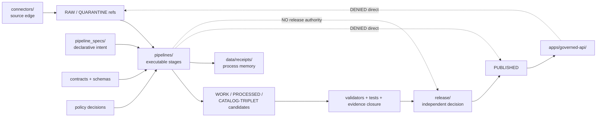

<!-- [KFM_META_BLOCK_V2]
doc_id: kfm://doc/pipelines-readme
title: pipelines/ — Governed Executable Pipeline and Orchestration Root
type: readme; root-readme; canonical-pipelines-root; executable-orchestration-boundary; non-publisher-index; compatibility-drift-index
version: v0.3
status: draft; repository-grounded; canonical-root-confirmed; placeholder-heavy; mixed-lane-maturity; dedicated-test-suite-unestablished; production-unverified; non-authoritative
owners: OWNER_TBD — Pipeline steward · Pipeline-spec steward · Domain stewards · Connector/source steward · Contract/schema steward · Evidence/receipt steward · Policy/sensitivity steward · Validation/CI steward · Release/correction/rollback steward · Security reviewer · Docs steward
created: 2026-06-13
updated: 2026-07-23
supersedes: v0.2 pipelines root contract
policy_label: "public-doctrine; pipelines-root; executable-logic; non-publisher; no-source-authority; no-evidence-authority; no-policy-authority; no-release-authority; lifecycle-governed; receipt-aware; placeholder-heavy; no-network-by-default; correction-aware; rollback-aware"
current_path: pipelines/README.md
prepared_under_prompt: KFM Markdown Modernization & GitHub Documentation Implementation Agent v4.0.0
truth_posture: >
  CONFIRMED target v0.2 README; Directory Rules v1.4 pipeline/pipeline_specs split and
  required root-README order; current repository-present shared, domain, proof, compatibility,
  cross-lane, and biodiversity README surfaces; pipeline_specs v0.3 placeholder-heavy root;
  pipelines/specs compatibility guardrail; sampled shared and domain Python placeholders;
  tests/pipelines README-only direct lane and executable non-publisher policy test; schema-paired
  draft/PROPOSED RunReceipt with validator and fixtures; pipeline receipt parent; workflow inventory
  and bounded domain holds; and CODEOWNERS routing / PROPOSED root operating model, activation and
  graduation states, minimum executable contract, finite stage-outcome mapping, lane-admission
  checklist, correction propagation, and rollback requirements / CONFLICTED connector-versus-ingest
  pre-RAW/RAW writer boundary; generic cross_lane and biodiversity umbrella placement; watcher
  ownership; proof-harness home; triplet path variants; competing Directory Rules placements;
  receipt layout; and domain aliases in pipeline_specs / UNKNOWN exhaustive executable inventory,
  active consumers, scheduler and source activation, network behavior, emitted pipeline receipts,
  functional shared API, dedicated pipeline test suite, CI enforcement, pass rate and coverage,
  deployment, production behavior, and public effects / NEEDS VERIFICATION named owners,
  CODEOWNERS enforcement and branch protection, accepted pipeline request/spec contracts,
  source-registry binding, reason/state vocabularies, receipt profile, compatibility-lane
  disposition, correction propagation, rollback automation, and the first active governed consumer
evidence_snapshot:
  repository: bartytime4life/Kansas-Frontier-Matrix
  repository_id: "1059091169"
  visibility: public
  base_ref: main
  base_commit: 19670ca8e2c8a709fc69cd41173851f8359c8281
  prior_blob: 9fb38acf5a67ca43608617d73a273d06f5f84db5
  directory_rules_blob: 2affb080e6f0043867c64c7f06c1ca52030fbd55
  directory_rules_compatibility_blob: 18653c00ba193a4afaa3e07a0924452807fb98ef
  pipeline_specs_blob: 7f35f1c06aaec08d03182cf71e88a812bf179ebf
  ingest_blob: 47e484ed891d5b830f6cb30d20829610824f33ab
  normalize_blob: 6be680f3faaca29b97a62dd29d3d77c646c0ed6a
  validate_blob: ee38f7876e75848854294642a696f8dcf6be155a
  catalog_blob: 2c7f919272e7ecc6a713787460f6cd0e781b0641
  triplets_blob: ecc6ccd73c248d05aa6d921f8d0345953877ce2e
  publish_blob: 1586920a993930f295f0305d54343dbf279b897c
  rollback_blob: d70cb669fc861f10e819a2e555adc77b41bd6fad
  watchers_blob: 8d6b6474365fbf4c93988db760c98348b1451af8
  domains_blob: 5d0662ff795c72e7ced583a3ddedfe230131f40c
  proofs_blob: 79297af6fa63694f18563addcaedcfed4cafe047
  specs_compatibility_blob: 74ca6cff32623bdca785d47d088d04bdce6a80da
  cross_lane_blob: bef088f3064a49832d8b1b370ac7668c46325c26
  biodiversity_blob: 7d967a41f0184b9f0f55eb9e6d495695551acf11
  biodiversity_vegetation_stress_blob: 265dce76a9fcad0349a28b0f7f0cf792888614c2
  tests_pipelines_blob: 08fa70cd33af2c04f03aadbf7d973c6f4e29fbf3
  non_publisher_test_blob: c6164787bc848eb2347c347af203d76afae37a2b
  pipelines_core_blob: f1b069c91289890f371a2bd640dba31d7432659e
  run_receipt_contract_blob: 5592aa5e22bbdd0c668189f79b50c18f7d1b2479
  run_receipt_validator_blob: 9b59481e90c021f0f92b74511c43fcefbbe3a057
  pipeline_receipts_blob: 6b714cd3b1501d61a83a9d52c82f7887f6c3b368
  workflows_readme_blob: afb4f79ce2c5267cb1679f48186260e6edebf8b2
  codeowners_blob: dd2a84aa514d8ecd9208bc347f90f9a2ed37dd61
related:
  - ./ingest/README.md
  - ./normalize/README.md
  - ./validate/README.md
  - ./catalog/README.md
  - ./triplets/README.md
  - ./publish/README.md
  - ./rollback/README.md
  - ./watchers/README.md
  - ./domains/README.md
  - ./proofs/README.md
  - ./specs/README.md
  - ./cross_lane/README.md
  - ./biodiversity/README.md
  - ../pipeline_specs/README.md
  - ../packages/pipelines-core/src/pipelines_core/README.md
  - ../tests/pipelines/README.md
  - ../tests/policy/test_pipeline_connector_non_publisher.py
  - ../contracts/runtime/run_receipt.md
  - ../schemas/contracts/v1/runtime/run_receipt.schema.json
  - ../fixtures/contracts/v1/runtime/run_receipt/README.md
  - ../tools/validators/validate_run_receipt.py
  - ../data/receipts/pipeline/README.md
  - ../data/receipts/generated/README.md
  - ../runtime/pipelines/README.md
  - ../docs/doctrine/directory-rules.md
  - ../docs/architecture/directory-rules.md
  - ../docs/adr/ADR-0011-receipts-vs-proofs-vs-manifests-vs-catalog-separation.md
  - ../docs/adr/ADR-0012-connector-outputs-to-data-raw-or-data-quarantine-only.md
  - ../docs/adr/ADR-0018-promotion-gate-sequence.md
  - ../docs/adr/ADR-0022-catalog-matrix--stac-+-dcat-+-prov-must-agree.md
  - ../docs/registers/DRIFT_REGISTER.md
  - ../.github/workflows/README.md
  - ../.github/CODEOWNERS
tags: [kfm, pipelines, executable-logic, orchestration, lifecycle, non-publisher, pipeline-specs, placeholders, receipts, evidence, policy, validation, correction, rollback, migration]
notes:
  - "This revision changes pipelines/README.md and its required generated provenance receipt only."
  - "The root remains the canonical executable-pipeline responsibility root; compatibility and unratified lanes are indexed without being silently promoted."
  - "No pipeline, source activation, specification, contract, schema, policy, fixture, test, workflow, lifecycle record, receipt instance other than generated provenance, proof, release object, deployment, runtime, API, UI, or public artifact is created or modified."
  - "The prior root README remains recoverable through the recorded prior blob and the v0.2 to v0.3 change summary."
[/KFM_META_BLOCK_V2] -->

<a id="top"></a>

# `pipelines/` — Governed Executable Pipeline and Orchestration Root

> **One-line purpose.** Own executable KFM pipeline logic and orchestration—the **how** of bounded source intake, transformation, validation, projection, readiness, correction, and rollback support—while remaining subordinate to source admission, lifecycle, evidence, policy, review, release, and public-client authority.

<p>
  <a href="#status"></a>
  <a href="#authority-level"></a>
  <a href="#status"></a>
  <a href="#related-folders"></a>
  <a href="#outputs"></a>
  <a href="#validation"></a>
</p>

> [!IMPORTANT]
> **A pipeline run is not lifecycle promotion or publication.** A runner may produce candidates, reports, receipts, blockers, projections, and release-review handoffs. It cannot make source material true, create an `EvidenceBundle` by assertion, approve policy, close review, issue a release decision, or move anything into `PUBLISHED` state by itself.

> [!CAUTION]
> **Normal pipeline code must not write directly to catalog, published, or release authority surfaces.** The repository has one executable static guard that scans `connectors/` and `pipelines/` for write contexts targeting `data/catalog`, `data/published`, or `release/`. That guard is useful but bounded; it does not establish a complete lifecycle writer, runtime sandbox, or promotion gate.

> [!WARNING]
> **Secrets and restricted payloads do not belong in code, specs, fixtures, logs, receipts, issues, or pull requests.** Credentials, private endpoints, protected coordinates, living-person records, DNA/genomic material, rare-species locations, archaeology details, private-land joins, infrastructure vulnerabilities, and unrestricted source payloads require approved handling, minimization, redaction, and access controls outside ordinary public repository surfaces.

**Quick navigation**

| Root contract | Trust and operation | Maintenance |
|---|---|---|
| [Purpose](#purpose) · [Authority](#authority-level) · [Status](#status) · [Belongs](#what-belongs-here) · [Exclusions](#what-does-not-belong-here) | [Inputs](#inputs) · [Outputs](#outputs) · [Validation](#validation) · [Lifecycle](#lifecycle-and-non-publisher-operating-model) · [Executable contract](#minimum-executable-pipeline-contract) | [Review](#review-burden) · [Related](#related-folders) · [ADRs](#adrs) · [Last reviewed](#last-reviewed) · [Migration](#lane-admission-migration-correction-and-rollback) · [No-loss](#v02-to-v03-no-loss-ledger) |

---

## Purpose

`pipelines/` is the canonical KFM responsibility root for executable pipeline logic and bounded orchestration.

It answers five questions:

1. Which admitted inputs and declarative profile does a pipeline stage consume?
2. How does the stage execute deterministically and fail safely?
3. Which candidate outputs, reports, blockers, and receipt facts does it emit?
4. Which evidence, policy, review, release, correction, and rollback obligations remain outside the stage?
5. How can the stage be disabled, replayed, superseded, migrated, or rolled back without rewriting history or bypassing governance?

### Responsibility split

```text
pipelines/       = executable pipeline logic and orchestration — HOW work runs
pipeline_specs/  = declarative configuration and activation intent — WHAT may run
connectors/      = source-specific fetch and admission edge
data/            = lifecycle state, governed records, receipts, proofs, and published artifacts
release/         = release, correction, withdrawal, and rollback decisions
```

### Intended operating flow

```text
admitted SourceDescriptor and bounded source or lifecycle references
  -> accepted pipeline specification/profile
  -> caller, scope, identity, rights, sensitivity, and policy prechecks
  -> executable stage under pipelines/ or an admitted reusable package
  -> candidate output refs plus finite stage result
  -> schema, contract, evidence, policy, and quality validation
  -> RunReceipt or accepted pipeline-receipt candidate
  -> WORK / QUARANTINE / PROCESSED / CATALOG-TRIPLET candidate handoff
  -> independent review and release gates
  -> PUBLISHED only through governed release authority
```

This is a **PROPOSED operating model**, not a claim that every arrow is implemented.

### Keystone invariants

Every pipeline change must preserve:

- `RAW -> WORK / QUARANTINE -> PROCESSED -> CATALOG / TRIPLET -> PUBLISHED`;
- promotion as a governed state transition, not a file write, run result, merge, or deployment;
- source-role identity and source-admission boundaries;
- `EvidenceRef -> EvidenceBundle` resolution when claims depend on evidence;
- policy-aware, fail-closed behavior for rights, sensitivity, access, and review gaps;
- deterministic identity, replay, idempotency, and explicit no-op behavior where practical;
- candidate-producer and watcher-as-non-publisher discipline;
- receipt/proof/catalog/release separation;
- correction, withdrawal, supersession, invalidation, and rollback visibility;
- public clients behind governed APIs rather than pipeline or lifecycle internals.

[Back to top](#top)

---

## Authority level

**Canonical implementation root / non-authoritative execution boundary.**

Directory Rules assign executable pipeline logic to `pipelines/` and declarative intent to `pipeline_specs/`. That placement does not grant `pipelines/` authority over sources, object meaning, machine shape, policy, evidence, lifecycle truth, release, or public serving.

### Responsibility routing

| Concern | Owning surface | Pipeline role |
|---|---|---|
| Source-specific fetch and first admission | [`connectors/`](../connectors/) plus governed source registry | Consume admitted refs or receive a controlled handoff; do not replace source authority. |
| Declarative stage, scope, cadence, and profile | [`pipeline_specs/`](../pipeline_specs/) | Resolve an accepted spec/profile; do not maintain a second spec authority here. |
| Executable stage logic | `pipelines/` | Own bounded stage implementation and orchestration. |
| Reusable, multi-consumer libraries | [`packages/`](../packages/) | Import admitted package APIs; one-off or workflow-specific orchestration stays here or in `tools/`. |
| Object meaning | [`contracts/`](../contracts/) | Consume contracts; do not redefine semantics in implementation code. |
| Machine-checkable shape | [`schemas/`](../schemas/) | Validate against paired schemas; do not create parallel shapes. |
| Allow, deny, hold, redact, generalize, or obligate | [`policy/`](../policy/) | Submit governed inputs and obey results; never encode policy authority as convenience logic. |
| Lifecycle records and artifacts | [`data/`](../data/) | Read and write only through accepted lifecycle interfaces and transitions. |
| Receipts and proofs | [`data/receipts/`](../data/receipts/), [`data/proofs/`](../data/proofs/) | Emit or link candidates through accepted tooling; a receipt is not proof. |
| Tests and fixtures | [`tests/`](../tests/), [`fixtures/`](../fixtures/) | Require deterministic positive and negative proof outside implementation code. |
| Validation implementation | [`tools/validators/`](../tools/validators/) | Invoke repository-owned validators; do not duplicate them in workflow YAML or README snippets. |
| Release, correction, withdrawal, rollback | [`release/`](../release/) | Assemble readiness handoffs only; release authority remains separate. |
| Public and semi-public delivery | [`apps/governed-api/`](../apps/governed-api/), accepted application roots | No direct public pipeline endpoint or lifecycle-store exposure. |
| Runtime model or service handoff | [`runtime/`](../runtime/) | Optional, minimized, policy-safe handoff only; executable pipeline authority stays here. |

### Canonical and compatibility posture

| Path | Current classification | Admission rule |
|---|---|---|
| `pipelines/{ingest,normalize,validate,catalog,triplets,publish,rollback}/` | Directory-Rules functional lanes | New executable work still requires accepted contracts, specs, fixtures, tests, receipts, and review. |
| `pipelines/domains/` | Canonical domain execution segment | Domain code lives below its domain segment; domain meaning and policy remain elsewhere. |
| `pipelines/specs/` | Compatibility guardrail | Do not add declarative specs; route them to `pipeline_specs/`. |
| `runtime/pipelines/` | Compatibility/runtime-handoff index | No executable pipeline logic or public route authority. |
| `pipelines/watchers/` | Repository-present, placement-conflicted orchestration boundary | Preserve non-publisher behavior; resolve shared/domain/tool ownership before activation. |
| `pipelines/proofs/` | Repository-present, placement-conflicted proof-orchestration boundary | May index future orchestration; does not own proof data or release authority. |
| `pipelines/cross_lane/` | Repository-present compatibility and child-admission boundary | Do not treat the generic namespace as an accepted framework without ADR/migration resolution. |
| `pipelines/biodiversity/` | Repository-present cross-lane umbrella, canonicality unresolved | Do not create a new domain truth root or duplicate an active concern across competing homes. |

A move, rename, retirement, or promotion of a compatibility or conflicted path requires current inventory, inbound-link review, an ADR or migration record where appropriate, a transition window, and a rollback target. This README authorizes none of those path mutations.

[Back to top](#top)

---

## Status

### Evidence boundary

The repository has a broad pipeline documentation surface, many declarative scaffolds, and a small amount of executable boundary enforcement. It does **not** yet establish a complete root pipeline engine, active shared-stage system, dedicated pipeline behavior suite, or production execution posture.

| Surface | Current repository evidence | Safe conclusion |
|---|---|---|
| `pipelines/README.md` | Existing v0.2 root contract | Correct responsibility split, but lane maturity, compatibility paths, tests, receipts, and workflow statements are stale. |
| Shared ingest | v0.2 repository-grounded README; direct lane bounded to README plus a Fauna child | No shared executable ingest system is established. Connector-versus-ingest admission responsibility remains conflicted. |
| Shared normalize | v0.1 governed lane README | Useful contract prose exists; executable inventory, fixtures, tests, and CI remain unverified. |
| Shared validate | v0.2 README plus one-line placeholder `main.py` | No active shared validation pipeline. Aggregate validators execute elsewhere under `tools/validators/`. |
| Shared catalog | v0.2 repository-grounded README | Documentation-only in checked evidence; catalog closure implementation is not established. |
| Shared triplets | v0.2 README; shared and sampled domain modules are placeholder-only | No active shared triplet pipeline; graph projection remains derived, not truth. |
| Publish readiness | v0.2 README | Readiness boundary exists in prose; shared executable and canonical readiness result remain unverified. |
| Rollback readiness | v0.1 README | Readiness support is documented; implementation and automation remain unverified. |
| Watchers | v0.2 repository-grounded README | Shared/domain/tool ownership is conflicted; no active shared watcher framework is established. |
| Domain pipelines | Parent and many child paths/READMEs; sampled Python files are placeholder docstrings | Path presence is not functional implementation. Complete executable inventory remains unknown. |
| Proof orchestration | v0.2 parent plus one documented thin-slice child | No executable proof producer is established; proof and test placement remain conflicted. |
| `pipelines/specs/` | v0.2 compatibility guardrail | Correctly blocks a second spec authority; parser/enforcement depth remains unknown. |
| Cross-lane routing | v0.2 parent plus one child README | No umbrella contract, registry, shared implementation, matching spec/test/fixture lane, or dedicated workflow is established. |
| Biodiversity umbrella | v0.1 parent plus repository-grounded vegetation-stress child | Direct vegetation-stress lane is README-only and competing implementation homes are unresolved. |
| `pipeline_specs/` | v0.3; 17 direct README lanes and 5 nested READMEs in its bounded inventory | Declarative root is confirmed, but payloads are placeholder-heavy and no active root parser/consumer system is established. |
| `packages/pipelines-core/` | `0.0.0`, empty initializer, comment-only `core.py`, no supported consumers/tests | Reusable implementation home is visible but not a functional library. |
| `tests/pipelines/` | README-only direct lane | No dedicated pipeline behavior suite is established. |
| Non-publisher test | Executable static policy test scans connectors and pipelines for forbidden publish-target write contexts | One bounded negative control is established; it is not end-to-end lifecycle enforcement. |
| `RunReceipt` family | Draft/PROPOSED contract and paired schema, validator wrapper, valid/invalid fixtures | Shape validation exists; pipeline emission, persistence, and release use remain unverified. |
| Pipeline receipts | Parent README plus confirmed Atmosphere and Flora child documentation | Receipt lane exists; emitted instances and canonical layout are not established. |
| Workflows | 41-workflow inventory; domain readiness jobs and partial gates | Many jobs are holds or bounded checks. Current conclusions, branch protection, and complete pipeline enforcement remain unverified. |

### Bounded root map

```text
pipelines/
├── README.md                  # this root contract
├── ingest/                    # functional lane; documentation-only direct inventory
├── normalize/                 # functional lane; implementation unverified
├── validate/                  # functional lane; placeholder entrypoint
├── catalog/                   # functional lane; documentation-only in checked evidence
├── triplets/                  # functional lane; placeholder-heavy
├── publish/                   # readiness lane; implementation unverified
├── rollback/                  # readiness lane; implementation unverified
├── domains/                   # domain execution segment; sampled code placeholder-heavy
├── watchers/                  # repository-present; ownership conflicted
├── proofs/                    # repository-present; proof-orchestration placement conflicted
├── specs/                     # compatibility guardrail; canonical specs are pipeline_specs/
├── cross_lane/                # compatibility/routing boundary; generic namespace unratified
└── biodiversity/              # cross-lane umbrella; canonical placement unresolved
```

This is a bounded, evidence-grounded orientation map—not authorization to add a lane, treat every present path as canonical, or infer implementation from directory names.

### Confirmed drift and conflicts

1. **Admission ownership.** Connector doctrine assigns source-edge writes to `data/raw/` or `data/quarantine/`, while ingest documentation also describes pre-RAW executable coordination. The winning handoff contract is not accepted.
2. **Specification duplication risk.** `pipeline_specs/` is canonical; `pipelines/specs/` remains a compatibility guardrail and must not accumulate specs.
3. **Cross-lane naming and ownership.** `cross_lane`, cross-domain topic segments, domain-owned compositions, and biodiversity umbrella paths compete for some concerns.
4. **Watcher ownership.** Shared pipeline, domain pipeline, declarative watcher, and tool watcher surfaces coexist without an accepted active owner.
5. **Proof orchestration.** `pipelines/proofs/`, cross-domain tests, proof tools, and `data/proofs/` expose distinct responsibilities but final orchestration placement remains unresolved.
6. **Triplet topology.** Repository documentation records plural and singular triplet paths plus compatibility catalog paths; derived projections must not become parallel truth.
7. **Receipt layout.** `data/receipts/pipeline/<domain>/` versus domain-first alternatives remain unresolved; receipt presence does not prove execution.
8. **Directory Rules duplication.** `docs/doctrine/directory-rules.md` v1.4 and `docs/architecture/directory-rules.md` v1.3.1 both exist; the placement question remains open even though the doctrine root copy is used here as current governing evidence.
9. **Domain aliases.** `air`/`atmosphere`, `people`/`people-dna-land`, and `settlement`/`settlements-infrastructure` appear in declarative surfaces and need migration decisions before activation.
10. **Implementation-versus-documentation drift.** Many READMEs describe mature contracts while sampled `.py` files, tests, package code, and specs remain placeholders or absent.

### Proposed capability progression

```text
PROPOSED
  -> DOCUMENTED
  -> CONTRACT_AND_SCHEMA_PAIRED
  -> SPEC_PAIRED
  -> FIXTURE_BACKED
  -> BEHAVIOR_TESTED
  -> NO_NETWORK_REPLAYABLE
  -> POLICY_AND_SECURITY_REVIEWED
  -> INTEGRATION_VALIDATED
  -> RELEASE_ELIGIBLE
  -> ACTIVE
  -> SUPERSEDED / DISABLED / RETIRED
```

These state names are **PROPOSED** and do not replace accepted contract, policy, lifecycle, or release vocabularies. Unknown or missing gates fail closed.

[Back to top](#top)

---

## What belongs here

Appropriate content includes:

- executable stage runners and bounded orchestration;
- shared stage helpers that are genuinely pipeline-specific and not reusable-package candidates;
- domain-specific transformation code under `pipelines/domains/<domain>/`;
- deterministic normalization, validation coordination, projection, and readiness logic;
- explicit lifecycle candidate writers that use accepted interfaces and never bypass promotion;
- idempotency, replay, retry, cancellation, no-op, checkpoint, and partial-failure handling;
- candidate receipt assembly and stable blocker/reason mapping;
- source-role-preserving joins and policy-safe cross-domain composition;
- no-network dry-run harnesses when they execute pipeline behavior rather than merely describe it;
- migration adapters, deactivation hooks, correction propagation, cache/index invalidation requests, and rollback support specific to execution;
- lane READMEs that disclose placement, maturity, inputs, outputs, tests, receipts, review, activation, and rollback.

Every implementation-bearing addition should identify:

| Required field family | Why it is required |
|---|---|
| Stable pipeline, stage, and run identity | Supports replay, correction, receipts, and rollback. |
| Owning lane and named consumer | Prevents orphan or accidental execution. |
| Accepted spec/profile reference | Keeps executable behavior bound to reviewed declarative intent. |
| Contract and schema references | Prevents shape guessing and undocumented payload drift. |
| SourceDescriptor and source-role references | Prevents source identity and authority collapse. |
| Lifecycle input and candidate-output states | Prevents lifecycle skips and direct publication. |
| Evidence, rights, sensitivity, policy, and review prerequisites | Preserves the trust membrane. |
| Network, filesystem, tool, secret, and logging posture | Defines side-effect and exposure boundaries. |
| Timeouts, retries, cancellation, idempotency, and checkpoints | Prevents uncontrolled or duplicate effects. |
| Finite outcomes and stable reasons | Makes failure, no-op, hold, and quarantine inspectable. |
| Fixtures, tests, validators, and CI entrypoint | Separates implementation from assertion. |
| Receipt and observability references | Supports audit without treating logs as truth. |
| Activation, fallback, kill switch, supersession, migration, and rollback | Preserves reversible operation. |

A useful placement test:

> A file belongs here when its primary responsibility is **how a governed pipeline stage executes**. If it primarily declares what should run, defines meaning or shape, decides admissibility, stores lifecycle state, proves a claim, approves release, or serves a client, route it to the responsibility root that owns that role.

[Back to top](#top)

---

## What does NOT belong here

| Prohibited or misplaced material | Correct home or posture |
|---|---|
| Declarative pipeline specs, schedules, profiles, or activation records | [`pipeline_specs/`](../pipeline_specs/) |
| Source-specific fetchers and source admission authority | [`connectors/`](../connectors/) and governed source registry/admission surfaces |
| SourceDescriptor instances | [`data/registry/sources/`](../data/registry/sources/) or accepted registry home |
| Semantic object meaning | [`contracts/`](../contracts/) |
| JSON Schema or other machine-shape authority | [`schemas/`](../schemas/) |
| Policy rules, rights decisions, sensitivity decisions, consent, access, or release eligibility | [`policy/`](../policy/) and governed decision records |
| RAW, WORK, QUARANTINE, PROCESSED, CATALOG, TRIPLET, or PUBLISHED records | Governed [`data/`](../data/) lifecycle homes |
| EvidenceBundle contents or proof packs | [`data/proofs/`](../data/proofs/) and accepted evidence/proof homes |
| Final catalog records or catalog authority | [`data/catalog/`](../data/catalog/) and accepted catalog tooling |
| Durable pipeline receipt instances | [`data/receipts/pipeline/`](../data/receipts/pipeline/) through accepted emitters |
| ReleaseManifest, PromotionDecision, CorrectionNotice, WithdrawalNotice, RollbackCard, or final release decision | [`release/`](../release/) |
| Reusable cross-application library code | [`packages/`](../packages/) |
| Validator libraries | [`tools/validators/`](../tools/validators/) |
| Tests and fixtures | [`tests/`](../tests/) and [`fixtures/`](../fixtures/) |
| Deployment, host, queue, service-manager, firewall, or secret-store definitions | [`infra/`](../infra/), [`configs/`](../configs/), and approved external secret handling |
| Public API, UI, map, export, search, or AI serving code | Accepted [`apps/`](../apps/) and governed interfaces |
| Direct writes to `data/catalog`, `data/published`, or `release/` as ordinary stage effects | Denied; use governed candidate and release transitions |
| Real secrets, private URLs, signing material, unrestricted source payloads, protected coordinates, or private reasoning | Never in this public root or repository examples |
| A new catch-all `jobs/`, `etl/`, `flows/`, `workflows/`, `processors/`, or parallel pipeline root | Requires Directory Rules review and usually an ADR/migration record |

Generated prose, a green run, a schema-valid object, a receipt, a graph projection, or a successful merge must never be stored or described here as sovereign truth or release approval.

[Back to top](#top)

---

## Inputs

Pipeline stages may accept only bounded, governed inputs from an identified caller.

### Permitted input classes

- stable request, run, trace, stage, and idempotency identity;
- an accepted pipeline specification/profile reference and digest;
- admitted `SourceDescriptor` references and fixed source roles;
- RAW, WORK, QUARANTINE, PROCESSED, or other allowed lifecycle references appropriate to the stage;
- contract and schema profile references;
- resolved `EvidenceRef` pointers or approved synthetic fixtures where evidence is required;
- policy, rights, sensitivity, consent, access, freshness, correction, and release-state references;
- reviewed non-secret configuration references;
- explicit network, filesystem, tool, queue, concurrency, retry, timeout, cancellation, and resource limits;
- prior run/receipt/checkpoint references for replay, retry, correction, supersession, and rollback;
- safe fallback, no-op, quarantine, disable, or hold instructions.

### Input admission checklist

Before an execution that may alter lifecycle candidates or influence release review:

- [ ] Caller, owner, stage, domain, source, and scope are identified.
- [ ] The executable path and accepted consumer are known.
- [ ] The spec/profile exists in the accepted declarative home and its digest is fixed.
- [ ] Source descriptors and source roles resolve.
- [ ] Input lifecycle states are allowed for this stage.
- [ ] Rights, sensitivity, consent, policy, review, freshness, and correction prerequisites are explicit.
- [ ] Context is minimized and contains no secrets or prohibited material.
- [ ] Network, filesystem, subprocess, tool, and external-service permissions are bounded.
- [ ] Resource limits, retries, cancellation, idempotency, and checkpoint behavior are explicit.
- [ ] Candidate output homes and write interfaces are accepted.
- [ ] Receipt, validation, observability, and finite-outcome obligations are known.
- [ ] A no-op, quarantine, hold, disable, or rollback path exists.

Missing or unknown prerequisites must not become implicit allow or best-effort publication.

### Forbidden normal inputs

- unrestricted dumps of repository, RAW, private, or sensitive stores;
- browser-supplied instructions treated as authority;
- prompt-like text inside source material treated as trusted control input;
- credentials, private endpoints, signing keys, or secret-bearing configuration;
- unreviewed living-person, DNA/genomic, archaeology, rare-species, infrastructure, or precise private-land joins;
- stale, withdrawn, corrected, or superseded material without explicit state handling;
- arbitrary shell, filesystem, network, model, or tool authority;
- unbounded queues, retries, concurrency, context, or output volume.

[Back to top](#top)

---

## Outputs

Pipeline outputs are **candidates, reports, receipts, blockers, and governed handoffs**—not public truth.

### Permitted output classes

- WORK or QUARANTINE candidate references and structured reasons;
- PROCESSED candidate references produced through accepted lifecycle writers;
- validation, integrity, comparison, and quality reports;
- catalog or triplet projection candidates for independent closure;
- `RunReceipt` or accepted pipeline-receipt candidates;
- no-op, partial, retryable, cancelled, held, denied, quarantined, or failed stage results;
- publish-readiness or rollback-readiness handoffs to release authority;
- correction, invalidation, supersession, and migration requests;
- safe metrics, health, timings, counts, digests, and diagnostics that omit restricted content;
- deterministic dry-run outputs and fixture comparison reports.

### Outcome vocabularies must not collapse

| Layer | Currently evidenced or expected vocabulary | Boundary |
|---|---|---|
| `RunReceipt` contract/schema | `SUCCESS`, `PARTIAL`, `FAIL` | Records one execution outcome; does not decide truth, policy, promotion, or release. |
| Pipeline/lifecycle caller | May need `NO_OP`, `HOLD`, `QUARANTINE`, `DENY`, `ABSTAIN`, `ERROR`, `CANCELLED`, or retry states | Vocabulary and reason registry remain **PROPOSED / NEEDS VERIFICATION**. |
| Public runtime response | `ANSWER`, `ABSTAIN`, `DENY`, `ERROR` in paired runtime schemas | Public/runtime envelope vocabulary; must not be copied into pipeline receipts without an accepted mapping. |
| Promotion/release | Accepted release and promotion decision vocabularies | Owned by release contracts, policy, and reviewers—not by a pipeline stage. |

Do not emit a hybrid object that combines convenient terms from several layers. Select an accepted profile and fail closed on unknown fields or states.

### Output invariants

- A stage result never promotes lifecycle state by itself.
- A validation report never becomes an `EvidenceBundle`.
- A receipt records process memory; it is not proof or release approval.
- A catalog/triplet candidate is derived and remains subordinate to evidence.
- A readiness result does not author or approve a final release object.
- Unknown output refs, fields, states, reason codes, or destinations fail closed.
- Corrections, withdrawals, supersession, stale state, and rollback effects must propagate when material.
- Logs and diagnostics must omit prompts, secrets, restricted payloads, protected coordinates, and private reasoning.
- Public clients must receive governed API results, not pipeline objects or lifecycle-store paths.

[Back to top](#top)

---

## Validation

Validation must separate **presence, shape, behavior, integration, security, operational execution, and release readiness**.

### Current repository entrypoints

The following commands correspond to repository-present validators or tests. Run them in a suitable repository environment; their presence does not prove that they passed in this documentation update.

```bash
python tools/validators/validate_run_receipt.py --fixtures
pytest -q tests/policy/test_pipeline_connector_non_publisher.py
pytest -q tests/schemas/test_common_contracts.py
```

Interpretation:

- the RunReceipt wrapper exercises valid and invalid schema fixtures;
- the non-publisher test performs a static scan for selected forbidden write contexts;
- common contract tests establish only the schema fixtures they actually collect;
- none of these commands proves a functional pipeline stage, source activation, lifecycle writer, evidence closure, policy execution, receipt persistence, release integration, or production behavior;
- the inspected default `make test` target excludes the dedicated `tests/pipelines/` boundary, and no direct executable pipeline suite is established there.

### Documentation and inventory checks

```bash
find pipelines -maxdepth 5 -type f | sort
grep -RInE 'data/(catalog|published)|release/' pipelines || true
grep -RInE '(^|/)(api[_-]?key|token|secret|password)[[:space:]]*[:=]' pipelines || true
```

These are review aids, not automatic verdicts. File inventory proves only path presence. Grep matches require context; advisory `|| true` must not mask a governing validator once an accepted fail-closed check exists.

### Required test families

| Test family | Minimum negative cases |
|---|---|
| Placement and discovery | Spec stored under `pipelines/`; compatibility lane treated as canonical; unknown stage or consumer. |
| Source and admission | Missing SourceDescriptor; wrong source role; connector bypass; stale or withdrawn source. |
| Lifecycle | RAW-to-PUBLISHED skip; illegal input state; direct catalog/published/release write; partial write. |
| Contract and schema | Unknown profile; malformed payload; incompatible version; additional field; missing digest. |
| Evidence and policy | Unresolved EvidenceRef; denied scope; policy unavailable; rights or sensitivity unknown. |
| Determinism and replay | Duplicate run; changed spec hash; reordered inputs; non-deterministic output identity; no-op drift. |
| Reliability | Timeout; retry exhaustion; cancellation; checkpoint mismatch; queue saturation; circuit open. |
| Side effects and security | Unapproved network call; path traversal; secret in logs; restricted payload in receipt; shell injection. |
| Receipts and observability | Missing receipt; mismatched code/spec ref; missing validation refs; unsafe diagnostics. |
| Correction and rollback | Corrected source; withdrawn evidence; superseded stage; invalidation failure; rollback target mismatch. |
| Compatibility and migration | Old path still active; dual consumers; alias ambiguity; broken inbound link; unsafe rollback. |
| Public boundary | Direct browser/API access to pipeline or lifecycle store; candidate rendered as released truth. |

### Workflow preflight

Before relying on or modifying a workflow that touches pipelines, record:

- event and changed-path scope;
- untrusted-input exposure;
- runner and dependency pins;
- least-privilege token permissions;
- secret/OIDC and network needs;
- exact repository-owned command invoked;
- finite hold/fail/pass semantics;
- artifact and retention posture;
- check-name coupling to branch protection;
- rollback or disable procedure.

A held or readiness-only workflow must remain visibly held. A green hold is not implementation or release proof.

### Definition of done for an executable pipeline capability

- [ ] Correct functional, domain, or reviewed cross-domain lane selected.
- [ ] Named owner, caller, consumer, and activation authority.
- [ ] Accepted spec/profile, contract, schema, and version/digest binding.
- [ ] Admitted SourceDescriptor refs and source roles.
- [ ] Explicit lifecycle inputs, candidate outputs, and governed writers.
- [ ] Evidence, rights, sensitivity, policy, review, freshness, and correction negative paths.
- [ ] Deterministic identity, replay, idempotency, no-op, timeout, retry, cancellation, and checkpoint behavior.
- [ ] Safe network, tool, filesystem, subprocess, queue, logging, and secret posture.
- [ ] Valid and invalid synthetic fixtures.
- [ ] Behavior tests and a substantive CI entrypoint that fails on zero collection or holds deliberately.
- [ ] Receipt creation, schema validation, persistence handoff, and safe observability.
- [ ] Public-client and direct-publication denial tests.
- [ ] Activation, fallback, disable, supersession, migration, correction, and rollback verified.
- [ ] Documentation, evidence ledger, and open verification register updated.
- [ ] No claim upgraded beyond the evidence produced.

[Back to top](#top)

---

## Review burden

### Review classes

| Change class | Minimum review burden |
|---|---|
| Root or lane README wording only | Pipeline maintainer + docs steward; add the affected authority steward when a boundary changes. |
| New shared stage or domain pipeline implementation | Pipeline + domain + spec + contract/schema + validation/test + evidence/receipt reviewers. |
| Connector/ingest admission handoff | Pipeline + connector/source + rights/sensitivity + lifecycle + security reviewers. |
| Lifecycle writer or state transition | Pipeline + data/lifecycle + policy + evidence + release + correction/rollback reviewers. |
| Cross-domain composition | Every affected domain steward + cross-domain architecture + policy/sensitivity + evidence reviewers. |
| Spec/profile or consumer discovery | Pipeline + pipeline-spec + contract/schema + migration reviewers. |
| Receipt or observability behavior | Pipeline + receipt + privacy/security + validation reviewers. |
| Publish/rollback readiness | Pipeline + release + policy + evidence + correction/rollback reviewers; pipeline author cannot self-approve the release. |
| Network, tool, queue, secret, or deployment change | Pipeline + infrastructure/runtime + security + operations reviewers. |
| Sensitive-domain execution | Owning domain + consent/privacy/sensitivity/security + evidence + release reviewers. |

### CODEOWNERS posture

The current [`CODEOWNERS`](../.github/CODEOWNERS) routes `/pipelines/`, `/pipeline_specs/`, `/packages/`, `/tests/`, `/fixtures/`, `/contracts/`, `/schemas/`, `/policy/`, and trust-bearing data/release roots to `@bartytime4life`.

That is a verified GitHub review route, not proof that all required stewardship roles are assigned or that branch protection requires code-owner review. Owner-role assignment, rulesets, required reviews, and independent author/approver separation remain **NEEDS VERIFICATION**.

### Separation of duties

A pipeline author must not be the sole approver when a change can affect:

- source activation or source-role classification;
- rights, consent, living-person, DNA/genomic, archaeology, rare-species, cultural, private-land, or infrastructure sensitivity;
- lifecycle promotion or public disclosure;
- policy-significant behavior;
- release eligibility, correction, withdrawal, or rollback;
- public API, map, export, search, or AI behavior.

[Back to top](#top)

---

## Related folders

### Pipeline lanes

| Path | Relationship |
|---|---|
| [`ingest/`](./ingest/) | Shared ingest coordination boundary; direct implementation not established. |
| [`normalize/`](./normalize/) | Shared normalization boundary; implementation maturity needs verification. |
| [`validate/`](./validate/) | Shared validation orchestration boundary; inspected entrypoint is placeholder-only. |
| [`catalog/`](./catalog/) | Shared catalog-closure execution boundary; documentation-only in checked evidence. |
| [`triplets/`](./triplets/) | Shared derived relationship-projection boundary; placeholder-heavy. |
| [`publish/`](./publish/) | Publish-readiness boundary; never release authority. |
| [`rollback/`](./rollback/) | Rollback-readiness support; never rollback approval. |
| [`domains/`](./domains/) | Domain-owned executable lanes; sampled modules are placeholders. |
| [`watchers/`](./watchers/) | Non-publisher watcher orchestration; placement and active ownership conflicted. |
| [`proofs/`](./proofs/) | Proposed proof orchestration; proof data remains outside this root. |
| [`specs/`](./specs/) | Compatibility guardrail; route declarative work to `pipeline_specs/`. |
| [`cross_lane/`](./cross_lane/) | Compatibility/routing and child-admission boundary; generic framework unratified. |
| [`biodiversity/`](./biodiversity/) | Cross-lane umbrella; canonical ownership and placement unresolved. |

### Authority and proof counterparts

| Root or file | Relationship to pipelines |
|---|---|
| [`pipeline_specs/`](../pipeline_specs/) | Canonical declarative intent and profile root. |
| [`connectors/`](../connectors/) | Source-specific fetch and admission edge. |
| [`packages/pipelines-core/`](../packages/pipelines-core/) | Reusable helper package scaffold; functional API not established. |
| [`contracts/`](../contracts/) | Semantic object and receipt meaning. |
| [`schemas/`](../schemas/) | Machine-checkable shapes. |
| [`policy/`](../policy/) | Admissibility, rights, sensitivity, promotion, and release rules. |
| [`tests/pipelines/`](../tests/pipelines/) | Pipeline behavior test boundary; direct lane currently README-only. |
| [`tests/policy/test_pipeline_connector_non_publisher.py`](../tests/policy/test_pipeline_connector_non_publisher.py) | Executable bounded non-publisher write-context guard. |
| [`fixtures/`](../fixtures/) | Synthetic, valid, invalid, and golden inputs. |
| [`tools/validators/`](../tools/validators/) | Validator implementations and orchestration. |
| [`contracts/runtime/run_receipt.md`](../contracts/runtime/run_receipt.md) | Draft/PROPOSED RunReceipt semantics. |
| [`schemas/contracts/v1/runtime/run_receipt.schema.json`](../schemas/contracts/v1/runtime/run_receipt.schema.json) | Paired proposed machine shape. |
| [`data/receipts/pipeline/`](../data/receipts/pipeline/) | Pipeline-run process memory; not proof or release. |
| [`data/proofs/`](../data/proofs/) | Evidence/proof authority. |
| [`data/catalog/`](../data/catalog/) | Catalog records and closure surfaces. |
| [`data/published/`](../data/published/) | Released artifact storage; not a direct pipeline write target. |
| [`release/`](../release/) | Promotion, release, correction, withdrawal, and rollback authority. |
| [`runtime/pipelines/`](../runtime/pipelines/) | Compatibility runtime-to-pipeline handoff index; no executable pipeline authority. |
| [`.github/workflows/`](../.github/workflows/) | CI orchestration, bounded readiness checks, and holds. |

### Dependency direction


```mermaid
flowchart LR
    CONNECTORS["connectors/<br/>source edge"] --> RAW["RAW / QUARANTINE refs"]
    SPECS["pipeline_specs/<br/>declarative intent"] --> PIPELINES["pipelines/<br/>executable stages"]
    RAW --> PIPELINES
    CONTRACTS["contracts + schemas"] --> PIPELINES
    POLICY["policy decisions"] --> PIPELINES
    PIPELINES --> CANDIDATES["WORK / PROCESSED /<br/>CATALOG-TRIPLET candidates"]
    PIPELINES --> RECEIPTS["data/receipts/<br/>process memory"]
    CANDIDATES --> VALIDATION["validators + tests + evidence closure"]
    VALIDATION --> RELEASE["release/<br/>independent decision"]
    RELEASE --> PUBLISHED["PUBLISHED"]
    PUBLISHED --> GAPI["apps/governed-api/"]

    PIPELINES -. "DENIED direct" .-> PUBLISHED
    PIPELINES -. "NO release authority" .-> RELEASE
    GAPI -. "DENIED direct" .-> RAW
```

The diagram is a responsibility and governance model, not verified deployment topology or proof that the shown integrations execute.

[Back to top](#top)

---

## ADRs

### Relevant decisions and doctrine

| Record | Current posture | Pipeline consequence |
|---|---|---|
| [`docs/doctrine/directory-rules.md`](../docs/doctrine/directory-rules.md) | v1.4 draft doctrine; used as the current placement basis | Establishes `pipelines/` versus `pipeline_specs/`, responsibility-root routing, lifecycle separation, and the root README contract. |
| [`docs/architecture/directory-rules.md`](../docs/architecture/directory-rules.md) | v1.3.1 review copy; placement conflict is explicit | Do not let duplicate placement create two independently evolving authorities. |
| [`ADR-0011 — Receipts vs Proofs vs Manifests vs Catalog Separation`](../docs/adr/ADR-0011-receipts-vs-proofs-vs-manifests-vs-catalog-separation.md) | Proposed; not accepted | A pipeline receipt, proof, catalog record, and release manifest remain distinct. |
| [`ADR-0012 — Connector Outputs to RAW or QUARANTINE Only`](../docs/adr/ADR-0012-connector-outputs-to-data-raw-or-data-quarantine-only.md) | Draft/proposed; Directory Rules carry the governing rule | Pipelines must not silently absorb connector source-edge authority. |
| [`ADR-0018 — Promotion Gate Sequence`](../docs/adr/ADR-0018-promotion-gate-sequence.md) | Proposed; doctrinal A–G sequence exists, exact canonical naming pending | Pipeline readiness and validation must hand off to independent promotion gates. |
| [`ADR-0022 — Catalog Matrix Agreement`](../docs/adr/ADR-0022-catalog-matrix--stac-+-dcat-+-prov-must-agree.md) | Proposed | Catalog pipeline code may prepare candidates; accepted closure and release enforcement remain pending. |

### Decisions still needed

- accepted connector-to-ingest and pre-RAW-to-RAW handoff contract;
- canonical pipeline specification schema, parser, registry, consumer discovery, activation, and deactivation model;
- shared stage request/response and finite-reason vocabulary;
- domain alias migration (`air`/`atmosphere`, `people`/`people-dna-land`, `settlement`/`settlements-infrastructure`);
- watcher implementation ownership across pipelines, domains, specs, and tools;
- `cross_lane` and biodiversity umbrella disposition;
- proof orchestration and cross-domain test placement;
- canonical triplet projection, storage, and compatibility-path disposition;
- accepted RunReceipt/pipeline-receipt profile, persistence layout, retention, and redaction;
- lifecycle writer interfaces and promotion handoff;
- dedicated pipeline test collection and CI contract;
- package-versus-pipeline helper graduation rule and supported `pipelines-core` API;
- correction propagation, invalidation, supersession, kill switch, migration, and rollback automation;
- first active governed consumer and production admission process.

Do not create a new parallel authority path while these decisions remain open.

[Back to top](#top)

---

## Last reviewed

| Field | Value |
|---|---|
| Last reviewed | 2026-07-23 |
| Evidence base | `main@19670ca8e2c8a709fc69cd41173851f8359c8281` |
| Prior target blob | `9fb38acf5a67ca43608617d73a273d06f5f84db5` |
| Review mode | Repository-grounded same-path Markdown modernization |
| Implementation effect | None — documentation and generated provenance only |
| Rollback | Revert the update and receipt commits, or restore the prior blob and remove the generated receipt; no pipeline, data, policy, release, deployment, or public state is changed |

### Maintenance triggers

Re-review this README when:

- a root lane is added, moved, renamed, retired, or promoted;
- a placeholder gains executable behavior;
- a spec parser, consumer registry, scheduler, or activation model becomes accepted;
- a shared stage request/result, receipt, or reason-code contract changes;
- `pipelines-core` gains a supported API or consumer;
- `tests/pipelines/` gains executable collection or a dedicated workflow;
- a lifecycle writer, source-admission handoff, receipt emitter, or promotion integration becomes active;
- watcher, proof, cross-lane, biodiversity, triplet, or alias placement is resolved;
- correction propagation, invalidation, deactivation, migration, or rollback becomes implemented;
- branch protection or required checks change;
- Directory Rules or a governing ADR changes pipeline placement or authority.

### Open verification register

| Item | Evidence needed |
|---|---|
| Exact recursive pipeline inventory | Commit-pinned tree listing plus classification of code, placeholders, READMEs, generated files, and ignored/runtime material. |
| Named ownership and review enforcement | Accepted stewardship assignments, CODEOWNERS/ruleset evidence, and separation-of-duties checks. |
| Functional implementation inventory | AST/import/runtime inspection, consumers, entrypoints, tests, and current run evidence for each lane. |
| Connector/ingest boundary | Accepted contract, source-registry binding, lifecycle writer, fixtures, negative tests, and ADR/migration decision. |
| Active spec system | Schema, canonicalization/hash, parser, registry, consumers, activation state, fixtures, tests, receipts, and CI. |
| Shared stage contracts | Accepted input/result contracts, schemas, reason registry, idempotency/replay rules, and compatibility policy. |
| Pipeline receipts | Accepted profile and layout, emitted instances, validator results, persistence, retention, redaction, correction, and joins. |
| Dedicated pipeline tests | Collected deterministic suite, zero-test failure, no-network enforcement, coverage scope, and current CI evidence. |
| Lifecycle and release integration | Governed writers, promotion handoff, policy/evidence closure, release dependencies, and rollback tests. |
| Cross-lane and biodiversity disposition | Inbound-link inventory, owning domains, ADR/migration record, one active implementation, deprecation, and rollback. |
| Watcher and proof ownership | Accepted execution/spec/tool/test/proof boundaries with non-publisher and non-proof-store tests. |
| Operational health | Deployment config, schedules/queues, resource budgets, logs, metrics, alerts, incident hooks, SLOs, and kill switches. |
| Public boundary | Route inventory and tests proving no direct pipeline or lifecycle-store exposure. |

[Back to top](#top)

---

## Lifecycle and non-publisher operating model

### Stage obligations by lifecycle boundary

| Boundary | Pipeline may | Pipeline must not |
|---|---|---|
| Source edge / pre-RAW | Coordinate an accepted handoff and validate bounded admission facts. | Activate a source, invent authority, or bypass connector/source review. |
| RAW -> WORK / QUARANTINE | Normalize or classify candidates and emit deterministic receipts/reasons. | Treat normalized output as truth or silently drop quarantine conditions. |
| WORK / QUARANTINE -> PROCESSED | Apply accepted transforms and validation with explicit blockers. | Promote without evidence, policy, review, and lifecycle decision records. |
| PROCESSED -> CATALOG / TRIPLET candidate | Build derived catalog/graph candidates and agreement reports. | Make catalog/triplet output sovereign truth or write final release state. |
| Release readiness | Assemble evidence, validation, policy, integrity, correction, and rollback references. | Approve a release, issue a final manifest, or expose a public surface. |
| Correction / rollback readiness | Identify affected refs, digests, caches, projections, and prior targets. | Rewrite history, conceal supersession, or execute unreviewed rollback. |

### Anti-collapse rules

```text
pipeline run                    != public truth
pipeline spec                   != executable implementation
schema-valid payload            != evidence closure
validation report               != EvidenceBundle
RunReceipt                      != proof
catalog or triplet candidate    != release
publish-readiness PASS          != release approval
rollback-readiness PASS         != rollback approval
green workflow                  != production readiness
generated summary               != evidence
merge                           != lifecycle promotion
```

### Public boundary

Pipeline objects, stage endpoints, queues, local files, logs, and lifecycle paths are internal implementation concerns. Public and semi-public clients must use accepted governed APIs and released artifacts. Any proposed operator or review endpoint requires authentication, authorization, audit, policy, sensitivity, and least-privilege review and must remain outside the normal public path.

[Back to top](#top)

---

## Minimum executable pipeline contract

Before a placeholder or README-only lane may claim executable maturity, establish a reviewable contract covering the following.

### Identity and binding

```text
pipeline_id
stage_id
run_id
idempotency_key
code_ref
spec_ref + spec_hash
contract/schema profile
source_descriptor_refs + source roles
input refs + allowed lifecycle states
candidate output refs + intended lifecycle states
policy/evidence/review prerequisites
finite outcome + stable reason codes
receipt ref or receipt candidate
correction/supersession/rollback refs
```

The exact object shape is **PROPOSED** until accepted contracts and schemas exist. Do not copy this block into production as an unofficial schema.

### Execution behavior

An admitted stage must define:

- deterministic ordering and canonicalization where practical;
- idempotency and duplicate-run behavior;
- no-op semantics when inputs have not materially changed;
- timeout, retry, backoff, cancellation, checkpoint, and partial-failure behavior;
- bounded concurrency, queue, CPU, memory, storage, and output limits;
- approved network, filesystem, subprocess, model, and tool permissions;
- transaction or compensation behavior for every side effect;
- quarantine and hold behavior for unresolved rights, sensitivity, evidence, or validation;
- safe observability without restricted payloads or private reasoning;
- receipt creation and validation;
- activation, fallback, kill switch, deactivation, supersession, migration, correction, and rollback.

### Evidence and policy posture

A pipeline may calculate, compare, normalize, project, and assemble candidates. It may not decide that a claim is supported merely because the stage ran successfully. When a downstream claim depends on evidence, the caller must resolve admissible support and apply policy before release or presentation. Missing support narrows, holds, quarantines, denies, abstains, or fails; it never triggers fluent fallback.

[Back to top](#top)

---

## Lane admission, migration, correction, and rollback

### New lane admission

Before adding a lane or implementation:

1. identify the primary responsibility and lifecycle boundary;
2. confirm that the target belongs under `pipelines/` rather than `pipeline_specs/`, `connectors/`, `packages/`, `tools/`, or another root;
3. prefer an existing functional or domain lane;
4. for cross-domain work, choose the lowest common responsibility root and one stable topic segment; do not create competing active homes;
5. document owner, consumer, spec, contracts, schemas, policy, source roles, inputs, outputs, tests, fixtures, receipts, activation, and rollback;
6. add deterministic positive and negative tests before activation;
7. record migration or ADR requirements for any compatibility path or naming conflict.

### Migration discipline

A pipeline move or rename must include:

- current and proposed path classes;
- complete inbound and consumer inventory;
- spec/parser/registry updates;
- import, workflow, config, fixture, test, receipt, and documentation updates;
- compatibility or deprecation window;
- dual-write prohibition unless explicitly reviewed and bounded;
- data and receipt continuity plan;
- correction and replay implications;
- rollback target and verification steps;
- drift-register and ADR updates when authority or canonical placement changes.

### Correction and rollback

Corrections and withdrawals must identify affected runs, candidate outputs, receipts, catalog/triplet projections, caches, indexes, releases, and public consumers. Pipelines may prepare invalidation or replay candidates, but correction and rollback authority remains governed. A rollback must not erase the audit trail or reintroduce withdrawn evidence, policy decisions, vulnerable code, or stale specs.

### Disable and kill-switch posture

Every active stage should have an explicit disable path that prevents new effects while preserving inspectable state. Unknown configuration, missing policy, broken receipt persistence, unresolvable evidence, or unsafe network/tool posture should stop or quarantine the stage rather than continue silently.

[Back to top](#top)

---

## v0.2 to v0.3 no-loss ledger

| v0.2 material | v0.3 disposition |
|---|---|
| `pipelines/` is executable logic; `pipeline_specs/` is declarative intent | Preserved as the primary responsibility split and expanded with source, data, release, package, runtime, and public boundaries. |
| Lifecycle invariant | Preserved verbatim and expanded into stage obligations and negative cases. |
| Pipeline run is not publication | Elevated to the primary callout, output invariants, validation cases, and public-boundary diagram. |
| Anti-collapse rules | Preserved and expanded to receipts, schemas, workflows, merge state, and generated summaries. |
| Belongs/does-not-belong placement guidance | Preserved in the required Directory Rules §15 sections with explicit responsibility routing. |
| Lane map | Preserved, grounded against current child evidence, and expanded to repository-present compatibility/conflicted lanes. |
| Inputs and outputs | Preserved and expanded with admission checklists, bounded effects, and finite vocabulary separation. |
| Required gates | Preserved across input admission, validation, definition of done, and the minimum executable contract. |
| Expansion rules | Preserved as lane admission and migration discipline. |
| Definition of done | Preserved and expanded into executable, test, receipt, public-boundary, activation, and rollback requirements. |
| Five open questions | Preserved and expanded in the open verification register and ADR backlog. |
| Maintainer note | Preserved below. |

### v0.2 -> v0.3 change summary

- Reorders the first twelve H2 sections to the Directory Rules root-README contract.
- Replaces proposal-only lane statuses with current repository-grounded maturity statements.
- Records `cross_lane/` and `biodiversity/` paths omitted from v0.2 without promoting them to canonical authority.
- Records sampled placeholder code, the README-only pipeline test lane, the bounded executable non-publisher guard, and workflow holds.
- Reconciles the root with `pipeline_specs/` v0.3, the `pipelines/specs/` guardrail, the `pipelines-core` scaffold, and the RunReceipt family.
- Makes connector/ingest, watcher, proof, triplet, receipt-layout, Directory Rules placement, and alias conflicts visible.
- Adds explicit source, lifecycle, evidence, policy, security, determinism, receipt, correction, migration, rollback, and public-client boundaries.
- Preserves the central rule: pipeline code is governed execution support, never truth or release authority.

### Maintainer note

Keep `pipelines/` boring, bounded, and inspectable. Pipeline code should be deterministic, reversible, testable, receipt-aware, non-publishing, and subordinate to source descriptors, contracts, schemas, policy, evidence, review, release, correction, and rollback controls.

<p align="right"><a href="#top">Back to top</a></p>
