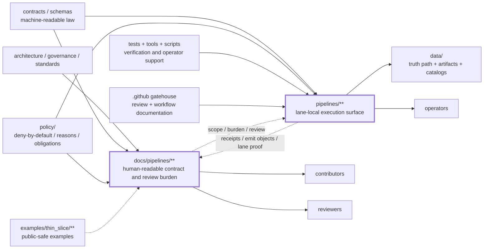

<!-- [KFM_META_BLOCK_V2]
doc_id: kfm://doc/NEEDS-VERIFICATION
title: pipelines
type: standard
version: v1
status: draft
owners: @bartytime4life
created: NEEDS-VERIFICATION
updated: NEEDS-VERIFICATION
policy_label: NEEDS-VERIFICATION
related: ["../README.md", "../architecture/", "../governance/", "../standards/", "../runbooks/", "./ssurgo_to_catchment.md", "../../pipelines/README.md", "../../pipelines/soils/gssurgo-ks/README.md", "../../pipelines/wbd-huc12-watcher/README.md", "../../.github/README.md", "../../apps/", "../../packages/", "../../contracts/", "../../schemas/", "../../policy/", "../../data/", "../../tests/", "../../tools/", "../../scripts/", "../../examples/thin_slice/README.md", "../../examples/thin_slice/hydrology/README.md", "../../.github/workflows/"]
tags: [kfm, pipelines, docs]
notes: ["Grounded in current public repo surfaces plus March-April 2026 KFM doctrine.", "Current public docs/pipelines/ tree verifies README.md plus ssurgo_to_catchment.md.", "Current public repo root also verifies a sibling /pipelines/ execution surface with README.md plus visible soils/gssurgo-ks and wbd-huc12-watcher child lane READMEs.", "doc_id, created, updated, and policy_label need direct steward verification before merge."]
[/KFM_META_BLOCK_V2] -->

# pipelines

Governed pipeline documentation for KFM: what a pipeline does, what it emits, what gates it must pass, and what it must never quietly imply.

> [!IMPORTANT]
> This directory is part of KFM's **governed documentation surface**, not a loose notes folder. Pipeline docs here should strengthen inspectability across source intake, validation, promotion, publication, correction, and rollback.

> [!NOTE]
> This README is intentionally evidence-bounded. It distinguishes between:
> - **CONFIRMED** current public repo structure
> - **INFERRED** support-corpus, historical, or doctrine-consistent references not reverified in the current public tree
> - **PROPOSED** structure or conventions that fit KFM doctrine
> - **UNKNOWN / NEEDS VERIFICATION** implementation details not proven in the current visible repo state

**Status:** experimental  
**Owners:** `@bartytime4life`  
**Path:** `docs/pipelines/README.md`  
**Repo role:** directory contract for human-readable pipeline specs, runbooks, artifact expectations, and boundary guidance that sit beside the root `/pipelines/` execution surface


**Quick jumps:** [Scope](#scope) · [Repo fit](#repo-fit) · [Accepted inputs](#accepted-inputs) · [Exclusions](#exclusions) · [Directory tree](#directory-tree) · [Quickstart](#quickstart) · [Usage](#usage) · [Diagram](#diagram) · [Reference tables](#reference-tables) · [Task list](#task-list--definition-of-done) · [FAQ](#faq) · [Appendix](#appendix)

---

## Scope

This directory is for **pipeline-facing documentation** inside the `docs/` governed surface.

Use it for material such as:

- pipeline specifications
- operator runbooks or runbook pointers tied to one pipeline or family
- source onboarding notes tied to one pipeline or family
- validation and promotion criteria
- artifact and receipt expectations
- replay, rollback, and correction guidance
- human-readable links between source intake, governed processing, catalog closure, and published outputs

The emphasis is not "how to improvise a script." The emphasis is **how a pipeline participates in KFM's governed truth path** and what must stay visible under review.

[Back to top](#pipelines)

## Repo fit

**Path:** `docs/pipelines/README.md`

### Upstream anchors

- [`../README.md`](../README.md) — docs-wide contract and documentation posture
- [`../architecture/`](../architecture/) — architectural doctrine and system placement
- [`../governance/`](../governance/) — policy, stewardship, review, and release controls
- [`../standards/`](../standards/) — shared conventions and document rules
- [`../runbooks/`](../runbooks/) — operator procedure home when guidance becomes lifecycle-operational

### Current verified local neighbors

| Path | Current role |
|---|---|
| [`./README.md`](./README.md) | Directory contract and index for pipeline docs |
| [`./ssurgo_to_catchment.md`](./ssurgo_to_catchment.md) | Draft child pipeline doc for a focused soil-to-catchment derivation lane |

### Surface split: `docs/pipelines/` vs `/pipelines/`

| Surface | Current public role | Current visible public-main state |
|---|---|---|
| [`docs/pipelines/`](./) | human-readable pipeline contract, review posture, and boundary guidance | `README.md` + `ssurgo_to_catchment.md` |
| [`../../pipelines/`](../../pipelines/) | lane-local execution surface for fetch / transform / validate / emit work | `README.md` + `soils/gssurgo-ks/README.md` + `wbd-huc12-watcher/README.md` |
| [`../../.github/README.md`](../../.github/README.md) | repo gatehouse for review, disclosure, workflow documentation, and watcher/control-plane scaffolding | `.github/workflows/` and `.github/watchers/` are README-only on public `main` |

> [!IMPORTANT]
> These surfaces are related but **not interchangeable**. `docs/pipelines/` explains burden, boundaries, and review. Root `/pipelines/` is where lane-local execution work belongs when it becomes more than documentation.

### Adjacent repository surfaces

- [`../../pipelines/README.md`](../../pipelines/README.md) — execution-family index for lane-local pipeline and watcher work
- [`../../pipelines/soils/gssurgo-ks/README.md`](../../pipelines/soils/gssurgo-ks/README.md) — current visible soils execution lane
- [`../../pipelines/wbd-huc12-watcher/README.md`](../../pipelines/wbd-huc12-watcher/README.md) — current visible watcher execution lane
- [`../../.github/README.md`](../../.github/README.md) — repo-level gatehouse and workflow/watcher boundary guidance
- [`../../apps/`](../../apps/) — runnable user-facing or operator-facing app surfaces
- [`../../packages/`](../../packages/) — reusable implementation modules and business-law surfaces
- [`../../contracts/`](../../contracts/) — machine-readable contract surfaces and interface expectations
- [`../../schemas/`](../../schemas/) — supporting schema surface; do not let it fork contract law
- [`../../policy/`](../../policy/) — governed policy logic and decision posture
- [`../../data/`](../../data/) — lifecycle zones, catalog artifacts, and publish-facing outputs
- [`../../tests/`](../../tests/) — verification, negative paths, release/correction drills
- [`../../tools/`](../../tools/) — validators, diff/probe tooling, and support utilities
- [`../../scripts/`](../../scripts/) — repeatable repo-local execution entrypoints
- [`../../examples/thin_slice/README.md`](../../examples/thin_slice/README.md) — public-safe, non-authoritative thin-slice examples
- [`../../examples/thin_slice/hydrology/README.md`](../../examples/thin_slice/hydrology/README.md) — current hydrology example lane
- [`../../.github/workflows/`](../../.github/workflows/) — CI/CD workflow documentation surface

### What this README is for

This README defines the **directory contract** for pipeline docs:

- what belongs here
- what should stay elsewhere
- how to describe gates, outputs, and failure states
- how to keep pipeline docs useful without overstating mounted implementation

### What it is not

This README is **not** the authoritative source for:

- executable policy
- machine-readable schemas
- CI enforcement
- runtime topology
- actual deployment state
- inferred implementation paths not visible in the active repo surface

Link to those surfaces. Do not duplicate them casually.

[Back to top](#pipelines)

## Accepted inputs

Belongs here when it is a **human-readable** pipeline-facing document, such as:

- a pipeline family README
- a focused child pipeline spec for one transform or derivation lane
- an ingestion runbook or runbook pointer
- an artifact guide for vectors, rasters, tiles, catalogs, receipts, or provenance bundles
- a replay / rollback / supersession note
- a review checklist for publish readiness
- a contributor guide for adding or revising one governed pipeline lane

Typical source material for docs in this directory includes:

- implementation notes in [`../../packages/`](../../packages/) or [`../../apps/`](../../apps/)
- lane-local execution intent in [`../../pipelines/`](../../pipelines/)
- machine-readable contract references in [`../../contracts/`](../../contracts/)
- policy rules in [`../../policy/`](../../policy/)
- test expectations in [`../../tests/`](../../tests/)
- lifecycle and artifact obligations in [`../../data/`](../../data/)
- doctrinal guidance from `docs/architecture/`, `docs/governance/`, and related KFM manuals

## Exclusions

Does **not** belong here:

| Does not belong here | Put it here instead | Why |
|---|---|---|
| Lane-local execution code, fetch scripts, watcher configs, or emit helpers | `../../pipelines/` | The public repo now has a dedicated execution-family surface for lane work |
| Shared runtime or reusable implementation code | `../../packages/` or `../../apps/` | Code should live with its owning module or runtime |
| Machine-readable schemas | `../../contracts/` and related canonical schema surface(s) | This directory documents schemas; it should not fork contract law |
| Executable policy bundles and policy fixtures | `../../policy/` | Policy must stay reviewable and testable in its owning layer |
| Canonical lifecycle artifacts | `../../data/` | Docs are not the authoritative artifact store |
| Validation harnesses, fixtures, and regression suites | `../../tests/` | Verification needs its own governed surface |
| One-off helper scripts | `../../scripts/` or `../../tools/` | Operational code should not hide in docs |
| Illustrative sample payloads, walkthrough packs, or public-safe thin-slice explainer material | `../../examples/thin_slice/` | Examples are for explanation, not for silently becoming contract or release truth |
| Claims about live runtime or deployment state without proof | mark as `UNKNOWN` / `NEEDS VERIFICATION` | KFM prefers explicit incompleteness over persuasive overclaiming |

[Back to top](#pipelines)

## Directory tree

### Current verified documentation tree

```text
docs/
└── pipelines/
    ├── README.md
    └── ssurgo_to_catchment.md
```

The current public documentation lane is small but not empty: it contains this directory contract plus one sibling draft child doc.

### Current verified execution neighbor

```text
pipelines/
├── README.md
├── soils/
│   └── gssurgo-ks/
│       └── README.md
└── wbd-huc12-watcher/
    └── README.md
```

The current public repo now verifies a sibling execution surface. That makes boundary discipline more important, not less: `docs/pipelines/` should describe and point to that surface without quietly absorbing its implementation role.

### Support-corpus / historical / proposed expansion shapes

The broader KFM support corpus points to materials such as the following, but these should be treated as **INFERRED / NEEDS VERIFICATION** until rechecked in the active branch or a mounted checkout:

```text
docs/pipelines/
├── soil/
│   ├── sda-weekly/README.md
│   ├── differential-updates/README.md
│   └── soil_artifacts.md
```

```text
historical-or-support-corpus examples
├── src/pipelines/hydrology/nwis_watcher/README.md
├── src/pipelines/air_quality/fusion/
├── src/pipelines/air_quality/INGEST_FLOW.md
└── src/pipelines/air_quality/drift_monitor/README.md
```

> [!CAUTION]
> The current public repo now verifies **root `/pipelines/`** as the checked-in execution family. Keep older `src/pipelines/**` references visibly labeled as historical/support-corpus material unless the current branch proves that path family is live again.

[Back to top](#pipelines)

## Quickstart

### Inspect both the documentation lane and the execution neighbor

```bash
find docs/pipelines -maxdepth 3 -print | sort
find pipelines -maxdepth 4 -print | sort
```

### Read the visible child docs first

```bash
sed -n '1,240p' docs/pipelines/ssurgo_to_catchment.md
sed -n '1,220p' pipelines/README.md
sed -n '1,220p' pipelines/soils/gssurgo-ks/README.md
sed -n '1,220p' pipelines/wbd-huc12-watcher/README.md
```

### Re-read the repo guardrails before changing a lane

```bash
sed -n '1,220p' .github/README.md
sed -n '1,220p' contracts/README.md
sed -n '1,220p' policy/README.md
sed -n '1,220p' schemas/README.md
sed -n '1,220p' tests/README.md
sed -n '1,220p' data/README.md
```

### Add or revise a pipeline doc

1. Start from the **owning contract and lifecycle question**, not from formatting.
2. Confirm what is actually visible in the current repo surface.
3. Link the relevant contract, policy, data, test, tooling, runbook, and execution-lane surfaces.
4. State the pipeline's place in the truth path clearly.
5. Document what the pipeline emits and what must pass before promotion.
6. Name failure states, correction behavior, and replay/rollback expectations.
7. Mark anything not directly verified as `INFERRED`, `PROPOSED`, `UNKNOWN`, or `NEEDS VERIFICATION`.

### Minimal starter outline

```md
# <pipeline name>

One-line purpose.

## Scope
## Repo fit
## Inputs
## Outputs
## Lifecycle placement
## Validation gates
## Promotion / publish conditions
## Failure / rollback / correction
## Related contracts
## Related policy
## Related tests
## Evidence posture
```

### Link first, duplicate last

Prefer links to:

- the owning contract
- the governing policy surface
- the relevant lifecycle zone
- the validation harness
- the operator tool or script
- the release or proof object surface
- the relevant root `/pipelines/` lane when one exists
- a public-safe example lane when illustration helps but canonical truth should stay elsewhere

That keeps docs aligned to repo truth and reduces drift.

[Back to top](#pipelines)

## Usage

### Reading a pipeline doc

A useful pipeline doc here should let a maintainer answer five questions quickly:

1. What enters the pipeline?
2. What comes out?
3. What gates must pass before promotion or publication?
4. Which proof objects, receipts, or support artifacts should exist?
5. What happens when validation fails or a correction is required?

### Writing a pipeline doc

A strong doc in this directory should make the following explicit:

- source family or source families
- dominant artifact grain
- lifecycle placement
- whether outputs are authoritative, derived, contextual, or provisional
- validation and policy gates
- correction / replay / rollback posture
- where machine-readable truth lives
- whether there is a sibling execution lane under root `/pipelines/`
- what remains unverified

### Use `docs/pipelines/` and `/pipelines/` together, not interchangeably

| If the material is mainly… | Prefer this home | Why |
|---|---|---|
| reviewable explanation, burden, lifecycle, and proof expectations | `docs/pipelines/` | this surface helps humans review and govern the lane |
| lane-local execution steps, recipes, watchers, emitters, and smoke tests | `/pipelines/` | this is the checked-in execution-family surface on current public `main` |
| shared runtime code reused across lanes | `/packages/` or `/apps/` | reuse belongs with owning implementation modules |
| machine-checked contracts or policy law | `/contracts/`, `/schemas/`, `/policy/` | docs should point to law, not replace it |

> [!TIP]
> When a document starts to explain commands, config files, and lane-local emit objects more than it explains review burden, that is usually a sign the execution-shaped material belongs under root `/pipelines/`.

### Example material without truth drift

Use [`../../examples/thin_slice/`](../../examples/thin_slice/) for public-safe walkthroughs, sample payloads, and thin-slice explainers. Keep `docs/pipelines/` focused on requirements, review burden, and authoritative links into the governing surfaces.

### Naming guidance

Prefer names that reveal **function + source family**:

- `sda-weekly`
- `differential-updates`
- `soil_artifacts`
- `nwis-watcher`
- `drift-monitor`
- `ssurgo_to_catchment`

Avoid vague buckets such as:

- `misc`
- `temp`
- `new-pipeline`
- `notes`
- `pipeline2`

[Back to top](#pipelines)

## Diagram


```mermaid
flowchart LR
    A[architecture / governance / standards]
    B[docs/pipelines/**<br/>human-readable contract and review burden]
    C[pipelines/**<br/>lane-local execution surface]
    D[contracts / schemas<br/>machine-readable law]
    E[policy/<br/>deny-by-default / reasons / obligations]
    F[data/<br/>truth path + artifacts + catalogs]
    G[tests + tools + scripts<br/>verification and operator support]
    H[.github gatehouse<br/>review + workflow documentation]
    X[examples/thin_slice/**<br/>public-safe examples]

    A --> B
    D --> B
    E --> B
    X -.-> B

    D --> C
    E --> C
    G --> C
    H --> C
    C --> F

    B -.scope / burden / review .-> C
    C -.receipts / emit objects / lane proof .-> B

    B --> I[contributors]
    B --> J[reviewers]
    C --> K[operators]

    style B stroke-width:3px
    style C stroke-width:3px
```

### Interpretation

This directory is the **human-readable bridge** between doctrine, implementation, contracts, policy, lifecycle artifacts, and review. It matters because it keeps burden legible. It is not the runtime source of truth, and it should now be read explicitly alongside the sibling root `/pipelines/` execution family.

[Back to top](#pipelines)

## Reference tables

### What a pipeline doc here should carry

| Section | Required | Why |
|---|---:|---|
| Purpose | Yes | The reader should know the pipeline's job immediately |
| Repo fit | Yes | Keeps boundaries and ownership visible |
| Inputs | Yes | Prevents source-role drift |
| Outputs | Yes | Clarifies emitted artifacts |
| Validation gates | Yes | KFM is governed, not optimistic |
| Promotion / publish conditions | Yes | Release state matters |
| Failure / rollback / correction | Yes | Fail-closed behavior must be explicit |
| Related contract / policy / test links | Yes | Docs should point to the authoritative surfaces |
| Execution-neighbor links | Recommended | Helps readers move from explanation to checked-in lane work without guessing |
| Evidence posture | Yes | Prevents accidental overclaiming |
| Worked example | Recommended | Helps maintainers act under pressure |

### Evidence labels used in this directory

| Label | Meaning here |
|---|---|
| **CONFIRMED** | Directly supported by the current visible public repo surface or current doctrinal source material |
| **INFERRED** | Strongly implied by support material, adjacent repo context, or doctrine, but not directly reverified as current implementation fact |
| **PROPOSED** | Recommended structure or behavior consistent with KFM doctrine |
| **UNKNOWN** | Not verified strongly enough in the current session |
| **NEEDS VERIFICATION** | Must be checked before merge, release, or broad reuse |

### Path-status matrix

| Path | Current status | Notes |
|---|---|---|
| `docs/pipelines/README.md` | **CONFIRMED** | Present in current public `docs/pipelines/` |
| `docs/pipelines/ssurgo_to_catchment.md` | **CONFIRMED** | Present in current public `docs/pipelines/`; local contract/policy/test claims inside that doc remain its own review burden |
| `pipelines/README.md` | **CONFIRMED** | Present in current public repo root as the execution-family index |
| `pipelines/soils/gssurgo-ks/README.md` | **CONFIRMED** | Present as a visible soils execution lane README |
| `pipelines/wbd-huc12-watcher/README.md` | **CONFIRMED** | Present as a visible watcher execution lane README |
| `docs/pipelines/soil/sda-weekly/README.md` | **INFERRED / NEEDS VERIFICATION** | Mentioned in support material, not reverified in current public tree |
| `docs/pipelines/soil/differential-updates/README.md` | **INFERRED / NEEDS VERIFICATION** | Same |
| `docs/pipelines/soil/soil_artifacts.md` | **INFERRED / NEEDS VERIFICATION** | Same |
| `src/pipelines/hydrology/nwis_watcher/README.md` | **INFERRED / NEEDS VERIFICATION** | Historical or support-corpus mention; current public repo instead verifies root `/pipelines/` as the execution family |
| `src/pipelines/air_quality/fusion/` | **INFERRED / NEEDS VERIFICATION** | Same |
| `src/pipelines/air_quality/drift_monitor/README.md` | **INFERRED / NEEDS VERIFICATION** | Same |

### Where pipeline-related material belongs

| Material | Best home | Why |
|---|---|---|
| Directory contract, burden, review posture, doc-only child specs | `docs/pipelines/` | this surface keeps human-readable obligations visible |
| Lane-local recipes, watcher configs, emit helpers, and smoke tests | `pipelines/` | current public repo treats this as the execution-family surface |
| Shared modules reused across multiple lanes | `packages/` or `apps/` | reuse should live with implementation ownership |
| Canonical contracts, schemas, and envelope shapes | `contracts/` / `schemas/` | these are machine-readable law |
| Executable policy bundles and policy fixtures | `policy/` | governance must stay testable and enforceable |
| Truth-path artifacts, receipts, catalog entries, and published datasets | `data/` | docs are not the sovereign artifact store |

### Current repo-fit cautions

| Caution | Why it matters |
|---|---|
| The public repo now has both `docs/pipelines/` and root `/pipelines/` | Do not blur review docs and execution lanes into one ambiguous surface |
| `.github/workflows/` and `.github/watchers/` are README-only on public `main` | Do not imply checked-in workflow YAML or mounted watcher jobs from those paths alone |
| `contracts/` and `schemas/` both exist publicly | Do not fork machine truth across both surfaces or casually restate contract law here |
| `docs/pipelines/` currently verifies a directory README plus one sibling draft child doc | Describe the docs lane as small, not empty |
| `pipelines/` currently verifies a README plus two child lane READMEs | Describe the execution lane as present but still README-light, not fully proved runtime automation |
| `examples/thin_slice/` exists as a public-safe example lane | Use it for illustration, not as proof of release, policy enforcement, or mounted runtime behavior |

[Back to top](#pipelines)

## Task list / Definition of Done

A directory-level pipeline README or child pipeline doc is ready when:

- [ ] purpose is obvious from the first screen
- [ ] repo fit and path are explicit
- [ ] accepted inputs and exclusions are clear
- [ ] related contract / policy / data / test surfaces are linked
- [ ] any relevant sibling root `/pipelines/` lane links are included
- [ ] lifecycle placement is stated
- [ ] validation gates are documented
- [ ] promotion / publish conditions are documented
- [ ] rollback / replay / correction behavior is documented
- [ ] evidence posture is explicit
- [ ] docs-vs-execution placement is not ambiguous
- [ ] any historical or support-corpus paths are labeled honestly
- [ ] no section implies mounted implementation that was not actually checked
- [ ] any illustrative example links point to public-safe example lanes rather than masquerading as canonical proof
- [ ] at least one meaningful diagram improves comprehension
- [ ] the file remains readable in GitHub without external explanation

> [!CAUTION]
> "Looks right" is not a Definition of Done in KFM. A shorter doc with visible uncertainty is safer than a polished doc that quietly upgrades assumptions into fact.

[Back to top](#pipelines)

## FAQ

### Why keep pipeline docs under `docs/` at all?

Because KFM treats documentation as part of the governed delivery surface. Code alone rarely communicates lifecycle placement, promotion burden, correction posture, and trust-visible review obligations well enough.

### Why do both `docs/pipelines/` and `/pipelines/` exist?

Because they solve different problems. `docs/pipelines/` explains burden, scope, and review. Root `/pipelines/` is the checked-in execution family for lane-local work. Keeping them separate makes it easier to see when prose is describing a lane versus when code, configs, or watcher logic are actually present.

### Should machine-readable schemas be copied into this directory?

No. Link them. Duplication creates drift unless there is a strict synchronization rule.

### Does a pipeline doc prove that the pipeline is implemented?

No. A pipeline doc is documentation evidence, not implementation proof.

### Where should operational runbooks live?

Use the nearest stable home consistent with local repo convention. Shared runbooks may belong in [`../runbooks/`](../runbooks/); pipeline-specific runbooks may live beside the relevant pipeline doc when that improves review and operator clarity.

### Where should illustrative payloads or thin-slice walkthroughs live?

Use [`../../examples/thin_slice/`](../../examples/thin_slice/) and its nested lanes for public-safe examples. Keep this directory focused on governed requirements, proof burden, and boundary guidance.

### What is the safest default when rights, sensitivity, or source trust is unclear?

Document the uncertainty, link the governing surface, and default to review-required / fail-closed behavior instead of implying broad publication.

[Back to top](#pipelines)

## Appendix

<details>
<summary><strong>Appendix A — Suggested child README pattern</strong></summary>

```md
# <pipeline slug>

One-line purpose.

> Status: experimental|active|stable
> Owners: ...
> Path: ...
> Quick jumps: Scope · Inputs · Outputs · Gates · Failure · Links

## Scope
## Repo fit
## Inputs
## Exclusions
## Directory tree
## Quickstart
## Usage
## Diagram
## Reference tables
## Task list
## FAQ
## Appendix
```

</details>

<details>
<summary><strong>Appendix B — Pipeline documentation anti-patterns</strong></summary>

Avoid these:

- treating a support-corpus path as a verified live repo path
- copying schema content into Markdown without a sync rule
- hiding failure states behind happy-path prose
- documenting derived surfaces as authoritative by omission
- naming a target-state workflow as if it were confirmed current CI behavior
- mixing doctrine, implementation, and speculation without labels
- using example lanes as if they were release proof or policy evidence
- describing root `/pipelines/` execution work as if it automatically belongs under `docs/pipelines/`

</details>

<details>
<summary><strong>Appendix C — Why this directory can stay small</strong></summary>

A good pipelines directory does not need to be large to be useful. In the current public tree, this directory is intentionally small and can still do meaningful work by:

- defining the boundary
- naming the trust posture
- pointing to the real governing surfaces
- linking to the sibling execution-family surface at root `/pipelines/`
- carrying one or more focused child docs when a pipeline lane deserves isolated review
- keeping illustrative walkthrough material in separate example lanes

That is a stronger starting point than a busy subtree full of stale assumptions.

</details>
