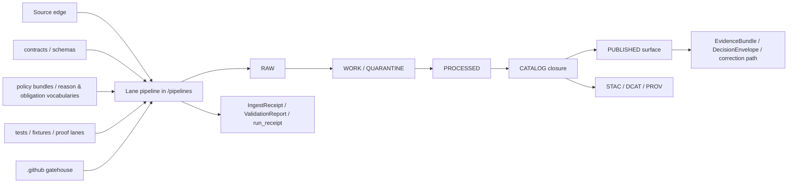

<!-- [KFM_META_BLOCK_V2]
doc_id: kfm://doc/NEEDS-VERIFICATION
title: pipelines
type: standard
version: v1
status: draft
owners: @bartytime4life; NEEDS VERIFICATION for narrower /pipelines/ ownership
created: YYYY-MM-DD
updated: YYYY-MM-DD
policy_label: public
related: [../README.md, ../.github/README.md, ../contracts/README.md, ../data/README.md, ../policy/README.md, ../schemas/README.md, ../tests/README.md, ./soils/gssurgo-ks/README.md, ./wbd-huc12-watcher/README.md]
tags: [kfm, pipelines]
notes: [Current public-main evidence confirms the directory and two child lane READMEs; narrower ownership, runnable workflow coverage, and internal file inventory still need verification.]
[/KFM_META_BLOCK_V2] -->

# pipelines

Governed pipeline lanes for source intake, normalization, validation, packaging, and review-ready promotion work.

> [!IMPORTANT]
> `pipelines/` is an execution surface, not a shortcut around KFM governance.
> Work here should inherit contracts, policy, tests, receipts, catalog closure, and correction behavior rather than bypass them.

## Status snapshot

| Field | Value |
|---|---|
| **Status** | `experimental` |
| **Owners** | `@bartytime4life` *(global fallback owner confirmed; narrower `/pipelines/` ownership needs verification)* |
| **Scope** | lane-level pipeline and watcher surfaces |
| **Current public-main signal** | `README-only directory index + 2 visible child lane READMEs` |
| **Trust posture** | **CONFIRMED** current public directory presence; **INFERRED** lane intent from adjacent docs; **PROPOSED** richer starter tree where not directly surfaced |


**Quick jumps:** [Scope](#scope) · [Repo fit](#repo-fit) · [Inputs](#inputs) · [Exclusions](#exclusions) · [Directory tree](#directory-tree) · [Quickstart](#quickstart) · [Usage](#usage) · [Diagram](#diagram) · [Current lane map](#current-lane-map) · [Task list](#task-list) · [FAQ](#faq)

---

## Scope

`/pipelines/` is the repository surface for **lane-specific execution work**: fetch, normalize, validate, package, diff, emit receipts, and prepare release-bearing artifacts for governed review and publication.

In KFM terms, pipeline work is downstream of doctrine and upstream of outward publication:

- downstream of **contracts**, **schemas**, **policy bundles**, **tests**, and **runbooks**
- upstream of **catalog closure**, **review**, **release manifests**, **EvidenceBundle resolution**, and public-safe delivery

This directory should favor the **smallest artifact-bearing move** over speculative breadth. A good lane proves one real slice end to end. A weak lane promises five future systems and proves none.

## Repo fit

**Path:** `pipelines/README.md`

| Direction | Relationship | Paths |
|---|---|---|
| **Upstream doctrine & guardrails** | Defines what pipeline work must obey | [`../README.md`](../README.md), [`../.github/README.md`](../.github/README.md), [`../contracts/README.md`](../contracts/README.md), [`../policy/README.md`](../policy/README.md), [`../schemas/README.md`](../schemas/README.md), [`../tests/README.md`](../tests/README.md) |
| **Sibling execution context** | Adjacent implementation surfaces pipelines usually depend on | [`../data/README.md`](../data/README.md), [`../packages/README.md`](../packages/README.md), [`../infra/README.md`](../infra/README.md), [`../docs/`](../docs/) |
| **Downstream lane surfaces** | Current visible child pipeline lanes | [`./soils/gssurgo-ks/README.md`](./soils/gssurgo-ks/README.md), [`./wbd-huc12-watcher/README.md`](./wbd-huc12-watcher/README.md) |

### Operating reading rule

- **CONFIRMED**: paths and files directly visible on current public `main`
- **INFERRED**: architectural intent strongly implied by adjacent repo docs or lane READMEs
- **PROPOSED**: starter structure, commands, or graduation shape not yet surfaced as checked-in reality
- **UNKNOWN / NEEDS VERIFICATION**: workflow coverage, deployment wiring, hidden branch-local files, runtime maturity, or narrower ownership not directly visible here

## Inputs

The following belong here when they are lane-local and execution-oriented:

- lane README files that define **purpose, source basis, outputs, and constraints**
- deterministic fetch / transform / validate / emit scripts
- watcher configs, recipe files, and lightweight orchestration shims
- lane-local fixtures, thresholds, and smoke tests
- receipt emitters, diff generators, and catalog-closure helpers
- stage-oriented artifact helpers for `RAW`, `WORK`, `QUARANTINE`, `PROCESSED`, or `CATALOG` transitions
- pipeline-local docs that explain **how a lane proves trust**, not just how it runs

### Typical good contents

| Kind | Why it belongs here |
|---|---|
| `recipe.sh`, `Makefile`, `watcher.yaml`, `validate.py` | execution and validation are pipeline concerns |
| lane-local `schema/` or fixtures | acceptable when scoped to that lane’s emitted artifacts |
| `run_receipt`, diff, or ingest helper code | pipeline evidence objects are part of lane proof |
| lane smoke tests | they prove the slice, not just describe it |

## Exclusions

The following do **not** belong here as their canonical home:

| Does **not** belong here | Canonical home instead |
|---|---|
| repository-wide contract families | [`../contracts/`](../contracts/) |
| repository-wide schema registries | [`../schemas/`](../schemas/) |
| shared policy bundles / reason registries / obligation registries | [`../policy/`](../policy/) |
| published artifacts treated as canonical outputs | [`../data/`](../data/) and governed release/catalog surfaces |
| shell UI / public route behavior | `../apps/`, `../docs/`, and UI doctrine-bearing docs |
| secrets, local credentials, ad hoc notebooks, or one-off operator scratch files | not in-repo, or lane-specific ignored local workspace |
| speculative runtime claims not backed by checked-in evidence | nowhere until verified |

> [!NOTE]
> A pipeline may **reference** contracts, schemas, policy, and release artifacts, but it should not quietly become their sovereign home unless the repository deliberately chooses that boundary.

## Current lane map

### CONFIRMED on current public `main`

| Lane | Current visible state | Reading posture |
|---|---|---|
| [`soils/gssurgo-ks/`](./soils/gssurgo-ks/) | README present | Lane intent is visible; richer internal tree remains **PROPOSED** unless surfaced in-branch |
| [`wbd-huc12-watcher/`](./wbd-huc12-watcher/) | README present | Watcher intent is visible; richer internal tree remains **PROPOSED** unless surfaced in-branch |
| `pipelines/README.md` | directory-level README path | Should serve as the index and reading guide for the lane family |

### Lane-specific notes

| Lane | What it appears to be for | Current caution |
|---|---|---|
| `soils/gssurgo-ks` | Kansas gSSURGO / soils ingest-and-package lane | Do not assume proposed helper files or emitted artifacts are already checked in |
| `wbd-huc12-watcher` | emit-only watcher lane around HUC-12 change detection / review flow | Do not assume active workflow YAML or runtime scheduler coverage from README prose alone |

## Directory tree

### Current public-main snapshot

```text
pipelines/
├── README.md
├── soils/
│   └── gssurgo-ks/
│       └── README.md
└── wbd-huc12-watcher/
    └── README.md
```

### PROPOSED graduation shape for a richer lane family

```text
pipelines/
├── README.md
├── soils/
│   └── gssurgo-ks/
│       ├── README.md
│       ├── Makefile
│       ├── recipe.sh
│       ├── validate.py
│       ├── stac_emit.py
│       ├── schema/
│       ├── RAW/
│       ├── WORK/
│       └── CATALOG/
└── wbd-huc12-watcher/
    ├── README.md
    ├── watcher.yaml
    ├── src/
    │   └── wbd_huc12_watcher/
    └── tests/
```

> [!CAUTION]
> The expanded tree above is a **starter target shape**, not a claim about current checked-in reality.

## Quickstart

### 1) Inspect the current public lane surface

```bash
find pipelines -maxdepth 4 -print | sort
```

### 2) Read the visible child lane docs first

```bash
sed -n '1,240p' pipelines/soils/gssurgo-ks/README.md
sed -n '1,260p' pipelines/wbd-huc12-watcher/README.md
```

### 3) Re-read the repo guardrails before changing a lane

```bash
sed -n '1,260p' .github/README.md
sed -n '1,260p' contracts/README.md
sed -n '1,260p' policy/README.md
sed -n '1,260p' schemas/README.md
sed -n '1,260p' tests/README.md
sed -n '1,260p' data/README.md
```

### 4) Treat README-only lanes as design-bearing until proven executable

A lane graduates from “interesting plan” to “repo-meaningful execution surface” when it can show at least:

1. one bounded source basis
2. one deterministic transform or watcher rule
3. one validation story
4. one receipt or equivalent evidence object
5. one reviewable publish candidate or catalog closure path

## Usage

### Add a new lane

Use a new subdirectory when the work has a distinct **source family**, **publication burden**, and **review story**.

A good new lane:

1. names the authoritative source family
2. states what counts as `RAW`, `WORK`, and release-safe output
3. identifies validation and failure conditions
4. says what receipt / closure / review object it should emit
5. links back to contracts, policy, schemas, tests, and runbooks it inherits

### Revise an existing lane

Prefer **strengthening evidence** over decorative rewriting.

Good revisions usually do one or more of these:

- sharpen the source basis
- separate **current public evidence** from **starter target shape**
- add missing exclusions
- add validation, diff, or correction behavior
- narrow an overclaim about current automation or runtime coverage

### Graduate a README-only lane

When moving from documentation to executable reality, keep the order disciplined:

1. **source descriptor / intake shape**
2. **validation path**
3. **receipt or dataset version object**
4. **catalog closure / release-safe packaging**
5. **review and correction path**
6. only then broader automation, shell integration, or lane expansion

## Diagram


```mermaid
flowchart LR
    A[Source edge] --> B[Lane pipeline in /pipelines]
    B --> C[RAW]
    C --> D[WORK / QUARANTINE]
    D --> E[PROCESSED]
    E --> F[CATALOG closure]
    F --> G[PUBLISHED surface]

    H[contracts / schemas] --> B
    I[policy bundles / reason & obligation vocabularies] --> B
    J[tests / fixtures / proof lanes] --> B
    K[.github gatehouse] --> B

    B --> L[IngestReceipt / ValidationReport / run_receipt]
    F --> M[STAC / DCAT / PROV]
    G --> N[EvidenceBundle / DecisionEnvelope / correction path]
```

## Pipeline maturity table

| Maturity signal | What reviewers should look for |
|---|---|
| **Source legibility** | authoritative source named, cadence/support visible, no hidden source switching |
| **Deterministic identity** | stable IDs, digest or hash logic, explicit diff basis where applicable |
| **Validation** | clear checks, quarantine or fail behavior, no silent pass-through |
| **Evidence objects** | receipts, reports, or closure objects are named and scoped |
| **Governed promotion** | review path exists; no direct publish shortcut implied |
| **Correction readiness** | supersession, rollback, or stale-visible behavior is acknowledged |
| **Truth-visible UX handoff** | lane can support Evidence Drawer / Focus / public-safe delivery without bluffing |

## Current reading posture for maintainers

| Statement | Status |
|---|---|
| `/pipelines/` exists on current public `main` | **CONFIRMED** |
| two child lanes are visibly documented here | **CONFIRMED** |
| hydrology-first / contract-first sequencing should shape early lane work | **CONFIRMED doctrinally** |
| soils is a strong adjacent watcher / packaging candidate after hydrology | **INFERRED from corpus + child lane presence** |
| current public `main` proves active workflow YAML or runtime scheduling for these lanes | **NOT CONFIRMED** |
| proposed helper files inside child lanes are already checked in | **NOT CONFIRMED** |

## Tables

### What a healthy pipeline lane should emit

| Object | Why it matters |
|---|---|
| **source descriptor** | says what is being admitted and under what burden |
| **ingest or run receipt** | proves a concrete fetch / watch / build happened |
| **validation report** | makes failure visible instead of implicit |
| **dataset version or equivalent lane output** | pins candidate or promoted subject set |
| **catalog closure** | binds outward metadata and lineage |
| **review / decision object** | keeps policy and human review explicit |
| **correction note or rollback hook** | preserves lineage when a surface changes |

### Review heuristics for this directory

| Ask this | Why |
|---|---|
| Does this lane prove anything end to end? | README-only ambition is not enough |
| Does it inherit shared policy/contracts instead of inventing its own doctrine? | prevents drift |
| Are negative outcomes named? | fail-closed behavior is part of trust |
| Is current public evidence separated from target shape? | avoids accidental overclaim |
| Could a reviewer trace source → validation → receipt → publish candidate? | that is the real maturity path |

## Task list

### Definition of done for a directory-level `pipelines/README.md`

- [ ] indexes the current visible lane family
- [ ] clearly states what belongs in `/pipelines/`
- [ ] clearly states what does **not** belong here
- [ ] links to the child lane READMEs
- [ ] distinguishes **current public snapshot** from **starter target shape**
- [ ] includes at least one meaningful pipeline/lifecycle diagram
- [ ] names trust-bearing artifacts and failure conditions
- [ ] avoids inventing checked-in workflows, manifests, or runtime coverage
- [ ] leaves ownership and automation gaps visible where not yet verified

### Definition of done for a child lane graduating beyond README-only

- [ ] authoritative source family identified
- [ ] lane-local quickstart exists
- [ ] at least one deterministic validation path exists
- [ ] at least one receipt / closure / report object is emitted
- [ ] tests or fixtures exist
- [ ] publish path is review-bearing
- [ ] correction or rollback story is visible
- [ ] public-safe vs steward-only distinctions are explicit where needed

## FAQ

### Why is this directory so strict about overclaiming?

Because KFM treats pipeline work as part of the evidence system, not merely as automation. A lane that sounds advanced but cannot show its source, checks, receipts, and publish path creates trust debt.

### Why point back to `contracts/`, `policy/`, `schemas/`, and `tests/` so often?

Because pipeline code should **consume** those repo-wide guardrails, not quietly redefine them lane by lane.

### Why is hydrology the preferred first slice?

Because the doctrine repeatedly favors a public-safe, place/time-rich, operationally legible first proof slice before broader expansion. That sequencing keeps the first real proof tractable.

### Why call out soils here?

Because the current public tree already includes a soils lane, and the surrounding KFM doctrine treats soils as a strong adjacent candidate after hydrology.

### Does a README in a child lane prove runnable automation exists?

No. It proves the lane is being shaped and named. Runnable workflow, scheduler, or deployment claims need direct evidence in the branch.

### Should a watcher publish directly?

No. A watcher may detect, normalize, diff, and prepare evidence, but publishability still belongs to governed review, closure, and correction-aware release behavior.

### Where should lane-specific changelogs or runbooks live?

Inside the lane or the owning runbook/docs surface, unless the effect is repo-wide enough to belong in a higher-level changelog or architecture document.

## Appendix

<details>
<summary><strong>Evidence boundary note</strong></summary>

This README is written to match the current public-main evidence that is directly visible now.

It intentionally avoids claiming:

- active checked-in workflow YAML for pipeline lanes
- live scheduler coverage
- branch-local helper files not visible in the current public tree
- deployment overlays, secrets posture, or runtime health
- narrower `/pipelines/` ownership beyond what is actually evidenced

</details>

<details>
<summary><strong>Suggested review sequence for future maintainers</strong></summary>

1. Read this file.
2. Read each child lane README.
3. Re-read `.github/README.md` for gatehouse posture.
4. Confirm shared contract/policy/schema/test homes before adding lane-local copies.
5. Only then add or revise execution code.
6. If a lane starts emitting public-facing artifacts, add the correction and rollback story at the same time.

</details>

<details>
<summary><strong>Backlog candidates that fit this directory well</strong></summary>

- a first real hydrology proof lane with receipts and closure objects
- a stronger soils watcher pilot with deterministic diff and signed receipt
- lane-local smoke tests that prove fail-closed behavior
- lane-local examples that show reviewable publish candidates rather than direct mutation
- directory links to runbooks once those are verified in-branch

</details>

[Back to top](#pipelines)
