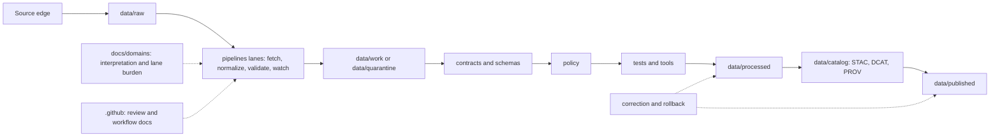

<!-- [KFM_META_BLOCK_V2]
doc_id: kfm://doc/TBD-PIPELINES-README-UUID
title: pipelines
type: standard
version: v1
status: draft
owners: @bartytime4life
created: YYYY-MM-DD
updated: 2026-04-12
policy_label: public
related: [../README.md, ../.github/README.md, ../.github/workflows/README.md, ../docs/README.md, ../data/README.md, ../data/registry/README.md, ../data/catalog/stac/README.md, ../contracts/README.md, ../policy/README.md, ../schemas/README.md, ../tests/README.md, ./soils/README.md, ./soils/gssurgo-ks/README.md, ./wbd-huc12-watcher/README.md, ./hls-ndvi/README.md, ./ssurgo_to_catchment.md]
tags: [kfm, pipelines, execution, governance]
notes: [Original creation date NEEDS VERIFICATION. Current public-main tree confirms this top-level surface exists, but deeper runtime maturity inside each lane remains lane-specific and must not be inferred from presence alone.]
[/KFM_META_BLOCK_V2] -->

# `pipelines/`

Governed execution-family index for KFM lane-local fetch, transform, validate, watch, and emit work.

| Field | Value |
|---|---|
| **Status** | Experimental |
| **Owners** | `@bartytime4life` *(current public `CODEOWNERS` fallback; narrower `/pipelines/` ownership NEEDS VERIFICATION)* |
| **Path** | `pipelines/README.md` |
| **Badges** |      |
| **Quick jumps** | [Scope](#scope) · [Repo fit](#repo-fit) · [Inputs](#accepted-inputs) · [Exclusions](#exclusions) · [Directory tree](#directory-tree) · [Quickstart](#quickstart) · [Usage](#usage) · [Diagram](#diagram) · [Lane registry](#current-lane-registry) · [Definition of done](#definition-of-done) · [FAQ](#faq) |
| **Accepted inputs** | Lane-local README files, watcher notes, recipe docs, execution helpers, lane-scoped validation notes, and tightly related runbook material that stays specific to pipeline work. |
| **Exclusions** | Repo-wide doctrine, shared contracts, shared schemas, policy bundles, canonical data artifacts, generic architecture prose, and unverified runtime claims. |

> [!IMPORTANT]
> Current public `main` confirms that `/pipelines/` is a real top-level repo surface.
>
> It does **not** by itself prove active schedulers, emitted receipts, live workflow YAML wiring, catalog promotion, or production runtime behavior for every child lane.

> [!NOTE]
> This README keeps five labels separate on purpose: `CONFIRMED`, `INFERRED`, `PROPOSED`, `UNKNOWN`, and `NEEDS VERIFICATION`.

## Scope

`/pipelines/` is the root execution-family surface for KFM’s lane-local pipeline work.

In this repo, that means this directory should help a maintainer answer four practical questions quickly:

1. What execution lanes are visibly present right now?
2. What belongs in this tree versus `docs/`, `data/`, `contracts/`, `policy/`, or `.github/`?
3. What proof-bearing expectations should a serious KFM pipeline lane name?
4. Which parts of the current tree are mature, thin, drifted, or still placeholder-only?

A good `/pipelines/` README should therefore behave as an **orientation index**, not as a second architecture manual and not as a vague promise that hidden automation already exists.

| At a glance | Meaning |
|---|---|
| **Primary job** | Index lane-local execution surfaces. |
| **Truth posture** | Presence is `CONFIRMED`; deeper runtime behavior is lane-specific and often `UNKNOWN` unless shown. |
| **Adjacent law** | Shared rules still live in `../contracts/`, `../schemas/`, `../policy/`, `../tests/`, and `../data/`. |
| **Delivery posture** | Pipelines prepare or validate truth-bearing artifacts; they do not bypass governed promotion. |
| **Placement rule** | Keep lane-specific execution material here; move broad doctrine and interpretation outward. |

[Back to top](#pipelines)

## Repo fit

`/pipelines/` sits below the repo root and beside the other load-bearing surfaces that make KFM governable.

### Upstream and adjacent surfaces

| Surface | Relationship to `/pipelines/` | Use it for |
|---|---|---|
| [`../README.md`](../README.md) | Repo-wide identity and navigation | Project purpose, truth posture, high-level placement |
| [`../.github/README.md`](../.github/README.md) | Gatehouse / contribution / automation-facing documentation | PR flow, templates, workflow-doc posture |
| [`../.github/workflows/README.md`](../.github/workflows/README.md) | Workflow documentation surface | Current public workflow-doc inventory and automation notes |
| [`../docs/README.md`](../docs/README.md) | Narrative and reference documentation | Broad architecture, doctrine, guides, historical context |
| [`../data/README.md`](../data/README.md) | Truth-path data surface | RAW / WORK / PROCESSED / CATALOG / PUBLISHED placement |
| [`../data/registry/README.md`](../data/registry/README.md) | Source admission layer | Source descriptors and registry-facing intake contracts |
| [`../data/catalog/stac/README.md`](../data/catalog/stac/README.md) | Outward catalog surface | STAC-facing release metadata and closure expectations |
| [`../contracts/README.md`](../contracts/README.md) | Shared machine-checkable contract surface | Schemas, envelopes, proof objects, interface contracts |
| [`../schemas/README.md`](../schemas/README.md) | Shared schema registry | Reusable JSON/YAML/schema law |
| [`../policy/README.md`](../policy/README.md) | Policy-as-code surface | Default-deny / fail-closed rules and review logic |
| [`../tests/README.md`](../tests/README.md) | Verification surface | Smoke, integration, contract, and gate checks |

### Downstream / child lane surfaces currently visible

| Child path | Role |
|---|---|
| [`./hls-ndvi/README.md`](./hls-ndvi/README.md) | Remote-sensing / NDVI lane stub with current-tree drift that should be normalized |
| [`./soils/README.md`](./soils/README.md) | Parent soils execution index |
| [`./soils/gssurgo-ks/README.md`](./soils/gssurgo-ks/README.md) | Kansas gSSURGO execution slice |
| [`./wbd-huc12-watcher/README.md`](./wbd-huc12-watcher/README.md) | Hydrologic boundary watcher lane |
| [`./ssurgo_to_catchment.md`](./ssurgo_to_catchment.md) | Placeholder document; visible but not yet a mature lane surface |

### Working rule

A lane can live here even if it is still thin. What matters is that the README tells the truth about that thinness instead of smoothing it into implied maturity.

[Back to top](#pipelines)

## Accepted inputs

Material belongs in `/pipelines/` when it is **execution-near**, **lane-specific**, and still makes sense even if detached from repo-wide doctrine prose.

### Good fits for this directory

| Input class | Example | Why it belongs here |
|---|---|---|
| Lane-local README | `pipelines/soils/README.md` | Explains one execution family without turning into global doctrine |
| Child execution slice | `pipelines/soils/gssurgo-ks/README.md` | Keeps recipe, outputs, and burden close to the lane |
| Watcher-facing notes | `pipelines/wbd-huc12-watcher/README.md` | Documents one polling / diff / refresh surface |
| Lane-scoped recipe docs | `ssurgo_to_catchment.md` *(once matured)* | Useful when tightly bound to a specific pipeline path |
| Lane-local fixtures or helper notes | small validator or smoke-test usage docs | Close to the exact execution surface they describe |
| Short rollback / correction notes | lane-specific correction drill guidance | Keeps failure handling near the lane that owns it |

### Strong signals that something belongs elsewhere

- It explains KFM as a whole rather than one execution family.
- It defines reusable contracts for multiple surfaces.
- It is primarily policy logic.
- It is primarily canonical data or catalog output.
- It describes workflow governance but not a specific lane.
- It reads like a domain essay rather than an execution surface.

[Back to top](#pipelines)

## Exclusions

The easiest way to make `/pipelines/` noisy is to let it become a dumping ground for material that already has a better home.

| Keep out of `/pipelines/` | Put it here instead | Why |
|---|---|---|
| Repo-wide doctrine and system identity | [`../docs/`](../docs/) or [`../README.md`](../README.md) | Avoid duplicating authoritative architecture prose |
| Shared envelopes, schemas, and proof-object law | [`../contracts/`](../contracts/) and [`../schemas/`](../schemas/) | Prevent lane docs from inventing contract drift |
| Policy bundles and gate logic | [`../policy/`](../policy/) | Keeps default-deny logic centralized |
| Canonical artifacts and release-bearing data | [`../data/`](../data/) | Pipelines prepare or validate these; they do not replace them |
| Generic workflow governance | [`../.github/`](../.github/) | Contribution and CI posture belongs in the gatehouse |
| Broad domain interpretation | [`../docs/domains/`](../docs/domains/) | Domain worldview should not be buried in execution trees |
| Shared helpers used across apps/packages | [`../packages/`](../packages/) or [`../tools/`](../tools/) | Preserve clean reuse boundaries |

> [!TIP]
> When in doubt, use this rule: **link first, duplicate last**. A lane README should point to shared law instead of restating it loosely.

[Back to top](#pipelines)

## Directory tree

Current public-tree snapshot of the root execution-family surface:

```text
pipelines/
├── README.md
├── hls-ndvi/
│   └── README.md
├── soils/
│   ├── README.md
│   └── gssurgo-ks/
│       └── README.md
├── wbd-huc12-watcher/
│   └── README.md
└── ssurgo_to_catchment.md
```

### Current public-tree reading

- The tree is **documentation-forward** right now.
- Multiple visible child surfaces are README-led rather than code-heavy.
- That is acceptable as long as the docs remain explicit about what is present versus merely intended.
- The root README should therefore describe the directory as an **execution-family index with uneven lane maturity**, not as a fully proven automation hub.

[Back to top](#pipelines)

## Quickstart

### Inspect the current tree

```bash
ls -R pipelines
```

### Read the visible child surfaces in dependency-friendly order

```bash
sed -n '1,220p' pipelines/README.md
sed -n '1,220p' pipelines/soils/README.md
sed -n '1,220p' pipelines/soils/gssurgo-ks/README.md
sed -n '1,220p' pipelines/wbd-huc12-watcher/README.md
sed -n '1,220p' pipelines/hls-ndvi/README.md
sed -n '1,120p' pipelines/ssurgo_to_catchment.md
```

### Cross-check adjacent governing surfaces before editing a lane

```bash
sed -n '1,220p' data/README.md
sed -n '1,220p' data/registry/README.md
sed -n '1,220p' data/catalog/stac/README.md
sed -n '1,220p' contracts/README.md
sed -n '1,220p' policy/README.md
sed -n '1,220p' tests/README.md
```

### Minimal edit posture

```bash
# 1) correct path/placement drift
# 2) keep current public tree truthful
# 3) add links before adding prose
# 4) separate CONFIRMED from PROPOSED
# 5) do not imply workflow/runtime proof you cannot surface
```

[Back to top](#pipelines)

## Usage

### Adding a new lane under `/pipelines/`

1. Create the lane directory and a README before adding deep helper sprawl.
2. Name the lane’s exact source family or execution burden.
3. State what the lane **reads**, what it **writes**, and what remains **out of scope**.
4. Link the lane to its governing shared surfaces:
   - contracts
   - schemas
   - policy
   - tests
   - data placement
   - domain interpretation docs
5. State the lane’s current truth posture honestly:
   - `CONFIRMED` current files
   - `INFERRED` structural expectations
   - `PROPOSED` future wiring
   - `UNKNOWN` runtime depth
6. Name correction / rollback posture if the lane could ever produce outwardly consequential artifacts.

### Revising an existing lane

Prefer **normalization** over reinvention:

- fix path drift
- align headings with adjacent repo READMEs
- tighten “what belongs here / not here”
- preserve strong burden language
- remove generic repo doctrine that already lives elsewhere
- keep placeholders visible until they are actually replaced

### Minimum lane questions every child README should answer

| Question | Why it matters |
|---|---|
| What exact pipeline family is this? | Prevents generic prose |
| What enters and leaves the lane? | Anchors real scope |
| What data lifecycle zones are touched? | Avoids RAW/WORK/PROCESSED confusion |
| What must pass before promotion? | Keeps pipeline docs proof-aware |
| What is confirmed in-tree right now? | Avoids runtime overclaiming |
| What remains proposed or unknown? | Keeps future work reviewable |
| What correction path exists if the lane is wrong? | Preserves KFM’s non-silent rewrite posture |

### Starter lane outline

```md
# Lane name

One-line purpose.

## Scope
## Repo fit
## Inputs
## Outputs
## Lifecycle placement
## Validation gates
## Promotion / publish conditions
## Failure, correction, and rollback
## Related contracts, policy, and tests
## Current truth posture
```

[Back to top](#pipelines)

## Diagram


```mermaid
flowchart LR
    A["Source edge"] --> B["data/raw"]
    B --> C["pipelines lanes: fetch, normalize, validate, watch"]
    C --> D["data/work or data/quarantine"]
    D --> E["contracts and schemas"]
    E --> F["policy"]
    F --> G["tests and tools"]
    G --> H["data/processed"]
    H --> I["data/catalog: STAC, DCAT, PROV"]
    I --> J["data/published"]

    K["docs/domains: interpretation and lane burden"] -.-> C
    L[".github: review and workflow docs"] -.-> C
    M["correction and rollback"] -.-> J
    M -.-> H
```

This diagram is intentionally simple: `/pipelines/` is not the whole system. It is the lane-local execution band between admitted sources and governed outward publication.

[Back to top](#pipelines)

## Tables

### Current lane registry

| Path | Current reading | Posture |
|---|---|---|
| `pipelines/README.md` | Root execution-family index, but current checked-in text needs role/path normalization | `CONFIRMED` file exists; revision needed |
| `pipelines/soils/README.md` | Strong parent execution index for soils | `CONFIRMED` |
| `pipelines/soils/gssurgo-ks/README.md` | Small but real child slice for Kansas gSSURGO work | `CONFIRMED` |
| `pipelines/wbd-huc12-watcher/README.md` | README-led watcher lane; current public inventory is doc-first | `CONFIRMED` |
| `pipelines/hls-ndvi/README.md` | Visible lane path whose own prose still carries outdated “proposed path” language | `CONFIRMED` path; normalization needed |
| `pipelines/ssurgo_to_catchment.md` | Placeholder-only artifact | `CONFIRMED` placeholder; not a mature lane |

### Placement matrix

| Material | Best home | Keep in `/pipelines/`? |
|---|---|---|
| Lane-local execution overview | `pipelines/<lane>/README.md` | Yes |
| Reusable contract schema | `contracts/` or `schemas/` | No |
| Rego / policy logic | `policy/` | No |
| Canonical data artifacts | `data/` | No |
| Review / workflow process docs | `.github/` | Usually no |
| Domain interpretation / burden notes | `docs/domains/` | Usually link, don’t duplicate |
| One-lane quickstart or smoke recipe | `pipelines/<lane>/README.md` or nearby helper doc | Yes |
| Placeholder concept note with no real lane shape | move, mature, or remove deliberately | Not for long |

### Proof-bearing expectations for serious lanes

The table below is **doctrine-aligned guidance**, not a claim that every visible child lane already emits each object today.

| Proof object / artifact | Why a lane should name it |
|---|---|
| `SourceDescriptor` | Shows source identity, rights, cadence, and admission posture |
| `IngestReceipt` | Anchors fetch reality instead of replay-by-memory |
| `ValidationReport` | Makes pass vs quarantine visible |
| `DatasetVersion` or equivalent processed identity | Prevents convenience outputs from becoming silent authority |
| STAC / DCAT / PROV closure | Makes outward release resolvable and inspectable |
| `run_receipt` / lane receipt | Captures one concrete execution event |
| `ReleaseManifest` / proof pack | Separates build success from publication |
| `CorrectionNotice` / rollback note | Preserves non-silent correction lineage |

### What a root `/pipelines/` README should avoid

| Anti-pattern | Why it hurts |
|---|---|
| Calling the whole tree “implemented” because directories exist | Presence is not runtime proof |
| Repeating repo-wide doctrine at full length | Creates drift and duplicate authority |
| Hiding placeholders | Makes cleanup harder to review |
| Moving lane burden into generic language | Weakens rights, sensitivity, and proof clarity |
| Treating workflow docs as live workflow proof | Public docs and live YAML are not the same evidence class |

[Back to top](#pipelines)

## Definition of done

A revision to this file is ready when all of the following are true:

- [ ] The title, purpose line, path, owners, status, and quick jumps are present.
- [ ] `/pipelines/` is described as an execution-family index, not as a generic docs bucket.
- [ ] Accepted inputs and exclusions are explicit.
- [ ] The current public tree is shown plainly.
- [ ] Every currently visible child surface is linked.
- [ ] The README does not imply live schedulers, emits, or production promotion without proof.
- [ ] Adjacent surfaces (`data/`, `contracts/`, `policy/`, `tests/`, `.github/`, `docs/`) are linked instead of re-explained loosely.
- [ ] At least one meaningful Mermaid diagram is included.
- [ ] A maintainer can tell which visible items are mature, thin, drifted, or placeholder-only.
- [ ] Correction / rollback expectations are not omitted for consequential lanes.
- [ ] No section feels visually dead or shapeless in GitHub rendering.

[Back to top](#pipelines)

## FAQ

### Does `/pipelines/` prove automation already runs?

No. It proves the surface exists. Runtime wiring, scheduled execution, emitted receipts, catalog promotion, and merge-blocking automation need their own direct evidence.

### Why keep placeholders visible instead of deleting them from the README?

Because current-tree truth matters. A visible placeholder is easier to normalize deliberately than a hidden one that surprises reviewers later.

### Should broad hydrology, soils, or hazards interpretation live here?

Only in short, execution-relevant form. Deeper worldview, burden, and publication interpretation should live in `docs/domains/` and be linked from here.

### Why is lane-by-lane truth labeling necessary?

Because KFM’s trust posture depends on not upgrading uncertainty through tone. A lane can be useful, documented, and still only partly proven.

### What is the best next improvement after this root README?

Normalize the visible child-lane drift:
1. correct root-path/role language in this file,
2. normalize `hls-ndvi/README.md` so its path statement matches current public reality,
3. either mature or retire `ssurgo_to_catchment.md`.

[Back to top](#pipelines)

## Appendix

<details>
<summary><strong>Current public normalization backlog</strong></summary>

| Item | Why it needs review |
|---|---|
| Root `pipelines/README.md` role/path language | Current checked-in prose behaves like a docs-surface README instead of a root execution-family index |
| `pipelines/hls-ndvi/README.md` path statement | The path is publicly visible, but the doc still describes it as not-yet-confirmed |
| `pipelines/ssurgo_to_catchment.md` | Placeholder-only file currently adds structure without real execution guidance |
| `/pipelines/` ownership granularity | Current public `CODEOWNERS` fallback covers the tree, but lane-specific ownership is not surfaced |

</details>

<details>
<summary><strong>Review posture for future additions</strong></summary>

Before expanding this tree, ask:

1. Is the new material truly lane-local?
2. Does it name inputs, outputs, and lifecycle placement?
3. Does it link to shared law instead of rephrasing it?
4. Does it keep current proof separate from planned wiring?
5. Does it leave a reviewer with fewer hidden assumptions than before?

</details>
