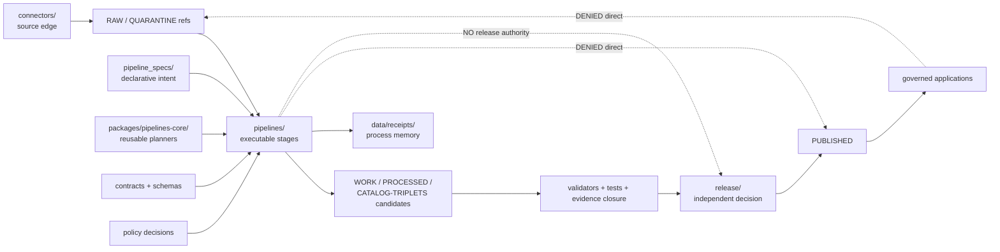

<!-- [KFM_META_BLOCK_V2]
doc_id: kfm://doc/pipelines-readme
title: pipelines/ — Governed Executable Pipeline and Orchestration Root
type: readme; root-readme; canonical-pipelines-root; executable-orchestration-boundary; non-publisher-index; compatibility-drift-index
version: v0.4
status: draft; repository-grounded; canonical-root-confirmed; mixed-maturity; selected-deterministic-planning-kernels-confirmed; direct-stage-shells-partially-placeholder; live-execution-unverified; production-unverified; non-authoritative
owners:
  - "@bartytime4life — verified CODEOWNERS review route"
  - "OWNER_TBD — Pipeline implementation steward"
  - "OWNER_TBD — Pipeline-spec steward"
  - "OWNER_TBD — Domain stewards"
  - "OWNER_TBD — Source, rights, and sensitivity steward"
  - "OWNER_TBD — Contract and schema steward"
  - "OWNER_TBD — Evidence and receipt steward"
  - "OWNER_TBD — Validation and CI steward"
  - "OWNER_TBD — Release, correction, and rollback steward"
  - "OWNER_TBD — Security reviewer"
  - "OWNER_TBD — Docs steward"
created: 2026-06-13
updated: 2026-08-08
supersedes: v0.3
prepared_under_prompt: KFM Repository Build-Out & Markdown Modernization Implementation Agent v6.0.0
policy_label: "public-doc; pipelines-root; executable-logic; non-publisher; no-source-authority; no-evidence-authority; no-policy-authority; no-release-authority; lifecycle-governed; receipt-aware; no-network-by-default; correction-aware; rollback-aware"
current_path: pipelines/README.md
root_profile: ROOT_FULL
truth_posture: >-
  CONFIRMED current same-path v0.3 README; adopted Directory Governance Standard v2
  through accepted ADR-0029; current pipelines tree with thirteen direct child lanes;
  current pipeline_specs v0.5 declarative boundary; selected deterministic no-network
  backfill-window and pipeline-resilience planning kernels with contracts, schemas,
  package modules, CLIs, fixtures, focused tests, and generated provenance; sampled
  direct ingest and normalize shells remain placeholder-sized; bounded non-publisher
  policy coverage; and no open pull request touching this file at discovery /
  PROPOSED a root-wide accepted request/result contract, active consumer registry,
  scheduler or executor, lifecycle-writer interface, common reason-code registry,
  durable idempotency and breaker stores, receipt persistence profile, correction
  propagation, and rollback automation /
  CONFLICTED connector-versus-ingest admission ownership, watcher ownership,
  proof-orchestration placement, generic cross-lane and biodiversity umbrellas,
  triplet and receipt-layout variants, and legacy aliases /
  UNKNOWN exhaustive runtime consumers, schedules, queues, database or outbox use,
  live network behavior, emitted pipeline receipts for every lane, current-main
  focused-test results, deployments, release use, and public effects /
  NEEDS VERIFICATION named steward assignments, complete consumer and activation
  matrix, source-rights decisions, required-check enforcement, first active governed
  executor, correction propagation, rollback drills, and production admission
evidence_snapshot:
  repository: bartytime4life/Kansas-Frontier-Matrix
  visibility: public
  base_ref: main
  base_commit: f3d24ac428f7e6a9631a2b1228d10ddc991e3f33
  base_tree: 23f52e6ea73c07054290b14fc86787e90c76ff26
  prior_blob: c2bee1db957a665b973b44aea8bda63bdd82b7e5
  pipelines_tree: 514e8746c3a9de6ef7c4bedc625e39dcc8be69ff
  pipeline_specs_tree: af01a540556ee9d9d06fe8240cffee3151f7482d
  canonical_directory_rules_blob: fd49a0b83e55cef52c1124281f093e263526898d
  direct_child_lanes: 13
  open_prs_touching_target: 0
  inventory_method: GitHub connector exact-file reads, commit-pinned tree inspection, bounded code and commit search, and open-PR/branch reconciliation
related:
  - ../docs/doctrine/directory-rules.md
  - ../docs/adr/ADR-0029-adopt-directory-governance-standard-v2.md
  - ../docs/architecture/directory-rules.md
  - ../pipeline_specs/README.md
  - ./ingest/README.md
  - ./normalize/README.md
  - ./validate/README.md
  - ./catalog/README.md
  - ./triplets/README.md
  - ./publish/README.md
  - ./rollback/README.md
  - ./watchers/README.md
  - ./domains/README.md
  - ./proofs/README.md
  - ./specs/README.md
  - ./cross_lane/README.md
  - ./biodiversity/README.md
  - ../packages/pipelines-core/README.md
  - ../packages/pipelines-core/src/pipelines_core/backfill_window.py
  - ../packages/pipelines-core/src/pipelines_core/pipeline_resilience.py
  - ../scripts/plan_backfill_window.py
  - ../scripts/plan_pipeline_resilience.py
  - ../tests/packages/pipelines_core/test_backfill_window.py
  - ../tests/packages/pipelines_core/test_pipeline_resilience.py
  - ../tests/packages/pipelines_core/test_pipeline_resilience_cli_projection.py
  - ../tests/policy/test_pipeline_connector_non_publisher.py
  - ../contracts/runtime/backfill_window_plan.md
  - ../contracts/runtime/pipeline_resilience_plan.md
  - ../schemas/contracts/v1/runtime/backfill_window_request.schema.json
  - ../schemas/contracts/v1/runtime/backfill_window_plan.schema.json
  - ../schemas/contracts/v1/runtime/pipeline_resilience_request.schema.json
  - ../schemas/contracts/v1/runtime/pipeline_resilience_plan.schema.json
  - ../docs/runbooks/pipeline-resilience.md
  - ../contracts/runtime/run_receipt.md
  - ../schemas/contracts/v1/runtime/run_receipt.schema.json
  - ../tools/validators/validate_run_receipt.py
  - ../data/receipts/pipeline/README.md
  - ../data/receipts/generated/README.md
  - ../release/README.md
  - ../apps/governed-api/README.md
  - ../.github/CODEOWNERS
tags:
  - kfm
  - pipelines
  - executable-logic
  - orchestration
  - lifecycle
  - non-publisher
  - pipeline-specs
  - deterministic-planning
  - resilience
  - backfill
  - receipts
  - evidence
  - policy
  - validation
  - correction
  - rollback
  - migration
notes:
  - "v0.4 refreshes this README against current main after the backfill-window and pipeline-resilience planning kernels landed."
  - "Selected planning kernels are real deterministic implementation, but they are side-effect-free decision tools rather than an active scheduler, lifecycle writer, queue worker, or production pipeline runtime."
  - "ADR-0029 is accepted and makes docs/doctrine/directory-rules.md the sole writable Directory Rules authority; the architecture copy remains a compatibility surface pending migration."
  - "This change modifies this README and its required generated provenance receipt only."
  - "No pipeline, source, specification, contract, schema, policy, fixture, test, workflow, lifecycle record, runtime, release object, deployment, or public artifact is activated or changed."
[/KFM_META_BLOCK_V2] -->

<a id="top"></a>
<a id="pipelines"></a>

# `pipelines/` — Governed Executable Pipeline and Orchestration Root

> **One-line purpose.** Own executable KFM pipeline logic and bounded orchestration—the **how** of admitted intake, transformation, validation, projection, readiness, correction, and rollback support—without becoming source authority, evidence authority, policy authority, release authority, or a public serving surface.

<p>
  <a href="#status"></a>
  <a href="#authority-level"></a>
  <a href="#confirmed-deterministic-planning-kernels"></a>
  <a href="#status"></a>
  <a href="#outputs"></a>
  <a href="#validation"></a>
</p>

> [!IMPORTANT]
> **A pipeline decision or run is not lifecycle promotion or publication.** A planner or runner may produce candidates, reports, receipts, blockers, projections, and release-review handoffs. It cannot make source material true, create an `EvidenceBundle` by assertion, approve policy, close review, issue a release decision, or move anything into `PUBLISHED` state by itself.

> [!CAUTION]
> **Planning kernels are not executors.** The repository now contains substantive deterministic backfill and resilience planners. They calculate bounded decisions without network or writes. Their existence does not establish an active scheduler, queue worker, database writer, source activation path, policy evaluator, promotion gate, or production runtime.

> [!WARNING]
> **Secrets and restricted payloads do not belong in code, specs, fixtures, logs, receipts, issues, or pull requests.** Credentials, private endpoints, protected coordinates, living-person records, DNA or genomic material, rare-species locations, archaeology details, private-land joins, infrastructure vulnerabilities, and unrestricted source payloads require approved handling outside ordinary public repository surfaces.

**Quick navigation**

| Root contract | Trust and operation | Maintenance |
|---|---|---|
| [Purpose](#purpose) · [Authority](#authority-level) · [Status](#status) · [Belongs](#what-belongs-here) · [Exclusions](#what-does-not-belong-here) | [Inputs](#inputs) · [Outputs](#outputs) · [Exposure](#public-exposure-and-sensitivity) · [Storage](#mutability-retention-generation-and-storage) · [Validation](#validation) · [Operating model](#lifecycle-and-non-publisher-operating-model) | [Review](#review-burden) · [Related](#related-folders) · [ADRs](#adrs-migrations-and-aliases) · [Directory map](#direct-child-directory-map) · [Last reviewed](#last-reviewed) · [Rollback](#lane-admission-migration-correction-and-rollback) · [No-loss](#v03-to-v04-no-loss-ledger) |

---

<a id="1-purpose"></a>

## Purpose

`pipelines/` is the canonical KFM responsibility root for executable pipeline stages and bounded orchestration.

It answers five questions:

1. Which admitted inputs and accepted declarative profile does a stage consume?
2. How does the stage execute deterministically and fail safely?
3. Which candidate outputs, reports, blockers, and receipt facts does it emit?
4. Which evidence, policy, review, release, correction, and rollback obligations remain outside the stage?
5. How can the stage be disabled, replayed, superseded, migrated, corrected, or rolled back without rewriting history?

### Responsibility split

```text
connectors/      = source-specific acquisition and admission-edge implementation
pipeline_specs/  = declarative run intent — WHAT may run
pipelines/       = executable transformation and orchestration — HOW work runs
packages/        = reusable multi-consumer logic used by pipelines or tools
data/            = lifecycle, evidence, receipt, proof, registry, and published instances
release/         = promotion, release, correction, withdrawal, and rollback decisions
apps/            = governed deployables and public or steward-facing surfaces
```

### Intended operating flow

```text
admitted SourceDescriptor and bounded source or lifecycle references
  -> accepted pipeline specification/profile and fixed digest
  -> caller, scope, identity, rights, sensitivity, and policy prechecks
  -> executable stage under pipelines/ or an admitted reusable package
  -> finite result plus candidate output references
  -> schema, contract, evidence, policy, and quality validation
  -> RunReceipt or accepted pipeline-receipt candidate
  -> governed WORK / QUARANTINE / PROCESSED / CATALOG-TRIPLETS handoff
  -> independent review and release gates
  -> PUBLISHED only through release authority
```

This is the **PROPOSED complete operating model**. Current evidence confirms selected pieces, not every arrow.

### Keystone invariants

Every pipeline change must preserve:

- `RAW -> WORK / QUARANTINE -> PROCESSED -> CATALOG / TRIPLETS -> PUBLISHED`;
- promotion as a governed state transition, never a file write, planner result, run result, merge, or deployment;
- source identity, source role, rights, sensitivity, and source-admission boundaries;
- `EvidenceRef -> EvidenceBundle` resolution when consequential claims depend on evidence;
- fail-closed policy behavior for unknown rights, access, sensitivity, review, or release state;
- deterministic identity, replay, idempotency, and explicit no-op behavior where practical;
- watcher and candidate-producer non-publisher discipline;
- receipt, proof, catalog, review, release, correction, and rollback object-family separation;
- visible correction, withdrawal, supersession, invalidation, and rollback lineage;
- public clients behind governed interfaces rather than pipeline or lifecycle internals.

[Back to top](#top)

---

<a id="2-root-authority"></a>

## Authority level

**Root class:** canonical implementation root.

**Authority owner:** pipeline execution and orchestration implementation. The named steward role remains **NEEDS VERIFICATION**; `@bartytime4life` is the current verified CODEOWNERS review route.

Accepted [ADR-0029](../docs/adr/ADR-0029-adopt-directory-governance-standard-v2.md) adopts the exact Directory Governance Standard v2 bytes at [`docs/doctrine/directory-rules.md`](../docs/doctrine/directory-rules.md). That standard assigns lifecycle transformation and orchestration to `pipelines/`, declarative run graphs and schedules to `pipeline_specs/`, reusable multi-consumer logic to `packages/`, and thin invocation wrappers to `scripts/`.

The internal `PROPOSED_FOR_ADOPTION` label remains inside the byte-pinned Directory Rules artifact, but the accepted ADR supplies the adoption decision. The full [`docs/architecture/directory-rules.md`](../docs/architecture/directory-rules.md) body is a read-only compatibility dependency pending a separately governed tombstone migration; it is not a second writable authority.

### Responsibility routing

| Concern | Owning surface | Pipeline role |
|---|---|---|
| Source acquisition and first admission | [`connectors/`](../connectors/) plus governed source registry | Consume admitted references or a controlled handoff; never infer authority from a URL or parser success. |
| Declarative stage, scope, cadence, profile, or run graph | [`pipeline_specs/`](../pipeline_specs/) | Resolve an accepted declaration; do not maintain a second spec authority here. |
| Executable transformation and orchestration | `pipelines/` | Own stage-specific behavior and bounded orchestration. |
| Reusable source-agnostic planning or shared logic | [`packages/`](../packages/) | Import reviewed package APIs; do not duplicate shared logic in stage wrappers. |
| Thin operator invocation | [`scripts/`](../scripts/) | Invoke governed implementations; scripts are not imported as production libraries. |
| Object meaning | [`contracts/`](../contracts/) | Consume accepted semantics; implementation code does not redefine them. |
| Machine shape | [`schemas/`](../schemas/) | Validate against accepted profiles; no parallel shape authority. |
| Allow, deny, hold, redact, generalize, or obligate | [`policy/`](../policy/) | Submit governed inputs and obey decisions; convenience code is not policy authority. |
| Lifecycle and accountability instances | [`data/`](../data/) | Use accepted writers and transitions; do not self-promote. |
| Tests and fixtures | [`tests/`](../tests/), [`fixtures/`](../fixtures/) | Provide deterministic positive and negative evidence outside implementation code. |
| Repository validators | [`tools/validators/`](../tools/validators/) | Invoke repository-owned validators rather than copying rules into workflow YAML. |
| Release, correction, withdrawal, rollback | [`release/`](../release/) | Assemble readiness handoffs only; final decisions remain separate. |
| Public and semi-public delivery | governed [`apps/`](../apps/) | No direct public pipeline endpoint or lifecycle-store exposure. |

### Canonical and compatibility posture

| Path | Classification | Rule |
|---|---|---|
| `pipelines/{ingest,normalize,validate,catalog,triplets,publish,rollback}/` | Canonical stage-first lanes | Add domain work below the applicable stage; new execution still needs contracts, specs, fixtures, tests, receipts, and review. |
| `pipelines/domains/` | Existing competing topology | Do not add a second writable domain implementation when stage-first placement already owns it; disposition requires inventory and migration evidence. |
| `pipelines/specs/` | Compatibility candidate | Never add declarative specifications; canonical declarations belong in `pipeline_specs/`. |
| `pipelines/watchers/` | Existing, ownership unresolved | Preserve non-publisher behavior; resolve stage, domain, tool, and declarative ownership before activation. |
| `pipelines/proofs/` | Existing, placement unresolved | May orchestrate checks only if accepted; proof instances remain under `data/proofs/`. |
| `pipelines/cross_lane/` | Existing generic composition boundary | Do not treat it as an accepted framework without a registered seam and one writable implementation owner. |
| `pipelines/biodiversity/` | Existing cross-lane umbrella | Do not create a new sovereign domain or duplicate habitat, flora, fauna, or other domain truth. |

A move, rename, retirement, or promotion of a compatibility or conflicted path requires current inventory, reference review, an accepted decision where authority changes, a migration record, parity validation, and a rollback target. This README performs none of those structural actions.

[Back to top](#top)

---

## Status

### Evidence snapshot

| Field | Value |
|---|---|
| Base | `main@f3d24ac428f7e6a9631a2b1228d10ddc991e3f33` |
| Base tree | `23f52e6ea73c07054290b14fc86787e90c76ff26` |
| Prior README blob | `c2bee1db957a665b973b44aea8bda63bdd82b7e5` |
| `pipelines/` tree | `514e8746c3a9de6ef7c4bedc625e39dcc8be69ff` |
| Direct child lanes | `13` |
| Current Directory Rules | Adopted v2 bytes through accepted `ADR-0029` |
| Current declarative companion | `pipeline_specs/README.md` v0.5 |
| Open pull requests touching this file at discovery | `0` |
| Change effect | Documentation plus required generated provenance only |

### Safe current conclusion

The root is **mixed maturity**:

- the responsibility boundary and direct-child lane network are present;
- sampled direct shared stage shells, including `ingest/main.py` and `normalize/main.py`, remain placeholder-sized;
- selected reusable planning logic under `packages/pipelines-core/` is substantive and fixture-tested;
- the planners are deterministic, no-network, and side-effect-free;
- the package manifest remains `0.0.0` and the package does not establish a supported general pipeline runtime;
- no root-wide active executor, scheduler, consumer registry, lifecycle writer, queue/database adapter, or production activation model is established by the inspected evidence;
- no planner or lane is granted source, policy, evidence, promotion, release, deployment, or publication authority.

<a id="confirmed-deterministic-planning-kernels"></a>

### Confirmed deterministic planning kernels

| Capability | Current artifacts | What is confirmed | What is not established |
|---|---|---|---|
| Backfill-window planning | contract; request and plan schemas; `backfill_window.py`; no-network CLI; valid/invalid fixtures; focused tests | Deterministic canonical hashing, bounded UTC half-open windows, `NOOP`/`REBUILD`, stable dedupe and plan identity, and a proposed processed-artifact URI without writes | A backfill executor, source fetch, lifecycle writer, signature operation, policy evaluation, release, or publication |
| Pipeline-resilience planning | contract; request and plan schemas; public module and internal helpers; no-network CLI; fixtures; focused tests; operator runbook | Finite trigger admission, idempotency identity, bounded retry, backpressure, canary isolation, circuit breaking, outbox/WAL prerequisites, dead-letter replay review, kill-switch planning, and operator-safe projection | A scheduler, workflow controller, queue or database mutation, persistent idempotency/breaker state, policy runtime, kill-switch adapter, deployment, or release |
| Operator-safe CLI projection | `plan_pipeline_resilience.py` and a dedicated regression test | Restricted access and authorization metadata are omitted from stdout after validation | Complete privacy review for every future adapter or log sink |

The merged resilience pull request recorded focused deterministic validation and 42 successful exact-head hosted workflows. That is historical exact-head evidence for the merged packet, not a substitute for a fresh current-main run.

### Current maturity matrix

| Surface | Evidence-backed posture | Safe conclusion |
|---|---:|---|
| Root README | `CONFIRMED` | Canonical root boundary exists and is being refreshed to v2 `ROOT_FULL`. |
| Direct stage lanes | `CONFIRMED, bounded` | Stage-first paths exist; sampled direct shells remain placeholder-sized. |
| `pipeline_specs/` | `CONFIRMED, mixed` | Declarative root and selected fixture-first/inactive profiles exist; no general active registry or scheduler is established. |
| `packages/pipelines-core/` | `CONFIRMED, mixed` | Selected planning modules are substantive; manifest/version and general API maturity remain early. |
| Focused planner tests | `CONFIRMED present` | Three current test files cover backfill, resilience, and CLI projection; current-main execution is not claimed here. |
| No-network operator CLIs | `CONFIRMED present` | Two planner entrypoints validate requests and print bounded outputs; they do not execute pipelines. |
| Direct pipeline behavior suite | `PARTIAL` | Planner behavior is tested under `tests/packages/pipelines_core/`; `tests/pipelines/` is not shown here as a complete root execution suite. |
| Non-publisher control | `CONFIRMED, bounded` | A static policy test scans selected connector and pipeline write contexts; it is not end-to-end sandboxing or promotion enforcement. |
| `RunReceipt` family | `CONFIRMED shape support / PROPOSED semantics` | Contract, schema, validator, and fixtures exist; universal emission and persistence are unverified. |
| Live orchestration | `UNKNOWN / not established` | No complete active executor, schedule, queue, database, or production consumer was verified. |
| Release and public effects | `UNKNOWN / denied by this root` | Presence of code, tests, receipts, or green workflows does not prove release or publication. |

### Confirmed conflicts and open boundaries

1. **Connector-to-ingest handoff.** Source acquisition and admission belong to connectors and source governance; the exact executable handoff into ingest remains unresolved.
2. **Stage-first versus domain-first implementation.** Adopted v2 prefers stage-first placement, while `pipelines/domains/` remains present. Do not add dual writers.
3. **Specification duplication.** `pipeline_specs/` is canonical; `pipelines/specs/` is not a fallback discovery path.
4. **Watcher ownership.** Shared stage, domain, declarative, and tool watcher surfaces coexist without one accepted active owner.
5. **Proof orchestration.** `pipelines/proofs/`, validators, tests, and `data/proofs/` have different responsibilities; orchestration placement remains unsettled.
6. **Cross-domain composition.** Generic `cross_lane/` and `biodiversity/` paths need registered seam ownership and migration decisions.
7. **Triplet topology.** Historical singular/plural and compatibility paths must not become parallel truth.
8. **Receipt layout.** Pipeline-first and domain-first receipt layouts need an accepted profile and one write authority.
9. **Domain aliases.** `air`/`atmosphere`, `people`/`people-dna-land`, and `settlement`/`settlements-infrastructure` require migration decisions before activation.
10. **Implementation versus documentation.** Mature README language must remain bounded to the actual contracts, modules, fixtures, tests, receipts, and consumers that exist.

### Capability progression

```text
PROPOSED
  -> DOCUMENTED
  -> CONTRACT_AND_SCHEMA_PAIRED
  -> SPEC_PAIRED
  -> FIXTURE_BACKED
  -> BEHAVIOR_TESTED
  -> NO_NETWORK_REPLAYABLE
  -> POLICY_AND_SECURITY_REVIEWED
  -> INTEGRATION_VALIDATED
  -> RELEASE_ELIGIBLE
  -> ACTIVE
  -> SUPERSEDED / DISABLED / RETIRED
```

These names are an orientation aid, not a replacement for accepted lifecycle, policy, review, release, or runtime vocabularies. Unknown gates fail closed.

[Back to top](#top)

---

<a id="5-what-belongs-here"></a>

## What belongs here

Appropriate content includes:

- executable stage runners and bounded orchestration;
- stage-first domain transformations under the applicable pipeline stage;
- pipeline-specific helpers that are not reusable package candidates;
- deterministic normalization, validation coordination, projection, and readiness logic;
- lifecycle candidate writers that use accepted interfaces and never bypass promotion;
- idempotency, replay, retry, cancellation, no-op, checkpoint, and partial-failure handling;
- candidate receipt assembly and stable blocker or reason mapping;
- source-role-preserving joins and policy-safe cross-domain composition;
- no-network dry-run harnesses when they execute stage behavior rather than only describe it;
- deactivation hooks, correction propagation, cache or index invalidation requests, migration adapters, and rollback support specific to execution;
- lane READMEs that disclose authority, status, inputs, outputs, tests, receipts, exposure, activation, correction, and rollback.

Every implementation-bearing addition should identify:

| Required field family | Why it is required |
|---|---|
| Stable pipeline, stage, run, and idempotency identity | Supports replay, correction, receipts, deduplication, and rollback. |
| Owning lane, caller, and named consumer | Prevents orphan or accidental execution. |
| Accepted spec/profile reference and digest | Binds implementation to reviewed declarative intent. |
| Contract and schema references | Prevents shape guessing and undocumented drift. |
| SourceDescriptor references and fixed source roles | Prevents source identity and authority collapse. |
| Lifecycle input and candidate-output states | Prevents lifecycle skips and direct publication. |
| Evidence, rights, sensitivity, policy, and review prerequisites | Preserves the trust membrane. |
| Network, filesystem, tool, secret, queue, and logging posture | Defines side-effect and exposure boundaries. |
| Timeouts, retries, cancellation, idempotency, checkpoints, and compensation | Prevents uncontrolled or duplicate effects. |
| Finite outcomes and stable reasons | Makes failure, no-op, hold, denial, and quarantine inspectable. |
| Fixtures, tests, validators, and CI entrypoint | Separates implementation from assertion. |
| Receipt and observability references | Supports audit without treating logs as truth. |
| Activation, fallback, kill switch, supersession, migration, and rollback | Preserves reversible operation. |

> A file belongs here when its primary responsibility is **how a governed lifecycle stage executes**. If it primarily declares what should run, defines meaning or shape, decides admissibility, stores lifecycle state, proves a claim, approves release, or serves a client, route it to the root that owns that responsibility.

[Back to top](#top)

---

<a id="6-what-does-not-belong-here"></a>

## What does NOT belong here

| Prohibited or misplaced material | Correct home or posture |
|---|---|
| Declarative run graphs, schedules, specs, or activation profiles | [`pipeline_specs/`](../pipeline_specs/) |
| Source-specific fetchers and source admission authority | [`connectors/`](../connectors/) plus governed source registry and decisions |
| Reusable multi-consumer planning or domain libraries | [`packages/`](../packages/) |
| Thin operator invocation with no unique trust logic | [`scripts/`](../scripts/) |
| SourceDescriptor instances | Accepted `data/registry/` source lane |
| Semantic object meaning | [`contracts/`](../contracts/) |
| JSON Schema or other machine-shape authority | [`schemas/`](../schemas/) |
| Policy rules, rights decisions, consent, sensitivity, access, or release eligibility | [`policy/`](../policy/) and governed decision instances |
| RAW, WORK, QUARANTINE, PROCESSED, CATALOG, TRIPLETS, or PUBLISHED records | Governed [`data/`](../data/) homes |
| EvidenceBundle contents or proof packs | Accepted evidence and [`data/proofs/`](../data/proofs/) homes |
| Final catalog records | [`data/catalog/`](../data/catalog/) through accepted emitters and closure checks |
| Durable pipeline receipt instances | Accepted [`data/receipts/`](../data/receipts/) lane |
| ReleaseManifest, PromotionDecision, CorrectionNotice, WithdrawalNotice, or RollbackCard | [`release/`](../release/) |
| Validator libraries | [`tools/validators/`](../tools/validators/) |
| Tests and fixtures | [`tests/`](../tests/) and [`fixtures/`](../fixtures/) |
| Deployment, host, queue-service, firewall, or secret-store definitions | [`infra/`](../infra/), [`configs/`](../configs/), and external secret handling |
| Public API, map, export, search, or AI serving code | Governed [`apps/`](../apps/) |
| Direct writes to `data/catalog`, `data/published`, or `release/` as ordinary stage effects | **DENY**; use governed candidates and independent transitions |
| Real secrets, private URLs, signing material, protected coordinates, or private reasoning | Never in this public root or examples |
| A new catch-all `jobs/`, `etl/`, `flows/`, `workflows/`, `processors/`, or parallel pipeline root | Requires placement review and usually an ADR or migration record |

A generated summary, schema-valid payload, receipt, graph projection, successful planner output, green workflow, or merge must never be represented as sovereign truth or release approval.

[Back to top](#top)

---

<a id="8-inputs-and-outputs"></a>

## Inputs

Pipeline stages accept only bounded, governed inputs from an identified caller.

### Permitted input classes

- stable request, run, trace, stage, and idempotency identity;
- an accepted specification/profile reference and digest;
- admitted `SourceDescriptor` references and fixed source roles;
- allowed lifecycle references appropriate to the stage;
- contract and schema profile references;
- resolved `EvidenceRef` pointers or approved synthetic fixtures where evidence is required;
- policy, rights, sensitivity, consent, access, freshness, correction, and release-state references;
- reviewed non-secret configuration references;
- explicit network, filesystem, tool, queue, concurrency, retry, timeout, cancellation, and resource limits;
- prior run, receipt, and checkpoint references for replay, retry, correction, supersession, and rollback;
- safe fallback, no-op, quarantine, disable, hold, or operator-required instructions.

### Input admission checklist

Before execution that may create lifecycle candidates or influence release review:

- [ ] Caller, owner, stage, domain, source, and scope are identified.
- [ ] The executable path and consumer are known.
- [ ] The accepted spec/profile exists and its digest is fixed.
- [ ] Source descriptors, source roles, and activation state resolve.
- [ ] Input lifecycle states are allowed for the stage.
- [ ] Rights, sensitivity, consent, policy, review, freshness, and correction prerequisites are explicit.
- [ ] Context is minimized and contains no secrets or prohibited material.
- [ ] Network, filesystem, subprocess, model, and tool permissions are bounded.
- [ ] Resource limits, retries, cancellation, idempotency, and checkpoint behavior are explicit.
- [ ] Candidate output homes and write interfaces are accepted.
- [ ] Receipt, validation, observability, and finite-outcome obligations are known.
- [ ] A no-op, quarantine, hold, disable, or rollback path exists.

Missing prerequisites never become implicit allow or best-effort publication.

### Forbidden normal inputs

- unrestricted dumps of repository, RAW, private, or sensitive stores;
- browser-supplied or source-embedded prompt text treated as authority;
- credentials, private endpoints, signing keys, or secret-bearing configuration;
- unreviewed living-person, DNA/genomic, archaeology, rare-species, infrastructure, or private-land joins;
- stale, withdrawn, corrected, or superseded material without explicit state handling;
- arbitrary shell, filesystem, network, model, or tool authority;
- unbounded queues, retries, concurrency, context, or output volume.

[Back to top](#top)

---

## Outputs

Pipeline outputs are **candidates, reports, receipts, blockers, and governed handoffs**—not public truth.

### Permitted output classes

- WORK or QUARANTINE candidate references with structured reasons;
- PROCESSED candidate references through accepted lifecycle writers;
- validation, integrity, comparison, and quality reports;
- catalog or triplet projection candidates for independent closure;
- `RunReceipt` or accepted pipeline-receipt candidates;
- no-op, partial, retryable, cancelled, held, denied, quarantined, or failed results;
- publish-readiness or rollback-readiness handoffs to release authority;
- correction, invalidation, supersession, withdrawal, and migration requests;
- safe metrics, health, timings, counts, digests, and diagnostics;
- deterministic dry-run outputs and fixture comparison reports.

### Outcome vocabularies must not collapse

| Layer | Evidenced or expected vocabulary | Boundary |
|---|---|---|
| Current `RunReceipt` profile | `SUCCESS`, `PARTIAL`, `FAIL` | Records one execution outcome; does not decide truth, policy, promotion, or release. |
| Backfill planner | `NOOP`, `REBUILD` | Planning result only; no artifact write or release effect. |
| Resilience planner | `ALLOW_START`, `ALLOW_RETRY`, `ALLOW_REPLAY`, `PAUSE`, `QUARANTINE`, `DENY`, `NO_ACTION`, `OPERATOR_REQUIRED` | Side-effect-free orchestration decision; not a PolicyDecision or executor action. |
| Public runtime response | `ANSWER`, `ABSTAIN`, `DENY`, `ERROR` | Public envelope vocabulary; do not copy it into pipeline receipts without an accepted mapping. |
| Promotion and release | Accepted promotion/release vocabularies | Owned by release contracts, policy, and reviewers. |

Do not emit a hybrid object that combines convenient terms from several layers. Select an accepted profile and fail closed on unknown fields or states.

### Output invariants

- A planner or stage result never promotes lifecycle state by itself.
- A validation report never becomes an `EvidenceBundle`.
- A receipt records process memory; it is not proof or release approval.
- A catalog or triplet candidate remains subordinate to canonical evidence.
- A readiness result does not author or approve a final release object.
- Unknown refs, fields, states, reasons, or destinations fail closed.
- Corrections, withdrawals, supersession, stale state, and rollback effects propagate when material.
- Logs and diagnostics omit prompts, secrets, restricted payloads, protected coordinates, and private reasoning.
- Public clients receive governed API results, never pipeline objects or lifecycle-store paths.

### Permitted writers

| Writer class | Permitted effect | Required guard |
|---|---|---|
| Side-effect-free planner | Return validated decision object or findings | No network or repository/lifecycle write; fixed schema profile |
| Governed stage runner | Create candidate output through accepted writer | Caller identity, spec digest, lifecycle interface, policy/evidence prerequisites, receipt |
| Validator or comparison stage | Emit report and candidate receipt facts | Deterministic inputs, finite result, no promotion authority |
| Correction or rollback planner | Emit impact and replay/invalidation candidate | Existing release/correction lineage and independent authority |
| Workflow wrapper | Invoke repository-owned command | Least privilege, bounded artifacts, no secret-bearing untrusted execution |

No ordinary pipeline writer may directly author final `PUBLISHED`, release-decision, or proof authority.

[Back to top](#top)

---

## Public exposure and sensitivity

`pipelines/` is an internal implementation root in a public repository. Source code and public-safe synthetic fixtures may be visible; pipeline runtime objects and sensitive payloads are not public products.

### Public-boundary rules

- Public and semi-public clients use governed APIs and released artifacts.
- Pipeline queues, logs, stage endpoints, local paths, candidate objects, lifecycle-store paths, and internal reason detail are not normal public interfaces.
- Operator or review endpoints require authentication, authorization, audit, policy, least privilege, and explicit separation from public routes.
- A renderer, dashboard, AI answer, export, or search index must never consume unreleased pipeline candidates as authoritative truth.

### Sensitive-domain posture

Unknown or unresolved rights, sovereignty, cultural sensitivity, living-person data, DNA/genomics, rare-species locations, archaeology, infrastructure, private-land joins, or harmful precision cause **HOLD**, **QUARANTINE**, **DENY**, narrowed output, or a generalized transform. They never trigger a permissive fallback.

Transforms that redact, generalize, aggregate, delay, or stage access must be explicit, receipt-bearing, testable, and reviewable. Client-side styling is not a sensitivity transform.

### Logging and observability

Safe operational records may include stable IDs, finite reasons, counts, durations, digests, tool versions, and bounded error classes. They must exclude:

- credentials and secret-bearing configuration;
- raw private or restricted payloads;
- protected coordinates or precise sensitive geometry;
- unnecessary personal data;
- policy-sensitive internal references when an operator-safe projection is required;
- hidden reasoning or chain-of-thought.

[Back to top](#top)

---

## Mutability, retention, generation, and storage

### Source mutability

Executable source under `pipelines/` is ordinary reviewed repository source. Changes are versioned through Git and must preserve compatibility or document migration.

### Runtime and data mutability

Runtime state does not belong in this root. Checkpoints, receipts, candidate objects, queue state, and artifacts use their governed logical homes even when physical bytes live in a database, object store, queue, or registry.

### Generated content

Generated code or indexes under this root require:

- a named canonical source;
- a deterministic generation command;
- a tool/version reference;
- a generated marker;
- parity validation;
- no independent manual writer.

Generated provenance receipts belong under `data/receipts/generated/` and remain process memory, not implementation, proof, review, release, or publication authority.

### Retention and recovery

- Git history preserves source changes and reviewable rollback.
- Runtime retention belongs to the owning data, receipt, log, queue, or storage profile.
- A planner output has no durable effect unless a separately governed consumer persists it.
- Corrections and withdrawals preserve prior identity and audit history rather than rewriting shared history.
- Rollback may disable new execution, restore compatible code, replay from a checkpoint, or issue a forward fix; the method depends on actual side effects and release reliance.

### Physical storage

A repository path expresses logical responsibility, not necessarily byte location. External storage references require stable identity, digest, media type, access class, rights, sensitivity, producer receipt, retention, correction, and release linkage. A locator alone is never authority.

[Back to top](#top)

---

<a id="9-required-gates"></a>

## Validation

Validation separates **presence, shape, behavior, integration, security, operational execution, and release readiness**.

### Repository-present focused commands

Run these in a suitable isolated repository environment:

```bash
python -m pytest -q tests/packages/pipelines_core/test_backfill_window.py
python -m pytest -q \
  tests/packages/pipelines_core/test_pipeline_resilience.py \
  tests/packages/pipelines_core/test_pipeline_resilience_cli_projection.py

python scripts/plan_backfill_window.py \
  fixtures/contracts/v1/runtime/backfill_window_plan/valid/rebuild.request.json

python scripts/plan_pipeline_resilience.py \
  fixtures/contracts/v1/runtime/pipeline_resilience_plan/valid/allow_start.request.json

python tools/validators/validate_run_receipt.py --fixtures
pytest -q tests/policy/test_pipeline_connector_non_publisher.py
pytest -q tests/schemas/test_common_contracts.py
```

Interpretation:

- planner tests prove only the deterministic request, decision, schema, fixture, and operator-projection behavior they exercise;
- planner CLIs are no-network and planning-only, but the command must still run in a credential-scrubbed environment;
- the RunReceipt wrapper exercises its paired fixtures;
- the non-publisher test is a bounded static scan for selected forbidden write contexts;
- common contract tests prove only the profiles they collect;
- none of these checks establishes a live scheduler, source activation, lifecycle writer, evidence closure, policy runtime, persistent receipt store, release integration, deployment, or public behavior.

### Documentation and inventory checks

```bash
find pipelines -maxdepth 5 -type f | sort
grep -RInE 'data/(catalog|published)|release/' pipelines || true
grep -RInE '(^|/)(api[_-]?key|token|secret|password)[[:space:]]*[:=]' pipelines || true
```

These are review aids, not automatic verdicts. File inventory proves path presence. Grep matches require context, and advisory `|| true` must not mask an accepted fail-closed validator.

### Required negative test families

| Test family | Minimum negative cases |
|---|---|
| Placement and discovery | Spec stored under `pipelines/`; compatibility lane treated as canonical; unknown stage or consumer; domain-first/stage-first dual writer. |
| Source and admission | Missing SourceDescriptor; wrong source role; connector bypass; stale, withdrawn, or unadmitted source. |
| Lifecycle | RAW-to-PUBLISHED skip; illegal input state; direct catalog/published/release write; partial write. |
| Contract and schema | Unknown profile; malformed payload; incompatible version; additional field; missing digest. |
| Evidence and policy | Unresolved EvidenceRef; denied scope; policy unavailable; rights or sensitivity unknown. |
| Determinism and replay | Duplicate run; changed spec hash; reordered inputs; non-deterministic output identity; no-op drift. |
| Reliability | Timeout; retry exhaustion; cancellation; checkpoint mismatch; queue saturation; circuit open; kill switch. |
| Side effects and security | Unapproved network call; path traversal; secret in logs; restricted payload in receipt; shell injection. |
| Receipts and observability | Missing receipt; mismatched code/spec ref; missing validation refs; unsafe diagnostics. |
| Correction and rollback | Corrected source; withdrawn evidence; superseded stage; invalidation failure; rollback target mismatch. |
| Compatibility and migration | Old path still writable; dual consumers; alias ambiguity; broken inbound link; unsafe rollback. |
| Public boundary | Direct browser/API access to pipeline or lifecycle store; candidate rendered as released truth. |

### Workflow preflight

Before relying on or modifying workflow automation that touches pipelines, record:

- event and changed-path scope;
- untrusted-input exposure;
- runner and immutable dependency pins;
- least-privilege token permissions;
- secret, OIDC, and network needs;
- exact repository-owned command invoked;
- finite hold, fail, and pass semantics;
- artifact content and retention;
- check-name coupling to branch protection;
- rollback or disable procedure.

A held or readiness-only workflow remains visibly held. A green hold is not implementation or release proof.

<a id="11-definition-of-done"></a>

### Definition of done for an executable pipeline capability

- [ ] Correct stage-first, shared, domain, or accepted cross-domain lane selected.
- [ ] Named owner, caller, consumer, and activation authority.
- [ ] Accepted spec/profile, contract, schema, version, and digest binding.
- [ ] Admitted SourceDescriptor references and source roles.
- [ ] Explicit lifecycle inputs, candidate outputs, and governed writers.
- [ ] Evidence, rights, sensitivity, policy, review, freshness, and correction negative paths.
- [ ] Deterministic identity, replay, idempotency, no-op, timeout, retry, cancellation, and checkpoint behavior.
- [ ] Safe network, tool, filesystem, subprocess, queue, logging, and secret posture.
- [ ] Valid and invalid synthetic fixtures.
- [ ] Behavior tests and substantive CI that fails on zero collection or holds deliberately.
- [ ] Receipt creation, validation, persistence handoff, and safe observability.
- [ ] Public-client and direct-publication denial tests.
- [ ] Activation, fallback, disable, supersession, migration, correction, and rollback verified.
- [ ] Documentation, evidence ledger, and open verification register updated.
- [ ] No claim upgraded beyond the evidence produced.

[Back to top](#top)

---

## Review burden

### Review classes

| Change class | Minimum review burden |
|---|---|
| Root or lane README wording only | Pipeline implementation owner and docs reviewer; add affected authority owner when a boundary changes. |
| New shared stage or domain pipeline implementation | Pipeline, domain, spec, contract/schema, validation/test, evidence/receipt reviewers. |
| Connector or ingest admission handoff | Pipeline, connector/source, rights/sensitivity, lifecycle, and security reviewers. |
| Lifecycle writer or state transition | Pipeline, data/lifecycle, policy, evidence, release, correction/rollback reviewers. |
| Cross-domain composition | Every affected domain steward, seam owner, policy/sensitivity, and evidence reviewers. |
| Spec/profile or consumer discovery | Pipeline, pipeline-spec, contract/schema, and migration reviewers. |
| Receipt or observability behavior | Pipeline, receipt, privacy/security, and validation reviewers. |
| Publish or rollback readiness | Pipeline, release, policy, evidence, correction/rollback reviewers; pipeline author cannot self-approve release. |
| Network, tool, queue, secret, or deployment change | Pipeline, infrastructure/runtime, security, and operations reviewers. |
| Sensitive-domain execution | Owning domain, privacy/consent/sensitivity/security, evidence, and release reviewers. |

### Current ownership evidence

[`CODEOWNERS`](../.github/CODEOWNERS) provides the current repository review route. That routing is not proof that every stewardship role is assigned or that branch rules require independent review.

Named pipeline, source, rights, evidence, policy, release, security, and domain steward assignments remain **NEEDS VERIFICATION**.

### Separation of duties

A pipeline author must not be the sole approver when a change can affect:

- source activation or source-role classification;
- rights, consent, living-person, DNA/genomic, archaeology, rare-species, cultural, private-land, or infrastructure sensitivity;
- lifecycle promotion or public disclosure;
- policy-significant behavior;
- release eligibility, correction, withdrawal, or rollback;
- public API, map, export, search, or AI behavior.

### Escalation

- Placement or authority conflict: architecture/governance reviewer and accepted ADR process.
- Rights or sensitivity uncertainty: source, legal/privacy, sovereignty/cultural, or domain steward; fail closed meanwhile.
- Security or secret exposure: security reviewer and repository security process; stop propagation.
- Release or correction dispute: independent release and evidence reviewers.
- Runtime incident: operations/security containment first, then auditable correction and rollback.

[Back to top](#top)

---

## Related folders

<a id="7-lane-map"></a>

### Pipeline lanes

| Path | Relationship |
|---|---|
| [`ingest/`](./ingest/) | Source-to-lifecycle coordination boundary; exact connector handoff remains unresolved. |
| [`normalize/`](./normalize/) | Shared normalization boundary; sampled direct shell remains placeholder-sized. |
| [`validate/`](./validate/) | Validation orchestration boundary; repository validators remain under `tools/validators/`. |
| [`catalog/`](./catalog/) | Catalog-candidate assembly boundary; never catalog authority by itself. |
| [`triplets/`](./triplets/) | Derived relationship-projection boundary; projections remain non-sovereign. |
| [`publish/`](./publish/) | Publish-readiness support; never release approval. |
| [`rollback/`](./rollback/) | Rollback-readiness support; never rollback approval. |
| [`domains/`](./domains/) | Existing domain-first execution tree; accepted v2 stage-first convergence remains incomplete. |
| [`watchers/`](./watchers/) | Non-publisher watcher orchestration; active ownership unresolved. |
| [`proofs/`](./proofs/) | Proposed proof orchestration; proof instances remain outside this root. |
| [`specs/`](./specs/) | Compatibility candidate; route declarations to `pipeline_specs/`. |
| [`cross_lane/`](./cross_lane/) | Existing generic composition boundary; no sovereign framework authority. |
| [`biodiversity/`](./biodiversity/) | Existing umbrella; domain ownership and canonical placement unresolved. |

### Implementation and authority counterparts

| Root or file | Relationship to pipelines |
|---|---|
| [`pipeline_specs/`](../pipeline_specs/) | Canonical declarative intent and profile root. |
| [`connectors/`](../connectors/) | Source-specific acquisition and admission edge. |
| [`packages/pipelines-core/`](../packages/pipelines-core/) | Reusable planning logic; selected kernels implemented, general runtime not established. |
| [`scripts/plan_backfill_window.py`](../scripts/plan_backfill_window.py) | Thin no-network backfill planner CLI. |
| [`scripts/plan_pipeline_resilience.py`](../scripts/plan_pipeline_resilience.py) | Thin no-network resilience planner CLI with operator-safe projection. |
| [`contracts/runtime/`](../contracts/runtime/) | Planner and receipt semantics. |
| [`schemas/contracts/v1/runtime/`](../schemas/contracts/v1/runtime/) | Planner and receipt machine shapes. |
| [`tests/packages/pipelines_core/`](../tests/packages/pipelines_core/) | Focused deterministic planner behavior tests. |
| [`tests/pipelines/`](../tests/pipelines/) | Root pipeline behavior boundary; complete execution suite remains unverified. |
| [`tests/policy/test_pipeline_connector_non_publisher.py`](../tests/policy/test_pipeline_connector_non_publisher.py) | Bounded static non-publisher guard. |
| [`tools/validators/`](../tools/validators/) | Repository validator implementations. |
| [`data/receipts/pipeline/`](../data/receipts/pipeline/) | Pipeline process memory; not proof or release. |
| [`data/proofs/`](../data/proofs/) | Evidence and proof instances. |
| [`data/catalog/`](../data/catalog/) | Catalog records and closure projections. |
| [`data/published/`](../data/published/) | Release-approved public-safe carriers; never an ordinary pipeline write target. |
| [`release/`](../release/) | Promotion, release, correction, withdrawal, and rollback decisions. |
| [`runtime/pipelines/`](../runtime/pipelines/) | Runtime handoff or compatibility boundary; no pipeline authority. |
| [`.github/workflows/`](../.github/workflows/) | CI and bounded readiness checks; green status is not publication. |

### Dependency direction


```mermaid
flowchart LR
    CONNECTORS["connectors/<br/>source edge"] --> RAW["RAW / QUARANTINE refs"]
    SPECS["pipeline_specs/<br/>declarative intent"] --> PIPELINES["pipelines/<br/>executable stages"]
    PACKAGES["packages/pipelines-core/<br/>reusable planners"] --> PIPELINES
    RAW --> PIPELINES
    CONTRACTS["contracts + schemas"] --> PIPELINES
    POLICY["policy decisions"] --> PIPELINES
    PIPELINES --> CANDIDATES["WORK / PROCESSED /<br/>CATALOG-TRIPLETS candidates"]
    PIPELINES --> RECEIPTS["data/receipts/<br/>process memory"]
    CANDIDATES --> VALIDATION["validators + tests + evidence closure"]
    VALIDATION --> RELEASE["release/<br/>independent decision"]
    RELEASE --> PUBLISHED["PUBLISHED"]
    PUBLISHED --> GAPI["governed applications"]

    PIPELINES -. "DENIED direct" .-> PUBLISHED
    PIPELINES -. "NO release authority" .-> RELEASE
    GAPI -. "DENIED direct" .-> RAW
```

This is a responsibility model, not verified deployment topology.

[Back to top](#top)

---

## ADRs, migrations, and aliases

### Governing decisions

| Record | Status | Pipeline consequence |
|---|---|---|
| [`ADR-0029 — Adopt Directory Governance Standard v2`](../docs/adr/ADR-0029-adopt-directory-governance-standard-v2.md) | `accepted` | Makes `docs/doctrine/directory-rules.md` the sole writable human placement authority and adopts stage-first executable routing. |
| [`docs/doctrine/directory-rules.md`](../docs/doctrine/directory-rules.md) | Adopted exact bytes through ADR-0029 | Assigns `pipelines/` executable orchestration, `pipeline_specs/` declarative run graphs, `packages/` reusable logic, and `scripts/` thin wrappers. |
| [`docs/architecture/directory-rules.md`](../docs/architecture/directory-rules.md) | Superseded content / compatibility dependency | Do not edit as independent authority; tombstone and reference migration remain separate work. |
| [`ADR-0011 — Receipts vs Proofs vs Manifests vs Catalog Separation`](../docs/adr/ADR-0011-receipts-vs-proofs-vs-manifests-vs-catalog-separation.md) | Verify current status before reliance | Preserve object-family separation regardless of proposal maturity. |
| [`ADR-0012 — Connector Outputs to RAW or QUARANTINE Only`](../docs/adr/ADR-0012-connector-outputs-to-data-raw-or-data-quarantine-only.md) | Verify current status before reliance | Pipeline execution must not silently absorb source authority. |
| [`ADR-0017 — Source Descriptor Admission Process`](../docs/adr/ADR-0017-source-descriptor-admission-process.md) | Verify current status before reliance | Active execution requires admitted source identity and role. |
| [`ADR-0018 — Promotion Gate Sequence`](../docs/adr/ADR-0018-promotion-gate-sequence.md) | Verify current status before reliance | Pipeline readiness hands off to independent promotion gates. |
| [`ADR-0021 — Quarantine Has Structured Exit Paths`](../docs/adr/ADR-0021-quarantine-has-structured-exit-paths.md) | Verify current status before reliance | Quarantine requires named, auditable exits; no silent file-move promotion. |
| [`ADR-0022 — Catalog Matrix Agreement`](../docs/adr/ADR-0022-catalog-matrix--stac-+-dcat-+-prov-must-agree.md) | Verify current status before reliance | Catalog pipeline code may prepare candidates; closure remains separate. |

Only ADR-0029 was verified here as accepted. Other ADR status must be read from current source and accepted indexes before being used as authority.

### Migration and alias register

| Surface | Current posture | Required next evidence |
|---|---|---|
| `pipelines/specs/` -> `pipeline_specs/` | Compatibility candidate; single-write to canonical declarative root | Consumer inventory, path guard, migration record, zero-writer proof |
| `pipelines/domains/<domain>/<stage>/` versus `pipelines/<stage>/<domain>/` | Competing topology under adopted stage-first rule | Full file/consumer inventory, one writer, import and workflow parity, migration and rollback |
| `cross_lane/` and `biodiversity/` | Existing generic/umbrella paths | Registered seam or owning domain, consumer map, ADR/migration disposition |
| Domain aliases | Existing historical naming pressure | Alias registry, canonical scope IDs, no permissive bypass, transition window |
| Legacy Directory Rules path | Read-only compatibility dependency | Separate tombstone change and repository/external link closure under ADR-0029 |

### Decisions still needed

- accepted connector-to-ingest and pre-RAW-to-RAW handoff;
- root-wide stage request/result and finite-reason profiles;
- active spec parser, registry, consumer discovery, activation, and deactivation model;
- durable idempotency, checkpoint, circuit-breaker, queue, outbox/WAL, and dead-letter adapters;
- accepted RunReceipt or pipeline-receipt persistence profile and redaction rules;
- watcher, proof, cross-domain, and biodiversity execution ownership;
- canonical triplet projection and compatibility-path disposition;
- dedicated root pipeline test collection and required CI contract;
- package-versus-pipeline graduation and supported `pipelines-core` API/version policy;
- correction propagation, invalidation, supersession, kill switch, migration, and rollback automation;
- first active governed consumer and production admission process.

Do not create another writable authority while these decisions remain open.

[Back to top](#top)

---

## Direct-child directory map

The map is verified from `pipelines/` tree `514e8746c3a9de6ef7c4bedc625e39dcc8be69ff` at the pinned base and shows direct children only.

```text
pipelines/
├── README.md          # this ROOT_FULL authority and maturity contract
├── biodiversity/      # existing cross-lane umbrella; canonical placement unresolved
├── catalog/           # catalog-candidate execution boundary
├── cross_lane/        # generic composition/compatibility boundary
├── domains/           # existing domain-first execution tree; convergence unresolved
├── ingest/            # source-to-lifecycle coordination boundary
├── normalize/         # normalization boundary
├── proofs/            # proof-orchestration candidate; no proof-instance authority
├── publish/            # publish-readiness support; no release authority
├── rollback/           # rollback-readiness support; no rollback authority
├── specs/             # compatibility candidate; canonical specs are pipeline_specs/
├── triplets/          # derived relationship-projection boundary
├── validate/          # validation orchestration boundary
└── watchers/          # non-publisher watcher orchestration; ownership unresolved
```

A directory name proves presence, not implementation, activation, public safety, release, or production use. Child READMEs own deeper inventories.

[Back to top](#top)

---

## Last reviewed

| Field | Value |
|---|---|
| Last reviewed | 2026-08-08 |
| Evidence base | `main@f3d24ac428f7e6a9631a2b1228d10ddc991e3f33` |
| Prior target blob | `c2bee1db957a665b973b44aea8bda63bdd82b7e5` |
| Review mode | Repository-grounded same-path Markdown modernization |
| Placement outcome | `PLACE` — existing canonical root README, no authority or path change |
| Change class | Documentation/metadata plus generated provenance; no runtime behavior change |
| Rollback | Revert the README and generated-receipt commits or restore the prior blob; no pipeline, lifecycle, policy, release, deployment, or public state requires unwinding |

### Maintenance triggers

Re-review this README when:

- a direct child is added, moved, renamed, retired, or reclassified;
- a placeholder gains executable behavior;
- a spec parser, registry, scheduler, executor, or activation model becomes accepted;
- a shared request/result, receipt, or reason-code contract changes;
- `pipelines-core` changes supported API, version, consumers, or side-effect posture;
- `tests/pipelines/` or planner tests change collection or workflow coupling;
- a lifecycle writer, source handoff, receipt emitter, or promotion integration becomes active;
- watcher, proof, cross-domain, biodiversity, triplet, receipt-layout, or alias placement is resolved;
- correction propagation, invalidation, deactivation, migration, or rollback becomes implemented;
- branch protection or required checks change;
- Directory Rules or a governing ADR changes placement or authority.

<a id="12-open-questions"></a>

### Open verification register

| Item | Evidence needed |
|---|---|
| Exact recursive implementation inventory | Commit-pinned listing plus classification of executable code, placeholders, generated files, tests, and consumers. |
| Named ownership and review enforcement | Accepted steward assignments, CODEOWNERS/ruleset evidence, and separation-of-duties checks. |
| Functional stage inventory | AST/import/runtime inspection, callers, entrypoints, fixtures, tests, and run evidence for each lane. |
| Connector/ingest boundary | Accepted handoff contract, source-registry binding, lifecycle writer, negative tests, and migration decision. |
| Active spec system | Schema, canonicalization/hash, parser, registry, consumers, activation state, fixtures, tests, receipts, and CI. |
| Shared stage contracts | Accepted request/result contracts, schemas, reasons, idempotency/replay rules, and compatibility policy. |
| Planner graduation | Supported package API/version, consumers, persistence adapters, operational limits, and deprecation policy. |
| Pipeline receipts | Accepted profile/layout, emitted instances, validation, persistence, retention, redaction, correction, and joins. |
| Root pipeline tests | Deterministic collected suite, zero-test failure, no-network enforcement, scope, and current CI evidence. |
| Lifecycle and release integration | Governed writers, promotion handoff, policy/evidence closure, release dependencies, and rollback tests. |
| Cross-domain and biodiversity disposition | Owning domains, seam register, one active implementation, deprecation, and rollback. |
| Watcher and proof ownership | Accepted execution/spec/tool/test/proof boundaries with non-publisher and non-proof-store tests. |
| Operational health | Deployment config, schedules/queues, budgets, logs, metrics, alerts, incident hooks, SLOs, and kill switches. |
| Public boundary | Route inventory and tests proving no direct pipeline or lifecycle-store exposure. |

[Back to top](#top)

---

<a id="3-lifecycle-contract"></a>

## Lifecycle and non-publisher operating model

### Stage obligations by lifecycle boundary

| Boundary | Pipeline may | Pipeline must not |
|---|---|---|
| Source edge / pre-RAW | Coordinate an accepted handoff and validate bounded admission facts. | Activate a source, invent authority, or bypass connector/source review. |
| RAW -> WORK / QUARANTINE | Normalize or classify candidates and emit deterministic receipts and reasons. | Treat normalized output as truth or silently drop quarantine conditions. |
| WORK / QUARANTINE -> PROCESSED | Apply accepted transforms and validation with explicit blockers. | Promote without evidence, policy, review, and lifecycle decisions. |
| PROCESSED -> CATALOG / TRIPLETS candidate | Build derived catalog or graph candidates and agreement reports. | Make a projection sovereign truth or write final release state. |
| Release readiness | Assemble evidence, validation, policy, integrity, correction, and rollback references. | Approve release, issue a final manifest, or expose a public surface. |
| Correction / rollback readiness | Identify affected refs, digests, caches, projections, and prior targets. | Rewrite history, conceal supersession, or execute unreviewed rollback. |

<a id="4-anti-collapse-rules"></a>

### Anti-collapse rules

```text
pipeline planner               != executor
pipeline run                   != public truth
pipeline spec                  != executable implementation
schema-valid payload           != evidence closure
validation report              != EvidenceBundle
RunReceipt                     != proof
catalog or triplet candidate   != release
publish-readiness PASS         != release approval
rollback-readiness PASS        != rollback approval
green workflow                 != production readiness
generated summary              != evidence
merge                          != lifecycle promotion
```

### Public boundary

Pipeline objects, stage endpoints, queues, files, logs, and lifecycle paths are internal concerns. Public and semi-public clients use governed APIs and released artifacts. Any operator or review endpoint remains authenticated, authorized, audited, policy-aware, least-privilege, and separate from the normal public path.

[Back to top](#top)

---

## Minimum executable pipeline contract

Before a placeholder, README-only lane, or planning kernel may claim executable stage maturity, establish a reviewable contract covering the following.

### Identity and binding

```text
pipeline_id
stage_id
run_id
idempotency_key
code_ref
spec_ref + spec_hash
contract/schema profile
source_descriptor_refs + source roles
input refs + allowed lifecycle states
candidate output refs + intended lifecycle states
policy/evidence/review prerequisites
finite outcome + stable reason codes
receipt ref or receipt candidate
correction/supersession/rollback refs
```

The exact root-wide object shape remains **PROPOSED** until accepted contracts and schemas exist. Do not copy this block into production as an unofficial schema.

### Execution behavior

An admitted stage defines:

- deterministic ordering and canonicalization where practical;
- idempotency and duplicate-run behavior;
- no-op semantics when inputs have not materially changed;
- timeout, retry, backoff, cancellation, checkpoint, and partial-failure behavior;
- bounded concurrency, queue, CPU, memory, storage, and output limits;
- approved network, filesystem, subprocess, model, and tool permissions;
- transaction or compensation behavior for every side effect;
- quarantine and hold behavior for unresolved rights, sensitivity, evidence, or validation;
- safe observability without restricted payloads or private reasoning;
- receipt creation and validation;
- activation, fallback, kill switch, deactivation, supersession, migration, correction, and rollback.

### Planner-to-executor boundary

A planning kernel must declare:

- which facts it validates and which facts it accepts from a caller;
- deterministic identity and decision semantics;
- all denied side effects;
- the accepted schema profile;
- required downstream gates;
- what persistent adapter or executor is still missing;
- operator-safe output projection when internal authority metadata exists.

A separately governed executor must re-check current source admission, policy, evidence, review, configuration, and operational state. It must not execute merely because a prior plan was valid.

### Evidence and policy posture

A pipeline may calculate, compare, normalize, project, and assemble candidates. It may not decide that a claim is supported merely because execution succeeded. Downstream claims resolve admissible evidence and policy before release or presentation. Missing support narrows, holds, quarantines, denies, abstains, or fails; it never triggers fluent fallback.

[Back to top](#top)

---

<a id="10-expansion-rules"></a>

## Lane admission, migration, correction, and rollback

### New lane admission

Before adding a lane or implementation:

1. identify the authority owner, execution role, lifecycle boundary, scope, exposure, mutability, and retention;
2. confirm the target belongs under `pipelines/` rather than `pipeline_specs/`, `connectors/`, `packages/`, `tools/`, `scripts/`, or another root;
3. follow adopted stage-first placement and avoid a competing domain-first writer;
4. for cross-domain work, register one seam and one executable owner rather than a generic truth namespace;
5. document owner, consumer, spec, contracts, schemas, policy, source roles, inputs, outputs, tests, fixtures, receipts, activation, correction, and rollback;
6. add deterministic positive and negative tests before activation;
7. record migration or ADR requirements for any compatibility path, alias, or authority change.

### Migration discipline

A pipeline move or rename includes:

- current and target path classes;
- complete writer, consumer, import, workflow, config, fixture, test, receipt, and documentation inventory;
- spec/parser/registry updates;
- compatibility or deprecation window;
- dual-read/single-write when a verified consumer requires transition;
- dual-write prohibition unless explicitly reviewed and bounded;
- data, receipt, identity, and correction continuity;
- parity and no-network validation;
- rollback or forward-fix target;
- drift-register and ADR updates when authority changes.

### Correction and withdrawal

Corrections identify affected runs, candidate outputs, receipts, evidence links, catalog/triplet projections, caches, indexes, releases, and consumers. Pipelines may prepare replay or invalidation candidates; correction and withdrawal authority remains governed.

### Disable and kill switch

Every active stage has a documented way to stop new effects while preserving inspectable state. Unknown configuration, missing policy, broken receipt persistence, unresolvable evidence, or unsafe network/tool posture stops, holds, or quarantines execution rather than continuing silently.

### Rollback

- Before merge: abandon the feature branch or draft PR.
- After merge but before activation: transparent revert or forward fix.
- After activation: disable new effects, preserve receipts and checkpoints, assess partial writes, replay or compensate through accepted procedures, and retain correction lineage.
- After public reliance: code rollback alone may be insufficient; release, correction, withdrawal, cache invalidation, and supersession records may be required.

Never reset or rewrite shared history to conceal a pipeline defect.

[Back to top](#top)

---

<a id="v02-to-v03-no-loss-ledger"></a>
<a id="v03-to-v04-no-loss-ledger"></a>

## v0.3 to v0.4 no-loss ledger

The compatibility anchor for the prior `v0.2 to v0.3 no-loss ledger` remains above so known inbound fragments continue to resolve.

| v0.3 material | v0.4 disposition |
|---|---|
| `pipelines/` is executable logic; `pipeline_specs/` is declarative intent | Preserved and aligned with accepted Directory Rules v2 and the `packages/`/`scripts/` graduation boundary. |
| Lifecycle invariant and non-publisher rule | Preserved as primary callouts, stage obligations, output invariants, and negative tests. |
| Existing child-lane map and conflicts | Preserved, repinned to the current tree, and reframed under v2 stage-first placement. |
| Inputs, outputs, finite vocabularies, and required gates | Preserved and expanded for current backfill and resilience planners. |
| Belongs and prohibited guidance | Preserved and mapped to v2 `ROOT_FULL` authority fields. |
| Review, CODEOWNERS, and separation of duties | Preserved while distinguishing a verified review route from unverified steward-role assignment. |
| Related roots, ADRs, and open verification | Preserved and corrected for accepted ADR-0029. |
| Minimum executable contract | Preserved with a new planner-to-executor boundary. |
| Migration, correction, disable, and rollback | Preserved and expanded with dual-read/single-write and public-reliance handling. |
| Placeholder-heavy maturity claim | Narrowed: sampled direct stage shells remain placeholders, while selected reusable planning kernels are now substantive. |
| `pipelines-core` empty-scaffold claim | Corrected: the package remains version `0.0.0`, but current backfill and resilience modules and tests are real. |
| Dedicated pipeline testing gap | Clarified: focused package tests exist; complete root execution-suite and current-main enforcement remain unverified. |
| Maintainer note | Preserved below. |

### v0.3 -> v0.4 change summary

- Repins the evidence snapshot to current main and the current `pipelines/` tree.
- Applies the accepted Directory Governance Standard v2 `ROOT_FULL` profile.
- Corrects Directory Rules adoption status through accepted ADR-0029.
- Replaces the stale blanket scaffold description with a mixed-maturity model.
- Documents deterministic backfill-window and pipeline-resilience planning kernels without upgrading them to executors.
- Adds current planner contracts, schemas, CLIs, fixtures, tests, security projection, and runbook relationships.
- Preserves direct-stage placeholder, active-executor, source-admission, lifecycle-writer, receipt-persistence, release, deployment, and public-effect unknowns.
- Preserves all evidence, policy, review, correction, rollback, and non-publisher boundaries.
- Changes no executable, schema, policy, test, workflow, data, release, deployment, or public behavior.

### Maintainer note

Keep `pipelines/` boring, bounded, and inspectable. Pipeline code should be deterministic, reversible, testable, receipt-aware, non-publishing, and subordinate to source descriptors, contracts, schemas, policy, evidence, review, release, correction, and rollback controls.

<p align="right"><a href="#top">Back to top</a></p>
